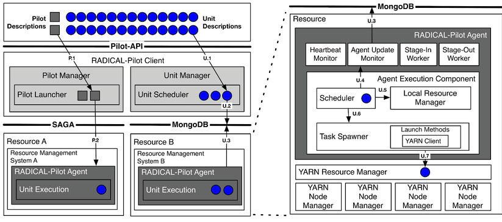
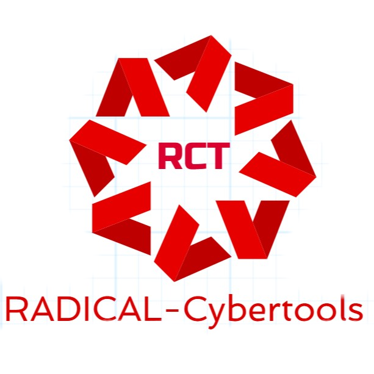
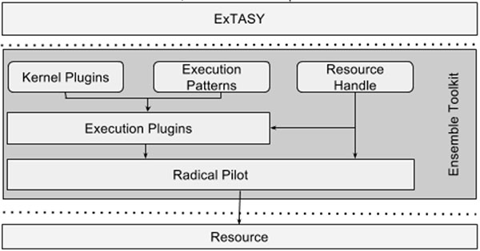
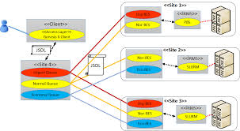
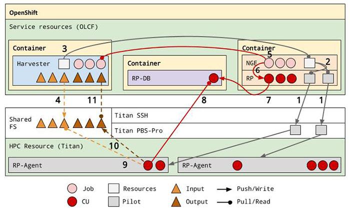
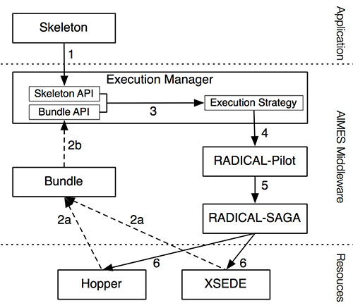
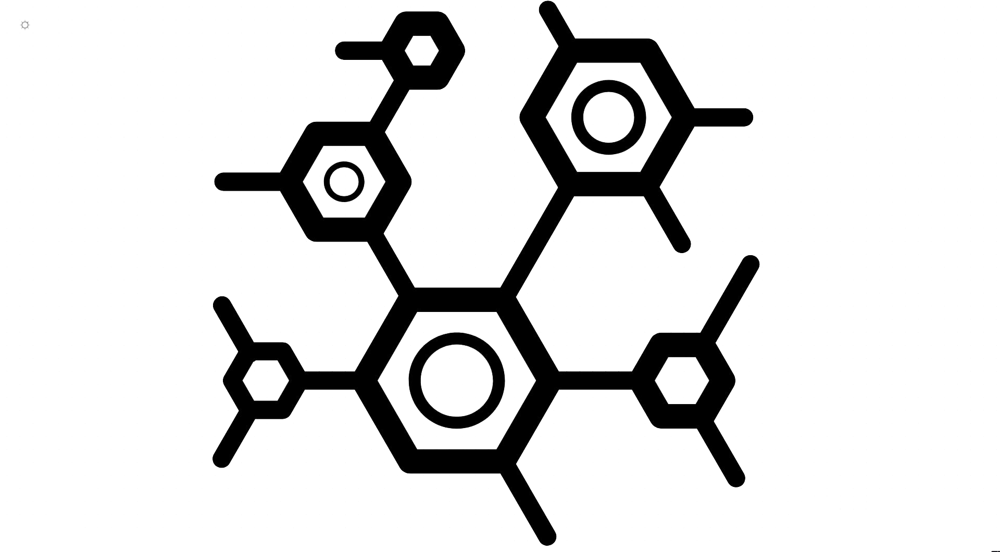

Last login: Wed Dec  5 09:07:17 on console
✔ ~ 
09:56 $ df
Filesystem    512-blocks      Used Available Capacity iused               ifree %iused  Mounted on
/dev/disk1s1   236568496 189773528  43358000    82% 1311337 9223372036853464470    0%   /
devfs                372       372         0   100%     644                   0  100%   /dev
/dev/disk1s4   236568496   2097488  43358000     5%       1 9223372036854775806    0%   /private/var/vm
map -hosts             0         0         0   100%       0                   0  100%   /net
map auto_home          0         0         0   100%       0                   0  100%   /home
✔ ~ 
09:56 $ df -h
Filesystem      Size   Used  Avail Capacity iused               ifree %iused  Mounted on
/dev/disk1s1   113Gi   91Gi   21Gi    82% 1311389 9223372036853464418    0%   /
devfs          186Ki  186Ki    0Bi   100%     644                   0  100%   /dev
/dev/disk1s4   113Gi  1.0Gi   21Gi     5%       1 9223372036854775806    0%   /private/var/vm
map -hosts       0Bi    0Bi    0Bi   100%       0                   0  100%   /net
map auto_home    0Bi    0Bi    0Bi   100%       0                   0  100%   /home
✔ ~ 
09:56 $ brew upgrade
Updating Homebrew...
==> Auto-updated Homebrew!
Updated 2 taps (homebrew/core and homebrew/cask).
==> Updated Formulae
abyss             conan             fwup              jena              mercurial         pig               smimesign         taskell           twoping
azure-cli         exploitdb         fx                kustomize         percona-server    ppsspp            stone-soup        tile38            up
binaryen          fswatch           grails            libbtbb           picard-tools      rke               syncthing         tomcat-native     v8
xcrun: error: invalid active developer path (/Library/Developer/CommandLineTools), missing xcrun at: /Library/Developer/CommandLineTools/usr/bin/xcrun

xcrun: error: invalid active developer path (/Library/Developer/CommandLineTools), missing xcrun at: /Library/Developer/CommandLineTools/usr/bin/xcrun
==> Upgrading 2 outdated packages:
sqlite 3.25.3 -> 3.26.0, youtube-dl 2018.11.23 -> 2018.12.03
==> Upgrading sqlite 
==> Downloading https://homebrew.bintray.com/bottles/sqlite-3.26.0.mojave.bottle.tar.gz
######################################################################## 100.0%
==> Pouring sqlite-3.26.0.mojave.bottle.tar.gz
==> Caveats
sqlite is keg-only, which means it was not symlinked into /usr/local,
because macOS provides an older sqlite3.

If you need to have sqlite first in your PATH run:
  echo 'export PATH="/usr/local/opt/sqlite/bin:$PATH"' >> ~/.bash_profile

For compilers to find sqlite you may need to set:
  export LDFLAGS="-L/usr/local/opt/sqlite/lib"
  export CPPFLAGS="-I/usr/local/opt/sqlite/include"

For pkg-config to find sqlite you may need to set:
  export PKG_CONFIG_PATH="/usr/local/opt/sqlite/lib/pkgconfig"

==> Summary
🍺  /usr/local/Cellar/sqlite/3.26.0: 11 files, 3.7MB
==> Upgrading youtube-dl 
xcrun: error: invalid active developer path (/Library/Developer/CommandLineTools), missing xcrun at: /Library/Developer/CommandLineTools/usr/bin/xcrun
==> Downloading https://github.com/rg3/youtube-dl/releases/download/2018.12.03/youtube-dl-2018.12.03.tar.gz
==> Downloading from https://github-production-release-asset-2e65be.s3.amazonaws.com/1039520/0a1a0100-f690-11e8-9ded-586164b3c63b?X-Amz-Algorithm=AWS4-HMAC-SHA256&X-
######################################################################## 100.0%
==> Caveats
Bash completion has been installed to:
  /usr/local/etc/bash_completion.d

zsh completions have been installed to:
  /usr/local/share/zsh/site-functions
==> Summary
🍺  /usr/local/Cellar/youtube-dl/2018.12.03: 12 files, 2MB, built in 10 seconds
==> Caveats
==> sqlite
sqlite is keg-only, which means it was not symlinked into /usr/local,
because macOS provides an older sqlite3.

If you need to have sqlite first in your PATH run:
  echo 'export PATH="/usr/local/opt/sqlite/bin:$PATH"' >> ~/.bash_profile

For compilers to find sqlite you may need to set:
  export LDFLAGS="-L/usr/local/opt/sqlite/lib"
  export CPPFLAGS="-I/usr/local/opt/sqlite/include"

For pkg-config to find sqlite you may need to set:
  export PKG_CONFIG_PATH="/usr/local/opt/sqlite/lib/pkgconfig"

==> youtube-dl
Bash completion has been installed to:
  /usr/local/etc/bash_completion.d

zsh completions have been installed to:
  /usr/local/share/zsh/site-functions
✔ ~ 
09:57 $ cd github/
classes/                 papers/                  proposals/               radical-group/           references/              
experiments/             projects/                radical-cybertools/      radical-group.github.io/ theses/                  
✔ ~ 
09:57 $ cd github/radical-group.github.io/
✔ ~/github/radical-group.github.io [master|…5] 
15:16 $ jekyll serve
Traceback (most recent call last):
	15: from /usr/local/lib/ruby/gems/2.5.0/bin/jekyll:23:in `<main>'
	14: from /usr/local/lib/ruby/gems/2.5.0/bin/jekyll:23:in `load'
	13: from /usr/local/lib/ruby/gems/2.5.0/gems/jekyll-3.8.5/exe/jekyll:11:in `<top (required)>'
	12: from /usr/local/lib/ruby/gems/2.5.0/gems/jekyll-3.8.5/lib/jekyll/plugin_manager.rb:50:in `require_from_bundler'
	11: from /usr/local/Cellar/ruby/2.5.3_1/lib/ruby/2.5.0/bundler.rb:107:in `setup'
	10: from /usr/local/Cellar/ruby/2.5.3_1/lib/ruby/2.5.0/bundler/runtime.rb:20:in `setup'
	 9: from /usr/local/Cellar/ruby/2.5.3_1/lib/ruby/2.5.0/bundler/runtime.rb:108:in `block in definition_method'
	 8: from /usr/local/Cellar/ruby/2.5.3_1/lib/ruby/2.5.0/bundler/definition.rb:227:in `requested_specs'
	 7: from /usr/local/Cellar/ruby/2.5.3_1/lib/ruby/2.5.0/bundler/definition.rb:238:in `specs_for'
	 6: from /usr/local/Cellar/ruby/2.5.3_1/lib/ruby/2.5.0/bundler/definition.rb:171:in `specs'
	 5: from /usr/local/Cellar/ruby/2.5.3_1/lib/ruby/2.5.0/bundler/definition.rb:258:in `resolve'
	 4: from /usr/local/Cellar/ruby/2.5.3_1/lib/ruby/2.5.0/bundler/resolver.rb:22:in `resolve'
	 3: from /usr/local/Cellar/ruby/2.5.3_1/lib/ruby/2.5.0/bundler/resolver.rb:48:in `start'
	 2: from /usr/local/Cellar/ruby/2.5.3_1/lib/ruby/2.5.0/bundler/resolver.rb:257:in `verify_gemfile_dependencies_are_found!'
	 1: from /usr/local/Cellar/ruby/2.5.3_1/lib/ruby/2.5.0/bundler/resolver.rb:257:in `each'
/usr/local/Cellar/ruby/2.5.3_1/lib/ruby/2.5.0/bundler/resolver.rb:289:in `block in verify_gemfile_dependencies_are_found!': Could not find gem 'jekyll-sitemap' in any of the gem sources listed in your Gemfile. (Bundler::GemNotFound)
✘-1 ~/github/radical-group.github.io [master ↓·7|…5] 
15:16 $ gem install jekyll
Successfully installed jekyll-3.8.5
Parsing documentation for jekyll-3.8.5
Installing ri documentation for jekyll-3.8.5
Done installing documentation for jekyll after 2 seconds
1 gem installed
✔ ~/github/radical-group.github.io [master ↓·7|…5] 
15:17 $ gem install rouge
Successfully installed rouge-3.3.0
Parsing documentation for rouge-3.3.0
Done installing documentation for rouge after 3 seconds
1 gem installed
✔ ~/github/radical-group.github.io [master ↓·7|…5] 
15:17 $ gem install jekyll-redirect-from
Successfully installed jekyll-redirect-from-0.14.0
Parsing documentation for jekyll-redirect-from-0.14.0
Done installing documentation for jekyll-redirect-from after 0 seconds
1 gem installed
✔ ~/github/radical-group.github.io [master ↓·7|…5] 
15:17 $ gem install bundler
Fetching: bundler-1.17.1.gem (100%)
bundler's executable "bundle" conflicts with /usr/local/lib/ruby/gems/2.5.0/bin/bundle
Overwrite the executable? [yN]  
ERROR:  Error installing bundler:
	"bundle" from bundler conflicts with /usr/local/lib/ruby/gems/2.5.0/bin/bundle
✘-1 ~/github/radical-group.github.io [master ↓·7|…5] 
15:18 $ gem install html-proofer
Successfully installed html-proofer-3.9.3
Parsing documentation for html-proofer-3.9.3
Installing ri documentation for html-proofer-3.9.3
Done installing documentation for html-proofer after 0 seconds
1 gem installed
✔ ~/github/radical-group.github.io [master ↓·7|…5] 
15:18 $ jekyll serve
Traceback (most recent call last):
	15: from /usr/local/lib/ruby/gems/2.5.0/bin/jekyll:23:in `<main>'
	14: from /usr/local/lib/ruby/gems/2.5.0/bin/jekyll:23:in `load'
	13: from /usr/local/lib/ruby/gems/2.5.0/gems/jekyll-3.8.5/exe/jekyll:11:in `<top (required)>'
	12: from /usr/local/lib/ruby/gems/2.5.0/gems/jekyll-3.8.5/lib/jekyll/plugin_manager.rb:50:in `require_from_bundler'
	11: from /usr/local/Cellar/ruby/2.5.3_1/lib/ruby/2.5.0/bundler.rb:107:in `setup'
	10: from /usr/local/Cellar/ruby/2.5.3_1/lib/ruby/2.5.0/bundler/runtime.rb:20:in `setup'
	 9: from /usr/local/Cellar/ruby/2.5.3_1/lib/ruby/2.5.0/bundler/runtime.rb:108:in `block in definition_method'
	 8: from /usr/local/Cellar/ruby/2.5.3_1/lib/ruby/2.5.0/bundler/definition.rb:227:in `requested_specs'
	 7: from /usr/local/Cellar/ruby/2.5.3_1/lib/ruby/2.5.0/bundler/definition.rb:238:in `specs_for'
	 6: from /usr/local/Cellar/ruby/2.5.3_1/lib/ruby/2.5.0/bundler/definition.rb:171:in `specs'
	 5: from /usr/local/Cellar/ruby/2.5.3_1/lib/ruby/2.5.0/bundler/definition.rb:258:in `resolve'
	 4: from /usr/local/Cellar/ruby/2.5.3_1/lib/ruby/2.5.0/bundler/resolver.rb:22:in `resolve'
	 3: from /usr/local/Cellar/ruby/2.5.3_1/lib/ruby/2.5.0/bundler/resolver.rb:48:in `start'
	 2: from /usr/local/Cellar/ruby/2.5.3_1/lib/ruby/2.5.0/bundler/resolver.rb:257:in `verify_gemfile_dependencies_are_found!'
	 1: from /usr/local/Cellar/ruby/2.5.3_1/lib/ruby/2.5.0/bundler/resolver.rb:257:in `each'
/usr/local/Cellar/ruby/2.5.3_1/lib/ruby/2.5.0/bundler/resolver.rb:289:in `block in verify_gemfile_dependencies_are_found!': Could not find gem 'jekyll-sitemap' in any of the gem sources listed in your Gemfile. (Bundler::GemNotFound)
✘-1 ~/github/radical-group.github.io [master ↓·7|…5] 
15:18 $ gem install jekyll-sitemap
Fetching: jekyll-sitemap-1.2.0.gem (100%)
Successfully installed jekyll-sitemap-1.2.0
Parsing documentation for jekyll-sitemap-1.2.0
Installing ri documentation for jekyll-sitemap-1.2.0
Done installing documentation for jekyll-sitemap after 0 seconds
1 gem installed
✔ ~/github/radical-group.github.io [master ↓·7|…5] 
15:18 $ jekyll serve
Configuration file: /Users/mturilli/github/radical-group.github.io/_config.yml
            Source: /Users/mturilli/github/radical-group.github.io
       Destination: /Users/mturilli/github/radical-group.github.io/_site
 Incremental build: disabled. Enable with --incremental
      Generating... 
                    done in 1.444 seconds.
 Auto-regeneration: enabled for '/Users/mturilli/github/radical-group.github.io'
    Server address: http://127.0.0.1:4000
  Server running... press ctrl-c to stop.

^Z
[1]+  Stopped                 jekyll serve
✘-TSTP ~/github/radical-group.github.io [master ↓·7|…5] 
15:19 $ bg
[1]+ jekyll serve &
✔ ~/github/radical-group.github.io [master ↓·7|…5] 
15:19 $ [2018-12-05 15:19:22] ERROR `/favicon.ico' not found.
      Regenerating: 1 file(s) changed at 2018-12-05 15:20:05
                    _projects/bigpanda.md
                    ...done in 1.113178 seconds.
                    
      Regenerating: 1 file(s) changed at 2018-12-05 15:21:32
                    _projects/bigpanda.md
                    ...done in 1.101443 seconds.
                    

✔ ~/github/radical-group.github.io [master ↓·7|…5] 
16:12 $ git status .
On branch master
Your branch is behind 'origin/master' by 7 commits, and can be fast-forwarded.
  (use "git pull" to update your local branch)

Untracked files:
  (use "git add <file>..." to include in what will be committed)

	_projects/bigpanda.md
	images/projects/bigpanda.jpg
	images/projects/bigpanda_logo.jpg
	images/projects/bigpanda_logo_original.jpg
	images/projects/bigpanda_original.jpg

nothing added to commit but untracked files present (use "git add" to track)
✔ ~/github/radical-group.github.io [master ↓·7|…5] 
16:12 $       Regenerating: 1 file(s) changed at 2018-12-05 16:17:48
                    style.scss
                    ...done in 1.243126 seconds.
                    
      Regenerating: 1 file(s) changed at 2018-12-05 16:18:02
                    projects.md
                    ...done in 0.978705 seconds.
                    
      Regenerating: 1 file(s) changed at 2018-12-05 16:18:24
                    projects.md
                    ...done in 0.976113 seconds.
                    
      Regenerating: 1 file(s) changed at 2018-12-05 16:18:32
                    projects.md
                    ...done in 0.999591 seconds.
                    
      Regenerating: 1 file(s) changed at 2018-12-05 16:20:59
                    projects.md
                    ...done in 1.068827 seconds.
                    
[2018-12-05 16:21:08] ERROR `/favicon.ico' not found.
      Regenerating: 1 file(s) changed at 2018-12-05 16:21:37
                    projects.md
                    ...done in 1.106381 seconds.
                    
      Regenerating: 1 file(s) changed at 2018-12-05 16:22:10
                    projects.md
                    ...done in 1.060781 seconds.
                    
      Regenerating: 1 file(s) changed at 2018-12-05 16:23:00
                    style.scss
                    ...done in 0.911832 seconds.
                    
      Regenerating: 1 file(s) changed at 2018-12-05 16:23:05
                    style.scss
                    ...done in 0.99126 seconds.
                    

✔ ~/github/radical-group.github.io [master ↓·7|✚ 2…5] 
16:23 $ git status .
On branch master
Your branch is behind 'origin/master' by 7 commits, and can be fast-forwarded.
  (use "git pull" to update your local branch)

Changes not staged for commit:
  (use "git add <file>..." to update what will be committed)
  (use "git checkout -- <file>..." to discard changes in working directory)

	modified:   projects.md
	modified:   style.scss

Untracked files:
  (use "git add <file>..." to include in what will be committed)

	_projects/bigpanda.md
	images/projects/bigpanda.jpg
	images/projects/bigpanda_logo.jpg
	images/projects/bigpanda_logo_original.jpg
	images/projects/bigpanda_original.jpg

no changes added to commit (use "git add" and/or "git commit -a")
✔ ~/github/radical-group.github.io [master ↓·7|✚ 2…5] 
16:23 $ git branch content/project/bigpanda
✔ ~/github/radical-group.github.io [master ↓·7|✚ 2…5] 
16:23 $ git checkout content/project/bigpanda 
M	projects.md
M	style.scss
Switched to branch 'content/project/bigpanda'
✔ ~/github/radical-group.github.io [content/project/bigpanda L|✚ 2…5] 
16:24 $ git status .
On branch content/project/bigpanda
Changes not staged for commit:
  (use "git add <file>..." to update what will be committed)
  (use "git checkout -- <file>..." to discard changes in working directory)

	modified:   projects.md
	modified:   style.scss

Untracked files:
  (use "git add <file>..." to include in what will be committed)

	_projects/bigpanda.md
	images/projects/bigpanda.jpg
	images/projects/bigpanda_logo.jpg
	images/projects/bigpanda_logo_original.jpg
	images/projects/bigpanda_original.jpg

no changes added to commit (use "git add" and/or "git commit -a")
✔ ~/github/radical-group.github.io [content/project/bigpanda L|✚ 2…5] 
16:24 $ git add projects.md style.scss _projects/bigpanda.md images/projects/bigpanda*
✔ ~/github/radical-group.github.io [content/project/bigpanda L|●7] 
16:24 $ git status .
On branch content/project/bigpanda
Changes to be committed:
  (use "git reset HEAD <file>..." to unstage)

	new file:   _projects/bigpanda.md
	new file:   images/projects/bigpanda.jpg
	new file:   images/projects/bigpanda_logo.jpg
	new file:   images/projects/bigpanda_logo_original.jpg
	new file:   images/projects/bigpanda_original.jpg
	modified:   projects.md
	modified:   style.scss

✔ ~/github/radical-group.github.io [content/project/bigpanda L|●7] 
16:24 $ git commit -m 'Adds BigPanDA project'
[content/project/bigpanda 7a670ec] Adds BigPanDA project
 7 files changed, 20 insertions(+), 3 deletions(-)
 create mode 100644 _projects/bigpanda.md
 create mode 100644 images/projects/bigpanda.jpg
 create mode 100644 images/projects/bigpanda_logo.jpg
 create mode 100644 images/projects/bigpanda_logo_original.jpg
 create mode 100644 images/projects/bigpanda_original.jpg
✔ ~/github/radical-group.github.io [content/project/bigpanda L|✔] 
16:25 $ git push
Enumerating objects: 18, done.
Counting objects: 100% (18/18), done.
Delta compression using up to 4 threads
Compressing objects: 100% (12/12), done.
Writing objects: 100% (12/12), 642.62 KiB | 18.90 MiB/s, done.
Total 12 (delta 6), reused 0 (delta 0)
remote: Resolving deltas: 100% (6/6), completed with 6 local objects.
remote: 
remote: Create a pull request for 'content/project/bigpanda' on GitHub by visiting:
remote:      https://github.com/radical-group/radical-group.github.io/pull/new/content/project/bigpanda
remote: 
To github.com:radical-group/radical-group.github.io.git
 * [new branch]      content/project/bigpanda -> content/project/bigpanda
✔ ~/github/radical-group.github.io [content/project/bigpanda L|✔] 
16:25 $ git checkout master
Switched to branch 'master'
Your branch is behind 'origin/master' by 7 commits, and can be fast-forwarded.
  (use "git pull" to update your local branch)
✔ ~/github/radical-group.github.io [master ↓·7|✔] 
16:28 $       Regenerating: 7 file(s) changed at 2018-12-05 16:28:22
                    projects.md
                    style.scss
                    _projects/bigpanda.md
                    images/projects/bigpanda.jpg
                    images/projects/bigpanda_logo.jpg
                    images/projects/bigpanda_logo_original.jpg
                    images/projects/bigpanda_original.jpg
                    ...done in 1.181796 seconds.
                    

✔ ~/github/radical-group.github.io [master ↓·7|✔] 
16:28 $ git pull
Updating c14ee26..f61c678
Fast-forward
 _includes/navbar.html                    |   2 ++
 _projects/cybermanufacturing.md          |  19 +++++++++++++++++++
 _projects/ffp.md                         |  18 ++++++++++++++++++
 images/projects/{FFP_New.png => ffp.png} | Bin
 images/projects/ffp_logo.png             | Bin 0 -> 6208 bytes
 people.md                                |   4 ++--
 projects.md                              |   2 +-
 7 files changed, 42 insertions(+), 3 deletions(-)
 create mode 100644 _projects/cybermanufacturing.md
 create mode 100644 _projects/ffp.md
 rename images/projects/{FFP_New.png => ffp.png} (100%)
 create mode 100644 images/projects/ffp_logo.png
      Regenerating: 8 file(s) changed at 2018-12-05 16:28:30
                    _includes/navbar.html
                    people.md
                    projects.md
                    _projects/cybermanufacturing.md
                    _projects/ffp.md
                    images/projects/ffp_logo.png
                    images/projects/ffp.png
                    images/projects/FFP_New.png
✔ ~/github/radical-group.github.io [master|✔] 
16:28 $                     ...done in 0.943698 seconds.
                    

✔ ~/github/radical-group.github.io [master|✔] 
16:28 $ 
✔ ~/github/radical-group.github.io [master|✔] 
16:30 $ cp ~/Desktop/Screen\ Shot\ 2018- sea_ice_level
Screen Shot 2018-09-22 at 7.19.41 PM.png   Screen Shot 2018-10-10 at 10.36.05 AM.png  Screen Shot 2018-11-21 at 11.42.35 AM.png
Screen Shot 2018-09-22 at 7.23.32 PM.png   Screen Shot 2018-10-29 at 11.27.35 AM.png  Screen Shot 2018-12-05 at 4.42.35 PM.png
Screen Shot 2018-10-10 at 10.15.52 AM.png  Screen Shot 2018-11-15 at 6.33.36 AM.png   
✔ ~/github/radical-group.github.io [master|✔] 
16:30 $ cp ~/Desktop/Screen\ Shot\ 2018- sea_ice_level
Screen Shot 2018-09-22 at 7.19.41 PM.png   Screen Shot 2018-10-10 at 10.36.05 AM.png  Screen Shot 2018-11-21 at 11.42.35 AM.png
Screen Shot 2018-09-22 at 7.23.32 PM.png   Screen Shot 2018-10-29 at 11.27.35 AM.png  Screen Shot 2018-12-05 at 4.42.35 PM.png
Screen Shot 2018-10-10 at 10.15.52 AM.png  Screen Shot 2018-11-15 at 6.33.36 AM.png   
✔ ~/github/radical-group.github.io [master|✔] 
16:30 $ cp ~/Desktop/Screen\ Shot\ 2018-12-05\ at\ 4.42.35\ PM.png images/projects/sea_ice_level_original.png
✔ ~/github/radical-group.github.io [master|…1] 
16:55 $       Regenerating: 1 file(s) changed at 2018-12-05 16:55:00
                    images/projects/sea_ice_level_original.png
                    ...done in 1.042477 seconds.
                    

✔ ~/github/radical-group.github.io [master|…1] 
16:55 $       Regenerating: 1 file(s) changed at 2018-12-05 16:57:16
                    images/projects/sea_ice_level.jpg
                    ...done in 1.091871 seconds.
                    
      Regenerating: 1 file(s) changed at 2018-12-05 16:58:39
                    images/projects/sea_ice_level_logo.jpg
                    ...done in 1.034345 seconds.
                    

✔ ~/github/radical-group.github.io [master|…3] 
16:59 $       Regenerating: 1 file(s) changed at 2018-12-05 16:59:38
                    _projects/sea_ice_level.md
                    ...done in 1.089988 seconds.
                    
      Regenerating: 1 file(s) changed at 2018-12-05 17:07:48
                    _projects/sea_ice_level.md
                    ...done in 1.424249 seconds.
                    
      Regenerating: 1 file(s) changed at 2018-12-05 17:11:20
                    _projects/sea_ice_level.md
                    ...done in 1.175946 seconds.
                    
      Regenerating: 1 file(s) changed at 2018-12-05 17:12:43
                    _projects/sea_ice_level.md
                    ...done in 1.08651 seconds.
                    
      Regenerating: 1 file(s) changed at 2018-12-05 17:12:52
                    _projects/sea_ice_level.md
                    ...done in 1.17098 seconds.
                    
      Regenerating: 1 file(s) changed at 2018-12-05 17:13:02
                    _projects/sea_ice_level.md
                    ...done in 1.185276 seconds.
                    

✔ ~/github/radical-group.github.io [master|…4] 
17:13 $ mv images/projects/sea_ice_level_original.png images/projects/sea_level_rise_original.png
✔ ~/github/radical-group.github.io [master|…4] 
17:13 $       Regenerating: 2 file(s) changed at 2018-12-05 17:13:49
                    images/projects/sea_level_rise_original.png
                    images/projects/sea_ice_level_original.png

                    ...done in 1.003888 seconds.
                    
✔ ~/github/radical-group.github.io [master|…4] 
17:13 $ cd images/projects/
✔ ~/github/radical-group.github.io/images/projects [master|…4] 
17:13 $ mv sea_ice_level_logo.jpg sea_level_rise_logo.jpg
✔ ~/github/radical-group.github.io/images/projects [master|…4] 
17:14 $       Regenerating: 2 file(s) changed at 2018-12-05 17:14:12
                    images/projects/sea_level_rise_logo.jpg
                    images/projects/sea_ice_level_logo.jpg
                    ...done in 1.003202 seconds.
                    

✔ ~/github/radical-group.github.io/images/projects [master|…4] 
17:14 $ mv sea_ice_level.jpg sea_level_rise.jpg
✔ ~/github/radical-group.github.io/images/projects [master|…4] 
17:14 $       Regenerating: 2 file(s) changed at 2018-12-05 17:14:30
                    images/projects/sea_level_rise.jpg
                    images/projects/sea_ice_level.jpg
                    ...done in 0.980023 seconds.
                    
      Regenerating: 1 file(s) changed at 2018-12-05 17:14:57
                    _projects/sea_ice_level.md
                    ...done in 1.414044 seconds.
                    

✔ ~/github/radical-group.github.io/images/projects [master|…4] 
17:15 $ git status .
On branch master
Your branch is up to date with 'origin/master'.

Untracked files:
  (use "git add <file>..." to include in what will be committed)

	sea_level_rise.jpg
	sea_level_rise_logo.jpg
	sea_level_rise_original.png

nothing added to commit but untracked files present (use "git add" to track)
✔ ~/github/radical-group.github.io/images/projects [master|…4] 
17:16 $       Regenerating: 1 file(s) changed at 2018-12-05 17:16:27
                    _projects/sea_ice_level.md
                    ...done in 1.187309 seconds.
                    

✔ ~/github/radical-group.github.io/images/projects [master|…4] 
17:16 $ git status .
On branch master
Your branch is up to date with 'origin/master'.

Untracked files:
  (use "git add <file>..." to include in what will be committed)

	sea_level_rise.jpg
	sea_level_rise_logo.jpg
	sea_level_rise_original.png

nothing added to commit but untracked files present (use "git add" to track)
✔ ~/github/radical-group.github.io/images/projects [master|…4] 
17:16 $ cd ..
✔ ~/github/radical-group.github.io/images [master|…4] 
17:20 $ cd ..
✔ ~/github/radical-group.github.io [master|…4] 
17:20 $ git branch content/project/sea_level_rise
✔ ~/github/radical-group.github.io [master|…4] 
17:20 $ git checkout content/project/sea_level_rise_
error: pathspec 'content/project/sea_level_rise_' did not match any file(s) known to git
✘-1 ~/github/radical-group.github.io [master|…4] 
17:20 $ git checkout content/project/sea_level_rise
Switched to branch 'content/project/sea_level_rise'
✔ ~/github/radical-group.github.io [content/project/sea_level_rise L|…4] 
17:20 $ git status .
On branch content/project/sea_level_rise
Untracked files:
  (use "git add <file>..." to include in what will be committed)

	_projects/sea_ice_level.md
	images/projects/sea_level_rise.jpg
	images/projects/sea_level_rise_logo.jpg
	images/projects/sea_level_rise_original.png

nothing added to commit but untracked files present (use "git add" to track)
✔ ~/github/radical-group.github.io [content/project/sea_level_rise L|…4] 
17:20 $ git add _projects/sea_ice_level.md images/projects/*
✔ ~/github/radical-group.github.io [content/project/sea_level_rise L|●4] 
17:21 $ git status .
On branch content/project/sea_level_rise
Changes to be committed:
  (use "git reset HEAD <file>..." to unstage)

	new file:   _projects/sea_ice_level.md
	new file:   images/projects/sea_level_rise.jpg
	new file:   images/projects/sea_level_rise_logo.jpg
	new file:   images/projects/sea_level_rise_original.png

✔ ~/github/radical-group.github.io [content/project/sea_level_rise L|●4] 
17:21 $ git commit -m 'Adds Sea Level Rise project, ticket #80'
[content/project/sea_level_rise 75f4897] Adds Sea Level Rise project, ticket #80
 4 files changed, 15 insertions(+)
 create mode 100644 _projects/sea_ice_level.md
 create mode 100644 images/projects/sea_level_rise.jpg
 create mode 100644 images/projects/sea_level_rise_logo.jpg
 create mode 100644 images/projects/sea_level_rise_original.png
✔ ~/github/radical-group.github.io [content/project/sea_level_rise L|✔] 
17:21 $ git push
Enumerating objects: 13, done.
Counting objects: 100% (13/13), done.
Delta compression using up to 4 threads
Compressing objects: 100% (9/9), done.
Writing objects: 100% (9/9), 312.79 KiB | 18.40 MiB/s, done.
Total 9 (delta 4), reused 0 (delta 0)
remote: Resolving deltas: 100% (4/4), completed with 4 local objects.
remote: 
remote: Create a pull request for 'content/project/sea_level_rise' on GitHub by visiting:
remote:      https://github.com/radical-group/radical-group.github.io/pull/new/content/project/sea_level_rise
remote: 
To github.com:radical-group/radical-group.github.io.git
 * [new branch]      content/project/sea_level_rise -> content/project/sea_level_rise
✔ ~/github/radical-group.github.io [content/project/sea_level_rise L|✔] 
17:21 $ git branch

✔ ~/github/radical-group.github.io [content/project/sea_level_rise L|✔] 
23:35 $ 
✔ ~/github/radical-group.github.io [content/project/sea_level_rise L|✔] 
23:35 $ git branch
✔ ~/github/radical-group.github.io [content/project/sea_level_rise L|✔] 
23:36 $ git checkout master
Switched to branch 'master'
Your branch is up to date with 'origin/master'.
✔ ~/github/radical-group.github.io [master|✔] 
23:36 $       Regenerating: 4 file(s) changed at 2018-12-05 23:36:12
                    _projects/sea_ice_level.md
                    images/projects/sea_level_rise_original.png
                    images/projects/sea_level_rise_logo.jpg
                    images/projects/sea_level_rise.jpg
                    ...done in 1.185679 seconds.
                    

✔ ~/github/radical-group.github.io [master|✔] 
23:36 $ git pull
Already up to date.
✔ ~/github/radical-group.github.io [master|✔] 
23:36 $       Regenerating: 1 file(s) changed at 2018-12-06 03:53:18
                    style.scss
                    ...done in 1.226372 seconds.
                    
      Regenerating: 1 file(s) changed at 2018-12-06 03:53:59
                    _layouts/publications.html
                    ...done in 1.136731 seconds.
                    
      Regenerating: 1 file(s) changed at 2018-12-06 03:54:07
                    style.scss
                    ...done in 1.014855 seconds.
                    
      Regenerating: 1 file(s) changed at 2018-12-06 03:57:21
                    _layouts/publications.html
                    ...done in 1.12871 seconds.
                    
      Regenerating: 1 file(s) changed at 2018-12-06 03:58:38
                    style.scss
                    ...done in 1.280632 seconds.
                    
      Regenerating: 1 file(s) changed at 2018-12-06 05:11:54
                    _publications/allen2011practical.md
                    ...done in 1.155098 seconds.
                    
      Regenerating: 1 file(s) changed at 2018-12-06 05:12:05
                    _publications/balasubramanian2016ensemble.md
                    ...done in 1.123297 seconds.
                    
      Regenerating: 1 file(s) changed at 2018-12-06 05:12:08
                    _publications/balasubramanian2018adaptive.md
                    ...done in 1.132527 seconds.
                    
      Regenerating: 1 file(s) changed at 2018-12-06 05:12:37
                    _publications/balasubramanian2018extasy.md
                    ...done in 0.994667 seconds.
                    
      Regenerating: 1 file(s) changed at 2018-12-06 05:12:45
                    _publications/balasubramanian2018harnessing.md
                    ...done in 1.073487 seconds.
                    
      Regenerating: 1 file(s) changed at 2018-12-06 05:13:12
                    _publications/billings2017toward.md
                    ...done in 1.187067 seconds.
                    
      Regenerating: 1 file(s) changed at 2018-12-06 05:13:20
                    _publications/burger2010what.md
                    ...done in 1.140934 seconds.
                    
      Regenerating: 1 file(s) changed at 2018-12-06 05:13:37
                    _publications/dakka2017htbac.md
                    ...done in 0.999135 seconds.
                    
      Regenerating: 1 file(s) changed at 2018-12-06 05:14:37
                    _publications/dakka2017learning.md
                    ...done in 1.03165 seconds.
                    
      Regenerating: 1 file(s) changed at 2018-12-06 05:14:47
                    _publications/dakka2018concurrent.md
                    ...done in 1.039007 seconds.
                    
      Regenerating: 1 file(s) changed at 2018-12-06 05:15:07
                    _publications/dakka2018scale.md
                    ...done in 1.032526 seconds.
                    
      Regenerating: 1 file(s) changed at 2018-12-06 05:15:42
                    _publications/de2016integration.md
                    ...done in 0.961232 seconds.
                    
      Regenerating: 1 file(s) changed at 2018-12-06 05:16:19
                    _publications/elkhamra2009developing.md
                    ...done in 1.095185 seconds.
                    
      Regenerating: 1 file(s) changed at 2018-12-06 05:16:28
                    _publications/elkhamra2009modelling.md
                    ...done in 1.132158 seconds.
                    
      Regenerating: 1 file(s) changed at 2018-12-06 05:16:36
                    _publications/elkhamra2010modelling.md
                    ...done in 1.137772 seconds.
                    
      Regenerating: 1 file(s) changed at 2018-12-06 05:16:47
                    _publications/fisher2012saga.md
                    ...done in 1.101465 seconds.
                    
      Regenerating: 1 file(s) changed at 2018-12-06 05:16:55
                    _publications/fox2015implications.md
                    ...done in 1.095836 seconds.
                    
      Regenerating: 1 file(s) changed at 2018-12-06 05:17:04
                    _publications/fox2015scalable.md
                    ...done in 1.297514 seconds.
                    
      Regenerating: 1 file(s) changed at 2018-12-06 05:17:23
                    _publications/fox2015workshop.md
                    ...done in 1.139244 seconds.
                    
      Regenerating: 1 file(s) changed at 2018-12-06 05:17:32
                    _publications/goodale2006saga.md
                    ...done in 1.067879 seconds.
                    
      Regenerating: 1 file(s) changed at 2018-12-06 05:17:39
                    _publications/goodale2007simple.md
                    ...done in 1.082 seconds.
                    
      Regenerating: 1 file(s) changed at 2018-12-06 05:49:36
                    _publications/ha2018towards.md
                    ...done in 1.139919 seconds.
                    
      Regenerating: 1 file(s) changed at 2018-12-06 05:50:00
                    _publications/huang2012conformational.md
                    ...done in 1.062697 seconds.
                    
      Regenerating: 1 file(s) changed at 2018-12-06 05:51:00
                    _publications/jha2007grid.md
                    ...done in 0.944027 seconds.
                    
      Regenerating: 1 file(s) changed at 2018-12-06 05:51:03
                    _publications/jha2007design.md
                    ...done in 1.100629 seconds.
                    
      Regenerating: 1 file(s) changed at 2018-12-06 05:51:04
                    _publications/jha2006requirements.md
                    ...done in 1.050591 seconds.
                    
      Regenerating: 1 file(s) changed at 2018-12-06 05:51:07
                    _publications/huang2012conformational.md
                    ...done in 0.99932 seconds.
                    
      Regenerating: 1 file(s) changed at 2018-12-06 05:51:30
                    _publications/jha2009critical.md
                    ...done in 1.020026 seconds.
                    
      Regenerating: 1 file(s) changed at 2018-12-06 05:51:41
                    _publications/jha2009using.md
                    ...done in 1.061906 seconds.
                    
      Regenerating: 1 file(s) changed at 2018-12-06 05:51:47
                    _publications/jha2009developing.md
                    ...done in 0.922733 seconds.
                    
      Regenerating: 1 file(s) changed at 2018-12-06 05:52:26
                    _publications/jha2011understanding.md
                    ...done in 1.048026 seconds.
                    
      Regenerating: 1 file(s) changed at 2018-12-06 05:52:32
                    _publications/jha2013distributed.md
                    ...done in 1.069933 seconds.
                    
      Regenerating: 1 file(s) changed at 2018-12-06 05:52:41
                    _publications/jha2013distributedexascale.md
                    ...done in 1.127121 seconds.
                    
      Regenerating: 1 file(s) changed at 2018-12-06 05:56:56
                    _publications/zhang2016application.md
                    ...done in 1.009234 seconds.
                    
      Regenerating: 1 file(s) changed at 2018-12-06 05:57:00
                    _publications/turilli2018building.md
                    ...done in 1.089642 seconds.
                    
      Regenerating: 1 file(s) changed at 2018-12-06 05:57:02
                    _publications/turilli2017building.md
                    ...done in 1.018431 seconds.
                    
      Regenerating: 1 file(s) changed at 2018-12-06 05:58:31
                    _publications/turilli2016integrating.md
                    ...done in 1.016244 seconds.
                    
      Regenerating: 1 file(s) changed at 2018-12-06 05:58:38
                    _publications/troger2014towards.md
                    ...done in 1.146209 seconds.
                    
      Regenerating: 1 file(s) changed at 2018-12-06 05:58:40
                    _publications/thota2011efficient.md
                    ...done in 1.019021 seconds.
                    
      Regenerating: 1 file(s) changed at 2018-12-06 05:58:43
                    _publications/smith2013scalable.md
                    ...done in 1.16008 seconds.
                    
      Regenerating: 1 file(s) changed at 2018-12-06 05:58:44
                    _publications/sirvent2005grid.md
                    ...done in 1.177969 seconds.
                    
      Regenerating: 1 file(s) changed at 2018-12-06 05:58:46
                    _publications/sehgal2011understanding.md
                    ...done in 1.280409 seconds.
                    
      Regenerating: 1 file(s) changed at 2018-12-06 05:58:47
                    _publications/santcross2012pilot.md
                    ...done in 1.205284 seconds.
                    
      Regenerating: 1 file(s) changed at 2018-12-06 05:58:48
                    _publications/santcroos2016executing.md
                    ...done in 1.123288 seconds.
                    
      Regenerating: 1 file(s) changed at 2018-12-06 05:58:49
                    _publications/romanus2012anatomy.md
                    ...done in 1.328049 seconds.
                    
      Regenerating: 1 file(s) changed at 2018-12-06 05:58:51
                    _publications/radak2015characterization.md
                    ...done in 1.265288 seconds.
                    
      Regenerating: 1 file(s) changed at 2018-12-06 05:58:52
                    _publications/radak2013framework.md
                    ...done in 1.132501 seconds.
                    
      Regenerating: 1 file(s) changed at 2018-12-06 05:58:54
                    _publications/paraskevakos2018task.md
             Error: YAML Exception reading /Users/mturilli/github/radical-group.github.io/_publications/paraskevakos2018task.md: (<unknown>): found unknown escape character while parsing a quoted scalar at line 10 column 11
                    ...done in 1.183768 seconds.
                    
      Regenerating: 1 file(s) changed at 2018-12-06 05:58:55
                    _publications/miceli2010understanding.md
             Error: YAML Exception reading /Users/mturilli/github/radical-group.github.io/_publications/paraskevakos2018task.md: (<unknown>): found unknown escape character while parsing a quoted scalar at line 10 column 11
             Error: YAML Exception reading /Users/mturilli/github/radical-group.github.io/_publications/merzky2018synapse.md: (<unknown>): did not find expected key while parsing a block mapping at line 2 column 1
                    ...done in 1.277848 seconds.
                    
      Regenerating: 2 file(s) changed at 2018-12-06 05:58:56
                    _publications/merzky2018synapse.md
                    _publications/merzky2018jssp.md
             Error: YAML Exception reading /Users/mturilli/github/radical-group.github.io/_publications/paraskevakos2018task.md: (<unknown>): found unknown escape character while parsing a quoted scalar at line 10 column 11
             Error: YAML Exception reading /Users/mturilli/github/radical-group.github.io/_publications/merzky2018synapse.md: (<unknown>): did not find expected key while parsing a block mapping at line 2 column 1
                    ...done in 1.393737 seconds.
                    
      Regenerating: 1 file(s) changed at 2018-12-06 05:58:58
                    _publications/merzky2017executing.md
             Error: YAML Exception reading /Users/mturilli/github/radical-group.github.io/_publications/paraskevakos2018task.md: (<unknown>): found unknown escape character while parsing a quoted scalar at line 10 column 11
             Error: YAML Exception reading /Users/mturilli/github/radical-group.github.io/_publications/merzky2018synapse.md: (<unknown>): did not find expected key while parsing a block mapping at line 2 column 1
                    ...done in 1.341442 seconds.
                    
      Regenerating: 2 file(s) changed at 2018-12-06 05:58:59
                    _publications/merzky2016synapse.md
                    _publications/merzky2015saga.md
             Error: YAML Exception reading /Users/mturilli/github/radical-group.github.io/_publications/paraskevakos2018task.md: (<unknown>): found unknown escape character while parsing a quoted scalar at line 10 column 11
             Error: YAML Exception reading /Users/mturilli/github/radical-group.github.io/_publications/merzky2018synapse.md: (<unknown>): did not find expected key while parsing a block mapping at line 2 column 1
                    ...done in 1.519428 seconds.
                    
      Regenerating: 2 file(s) changed at 2018-12-06 05:59:01
                    _publications/merzky2011sagamessage.md
                    _publications/merzky2011sagaadvert.md
             Error: YAML Exception reading /Users/mturilli/github/radical-group.github.io/_publications/paraskevakos2018task.md: (<unknown>): found unknown escape character while parsing a quoted scalar at line 10 column 11
             Error: YAML Exception reading /Users/mturilli/github/radical-group.github.io/_publications/merzky2018synapse.md: (<unknown>): did not find expected key while parsing a block mapping at line 2 column 1
                    ...done in 1.116928 seconds.
                    
      Regenerating: 1 file(s) changed at 2018-12-06 05:59:02
                    _publications/merzky2009application.md
             Error: YAML Exception reading /Users/mturilli/github/radical-group.github.io/_publications/paraskevakos2018task.md: (<unknown>): found unknown escape character while parsing a quoted scalar at line 10 column 11
             Error: YAML Exception reading /Users/mturilli/github/radical-group.github.io/_publications/merzky2018synapse.md: (<unknown>): did not find expected key while parsing a block mapping at line 2 column 1
                    ...done in 0.914806 seconds.
                    
      Regenerating: 1 file(s) changed at 2018-12-06 05:59:04
                    _publications/merzky2008saga.md
             Error: YAML Exception reading /Users/mturilli/github/radical-group.github.io/_publications/paraskevakos2018task.md: (<unknown>): found unknown escape character while parsing a quoted scalar at line 10 column 11
             Error: YAML Exception reading /Users/mturilli/github/radical-group.github.io/_publications/merzky2018synapse.md: (<unknown>): did not find expected key while parsing a block mapping at line 2 column 1
                    ...done in 1.293397 seconds.
                    
      Regenerating: 1 file(s) changed at 2018-12-06 05:59:05
                    _publications/merzky2006collection.md
             Error: YAML Exception reading /Users/mturilli/github/radical-group.github.io/_publications/paraskevakos2018task.md: (<unknown>): found unknown escape character while parsing a quoted scalar at line 10 column 11
             Error: YAML Exception reading /Users/mturilli/github/radical-group.github.io/_publications/merzky2018synapse.md: (<unknown>): did not find expected key while parsing a block mapping at line 2 column 1
                    ...done in 1.317152 seconds.
                    
      Regenerating: 2 file(s) changed at 2018-12-06 05:59:06
                    _publications/martin2014comparative.md
                    _publications/mantha2012pilot.md
             Error: YAML Exception reading /Users/mturilli/github/radical-group.github.io/_publications/paraskevakos2018task.md: (<unknown>): found unknown escape character while parsing a quoted scalar at line 10 column 11
             Error: YAML Exception reading /Users/mturilli/github/radical-group.github.io/_publications/merzky2018synapse.md: (<unknown>): did not find expected key while parsing a block mapping at line 2 column 1
                    ...done in 1.358553 seconds.
                    
      Regenerating: 1 file(s) changed at 2018-12-06 05:59:08
                    _publications/mantha2012futuregrid.md
             Error: YAML Exception reading /Users/mturilli/github/radical-group.github.io/_publications/paraskevakos2018task.md: (<unknown>): found unknown escape character while parsing a quoted scalar at line 10 column 11
             Error: YAML Exception reading /Users/mturilli/github/radical-group.github.io/_publications/merzky2018synapse.md: (<unknown>): did not find expected key while parsing a block mapping at line 2 column 1
                    ...done in 0.932553 seconds.
                    
      Regenerating: 1 file(s) changed at 2018-12-06 05:59:17
                    _publications/mahzad2017parallel.md
             Error: YAML Exception reading /Users/mturilli/github/radical-group.github.io/_publications/paraskevakos2018task.md: (<unknown>): found unknown escape character while parsing a quoted scalar at line 10 column 11
             Error: YAML Exception reading /Users/mturilli/github/radical-group.github.io/_publications/merzky2018synapse.md: (<unknown>): did not find expected key while parsing a block mapping at line 2 column 1
             Error: YAML Exception reading /Users/mturilli/github/radical-group.github.io/_publications/mahzad2017parallel.md: (<unknown>): did not find expected key while parsing a block mapping at line 2 column 1
                    ...done in 1.140885 seconds.
                    
      Regenerating: 1 file(s) changed at 2018-12-06 05:59:18
                    _publications/maddineni2012distributed.md
             Error: YAML Exception reading /Users/mturilli/github/radical-group.github.io/_publications/paraskevakos2018task.md: (<unknown>): found unknown escape character while parsing a quoted scalar at line 10 column 11
             Error: YAML Exception reading /Users/mturilli/github/radical-group.github.io/_publications/merzky2018synapse.md: (<unknown>): did not find expected key while parsing a block mapping at line 2 column 1
             Error: YAML Exception reading /Users/mturilli/github/radical-group.github.io/_publications/mahzad2017parallel.md: (<unknown>): did not find expected key while parsing a block mapping at line 2 column 1
                    ...done in 1.119548 seconds.
                    
      Regenerating: 1 file(s) changed at 2018-12-06 05:59:23
                    _publications/luckow2018pilotstreaming.md
             Error: YAML Exception reading /Users/mturilli/github/radical-group.github.io/_publications/paraskevakos2018task.md: (<unknown>): found unknown escape character while parsing a quoted scalar at line 10 column 11
             Error: YAML Exception reading /Users/mturilli/github/radical-group.github.io/_publications/merzky2018synapse.md: (<unknown>): did not find expected key while parsing a block mapping at line 2 column 1
             Error: YAML Exception reading /Users/mturilli/github/radical-group.github.io/_publications/mahzad2017parallel.md: (<unknown>): did not find expected key while parsing a block mapping at line 2 column 1
                    ...done in 1.188482 seconds.
                    
      Regenerating: 1 file(s) changed at 2018-12-06 05:59:25
                    _publications/luckow2016hadoop.md
             Error: YAML Exception reading /Users/mturilli/github/radical-group.github.io/_publications/paraskevakos2018task.md: (<unknown>): found unknown escape character while parsing a quoted scalar at line 10 column 11
             Error: YAML Exception reading /Users/mturilli/github/radical-group.github.io/_publications/merzky2018synapse.md: (<unknown>): did not find expected key while parsing a block mapping at line 2 column 1
             Error: YAML Exception reading /Users/mturilli/github/radical-group.github.io/_publications/mahzad2017parallel.md: (<unknown>): did not find expected key while parsing a block mapping at line 2 column 1
                    ...done in 1.487303 seconds.
                    
      Regenerating: 2 file(s) changed at 2018-12-06 05:59:26
                    _publications/luckow2015pilot.md
                    _publications/luckow2014pilot.md
             Error: YAML Exception reading /Users/mturilli/github/radical-group.github.io/_publications/paraskevakos2018task.md: (<unknown>): found unknown escape character while parsing a quoted scalar at line 10 column 11
             Error: YAML Exception reading /Users/mturilli/github/radical-group.github.io/_publications/merzky2018synapse.md: (<unknown>): did not find expected key while parsing a block mapping at line 2 column 1
             Error: YAML Exception reading /Users/mturilli/github/radical-group.github.io/_publications/mahzad2017parallel.md: (<unknown>): did not find expected key while parsing a block mapping at line 2 column 1
                    ...done in 1.450132 seconds.
                    
      Regenerating: 2 file(s) changed at 2018-12-06 05:59:28
                    _publications/luckow2012towards.md
                    _publications/luckow2012pstar.md
             Error: YAML Exception reading /Users/mturilli/github/radical-group.github.io/_publications/paraskevakos2018task.md: (<unknown>): found unknown escape character while parsing a quoted scalar at line 10 column 11
             Error: YAML Exception reading /Users/mturilli/github/radical-group.github.io/_publications/merzky2018synapse.md: (<unknown>): did not find expected key while parsing a block mapping at line 2 column 1
             Error: YAML Exception reading /Users/mturilli/github/radical-group.github.io/_publications/mahzad2017parallel.md: (<unknown>): did not find expected key while parsing a block mapping at line 2 column 1
                    ...done in 1.490107 seconds.
                    
      Regenerating: 2 file(s) changed at 2018-12-06 05:59:29
                    _publications/luckow2010abstractions.md
                    _publications/luckow2009adaptivedistributed.md
             Error: YAML Exception reading /Users/mturilli/github/radical-group.github.io/_publications/paraskevakos2018task.md: (<unknown>): found unknown escape character while parsing a quoted scalar at line 10 column 11
             Error: YAML Exception reading /Users/mturilli/github/radical-group.github.io/_publications/merzky2018synapse.md: (<unknown>): did not find expected key while parsing a block mapping at line 2 column 1
             Error: YAML Exception reading /Users/mturilli/github/radical-group.github.io/_publications/mahzad2017parallel.md: (<unknown>): did not find expected key while parsing a block mapping at line 2 column 1
                    ...done in 1.479751 seconds.
                    
      Regenerating: 2 file(s) changed at 2018-12-06 05:59:31
                    _publications/luckow2009adaptive.md
                    _publications/luckow2008distributed.md
             Error: YAML Exception reading /Users/mturilli/github/radical-group.github.io/_publications/paraskevakos2018task.md: (<unknown>): found unknown escape character while parsing a quoted scalar at line 10 column 11
             Error: YAML Exception reading /Users/mturilli/github/radical-group.github.io/_publications/merzky2018synapse.md: (<unknown>): did not find expected key while parsing a block mapping at line 2 column 1
             Error: YAML Exception reading /Users/mturilli/github/radical-group.github.io/_publications/mahzad2017parallel.md: (<unknown>): did not find expected key while parsing a block mapping at line 2 column 1
                    ...done in 1.448926 seconds.
                    
      Regenerating: 2 file(s) changed at 2018-12-06 05:59:32
                    _publications/loffler2011using.md
                    _publications/ko2010efficient.md
             Error: YAML Exception reading /Users/mturilli/github/radical-group.github.io/_publications/paraskevakos2018task.md: (<unknown>): found unknown escape character while parsing a quoted scalar at line 10 column 11
             Error: YAML Exception reading /Users/mturilli/github/radical-group.github.io/_publications/merzky2018synapse.md: (<unknown>): did not find expected key while parsing a block mapping at line 2 column 1
             Error: YAML Exception reading /Users/mturilli/github/radical-group.github.io/_publications/mahzad2017parallel.md: (<unknown>): did not find expected key while parsing a block mapping at line 2 column 1
                    ...done in 1.290539 seconds.
                    
      Regenerating: 1 file(s) changed at 2018-12-06 05:59:34
                    _publications/klimentov2016integration.md
             Error: YAML Exception reading /Users/mturilli/github/radical-group.github.io/_publications/paraskevakos2018task.md: (<unknown>): found unknown escape character while parsing a quoted scalar at line 10 column 11
             Error: YAML Exception reading /Users/mturilli/github/radical-group.github.io/_publications/merzky2018synapse.md: (<unknown>): did not find expected key while parsing a block mapping at line 2 column 1
             Error: YAML Exception reading /Users/mturilli/github/radical-group.github.io/_publications/mahzad2017parallel.md: (<unknown>): did not find expected key while parsing a block mapping at line 2 column 1
                    ...done in 1.455403 seconds.
                    
      Regenerating: 2 file(s) changed at 2018-12-06 05:59:35
                    _publications/klimentov2015next.md
                    _publications/kim2011energy.md
             Error: YAML Exception reading /Users/mturilli/github/radical-group.github.io/_publications/paraskevakos2018task.md: (<unknown>): found unknown escape character while parsing a quoted scalar at line 10 column 11
             Error: YAML Exception reading /Users/mturilli/github/radical-group.github.io/_publications/merzky2018synapse.md: (<unknown>): did not find expected key while parsing a block mapping at line 2 column 1
             Error: YAML Exception reading /Users/mturilli/github/radical-group.github.io/_publications/mahzad2017parallel.md: (<unknown>): did not find expected key while parsing a block mapping at line 2 column 1
                    ...done in 1.424797 seconds.
                    
      Regenerating: 2 file(s) changed at 2018-12-06 05:59:37
                    _publications/kim2011characterizing.md
                    _publications/kim2011building.md
             Error: YAML Exception reading /Users/mturilli/github/radical-group.github.io/_publications/paraskevakos2018task.md: (<unknown>): found unknown escape character while parsing a quoted scalar at line 10 column 11
             Error: YAML Exception reading /Users/mturilli/github/radical-group.github.io/_publications/merzky2018synapse.md: (<unknown>): did not find expected key while parsing a block mapping at line 2 column 1
             Error: YAML Exception reading /Users/mturilli/github/radical-group.github.io/_publications/mahzad2017parallel.md: (<unknown>): did not find expected key while parsing a block mapping at line 2 column 1
                    ...done in 1.434529 seconds.
                    
      Regenerating: 3 file(s) changed at 2018-12-06 05:59:38
                    _publications/kenway2011towards.md
                    _publications/katz2015application.md
                    _publications/katz2011survey.md
             Error: YAML Exception reading /Users/mturilli/github/radical-group.github.io/_publications/paraskevakos2018task.md: (<unknown>): found unknown escape character while parsing a quoted scalar at line 10 column 11
             Error: YAML Exception reading /Users/mturilli/github/radical-group.github.io/_publications/merzky2018synapse.md: (<unknown>): did not find expected key while parsing a block mapping at line 2 column 1
             Error: YAML Exception reading /Users/mturilli/github/radical-group.github.io/_publications/mahzad2017parallel.md: (<unknown>): did not find expected key while parsing a block mapping at line 2 column 1
                    ...done in 1.340071 seconds.
                    
      Regenerating: 2 file(s) changed at 2018-12-06 05:59:40
                    _publications/katz2009louisiana.md
                    _publications/joohyun2013advancing.md
             Error: YAML Exception reading /Users/mturilli/github/radical-group.github.io/_publications/paraskevakos2018task.md: (<unknown>): found unknown escape character while parsing a quoted scalar at line 10 column 11
             Error: YAML Exception reading /Users/mturilli/github/radical-group.github.io/_publications/merzky2018synapse.md: (<unknown>): did not find expected key while parsing a block mapping at line 2 column 1
             Error: YAML Exception reading /Users/mturilli/github/radical-group.github.io/_publications/mahzad2017parallel.md: (<unknown>): did not find expected key while parsing a block mapping at line 2 column 1
                    ...done in 1.418717 seconds.
                    
      Regenerating: 2 file(s) changed at 2018-12-06 05:59:41
                    _publications/jha2017introducing.md
                    _publications/jha2015towards.md
             Error: YAML Exception reading /Users/mturilli/github/radical-group.github.io/_publications/paraskevakos2018task.md: (<unknown>): found unknown escape character while parsing a quoted scalar at line 10 column 11
             Error: YAML Exception reading /Users/mturilli/github/radical-group.github.io/_publications/merzky2018synapse.md: (<unknown>): did not find expected key while parsing a block mapping at line 2 column 1
             Error: YAML Exception reading /Users/mturilli/github/radical-group.github.io/_publications/mahzad2017parallel.md: (<unknown>): did not find expected key while parsing a block mapping at line 2 column 1
                    ...done in 1.285697 seconds.
                    
      Regenerating: 1 file(s) changed at 2018-12-06 05:59:43
                    _publications/jha2015high.md
             Error: YAML Exception reading /Users/mturilli/github/radical-group.github.io/_publications/paraskevakos2018task.md: (<unknown>): found unknown escape character while parsing a quoted scalar at line 10 column 11
             Error: YAML Exception reading /Users/mturilli/github/radical-group.github.io/_publications/merzky2018synapse.md: (<unknown>): did not find expected key while parsing a block mapping at line 2 column 1
             Error: YAML Exception reading /Users/mturilli/github/radical-group.github.io/_publications/mahzad2017parallel.md: (<unknown>): did not find expected key while parsing a block mapping at line 2 column 1
                    ...done in 1.383293 seconds.
                    
      Regenerating: 2 file(s) changed at 2018-12-06 05:59:44
                    _publications/jha2015abstractions.md
                    _publications/jha2014tale.md
             Error: YAML Exception reading /Users/mturilli/github/radical-group.github.io/_publications/paraskevakos2018task.md: (<unknown>): found unknown escape character while parsing a quoted scalar at line 10 column 11
             Error: YAML Exception reading /Users/mturilli/github/radical-group.github.io/_publications/merzky2018synapse.md: (<unknown>): did not find expected key while parsing a block mapping at line 2 column 1
             Error: YAML Exception reading /Users/mturilli/github/radical-group.github.io/_publications/mahzad2017parallel.md: (<unknown>): did not find expected key while parsing a block mapping at line 2 column 1
                    ...done in 1.099328 seconds.
                    
      Regenerating: 1 file(s) changed at 2018-12-06 05:59:45
                    _publications/jha2014modeling.md
             Error: YAML Exception reading /Users/mturilli/github/radical-group.github.io/_publications/paraskevakos2018task.md: (<unknown>): found unknown escape character while parsing a quoted scalar at line 10 column 11
             Error: YAML Exception reading /Users/mturilli/github/radical-group.github.io/_publications/merzky2018synapse.md: (<unknown>): did not find expected key while parsing a block mapping at line 2 column 1
             Error: YAML Exception reading /Users/mturilli/github/radical-group.github.io/_publications/mahzad2017parallel.md: (<unknown>): did not find expected key while parsing a block mapping at line 2 column 1
                    ...done in 0.894296 seconds.
                    
      Regenerating: 1 file(s) changed at 2018-12-06 06:04:07
                    _layouts/publications.html
             Error: YAML Exception reading /Users/mturilli/github/radical-group.github.io/_publications/paraskevakos2018task.md: (<unknown>): found unknown escape character while parsing a quoted scalar at line 10 column 11
             Error: YAML Exception reading /Users/mturilli/github/radical-group.github.io/_publications/merzky2018synapse.md: (<unknown>): did not find expected key while parsing a block mapping at line 2 column 1
             Error: YAML Exception reading /Users/mturilli/github/radical-group.github.io/_publications/mahzad2017parallel.md: (<unknown>): did not find expected key while parsing a block mapping at line 2 column 1
                    ...done in 0.937701 seconds.
                    
      Regenerating: 1 file(s) changed at 2018-12-06 06:06:28
                    _layouts/publications.html
             Error: YAML Exception reading /Users/mturilli/github/radical-group.github.io/_publications/paraskevakos2018task.md: (<unknown>): found unknown escape character while parsing a quoted scalar at line 10 column 11
             Error: YAML Exception reading /Users/mturilli/github/radical-group.github.io/_publications/merzky2018synapse.md: (<unknown>): did not find expected key while parsing a block mapping at line 2 column 1
             Error: YAML Exception reading /Users/mturilli/github/radical-group.github.io/_publications/mahzad2017parallel.md: (<unknown>): did not find expected key while parsing a block mapping at line 2 column 1
                    ...done in 1.127684 seconds.
                    
      Regenerating: 1 file(s) changed at 2018-12-06 06:07:04
                    _layouts/publications.html
             Error: YAML Exception reading /Users/mturilli/github/radical-group.github.io/_publications/paraskevakos2018task.md: (<unknown>): found unknown escape character while parsing a quoted scalar at line 10 column 11
             Error: YAML Exception reading /Users/mturilli/github/radical-group.github.io/_publications/merzky2018synapse.md: (<unknown>): did not find expected key while parsing a block mapping at line 2 column 1
             Error: YAML Exception reading /Users/mturilli/github/radical-group.github.io/_publications/mahzad2017parallel.md: (<unknown>): did not find expected key while parsing a block mapping at line 2 column 1
                    ...done in 1.092476 seconds.
                    
      Regenerating: 1 file(s) changed at 2018-12-06 06:08:44
                    _layouts/publications.html
             Error: YAML Exception reading /Users/mturilli/github/radical-group.github.io/_publications/paraskevakos2018task.md: (<unknown>): found unknown escape character while parsing a quoted scalar at line 10 column 11
             Error: YAML Exception reading /Users/mturilli/github/radical-group.github.io/_publications/merzky2018synapse.md: (<unknown>): did not find expected key while parsing a block mapping at line 2 column 1
             Error: YAML Exception reading /Users/mturilli/github/radical-group.github.io/_publications/mahzad2017parallel.md: (<unknown>): did not find expected key while parsing a block mapping at line 2 column 1
                    ...done in 1.097467 seconds.
                    
      Regenerating: 1 file(s) changed at 2018-12-06 06:10:26
                    _publications/jha2017introducing.md
             Error: YAML Exception reading /Users/mturilli/github/radical-group.github.io/_publications/paraskevakos2018task.md: (<unknown>): found unknown escape character while parsing a quoted scalar at line 10 column 11
             Error: YAML Exception reading /Users/mturilli/github/radical-group.github.io/_publications/merzky2018synapse.md: (<unknown>): did not find expected key while parsing a block mapping at line 2 column 1
             Error: YAML Exception reading /Users/mturilli/github/radical-group.github.io/_publications/mahzad2017parallel.md: (<unknown>): did not find expected key while parsing a block mapping at line 2 column 1
                    ...done in 1.10245 seconds.
                    
      Regenerating: 1 file(s) changed at 2018-12-06 06:11:03
                    _publications/allen2011practical.md
             Error: YAML Exception reading /Users/mturilli/github/radical-group.github.io/_publications/paraskevakos2018task.md: (<unknown>): found unknown escape character while parsing a quoted scalar at line 10 column 11
             Error: YAML Exception reading /Users/mturilli/github/radical-group.github.io/_publications/merzky2018synapse.md: (<unknown>): did not find expected key while parsing a block mapping at line 2 column 1
             Error: YAML Exception reading /Users/mturilli/github/radical-group.github.io/_publications/mahzad2017parallel.md: (<unknown>): did not find expected key while parsing a block mapping at line 2 column 1
                    ...done in 1.047006 seconds.
                    
      Regenerating: 1 file(s) changed at 2018-12-06 06:11:12
                    _publications/zhang2016application.md
             Error: YAML Exception reading /Users/mturilli/github/radical-group.github.io/_publications/paraskevakos2018task.md: (<unknown>): found unknown escape character while parsing a quoted scalar at line 10 column 11
             Error: YAML Exception reading /Users/mturilli/github/radical-group.github.io/_publications/merzky2018synapse.md: (<unknown>): did not find expected key while parsing a block mapping at line 2 column 1
             Error: YAML Exception reading /Users/mturilli/github/radical-group.github.io/_publications/mahzad2017parallel.md: (<unknown>): did not find expected key while parsing a block mapping at line 2 column 1
                    ...done in 1.529291 seconds.
                    
      Regenerating: 1 file(s) changed at 2018-12-06 06:11:14
                    _publications/turilli2017building.md
             Error: YAML Exception reading /Users/mturilli/github/radical-group.github.io/_publications/paraskevakos2018task.md: (<unknown>): found unknown escape character while parsing a quoted scalar at line 10 column 11
             Error: YAML Exception reading /Users/mturilli/github/radical-group.github.io/_publications/merzky2018synapse.md: (<unknown>): did not find expected key while parsing a block mapping at line 2 column 1
             Error: YAML Exception reading /Users/mturilli/github/radical-group.github.io/_publications/mahzad2017parallel.md: (<unknown>): did not find expected key while parsing a block mapping at line 2 column 1
                    ...done in 1.681705 seconds.
                    
      Regenerating: 3 file(s) changed at 2018-12-06 06:11:15
                    _publications/troger2014towards.md
                    _publications/thota2011efficient.md
                    _publications/smith2013scalable.md
             Error: YAML Exception reading /Users/mturilli/github/radical-group.github.io/_publications/paraskevakos2018task.md: (<unknown>): found unknown escape character while parsing a quoted scalar at line 10 column 11
             Error: YAML Exception reading /Users/mturilli/github/radical-group.github.io/_publications/merzky2018synapse.md: (<unknown>): did not find expected key while parsing a block mapping at line 2 column 1
             Error: YAML Exception reading /Users/mturilli/github/radical-group.github.io/_publications/mahzad2017parallel.md: (<unknown>): did not find expected key while parsing a block mapping at line 2 column 1
                    ...done in 1.769928 seconds.
                    
      Regenerating: 3 file(s) changed at 2018-12-06 06:11:17
                    _publications/sirvent2005grid.md
                    _publications/sehgal2011understanding.md
                    _publications/santcross2012pilot.md
             Error: YAML Exception reading /Users/mturilli/github/radical-group.github.io/_publications/paraskevakos2018task.md: (<unknown>): found unknown escape character while parsing a quoted scalar at line 10 column 11
             Error: YAML Exception reading /Users/mturilli/github/radical-group.github.io/_publications/merzky2018synapse.md: (<unknown>): did not find expected key while parsing a block mapping at line 2 column 1
             Error: YAML Exception reading /Users/mturilli/github/radical-group.github.io/_publications/mahzad2017parallel.md: (<unknown>): did not find expected key while parsing a block mapping at line 2 column 1
                    ...done in 1.539761 seconds.
                    
      Regenerating: 2 file(s) changed at 2018-12-06 06:11:19
                    _publications/santcroos2016executing.md
                    _publications/romanus2012anatomy.md
             Error: YAML Exception reading /Users/mturilli/github/radical-group.github.io/_publications/paraskevakos2018task.md: (<unknown>): found unknown escape character while parsing a quoted scalar at line 10 column 11
             Error: YAML Exception reading /Users/mturilli/github/radical-group.github.io/_publications/merzky2018synapse.md: (<unknown>): did not find expected key while parsing a block mapping at line 2 column 1
             Error: YAML Exception reading /Users/mturilli/github/radical-group.github.io/_publications/mahzad2017parallel.md: (<unknown>): did not find expected key while parsing a block mapping at line 2 column 1
                    ...done in 1.518776 seconds.
                    
      Regenerating: 3 file(s) changed at 2018-12-06 06:11:21
                    _publications/radak2015characterization.md
                    _publications/radak2013framework.md
                    _publications/miceli2010understanding.md
             Error: YAML Exception reading /Users/mturilli/github/radical-group.github.io/_publications/paraskevakos2018task.md: (<unknown>): found unknown escape character while parsing a quoted scalar at line 10 column 11
             Error: YAML Exception reading /Users/mturilli/github/radical-group.github.io/_publications/merzky2018synapse.md: (<unknown>): did not find expected key while parsing a block mapping at line 2 column 1
             Error: YAML Exception reading /Users/mturilli/github/radical-group.github.io/_publications/mahzad2017parallel.md: (<unknown>): did not find expected key while parsing a block mapping at line 2 column 1
                    ...done in 1.416585 seconds.
                    
      Regenerating: 2 file(s) changed at 2018-12-06 06:11:22
                    _publications/merzky2017executing.md
                    _publications/merzky2016synapse.md
             Error: YAML Exception reading /Users/mturilli/github/radical-group.github.io/_publications/paraskevakos2018task.md: (<unknown>): found unknown escape character while parsing a quoted scalar at line 10 column 11
             Error: YAML Exception reading /Users/mturilli/github/radical-group.github.io/_publications/merzky2018synapse.md: (<unknown>): did not find expected key while parsing a block mapping at line 2 column 1
             Error: YAML Exception reading /Users/mturilli/github/radical-group.github.io/_publications/mahzad2017parallel.md: (<unknown>): did not find expected key while parsing a block mapping at line 2 column 1
                    ...done in 1.769771 seconds.
                    
      Regenerating: 3 file(s) changed at 2018-12-06 06:11:24
                    _publications/merzky2015saga.md
                    _publications/merzky2011sagamessage.md
                    _publications/merzky2011sagaadvert.md
             Error: YAML Exception reading /Users/mturilli/github/radical-group.github.io/_publications/paraskevakos2018task.md: (<unknown>): found unknown escape character while parsing a quoted scalar at line 10 column 11
             Error: YAML Exception reading /Users/mturilli/github/radical-group.github.io/_publications/merzky2018synapse.md: (<unknown>): did not find expected key while parsing a block mapping at line 2 column 1
             Error: YAML Exception reading /Users/mturilli/github/radical-group.github.io/_publications/mahzad2017parallel.md: (<unknown>): did not find expected key while parsing a block mapping at line 2 column 1
                    ...done in 1.822422 seconds.
                    
      Regenerating: 3 file(s) changed at 2018-12-06 06:11:26
                    _publications/merzky2009application.md
                    _publications/merzky2008saga.md
                    _publications/merzky2006collection.md
             Error: YAML Exception reading /Users/mturilli/github/radical-group.github.io/_publications/paraskevakos2018task.md: (<unknown>): found unknown escape character while parsing a quoted scalar at line 10 column 11
             Error: YAML Exception reading /Users/mturilli/github/radical-group.github.io/_publications/merzky2018synapse.md: (<unknown>): did not find expected key while parsing a block mapping at line 2 column 1
             Error: YAML Exception reading /Users/mturilli/github/radical-group.github.io/_publications/mahzad2017parallel.md: (<unknown>): did not find expected key while parsing a block mapping at line 2 column 1
                    ...done in 1.804039 seconds.
                    
      Regenerating: 3 file(s) changed at 2018-12-06 06:11:28
                    _publications/martin2014comparative.md
                    _publications/mantha2012pilot.md
                    _publications/mantha2012futuregrid.md
             Error: YAML Exception reading /Users/mturilli/github/radical-group.github.io/_publications/paraskevakos2018task.md: (<unknown>): found unknown escape character while parsing a quoted scalar at line 10 column 11
             Error: YAML Exception reading /Users/mturilli/github/radical-group.github.io/_publications/merzky2018synapse.md: (<unknown>): did not find expected key while parsing a block mapping at line 2 column 1
             Error: YAML Exception reading /Users/mturilli/github/radical-group.github.io/_publications/mahzad2017parallel.md: (<unknown>): did not find expected key while parsing a block mapping at line 2 column 1
                    ...done in 1.638332 seconds.
                    
      Regenerating: 2 file(s) changed at 2018-12-06 06:11:29
                    _publications/maddineni2012distributed.md
                    _publications/luckow2016hadoop.md
             Error: YAML Exception reading /Users/mturilli/github/radical-group.github.io/_publications/paraskevakos2018task.md: (<unknown>): found unknown escape character while parsing a quoted scalar at line 10 column 11
             Error: YAML Exception reading /Users/mturilli/github/radical-group.github.io/_publications/merzky2018synapse.md: (<unknown>): did not find expected key while parsing a block mapping at line 2 column 1
             Error: YAML Exception reading /Users/mturilli/github/radical-group.github.io/_publications/mahzad2017parallel.md: (<unknown>): did not find expected key while parsing a block mapping at line 2 column 1
                    ...done in 1.524069 seconds.
                    
      Regenerating: 3 file(s) changed at 2018-12-06 06:11:31
                    _publications/luckow2015pilot.md
                    _publications/luckow2014pilot.md
                    _publications/luckow2012towards.md
             Error: YAML Exception reading /Users/mturilli/github/radical-group.github.io/_publications/paraskevakos2018task.md: (<unknown>): found unknown escape character while parsing a quoted scalar at line 10 column 11
             Error: YAML Exception reading /Users/mturilli/github/radical-group.github.io/_publications/merzky2018synapse.md: (<unknown>): did not find expected key while parsing a block mapping at line 2 column 1
             Error: YAML Exception reading /Users/mturilli/github/radical-group.github.io/_publications/mahzad2017parallel.md: (<unknown>): did not find expected key while parsing a block mapping at line 2 column 1
                    ...done in 1.599721 seconds.
                    
      Regenerating: 3 file(s) changed at 2018-12-06 06:11:33
                    _publications/luckow2012pstar.md
                    _publications/luckow2010abstractions.md
                    _publications/luckow2009adaptivedistributed.md
             Error: YAML Exception reading /Users/mturilli/github/radical-group.github.io/_publications/paraskevakos2018task.md: (<unknown>): found unknown escape character while parsing a quoted scalar at line 10 column 11
             Error: YAML Exception reading /Users/mturilli/github/radical-group.github.io/_publications/merzky2018synapse.md: (<unknown>): did not find expected key while parsing a block mapping at line 2 column 1
             Error: YAML Exception reading /Users/mturilli/github/radical-group.github.io/_publications/mahzad2017parallel.md: (<unknown>): did not find expected key while parsing a block mapping at line 2 column 1
                    ...done in 1.64615 seconds.
                    
      Regenerating: 2 file(s) changed at 2018-12-06 06:11:35
                    _publications/luckow2009adaptive.md
                    _publications/luckow2008distributed.md
             Error: YAML Exception reading /Users/mturilli/github/radical-group.github.io/_publications/paraskevakos2018task.md: (<unknown>): found unknown escape character while parsing a quoted scalar at line 10 column 11
             Error: YAML Exception reading /Users/mturilli/github/radical-group.github.io/_publications/merzky2018synapse.md: (<unknown>): did not find expected key while parsing a block mapping at line 2 column 1
             Error: YAML Exception reading /Users/mturilli/github/radical-group.github.io/_publications/mahzad2017parallel.md: (<unknown>): did not find expected key while parsing a block mapping at line 2 column 1
                    ...done in 1.715144 seconds.
                    
      Regenerating: 3 file(s) changed at 2018-12-06 06:11:36
                    _publications/loffler2011using.md
                    _publications/ko2010efficient.md
                    _publications/klimentov2016integration.md
             Error: YAML Exception reading /Users/mturilli/github/radical-group.github.io/_publications/paraskevakos2018task.md: (<unknown>): found unknown escape character while parsing a quoted scalar at line 10 column 11
             Error: YAML Exception reading /Users/mturilli/github/radical-group.github.io/_publications/merzky2018synapse.md: (<unknown>): did not find expected key while parsing a block mapping at line 2 column 1
             Error: YAML Exception reading /Users/mturilli/github/radical-group.github.io/_publications/mahzad2017parallel.md: (<unknown>): did not find expected key while parsing a block mapping at line 2 column 1
                    ...done in 1.663472 seconds.
                    
      Regenerating: 3 file(s) changed at 2018-12-06 06:11:38
                    _publications/klimentov2015next.md
                    _publications/kim2011energy.md
                    _publications/kim2011characterizing.md
             Error: YAML Exception reading /Users/mturilli/github/radical-group.github.io/_publications/paraskevakos2018task.md: (<unknown>): found unknown escape character while parsing a quoted scalar at line 10 column 11
             Error: YAML Exception reading /Users/mturilli/github/radical-group.github.io/_publications/merzky2018synapse.md: (<unknown>): did not find expected key while parsing a block mapping at line 2 column 1
             Error: YAML Exception reading /Users/mturilli/github/radical-group.github.io/_publications/mahzad2017parallel.md: (<unknown>): did not find expected key while parsing a block mapping at line 2 column 1
                    ...done in 1.399742 seconds.
                    
      Regenerating: 2 file(s) changed at 2018-12-06 06:11:40
                    _publications/kim2011building.md
                    _publications/kenway2011towards.md
             Error: YAML Exception reading /Users/mturilli/github/radical-group.github.io/_publications/paraskevakos2018task.md: (<unknown>): found unknown escape character while parsing a quoted scalar at line 10 column 11
             Error: YAML Exception reading /Users/mturilli/github/radical-group.github.io/_publications/merzky2018synapse.md: (<unknown>): did not find expected key while parsing a block mapping at line 2 column 1
             Error: YAML Exception reading /Users/mturilli/github/radical-group.github.io/_publications/mahzad2017parallel.md: (<unknown>): did not find expected key while parsing a block mapping at line 2 column 1
                    ...done in 1.510105 seconds.
                    
      Regenerating: 2 file(s) changed at 2018-12-06 06:11:41
                    _publications/katz2015application.md
                    _publications/katz2011survey.md
             Error: YAML Exception reading /Users/mturilli/github/radical-group.github.io/_publications/paraskevakos2018task.md: (<unknown>): found unknown escape character while parsing a quoted scalar at line 10 column 11
             Error: YAML Exception reading /Users/mturilli/github/radical-group.github.io/_publications/merzky2018synapse.md: (<unknown>): did not find expected key while parsing a block mapping at line 2 column 1
             Error: YAML Exception reading /Users/mturilli/github/radical-group.github.io/_publications/mahzad2017parallel.md: (<unknown>): did not find expected key while parsing a block mapping at line 2 column 1
                    ...done in 1.429199 seconds.
                    
      Regenerating: 2 file(s) changed at 2018-12-06 06:11:43
                    _publications/katz2009louisiana.md
                    _publications/joohyun2013advancing.md
             Error: YAML Exception reading /Users/mturilli/github/radical-group.github.io/_publications/paraskevakos2018task.md: (<unknown>): found unknown escape character while parsing a quoted scalar at line 10 column 11
             Error: YAML Exception reading /Users/mturilli/github/radical-group.github.io/_publications/merzky2018synapse.md: (<unknown>): did not find expected key while parsing a block mapping at line 2 column 1
             Error: YAML Exception reading /Users/mturilli/github/radical-group.github.io/_publications/mahzad2017parallel.md: (<unknown>): did not find expected key while parsing a block mapping at line 2 column 1
                    ...done in 1.585897 seconds.
                    
      Regenerating: 2 file(s) changed at 2018-12-06 06:11:44
                    _publications/jha2015towards.md
                    _publications/jha2015high.md
             Error: YAML Exception reading /Users/mturilli/github/radical-group.github.io/_publications/paraskevakos2018task.md: (<unknown>): found unknown escape character while parsing a quoted scalar at line 10 column 11
             Error: YAML Exception reading /Users/mturilli/github/radical-group.github.io/_publications/merzky2018synapse.md: (<unknown>): did not find expected key while parsing a block mapping at line 2 column 1
             Error: YAML Exception reading /Users/mturilli/github/radical-group.github.io/_publications/mahzad2017parallel.md: (<unknown>): did not find expected key while parsing a block mapping at line 2 column 1
                    ...done in 1.439973 seconds.
                    
      Regenerating: 2 file(s) changed at 2018-12-06 06:11:46
                    _publications/jha2015abstractions.md
                    _publications/jha2014tale.md
             Error: YAML Exception reading /Users/mturilli/github/radical-group.github.io/_publications/paraskevakos2018task.md: (<unknown>): found unknown escape character while parsing a quoted scalar at line 10 column 11
             Error: YAML Exception reading /Users/mturilli/github/radical-group.github.io/_publications/merzky2018synapse.md: (<unknown>): did not find expected key while parsing a block mapping at line 2 column 1
             Error: YAML Exception reading /Users/mturilli/github/radical-group.github.io/_publications/mahzad2017parallel.md: (<unknown>): did not find expected key while parsing a block mapping at line 2 column 1
                    ...done in 1.631157 seconds.
                    
      Regenerating: 3 file(s) changed at 2018-12-06 06:11:48
                    _publications/jha2014modeling.md
                    _publications/jha2013distributedexascale.md
                    _publications/jha2013distributed.md
             Error: YAML Exception reading /Users/mturilli/github/radical-group.github.io/_publications/paraskevakos2018task.md: (<unknown>): found unknown escape character while parsing a quoted scalar at line 10 column 11
             Error: YAML Exception reading /Users/mturilli/github/radical-group.github.io/_publications/merzky2018synapse.md: (<unknown>): did not find expected key while parsing a block mapping at line 2 column 1
             Error: YAML Exception reading /Users/mturilli/github/radical-group.github.io/_publications/mahzad2017parallel.md: (<unknown>): did not find expected key while parsing a block mapping at line 2 column 1
                    ...done in 1.621921 seconds.
                    
      Regenerating: 2 file(s) changed at 2018-12-06 06:11:49
                    _publications/jha2011understanding.md
                    _publications/jha2009using.md
             Error: YAML Exception reading /Users/mturilli/github/radical-group.github.io/_publications/paraskevakos2018task.md: (<unknown>): found unknown escape character while parsing a quoted scalar at line 10 column 11
             Error: YAML Exception reading /Users/mturilli/github/radical-group.github.io/_publications/merzky2018synapse.md: (<unknown>): did not find expected key while parsing a block mapping at line 2 column 1
             Error: YAML Exception reading /Users/mturilli/github/radical-group.github.io/_publications/mahzad2017parallel.md: (<unknown>): did not find expected key while parsing a block mapping at line 2 column 1
                    ...done in 1.646363 seconds.
                    
      Regenerating: 3 file(s) changed at 2018-12-06 06:11:51
                    _publications/jha2009developing.md
                    _publications/jha2007grid.md
                    _publications/jha2009critical.md
             Error: YAML Exception reading /Users/mturilli/github/radical-group.github.io/_publications/paraskevakos2018task.md: (<unknown>): found unknown escape character while parsing a quoted scalar at line 10 column 11
             Error: YAML Exception reading /Users/mturilli/github/radical-group.github.io/_publications/merzky2018synapse.md: (<unknown>): did not find expected key while parsing a block mapping at line 2 column 1
             Error: YAML Exception reading /Users/mturilli/github/radical-group.github.io/_publications/mahzad2017parallel.md: (<unknown>): did not find expected key while parsing a block mapping at line 2 column 1
                    ...done in 1.530878 seconds.
                    
      Regenerating: 2 file(s) changed at 2018-12-06 06:11:53
                    _publications/jha2007design.md
                    _publications/jha2006requirements.md
             Error: YAML Exception reading /Users/mturilli/github/radical-group.github.io/_publications/paraskevakos2018task.md: (<unknown>): found unknown escape character while parsing a quoted scalar at line 10 column 11
             Error: YAML Exception reading /Users/mturilli/github/radical-group.github.io/_publications/merzky2018synapse.md: (<unknown>): did not find expected key while parsing a block mapping at line 2 column 1
             Error: YAML Exception reading /Users/mturilli/github/radical-group.github.io/_publications/mahzad2017parallel.md: (<unknown>): did not find expected key while parsing a block mapping at line 2 column 1
                    ...done in 1.611057 seconds.
                    
      Regenerating: 3 file(s) changed at 2018-12-06 06:11:55
                    _publications/huang2012conformational.md
                    _publications/ha2018towards.md
                    _publications/goodale2007simple.md
             Error: YAML Exception reading /Users/mturilli/github/radical-group.github.io/_publications/paraskevakos2018task.md: (<unknown>): found unknown escape character while parsing a quoted scalar at line 10 column 11
             Error: YAML Exception reading /Users/mturilli/github/radical-group.github.io/_publications/merzky2018synapse.md: (<unknown>): did not find expected key while parsing a block mapping at line 2 column 1
             Error: YAML Exception reading /Users/mturilli/github/radical-group.github.io/_publications/mahzad2017parallel.md: (<unknown>): did not find expected key while parsing a block mapping at line 2 column 1
                    ...done in 1.554238 seconds.
                    
      Regenerating: 3 file(s) changed at 2018-12-06 06:11:56
                    _publications/goodale2006saga.md
                    _publications/fox2015workshop.md
                    _publications/fox2015scalable.md
             Error: YAML Exception reading /Users/mturilli/github/radical-group.github.io/_publications/paraskevakos2018task.md: (<unknown>): found unknown escape character while parsing a quoted scalar at line 10 column 11
             Error: YAML Exception reading /Users/mturilli/github/radical-group.github.io/_publications/merzky2018synapse.md: (<unknown>): did not find expected key while parsing a block mapping at line 2 column 1
             Error: YAML Exception reading /Users/mturilli/github/radical-group.github.io/_publications/mahzad2017parallel.md: (<unknown>): did not find expected key while parsing a block mapping at line 2 column 1
                    ...done in 1.58568 seconds.
                    
      Regenerating: 2 file(s) changed at 2018-12-06 06:11:58
                    _publications/fox2015implications.md
                    _publications/fisher2012saga.md
             Error: YAML Exception reading /Users/mturilli/github/radical-group.github.io/_publications/paraskevakos2018task.md: (<unknown>): found unknown escape character while parsing a quoted scalar at line 10 column 11
             Error: YAML Exception reading /Users/mturilli/github/radical-group.github.io/_publications/merzky2018synapse.md: (<unknown>): did not find expected key while parsing a block mapping at line 2 column 1
             Error: YAML Exception reading /Users/mturilli/github/radical-group.github.io/_publications/mahzad2017parallel.md: (<unknown>): did not find expected key while parsing a block mapping at line 2 column 1
                    ...done in 1.756066 seconds.
                    
      Regenerating: 3 file(s) changed at 2018-12-06 06:12:00
                    _publications/elkhamra2009modelling.md
                    _publications/elkhamra2009developing.md
                    _publications/de2016integration.md
             Error: YAML Exception reading /Users/mturilli/github/radical-group.github.io/_publications/paraskevakos2018task.md: (<unknown>): found unknown escape character while parsing a quoted scalar at line 10 column 11
             Error: YAML Exception reading /Users/mturilli/github/radical-group.github.io/_publications/merzky2018synapse.md: (<unknown>): did not find expected key while parsing a block mapping at line 2 column 1
             Error: YAML Exception reading /Users/mturilli/github/radical-group.github.io/_publications/mahzad2017parallel.md: (<unknown>): did not find expected key while parsing a block mapping at line 2 column 1
                    ...done in 1.179833 seconds.
                    
      Regenerating: 1 file(s) changed at 2018-12-06 06:12:01
                    _publications/burger2010what.md
             Error: YAML Exception reading /Users/mturilli/github/radical-group.github.io/_publications/paraskevakos2018task.md: (<unknown>): found unknown escape character while parsing a quoted scalar at line 10 column 11
             Error: YAML Exception reading /Users/mturilli/github/radical-group.github.io/_publications/merzky2018synapse.md: (<unknown>): did not find expected key while parsing a block mapping at line 2 column 1
             Error: YAML Exception reading /Users/mturilli/github/radical-group.github.io/_publications/mahzad2017parallel.md: (<unknown>): did not find expected key while parsing a block mapping at line 2 column 1
                    ...done in 1.219044 seconds.
                    
      Regenerating: 2 file(s) changed at 2018-12-06 06:12:02
                    _publications/billings2017toward.md
                    _publications/balasubramanian2018extasy.md
             Error: YAML Exception reading /Users/mturilli/github/radical-group.github.io/_publications/paraskevakos2018task.md: (<unknown>): found unknown escape character while parsing a quoted scalar at line 10 column 11
             Error: YAML Exception reading /Users/mturilli/github/radical-group.github.io/_publications/merzky2018synapse.md: (<unknown>): did not find expected key while parsing a block mapping at line 2 column 1
             Error: YAML Exception reading /Users/mturilli/github/radical-group.github.io/_publications/mahzad2017parallel.md: (<unknown>): did not find expected key while parsing a block mapping at line 2 column 1
                    ...done in 0.958864 seconds.
                    
      Regenerating: 1 file(s) changed at 2018-12-06 06:14:08
                    publications.md
             Error: YAML Exception reading /Users/mturilli/github/radical-group.github.io/_publications/paraskevakos2018task.md: (<unknown>): found unknown escape character while parsing a quoted scalar at line 10 column 11
             Error: YAML Exception reading /Users/mturilli/github/radical-group.github.io/_publications/merzky2018synapse.md: (<unknown>): did not find expected key while parsing a block mapping at line 2 column 1
             Error: YAML Exception reading /Users/mturilli/github/radical-group.github.io/_publications/mahzad2017parallel.md: (<unknown>): did not find expected key while parsing a block mapping at line 2 column 1
  Liquid Exception: Liquid syntax error (line 83): 'endfor' is not a valid delimiter for if tags. use endif in publications.md
             Error: Liquid syntax error (line 83): 'endfor' is not a valid delimiter for if tags. use endif
             Error: Run jekyll build --trace for more information.
                    
      Regenerating: 1 file(s) changed at 2018-12-06 06:14:32
                    style.scss
             Error: YAML Exception reading /Users/mturilli/github/radical-group.github.io/_publications/paraskevakos2018task.md: (<unknown>): found unknown escape character while parsing a quoted scalar at line 10 column 11
             Error: YAML Exception reading /Users/mturilli/github/radical-group.github.io/_publications/merzky2018synapse.md: (<unknown>): did not find expected key while parsing a block mapping at line 2 column 1
             Error: YAML Exception reading /Users/mturilli/github/radical-group.github.io/_publications/mahzad2017parallel.md: (<unknown>): did not find expected key while parsing a block mapping at line 2 column 1
  Liquid Exception: Liquid syntax error (line 83): 'endfor' is not a valid delimiter for if tags. use endif in publications.md
             Error: Liquid syntax error (line 83): 'endfor' is not a valid delimiter for if tags. use endif
             Error: Run jekyll build --trace for more information.
                    
      Regenerating: 1 file(s) changed at 2018-12-06 06:15:37
                    publications.md
             Error: YAML Exception reading /Users/mturilli/github/radical-group.github.io/_publications/paraskevakos2018task.md: (<unknown>): found unknown escape character while parsing a quoted scalar at line 10 column 11
             Error: YAML Exception reading /Users/mturilli/github/radical-group.github.io/_publications/merzky2018synapse.md: (<unknown>): did not find expected key while parsing a block mapping at line 2 column 1
             Error: YAML Exception reading /Users/mturilli/github/radical-group.github.io/_publications/mahzad2017parallel.md: (<unknown>): did not find expected key while parsing a block mapping at line 2 column 1
  Liquid Exception: Liquid syntax error (line 83): 'endfor' is not a valid delimiter for if tags. use endif in publications.md
             Error: Liquid syntax error (line 83): 'endfor' is not a valid delimiter for if tags. use endif
             Error: Run jekyll build --trace for more information.
                    
      Regenerating: 1 file(s) changed at 2018-12-06 06:16:40
                    publications.md
             Error: YAML Exception reading /Users/mturilli/github/radical-group.github.io/_publications/paraskevakos2018task.md: (<unknown>): found unknown escape character while parsing a quoted scalar at line 10 column 11
             Error: YAML Exception reading /Users/mturilli/github/radical-group.github.io/_publications/merzky2018synapse.md: (<unknown>): did not find expected key while parsing a block mapping at line 2 column 1
             Error: YAML Exception reading /Users/mturilli/github/radical-group.github.io/_publications/mahzad2017parallel.md: (<unknown>): did not find expected key while parsing a block mapping at line 2 column 1
  Liquid Exception: Liquid syntax error (line 86): 'endfor' is not a valid delimiter for if tags. use endif in publications.md
             Error: Liquid syntax error (line 86): 'endfor' is not a valid delimiter for if tags. use endif
             Error: Run jekyll build --trace for more information.
                    
      Regenerating: 1 file(s) changed at 2018-12-06 06:17:57
                    publications.md
             Error: YAML Exception reading /Users/mturilli/github/radical-group.github.io/_publications/paraskevakos2018task.md: (<unknown>): found unknown escape character while parsing a quoted scalar at line 10 column 11
             Error: YAML Exception reading /Users/mturilli/github/radical-group.github.io/_publications/merzky2018synapse.md: (<unknown>): did not find expected key while parsing a block mapping at line 2 column 1
             Error: YAML Exception reading /Users/mturilli/github/radical-group.github.io/_publications/mahzad2017parallel.md: (<unknown>): did not find expected key while parsing a block mapping at line 2 column 1
  Liquid Exception: Liquid syntax error (line 90): 'endfor' is not a valid delimiter for if tags. use endif in publications.md
             Error: Liquid syntax error (line 90): 'endfor' is not a valid delimiter for if tags. use endif
             Error: Run jekyll build --trace for more information.
                    
      Regenerating: 1 file(s) changed at 2018-12-06 06:19:07
                    publications.md
             Error: YAML Exception reading /Users/mturilli/github/radical-group.github.io/_publications/paraskevakos2018task.md: (<unknown>): found unknown escape character while parsing a quoted scalar at line 10 column 11
             Error: YAML Exception reading /Users/mturilli/github/radical-group.github.io/_publications/merzky2018synapse.md: (<unknown>): did not find expected key while parsing a block mapping at line 2 column 1
             Error: YAML Exception reading /Users/mturilli/github/radical-group.github.io/_publications/mahzad2017parallel.md: (<unknown>): did not find expected key while parsing a block mapping at line 2 column 1
  Liquid Exception: Liquid syntax error (line 88): 'endfor' is not a valid delimiter for if tags. use endif in publications.md
             Error: Liquid syntax error (line 88): 'endfor' is not a valid delimiter for if tags. use endif
             Error: Run jekyll build --trace for more information.
                    
      Regenerating: 1 file(s) changed at 2018-12-06 06:19:55
                    publications.md
             Error: YAML Exception reading /Users/mturilli/github/radical-group.github.io/_publications/paraskevakos2018task.md: (<unknown>): found unknown escape character while parsing a quoted scalar at line 10 column 11
             Error: YAML Exception reading /Users/mturilli/github/radical-group.github.io/_publications/merzky2018synapse.md: (<unknown>): did not find expected key while parsing a block mapping at line 2 column 1
             Error: YAML Exception reading /Users/mturilli/github/radical-group.github.io/_publications/mahzad2017parallel.md: (<unknown>): did not find expected key while parsing a block mapping at line 2 column 1
  Liquid Exception: Liquid syntax error (line 85): 'endfor' is not a valid delimiter for if tags. use endif in publications.md
             Error: Liquid syntax error (line 85): 'endfor' is not a valid delimiter for if tags. use endif
             Error: Run jekyll build --trace for more information.
                    
      Regenerating: 1 file(s) changed at 2018-12-06 06:20:02
                    publications.md
             Error: YAML Exception reading /Users/mturilli/github/radical-group.github.io/_publications/paraskevakos2018task.md: (<unknown>): found unknown escape character while parsing a quoted scalar at line 10 column 11
             Error: YAML Exception reading /Users/mturilli/github/radical-group.github.io/_publications/merzky2018synapse.md: (<unknown>): did not find expected key while parsing a block mapping at line 2 column 1
             Error: YAML Exception reading /Users/mturilli/github/radical-group.github.io/_publications/mahzad2017parallel.md: (<unknown>): did not find expected key while parsing a block mapping at line 2 column 1
  Liquid Exception: Liquid syntax error (line 85): 'endfor' is not a valid delimiter for if tags. use endif in publications.md
             Error: Liquid syntax error (line 85): 'endfor' is not a valid delimiter for if tags. use endif
             Error: Run jekyll build --trace for more information.
                    
      Regenerating: 1 file(s) changed at 2018-12-06 06:34:52
                    publications.md
             Error: YAML Exception reading /Users/mturilli/github/radical-group.github.io/_publications/paraskevakos2018task.md: (<unknown>): found unknown escape character while parsing a quoted scalar at line 10 column 11
             Error: YAML Exception reading /Users/mturilli/github/radical-group.github.io/_publications/merzky2018synapse.md: (<unknown>): did not find expected key while parsing a block mapping at line 2 column 1
             Error: YAML Exception reading /Users/mturilli/github/radical-group.github.io/_publications/mahzad2017parallel.md: (<unknown>): did not find expected key while parsing a block mapping at line 2 column 1
  Liquid Exception: Liquid syntax error (line 83): 'endfor' is not a valid delimiter for if tags. use endif in publications.md
             Error: Liquid syntax error (line 83): 'endfor' is not a valid delimiter for if tags. use endif
             Error: Run jekyll build --trace for more information.
                    
      Regenerating: 1 file(s) changed at 2018-12-06 06:36:28
                    _publications/paraskevakos2018task.md
             Error: YAML Exception reading /Users/mturilli/github/radical-group.github.io/_publications/merzky2018synapse.md: (<unknown>): did not find expected key while parsing a block mapping at line 2 column 1
             Error: YAML Exception reading /Users/mturilli/github/radical-group.github.io/_publications/mahzad2017parallel.md: (<unknown>): did not find expected key while parsing a block mapping at line 2 column 1
  Liquid Exception: Liquid syntax error (line 83): 'endfor' is not a valid delimiter for if tags. use endif in publications.md
             Error: Liquid syntax error (line 83): 'endfor' is not a valid delimiter for if tags. use endif
             Error: Run jekyll build --trace for more information.
                    
      Regenerating: 1 file(s) changed at 2018-12-06 06:37:06
                    _publications/paraskevakos2018task.md
             Error: YAML Exception reading /Users/mturilli/github/radical-group.github.io/_publications/merzky2018synapse.md: (<unknown>): did not find expected key while parsing a block mapping at line 2 column 1
             Error: YAML Exception reading /Users/mturilli/github/radical-group.github.io/_publications/mahzad2017parallel.md: (<unknown>): did not find expected key while parsing a block mapping at line 2 column 1
  Liquid Exception: Liquid syntax error (line 83): 'endfor' is not a valid delimiter for if tags. use endif in publications.md
             Error: Liquid syntax error (line 83): 'endfor' is not a valid delimiter for if tags. use endif
             Error: Run jekyll build --trace for more information.
                    
      Regenerating: 1 file(s) changed at 2018-12-06 06:37:59
                    _publications/merzky2018synapse.md
             Error: YAML Exception reading /Users/mturilli/github/radical-group.github.io/_publications/mahzad2017parallel.md: (<unknown>): did not find expected key while parsing a block mapping at line 2 column 1
  Liquid Exception: Liquid syntax error (line 83): 'endfor' is not a valid delimiter for if tags. use endif in publications.md
             Error: Liquid syntax error (line 83): 'endfor' is not a valid delimiter for if tags. use endif
             Error: Run jekyll build --trace for more information.
                    
      Regenerating: 1 file(s) changed at 2018-12-06 06:38:24
                    _publications/mahzad2017parallel.md
  Liquid Exception: Liquid syntax error (line 83): 'endfor' is not a valid delimiter for if tags. use endif in publications.md
             Error: Liquid syntax error (line 83): 'endfor' is not a valid delimiter for if tags. use endif
             Error: Run jekyll build --trace for more information.
                    
      Regenerating: 1 file(s) changed at 2018-12-06 06:38:30
                    _publications/mahzad2017parallel.md
  Liquid Exception: Liquid syntax error (line 83): 'endfor' is not a valid delimiter for if tags. use endif in publications.md
             Error: Liquid syntax error (line 83): 'endfor' is not a valid delimiter for if tags. use endif
             Error: Run jekyll build --trace for more information.
                    
      Regenerating: 1 file(s) changed at 2018-12-06 06:38:47
                    publications.md
                    ...done in 0.952865 seconds.
                    
      Regenerating: 1 file(s) changed at 2018-12-06 06:39:10
                    publications.md
                    ...done in 0.962523 seconds.
                    
      Regenerating: 1 file(s) changed at 2018-12-06 06:39:34
                    publications.md
                    ...done in 0.916465 seconds.
                    
      Regenerating: 1 file(s) changed at 2018-12-06 06:42:36
                    publications.md
                    ...done in 0.922666 seconds.
                    
      Regenerating: 1 file(s) changed at 2018-12-06 06:43:05
                    publications.md
                    ...done in 0.97129 seconds.
                    
      Regenerating: 1 file(s) changed at 2018-12-06 06:45:07
                    style.scss
                    ...done in 1.094602 seconds.
                    
      Regenerating: 1 file(s) changed at 2018-12-06 06:45:24
                    publications.md
                    ...done in 1.152352 seconds.
                    
      Regenerating: 1 file(s) changed at 2018-12-06 06:46:21
                    publications.md
                    ...done in 1.169595 seconds.
                    
      Regenerating: 1 file(s) changed at 2018-12-06 06:53:29
                    publications.md
                    ...done in 1.101818 seconds.
                    
      Regenerating: 1 file(s) changed at 2018-12-06 06:54:37
                    publications.md
                    ...done in 0.962406 seconds.
                    
      Regenerating: 1 file(s) changed at 2018-12-06 06:54:47
                    publications.md
                    ...done in 1.003771 seconds.
                    
      Regenerating: 1 file(s) changed at 2018-12-06 06:57:57
                    publications.md
                    ...done in 1.342049 seconds.
                    
      Regenerating: 1 file(s) changed at 2018-12-06 07:00:33
                    publications.md
                    ...done in 1.020416 seconds.
                    
      Regenerating: 1 file(s) changed at 2018-12-06 07:00:45
                    publications.md
                    ...done in 0.970635 seconds.
                    
      Regenerating: 1 file(s) changed at 2018-12-06 07:06:24
                    _publications/zhang2016application.md
                    ...done in 0.969238 seconds.
                    
      Regenerating: 1 file(s) changed at 2018-12-06 07:07:11
                    publications.md
                    ...done in 1.112042 seconds.
                    
      Regenerating: 1 file(s) changed at 2018-12-06 07:09:10
                    publications.md
                    ...done in 1.029254 seconds.
                    
      Regenerating: 1 file(s) changed at 2018-12-06 07:09:40
                    publications.md
                    ...done in 1.259328 seconds.
                    
      Regenerating: 1 file(s) changed at 2018-12-06 07:10:33
                    publications.md
                    ...done in 0.952855 seconds.
                    
      Regenerating: 1 file(s) changed at 2018-12-06 07:12:23
                    publications.md
                    ...done in 0.936635 seconds.
                    
      Regenerating: 1 file(s) changed at 2018-12-06 07:13:57
                    publications.md
                    ...done in 1.027484 seconds.
                    
      Regenerating: 1 file(s) changed at 2018-12-06 07:14:12
                    publications.md
                    ...done in 0.97775 seconds.
                    
      Regenerating: 1 file(s) changed at 2018-12-06 07:14:35
                    publications.md
                    ...done in 0.986549 seconds.
                    
      Regenerating: 1 file(s) changed at 2018-12-06 07:16:44
                    publications.md
                    ...done in 0.945355 seconds.
                    
      Regenerating: 1 file(s) changed at 2018-12-06 07:17:02
                    publications.md
                    ...done in 0.993662 seconds.
                    
      Regenerating: 1 file(s) changed at 2018-12-06 07:17:58
                    projects.md
                    ...done in 1.050612 seconds.
                    
      Regenerating: 1 file(s) changed at 2018-12-06 07:20:58
                    publications.md
                    ...done in 1.010781 seconds.
                    
      Regenerating: 1 file(s) changed at 2018-12-06 07:21:43
                    publications.md
                    ...done in 0.95484 seconds.
                    
      Regenerating: 1 file(s) changed at 2018-12-06 07:22:12
                    publications.md
                    ...done in 1.149059 seconds.
                    
      Regenerating: 1 file(s) changed at 2018-12-06 07:24:38
                    publications.md
                    ...done in 1.116416 seconds.
                    
      Regenerating: 1 file(s) changed at 2018-12-06 07:25:13
                    publications.md
                    ...done in 1.026067 seconds.
                    
      Regenerating: 1 file(s) changed at 2018-12-06 07:26:24
                    publications.md
                    ...done in 1.104886 seconds.
                    
      Regenerating: 1 file(s) changed at 2018-12-06 07:27:57
                    publications.md
                    ...done in 1.119341 seconds.
                    
      Regenerating: 1 file(s) changed at 2018-12-06 07:31:22
                    publications.md
                    ...done in 1.202451 seconds.
                    
      Regenerating: 1 file(s) changed at 2018-12-06 07:43:12
                    publications.md
                    ...done in 1.235016 seconds.
                    
      Regenerating: 1 file(s) changed at 2018-12-06 07:43:46
                    publications.md
                    ...done in 1.080689 seconds.
                    
      Regenerating: 1 file(s) changed at 2018-12-06 07:47:39
                    publications.md
                    ...done in 1.25492 seconds.
                    
      Regenerating: 1 file(s) changed at 2018-12-06 07:49:02
                    publications.md
                    ...done in 1.184179 seconds.
                    
      Regenerating: 1 file(s) changed at 2018-12-06 07:49:48
                    publications.md
                    ...done in 1.089291 seconds.
                    
      Regenerating: 1 file(s) changed at 2018-12-06 07:49:59
                    publications.md
                    ...done in 1.077423 seconds.
                    
      Regenerating: 1 file(s) changed at 2018-12-06 08:02:49
                    publications.md
                    ...done in 1.038446 seconds.
                    
      Regenerating: 1 file(s) changed at 2018-12-06 08:03:03
                    publications.md
                    ...done in 1.030769 seconds.
                    
      Regenerating: 1 file(s) changed at 2018-12-06 08:03:15
                    publications.md
                    ...done in 1.161778 seconds.
                    
      Regenerating: 1 file(s) changed at 2018-12-06 08:10:27
                    publications.md
                    ...done in 1.038641 seconds.
                    
      Regenerating: 1 file(s) changed at 2018-12-06 08:10:46
                    publications.md
                    ...done in 1.044558 seconds.
                    
      Regenerating: 1 file(s) changed at 2018-12-06 08:11:31
                    publications.md
                    ...done in 0.996232 seconds.
                    
      Regenerating: 1 file(s) changed at 2018-12-06 08:11:55
                    publications.md
                    ...done in 1.005154 seconds.
                    
      Regenerating: 1 file(s) changed at 2018-12-06 08:13:08
                    publications.md
                    ...done in 1.126633 seconds.
                    
      Regenerating: 1 file(s) changed at 2018-12-06 08:13:34
                    publications.md
                    ...done in 1.072796 seconds.
                    
      Regenerating: 1 file(s) changed at 2018-12-06 08:16:53
                    publications.md
                    ...done in 1.025992 seconds.
                    
      Regenerating: 1 file(s) changed at 2018-12-06 08:17:24
                    publications.md
                    ...done in 1.136289 seconds.
                    
      Regenerating: 1 file(s) changed at 2018-12-06 08:18:05
                    publications.md
                    ...done in 1.009821 seconds.
                    
      Regenerating: 1 file(s) changed at 2018-12-06 08:18:11
                    publications.md
                    ...done in 0.953365 seconds.
                    
      Regenerating: 1 file(s) changed at 2018-12-06 08:20:38
                    publications.md
                    ...done in 1.137084 seconds.
                    
      Regenerating: 1 file(s) changed at 2018-12-06 08:21:59
                    publications.md
                    ...done in 1.120915 seconds.
                    
      Regenerating: 1 file(s) changed at 2018-12-06 08:22:08
                    publications.md
                    ...done in 0.990009 seconds.
                    
      Regenerating: 1 file(s) changed at 2018-12-06 08:22:25
                    publications.md
                    ...done in 0.965694 seconds.
                    
      Regenerating: 1 file(s) changed at 2018-12-06 08:22:33
                    publications.md
                    ...done in 1.070842 seconds.
                    
      Regenerating: 1 file(s) changed at 2018-12-06 08:22:53
                    publications.md
                    ...done in 0.948059 seconds.
                    
      Regenerating: 1 file(s) changed at 2018-12-06 08:23:00
                    publications.md
                    ...done in 1.090831 seconds.
                    
      Regenerating: 1 file(s) changed at 2018-12-06 08:23:22
                    publications.md
                    ...done in 1.125008 seconds.
                    
      Regenerating: 1 file(s) changed at 2018-12-06 08:23:47
                    publications.md
                    ...done in 1.074969 seconds.
                    
      Regenerating: 1 file(s) changed at 2018-12-06 08:24:48
                    publications.md
                    ...done in 1.16362 seconds.
                    
[2018-12-06 08:24:56] ERROR `/favicon.ico' not found.
      Regenerating: 1 file(s) changed at 2018-12-06 08:25:39
                    publications.md
                    ...done in 2.454964 seconds.
                    
      Regenerating: 1 file(s) changed at 2018-12-06 08:26:19
                    publications.md
                    ...done in 1.583028 seconds.
                    
      Regenerating: 1 file(s) changed at 2018-12-06 08:26:43
                    publications.md
                    ...done in 0.980574 seconds.
                    
      Regenerating: 1 file(s) changed at 2018-12-06 08:26:50
                    publications.md
                    ...done in 0.962199 seconds.
                    
      Regenerating: 1 file(s) changed at 2018-12-06 08:27:16
                    publications.md
                    ...done in 1.136399 seconds.
                    
      Regenerating: 1 file(s) changed at 2018-12-06 08:30:06
                    publications.md
                    ...done in 1.077479 seconds.
                    
      Regenerating: 1 file(s) changed at 2018-12-06 08:31:28
                    publications.md
                    ...done in 1.075509 seconds.
                    
      Regenerating: 1 file(s) changed at 2018-12-06 08:32:19
                    publications.md
                    ...done in 1.180374 seconds.
                    
      Regenerating: 1 file(s) changed at 2018-12-06 08:32:42
                    publications.md
                    ...done in 1.161335 seconds.
                    
      Regenerating: 1 file(s) changed at 2018-12-06 08:32:54
                    publications.md
                    ...done in 1.005326 seconds.
                    
      Regenerating: 1 file(s) changed at 2018-12-06 08:33:09
                    publications.md
                    ...done in 1.017433 seconds.
                    
      Regenerating: 1 file(s) changed at 2018-12-06 08:34:03
                    publications.md
                    ...done in 0.980977 seconds.
                    
      Regenerating: 1 file(s) changed at 2018-12-06 08:34:26
                    publications.md
                    ...done in 1.368365 seconds.
                    
      Regenerating: 1 file(s) changed at 2018-12-06 08:34:57
                    publications.md
                    ...done in 1.01495 seconds.
                    
      Regenerating: 1 file(s) changed at 2018-12-06 08:35:23
                    publications.md
                    ...done in 0.947251 seconds.
                    
      Regenerating: 1 file(s) changed at 2018-12-06 08:35:49
                    publications.md
                    ...done in 1.008015 seconds.
                    
      Regenerating: 1 file(s) changed at 2018-12-06 08:36:34
                    publications.md
                    ...done in 1.020884 seconds.
                    
      Regenerating: 1 file(s) changed at 2018-12-06 08:36:40
                    publications.md
                    ...done in 1.08551 seconds.
                    
      Regenerating: 1 file(s) changed at 2018-12-06 08:36:53
                    publications.md
                    ...done in 1.0258 seconds.
                    
      Regenerating: 1 file(s) changed at 2018-12-06 08:37:02
                    publications.md
                    ...done in 1.022937 seconds.
                    
      Regenerating: 1 file(s) changed at 2018-12-06 08:37:39
                    publications.md
                    ...done in 1.193612 seconds.
                    
      Regenerating: 1 file(s) changed at 2018-12-06 08:39:52
                    publications.md
                    ...done in 0.936824 seconds.
                    
      Regenerating: 1 file(s) changed at 2018-12-06 08:41:11
                    publications.md
                    ...done in 0.978774 seconds.
                    
      Regenerating: 1 file(s) changed at 2018-12-06 08:41:33
                    publications.md
                    ...done in 1.121641 seconds.
                    
      Regenerating: 1 file(s) changed at 2018-12-06 08:44:03
                    _layouts/publications.html
                    ...done in 1.119684 seconds.
                    
      Regenerating: 1 file(s) changed at 2018-12-06 08:44:25
                    _layouts/publications.html
                    ...done in 1.132412 seconds.
                    
      Regenerating: 1 file(s) changed at 2018-12-06 08:44:31
                    _layouts/publications.html
                    ...done in 1.522943 seconds.
                    
      Regenerating: 1 file(s) changed at 2018-12-06 08:45:16
                    _layouts/publications.html
                    ...done in 1.135073 seconds.
                    
      Regenerating: 1 file(s) changed at 2018-12-06 08:47:03
                    style.scss
  Conversion error: Jekyll::Converters::Scss encountered an error while converting 'style.scss':
                    Invalid CSS after "...umn-gap: 25px;"": expected "{", was "}" on line 621
             Error: Invalid CSS after "...umn-gap: 25px;"": expected "{", was "}" on line 621
             Error: Run jekyll build --trace for more information.
                    
      Regenerating: 1 file(s) changed at 2018-12-06 08:47:18
                    publications.md
  Conversion error: Jekyll::Converters::Scss encountered an error while converting 'style.scss':
                    Invalid CSS after "...umn-gap: 25px;"": expected "{", was "}" on line 621
             Error: Invalid CSS after "...umn-gap: 25px;"": expected "{", was "}" on line 621
             Error: Run jekyll build --trace for more information.
                    
      Regenerating: 1 file(s) changed at 2018-12-06 08:47:34
                    publications.md
  Conversion error: Jekyll::Converters::Scss encountered an error while converting 'style.scss':
                    Invalid CSS after "...umn-gap: 25px;"": expected "{", was "}" on line 621
             Error: Invalid CSS after "...umn-gap: 25px;"": expected "{", was "}" on line 621
             Error: Run jekyll build --trace for more information.
                    
      Regenerating: 1 file(s) changed at 2018-12-06 08:48:51
                    style.scss
  Conversion error: Jekyll::Converters::Scss encountered an error while converting 'style.scss':
                    Invalid CSS after "...umn-gap: 25px;"": expected "{", was "}" on line 617
             Error: Invalid CSS after "...umn-gap: 25px;"": expected "{", was "}" on line 617
             Error: Run jekyll build --trace for more information.
                    
      Regenerating: 1 file(s) changed at 2018-12-06 08:49:09
                    publications.md
  Conversion error: Jekyll::Converters::Scss encountered an error while converting 'style.scss':
                    Invalid CSS after "...umn-gap: 25px;"": expected "{", was "}" on line 617
             Error: Invalid CSS after "...umn-gap: 25px;"": expected "{", was "}" on line 617
             Error: Run jekyll build --trace for more information.
                    
      Regenerating: 1 file(s) changed at 2018-12-06 08:49:39
                    publications.md
  Conversion error: Jekyll::Converters::Scss encountered an error while converting 'style.scss':
                    Invalid CSS after "...umn-gap: 25px;"": expected "{", was "}" on line 617
             Error: Invalid CSS after "...umn-gap: 25px;"": expected "{", was "}" on line 617
             Error: Run jekyll build --trace for more information.
                    
      Regenerating: 1 file(s) changed at 2018-12-06 08:50:19
                    style.scss
  Conversion error: Jekyll::Converters::Scss encountered an error while converting 'style.scss':
                    Invalid CSS after "...umn-gap: 25px;"": expected "{", was "}" on line 617
             Error: Invalid CSS after "...umn-gap: 25px;"": expected "{", was "}" on line 617
             Error: Run jekyll build --trace for more information.
                    
      Regenerating: 1 file(s) changed at 2018-12-06 08:50:52
                    publications.md
  Conversion error: Jekyll::Converters::Scss encountered an error while converting 'style.scss':
                    Invalid CSS after "...umn-gap: 25px;"": expected "{", was "}" on line 617
             Error: Invalid CSS after "...umn-gap: 25px;"": expected "{", was "}" on line 617
             Error: Run jekyll build --trace for more information.
                    
      Regenerating: 1 file(s) changed at 2018-12-06 08:51:43
                    _layouts/publications.html
  Conversion error: Jekyll::Converters::Scss encountered an error while converting 'style.scss':
                    Invalid CSS after "...umn-gap: 25px;"": expected "{", was "}" on line 617
             Error: Invalid CSS after "...umn-gap: 25px;"": expected "{", was "}" on line 617
             Error: Run jekyll build --trace for more information.
                    
      Regenerating: 1 file(s) changed at 2018-12-06 08:52:25
                    _layouts/publications.html
  Conversion error: Jekyll::Converters::Scss encountered an error while converting 'style.scss':
                    Invalid CSS after "...umn-gap: 25px;"": expected "{", was "}" on line 617
             Error: Invalid CSS after "...umn-gap: 25px;"": expected "{", was "}" on line 617
             Error: Run jekyll build --trace for more information.
                    
      Regenerating: 1 file(s) changed at 2018-12-06 08:53:35
                    style.scss
  Conversion error: Jekyll::Converters::Scss encountered an error while converting 'style.scss':
                    Invalid CSS after "...umn-gap: 25px;"": expected "{", was "}" on line 624
             Error: Invalid CSS after "...umn-gap: 25px;"": expected "{", was "}" on line 624
             Error: Run jekyll build --trace for more information.
                    
      Regenerating: 1 file(s) changed at 2018-12-06 08:54:00
                    style.scss
  Conversion error: Jekyll::Converters::Scss encountered an error while converting 'style.scss':
                    Invalid CSS after "...umn-gap: 25px;"": expected "{", was "}" on line 625
             Error: Invalid CSS after "...umn-gap: 25px;"": expected "{", was "}" on line 625
             Error: Run jekyll build --trace for more information.
                    
      Regenerating: 1 file(s) changed at 2018-12-06 08:54:50
                    style.scss
  Conversion error: Jekyll::Converters::Scss encountered an error while converting 'style.scss':
                    Invalid CSS after "...umn-gap: 25px;"": expected "{", was "}" on line 625
             Error: Invalid CSS after "...umn-gap: 25px;"": expected "{", was "}" on line 625
             Error: Run jekyll build --trace for more information.
                    
      Regenerating: 1 file(s) changed at 2018-12-06 08:55:02
                    style.scss
  Conversion error: Jekyll::Converters::Scss encountered an error while converting 'style.scss':
                    Invalid CSS after "...umn-gap: 25px;"": expected "{", was "}" on line 625
             Error: Invalid CSS after "...umn-gap: 25px;"": expected "{", was "}" on line 625
             Error: Run jekyll build --trace for more information.
                    
      Regenerating: 1 file(s) changed at 2018-12-06 08:56:20
                    style.scss
  Conversion error: Jekyll::Converters::Scss encountered an error while converting 'style.scss':
                    Invalid CSS after "...ext-align: left": expected "{", was ";" on line 635
             Error: Invalid CSS after "...ext-align: left": expected "{", was ";" on line 635
             Error: Run jekyll build --trace for more information.
                    
      Regenerating: 1 file(s) changed at 2018-12-06 08:57:42
                    style.scss
                    ...done in 1.067911 seconds.
                    
      Regenerating: 1 file(s) changed at 2018-12-06 08:57:57
                    style.scss
  Conversion error: Jekyll::Converters::Scss encountered an error while converting 'style.scss':
                    Invalid CSS after "...ext-align: left": expected "{", was ";" on line 635
             Error: Invalid CSS after "...ext-align: left": expected "{", was ";" on line 635
             Error: Run jekyll build --trace for more information.
                    
      Regenerating: 1 file(s) changed at 2018-12-06 08:58:28
                    style.scss
                    ...done in 1.002748 seconds.
                    
      Regenerating: 1 file(s) changed at 2018-12-06 08:58:33
                    style.scss
  Conversion error: Jekyll::Converters::Scss encountered an error while converting 'style.scss':
                    Invalid CSS after " style=": expected "{", was ""text-align: left;" on line 635
             Error: Invalid CSS after " style=": expected "{", was ""text-align: left;" on line 635
             Error: Run jekyll build --trace for more information.
                    
      Regenerating: 1 file(s) changed at 2018-12-06 08:58:46
                    style.scss
                    ...done in 0.981139 seconds.
                    
      Regenerating: 1 file(s) changed at 2018-12-06 08:59:04
                    style.scss
                    ...done in 1.105822 seconds.
                    
      Regenerating: 1 file(s) changed at 2018-12-06 08:59:13
                    style.scss
                    ...done in 1.029741 seconds.
                    
      Regenerating: 1 file(s) changed at 2018-12-06 08:59:28
                    style.scss
                    ...done in 0.969101 seconds.
                    
      Regenerating: 1 file(s) changed at 2018-12-06 08:59:52
                    style.scss
                    ...done in 1.118778 seconds.
                    
      Regenerating: 1 file(s) changed at 2018-12-06 09:00:06
                    style.scss
                    ...done in 1.466593 seconds.
                    
      Regenerating: 1 file(s) changed at 2018-12-06 09:00:13
                    style.scss
                    ...done in 1.105981 seconds.
                    
      Regenerating: 1 file(s) changed at 2018-12-06 09:00:20
                    style.scss
                    ...done in 0.984085 seconds.
                    

✔ ~/github/radical-group.github.io [master|✚ 95] 
09:01 $       Regenerating: 1 file(s) changed at 2018-12-06 09:01:56
                    _layouts/publications.html
                    ...done in 1.146494 seconds.
                    
      Regenerating: 1 file(s) changed at 2018-12-06 09:02:08
                    style.scss
                    ...done in 0.952492 seconds.
                    
      Regenerating: 1 file(s) changed at 2018-12-06 09:02:44
                    style.scss
                    ...done in 1.07297 seconds.
                    
      Regenerating: 1 file(s) changed at 2018-12-06 09:02:54
                    style.scss
                    ...done in 1.062379 seconds.
                    
      Regenerating: 1 file(s) changed at 2018-12-06 09:03:02
                    style.scss
                    ...done in 0.967368 seconds.
                    

✔ ~/github/radical-group.github.io [master|✚ 95] 
09:03 $ git status .
On branch master
Your branch is up to date with 'origin/master'.

Changes not staged for commit:
  (use "git add <file>..." to update what will be committed)
  (use "git checkout -- <file>..." to discard changes in working directory)

	modified:   _layouts/publications.html
	modified:   _publications/allen2011practical.md
	modified:   _publications/balasubramanian2016ensemble.md
	modified:   _publications/balasubramanian2018adaptive.md
	modified:   _publications/balasubramanian2018extasy.md
	modified:   _publications/balasubramanian2018harnessing.md
	modified:   _publications/billings2017toward.md
	modified:   _publications/burger2010what.md
	modified:   _publications/dakka2017htbac.md
	modified:   _publications/dakka2017learning.md
	modified:   _publications/dakka2018concurrent.md
	modified:   _publications/dakka2018scale.md
	modified:   _publications/de2016integration.md
	modified:   _publications/elkhamra2009developing.md
	modified:   _publications/elkhamra2009modelling.md
	modified:   _publications/elkhamra2010modelling.md
	modified:   _publications/fisher2012saga.md
	modified:   _publications/fox2015implications.md
	modified:   _publications/fox2015scalable.md
	modified:   _publications/fox2015workshop.md
	modified:   _publications/goodale2006saga.md
	modified:   _publications/goodale2007simple.md
	modified:   _publications/ha2018towards.md
	modified:   _publications/huang2012conformational.md
	modified:   _publications/jha2006requirements.md
	modified:   _publications/jha2007design.md
	modified:   _publications/jha2007grid.md
	modified:   _publications/jha2009critical.md
	modified:   _publications/jha2009developing.md
	modified:   _publications/jha2009using.md
	modified:   _publications/jha2011understanding.md
	modified:   _publications/jha2013distributed.md
	modified:   _publications/jha2013distributedexascale.md
	modified:   _publications/jha2014modeling.md
	modified:   _publications/jha2014tale.md
	modified:   _publications/jha2015abstractions.md
	modified:   _publications/jha2015high.md
	modified:   _publications/jha2015towards.md
	modified:   _publications/jha2017introducing.md
	modified:   _publications/joohyun2013advancing.md
	modified:   _publications/katz2009louisiana.md
	modified:   _publications/katz2011survey.md
	modified:   _publications/katz2015application.md
	modified:   _publications/kenway2011towards.md
	modified:   _publications/kim2011building.md
	modified:   _publications/kim2011characterizing.md
	modified:   _publications/kim2011energy.md
	modified:   _publications/klimentov2015next.md
	modified:   _publications/klimentov2016integration.md
	modified:   _publications/ko2010efficient.md
	modified:   _publications/loffler2011using.md
	modified:   _publications/luckow2008distributed.md
	modified:   _publications/luckow2009adaptive.md
	modified:   _publications/luckow2009adaptivedistributed.md
	modified:   _publications/luckow2010abstractions.md
	modified:   _publications/luckow2012pstar.md
	modified:   _publications/luckow2012towards.md
	modified:   _publications/luckow2014pilot.md
	modified:   _publications/luckow2015pilot.md
	modified:   _publications/luckow2016hadoop.md
	modified:   _publications/luckow2018pilotstreaming.md
	modified:   _publications/maddineni2012distributed.md
	modified:   _publications/mahzad2017parallel.md
	modified:   _publications/mantha2012futuregrid.md
	modified:   _publications/mantha2012pilot.md
	modified:   _publications/martin2014comparative.md
	modified:   _publications/merzky2006collection.md
	modified:   _publications/merzky2008saga.md
	modified:   _publications/merzky2009application.md
	modified:   _publications/merzky2011sagaadvert.md
	modified:   _publications/merzky2011sagamessage.md
	modified:   _publications/merzky2015saga.md
	modified:   _publications/merzky2016synapse.md
	modified:   _publications/merzky2017executing.md
	modified:   _publications/merzky2018jssp.md
	modified:   _publications/merzky2018synapse.md
	modified:   _publications/miceli2010understanding.md
	modified:   _publications/paraskevakos2018task.md
	modified:   _publications/radak2013framework.md
	modified:   _publications/radak2015characterization.md
	modified:   _publications/romanus2012anatomy.md
	modified:   _publications/santcroos2016executing.md
	modified:   _publications/santcross2012pilot.md
	modified:   _publications/sehgal2011understanding.md
	modified:   _publications/sirvent2005grid.md
	modified:   _publications/smith2013scalable.md
	modified:   _publications/thota2011efficient.md
	modified:   _publications/troger2014towards.md
	modified:   _publications/turilli2016integrating.md
	modified:   _publications/turilli2017building.md
	modified:   _publications/turilli2018building.md
	modified:   _publications/zhang2016application.md
	modified:   projects.md
	modified:   publications.md
	modified:   style.scss

no changes added to commit (use "git add" and/or "git commit -a")
✔ ~/github/radical-group.github.io [master|✚ 95] 
09:03 $ git branch feature/publications 
✘-1 ~/github/radical-group.github.io [master|✚ 95] 
09:03 $ git branch remote
✔ ~/github/radical-group.github.io [master|✚ 95] 
09:03 $ git branch -a
✔ ~/github/radical-group.github.io [master|✚ 95] 
09:05 $ git branch -d remote
Deleted branch remote (was f61c678).
✔ ~/github/radical-group.github.io [master|✚ 95] 
09:05 $ git branch -d feature/publications 
Deleted branch feature/publications (was f3e6d34).
✔ ~/github/radical-group.github.io [master|✚ 95] 
09:05 $ git branch feature/publications
✔ ~/github/radical-group.github.io [master|✚ 95] 
09:05 $ git checkout feature/publications 
M	_layouts/publications.html
M	_publications/allen2011practical.md
M	_publications/balasubramanian2016ensemble.md
M	_publications/balasubramanian2018adaptive.md
M	_publications/balasubramanian2018extasy.md
M	_publications/balasubramanian2018harnessing.md
M	_publications/billings2017toward.md
M	_publications/burger2010what.md
M	_publications/dakka2017htbac.md
M	_publications/dakka2017learning.md
M	_publications/dakka2018concurrent.md
M	_publications/dakka2018scale.md
M	_publications/de2016integration.md
M	_publications/elkhamra2009developing.md
M	_publications/elkhamra2009modelling.md
M	_publications/elkhamra2010modelling.md
M	_publications/fisher2012saga.md
M	_publications/fox2015implications.md
M	_publications/fox2015scalable.md
M	_publications/fox2015workshop.md
M	_publications/goodale2006saga.md
M	_publications/goodale2007simple.md
M	_publications/ha2018towards.md
M	_publications/huang2012conformational.md
M	_publications/jha2006requirements.md
M	_publications/jha2007design.md
M	_publications/jha2007grid.md
M	_publications/jha2009critical.md
M	_publications/jha2009developing.md
M	_publications/jha2009using.md
M	_publications/jha2011understanding.md
M	_publications/jha2013distributed.md
M	_publications/jha2013distributedexascale.md
M	_publications/jha2014modeling.md
M	_publications/jha2014tale.md
M	_publications/jha2015abstractions.md
M	_publications/jha2015high.md
M	_publications/jha2015towards.md
M	_publications/jha2017introducing.md
M	_publications/joohyun2013advancing.md
M	_publications/katz2009louisiana.md
M	_publications/katz2011survey.md
M	_publications/katz2015application.md
M	_publications/kenway2011towards.md
M	_publications/kim2011building.md
M	_publications/kim2011characterizing.md
M	_publications/kim2011energy.md
M	_publications/klimentov2015next.md
M	_publications/klimentov2016integration.md
M	_publications/ko2010efficient.md
M	_publications/loffler2011using.md
M	_publications/luckow2008distributed.md
M	_publications/luckow2009adaptive.md
M	_publications/luckow2009adaptivedistributed.md
M	_publications/luckow2010abstractions.md
M	_publications/luckow2012pstar.md
M	_publications/luckow2012towards.md
M	_publications/luckow2014pilot.md
M	_publications/luckow2015pilot.md
M	_publications/luckow2016hadoop.md
M	_publications/luckow2018pilotstreaming.md
M	_publications/maddineni2012distributed.md
M	_publications/mahzad2017parallel.md
M	_publications/mantha2012futuregrid.md
M	_publications/mantha2012pilot.md
M	_publications/martin2014comparative.md
M	_publications/merzky2006collection.md
M	_publications/merzky2008saga.md
M	_publications/merzky2009application.md
M	_publications/merzky2011sagaadvert.md
M	_publications/merzky2011sagamessage.md
M	_publications/merzky2015saga.md
M	_publications/merzky2016synapse.md
M	_publications/merzky2017executing.md
M	_publications/merzky2018jssp.md
M	_publications/merzky2018synapse.md
M	_publications/miceli2010understanding.md
M	_publications/paraskevakos2018task.md
M	_publications/radak2013framework.md
M	_publications/radak2015characterization.md
M	_publications/romanus2012anatomy.md
M	_publications/santcroos2016executing.md
M	_publications/santcross2012pilot.md
M	_publications/sehgal2011understanding.md
M	_publications/sirvent2005grid.md
M	_publications/smith2013scalable.md
M	_publications/thota2011efficient.md
M	_publications/troger2014towards.md
M	_publications/turilli2016integrating.md
M	_publications/turilli2017building.md
M	_publications/turilli2018building.md
M	_publications/zhang2016application.md
M	projects.md
M	publications.md
M	style.scss
Switched to branch 'feature/publications'
✔ ~/github/radical-group.github.io [feature/publications L|✚ 95] 
09:06 $ git status .
On branch feature/publications
Changes not staged for commit:
  (use "git add <file>..." to update what will be committed)
  (use "git checkout -- <file>..." to discard changes in working directory)

	modified:   _layouts/publications.html
	modified:   _publications/allen2011practical.md
	modified:   _publications/balasubramanian2016ensemble.md
	modified:   _publications/balasubramanian2018adaptive.md
	modified:   _publications/balasubramanian2018extasy.md
	modified:   _publications/balasubramanian2018harnessing.md
	modified:   _publications/billings2017toward.md
	modified:   _publications/burger2010what.md
	modified:   _publications/dakka2017htbac.md
	modified:   _publications/dakka2017learning.md
	modified:   _publications/dakka2018concurrent.md
	modified:   _publications/dakka2018scale.md
	modified:   _publications/de2016integration.md
	modified:   _publications/elkhamra2009developing.md
	modified:   _publications/elkhamra2009modelling.md
	modified:   _publications/elkhamra2010modelling.md
	modified:   _publications/fisher2012saga.md
	modified:   _publications/fox2015implications.md
	modified:   _publications/fox2015scalable.md
	modified:   _publications/fox2015workshop.md
	modified:   _publications/goodale2006saga.md
	modified:   _publications/goodale2007simple.md
	modified:   _publications/ha2018towards.md
	modified:   _publications/huang2012conformational.md
	modified:   _publications/jha2006requirements.md
	modified:   _publications/jha2007design.md
	modified:   _publications/jha2007grid.md
	modified:   _publications/jha2009critical.md
	modified:   _publications/jha2009developing.md
	modified:   _publications/jha2009using.md
	modified:   _publications/jha2011understanding.md
	modified:   _publications/jha2013distributed.md
	modified:   _publications/jha2013distributedexascale.md
	modified:   _publications/jha2014modeling.md
	modified:   _publications/jha2014tale.md
	modified:   _publications/jha2015abstractions.md
	modified:   _publications/jha2015high.md
	modified:   _publications/jha2015towards.md
	modified:   _publications/jha2017introducing.md
	modified:   _publications/joohyun2013advancing.md
	modified:   _publications/katz2009louisiana.md
	modified:   _publications/katz2011survey.md
	modified:   _publications/katz2015application.md
	modified:   _publications/kenway2011towards.md
	modified:   _publications/kim2011building.md
	modified:   _publications/kim2011characterizing.md
	modified:   _publications/kim2011energy.md
	modified:   _publications/klimentov2015next.md
	modified:   _publications/klimentov2016integration.md
	modified:   _publications/ko2010efficient.md
	modified:   _publications/loffler2011using.md
	modified:   _publications/luckow2008distributed.md
	modified:   _publications/luckow2009adaptive.md
	modified:   _publications/luckow2009adaptivedistributed.md
	modified:   _publications/luckow2010abstractions.md
	modified:   _publications/luckow2012pstar.md
	modified:   _publications/luckow2012towards.md
	modified:   _publications/luckow2014pilot.md
	modified:   _publications/luckow2015pilot.md
	modified:   _publications/luckow2016hadoop.md
	modified:   _publications/luckow2018pilotstreaming.md
	modified:   _publications/maddineni2012distributed.md
	modified:   _publications/mahzad2017parallel.md
	modified:   _publications/mantha2012futuregrid.md
	modified:   _publications/mantha2012pilot.md
	modified:   _publications/martin2014comparative.md
	modified:   _publications/merzky2006collection.md
	modified:   _publications/merzky2008saga.md
	modified:   _publications/merzky2009application.md
	modified:   _publications/merzky2011sagaadvert.md
	modified:   _publications/merzky2011sagamessage.md
	modified:   _publications/merzky2015saga.md
	modified:   _publications/merzky2016synapse.md
	modified:   _publications/merzky2017executing.md
	modified:   _publications/merzky2018jssp.md
	modified:   _publications/merzky2018synapse.md
	modified:   _publications/miceli2010understanding.md
	modified:   _publications/paraskevakos2018task.md
	modified:   _publications/radak2013framework.md
	modified:   _publications/radak2015characterization.md
	modified:   _publications/romanus2012anatomy.md
	modified:   _publications/santcroos2016executing.md
	modified:   _publications/santcross2012pilot.md
	modified:   _publications/sehgal2011understanding.md
	modified:   _publications/sirvent2005grid.md
	modified:   _publications/smith2013scalable.md
	modified:   _publications/thota2011efficient.md
	modified:   _publications/troger2014towards.md
	modified:   _publications/turilli2016integrating.md
	modified:   _publications/turilli2017building.md
	modified:   _publications/turilli2018building.md
	modified:   _publications/zhang2016application.md
	modified:   projects.md
	modified:   publications.md
	modified:   style.scss

no changes added to commit (use "git add" and/or "git commit -a")
✔ ~/github/radical-group.github.io [feature/publications L|✚ 95] 
09:06 $ git add projects.md publications.md style.scss _publications/
allen2011practical.md             jha2006requirements.md            klimentov2015next.md              merzky2011sagamessage.md
balasubramanian2016ensemble.md    jha2007design.md                  klimentov2016integration.md       merzky2015saga.md
balasubramanian2018adaptive.md    jha2007grid.md                    ko2010efficient.md                merzky2016synapse.md
balasubramanian2018extasy.md      jha2009critical.md                loffler2011using.md               merzky2017executing.md
balasubramanian2018harnessing.md  jha2009developing.md              luckow2008distributed.md          merzky2018jssp.md
billings2017toward.md             jha2009using.md                   luckow2009adaptive.md             merzky2018synapse.md
burger2010what.md                 jha2011understanding.md           luckow2009adaptivedistributed.md  miceli2010understanding.md
dakka2017htbac.md                 jha2013distributed.md             luckow2010abstractions.md         paraskevakos2018task.md
dakka2017learning.md              jha2013distributedexascale.md     luckow2012pstar.md                radak2013framework.md
dakka2018concurrent.md            jha2014modeling.md                luckow2012towards.md              radak2015characterization.md
dakka2018scale.md                 jha2014tale.md                    luckow2014pilot.md                romanus2012anatomy.md
de2016integration.md              jha2015abstractions.md            luckow2015pilot.md                santcroos2016executing.md
elkhamra2009developing.md         jha2015high.md                    luckow2016hadoop.md               santcross2012pilot.md
elkhamra2009modelling.md          jha2015towards.md                 luckow2018pilotstreaming.md       sehgal2011understanding.md
elkhamra2010modelling.md          jha2017introducing.md             maddineni2012distributed.md       sirvent2005grid.md
fisher2012saga.md                 joohyun2013advancing.md           mahzad2017parallel.md             smith2013scalable.md
fox2015implications.md            katz2009louisiana.md              mantha2012futuregrid.md           thota2011efficient.md
fox2015scalable.md                katz2011survey.md                 mantha2012pilot.md                troger2014towards.md
fox2015workshop.md                katz2015application.md            martin2014comparative.md          turilli2016integrating.md
goodale2006saga.md                kenway2011towards.md              merzky2006collection.md           turilli2017building.md
goodale2007simple.md              kim2011building.md                merzky2008saga.md                 turilli2018building.md
ha2018towards.md                  kim2011characterizing.md          merzky2009application.md          zhang2016application.md
huang2012conformational.md        kim2011energy.md                  merzky2011sagaadvert.md           
✔ ~/github/radical-group.github.io [feature/publications L|✚ 95] 
09:06 $ git add projects.md publications.md style.scss _publications/*
✔ ~/github/radical-group.github.io [feature/publications L|●94✚ 1] 
09:06 $ git status .
On branch feature/publications
Changes to be committed:
  (use "git reset HEAD <file>..." to unstage)

	modified:   _publications/allen2011practical.md
	modified:   _publications/balasubramanian2016ensemble.md
	modified:   _publications/balasubramanian2018adaptive.md
	modified:   _publications/balasubramanian2018extasy.md
	modified:   _publications/balasubramanian2018harnessing.md
	modified:   _publications/billings2017toward.md
	modified:   _publications/burger2010what.md
	modified:   _publications/dakka2017htbac.md
	modified:   _publications/dakka2017learning.md
	modified:   _publications/dakka2018concurrent.md
	modified:   _publications/dakka2018scale.md
	modified:   _publications/de2016integration.md
	modified:   _publications/elkhamra2009developing.md
	modified:   _publications/elkhamra2009modelling.md
	modified:   _publications/elkhamra2010modelling.md
	modified:   _publications/fisher2012saga.md
	modified:   _publications/fox2015implications.md
	modified:   _publications/fox2015scalable.md
	modified:   _publications/fox2015workshop.md
	modified:   _publications/goodale2006saga.md
	modified:   _publications/goodale2007simple.md
	modified:   _publications/ha2018towards.md
	modified:   _publications/huang2012conformational.md
	modified:   _publications/jha2006requirements.md
	modified:   _publications/jha2007design.md
	modified:   _publications/jha2007grid.md
	modified:   _publications/jha2009critical.md
	modified:   _publications/jha2009developing.md
	modified:   _publications/jha2009using.md
	modified:   _publications/jha2011understanding.md
	modified:   _publications/jha2013distributed.md
	modified:   _publications/jha2013distributedexascale.md
	modified:   _publications/jha2014modeling.md
	modified:   _publications/jha2014tale.md
	modified:   _publications/jha2015abstractions.md
	modified:   _publications/jha2015high.md
	modified:   _publications/jha2015towards.md
	modified:   _publications/jha2017introducing.md
	modified:   _publications/joohyun2013advancing.md
	modified:   _publications/katz2009louisiana.md
	modified:   _publications/katz2011survey.md
	modified:   _publications/katz2015application.md
	modified:   _publications/kenway2011towards.md
	modified:   _publications/kim2011building.md
	modified:   _publications/kim2011characterizing.md
	modified:   _publications/kim2011energy.md
	modified:   _publications/klimentov2015next.md
	modified:   _publications/klimentov2016integration.md
	modified:   _publications/ko2010efficient.md
	modified:   _publications/loffler2011using.md
	modified:   _publications/luckow2008distributed.md
	modified:   _publications/luckow2009adaptive.md
	modified:   _publications/luckow2009adaptivedistributed.md
	modified:   _publications/luckow2010abstractions.md
	modified:   _publications/luckow2012pstar.md
	modified:   _publications/luckow2012towards.md
	modified:   _publications/luckow2014pilot.md
	modified:   _publications/luckow2015pilot.md
	modified:   _publications/luckow2016hadoop.md
	modified:   _publications/luckow2018pilotstreaming.md
	modified:   _publications/maddineni2012distributed.md
	modified:   _publications/mahzad2017parallel.md
	modified:   _publications/mantha2012futuregrid.md
	modified:   _publications/mantha2012pilot.md
	modified:   _publications/martin2014comparative.md
	modified:   _publications/merzky2006collection.md
	modified:   _publications/merzky2008saga.md
	modified:   _publications/merzky2009application.md
	modified:   _publications/merzky2011sagaadvert.md
	modified:   _publications/merzky2011sagamessage.md
	modified:   _publications/merzky2015saga.md
	modified:   _publications/merzky2016synapse.md
	modified:   _publications/merzky2017executing.md
	modified:   _publications/merzky2018jssp.md
	modified:   _publications/merzky2018synapse.md
	modified:   _publications/miceli2010understanding.md
	modified:   _publications/paraskevakos2018task.md
	modified:   _publications/radak2013framework.md
	modified:   _publications/radak2015characterization.md
	modified:   _publications/romanus2012anatomy.md
	modified:   _publications/santcroos2016executing.md
	modified:   _publications/santcross2012pilot.md
	modified:   _publications/sehgal2011understanding.md
	modified:   _publications/sirvent2005grid.md
	modified:   _publications/smith2013scalable.md
	modified:   _publications/thota2011efficient.md
	modified:   _publications/troger2014towards.md
	modified:   _publications/turilli2016integrating.md
	modified:   _publications/turilli2017building.md
	modified:   _publications/turilli2018building.md
	modified:   _publications/zhang2016application.md
	modified:   projects.md
	modified:   publications.md
	modified:   style.scss

Changes not staged for commit:
  (use "git add <file>..." to update what will be committed)
  (use "git checkout -- <file>..." to discard changes in working directory)

	modified:   _layouts/publications.html

✔ ~/github/radical-group.github.io [feature/publications L|●94✚ 1] 
09:06 $ git add _layouts/publications.html
✔ ~/github/radical-group.github.io [feature/publications L|●95] 
09:06 $ git status .
On branch feature/publications
Changes to be committed:
  (use "git reset HEAD <file>..." to unstage)

	modified:   _layouts/publications.html
	modified:   _publications/allen2011practical.md
	modified:   _publications/balasubramanian2016ensemble.md
	modified:   _publications/balasubramanian2018adaptive.md
	modified:   _publications/balasubramanian2018extasy.md
	modified:   _publications/balasubramanian2018harnessing.md
	modified:   _publications/billings2017toward.md
	modified:   _publications/burger2010what.md
	modified:   _publications/dakka2017htbac.md
	modified:   _publications/dakka2017learning.md
	modified:   _publications/dakka2018concurrent.md
	modified:   _publications/dakka2018scale.md
	modified:   _publications/de2016integration.md
	modified:   _publications/elkhamra2009developing.md
	modified:   _publications/elkhamra2009modelling.md
	modified:   _publications/elkhamra2010modelling.md
	modified:   _publications/fisher2012saga.md
	modified:   _publications/fox2015implications.md
	modified:   _publications/fox2015scalable.md
	modified:   _publications/fox2015workshop.md
	modified:   _publications/goodale2006saga.md
	modified:   _publications/goodale2007simple.md
	modified:   _publications/ha2018towards.md
	modified:   _publications/huang2012conformational.md
	modified:   _publications/jha2006requirements.md
	modified:   _publications/jha2007design.md
	modified:   _publications/jha2007grid.md
	modified:   _publications/jha2009critical.md
	modified:   _publications/jha2009developing.md
	modified:   _publications/jha2009using.md
	modified:   _publications/jha2011understanding.md
	modified:   _publications/jha2013distributed.md
	modified:   _publications/jha2013distributedexascale.md
	modified:   _publications/jha2014modeling.md
	modified:   _publications/jha2014tale.md
	modified:   _publications/jha2015abstractions.md
	modified:   _publications/jha2015high.md
	modified:   _publications/jha2015towards.md
	modified:   _publications/jha2017introducing.md
	modified:   _publications/joohyun2013advancing.md
	modified:   _publications/katz2009louisiana.md
	modified:   _publications/katz2011survey.md
	modified:   _publications/katz2015application.md
	modified:   _publications/kenway2011towards.md
	modified:   _publications/kim2011building.md
	modified:   _publications/kim2011characterizing.md
	modified:   _publications/kim2011energy.md
	modified:   _publications/klimentov2015next.md
	modified:   _publications/klimentov2016integration.md
	modified:   _publications/ko2010efficient.md
	modified:   _publications/loffler2011using.md
	modified:   _publications/luckow2008distributed.md
	modified:   _publications/luckow2009adaptive.md
	modified:   _publications/luckow2009adaptivedistributed.md
	modified:   _publications/luckow2010abstractions.md
	modified:   _publications/luckow2012pstar.md
	modified:   _publications/luckow2012towards.md
	modified:   _publications/luckow2014pilot.md
	modified:   _publications/luckow2015pilot.md
	modified:   _publications/luckow2016hadoop.md
	modified:   _publications/luckow2018pilotstreaming.md
	modified:   _publications/maddineni2012distributed.md
	modified:   _publications/mahzad2017parallel.md
	modified:   _publications/mantha2012futuregrid.md
	modified:   _publications/mantha2012pilot.md
	modified:   _publications/martin2014comparative.md
	modified:   _publications/merzky2006collection.md
	modified:   _publications/merzky2008saga.md
	modified:   _publications/merzky2009application.md
	modified:   _publications/merzky2011sagaadvert.md
	modified:   _publications/merzky2011sagamessage.md
	modified:   _publications/merzky2015saga.md
	modified:   _publications/merzky2016synapse.md
	modified:   _publications/merzky2017executing.md
	modified:   _publications/merzky2018jssp.md
	modified:   _publications/merzky2018synapse.md
	modified:   _publications/miceli2010understanding.md
	modified:   _publications/paraskevakos2018task.md
	modified:   _publications/radak2013framework.md
	modified:   _publications/radak2015characterization.md
	modified:   _publications/romanus2012anatomy.md
	modified:   _publications/santcroos2016executing.md
	modified:   _publications/santcross2012pilot.md
	modified:   _publications/sehgal2011understanding.md
	modified:   _publications/sirvent2005grid.md
	modified:   _publications/smith2013scalable.md
	modified:   _publications/thota2011efficient.md
	modified:   _publications/troger2014towards.md
	modified:   _publications/turilli2016integrating.md
	modified:   _publications/turilli2017building.md
	modified:   _publications/turilli2018building.md
	modified:   _publications/zhang2016application.md
	modified:   projects.md
	modified:   publications.md
	modified:   style.scss

✔ ~/github/radical-group.github.io [feature/publications L|●95] 
09:06 $ git commit -m 'Changes abstract into a variable and separates template, content, formatting'
[feature/publications 4576b90] Changes abstract into a variable and separates template, content, formatting
 95 files changed, 192 insertions(+), 349 deletions(-)
 rewrite _publications/dakka2018concurrent.md (80%)
 rewrite _publications/dakka2018scale.md (77%)
 rewrite _publications/luckow2016hadoop.md (82%)
 rewrite _publications/paraskevakos2018task.md (70%)
 rewrite _publications/turilli2016integrating.md (67%)
 rewrite _publications/turilli2018building.md (65%)
✔ ~/github/radical-group.github.io [feature/publications L|✔] 
09:07 $ git push
Enumerating objects: 188, done.
Counting objects: 100% (188/188), done.
Delta compression using up to 4 threads
Compressing objects: 100% (99/99), done.
Writing objects: 100% (99/99), 10.36 KiB | 1.48 MiB/s, done.
Total 99 (delta 87), reused 0 (delta 0)
remote: Resolving deltas: 100% (87/87), completed with 87 local objects.
remote: 
remote: Create a pull request for 'feature/publications' on GitHub by visiting:
remote:      https://github.com/radical-group/radical-group.github.io/pull/new/feature/publications
remote: 
To github.com:radical-group/radical-group.github.io.git
 * [new branch]      feature/publications -> feature/publications
✔ ~/github/radical-group.github.io [feature/publications L|✔] 
09:07 $       Regenerating: 1 file(s) changed at 2018-12-06 09:57:28
                    _publications/dakka2018concurrent.md
             Error: YAML Exception reading /Users/mturilli/github/radical-group.github.io/_publications/dakka2018concurrent.md: (<unknown>): found unknown escape character while parsing a quoted scalar at line 11 column 11
                    ...done in 1.233561 seconds.
                    
[2018-12-06 09:57:36] ERROR `/publications/dakka2017concurrent' not found.
      Regenerating: 1 file(s) changed at 2018-12-06 10:02:42
                    _layouts/publications.html
             Error: YAML Exception reading /Users/mturilli/github/radical-group.github.io/_publications/dakka2018concurrent.md: (<unknown>): found unknown escape character while parsing a quoted scalar at line 11 column 11
                    ...done in 1.413117 seconds.
                    
      Regenerating: 1 file(s) changed at 2018-12-06 10:02:57
                    _publications/dakka2018concurrent.md
                    ...done in 1.065041 seconds.
                    

✔ ~/github/radical-group.github.io [feature/publications L|✚ 1] 
10:03 $ git status .
On branch feature/publications
Changes not staged for commit:
  (use "git add <file>..." to update what will be committed)
  (use "git checkout -- <file>..." to discard changes in working directory)

	modified:   _layouts/publications.html

no changes added to commit (use "git add" and/or "git commit -a")
✔ ~/github/radical-group.github.io [feature/publications L|✚ 1] 
10:03 $ git add _layouts/publications.html
✔ ~/github/radical-group.github.io [feature/publications L|●1] 
10:03 $ git commit -m 'Escape abstract text. Thanks Travis'
[feature/publications dd44d3c] Escape abstract text. Thanks Travis
 1 file changed, 1 insertion(+), 1 deletion(-)
✔ ~/github/radical-group.github.io [feature/publications L|✔] 
10:03 $ git pull
remote: Enumerating objects: 6, done.
remote: Counting objects: 100% (6/6), done.
remote: Compressing objects: 100% (6/6), done.
remote: Total 6 (delta 0), reused 0 (delta 0), pack-reused 0
Unpacking objects: 100% (6/6), done.
From github.com:radical-group/radical-group.github.io
   629a8aa..29c4838  master     -> origin/master
There is no tracking information for the current branch.
Please specify which branch you want to merge with.
See git-pull(1) for details.

    git pull <remote> <branch>

If you wish to set tracking information for this branch you can do so with:

    git branch --set-upstream-to=origin/<branch> feature/publications

✘-1 ~/github/radical-group.github.io [feature/publications L|✔] 
10:03 $ git branch --set-upstream-to=origin/feature/publications feature/publications
Branch 'feature/publications' set up to track remote branch 'feature/publications' from 'origin'.
✔ ~/github/radical-group.github.io [feature/publications ↑·1|✔] 
10:04 $ git pull
Already up to date.
✔ ~/github/radical-group.github.io [feature/publications ↑·1|✔] 
10:04 $ git push
Enumerating objects: 7, done.
Counting objects: 100% (7/7), done.
Delta compression using up to 4 threads
Compressing objects: 100% (4/4), done.
Writing objects: 100% (4/4), 380 bytes | 380.00 KiB/s, done.
Total 4 (delta 3), reused 0 (delta 0)
remote: Resolving deltas: 100% (3/3), completed with 3 local objects.
To github.com:radical-group/radical-group.github.io.git
   4576b90..dd44d3c  feature/publications -> feature/publications
✔ ~/github/radical-group.github.io [feature/publications|✔] 
10:04 $       Regenerating: 1 file(s) changed at 2018-12-06 10:20:16
                    style.scss
  Conversion error: Jekyll::Converters::Scss encountered an error while converting 'style.scss':
                    Invalid CSS after "media": expected selector, was "(max-width: 38em)" on line 639
             Error: Invalid CSS after "media": expected selector, was "(max-width: 38em)" on line 639
             Error: Run jekyll build --trace for more information.
                    
      Regenerating: 1 file(s) changed at 2018-12-06 10:20:43
                    style.scss
                    ...done in 1.152141 seconds.
                    
      Regenerating: 1 file(s) changed at 2018-12-06 10:22:05
                    style.scss
                    ...done in 1.046261 seconds.
                    
      Regenerating: 1 file(s) changed at 2018-12-06 10:22:34
                    style.scss
                    ...done in 0.970608 seconds.
                    
      Regenerating: 1 file(s) changed at 2018-12-06 10:23:45
                    publications.md
                    ...done in 1.1494 seconds.
                    
      Regenerating: 1 file(s) changed at 2018-12-06 10:23:59
                    publications.md
                    ...done in 1.095273 seconds.
                    
      Regenerating: 1 file(s) changed at 2018-12-06 10:28:03
                    publications.md
                    ...done in 1.117086 seconds.
                    
      Regenerating: 1 file(s) changed at 2018-12-06 10:29:54
                    style.scss
                    ...done in 1.12959 seconds.
                    
      Regenerating: 1 file(s) changed at 2018-12-06 10:30:24
                    style.scss
                    ...done in 1.086521 seconds.
                    
      Regenerating: 1 file(s) changed at 2018-12-06 10:31:14
                    style.scss
                    ...done in 1.027379 seconds.
                    
      Regenerating: 1 file(s) changed at 2018-12-06 10:36:50
                    style.scss
                    ...done in 1.042327 seconds.
                    
      Regenerating: 1 file(s) changed at 2018-12-06 10:37:48
                    style.scss
                    ...done in 0.974126 seconds.
                    
      Regenerating: 1 file(s) changed at 2018-12-06 10:38:06
                    style.scss
                    ...done in 0.996853 seconds.
                    
      Regenerating: 1 file(s) changed at 2018-12-06 10:38:47
                    style.scss
                    ...done in 1.205984 seconds.
                    
      Regenerating: 1 file(s) changed at 2018-12-06 10:39:16
                    style.scss
                    ...done in 1.047821 seconds.
                    
      Regenerating: 1 file(s) changed at 2018-12-06 10:39:37
                    style.scss
                    ...done in 1.01584 seconds.
                    

✔ ~/github/radical-group.github.io [feature/publications|✚ 2] 
10:39 $ git status .
On branch feature/publications
Your branch is up to date with 'origin/feature/publications'.

Changes not staged for commit:
  (use "git add <file>..." to update what will be committed)
  (use "git checkout -- <file>..." to discard changes in working directory)

	modified:   publications.md
	modified:   style.scss

no changes added to commit (use "git add" and/or "git commit -a")
✔ ~/github/radical-group.github.io [feature/publications|✚ 2] 
10:39 $ git add publications.md style.scss
✔ ~/github/radical-group.github.io [feature/publications|●2] 
10:39 $ git status .
On branch feature/publications
Your branch is up to date with 'origin/feature/publications'.

Changes to be committed:
  (use "git reset HEAD <file>..." to unstage)

	modified:   publications.md
	modified:   style.scss

✔ ~/github/radical-group.github.io [feature/publications|●2] 
10:39 $ git add -m 'Makes it responsive'
error: unknown switch `m'
usage: git add [<options>] [--] <pathspec>...

    -n, --dry-run         dry run
    -v, --verbose         be verbose

    -i, --interactive     interactive picking
    -p, --patch           select hunks interactively
    -e, --edit            edit current diff and apply
    -f, --force           allow adding otherwise ignored files
    -u, --update          update tracked files
    --renormalize         renormalize EOL of tracked files (implies -u)
    -N, --intent-to-add   record only the fact that the path will be added later
    -A, --all             add changes from all tracked and untracked files
    --ignore-removal      ignore paths removed in the working tree (same as --no-all)
    --refresh             don't add, only refresh the index
    --ignore-errors       just skip files which cannot be added because of errors
    --ignore-missing      check if - even missing - files are ignored in dry run
    --chmod (+|-)x        override the executable bit of the listed files

✘-HUP ~/github/radical-group.github.io [feature/publications|●2] 
10:39 $ git commit  -m 'Makes it responsive'
[feature/publications b55e2b3] Makes it responsive
 2 files changed, 35 insertions(+), 7 deletions(-)
✔ ~/github/radical-group.github.io [feature/publications ↑·1|✔] 
10:40 $ git pull
Already up to date.
✔ ~/github/radical-group.github.io [feature/publications ↑·1|✔] 
10:40 $ git push
Enumerating objects: 7, done.
Counting objects: 100% (7/7), done.
Delta compression using up to 4 threads
Compressing objects: 100% (4/4), done.
Writing objects: 100% (4/4), 627 bytes | 627.00 KiB/s, done.
Total 4 (delta 3), reused 0 (delta 0)
remote: Resolving deltas: 100% (3/3), completed with 3 local objects.
To github.com:radical-group/radical-group.github.io.git
   dd44d3c..b55e2b3  feature/publications -> feature/publications
✔ ~/github/radical-group.github.io [feature/publications|✔] 
10:40 $       Regenerating: 1 file(s) changed at 2018-12-06 10:45:32
                    style.scss
                    ...done in 1.139699 seconds.
                    
      Regenerating: 1 file(s) changed at 2018-12-06 10:45:52
                    style.scss
                    ...done in 1.026424 seconds.
                    
      Regenerating: 1 file(s) changed at 2018-12-06 10:47:41
                    style.scss
                    ...done in 1.079239 seconds.
                    
      Regenerating: 1 file(s) changed at 2018-12-06 10:48:51
                    style.scss
                    ...done in 1.095018 seconds.
                    
      Regenerating: 1 file(s) changed at 2018-12-06 10:48:54
                    style.scss
                    ...done in 1.010098 seconds.
                    
      Regenerating: 1 file(s) changed at 2018-12-06 10:50:55
                    style.scss
                    ...done in 1.067035 seconds.
                    

✔ ~/github/radical-group.github.io [feature/publications|✚ 1] 
10:51 $ git status .
On branch feature/publications
Your branch is up to date with 'origin/feature/publications'.

Changes not staged for commit:
  (use "git add <file>..." to update what will be committed)
  (use "git checkout -- <file>..." to discard changes in working directory)

	modified:   style.scss

no changes added to commit (use "git add" and/or "git commit -a")
✔ ~/github/radical-group.github.io [feature/publications|✚ 1] 
10:51 $ git status .
On branch feature/publications
Your branch is up to date with 'origin/feature/publications'.

Changes not staged for commit:
  (use "git add <file>..." to update what will be committed)
  (use "git checkout -- <file>..." to discard changes in working directory)

	modified:   style.scss

no changes added to commit (use "git add" and/or "git commit -a")
✔ ~/github/radical-group.github.io [feature/publications|✚ 1] 
10:51 $ git add style.scss
✔ ~/github/radical-group.github.io [feature/publications|●1] 
10:52 $ git commit -m 'Refine response'
[feature/publications 6d4fec2] Refine response
 1 file changed, 5 insertions(+), 2 deletions(-)
✔ ~/github/radical-group.github.io [feature/publications ↑·1|✔] 
10:52 $ git pull
Already up to date.
✔ ~/github/radical-group.github.io [feature/publications ↑·1|✔] 
10:52 $ git push
Enumerating objects: 5, done.
Counting objects: 100% (5/5), done.
Delta compression using up to 4 threads
Compressing objects: 100% (3/3), done.
Writing objects: 100% (3/3), 353 bytes | 353.00 KiB/s, done.
Total 3 (delta 2), reused 0 (delta 0)
remote: Resolving deltas: 100% (2/2), completed with 2 local objects.
To github.com:radical-group/radical-group.github.io.git
   b55e2b3..6d4fec2  feature/publications -> feature/publications
✔ ~/github/radical-group.github.io [feature/publications|✔] 
10:52 $ git checkout master
Switched to branch 'master'
Your branch is behind 'origin/master' by 4 commits, and can be fast-forwarded.
  (use "git pull" to update your local branch)
✔ ~/github/radical-group.github.io [master ↓·4|✔] 
10:59 $       Regenerating: 95 file(s) changed at 2018-12-06 10:59:04
                    _layouts/publications.html
                    _publications/kim2011energy.md
                    _publications/kim2011characterizing.md
                    _publications/santcroos2016executing.md
                    _publications/jha2015towards.md
                    _publications/joohyun2013advancing.md
                    _publications/merzky2016synapse.md
                    _publications/merzky2018jssp.md
                    _publications/dakka2017htbac.md
                    _publications/klimentov2015next.md
                    _publications/jha2013distributed.md
                    _publications/goodale2007simple.md
                    _publications/luckow2012towards.md
                    _publications/luckow2014pilot.md
                    _publications/jha2009developing.md
                    _publications/balasubramanian2018harnessing.md
                    _publications/dakka2018concurrent.md
                    _publications/jha2017introducing.md
                    _publications/loffler2011using.md
                    _publications/jha2009using.md
                    _publications/paraskevakos2018task.md
                    _publications/luckow2015pilot.md
                    _publications/katz2011survey.md
                    _publications/billings2017toward.md
                    _publications/dakka2017learning.md
                    _publications/kim2011building.md
                    _publications/dakka2018scale.md
                    _publications/luckow2010abstractions.md
                    _publications/goodale2006saga.md
                    _publications/miceli2010understanding.md
                    _publications/jha2007design.md
                    _publications/merzky2011sagamessage.md
                    _publications/fox2015scalable.md
                    _publications/kenway2011towards.md
                    _publications/smith2013scalable.md
                    _publications/merzky2015saga.md
                    _publications/sirvent2005grid.md
                    _publications/balasubramanian2018extasy.md
                    _publications/troger2014towards.md
                    _publications/huang2012conformational.md
                    _publications/turilli2016integrating.md
                    _publications/jha2014tale.md
                    _publications/katz2009louisiana.md
                    _publications/ko2010efficient.md
                    _publications/balasubramanian2016ensemble.md
                    _publications/jha2007grid.md
                    _publications/sehgal2011understanding.md
                    _publications/jha2015high.md
                    _publications/klimentov2016integration.md
                    _publications/zhang2016application.md
                    _publications/mantha2012pilot.md
                    _publications/jha2009critical.md
                    _publications/fox2015workshop.md
                    _publications/martin2014comparative.md
                    _publications/de2016integration.md
                    _publications/turilli2018building.md
                    _publications/ha2018towards.md
                    _publications/mantha2012futuregrid.md
                    _publications/merzky2006collection.md
                    _publications/luckow2009adaptive.md
                    _publications/merzky2011sagaadvert.md
                    _publications/luckow2008distributed.md
                    _publications/merzky2017executing.md
                    _publications/maddineni2012distributed.md
                    _publications/merzky2009application.md
                    _publications/balasubramanian2018adaptive.md
                    _publications/luckow2009adaptivedistributed.md
                    _publications/fox2015implications.md
                    _publications/romanus2012anatomy.md
                    _publications/santcross2012pilot.md
                    _publications/jha2011understanding.md
                    _publications/jha2015abstractions.md
                    _publications/luckow2016hadoop.md
                    _publications/turilli2017building.md
                    _publications/allen2011practical.md
                    _publications/merzky2018synapse.md
                    _publications/elkhamra2009modelling.md
                    _publications/burger2010what.md
                    _publications/jha2006requirements.md
                    _publications/katz2015application.md
                    _publications/radak2013framework.md
                    _publications/elkhamra2010modelling.md
                    _publications/fisher2012saga.md
                    _publications/jha2014modeling.md
                    _publications/jha2013distributedexascale.md
                    _publications/mahzad2017parallel.md
                    _publications/elkhamra2009developing.md
                    _publications/luckow2012pstar.md
                    _publications/luckow2018pilotstreaming.md
                    _publications/thota2011efficient.md
                    _publications/radak2015characterization.md
                    _publications/merzky2008saga.md
                    projects.md
                    publications.md
                    style.scss
                    ...done in 0.979158 seconds.
                    

✔ ~/github/radical-group.github.io [master ↓·9|✔] 
10:59 $ git pull
Updating f61c678..03b4503
Fast-forward
      Regenerating: 77 file(s) changed at 2018-12-06 10:59:25
                    _layouts/publications.html
                    _publications/kim2011characterizing.md
                    _publications/jha2015towards.md
                    _publications/joohyun2013advancing.md
                    _publications/dakka2017htbac.md
                    _publications/klimentov2015next.md
                    _publications/jha2013distributed.md
                    _publications/goodale2007simple.md
                    _publications/jha2009developing.md
                    _publications/balasubramanian2018harnessing.md
                    _publications/dakka2018concurrent.md
                    _publications/jha2017introducing.md
                    _publications/loffler2011using.md
                    _publications/jha2009using.md
                    _publications/katz2011survey.md
                    _publications/billings2017toward.md
                    _publications/dakka2017learning.md
                    _publications/kim2011building.md
                    _publications/dakka2018scale.md
                    _publications/luckow2010abstractions.md
                    _publications/goodale2006saga.md
                    _publications/jha2007design.md
                    _publications/fox2015scalable.md
                    _publications/kenway2011towards.md
                    _publications/balasubramanian2018extasy.md
                    _publications/huang2012conformational.md
                    _publications/jha2014tale.md
                    _publications/katz2009louisiana.md
                    _publications/ko2010efficient.md
                    _publications/balasubramanian2016ensemble.md
                    _publications/jha2007grid.md
                    _publications/jha2015high.md
                    _publications/klimentov2016integration.md
                    _publications/mantha2012pilot.md
                    _publications/jha2009critical.md
                    _publications/fox2015workshop.md
                    _publications/martin2014comparative.md
                    _publications/de2016integration.md
                    _publications/ha2018towards.md
                    _publications/mantha2012futuregrid.md
                    _publications/merzky2006collection.md
                    _publications/luckow2009adaptive.md
                    _publications/merzky2011sagaadvert.md
                    _publications/luckow2008distributed.md
                    _publications/merzky2017executing.md
                    _publications/maddineni2012distributed.md
                    _publications/merzky2009application.md
                    _publications/balasubramanian2018adaptive.md
                    _publications/luckow2009adaptivedistributed.md
                    _publications/fox2015implications.md
                    _publications/jha2011understanding.md
                    _publications/jha2015abstractions.md
                    _publications/luckow2016hadoop.md
                    _publications/allen2011practical.md
                    _publications/merzky2018synapse.md
                    _publications/elkhamra2009modelling.md
                    _publications/burger2010what.md
                    _publications/jha2006requirements.md
                    _publications/katz2015application.md
                    _publications/radak2013framework.md
                    _publications/elkhamra2010modelling.md
                    _publications/fisher2012saga.md
                    _publications/jha2014modeling.md
                    _publications/jha2013distributedexascale.md
                    _publications/mahzad2017parallel.md
                    _publications/elkhamra2009developing.md
 _layouts/publications.html                     |  10 ++++++++--
 _projects/bigpanda.md                          |  15 +++++++++++++++
 _projects/sea_ice_level.md                     |  15 +++++++++++++++
 _publications/allen2011practical.md            |   2 --
 _publications/balasubramanian2016ensemble.md   |  11 +++--------
 _publications/balasubramanian2018adaptive.md   |  12 +++---------
 _publications/balasubramanian2018extasy.md     |   2 --
 _publications/balasubramanian2018harnessing.md |  12 +++---------
 _publications/billings2017toward.md            |   1 -
 _publications/burger2010what.md                |   2 --
 _publications/dakka2017htbac.md                |  13 +++----------
 _publications/dakka2017learning.md             |  12 ++----------
 _publications/dakka2018concurrent.md           |   9 +--------
 _publications/dakka2018scale.md                |   9 +--------
 _publications/de2016integration.md             |   1 -
 _publications/elkhamra2009developing.md        |   1 -
 _publications/elkhamra2009modelling.md         |   1 -
 _publications/elkhamra2010modelling.md         |  10 +++-------
 _publications/fisher2012saga.md                |   1 -
 _publications/fox2015implications.md           |   1 -
 _publications/fox2015scalable.md               |   1 -
 _publications/fox2015workshop.md               |   1 -
 _publications/goodale2006saga.md               |   1 -
 _publications/goodale2007simple.md             |   2 --
 _publications/ha2018towards.md                 |   1 -
 _publications/huang2012conformational.md       |   1 -
 _publications/jha2006requirements.md           |   1 -
 _publications/jha2007design.md                 |   1 -
 _publications/jha2007grid.md                   |   2 --
 _publications/jha2009critical.md               |   1 -
 _publications/jha2009developing.md             |   1 -
 _publications/jha2009using.md                  |   1 -
 _publications/jha2011understanding.md          |   1 -
 _publications/jha2013distributed.md            |   1 -
 _publications/jha2013distributedexascale.md    |   1 -
 _publications/jha2014modeling.md               |   2 --
 _publications/jha2014tale.md                   |   1 -
 _publications/jha2015abstractions.md           |   1 -
 _publications/jha2015high.md                   |   1 -
 _publications/jha2015towards.md                |   1 -
 _publications/jha2017introducing.md            |   1 -
 _publications/joohyun2013advancing.md          |   1 -
 _publications/katz2009louisiana.md             |   1 -
 _publications/katz2011survey.md                |   1 -
 _publications/katz2015application.md           |   1 -
 _publications/kenway2011towards.md             |   1 -
 _publications/kim2011building.md               |   2 --
 _publications/kim2011characterizing.md         |   1 -
 _publications/kim2011energy.md                 |   1 -
 _publications/klimentov2015next.md             |   1 -
 _publications/klimentov2016integration.md      |   1 -
 _publications/ko2010efficient.md               |   1 -
 _publications/loffler2011using.md              |   2 --
 _publications/luckow2008distributed.md         |   1 -
 _publications/luckow2009adaptive.md            |   1 -
 _publications/luckow2009adaptivedistributed.md |   1 -
 _publications/luckow2010abstractions.md        |   1 -
 _publications/luckow2012pstar.md               |   1 -
 _publications/luckow2012towards.md             |   2 --
 _publications/luckow2014pilot.md               |   1 -
 _publications/luckow2015pilot.md               |   2 --
 _publications/luckow2016hadoop.md              |   6 ------
 _publications/luckow2018pilotstreaming.md      |  12 +++---------
 _publications/maddineni2012distributed.md      |   1 -
 _publications/mahzad2017parallel.md            |  13 +++----------
 _publications/mantha2012futuregrid.md          |   2 --
 _publications/mantha2012pilot.md               |   1 -
 _publications/martin2014comparative.md         |   1 -
 _publications/merzky2006collection.md          |   2 --
 _publications/merzky2008saga.md                |   1 -
 _publications/merzky2009application.md         |   1 -
 _publications/merzky2011sagaadvert.md          |   1 -
 _publications/merzky2011sagamessage.md         |   1 -
 _publications/merzky2015saga.md                |   1 -
 _publications/merzky2016synapse.md             |   1 -
 _publications/merzky2017executing.md           |   2 --
 _publications/merzky2018jssp.md                |  11 +++--------
 _publications/merzky2018synapse.md             |  14 ++++----------
 _publications/miceli2010understanding.md       |   1 -
 _publications/paraskevakos2018task.md          |  40 +++++++++++++++++-----------------------
 _publications/radak2013framework.md            |   1 -
 _publications/radak2015characterization.md     |   1 -
 _publications/romanus2012anatomy.md            |   1 -
 _publications/santcroos2016executing.md        |   2 --
                    _publications/luckow2012pstar.md
 _publications/santcross2012pilot.md            |   2 --
 _publications/sehgal2011understanding.md       |   2 --
 _publications/sirvent2005grid.md               |   1 -
 _publications/smith2013scalable.md             |   1 -
 _publications/thota2011efficient.md            |   1 -
 _publications/troger2014towards.md             |   1 -
 _publications/turilli2016integrating.md        |   6 +-----
 _publications/turilli2017building.md           |   1 -
 _publications/turilli2018building.md           |   6 +-----
 _publications/zhang2016application.md          |   1 -
 images/projects/bigpanda.jpg                   | Bin 0 -> 87269 bytes
 images/projects/bigpanda_logo.jpg              | Bin 0 -> 55246 bytes
 images/projects/bigpanda_logo_original.jpg     | Bin 0 -> 596972 bytes
 images/projects/bigpanda_original.jpg          | Bin 0 -> 60813 bytes
 images/projects/sea_level_rise.jpg             | Bin 0 -> 68878 bytes
 images/projects/sea_level_rise_logo.jpg        | Bin 0 -> 19346 bytes
 images/projects/sea_level_rise_original.png    | Bin 0 -> 277377 bytes
 projects.md                                    |   6 +++---
 publications.md                                |  74 ++++++++++++++++++++++++++++++++------------------------------------------
 style.scss                                     |  81 +++++++++++++++++++++++++++++++++++++++++++++++++++++++++++++++++++++++++--------
                    _publications/luckow2018pilotstreaming.md
 104 files changed, 197 insertions(+), 291 deletions(-)
                    _publications/thota2011efficient.md
 create mode 100644 _projects/bigpanda.md
 create mode 100644 _projects/sea_ice_level.md
 create mode 100644 images/projects/bigpanda.jpg
 create mode 100644 images/projects/bigpanda_logo.jpg
 create mode 100644 images/projects/bigpanda_logo_original.jpg
 create mode 100644 images/projects/bigpanda_original.jpg
 create mode 100644 images/projects/sea_level_rise.jpg
 create mode 100644 images/projects/sea_level_rise_logo.jpg
 create mode 100644 images/projects/sea_level_rise_original.png
                    _publications/radak2015characterization.md
                    _publications/merzky2008saga.md
                    _publications/kim2011energy.md
                    _publications/santcroos2016executing.md
                    _publications/merzky2016synapse.md
                    _publications/merzky2018jssp.md
                    _projects/sea_ice_level.md
                    _projects/bigpanda.md
✔ ~/github/radical-group.github.io [master|✔] 
10:59 $                     ...done in 1.123382 seconds.
                    
      Regenerating: 28 file(s) changed at 2018-12-06 10:59:26
                    _publications/luckow2012towards.md
                    _publications/luckow2014pilot.md
                    _publications/paraskevakos2018task.md
                    _publications/luckow2015pilot.md
                    _publications/miceli2010understanding.md
                    _publications/merzky2011sagamessage.md
                    _publications/smith2013scalable.md
                    _publications/merzky2015saga.md
                    _publications/sirvent2005grid.md
                    _publications/troger2014towards.md
                    _publications/turilli2016integrating.md
                    _publications/sehgal2011understanding.md
                    _publications/zhang2016application.md
                    _publications/turilli2018building.md
                    _publications/merzky2017executing.md
                    _publications/romanus2012anatomy.md
                    _publications/santcross2012pilot.md
                    _publications/turilli2017building.md
                    projects.md
                    publications.md
                    style.scss
                    images/projects/bigpanda.jpg
                    images/projects/bigpanda_logo.jpg
                    images/projects/sea_level_rise_original.png
                    images/projects/bigpanda_logo_original.jpg
                    images/projects/bigpanda_original.jpg
                    images/projects/sea_level_rise.jpg
                    images/projects/sea_level_rise_logo.jpg
                    ...done in 1.073234 seconds.
                    

✔ ~/github/radical-group.github.io [master|✔] 
10:59 $       Regenerating: 1 file(s) changed at 2018-12-06 11:01:06
                    _publications/turilli2017building.md
                    ...done in 1.147215 seconds.
                    
      Regenerating: 1 file(s) changed at 2018-12-06 11:06:02
                    _publications/turilli2017building.md
             Error: YAML Exception reading /Users/mturilli/github/radical-group.github.io/_publications/turilli2017building.md: (<unknown>): mapping values are not allowed in this context at line 9 column 37
                    ...done in 1.10484 seconds.
                    
      Regenerating: 1 file(s) changed at 2018-12-06 11:09:41
                    _publications/turilli2017evaluating.md
             Error: YAML Exception reading /Users/mturilli/github/radical-group.github.io/_publications/turilli2017building.md: (<unknown>): mapping values are not allowed in this context at line 9 column 37
                    ...done in 1.057861 seconds.
                    
      Regenerating: 1 file(s) changed at 2018-12-06 11:11:01
                    _publications/oleynik2017highthroughput.md
             Error: YAML Exception reading /Users/mturilli/github/radical-group.github.io/_publications/turilli2017building.md: (<unknown>): mapping values are not allowed in this context at line 9 column 37
                    ...done in 1.083112 seconds.
                    
      Regenerating: 1 file(s) changed at 2018-12-06 11:13:25
                    _publications/oleynik2017highthroughput.md
             Error: YAML Exception reading /Users/mturilli/github/radical-group.github.io/_publications/turilli2017building.md: (<unknown>): mapping values are not allowed in this context at line 9 column 37
                    ...done in 1.073222 seconds.
                    
      Regenerating: 1 file(s) changed at 2018-12-06 11:14:10
                    _publications/oleynik2017highthroughput.md
             Error: YAML Exception reading /Users/mturilli/github/radical-group.github.io/_publications/turilli2017building.md: (<unknown>): mapping values are not allowed in this context at line 9 column 37
                    ...done in 1.092037 seconds.
                    
      Regenerating: 1 file(s) changed at 2018-12-06 11:14:19
                    _publications/oleynik2017highthroughput.md
             Error: YAML Exception reading /Users/mturilli/github/radical-group.github.io/_publications/turilli2017building.md: (<unknown>): mapping values are not allowed in this context at line 9 column 37
                    ...done in 1.071009 seconds.
                    

✔ ~/github/radical-group.github.io [master|✚ 3] 
11:14 $       Regenerating: 1 file(s) changed at 2018-12-06 11:14:32
                    _publications/oleynik2017highthroughput.md
             Error: YAML Exception reading /Users/mturilli/github/radical-group.github.io/_publications/turilli2017building.md: (<unknown>): mapping values are not allowed in this context at line 9 column 37
                    ...done in 1.125185 seconds.
                    
      Regenerating: 1 file(s) changed at 2018-12-06 11:15:00
                    _publications/oleynik2017highthroughput.md
             Error: YAML Exception reading /Users/mturilli/github/radical-group.github.io/_publications/turilli2017building.md: (<unknown>): mapping values are not allowed in this context at line 9 column 37
                    ...done in 1.036377 seconds.
                    

✔ ~/github/radical-group.github.io [master|✚ 3] 
11:15 $       Regenerating: 1 file(s) changed at 2018-12-06 11:15:37
                    _publications/oleynik2017highthroughput.md
             Error: YAML Exception reading /Users/mturilli/github/radical-group.github.io/_publications/turilli2017building.md: (<unknown>): mapping values are not allowed in this context at line 9 column 37
                    ...done in 1.118775 seconds.
                    
      Regenerating: 1 file(s) changed at 2018-12-06 11:15:52
                    _publications/turilli2017building.md
                    ...done in 1.111629 seconds.
                    

✔ ~/github/radical-group.github.io [master|✚ 3] 
11:15 $ git status .
On branch master
Your branch is up to date with 'origin/master'.

Changes not staged for commit:
  (use "git add <file>..." to update what will be committed)
  (use "git checkout -- <file>..." to discard changes in working directory)

	modified:   _publications/oleynik2017highthroughput.md
	modified:   _publications/turilli2017building.md
	modified:   _publications/turilli2017evaluating.md

no changes added to commit (use "git add" and/or "git commit -a")
✔ ~/github/radical-group.github.io [master|✚ 3] 
11:16 $ git add _publications/*
✔ ~/github/radical-group.github.io [master|●3] 
11:16 $ git commit -m 'Fix biblio entries'
[master 22ef0a2] Fix biblio entries
 3 files changed, 8 insertions(+), 2 deletions(-)
✔ ~/github/radical-group.github.io [master ↑·1|✔] 
11:16 $ git pull
Already up to date.
✔ ~/github/radical-group.github.io [master ↑·1|✔] 
11:16 $ git push
Enumerating objects: 11, done.
Counting objects: 100% (11/11), done.
Delta compression using up to 4 threads
Compressing objects: 100% (6/6), done.
Writing objects: 100% (6/6), 2.98 KiB | 2.98 MiB/s, done.
Total 6 (delta 2), reused 0 (delta 0)
remote: Resolving deltas: 100% (2/2), completed with 2 local objects.
To github.com:radical-group/radical-group.github.io.git
   03b4503..22ef0a2  master -> master
✔ ~/github/radical-group.github.io [master|✔] 
11:16 $ [2018-12-06 11:20:38] ERROR `/favicon.ico' not found.
      Regenerating: 1 file(s) changed at 2018-12-06 11:22:47
                    _publications/turilli2017comprehensive.md
                    ...done in 1.163703 seconds.
                    
      Regenerating: 1 file(s) changed at 2018-12-06 11:22:54
                    _publications/turilli2017building.md
                    ...done in 1.139363 seconds.
                    
      Regenerating: 1 file(s) changed at 2018-12-06 11:23:08
                    _publications/turilli2017building.md
                    ...done in 1.084053 seconds.
                    

✔ ~/github/radical-group.github.io [master|✚ 2] 
11:23 $ git status .
On branch master
Your branch is up to date with 'origin/master'.

Changes not staged for commit:
  (use "git add <file>..." to update what will be committed)
  (use "git checkout -- <file>..." to discard changes in working directory)

	modified:   _publications/turilli2017building.md
	modified:   _publications/turilli2017comprehensive.md

no changes added to commit (use "git add" and/or "git commit -a")
✔ ~/github/radical-group.github.io [master|✚ 2] 
11:23 $ git add _publications/turilli2017
turilli2017building.md       turilli2017comprehensive.md  
✔ ~/github/radical-group.github.io [master|✚ 2] 
11:23 $ git add _publications/turilli2017*
✔ ~/github/radical-group.github.io [master|●2] 
11:23 $ git commit -m 'Fix biblio entries'
[master 71d3668] Fix biblio entries
 2 files changed, 16 insertions(+), 17 deletions(-)
 rewrite _publications/turilli2017building.md (88%)
 copy _publications/{turilli2017building.md => turilli2017comprehensive.md} (86%)
✔ ~/github/radical-group.github.io [master ↑·1|✔] 
11:23 $ git pull
Already up to date.
✔ ~/github/radical-group.github.io [master ↑·1|✔] 
11:23 $ git push
Enumerating objects: 9, done.
Counting objects: 100% (9/9), done.
Delta compression using up to 4 threads
Compressing objects: 100% (5/5), done.
Writing objects: 100% (5/5), 1.35 KiB | 1.35 MiB/s, done.
Total 5 (delta 3), reused 0 (delta 0)
remote: Resolving deltas: 100% (3/3), completed with 3 local objects.
To github.com:radical-group/radical-group.github.io.git
   22ef0a2..71d3668  master -> master
✔ ~/github/radical-group.github.io [master|✔] 
11:23 $ brew upgrade
Updating Homebrew...
==> Auto-updated Homebrew!
Updated 2 taps (homebrew/core and homebrew/cask).
==> Updated Formulae
arangodb          babel             dita-ot           jenkins-lts       minio             ompl              scala             taskell           webpack
awscli            binaryen          jenkins           macvim            minio-mc          pulumi            sonobuoy          tbb
xcrun: error: invalid active developer path (/Library/Developer/CommandLineTools), missing xcrun at: /Library/Developer/CommandLineTools/usr/bin/xcrun

xcrun: error: invalid active developer path (/Library/Developer/CommandLineTools), missing xcrun at: /Library/Developer/CommandLineTools/usr/bin/xcrun
✔ ~/github/radical-group.github.io [master|✔] 
13:42 $ brew update
Already up-to-date.
✔ ~/github/radical-group.github.io [master|✔] 
13:42 $ xcode-select --install
xcode-select: note: install requested for command line developer tools
✔ ~/github/radical-group.github.io [master|✔] 
13:43 $ brew upgrade
✔ ~/github/radical-group.github.io [master|✔] 
13:44 $ brew upgrade
✔ ~/github/radical-group.github.io [master|✔] 
13:45 $ brew update
Already up-to-date.
✔ ~/github/radical-group.github.io [master|✔] 
13:45 $ brew doctor
Please note that these warnings are just used to help the Homebrew maintainers
with debugging if you file an issue. If everything you use Homebrew for is
working fine: please don't worry or file an issue; just ignore this. Thanks!

Warning: The following directories do not exist:
/usr/local/sbin

You should create these directories and change their ownership to your account.
  sudo mkdir -p /usr/local/sbin
  sudo chown -R $(whoami) /usr/local/sbin
✘-1 ~/github/radical-group.github.io [master|✔] 
13:45 $ sudo mkdir -p /usr/local/sbin
Password:
✔ ~/github/radical-group.github.io [master|✔] 
13:45 $ sudo chown -R $(whoami) /usr/local/sbin
✔ ~/github/radical-group.github.io [master|✔] 
13:46 $ brew doctor
Your system is ready to brew.
✔ ~/github/radical-group.github.io [master|✔] 
13:46 $ brew list
bash			gettext			jpeg			libvpx			p11-kit			source-highlight
bash-completion		ghostscript		lame			libxml2			p7zip			sqlite
bash-git-prompt		git			less			libyaml			pcre			terminal-notifier
boost			glib			libepoxy		little-cms2		pcre2			theora
brew-graph		gmp			libevent		llvm			perl			unrar
cairo			gnu-tar			libffi			lua			pixman			vim
cmake			gnutls			libidn2			makedepend		pkg-config		vimpager
docbook			graphite2		libmpc			mpfr			python			webp
ffmpeg			graphviz		libogg			nettle			python3			wget
fontconfig		grep			libpng			nmap			python@2		x264
freetype		harfbuzz		libtasn1		open-mpi		readline		x265
fribidi			icu4c			libtiff			openjpeg		ruby			xvid
gcc			imagemagick		libtool			openssl			rustc-completion	xz
gd			iperf			libunistring		openssl@1.1		sdl2			youtube-dl
gdbm			isl			libvorbis		opus			snappy
✔ ~/github/radical-group.github.io [master|✔] 
13:46 $ brew cleanup -s
Removing: /usr/local/Cellar/sqlite/3.25.3... (11 files, 3.7MB)
Removing: /usr/local/Cellar/youtube-dl/2018.11.23... (12 files, 2MB)
Removing: /Users/mturilli/Library/Logs/Homebrew/webp... (64B)
==> This operation has freed approximately 5.7MB of disk space.
✔ ~/github/radical-group.github.io [master|✔] 
13:50 $ ls -altr | grep '^\.'
✘-1 ~/github/radical-group.github.io [master|✔] 
14:25 $ ls -altr | grep '~\.'
✘-1 ~/github/radical-group.github.io [master|✔] 
14:25 $ ls -altr ~\. | 
> 
✘-1 ~/github/radical-group.github.io [master|✔] 
14:25 $ ls -altr ~\.
ls: ~.: No such file or directory
✘-1 ~/github/radical-group.github.io [master|✔] 
14:25 $ ls -altr ~
total 224
drwxr-xr-x+  4 mturilli  staff   128B Dec 19  2017 Public/
-r--------   1 mturilli  staff     7B Dec 19  2017 .CFUserTextEncoding
drwx------   7 mturilli  staff   224B Dec 19  2017 .ssh/
drwxr-xr-x   5 mturilli  staff   160B Dec 20  2017 .ipython/
drwxr-xr-x   3 mturilli  staff    96B Dec 20  2017 .radical/
drwxr-xr-x   6 mturilli  staff   192B Dec 23  2017 .jupyter/
drwx------   3 mturilli  staff    96B Dec 23  2017 .cups/
-rw-r--r--   1 mturilli  staff     1B Feb 14  2018 .installflags
drwxr-xr-x   5 mturilli  staff   160B Feb 14  2018 .oracle_jre_usage/
drwxr-xr-x   6 mturilli  staff   192B Feb 14  2018 .ParaProf/
drwxr-xr-x   4 mturilli  staff   128B Apr 10  2018 .docker/
drwxr-xr-x   4 mturilli  staff   128B May 24  2018 .freac/
drwxr-xr-x+  5 mturilli  staff   160B May 25  2018 Music/
-rw-r--r--   1 mturilli  staff   752B Jun 12 05:37 .gitconfig
drwxr-xr-x+  4 mturilli  staff   128B Jul  4 17:44 Movies/
-rw-r--r--   1 mturilli  staff   194B Aug 21 09:18 .profile
-rw-r--r--   1 mturilli  staff   179B Aug 21 09:18 .bash_profile-miniconda2.bak
lrwxr-xr-x   1 mturilli  staff    23B Aug 21 09:18 .multirust@ -> /Users/mturilli/.rustup
drwxr-xr-x   7 mturilli  staff   224B Aug 21 09:19 .rustup/
drwxr-xr-x   4 mturilli  staff   128B Aug 21 09:20 .cargo/
drwxr-xr-x   3 mturilli  staff    96B Aug 21 09:24 Projects/
drwxr-xr-x   3 mturilli  staff    96B Sep 14 14:56 .zoomus/
drwxr-xr-x+  8 mturilli  staff   256B Oct  5 09:42 Pictures/
drwxr-xr-x   3 mturilli  staff    96B Oct  9 18:33 .gem/
-rw-------   1 mturilli  staff   263B Oct 25 04:35 .python_history
drwx------  13 mturilli  staff   416B Oct 26 15:17 .dropbox/
drwx------@ 24 mturilli  staff   768B Oct 26 16:01 Dropbox/
drwxr-xr-x   4 mturilli  staff   128B Oct 27 18:50 .matplotlib/
drwxr-xr-x@  6 mturilli  staff   192B Nov  5 14:59 Applications/
drwxr-xr-x   7 mturilli  staff   224B Nov 19 16:29 Virtualenvs/
drwxr-xr-x  13 mturilli  staff   416B Nov 24 07:20 github/
drwx------   4 mturilli  staff   128B Dec  1 07:28 .travis/
-rw-r--r--   1 mturilli  staff   3.5K Dec  1 07:34 .bashrc
-rw-------   1 mturilli  staff   417B Dec  2 23:23 .lesshst
drwxr-xr-x   3 mturilli  staff    96B Dec  3 05:48 .bundle/
drwx------@ 32 mturilli  staff   1.0K Dec  4 10:20 Documents/
-rw-r--r--   1 mturilli  staff   270B Dec  4 13:15 .bash_profile
-rw-------   1 mturilli  staff    25K Dec  4 13:46 .viminfo
-rw-------   1 mturilli  staff    16K Dec  5 08:38 .bash_history
drwxr-xr-x+ 49 mturilli  staff   1.5K Dec  5 08:38 ./
-rw-r--r--@  1 mturilli  staff    24K Dec  5 08:39 .DS_Store
drwxr-xr-x   7 root      admin   224B Dec  5 08:56 ../
drwx------   2 mturilli  staff    64B Dec  5 09:56 .Trash/
drwx------  88 mturilli  staff   2.8K Dec  5 09:56 .bash_sessions/
drwxrwxr-x@  3 mturilli  staff    96B Dec  5 09:56 Creative Cloud Files/
drwxr-xr-x  11 mturilli  staff   352B Dec  5 10:06 Notes/
drwxr-xr-x+ 76 mturilli  staff   2.4K Dec  5 10:07 Library/
drwx------@ 17 mturilli  staff   544B Dec  6 07:55 Desktop/
drwxr-xr-x+ 12 mturilli  staff   384B Dec  6 12:33 Downloads/
✔ ~/github/radical-group.github.io [master|✔] 
14:25 $ ls -altr ~ | grep '~\.'
✘-1 ~/github/radical-group.github.io [master|✔] 
14:25 $ ls -altr ~ | grep '^\.'
✘-1 ~/github/radical-group.github.io [master|✔] 
14:25 $ ls -altr ~ | grep '.'
total 224
drwxr-xr-x+  4 mturilli  staff   128B Dec 19  2017 Public/
-r--------   1 mturilli  staff     7B Dec 19  2017 .CFUserTextEncoding
drwx------   7 mturilli  staff   224B Dec 19  2017 .ssh/
drwxr-xr-x   5 mturilli  staff   160B Dec 20  2017 .ipython/
drwxr-xr-x   3 mturilli  staff    96B Dec 20  2017 .radical/
drwxr-xr-x   6 mturilli  staff   192B Dec 23  2017 .jupyter/
drwx------   3 mturilli  staff    96B Dec 23  2017 .cups/
-rw-r--r--   1 mturilli  staff     1B Feb 14  2018 .installflags
drwxr-xr-x   5 mturilli  staff   160B Feb 14  2018 .oracle_jre_usage/
drwxr-xr-x   6 mturilli  staff   192B Feb 14  2018 .ParaProf/
drwxr-xr-x   4 mturilli  staff   128B Apr 10  2018 .docker/
drwxr-xr-x   4 mturilli  staff   128B May 24  2018 .freac/
drwxr-xr-x+  5 mturilli  staff   160B May 25  2018 Music/
-rw-r--r--   1 mturilli  staff   752B Jun 12 05:37 .gitconfig
drwxr-xr-x+  4 mturilli  staff   128B Jul  4 17:44 Movies/
-rw-r--r--   1 mturilli  staff   194B Aug 21 09:18 .profile
-rw-r--r--   1 mturilli  staff   179B Aug 21 09:18 .bash_profile-miniconda2.bak
lrwxr-xr-x   1 mturilli  staff    23B Aug 21 09:18 .multirust@ -> /Users/mturilli/.rustup
drwxr-xr-x   7 mturilli  staff   224B Aug 21 09:19 .rustup/
drwxr-xr-x   4 mturilli  staff   128B Aug 21 09:20 .cargo/
drwxr-xr-x   3 mturilli  staff    96B Aug 21 09:24 Projects/
drwxr-xr-x   3 mturilli  staff    96B Sep 14 14:56 .zoomus/
drwxr-xr-x+  8 mturilli  staff   256B Oct  5 09:42 Pictures/
drwxr-xr-x   3 mturilli  staff    96B Oct  9 18:33 .gem/
-rw-------   1 mturilli  staff   263B Oct 25 04:35 .python_history
drwx------  13 mturilli  staff   416B Oct 26 15:17 .dropbox/
drwx------@ 24 mturilli  staff   768B Oct 26 16:01 Dropbox/
drwxr-xr-x   4 mturilli  staff   128B Oct 27 18:50 .matplotlib/
drwxr-xr-x@  6 mturilli  staff   192B Nov  5 14:59 Applications/
drwxr-xr-x   7 mturilli  staff   224B Nov 19 16:29 Virtualenvs/
drwxr-xr-x  13 mturilli  staff   416B Nov 24 07:20 github/
drwx------   4 mturilli  staff   128B Dec  1 07:28 .travis/
-rw-r--r--   1 mturilli  staff   3.5K Dec  1 07:34 .bashrc
-rw-------   1 mturilli  staff   417B Dec  2 23:23 .lesshst
drwxr-xr-x   3 mturilli  staff    96B Dec  3 05:48 .bundle/
drwx------@ 32 mturilli  staff   1.0K Dec  4 10:20 Documents/
-rw-r--r--   1 mturilli  staff   270B Dec  4 13:15 .bash_profile
-rw-------   1 mturilli  staff    25K Dec  4 13:46 .viminfo
-rw-------   1 mturilli  staff    16K Dec  5 08:38 .bash_history
drwxr-xr-x+ 49 mturilli  staff   1.5K Dec  5 08:38 ./
-rw-r--r--@  1 mturilli  staff    24K Dec  5 08:39 .DS_Store
drwxr-xr-x   7 root      admin   224B Dec  5 08:56 ../
drwx------   2 mturilli  staff    64B Dec  5 09:56 .Trash/
drwx------  88 mturilli  staff   2.8K Dec  5 09:56 .bash_sessions/
drwxrwxr-x@  3 mturilli  staff    96B Dec  5 09:56 Creative Cloud Files/
drwxr-xr-x  11 mturilli  staff   352B Dec  5 10:06 Notes/
drwxr-xr-x+ 76 mturilli  staff   2.4K Dec  5 10:07 Library/
drwx------@ 17 mturilli  staff   544B Dec  6 07:55 Desktop/
drwxr-xr-x+ 12 mturilli  staff   384B Dec  6 12:33 Downloads/
✔ ~/github/radical-group.github.io [master|✔] 
14:26 $ ls -altr ~ls -a | grep "^\."ç | grep '.'
✘-1 ~/github/radical-group.github.io [master|✔] 
14:26 $ ls -a | grep "^\."
./
../
.DS_Store
.git/
.gitignore
.travis.yml
✔ ~/github/radical-group.github.io [master|✔] 
14:26 $ du -sh .
 49M	.
✔ ~/github/radical-group.github.io [master|✔] 
14:27 $ ls -latr
total 184
drwxr-xr-x   13 mturilli  staff   416B Nov 24 07:20 ../
-rw-r--r--    1 mturilli  staff   142B Nov 24 07:20 404.md
-rw-r--r--    1 mturilli  staff    19B Nov 24 07:20 CNAME
drwxr-xr-x    3 mturilli  staff    96B Nov 24 07:20 alumni_pages/
-rw-r--r--    1 mturilli  staff   706B Nov 24 07:20 feed.xml
drwxr-xr-x    4 mturilli  staff   128B Nov 24 07:20 js/
-rw-r--r--@   1 mturilli  staff   8.0K Nov 30 06:36 .DS_Store
-rw-r--r--    1 mturilli  staff    30B Dec  1 12:58 .gitignore
-rw-r--r--    1 mturilli  staff   824B Dec  1 12:58 .travis.yml
drwxr-xr-x    4 mturilli  staff   128B Dec  1 12:58 _news/
-rw-r--r--    1 mturilli  staff   419B Dec  1 12:58 news.md
drwxr-xr-x    3 mturilli  staff    96B Dec  2 16:31 css/
-rw-r--r--    1 mturilli  staff   111B Dec  3 06:01 Gemfile
-rw-r--r--    1 mturilli  staff   2.1K Dec  3 11:58 about.md
-rw-r--r--    1 mturilli  staff   2.1K Dec  3 17:17 index.html
drwxr-xr-x    7 mturilli  staff   224B Dec  3 17:18 images/
-rw-r--r--    1 mturilli  staff   1.9K Dec  3 17:18 _config.yml
drwxr-xr-x   13 mturilli  staff   416B Dec  3 17:18 _people/
drwxr-xr-x    3 mturilli  staff    96B Dec  3 17:18 script/
-rw-r--r--    1 mturilli  staff   4.5K Dec  5 07:43 README.md
-rw-r--r--    1 mturilli  staff   2.2K Dec  5 15:19 Gemfile.lock
drwxr-xr-x   23 mturilli  staff   736B Dec  5 15:19 _site/
drwxr-xr-x    3 mturilli  staff    96B Dec  5 16:28 _includes/
-rw-r--r--    1 mturilli  staff   1.7K Dec  5 16:28 people.md
drwxr-xr-x    8 mturilli  staff   256B Dec  6 10:59 _layouts/
drwxr-xr-x   17 mturilli  staff   544B Dec  6 10:59 _projects/
drwxr-xr-x  113 mturilli  staff   3.5K Dec  6 10:59 _publications/
-rw-r--r--    1 mturilli  staff   1.3K Dec  6 10:59 projects.md
-rw-r--r--    1 mturilli  staff   2.5K Dec  6 10:59 publications.md
drwxr-xr-x   32 mturilli  staff   1.0K Dec  6 10:59 ./
-rw-r--r--    1 mturilli  staff    13K Dec  6 10:59 style.scss
drwxr-xr-x   15 mturilli  staff   480B Dec  6 11:23 .git/
✔ ~/github/radical-group.github.io [master|✔] 
14:27 $ man du
✔ ~/github/radical-group.github.io [master|✔] 
19:56 $ git pull
Already up to date.
✔ ~/github/radical-group.github.io [master|✔] 
19:56 $ cd ../
✔ ~/github 
06:44 $ ls
classes/                 papers/                  proposals/               radical-group/           references/
experiments/             projects/                radical-cybertools/      radical-group.github.io/ theses/
✔ ~/github 
06:44 $ cd radical-cybertools/
✔ ~/github/radical-cybertools 
06:44 $ ls
radical.analytics/ radical.entk/      radical.pilot/     radical.utils/     saga-python/
✔ ~/github/radical-cybertools 
06:44 $ cd radical.utils/
✔ ~/github/radical-cybertools/radical.utils [devel ↓·22|✚ 1…1] 
06:45 $ git pull
Updating 4fb742b..601a14c
error: Your local changes to the following files would be overwritten by merge:
	tests/unittests/test_lease_manager.py
Please commit your changes or stash them before you merge.
Aborting
✘-1 ~/github/radical-cybertools/radical.utils [devel ↓·46|✚ 1…1] 
06:45 $ git checkout tests/unittests/test_lease_manager.py
✔ ~/github/radical-cybertools/radical.utils [devel ↓·46|…1] 
06:45 $ git pull
Updating 4fb742b..601a14c
Fast-forward
 .travis.yml                                       |   6 +-
 CHANGES.md                                        |  43 +++++++++
 VERSION                                           |   2 +-
 bin/radical-utils-scheduler.json                  |  61 ++++++++++++
 bin/radical-utils-scheduler.py                    | 381 +++++++++++++++++++++++++++++++++++++++++++++++++++++++++++++++++++++++++++
 setup.py                                          |   3 +-
 src/radical/utils/__init__.py                     |  25 +++--
 src/radical/utils/algorithms.py                   |  31 +++++++
 src/radical/utils/debug.py                        |  63 +++++++++++++
 src/radical/utils/ids.py                          |   4 +-
 src/radical/utils/lease_manager.py                |   6 +-
 src/radical/utils/logger.py                       | 540 +++++++++++++++++++++++++++++++++++++----------------------------------------------------------------------
 src/radical/utils/misc.py                         |  97 ++++++++++++++------
 src/radical/utils/object_cache.py                 |   2 +-
 src/radical/utils/plugin_manager.py               |   4 +-
 src/radical/utils/process.py                      |  11 ++-
 src/radical/utils/profile.py                      | 120 +++++++++++++-----------
 src/radical/utils/reporter.py                     | 256 ++++++++++++++++++++++++++++++++-------------------
 src/radical/utils/scheduler/__init__.py           |   8 ++
 src/radical/utils/scheduler/scheduler_base.py     |  61 ++++++++++++
 src/radical/utils/scheduler/scheduler_bitarray.py | 262 ++++++++++++++++++++++++++++++++++++++++++++++++++++
 src/radical/utils/testing.py                      | 152 +++++++++++++++---------------
 src/radical/utils/threads.py                      |   4 +-
 src/radical/utils/timing.py                       |  63 +++++++++----
 src/radical/utils/tracer.py                       |  10 +-
 src/radical/utils/which.py                        |  33 ++++---
 tests/unittests/test_config.py                    |   0
 tests/unittests/test_dict_mixin.py                |   0
 tests/unittests/test_ids.py                       |   0
 tests/unittests/test_lease_manager.py             |   0
 tests/unittests/test_lockable.py                  |   0
 tests/unittests/test_logger.py                    |  32 +++++--
 tests/unittests/test_misc.py                      |  19 ++++
 tests/unittests/test_object_cache.py              |   0
 tests/unittests/test_plugin_manager.py            |   0
 tests/unittests/test_process.py                   |   6 +-
 tests/unittests/test_read_json.py                 |   0
 tests/unittests/test_regex.py                     |   0
 tests/unittests/test_reporter.py                  | 159 ++++++++++++++++++++++----------
 tests/unittests/test_signatures.py                |   0
 tests/unittests/test_singleton.py                 |   0
 tests/unittests/test_url.py                       |   0
 tests/unittests/test_which.py                     |   0
 43 files changed, 1734 insertions(+), 730 deletions(-)
 create mode 100644 bin/radical-utils-scheduler.json
 create mode 100755 bin/radical-utils-scheduler.py
 create mode 100644 src/radical/utils/scheduler/__init__.py
 create mode 100644 src/radical/utils/scheduler/scheduler_base.py
 create mode 100644 src/radical/utils/scheduler/scheduler_bitarray.py
 mode change 100644 => 100755 tests/unittests/test_config.py
 mode change 100644 => 100755 tests/unittests/test_dict_mixin.py
 mode change 100644 => 100755 tests/unittests/test_ids.py
 mode change 100644 => 100755 tests/unittests/test_lease_manager.py
 mode change 100644 => 100755 tests/unittests/test_lockable.py
 mode change 100644 => 100755 tests/unittests/test_logger.py
 mode change 100644 => 100755 tests/unittests/test_misc.py
 mode change 100644 => 100755 tests/unittests/test_object_cache.py
 mode change 100644 => 100755 tests/unittests/test_plugin_manager.py
 mode change 100644 => 100755 tests/unittests/test_process.py
 mode change 100644 => 100755 tests/unittests/test_read_json.py
 mode change 100644 => 100755 tests/unittests/test_regex.py
 mode change 100644 => 100755 tests/unittests/test_signatures.py
 mode change 100644 => 100755 tests/unittests/test_singleton.py
 mode change 100644 => 100755 tests/unittests/test_url.py
 mode change 100644 => 100755 tests/unittests/test_which.py
✔ ~/github/radical-cybertools/radical.utils [devel|…1] 
06:45 $ cd tests/
✔ ~/github/radical-cybertools/radical.utils/tests [devel|…1] 
06:45 $ touch __init__.py 
✔ ~/github/radical-cybertools/radical.utils/tests [devel|…2] 
06:45 $ ls
__init__.py   configs/      run_tests.py* unittests/
✔ ~/github/radical-cybertools/radical.utils/tests [devel|…2] 
06:46 $ cd unittests/
✔ ~/github/radical-cybertools/radical.utils/tests/unittests [devel|…2] 
06:46 $ touch __init__.py 
✔ ~/github/radical-cybertools/radical.utils/tests/unittests [devel|…3] 
06:46 $ git branch -a
✔ ~/github/radical-cybertools/radical.utils/tests/unittests [devel|…3] 
06:46 $ git branch 
FETCH_HEAD                           origin/feature/pytty                 v0.36                                v0.47.2 
HEAD                                 origin/feature/scheduler             v0.36.RC1                            v0.47.3 
ORIG_HEAD                            origin/feature/socks_proxy           v0.37                                v0.47.4 
devel                                origin/feature/testing               v0.38                                v0.47.5 
experiment/aimes                     origin/feeature/remove_prefix        v0.39.RC1                            v0.5.0 
experiment/ipdps2018                 origin/fix/issue_rs_661              v0.4.0                               v0.50.0 
experiment/synapse-wrap-2015         origin/fix/issue_rs_666              v0.40                                v0.50.1 
experiments/synapse-wrap-2015        origin/fix/state_event_duplication   v0.41                                v0.50.2 
merge/pre_gpu                        origin/fix/version_2_pep8            v0.41.1                              v0.6.0 
origin/HEAD                          origin/fix/watcher_msg_type          v0.41.RC1                            v0.6.1 
origin/devel                         origin/master                        v0.44                                v0.6.2 
origin/experiment/aimes              origin/project/adaptivemd            v0.44.RC1                            v0.7.0 
origin/experiment/ipdps2018          origin/rc/v0.46.3                    v0.45                                v0.7.1 
origin/experiment/jdakka             origin/version/2                     v0.45.RC1                            v0.7.11 
origin/experiment/ming               split                                v0.45.RC2                            v0.7.2 
origin/feature/attribute_dict        titan                                v0.46                                v0.7.3 
origin/feature/debug_snippets        v0.1.1                               v0.46.2                              v0.7.4 
origin/feature/id_namespaces         v0.2.0                               v0.46.3                              v0.7.5 
origin/feature/json_config_reader    v0.28                                v0.46.RC1                            v0.7.6 
origin/feature/limit_watcher         v0.29                                v0.46.RC2                            v0.7.8 
origin/feature/ns_env_getter         v0.3.0                               v0.47                                v0.7.9 
origin/feature/python_3              v0.35                                v0.47.1                              v0.8 
✔ ~/github/radical-cybertools/radical.utils/tests/unittests [devel|…3] 
06:46 $ git branch fix/travis_cov
✔ ~/github/radical-cybertools/radical.utils/tests/unittests [devel|…3] 
06:47 $ git checkout fix/travis_cov 
Switched to branch 'fix/travis_cov'
✔ ~/github/radical-cybertools/radical.utils/tests/unittests [fix/travis_cov L|…3] 
06:47 $ git status .
On branch fix/travis_cov
Untracked files:
  (use "git add <file>..." to include in what will be committed)

	__init__.py

nothing added to commit but untracked files present (use "git add" to track)
✔ ~/github/radical-cybertools/radical.utils/tests/unittests [fix/travis_cov L|…3] 
06:47 $ cd ..
✔ ~/github/radical-cybertools/radical.utils/tests [fix/travis_cov L|…3] 
06:47 $ ls
__init__.py   configs/      run_tests.py* unittests/
✔ ~/github/radical-cybertools/radical.utils/tests [fix/travis_cov L|…3] 
06:47 $ git status .
On branch fix/travis_cov
Untracked files:
  (use "git add <file>..." to include in what will be committed)

	__init__.py
	unittests/__init__.py

nothing added to commit but untracked files present (use "git add" to track)
✔ ~/github/radical-cybertools/radical.utils/tests [fix/travis_cov L|…3] 
06:47 $ git add __init__.py unittests/__init__.py
✔ ~/github/radical-cybertools/radical.utils/tests [fix/travis_cov L|●2…1] 
06:47 $ git commit -m 'Try to fix coverage report on Travis'
[fix/travis_cov b83dccb] Try to fix coverage report on Travis
 2 files changed, 0 insertions(+), 0 deletions(-)
 create mode 100644 tests/__init__.py
 create mode 100644 tests/unittests/__init__.py
✔ ~/github/radical-cybertools/radical.utils/tests [fix/travis_cov L|…1] 
06:48 $ git pull
There is no tracking information for the current branch.
Please specify which branch you want to merge with.
See git-pull(1) for details.

    git pull <remote> <branch>

If you wish to set tracking information for this branch you can do so with:

    git branch --set-upstream-to=origin/<branch> fix/travis_cov

✘-1 ~/github/radical-cybertools/radical.utils/tests [fix/travis_cov L|…1] 
06:48 $ git push
Enumerating objects: 7, done.
Counting objects: 100% (7/7), done.
Delta compression using up to 4 threads
Compressing objects: 100% (4/4), done.
Writing objects: 100% (4/4), 493 bytes | 493.00 KiB/s, done.
Total 4 (delta 2), reused 0 (delta 0)
remote: Resolving deltas: 100% (2/2), completed with 2 local objects.
remote: 
remote: Create a pull request for 'fix/travis_cov' on GitHub by visiting:
remote:      https://github.com/radical-cybertools/radical.utils/pull/new/fix/travis_cov
remote: 
To github.com:radical-cybertools/radical.utils.git
 * [new branch]      fix/travis_cov -> fix/travis_cov
✔ ~/github/radical-cybertools/radical.utils/tests [fix/travis_cov L|…1] 
06:48 $ subl .
✔ ~/github/radical-cybertools/radical.utils/tests [fix/travis_cov L|…1] 
06:52 $ cd ..
✔ ~/github/radical-cybertools/radical.utils [fix/travis_cov L|…1] 
06:52 $ subl .
✔ ~/github/radical-cybertools/radical.utils [fix/travis_cov L|…1] 
06:53 $ cd tests/
✔ ~/github/radical-cybertools/radical.utils/tests [fix/travis_cov L|…1] 
06:59 $ ls
__init__.py   configs/      run_tests.py* unittests/
✔ ~/github/radical-cybertools/radical.utils/tests [fix/travis_cov L|…1] 
06:59 $ cd unittests/
✔ ~/github/radical-cybertools/radical.utils/tests/unittests [fix/travis_cov L|…1] 
06:59 $ ls
__init__.py              test_ids.pyc             test_logger.pyc          test_plugin_manager.pyc  test_regex.py*           test_singleton.pyc
test_config.py*          test_lease_manager.py*   test_misc.py*            test_poll.py*            test_regex.pyc           test_url.py*
test_config.pyc          test_lease_manager.pyc   test_misc.pyc            test_process.py*         test_reporter.py*        test_url.pyc
test_dict_mixin.py*      test_lockable.py*        test_object_cache.py*    test_process.pyc         test_signatures.py*      test_which.py*
test_dict_mixin.pyc      test_lockable.pyc        test_object_cache.pyc    test_read_json.py*       test_signatures.pyc      test_which.pyc
test_ids.py*             test_logger.py*          test_plugin_manager.py*  test_read_json.pyc       test_singleton.py*
✔ ~/github/radical-cybertools/radical.utils/tests/unittests [fix/travis_cov L|…1] 
06:59 $ chmod 644 test_*.py
✔ ~/github/radical-cybertools/radical.utils/tests/unittests [fix/travis_cov L|✚ 18…1] 
07:00 $ ls
__init__.py              test_ids.pyc             test_logger.pyc          test_plugin_manager.pyc  test_regex.py            test_singleton.pyc
test_config.py           test_lease_manager.py    test_misc.py             test_poll.py             test_regex.pyc           test_url.py
test_config.pyc          test_lease_manager.pyc   test_misc.pyc            test_process.py          test_reporter.py         test_url.pyc
test_dict_mixin.py       test_lockable.py         test_object_cache.py     test_process.pyc         test_signatures.py       test_which.py
test_dict_mixin.pyc      test_lockable.pyc        test_object_cache.pyc    test_read_json.py        test_signatures.pyc      test_which.pyc
test_ids.py              test_logger.py           test_plugin_manager.py   test_read_json.pyc       test_singleton.py
✔ ~/github/radical-cybertools/radical.utils/tests/unittests [fix/travis_cov L|✚ 18…1] 
07:00 $ less test_config.pyc 
✔ ~/github/radical-cybertools/radical.utils/tests/unittests [fix/travis_cov L|✚ 18…1] 
07:00 $ git rm test_*.pyc
fatal: pathspec 'test_config.pyc' did not match any files
✘-128 ~/github/radical-cybertools/radical.utils/tests/unittests [fix/travis_cov L|✚ 18…1] 
07:00 $ rm test_*.pyc
✔ ~/github/radical-cybertools/radical.utils/tests/unittests [fix/travis_cov L|✚ 18…1] 
07:00 $ ls
__init__.py             test_lease_manager.py   test_object_cache.py    test_read_json.py       test_singleton.py
test_config.py          test_lockable.py        test_plugin_manager.py  test_regex.py           test_url.py
test_dict_mixin.py      test_logger.py          test_poll.py            test_reporter.py        test_which.py
test_ids.py             test_misc.py            test_process.py         test_signatures.py
✔ ~/github/radical-cybertools/radical.utils/tests/unittests [fix/travis_cov L|✚ 18…1] 
07:01 $ cd ..
✔ ~/github/radical-cybertools/radical.utils/tests [fix/travis_cov L|✚ 18…1] 
07:01 $ ls
__init__.py   configs/      run_tests.py* unittests/
✔ ~/github/radical-cybertools/radical.utils/tests [fix/travis_cov L|✚ 18…1] 
07:01 $ git status .
On branch fix/travis_cov
Changes not staged for commit:
  (use "git add <file>..." to update what will be committed)
  (use "git checkout -- <file>..." to discard changes in working directory)

	modified:   unittests/test_config.py
	modified:   unittests/test_dict_mixin.py
	modified:   unittests/test_ids.py
	modified:   unittests/test_lease_manager.py
	modified:   unittests/test_lockable.py
	modified:   unittests/test_logger.py
	modified:   unittests/test_misc.py
	modified:   unittests/test_object_cache.py
	modified:   unittests/test_plugin_manager.py
	modified:   unittests/test_poll.py
	modified:   unittests/test_process.py
	modified:   unittests/test_read_json.py
	modified:   unittests/test_regex.py
	modified:   unittests/test_reporter.py
	modified:   unittests/test_signatures.py
	modified:   unittests/test_singleton.py
	modified:   unittests/test_url.py
	modified:   unittests/test_which.py

no changes added to commit (use "git add" and/or "git commit -a")
✔ ~/github/radical-cybertools/radical.utils/tests [fix/travis_cov L|✚ 18…1] 
07:01 $ git add unittests/test_*.py
✔ ~/github/radical-cybertools/radical.utils/tests [fix/travis_cov L|●18…1] 
07:01 $ git pull
There is no tracking information for the current branch.
Please specify which branch you want to merge with.
See git-pull(1) for details.

    git pull <remote> <branch>

If you wish to set tracking information for this branch you can do so with:

    git branch --set-upstream-to=origin/<branch> fix/travis_cov

✘-1 ~/github/radical-cybertools/radical.utils/tests [fix/travis_cov L|●18…1] 
07:01 $ git branch --set-upstream-to=origin/fix/travis_cov fix/travis_cov
Branch 'fix/travis_cov' set up to track remote branch 'fix/travis_cov' from 'origin'.
✔ ~/github/radical-cybertools/radical.utils/tests [fix/travis_cov|●18…1] 
07:01 $ git pull
Already up to date.
✔ ~/github/radical-cybertools/radical.utils/tests [fix/travis_cov|●18…1] 
07:01 $ git push
Everything up-to-date
✔ ~/github/radical-cybertools/radical.utils/tests [fix/travis_cov|●18…1] 
07:01 $ git commit -m 'Nose skips executables'
[fix/travis_cov 03cf565] Nose skips executables
 18 files changed, 0 insertions(+), 0 deletions(-)
 mode change 100755 => 100644 tests/unittests/test_config.py
 mode change 100755 => 100644 tests/unittests/test_dict_mixin.py
 mode change 100755 => 100644 tests/unittests/test_ids.py
 mode change 100755 => 100644 tests/unittests/test_lease_manager.py
 mode change 100755 => 100644 tests/unittests/test_lockable.py
 mode change 100755 => 100644 tests/unittests/test_logger.py
 mode change 100755 => 100644 tests/unittests/test_misc.py
 mode change 100755 => 100644 tests/unittests/test_object_cache.py
 mode change 100755 => 100644 tests/unittests/test_plugin_manager.py
 mode change 100755 => 100644 tests/unittests/test_poll.py
 mode change 100755 => 100644 tests/unittests/test_process.py
 mode change 100755 => 100644 tests/unittests/test_read_json.py
 mode change 100755 => 100644 tests/unittests/test_regex.py
 mode change 100755 => 100644 tests/unittests/test_reporter.py
 mode change 100755 => 100644 tests/unittests/test_signatures.py
 mode change 100755 => 100644 tests/unittests/test_singleton.py
 mode change 100755 => 100644 tests/unittests/test_url.py
 mode change 100755 => 100644 tests/unittests/test_which.py
✔ ~/github/radical-cybertools/radical.utils/tests [fix/travis_cov ↑·1|…1] 
07:02 $ git pull
Already up to date.
✔ ~/github/radical-cybertools/radical.utils/tests [fix/travis_cov ↑·1|…1] 
07:02 $ git push
Enumerating objects: 7, done.
Counting objects: 100% (7/7), done.
Delta compression using up to 4 threads
Compressing objects: 100% (4/4), done.
Writing objects: 100% (4/4), 427 bytes | 427.00 KiB/s, done.
Total 4 (delta 3), reused 0 (delta 0)
remote: Resolving deltas: 100% (3/3), completed with 3 local objects.
To github.com:radical-cybertools/radical.utils.git
   b83dccb..03cf565  fix/travis_cov -> fix/travis_cov
✔ ~/github/radical-cybertools/radical.utils/tests [fix/travis_cov|…1] 
07:02 $ git 
✘-1 ~/github/radical-cybertools/radical.utils/tests [fix/travis_cov|…1] 
07:11 $ git checkout devel
Switched to branch 'devel'
Your branch is up to date with 'origin/devel'.
✔ ~/github/radical-cybertools/radical.utils/tests [devel|…1] 
07:11 $ git -d fix/travis_cov
unknown option: -d
usage: git [--version] [--help] [-C <path>] [-c <name>=<value>]
           [--exec-path[=<path>]] [--html-path] [--man-path] [--info-path]
           [-p | --paginate | -P | --no-pager] [--no-replace-objects] [--bare]
           [--git-dir=<path>] [--work-tree=<path>] [--namespace=<name>]
           <command> [<args>]
✘-HUP ~/github/radical-cybertools/radical.utils/tests [devel|…1] 
07:11 $ git branch -d fix/travis_cov
warning: deleting branch 'fix/travis_cov' that has been merged to
         'refs/remotes/origin/fix/travis_cov', but not yet merged to HEAD.
Deleted branch fix/travis_cov (was 03cf565).
✔ ~/github/radical-cybertools/radical.utils/tests [devel|…1] 
07:11 $ cd ..
✔ ~/github/radical-cybertools/radical.utils [devel|…1] 
07:11 $ ls
CHANGES.md   LICENSE.md   MANIFEST.in  PROJECT      README.md    VERSION      bin/         docs/        examples/    setup.py*    src/         tests/
✔ ~/github/radical-cybertools/radical.utils [devel|…1] 
07:11 $ cd ..
✔ ~/github/radical-cybertools 
07:11 $ cd saga-python/
✔ ~/github/radical-cybertools/saga-python [feature/radical.saga|✔] 
07:11 $ git pull
Already up to date.
✔ ~/github/radical-cybertools/saga-python [feature/radical.saga|✔] 
07:11 $ git branch
✔ ~/github/radical-cybertools/saga-python [feature/radical.saga|✔] 
07:12 $ git checkout devel
Switched to branch 'devel'
Your branch is behind 'origin/devel' by 63 commits, and can be fast-forwarded.
  (use "git pull" to update your local branch)
✔ ~/github/radical-cybertools/saga-python [devel ↓·63|✔] 
07:12 $ git pull
Updating 01fbb26c..7073412c
Fast-forward
 .travis.yml                                |   19 ++
 CHANGES.md                                 |   52 ++++++
 README.md                                  |    4 +
 VERSION                                    |    2 +-
 examples/files/sftp_file_copy.py           |    4 +-
 examples/jobs/pbsjob.py                    |    6 +-
 examples/jobs/pbsprojob.py                 |    2 +-
 examples/jobs/slurmjob.py                  |   10 +-
 saga.sublime-project                       |   29 ---
 setup.py                                   |   11 +-
 src/saga/__init__.py                       |    3 +-
 src/saga/adaptors/base.py                  |    2 +-
 src/saga/adaptors/cpi/base.py              |    2 +-
 src/saga/adaptors/lsf/lsfjob.py            |    2 +-
 src/saga/adaptors/pbspro/pbsprojob.py      |  444 +++++++++++++++++++++-----------------------
 src/saga/adaptors/redis/redis_namespace.py |    2 +-
 src/saga/adaptors/shell/shell_file.py      | 1139 +++++++++++++++++++++++++++++++++++++++++++++++++++++++++--------------------------------------------------------
 src/saga/adaptors/shell/shell_job.py       |    7 +-
 src/saga/adaptors/slurm/slurm_job.py       |  164 ++++++++++-------
 src/saga/adaptors/torque/torquejob.py      |  252 +++++++++++++++----------
 src/saga/attributes.py                     |    8 +-
 src/saga/base.py                           |    2 +-
 src/saga/engine/engine.py                  |    2 +-
 src/saga/job/constants.py                  |    2 +
 src/saga/job/description.py                |    1 +
 src/saga/messages/message.py               |  113 ++++++++++++
 src/saga/session.py                        |    8 +-
 src/saga/utils/pty_exceptions.py           |    2 +-
 src/saga/utils/pty_process.py              |    2 +-
 src/saga/utils/pty_shell.py                |   17 +-
 src/saga/utils/pty_shell_factory.py        |    6 +-
 tests/saga_test_example_1514.py            |  129 ++-----------
 tests/test_cheyenne.py                     |  108 +++++++++++
 33 files changed, 1408 insertions(+), 1148 deletions(-)
 create mode 100644 .travis.yml
 delete mode 100644 saga.sublime-project
 create mode 100644 src/saga/messages/message.py
 create mode 100644 tests/test_cheyenne.py
✔ ~/github/radical-cybertools/saga-python [devel|✔] 
07:12 $ cd tests/
✔ ~/github/radical-cybertools/saga-python/tests [devel|✔] 
07:12 $ ls
README.md                  adaptors/                  configs/                   issues/                    saga_test_example_1514.py  unittests/
_andre/                    benchmarks/                heisenbug.py               run_tests.py*              test_cheyenne.py
✔ ~/github/radical-cybertools/saga-python/tests [devel|✔] 
07:12 $ ls unittests/
__init__.py  api/         engine/      utils/
✔ ~/github/radical-cybertools/saga-python/tests [devel|✔] 
07:12 $ ls unittests/*
unittests/__init__.py

unittests/api:
__init__.py         advert/             filesystem/         job/                replica/            test_exceptions.py  test_url.py

unittests/engine:
__init__.py             mockadaptor_broken.py   mockadaptor_enabled.py  test_config.py          test_engine.py

unittests/utils:
__init__.py          test_exception.py    test_pty_process.py  test_pty_shell.py
✔ ~/github/radical-cybertools/saga-python/tests [devel|✔] 
07:13 $ less unittests/__init__.py 
✔ ~/github/radical-cybertools/saga-python/tests [devel|✔] 
07:13 $ ls
README.md                  adaptors/                  configs/                   issues/                    saga_test_example_1514.py  unittests/
_andre/                    benchmarks/                heisenbug.py               run_tests.py*              test_cheyenne.py
✔ ~/github/radical-cybertools/saga-python/tests [devel|✔] 
11:10 $ touch __init__.py
✔ ~/github/radical-cybertools/saga-python/tests [devel|…1] 
11:10 $ git status .
On branch devel
Your branch is up to date with 'origin/devel'.

Untracked files:
  (use "git add <file>..." to include in what will be committed)

	__init__.py

nothing added to commit but untracked files present (use "git add" to track)
✔ ~/github/radical-cybertools/saga-python/tests [devel|…1] 
11:10 $ git branch fix/travis_cov
✔ ~/github/radical-cybertools/saga-python/tests [devel|…1] 
11:11 $ git checkout fix/travis_cov 
Switched to branch 'fix/travis_cov'
✔ ~/github/radical-cybertools/saga-python/tests [fix/travis_cov L|…1] 
11:11 $ python setup.py test
/usr/local/Cellar/python@2/2.7.15_1/Frameworks/Python.framework/Versions/2.7/Resources/Python.app/Contents/MacOS/Python: can't open file 'setup.py': [Errno 2] No such file or directory
✘-2 ~/github/radical-cybertools/saga-python/tests [fix/travis_cov L|…1] 
11:15 $ cd ..
✔ ~/github/radical-cybertools/saga-python [fix/travis_cov L|…1] 
11:16 $ python setup.py test
version: 0.50.0
detail : v0.50.0-5-g7073412c@fix-travis_cov
sdist  : saga-python-0.50.0-v0.50.0-5-g7073412c-fix-travis-cov.tar.gz
running test
error: [Errno 2] No such file or directory
✘-1 ~/github/radical-cybertools/saga-python [fix/travis_cov L|…2] 
11:16 $ . ~/Virtualenvs/
RP-PAPER/    classes/     experiments/ ru-test/     test-docs/   
✘-1 ~/github/radical-cybertools/saga-python [fix/travis_cov L|…2] 
11:16 $ . ~/Virtualenvs/RP-PAPER/
bash: .: /Users/mturilli/Virtualenvs/RP-PAPER/: is a directory
✘-1 ~/github/radical-cybertools/saga-python [fix/travis_cov L|…2] 
11:31 $ . ~/Virtualenvs/RP-PAPER/bin/activate
(RP-PAPER) ✔ ~/github/radical-cybertools/saga-python [fix/travis_cov L|…2] 
11:31 $ python setup.py test
dyld: Library not loaded: @executable_path/../.Python
  Referenced from: /Users/mturilli/Virtualenvs/RP-PAPER/bin/python
  Reason: image not found
Abort trap: 6
(RP-PAPER) ✘-ABRT ~/github/radical-cybertools/saga-python [fix/travis_cov L|…2] 
11:31 $ pip install --upgrade pandas
dyld: Library not loaded: @executable_path/../.Python
  Referenced from: /Users/mturilli/Virtualenvs/RP-PAPER/bin/python2.7
  Reason: image not found
Abort trap: 6
(RP-PAPER) ✘-ABRT ~/github/radical-cybertools/saga-python [fix/travis_cov L|…2] 
11:31 $ git commit -m 'Try to fix coverage report on Travis'
On branch fix/travis_cov
Untracked files:
	src/saga/VERSION
	tests/__init__.py

nothing added to commit but untracked files present
(RP-PAPER) ✘-1 ~/github/radical-cybertools/saga-python [fix/travis_cov L|…2] 
11:32 $ git add tests/__init__.py
(RP-PAPER) ✔ ~/github/radical-cybertools/saga-python [fix/travis_cov L|●1…1] 
11:32 $ git commit -m 'Try to fix coverage report on Travis'
[fix/travis_cov ffa73322] Try to fix coverage report on Travis
 1 file changed, 0 insertions(+), 0 deletions(-)
 create mode 100644 tests/__init__.py
(RP-PAPER) ✔ ~/github/radical-cybertools/saga-python [fix/travis_cov L|…1] 
11:32 $ git push
Enumerating objects: 5, done.
Counting objects: 100% (5/5), done.
Delta compression using up to 4 threads
Compressing objects: 100% (3/3), done.
Writing objects: 100% (3/3), 348 bytes | 348.00 KiB/s, done.
Total 3 (delta 2), reused 0 (delta 0)
remote: Resolving deltas: 100% (2/2), completed with 2 local objects.
remote: 
remote: Create a pull request for 'fix/travis_cov' on GitHub by visiting:
remote:      https://github.com/radical-cybertools/saga-python/pull/new/fix/travis_cov
remote: 
To github.com:radical-cybertools/saga-python.git
 * [new branch]        fix/travis_cov -> fix/travis_cov
(RP-PAPER) ✔ ~/github/radical-cybertools/saga-python [fix/travis_cov L|…1] 
11:33 $ find . -name coverage
(RP-PAPER) ✔ ~/github/radical-cybertools/saga-python [fix/travis_cov L|…1] 
11:35 $ cd -
/Users/mturilli/github/radical-cybertools/saga-python/tests
(RP-PAPER) ✔ ~/github/radical-cybertools/saga-python/tests [fix/travis_cov L|…1] 
13:20 $ cd
(RP-PAPER) ✔ ~ 
13:21 $ cd github/
classes/                 papers/                  proposals/               radical-group/           references/              
experiments/             projects/                radical-cybertools/      radical-group.github.io/ theses/                  
(RP-PAPER) ✔ ~ 
13:21 $ cd github/radical-group.github.io/
(RP-PAPER) ✔ ~/github/radical-group.github.io [master|✔] 
13:22 $       Regenerating: 1 file(s) changed at 2018-12-07 13:34:45
                    _people/shantenu_jha.md
             Error: YAML Exception reading /Users/mturilli/github/radical-group.github.io/_people/shantenu_jha.md: (<unknown>): found character that cannot start any token while scanning for the next token at line 12 column 1
                    ...done in 1.743377 seconds.
                    
      Regenerating: 1 file(s) changed at 2018-12-07 13:41:07
                    _people/shantenu_jha.md
             Error: YAML Exception reading /Users/mturilli/github/radical-group.github.io/_people/shantenu_jha.md: (<unknown>): found character that cannot start any token while scanning for the next token at line 12 column 1
                    ...done in 1.626663 seconds.
                    
      Regenerating: 1 file(s) changed at 2018-12-07 14:07:01
                    _layouts/profile.html
             Error: YAML Exception reading /Users/mturilli/github/radical-group.github.io/_people/shantenu_jha.md: (<unknown>): found character that cannot start any token while scanning for the next token at line 12 column 1
                    ...done in 1.508875 seconds.
                    
      Regenerating: 1 file(s) changed at 2018-12-07 14:07:04
                    _layouts/profile.html
             Error: YAML Exception reading /Users/mturilli/github/radical-group.github.io/_people/shantenu_jha.md: (<unknown>): found character that cannot start any token while scanning for the next token at line 12 column 1
                    ...done in 1.228895 seconds.
                    
      Regenerating: 1 file(s) changed at 2018-12-07 14:07:59
                    _people/shantenu_jha.md
             Error: YAML Exception reading /Users/mturilli/github/radical-group.github.io/_people/shantenu_jha.md: (<unknown>): found character that cannot start any token while scanning for the next token at line 12 column 1
                    ...done in 1.110581 seconds.
                    
      Regenerating: 1 file(s) changed at 2018-12-07 14:08:22
                    _people/shantenu_jha.md
             Error: YAML Exception reading /Users/mturilli/github/radical-group.github.io/_people/shantenu_jha.md: (<unknown>): found character that cannot start any token while scanning for the next token at line 12 column 1
                    ...done in 1.03588 seconds.
                    
      Regenerating: 1 file(s) changed at 2018-12-07 14:08:37
                    _people/shantenu_jha.md
                    ...done in 1.079481 seconds.
                    
      Regenerating: 1 file(s) changed at 2018-12-07 14:08:54
                    _people/shantenu_jha.md
                    ...done in 1.079006 seconds.
                    
[2018-12-07 14:08:56] ERROR `/favicon.ico' not found.
      Regenerating: 1 file(s) changed at 2018-12-07 14:09:33
                    _people/shantenu_jha.md
                    ...done in 1.149412 seconds.
                    
[2018-12-07 14:09:40] ERROR `/favicon.ico' not found.

(RP-PAPER) ✔ ~/github/radical-group.github.io [master|✚ 2] 
14:09 $       Regenerating: 1 file(s) changed at 2018-12-07 14:10:33
                    _people/shantenu_jha.md
                    ...done in 1.2122 seconds.
                    

(RP-PAPER) ✔ ~/github/radical-group.github.io [master|✚ 2] 
14:10 $ [2018-12-07 14:10:44] ERROR `/favicon.ico' not found.
      Regenerating: 1 file(s) changed at 2018-12-07 14:11:40
                    _people/shantenu_jha.md
                    ...done in 1.03765 seconds.
                    
      Regenerating: 1 file(s) changed at 2018-12-07 14:12:06
                    _layouts/profile.html
                    ...done in 1.001164 seconds.
                    
      Regenerating: 1 file(s) changed at 2018-12-07 14:12:38
                    _layouts/profile.html
                    ...done in 1.097173 seconds.
                    
      Regenerating: 1 file(s) changed at 2018-12-07 14:13:51
                    _layouts/profile.html
                    ...done in 1.00562 seconds.
                    
      Regenerating: 1 file(s) changed at 2018-12-07 14:14:09
                    _people/shantenu_jha.md
                    ...done in 1.139885 seconds.
                    
      Regenerating: 1 file(s) changed at 2018-12-07 14:14:19
                    _layouts/profile.html
                    ...done in 1.142528 seconds.
                    
      Regenerating: 1 file(s) changed at 2018-12-07 14:16:52
                    _layouts/profile.html
                    ...done in 1.184499 seconds.
                    
      Regenerating: 1 file(s) changed at 2018-12-07 14:21:18
                    _layouts/profile.html
                    ...done in 1.219562 seconds.
                    
      Regenerating: 1 file(s) changed at 2018-12-07 14:21:50
                    _layouts/profile.html
                    ...done in 1.48122 seconds.
                    
      Regenerating: 1 file(s) changed at 2018-12-07 14:22:29
                    _layouts/profile.html
                    ...done in 1.23555 seconds.
                    
      Regenerating: 1 file(s) changed at 2018-12-07 14:22:41
                    _layouts/profile.html
                    ...done in 1.007677 seconds.
                    
      Regenerating: 1 file(s) changed at 2018-12-07 14:22:57
                    _layouts/profile.html
                    ...done in 1.137485 seconds.
                    
      Regenerating: 1 file(s) changed at 2018-12-07 14:23:15
                    _layouts/profile.html
                    ...done in 1.002037 seconds.
                    
      Regenerating: 1 file(s) changed at 2018-12-07 14:23:36
                    _layouts/profile.html
                    ...done in 1.002389 seconds.
                    
      Regenerating: 1 file(s) changed at 2018-12-07 14:23:54
                    _layouts/profile.html
                    ...done in 1.050977 seconds.
                    
      Regenerating: 1 file(s) changed at 2018-12-07 14:24:40
                    _layouts/profile.html
                    ...done in 1.099414 seconds.
                    
      Regenerating: 1 file(s) changed at 2018-12-07 14:24:58
                    _layouts/profile.html
                    ...done in 1.02337 seconds.
                    
      Regenerating: 1 file(s) changed at 2018-12-07 14:25:10
                    _layouts/profile.html
                    ...done in 1.24602 seconds.
                    
      Regenerating: 1 file(s) changed at 2018-12-07 14:27:01
                    _layouts/profile.html
                    ...done in 1.090419 seconds.
                    
      Regenerating: 1 file(s) changed at 2018-12-07 14:27:23
                    _layouts/profile.html
                    ...done in 0.992115 seconds.
                    
      Regenerating: 1 file(s) changed at 2018-12-07 14:27:38
                    _layouts/profile.html
                    ...done in 0.989183 seconds.
                    
      Regenerating: 1 file(s) changed at 2018-12-07 14:27:46
                    _layouts/profile.html
                    ...done in 1.111695 seconds.
                    
      Regenerating: 1 file(s) changed at 2018-12-07 14:29:02
                    _layouts/profile.html
                    ...done in 1.052978 seconds.
                    
      Regenerating: 1 file(s) changed at 2018-12-07 14:34:45
                    _layouts/profile.html
                    ...done in 1.171954 seconds.
                    
      Regenerating: 1 file(s) changed at 2018-12-07 14:34:57
                    _layouts/profile.html
                    ...done in 1.123107 seconds.
                    
[2018-12-07 14:35:00] ERROR `/favicon.ico' not found.
      Regenerating: 1 file(s) changed at 2018-12-07 14:35:50
                    _layouts/profile.html
                    ...done in 0.994495 seconds.
                    
      Regenerating: 1 file(s) changed at 2018-12-07 14:36:13
                    _layouts/profile.html
                    ...done in 1.067642 seconds.
                    
      Regenerating: 1 file(s) changed at 2018-12-07 14:38:14
                    _layouts/profile.html
                    ...done in 1.131888 seconds.
                    
      Regenerating: 1 file(s) changed at 2018-12-07 14:39:02
                    _layouts/profile.html
                    ...done in 0.92859 seconds.
                    

(RP-PAPER) ✔ ~/github/radical-group.github.io [master|✚ 2] 
14:39 $       Regenerating: 1 file(s) changed at 2018-12-07 14:41:41
                    _layouts/profile.html
                    ...done in 1.080908 seconds.
                    
      Regenerating: 1 file(s) changed at 2018-12-07 14:43:55
                    _layouts/profile.html
                    ...done in 1.184645 seconds.
                    

(RP-PAPER) ✔ ~/github/radical-group.github.io [master|✚ 2] 
14:44 $       Regenerating: 1 file(s) changed at 2018-12-07 14:55:11
                    _layouts/profile.html
                    ...done in 1.196348 seconds.
                    

(RP-PAPER) ✔ ~/github/radical-group.github.io [master|✚ 2] 
14:55 $       Regenerating: 1 file(s) changed at 2018-12-07 14:56:04
                    _layouts/profile.html
                    ...done in 1.066523 seconds.
                    
      Regenerating: 1 file(s) changed at 2018-12-07 14:56:34
                    _layouts/profile.html
                    ...done in 1.044745 seconds.
                    
      Regenerating: 1 file(s) changed at 2018-12-07 14:56:45
                    _layouts/profile.html
                    ...done in 0.97517 seconds.
                    
      Regenerating: 1 file(s) changed at 2018-12-07 14:58:29
                    _layouts/profile.html
                    ...done in 1.065534 seconds.
                    
      Regenerating: 1 file(s) changed at 2018-12-07 14:59:21
                    _layouts/profile.html
                    ...done in 1.126747 seconds.
                    

(RP-PAPER) ✔ ~/github/radical-group.github.io [master|✚ 2] 
14:59 $       Regenerating: 1 file(s) changed at 2018-12-07 15:00:19
                    _layouts/profile.html
                    ...done in 0.965853 seconds.
                    
      Regenerating: 1 file(s) changed at 2018-12-07 15:02:10
                    _layouts/profile.html
  Liquid Exception: Liquid syntax error (line 8): Syntax Error in tag 'if' - Valid syntax: if [expression] in /_layouts/profile.html
             Error: Liquid syntax error (line 8): Syntax Error in tag 'if' - Valid syntax: if [expression]
             Error: Run jekyll build --trace for more information.
                    
      Regenerating: 1 file(s) changed at 2018-12-07 15:03:07
                    _layouts/profile.html
  Liquid Exception: Liquid syntax error (line 8): Syntax Error in tag 'if' - Valid syntax: if [expression] in /_layouts/profile.html
             Error: Liquid syntax error (line 8): Syntax Error in tag 'if' - Valid syntax: if [expression]
             Error: Run jekyll build --trace for more information.
                    
      Regenerating: 1 file(s) changed at 2018-12-07 15:04:51
                    _layouts/profile.html
  Liquid Exception: Liquid syntax error (line 17): 'if' tag was never closed in /_layouts/profile.html
             Error: Liquid syntax error (line 17): 'if' tag was never closed
             Error: Run jekyll build --trace for more information.
                    
      Regenerating: 1 file(s) changed at 2018-12-07 15:06:18
                    _layouts/profile.html
                    ...done in 1.125398 seconds.
                    
      Regenerating: 1 file(s) changed at 2018-12-07 15:08:19
                    _layouts/profile.html
                    ...done in 1.423511 seconds.
                    
      Regenerating: 1 file(s) changed at 2018-12-07 15:08:32
                    _layouts/profile.html
                    ...done in 1.016916 seconds.
                    
      Regenerating: 1 file(s) changed at 2018-12-07 15:12:08
                    _layouts/profile.html
                    ...done in 2.316753 seconds.
                    
      Regenerating: 1 file(s) changed at 2018-12-07 15:13:54
                    style.scss
  Conversion error: Jekyll::Converters::Scss encountered an error while converting 'style.scss':
                    Invalid CSS after " style=": expected "{", was ""margin-bottom:..." on line 673
             Error: Invalid CSS after " style=": expected "{", was ""margin-bottom:..." on line 673
             Error: Run jekyll build --trace for more information.
                    
      Regenerating: 1 file(s) changed at 2018-12-07 15:15:48
                    style.scss
  Conversion error: Jekyll::Converters::Scss encountered an error while converting 'style.scss':
                    Invalid CSS after " style=": expected "{", was ""margin-bottom:..." on line 673
             Error: Invalid CSS after " style=": expected "{", was ""margin-bottom:..." on line 673
             Error: Run jekyll build --trace for more information.
                    
      Regenerating: 1 file(s) changed at 2018-12-07 15:15:50
                    style.scss
  Conversion error: Jekyll::Converters::Scss encountered an error while converting 'style.scss':
                    Invalid CSS after " style=": expected "{", was ""margin-bottom:..." on line 673
             Error: Invalid CSS after " style=": expected "{", was ""margin-bottom:..." on line 673
             Error: Run jekyll build --trace for more information.
                    
      Regenerating: 1 file(s) changed at 2018-12-07 15:16:02
                    _layouts/profile.html
  Conversion error: Jekyll::Converters::Scss encountered an error while converting 'style.scss':
                    Invalid CSS after " style=": expected "{", was ""margin-bottom:..." on line 673
             Error: Invalid CSS after " style=": expected "{", was ""margin-bottom:..." on line 673
             Error: Run jekyll build --trace for more information.
                    
      Regenerating: 1 file(s) changed at 2018-12-07 15:16:51
                    _layouts/profile.html
  Conversion error: Jekyll::Converters::Scss encountered an error while converting 'style.scss':
                    Invalid CSS after " style=": expected "{", was ""margin-bottom:..." on line 673
             Error: Invalid CSS after " style=": expected "{", was ""margin-bottom:..." on line 673
             Error: Run jekyll build --trace for more information.
                    
      Regenerating: 1 file(s) changed at 2018-12-07 15:19:32
                    style.scss
  Conversion error: Jekyll::Converters::Scss encountered an error while converting 'style.scss':
                    Invalid CSS after " style=": expected "{", was ""margin-bottom:..." on line 673
             Error: Invalid CSS after " style=": expected "{", was ""margin-bottom:..." on line 673
             Error: Run jekyll build --trace for more information.
                    
      Regenerating: 1 file(s) changed at 2018-12-07 15:19:49
                    _layouts/profile.html
  Conversion error: Jekyll::Converters::Scss encountered an error while converting 'style.scss':
                    Invalid CSS after " style=": expected "{", was ""margin-bottom:..." on line 673
             Error: Invalid CSS after " style=": expected "{", was ""margin-bottom:..." on line 673
             Error: Run jekyll build --trace for more information.
                    
      Regenerating: 1 file(s) changed at 2018-12-07 15:21:06
                    style.scss
  Conversion error: Jekyll::Converters::Scss encountered an error while converting 'style.scss':
                    Invalid CSS after " style=": expected "{", was ""margin-bottom:..." on line 673
             Error: Invalid CSS after " style=": expected "{", was ""margin-bottom:..." on line 673
             Error: Run jekyll build --trace for more information.
                    
      Regenerating: 1 file(s) changed at 2018-12-07 15:29:25
                    style.scss
  Conversion error: Jekyll::Converters::Scss encountered an error while converting 'style.scss':
                    Invalid CSS after " style=": expected "{", was ""margin-bottom:..." on line 673
             Error: Invalid CSS after " style=": expected "{", was ""margin-bottom:..." on line 673
             Error: Run jekyll build --trace for more information.
                    
      Regenerating: 1 file(s) changed at 2018-12-07 15:29:50
                    _layouts/profile.html
  Conversion error: Jekyll::Converters::Scss encountered an error while converting 'style.scss':
                    Invalid CSS after " style=": expected "{", was ""margin-bottom:..." on line 673
             Error: Invalid CSS after " style=": expected "{", was ""margin-bottom:..." on line 673
             Error: Run jekyll build --trace for more information.
                    
      Regenerating: 1 file(s) changed at 2018-12-07 15:30:35
                    _layouts/profile.html
  Conversion error: Jekyll::Converters::Scss encountered an error while converting 'style.scss':
                    Invalid CSS after " style=": expected "{", was ""margin-bottom:..." on line 673
             Error: Invalid CSS after " style=": expected "{", was ""margin-bottom:..." on line 673
             Error: Run jekyll build --trace for more information.
                    
      Regenerating: 1 file(s) changed at 2018-12-07 15:32:26
                    style.scss
  Conversion error: Jekyll::Converters::Scss encountered an error while converting 'style.scss':
                    Invalid CSS after " style=": expected "{", was ""margin-bottom:..." on line 673
             Error: Invalid CSS after " style=": expected "{", was ""margin-bottom:..." on line 673
             Error: Run jekyll build --trace for more information.
                    
      Regenerating: 1 file(s) changed at 2018-12-07 15:33:26
                    style.scss
  Conversion error: Jekyll::Converters::Scss encountered an error while converting 'style.scss':
                    Invalid CSS after " style=": expected "{", was ""margin-bottom:..." on line 673
             Error: Invalid CSS after " style=": expected "{", was ""margin-bottom:..." on line 673
             Error: Run jekyll build --trace for more information.
                    
      Regenerating: 1 file(s) changed at 2018-12-07 15:33:31
                    style.scss
  Conversion error: Jekyll::Converters::Scss encountered an error while converting 'style.scss':
                    Invalid CSS after " style=": expected "{", was ""margin-bottom:..." on line 673
             Error: Invalid CSS after " style=": expected "{", was ""margin-bottom:..." on line 673
             Error: Run jekyll build --trace for more information.
                    
      Regenerating: 1 file(s) changed at 2018-12-07 15:35:54
                    style.scss
  Conversion error: Jekyll::Converters::Scss encountered an error while converting 'style.scss':
                    Invalid CSS after " style=": expected "{", was ""margin-bottom:..." on line 673
             Error: Invalid CSS after " style=": expected "{", was ""margin-bottom:..." on line 673
             Error: Run jekyll build --trace for more information.
                    
      Regenerating: 1 file(s) changed at 2018-12-07 15:36:38
                    _layouts/profile.html
  Conversion error: Jekyll::Converters::Scss encountered an error while converting 'style.scss':
                    Invalid CSS after " style=": expected "{", was ""margin-bottom:..." on line 673
             Error: Invalid CSS after " style=": expected "{", was ""margin-bottom:..." on line 673
             Error: Run jekyll build --trace for more information.
                    
      Regenerating: 1 file(s) changed at 2018-12-07 15:36:46
                    style.scss
  Conversion error: Jekyll::Converters::Scss encountered an error while converting 'style.scss':
                    Invalid CSS after " style=": expected "{", was ""margin-bottom:..." on line 673
             Error: Invalid CSS after " style=": expected "{", was ""margin-bottom:..." on line 673
             Error: Run jekyll build --trace for more information.
                    
      Regenerating: 1 file(s) changed at 2018-12-07 15:38:02
                    style.scss
                    ...done in 2.285401 seconds.
                    

(RP-PAPER) ✔ ~/github/radical-group.github.io [master|✚ 3] 
15:39 $       Regenerating: 1 file(s) changed at 2018-12-07 15:39:16
                    _layouts/profile.html
                    ...done in 1.491542 seconds.
                    

(RP-PAPER) ✔ ~/github/radical-group.github.io [master|✚ 3] 
15:39 $       Regenerating: 1 file(s) changed at 2018-12-07 15:39:25
                    style.scss
                    ...done in 1.418012 seconds.
                    

(RP-PAPER) ✔ ~/github/radical-group.github.io [master|✚ 3] 
15:39 $       Regenerating: 1 file(s) changed at 2018-12-07 15:39:49
                    _layouts/profile.html
                    ...done in 1.387841 seconds.
                    
      Regenerating: 1 file(s) changed at 2018-12-07 15:39:55
                    _layouts/profile.html
                    ...done in 1.540347 seconds.
                    
      Regenerating: 1 file(s) changed at 2018-12-07 15:40:27
                    style.scss
                    ...done in 1.551903 seconds.
                    
      Regenerating: 1 file(s) changed at 2018-12-07 15:42:06
                    _layouts/profile.html
                    ...done in 1.432829 seconds.
                    
      Regenerating: 1 file(s) changed at 2018-12-07 15:42:14
                    _layouts/profile.html
                    ...done in 1.540652 seconds.
                    
      Regenerating: 1 file(s) changed at 2018-12-07 15:42:33
                    _layouts/profile.html
                    ...done in 1.375285 seconds.
                    
      Regenerating: 1 file(s) changed at 2018-12-07 15:42:43
                    _layouts/profile.html
                    ...done in 1.469794 seconds.
                    
      Regenerating: 1 file(s) changed at 2018-12-07 15:43:10
                    style.scss
                    ...done in 1.588576 seconds.
                    
      Regenerating: 1 file(s) changed at 2018-12-07 15:46:22
                    style.scss
                    ...done in 2.051586 seconds.
                    
      Regenerating: 1 file(s) changed at 2018-12-07 15:47:12
                    _layouts/profile.html
                    ...done in 2.048445 seconds.
                    

(RP-PAPER) ✔ ~/github/radical-group.github.io [master|✚ 3] 
15:47 $       Regenerating: 1 file(s) changed at 2018-12-07 15:47:49
                    style.scss
                    ...done in 1.508203 seconds.
                    

(RP-PAPER) ✔ ~/github/radical-group.github.io [master|✚ 3] 
15:48 $       Regenerating: 1 file(s) changed at 2018-12-07 15:48:23
                    _people/shantenu_jha.md
                    ...done in 1.581749 seconds.
                    
[2018-12-07 15:48:32] ERROR `/favicon.ico' not found.
      Regenerating: 1 file(s) changed at 2018-12-07 15:50:09
                    _layouts/profile.html
                    ...done in 1.566499 seconds.
                    
      Regenerating: 1 file(s) changed at 2018-12-07 15:50:39
                    style.scss
                    ...done in 1.789427 seconds.
                    
      Regenerating: 1 file(s) changed at 2018-12-07 15:50:50
                    style.scss
                    ...done in 1.463762 seconds.
                    
      Regenerating: 1 file(s) changed at 2018-12-07 15:51:05
                    style.scss
                    ...done in 1.830786 seconds.
                    
      Regenerating: 1 file(s) changed at 2018-12-07 15:54:06
                    style.scss
                    ...done in 1.585837 seconds.
                    
      Regenerating: 1 file(s) changed at 2018-12-07 15:56:32
                    _layouts/profile.html
                    ...done in 2.016529 seconds.
                    
      Regenerating: 1 file(s) changed at 2018-12-07 15:57:43
                    style.scss
                    ...done in 1.878951 seconds.
                    
      Regenerating: 1 file(s) changed at 2018-12-07 15:57:58
                    _layouts/profile.html
                    ...done in 1.735884 seconds.
                    
      Regenerating: 1 file(s) changed at 2018-12-07 16:05:23
                    style.scss
                    ...done in 1.581328 seconds.
                    
      Regenerating: 1 file(s) changed at 2018-12-07 16:05:36
                    _layouts/profile.html
                    ...done in 1.578002 seconds.
                    
      Regenerating: 1 file(s) changed at 2018-12-07 19:48:41
                    _people/andre_luckow.md
                    ...done in 1.527944 seconds.
                    
      Regenerating: 1 file(s) changed at 2018-12-07 19:49:23
                    _people/andre_merzky.md
                    ...done in 1.183297 seconds.
                    
      Regenerating: 1 file(s) changed at 2018-12-07 19:49:48
                    _people/aymen-alsaadi.md
                    ...done in 1.01055 seconds.
                    
      Regenerating: 1 file(s) changed at 2018-12-07 19:51:43
                    _people/georgios_chantz.md
                    ...done in 1.185301 seconds.
                    
      Regenerating: 1 file(s) changed at 2018-12-07 19:52:40
                    _layouts/profile.html
                    ...done in 1.072487 seconds.
                    
      Regenerating: 1 file(s) changed at 2018-12-07 19:53:19
                    _layouts/profile.html
                    ...done in 1.185365 seconds.
                    
      Regenerating: 1 file(s) changed at 2018-12-07 19:54:23
                    style.scss
                    ...done in 1.084162 seconds.
                    
      Regenerating: 1 file(s) changed at 2018-12-07 19:55:05
                    style.scss
                    ...done in 1.05633 seconds.
                    
      Regenerating: 1 file(s) changed at 2018-12-07 19:55:18
                    style.scss
                    ...done in 1.119487 seconds.
                    
      Regenerating: 1 file(s) changed at 2018-12-07 19:56:26
                    _people/hyungro_lee.md
                    ...done in 1.11773 seconds.
                    
      Regenerating: 1 file(s) changed at 2018-12-07 20:02:52
                    _people/ioannis_par.md
                    ...done in 1.087322 seconds.
                    
      Regenerating: 1 file(s) changed at 2018-12-07 20:05:06
                    _people/ioannis_par.md
                    ...done in 1.027409 seconds.
                    
      Regenerating: 1 file(s) changed at 2018-12-07 20:06:20
                    _layouts/profile.html
                    ...done in 1.64251 seconds.
                    
      Regenerating: 1 file(s) changed at 2018-12-07 20:07:58
                    _people/jumana_dakka.md
                    ...done in 1.054245 seconds.
                    
      Regenerating: 1 file(s) changed at 2018-12-07 20:08:41
                    _people/matteo_turilli.md
                    ...done in 1.00542 seconds.
                    
      Regenerating: 1 file(s) changed at 2018-12-07 20:10:24
                    _people/matteo_turilli.md
                    ...done in 1.043989 seconds.
                    
      Regenerating: 1 file(s) changed at 2018-12-07 20:12:41
                    _people/vivek_bala.md
                    ...done in 1.012544 seconds.
                    
      Regenerating: 1 file(s) changed at 2018-12-07 20:12:54
                    _people/vivek_bala.md
                    ...done in 0.981377 seconds.
                    
      Regenerating: 1 file(s) changed at 2018-12-07 20:13:04
                    _people/willcheng.md
                    ...done in 1.02203 seconds.
                    
      Regenerating: 1 file(s) changed at 2018-12-08 04:03:06
                    _people/ioannis_par.md
                    ...done in 1.390864 seconds.
                    
      Regenerating: 1 file(s) changed at 2018-12-08 04:03:31
                    _people/matteo_turilli.md
                    ...done in 1.025392 seconds.
                    
      Regenerating: 1 file(s) changed at 2018-12-08 04:06:56
                    _people/matteo_turilli.md
                    ...done in 1.087848 seconds.
                    
      Regenerating: 1 file(s) changed at 2018-12-08 04:07:09
                    _layouts/profile.html
                    ...done in 0.940041 seconds.
                    
      Regenerating: 1 file(s) changed at 2018-12-08 04:24:48
                    _layouts/profile.html
                    ...done in 1.291796 seconds.
                    
      Regenerating: 1 file(s) changed at 2018-12-08 04:41:05
                    _people/matteo_turilli.md
             Error: YAML Exception reading /Users/mturilli/github/radical-group.github.io/_people/matteo_turilli.md: (<unknown>): mapping values are not allowed in this context at line 14 column 13
                    ...done in 1.256488 seconds.
                    
      Regenerating: 1 file(s) changed at 2018-12-08 04:42:58
                    _layouts/profile.html
             Error: YAML Exception reading /Users/mturilli/github/radical-group.github.io/_people/matteo_turilli.md: (<unknown>): mapping values are not allowed in this context at line 14 column 13
  Liquid Exception: Liquid syntax error (line 27): 'endif' is not a valid delimiter for for tags. use endfor in /_layouts/profile.html
             Error: Liquid syntax error (line 27): 'endif' is not a valid delimiter for for tags. use endfor
             Error: Run jekyll build --trace for more information.
                    
      Regenerating: 1 file(s) changed at 2018-12-08 04:46:21
                    _layouts/profile.html
             Error: YAML Exception reading /Users/mturilli/github/radical-group.github.io/_people/matteo_turilli.md: (<unknown>): mapping values are not allowed in this context at line 14 column 13
  Liquid Exception: Liquid syntax error (line 35): 'endif' is not a valid delimiter for for tags. use endfor in /_layouts/profile.html
             Error: Liquid syntax error (line 35): 'endif' is not a valid delimiter for for tags. use endfor
             Error: Run jekyll build --trace for more information.
                    
[2018-12-08 04:46:27] ERROR `/people/mturilli' not found.
      Regenerating: 1 file(s) changed at 2018-12-08 04:47:19
                    _people/matteo_turilli.md
  Liquid Exception: Liquid syntax error (line 35): 'endif' is not a valid delimiter for for tags. use endfor in /_layouts/profile.html
             Error: Liquid syntax error (line 35): 'endif' is not a valid delimiter for for tags. use endfor
             Error: Run jekyll build --trace for more information.
                    

(RP-PAPER) ✔ ~/github/radical-group.github.io [master|✚ 13] 
04:47 $       Regenerating: 1 file(s) changed at 2018-12-08 04:49:08
                    _layouts/profile.html
                    ...done in 1.14741 seconds.
                    

(RP-PAPER) ✔ ~/github/radical-group.github.io [master|✚ 13] 
04:49 $       Regenerating: 1 file(s) changed at 2018-12-08 04:49:54
                    _people/matteo_turilli.md
                    ...done in 1.102002 seconds.
                    
      Regenerating: 1 file(s) changed at 2018-12-08 04:59:10
                    _layouts/profile.html
                    ...done in 1.135956 seconds.
                    

(RP-PAPER) ✔ ~/github/radical-group.github.io [master|✚ 13] 
04:59 $       Regenerating: 1 file(s) changed at 2018-12-08 05:00:27
                    _people/matteo_turilli.md
                    ...done in 1.15271 seconds.
                    
      Regenerating: 1 file(s) changed at 2018-12-08 05:02:13
                    _layouts/profile.html
                    ...done in 0.956893 seconds.
                    
      Regenerating: 1 file(s) changed at 2018-12-08 05:02:54
                    _layouts/profile.html
                    ...done in 0.952658 seconds.
                    
      Regenerating: 1 file(s) changed at 2018-12-08 05:03:41
                    _layouts/profile.html
                    ...done in 1.008718 seconds.
                    
      Regenerating: 1 file(s) changed at 2018-12-08 05:04:11
                    _layouts/profile.html
                    ...done in 1.041593 seconds.
                    
      Regenerating: 1 file(s) changed at 2018-12-08 05:04:35
                    _layouts/profile.html
                    ...done in 0.983283 seconds.
                    

(RP-PAPER) ✔ ~/github/radical-group.github.io [master|✚ 13] 
05:08 $ for f in `ls _publications/*.md`; do echo $f; done
_publications/allen2011practical.md
_publications/balasubramanian2016ensemble.md
_publications/balasubramanian2018adaptive.md
_publications/balasubramanian2018extasy.md
_publications/balasubramanian2018harnessing.md
_publications/billings2017toward.md
_publications/burger2010what.md
_publications/dakka2017htbac.md
_publications/dakka2017learning.md
_publications/dakka2018concurrent.md
_publications/dakka2018rapid.md
_publications/dakka2018scale.md
_publications/de2016integration.md
_publications/elkhamra2009developing.md
_publications/elkhamra2009modelling.md
_publications/elkhamra2010modelling.md
_publications/fisher2012saga.md
_publications/fox2015implications.md
_publications/fox2015scalable.md
_publications/fox2015workshop.md
_publications/goodale2006saga.md
_publications/goodale2007simple.md
_publications/ha2018towards.md
_publications/hall2012quantized.md
_publications/huang2012conformational.md
_publications/jha2006requirements.md
_publications/jha2007design.md
_publications/jha2007grid.md
_publications/jha2008developing.md
_publications/jha2009critical.md
_publications/jha2009developing.md
_publications/jha2009using.md
_publications/jha2011understanding.md
_publications/jha2013distributed.md
_publications/jha2013distributedexascale.md
_publications/jha2014modeling.md
_publications/jha2014tale.md
_publications/jha2015abstractions.md
_publications/jha2015high.md
_publications/jha2015towards.md
_publications/jha2017introducing.md
_publications/joohyun2013advancing.md
_publications/katz2009louisiana.md
_publications/katz2011survey.md
_publications/katz2015application.md
_publications/kenway2011towards.md
_publications/kim2010exploring.md
_publications/kim2011building.md
_publications/kim2011characterizing.md
_publications/kim2011energy.md
_publications/klimentov2015next.md
_publications/klimentov2016integration.md
_publications/ko2010efficient.md
_publications/ko2014numerical.md
_publications/loffler2011using.md
_publications/luckow2008distributed.md
_publications/luckow2009adaptive.md
_publications/luckow2009adaptivedistributed.md
_publications/luckow2010abstractions.md
_publications/luckow2010saga.md
_publications/luckow2012pstar.md
_publications/luckow2012towards.md
_publications/luckow2014pilot.md
_publications/luckow2015pilot.md
_publications/luckow2016hadoop.md
_publications/luckow2018pilotstreaming.md
_publications/maassen2016complexities.md
_publications/maddineni2012distributed.md
_publications/mahzad2017parallel.md
_publications/mantha2012futuregrid.md
_publications/mantha2012pilot.md
_publications/mantha2012understanding.md
_publications/martin2014comparative.md
_publications/merzky2006collection.md
_publications/merzky2008saga.md
_publications/merzky2009application.md
_publications/merzky2009fresh.md
_publications/merzky2011sagaadvert.md
_publications/merzky2011sagamessage.md
_publications/merzky2015saga.md
_publications/merzky2016synapse.md
_publications/merzky2017executing.md
_publications/merzky2018design.md
_publications/merzky2018jssp.md
_publications/merzky2018synapse.md
_publications/miceli2009programming.md
_publications/miceli2010understanding.md
_publications/mukherjee2012running.md
_publications/oleynik2017highthroughput.md
_publications/paraskevakos2018task.md
_publications/pouchard2017computational.md
_publications/radak2013framework.md
_publications/radak2015characterization.md
_publications/ragothaman2014developing.md
_publications/romanus2012anatomy.md
_publications/santcroos2013exploring.md
_publications/santcroos2016executing.md
_publications/santcross2012pilot.md
_publications/sehgal2011understanding.md
_publications/sirvent2005grid.md
_publications/smith2013scalable.md
_publications/thota2011efficient.md
_publications/treikalis2016repex.md
_publications/troger2014towards.md
_publications/turilli2016integrating.md
_publications/turilli2017building.md
_publications/turilli2017comprehensive.md
_publications/turilli2017evaluating.md
_publications/turilli2018building.md
_publications/wright2014computing.md
_publications/zhang2016application.md
(RP-PAPER) ✔ ~/github/radical-group.github.io [master|✚ 13] 
05:25 $ cd _publications/
(RP-PAPER) ✔ ~/github/radical-group.github.io/_publications [master|✚ 13] 
05:25 $ for f in `ls *.md`; do echo $f[-3]; done
allen2011practical.md[-3]
balasubramanian2016ensemble.md[-3]
balasubramanian2018adaptive.md[-3]
balasubramanian2018extasy.md[-3]
balasubramanian2018harnessing.md[-3]
billings2017toward.md[-3]
burger2010what.md[-3]
dakka2017htbac.md[-3]
dakka2017learning.md[-3]
dakka2018concurrent.md[-3]
dakka2018rapid.md[-3]
dakka2018scale.md[-3]
de2016integration.md[-3]
elkhamra2009developing.md[-3]
elkhamra2009modelling.md[-3]
elkhamra2010modelling.md[-3]
fisher2012saga.md[-3]
fox2015implications.md[-3]
fox2015scalable.md[-3]
fox2015workshop.md[-3]
goodale2006saga.md[-3]
goodale2007simple.md[-3]
ha2018towards.md[-3]
hall2012quantized.md[-3]
huang2012conformational.md[-3]
jha2006requirements.md[-3]
jha2007design.md[-3]
jha2007grid.md[-3]
jha2008developing.md[-3]
jha2009critical.md[-3]
jha2009developing.md[-3]
jha2009using.md[-3]
jha2011understanding.md[-3]
jha2013distributed.md[-3]
jha2013distributedexascale.md[-3]
jha2014modeling.md[-3]
jha2014tale.md[-3]
jha2015abstractions.md[-3]
jha2015high.md[-3]
jha2015towards.md[-3]
jha2017introducing.md[-3]
joohyun2013advancing.md[-3]
katz2009louisiana.md[-3]
katz2011survey.md[-3]
katz2015application.md[-3]
kenway2011towards.md[-3]
kim2010exploring.md[-3]
kim2011building.md[-3]
kim2011characterizing.md[-3]
kim2011energy.md[-3]
klimentov2015next.md[-3]
klimentov2016integration.md[-3]
ko2010efficient.md[-3]
ko2014numerical.md[-3]
loffler2011using.md[-3]
luckow2008distributed.md[-3]
luckow2009adaptive.md[-3]
luckow2009adaptivedistributed.md[-3]
luckow2010abstractions.md[-3]
luckow2010saga.md[-3]
luckow2012pstar.md[-3]
luckow2012towards.md[-3]
luckow2014pilot.md[-3]
luckow2015pilot.md[-3]
luckow2016hadoop.md[-3]
luckow2018pilotstreaming.md[-3]
maassen2016complexities.md[-3]
maddineni2012distributed.md[-3]
mahzad2017parallel.md[-3]
mantha2012futuregrid.md[-3]
mantha2012pilot.md[-3]
mantha2012understanding.md[-3]
martin2014comparative.md[-3]
merzky2006collection.md[-3]
merzky2008saga.md[-3]
merzky2009application.md[-3]
merzky2009fresh.md[-3]
merzky2011sagaadvert.md[-3]
merzky2011sagamessage.md[-3]
merzky2015saga.md[-3]
merzky2016synapse.md[-3]
merzky2017executing.md[-3]
merzky2018design.md[-3]
merzky2018jssp.md[-3]
merzky2018synapse.md[-3]
miceli2009programming.md[-3]
miceli2010understanding.md[-3]
mukherjee2012running.md[-3]
oleynik2017highthroughput.md[-3]
paraskevakos2018task.md[-3]
pouchard2017computational.md[-3]
radak2013framework.md[-3]
radak2015characterization.md[-3]
ragothaman2014developing.md[-3]
romanus2012anatomy.md[-3]
santcroos2013exploring.md[-3]
santcroos2016executing.md[-3]
santcross2012pilot.md[-3]
sehgal2011understanding.md[-3]
sirvent2005grid.md[-3]
smith2013scalable.md[-3]
thota2011efficient.md[-3]
treikalis2016repex.md[-3]
troger2014towards.md[-3]
turilli2016integrating.md[-3]
turilli2017building.md[-3]
turilli2017comprehensive.md[-3]
turilli2017evaluating.md[-3]
turilli2018building.md[-3]
wright2014computing.md[-3]
zhang2016application.md[-3]
(RP-PAPER) ✔ ~/github/radical-group.github.io/_publications [master|✚ 13] 
05:26 $ for f in `ls *.md`; do echo ${f:-3}; done
allen2011practical.md
balasubramanian2016ensemble.md
balasubramanian2018adaptive.md
balasubramanian2018extasy.md
balasubramanian2018harnessing.md
billings2017toward.md
burger2010what.md
dakka2017htbac.md
dakka2017learning.md
dakka2018concurrent.md
dakka2018rapid.md
dakka2018scale.md
de2016integration.md
elkhamra2009developing.md
elkhamra2009modelling.md
elkhamra2010modelling.md
fisher2012saga.md
fox2015implications.md
fox2015scalable.md
fox2015workshop.md
goodale2006saga.md
goodale2007simple.md
ha2018towards.md
hall2012quantized.md
huang2012conformational.md
jha2006requirements.md
jha2007design.md
jha2007grid.md
jha2008developing.md
jha2009critical.md
jha2009developing.md
jha2009using.md
jha2011understanding.md
jha2013distributed.md
jha2013distributedexascale.md
jha2014modeling.md
jha2014tale.md
jha2015abstractions.md
jha2015high.md
jha2015towards.md
jha2017introducing.md
joohyun2013advancing.md
katz2009louisiana.md
katz2011survey.md
katz2015application.md
kenway2011towards.md
kim2010exploring.md
kim2011building.md
kim2011characterizing.md
kim2011energy.md
klimentov2015next.md
klimentov2016integration.md
ko2010efficient.md
ko2014numerical.md
loffler2011using.md
luckow2008distributed.md
luckow2009adaptive.md
luckow2009adaptivedistributed.md
luckow2010abstractions.md
luckow2010saga.md
luckow2012pstar.md
luckow2012towards.md
luckow2014pilot.md
luckow2015pilot.md
luckow2016hadoop.md
luckow2018pilotstreaming.md
maassen2016complexities.md
maddineni2012distributed.md
mahzad2017parallel.md
mantha2012futuregrid.md
mantha2012pilot.md
mantha2012understanding.md
martin2014comparative.md
merzky2006collection.md
merzky2008saga.md
merzky2009application.md
merzky2009fresh.md
merzky2011sagaadvert.md
merzky2011sagamessage.md
merzky2015saga.md
merzky2016synapse.md
merzky2017executing.md
merzky2018design.md
merzky2018jssp.md
merzky2018synapse.md
miceli2009programming.md
miceli2010understanding.md
mukherjee2012running.md
oleynik2017highthroughput.md
paraskevakos2018task.md
pouchard2017computational.md
radak2013framework.md
radak2015characterization.md
ragothaman2014developing.md
romanus2012anatomy.md
santcroos2013exploring.md
santcroos2016executing.md
santcross2012pilot.md
sehgal2011understanding.md
sirvent2005grid.md
smith2013scalable.md
thota2011efficient.md
treikalis2016repex.md
troger2014towards.md
turilli2016integrating.md
turilli2017building.md
turilli2017comprehensive.md
turilli2017evaluating.md
turilli2018building.md
wright2014computing.md
zhang2016application.md
(RP-PAPER) ✔ ~/github/radical-group.github.io/_publications [master|✚ 13] 
05:27 $ for f in `ls *.md`; do echo ${f: -3}; done
.md
.md
.md
.md
.md
.md
.md
.md
.md
.md
.md
.md
.md
.md
.md
.md
.md
.md
.md
.md
.md
.md
.md
.md
.md
.md
.md
.md
.md
.md
.md
.md
.md
.md
.md
.md
.md
.md
.md
.md
.md
.md
.md
.md
.md
.md
.md
.md
.md
.md
.md
.md
.md
.md
.md
.md
.md
.md
.md
.md
.md
.md
.md
.md
.md
.md
.md
.md
.md
.md
.md
.md
.md
.md
.md
.md
.md
.md
.md
.md
.md
.md
.md
.md
.md
.md
.md
.md
.md
.md
.md
.md
.md
.md
.md
.md
.md
.md
.md
.md
.md
.md
.md
.md
.md
.md
.md
.md
.md
.md
.md
(RP-PAPER) ✔ ~/github/radical-group.github.io/_publications [master|✚ 13] 
05:27 $ for f in `ls *.md`; do echo ${f%.*}; done
allen2011practical
balasubramanian2016ensemble
balasubramanian2018adaptive
balasubramanian2018extasy
balasubramanian2018harnessing
billings2017toward
burger2010what
dakka2017htbac
dakka2017learning
dakka2018concurrent
dakka2018rapid
dakka2018scale
de2016integration
elkhamra2009developing
elkhamra2009modelling
elkhamra2010modelling
fisher2012saga
fox2015implications
fox2015scalable
fox2015workshop
goodale2006saga
goodale2007simple
ha2018towards
hall2012quantized
huang2012conformational
jha2006requirements
jha2007design
jha2007grid
jha2008developing
jha2009critical
jha2009developing
jha2009using
jha2011understanding
jha2013distributed
jha2013distributedexascale
jha2014modeling
jha2014tale
jha2015abstractions
jha2015high
jha2015towards
jha2017introducing
joohyun2013advancing
katz2009louisiana
katz2011survey
katz2015application
kenway2011towards
kim2010exploring
kim2011building
kim2011characterizing
kim2011energy
klimentov2015next
klimentov2016integration
ko2010efficient
ko2014numerical
loffler2011using
luckow2008distributed
luckow2009adaptive
luckow2009adaptivedistributed
luckow2010abstractions
luckow2010saga
luckow2012pstar
luckow2012towards
luckow2014pilot
luckow2015pilot
luckow2016hadoop
luckow2018pilotstreaming
maassen2016complexities
maddineni2012distributed
mahzad2017parallel
mantha2012futuregrid
mantha2012pilot
mantha2012understanding
martin2014comparative
merzky2006collection
merzky2008saga
merzky2009application
merzky2009fresh
merzky2011sagaadvert
merzky2011sagamessage
merzky2015saga
merzky2016synapse
merzky2017executing
merzky2018design
merzky2018jssp
merzky2018synapse
miceli2009programming
miceli2010understanding
mukherjee2012running
oleynik2017highthroughput
paraskevakos2018task
pouchard2017computational
radak2013framework
radak2015characterization
ragothaman2014developing
romanus2012anatomy
santcroos2013exploring
santcroos2016executing
santcross2012pilot
sehgal2011understanding
sirvent2005grid
smith2013scalable
thota2011efficient
treikalis2016repex
troger2014towards
turilli2016integrating
turilli2017building
turilli2017comprehensive
turilli2017evaluating
turilli2018building
wright2014computing
zhang2016application
(RP-PAPER) ✔ ~/github/radical-group.github.io/_publications [master|✚ 13] 
05:29 $ for f in `ls *.md`; do escho "echo ${f%.*} >> $f"; done
bash: escho: command not found
bash: escho: command not found
bash: escho: command not found
bash: escho: command not found
bash: escho: command not found
bash: escho: command not found
bash: escho: command not found
bash: escho: command not found
bash: escho: command not found
bash: escho: command not found
bash: escho: command not found
bash: escho: command not found
bash: escho: command not found
bash: escho: command not found
bash: escho: command not found
bash: escho: command not found
bash: escho: command not found
bash: escho: command not found
bash: escho: command not found
bash: escho: command not found
bash: escho: command not found
bash: escho: command not found
bash: escho: command not found
bash: escho: command not found
bash: escho: command not found
bash: escho: command not found
bash: escho: command not found
bash: escho: command not found
bash: escho: command not found
bash: escho: command not found
bash: escho: command not found
bash: escho: command not found
bash: escho: command not found
bash: escho: command not found
bash: escho: command not found
bash: escho: command not found
bash: escho: command not found
bash: escho: command not found
bash: escho: command not found
bash: escho: command not found
bash: escho: command not found
bash: escho: command not found
bash: escho: command not found
bash: escho: command not found
bash: escho: command not found
bash: escho: command not found
bash: escho: command not found
bash: escho: command not found
bash: escho: command not found
bash: escho: command not found
bash: escho: command not found
bash: escho: command not found
bash: escho: command not found
bash: escho: command not found
bash: escho: command not found
bash: escho: command not found
bash: escho: command not found
bash: escho: command not found
bash: escho: command not found
bash: escho: command not found
bash: escho: command not found
bash: escho: command not found
bash: escho: command not found
bash: escho: command not found
bash: escho: command not found
bash: escho: command not found
bash: escho: command not found
bash: escho: command not found
bash: escho: command not found
bash: escho: command not found
bash: escho: command not found
bash: escho: command not found
bash: escho: command not found
bash: escho: command not found
bash: escho: command not found
bash: escho: command not found
bash: escho: command not found
bash: escho: command not found
bash: escho: command not found
bash: escho: command not found
bash: escho: command not found
bash: escho: command not found
bash: escho: command not found
bash: escho: command not found
bash: escho: command not found
bash: escho: command not found
bash: escho: command not found
bash: escho: command not found
bash: escho: command not found
bash: escho: command not found
bash: escho: command not found
bash: escho: command not found
bash: escho: command not found
bash: escho: command not found
bash: escho: command not found
bash: escho: command not found
bash: escho: command not found
bash: escho: command not found
bash: escho: command not found
bash: escho: command not found
bash: escho: command not found
bash: escho: command not found
bash: escho: command not found
bash: escho: command not found
bash: escho: command not found
bash: escho: command not found
bash: escho: command not found
bash: escho: command not found
bash: escho: command not found
bash: escho: command not found
bash: escho: command not found
(RP-PAPER) ✘-127 ~/github/radical-group.github.io/_publications [master|✚ 13] 
05:30 $ for f in `ls *.md`; do echo "echo ${f%.*} >> $f"; done
echo allen2011practical >> allen2011practical.md
echo balasubramanian2016ensemble >> balasubramanian2016ensemble.md
echo balasubramanian2018adaptive >> balasubramanian2018adaptive.md
echo balasubramanian2018extasy >> balasubramanian2018extasy.md
echo balasubramanian2018harnessing >> balasubramanian2018harnessing.md
echo billings2017toward >> billings2017toward.md
echo burger2010what >> burger2010what.md
echo dakka2017htbac >> dakka2017htbac.md
echo dakka2017learning >> dakka2017learning.md
echo dakka2018concurrent >> dakka2018concurrent.md
echo dakka2018rapid >> dakka2018rapid.md
echo dakka2018scale >> dakka2018scale.md
echo de2016integration >> de2016integration.md
echo elkhamra2009developing >> elkhamra2009developing.md
echo elkhamra2009modelling >> elkhamra2009modelling.md
echo elkhamra2010modelling >> elkhamra2010modelling.md
echo fisher2012saga >> fisher2012saga.md
echo fox2015implications >> fox2015implications.md
echo fox2015scalable >> fox2015scalable.md
echo fox2015workshop >> fox2015workshop.md
echo goodale2006saga >> goodale2006saga.md
echo goodale2007simple >> goodale2007simple.md
echo ha2018towards >> ha2018towards.md
echo hall2012quantized >> hall2012quantized.md
echo huang2012conformational >> huang2012conformational.md
echo jha2006requirements >> jha2006requirements.md
echo jha2007design >> jha2007design.md
echo jha2007grid >> jha2007grid.md
echo jha2008developing >> jha2008developing.md
echo jha2009critical >> jha2009critical.md
echo jha2009developing >> jha2009developing.md
echo jha2009using >> jha2009using.md
echo jha2011understanding >> jha2011understanding.md
echo jha2013distributed >> jha2013distributed.md
echo jha2013distributedexascale >> jha2013distributedexascale.md
echo jha2014modeling >> jha2014modeling.md
echo jha2014tale >> jha2014tale.md
echo jha2015abstractions >> jha2015abstractions.md
echo jha2015high >> jha2015high.md
echo jha2015towards >> jha2015towards.md
echo jha2017introducing >> jha2017introducing.md
echo joohyun2013advancing >> joohyun2013advancing.md
echo katz2009louisiana >> katz2009louisiana.md
echo katz2011survey >> katz2011survey.md
echo katz2015application >> katz2015application.md
echo kenway2011towards >> kenway2011towards.md
echo kim2010exploring >> kim2010exploring.md
echo kim2011building >> kim2011building.md
echo kim2011characterizing >> kim2011characterizing.md
echo kim2011energy >> kim2011energy.md
echo klimentov2015next >> klimentov2015next.md
echo klimentov2016integration >> klimentov2016integration.md
echo ko2010efficient >> ko2010efficient.md
echo ko2014numerical >> ko2014numerical.md
echo loffler2011using >> loffler2011using.md
echo luckow2008distributed >> luckow2008distributed.md
echo luckow2009adaptive >> luckow2009adaptive.md
echo luckow2009adaptivedistributed >> luckow2009adaptivedistributed.md
echo luckow2010abstractions >> luckow2010abstractions.md
echo luckow2010saga >> luckow2010saga.md
echo luckow2012pstar >> luckow2012pstar.md
echo luckow2012towards >> luckow2012towards.md
echo luckow2014pilot >> luckow2014pilot.md
echo luckow2015pilot >> luckow2015pilot.md
echo luckow2016hadoop >> luckow2016hadoop.md
echo luckow2018pilotstreaming >> luckow2018pilotstreaming.md
echo maassen2016complexities >> maassen2016complexities.md
echo maddineni2012distributed >> maddineni2012distributed.md
echo mahzad2017parallel >> mahzad2017parallel.md
echo mantha2012futuregrid >> mantha2012futuregrid.md
echo mantha2012pilot >> mantha2012pilot.md
echo mantha2012understanding >> mantha2012understanding.md
echo martin2014comparative >> martin2014comparative.md
echo merzky2006collection >> merzky2006collection.md
echo merzky2008saga >> merzky2008saga.md
echo merzky2009application >> merzky2009application.md
echo merzky2009fresh >> merzky2009fresh.md
echo merzky2011sagaadvert >> merzky2011sagaadvert.md
echo merzky2011sagamessage >> merzky2011sagamessage.md
echo merzky2015saga >> merzky2015saga.md
echo merzky2016synapse >> merzky2016synapse.md
echo merzky2017executing >> merzky2017executing.md
echo merzky2018design >> merzky2018design.md
echo merzky2018jssp >> merzky2018jssp.md
echo merzky2018synapse >> merzky2018synapse.md
echo miceli2009programming >> miceli2009programming.md
echo miceli2010understanding >> miceli2010understanding.md
echo mukherjee2012running >> mukherjee2012running.md
echo oleynik2017highthroughput >> oleynik2017highthroughput.md
echo paraskevakos2018task >> paraskevakos2018task.md
echo pouchard2017computational >> pouchard2017computational.md
echo radak2013framework >> radak2013framework.md
echo radak2015characterization >> radak2015characterization.md
echo ragothaman2014developing >> ragothaman2014developing.md
echo romanus2012anatomy >> romanus2012anatomy.md
echo santcroos2013exploring >> santcroos2013exploring.md
echo santcroos2016executing >> santcroos2016executing.md
echo santcross2012pilot >> santcross2012pilot.md
echo sehgal2011understanding >> sehgal2011understanding.md
echo sirvent2005grid >> sirvent2005grid.md
echo smith2013scalable >> smith2013scalable.md
echo thota2011efficient >> thota2011efficient.md
echo treikalis2016repex >> treikalis2016repex.md
echo troger2014towards >> troger2014towards.md
echo turilli2016integrating >> turilli2016integrating.md
echo turilli2017building >> turilli2017building.md
echo turilli2017comprehensive >> turilli2017comprehensive.md
echo turilli2017evaluating >> turilli2017evaluating.md
echo turilli2018building >> turilli2018building.md
echo wright2014computing >> wright2014computing.md
echo zhang2016application >> zhang2016application.md
(RP-PAPER) ✔ ~/github/radical-group.github.io/_publications [master|✚ 13] 
05:31 $ cd ..
(RP-PAPER) ✔ ~/github/radical-group.github.io [master|✚ 13] 
05:34 $ cp -rp _publications ~/tmp
(RP-PAPER) ✔ ~/github/radical-group.github.io [master|✚ 13] 
05:35 $ cd ~/tmp/
(RP-PAPER) ✔ ~/tmp 
05:35 $ ls
allen2011practical.md             jha2008developing.md              luckow2009adaptive.md             merzky2018synapse.md
balasubramanian2016ensemble.md    jha2009critical.md                luckow2009adaptivedistributed.md  miceli2009programming.md
balasubramanian2018adaptive.md    jha2009developing.md              luckow2010abstractions.md         miceli2010understanding.md
balasubramanian2018extasy.md      jha2009using.md                   luckow2010saga.md                 mukherjee2012running.md
balasubramanian2018harnessing.md  jha2011understanding.md           luckow2012pstar.md                oleynik2017highthroughput.md
billings2017toward.md             jha2013distributed.md             luckow2012towards.md              paraskevakos2018task.md
burger2010what.md                 jha2013distributedexascale.md     luckow2014pilot.md                pouchard2017computational.md
dakka2017htbac.md                 jha2014modeling.md                luckow2015pilot.md                radak2013framework.md
dakka2017learning.md              jha2014tale.md                    luckow2016hadoop.md               radak2015characterization.md
dakka2018concurrent.md            jha2015abstractions.md            luckow2018pilotstreaming.md       ragothaman2014developing.md
dakka2018rapid.md                 jha2015high.md                    maassen2016complexities.md        romanus2012anatomy.md
dakka2018scale.md                 jha2015towards.md                 maddineni2012distributed.md       santcroos2013exploring.md
de2016integration.md              jha2017introducing.md             mahzad2017parallel.md             santcroos2016executing.md
elkhamra2009developing.md         joohyun2013advancing.md           mantha2012futuregrid.md           santcross2012pilot.md
elkhamra2009modelling.md          katz2009louisiana.md              mantha2012pilot.md                sehgal2011understanding.md
elkhamra2010modelling.md          katz2011survey.md                 mantha2012understanding.md        sirvent2005grid.md
fisher2012saga.md                 katz2015application.md            martin2014comparative.md          smith2013scalable.md
fox2015implications.md            kenway2011towards.md              merzky2006collection.md           thota2011efficient.md
fox2015scalable.md                kim2010exploring.md               merzky2008saga.md                 treikalis2016repex.md
fox2015workshop.md                kim2011building.md                merzky2009application.md          troger2014towards.md
goodale2006saga.md                kim2011characterizing.md          merzky2009fresh.md                turilli2016integrating.md
goodale2007simple.md              kim2011energy.md                  merzky2011sagaadvert.md           turilli2017building.md
ha2018towards.md                  klimentov2015next.md              merzky2011sagamessage.md          turilli2017comprehensive.md
hall2012quantized.md              klimentov2016integration.md       merzky2015saga.md                 turilli2017evaluating.md
huang2012conformational.md        ko2010efficient.md                merzky2016synapse.md              turilli2018building.md
jha2006requirements.md            ko2014numerical.md                merzky2017executing.md            wright2014computing.md
jha2007design.md                  loffler2011using.md               merzky2018design.md               zhang2016application.md
jha2007grid.md                    luckow2008distributed.md          merzky2018jssp.md
(RP-PAPER) ✔ ~/tmp 
05:35 $ cp allen2011practical.md tmp.md
(RP-PAPER) ✔ ~/tmp 
05:35 $ sed -i
sed: option requires an argument -- i
usage: sed script [-Ealn] [-i extension] [file ...]
       sed [-Ealn] [-i extension] [-e script] ... [-f script_file] ... [file ...]
(RP-PAPER) ✘-1 ~/tmp 
05:35 $ which sed
/usr/bin/sed
(RP-PAPER) ✔ ~/tmp 
05:35 $ sed --help
sed: illegal option -- -
usage: sed script [-Ealn] [-i extension] [file ...]
       sed [-Ealn] [-i extension] [-e script] ... [-f script_file] ... [file ...]
(RP-PAPER) ✘-1 ~/tmp 
05:35 $ sed -h
sed: illegal option -- h
usage: sed script [-Ealn] [-i extension] [file ...]
       sed [-Ealn] [-i extension] [-e script] ... [-f script_file] ... [file ...]
(RP-PAPER) ✘-1 ~/tmp 
05:35 $ man sed
(RP-PAPER) ✔ ~/tmp 
05:36 $ which python
/Users/mturilli/Virtualenvs/RP-PAPER/bin/python
(RP-PAPER) ✔ ~/tmp 
05:36 $ python --version
dyld: Library not loaded: @executable_path/../.Python
  Referenced from: /Users/mturilli/Virtualenvs/RP-PAPER/bin/python
  Reason: image not found
Abort trap: 6
(RP-PAPER) ✘-ABRT ~/tmp 
05:36 $ una
unalias  uname    
(RP-PAPER) ✘-ABRT ~/tmp 
05:36 $ deactivate 
✔ ~/tmp 
05:36 $ which python
/usr/local/opt/python@2/bin/python
✔ ~/tmp 
05:36 $ python --version
Python 2.7.15
✔ ~/tmp 
05:36 $ brew install coreutils --with-default-names
Updating Homebrew...
==> Auto-updated Homebrew!
Updated 2 taps (homebrew/core and homebrew/cask).
==> New Formulae
php@7.2
==> Updated Formulae
imagemagick ✔                    fx                               nss                              php                              scipy
nettle ✔                         gcc@7                            numpy                            php@5.6                          shellcheck
ansible                          gnuradio                         nwchem                           php@7.1                          shibboleth-sp
arcade-learning-environment      graph-tool                       openblas                         phpunit                          stunnel
astrometry-net                   kibana                           opencv                           postgis                          temporal_tables
aubio                            knot-resolver                    opencv@2                         postgresql                       urh
cargo-completion                 kubernetes-helm                  pandoc-crossref                  pyenv                            xml-security-c
citus                            libpqxx                          pgroonga                         qt                               xml-tooling-c
dbus                             logstash                         pgrouting                        ruby-build
elasticsearch                    mutt                             pgweb                            rust
==> Deleted Formulae
php@7.0                                                                            pldebugger

Warning: coreutils: this formula has no --with-default-names option so it will be ignored!
==> Downloading https://homebrew.bintray.com/bottles/coreutils-8.30.mojave.bottle.tar.gz
############################################################################################################################################################## 100.0%
==> Pouring coreutils-8.30.mojave.bottle.tar.gz
==> Caveats
All commands have been installed with the prefix 'g'.

If you really need to use these commands with their normal names, you
can add a "gnubin" directory to your PATH from your bashrc like:

    PATH="/usr/local/opt/coreutils/libexec/gnubin:$PATH"

Additionally, you can access their man pages with normal names if you add
the "gnuman" directory to your MANPATH from your bashrc as well:

    MANPATH="/usr/local/opt/coreutils/libexec/gnuman:$MANPATH"

==> Summary
🍺  /usr/local/Cellar/coreutils/8.30: 430 files, 8.8MB
✔ ~/tmp 
05:40 $ vi /Users/mturilli/.bashrc 
✔ ~/tmp 
05:42 $ . /Users/mturilli/.bashrc 
✔ ~/tmp 
05:42 $ sed '\(first match\)\(second match\)/\1\'$'\n''\2/g'
✘-1 ~/tmp 
05:46 $ sed -i '$s/---/<YOUR_SHINY_NEW_TAG>/' *xml
✘-1 ~/tmp 
05:46 $ cat tmp.md 
---
title: "A Practical and Comprehensive Graduate Course preparing Students for Research involving Scientific Computing"
collection: publications
permalink: /publications/allen2011practical
type: pub
date: 2011-12-25
author: "Gabrielle Allen, Werner Benger, Andrei Hutanu, Shantenu Jha, Frank Loffler and Erik Schnetter"
venue: "Procedia Computer Science"
paperurl: http://www.sciencedirect.com/science/article/pii/S1877050911002687
---
✔ ~/tmp 
05:46 $ sed -i '$s/---/\'$'\ntest/' tmp.md 
sed: 1: "tmp.md": undefined label 'mp.md'
✘-1 ~/tmp 
05:47 $ sed -i '$s/---/test/' tmp.md 
sed: 1: "tmp.md": undefined label 'mp.md'
✘-1 ~/tmp 
05:48 $ whi
which  while  
✘-1 ~/tmp 
05:48 $ which sed
/usr/bin/sed
✔ ~/tmp 
05:48 $ brew install gnu-sed --with-default-names
==> Downloading https://ftp.gnu.org/gnu/sed/sed-4.5.tar.xz
############################################################################################################################################################## 100.0%
==> ./configure --prefix=/usr/local/Cellar/gnu-sed/4.5
==> make install
🍺  /usr/local/Cellar/gnu-sed/4.5: 10 files, 528.5KB, built in 2 minutes 22 seconds
✔ ~/tmp 
05:52 $ sed -i '$s/---/test/' tmp.md 
sed: 1: "tmp.md": undefined label 'mp.md'
✘-1 ~/tmp 
05:52 $ sed -i '$s/---/test/' 
Display all 112 possibilities? (y or n)
✘-1 ~/tmp 
05:52 $ sed -i '$s/---/test/' t
thota2011efficient.md        treikalis2016repex.md        turilli2016integrating.md    turilli2017comprehensive.md  turilli2018building.md
tmp.md                       troger2014towards.md         turilli2017building.md       turilli2017evaluating.md     
✘-1 ~/tmp 
05:52 $ sed -i '$s/---/test/' tmp.md 
sed: 1: "tmp.md": undefined label 'mp.md'
✘-1 ~/tmp 
05:53 $ sed -i '$s/.*/test/' tmp.md 
sed: 1: "tmp.md": undefined label 'mp.md'
✘-1 ~/tmp 
05:53 $ which sed
/usr/local/bin/sed
✔ ~/tmp 
05:57 $ sed -i '.bak' '$s/.*/test/' tmp.md 
✔ ~/tmp 
05:59 $ ls tmp.md
tmp.md      tmp.md.bak  
✔ ~/tmp 
05:59 $ less tmp.md
✔ ~/tmp 
05:59 $ sed --version
sed: illegal option -- -
usage: sed script [-Ealn] [-i extension] [file ...]
       sed [-Ealn] [-i extension] [-e script] ... [-f script_file] ... [file ...]
✘-1 ~/tmp 
05:59 $ man sed
✔ ~/tmp 
05:59 $ sed -v
sed: illegal option -- v
usage: sed script [-Ealn] [-i extension] [file ...]
       sed [-Ealn] [-i extension] [-e script] ... [-f script_file] ... [file ...]
✘-1 ~/tmp 
05:59 $ man sed
✔ ~/tmp 
06:00 $ sed --version
sed: illegal option -- -
usage: sed script [-Ealn] [-i extension] [file ...]
       sed [-Ealn] [-i extension] [-e script] ... [-f script_file] ... [file ...]
✘-1 ~/tmp 
06:00 $ which sed
/usr/local/bin/sed
✔ ~/tmp 
06:00 $ ls -al /usr/local/bin/
total 35M
drwxrwxr-x 629 mara      20K Dec  8 05:52  ./
drwxr-xr-x  18 root      576 Dec  6 13:45  ../
lrwxr-xr-x   1 mturilli   31 Nov  7 12:14  2to3 -> ../Cellar/python/3.7.1/bin/2to3*
lrwxr-xr-x   1 mturilli   38 Jun 18 15:20  2to3-2 -> '../Cellar/python@2/2.7.15_1/bin/2to3-2'*
lrwxr-xr-x   1 mturilli   40 Jun 18 15:20  2to3-2.7 -> '../Cellar/python@2/2.7.15_1/bin/2to3-2.7'*
lrwxr-xr-x   1 mturilli   35 Nov  7 12:14  2to3-3.7 -> ../Cellar/python/3.7.1/bin/2to3-3.7*
lrwxr-xr-x   1 mturilli   30 Feb 14  2018  7z -> ../Cellar/p7zip/16.02_1/bin/7z*
lrwxr-xr-x   1 mturilli   31 Feb 14  2018  7za -> ../Cellar/p7zip/16.02_1/bin/7za*
lrwxr-xr-x   1 mturilli   31 Feb 14  2018  7zr -> ../Cellar/p7zip/16.02_1/bin/7zr*
lrwxr-xr-x   1 mturilli   50 Oct 26 14:25  Magick++-config -> ../Cellar/imagemagick/7.0.8-14/bin/Magick++-config*
lrwxr-xr-x   1 mturilli   52 Oct 26 14:25  MagickCore-config -> ../Cellar/imagemagick/7.0.8-14/bin/MagickCore-config*
lrwxr-xr-x   1 mturilli   52 Oct 26 14:25  MagickWand-config -> ../Cellar/imagemagick/7.0.8-14/bin/MagickWand-config*
lrwxr-xr-x   1 root       47 Jan  3  2017  R -> /Library/Frameworks/R.framework/Resources/bin/R*
lrwxr-xr-x   1 root       53 Jan  3  2017  Rscript -> /Library/Frameworks/R.framework/Resources/bin/Rscript*
-rwxr-xr-x   1 root       80 Jan 15  2018  VBoxAutostart*
-rwxr-xr-x   1 root       82 Jan 15  2018  VBoxBalloonCtrl*
-rwxr-xr-x   1 root       80 Jan 15  2018  VBoxBugReport*
-rwxr-xr-x   1 root       77 Jan 15  2018  VBoxDTrace*
-rwxr-xr-x   1 root       79 Jan 15  2018  VBoxHeadless*
-rwxr-xr-x   1 root       77 Jan 15  2018  VBoxManage*
-rwxr-xr-x   1 root       79 Jan 15  2018  VBoxVRDP*
-rwxr-xr-x   1 root       77 Jan 15  2018  VirtualBox*
lrwxr-xr-x   1 mturilli   37 Oct 21 19:23  acyclic -> ../Cellar/graphviz/2.40.1/bin/acyclic*
lrwxr-xr-x   1 mturilli   49 Oct 31 19:50  aggregate_profile.pl -> ../Cellar/open-mpi/3.1.3/bin/aggregate_profile.pl*
lrwxr-xr-x   1 mturilli   42 Oct 26 14:25  animate -> ../Cellar/imagemagick/7.0.8-14/bin/animate*
lrwxr-xr-x   1 mturilli   31 Oct 21 19:23  annotate -> ../Cellar/gd/2.2.5/bin/annotate*
lrwxr-xr-x   1 mturilli   38 Feb 14  2018  asn1Coding -> ../Cellar/libtasn1/4.13/bin/asn1Coding*
lrwxr-xr-x   1 mturilli   40 Feb 14  2018  asn1Decoding -> ../Cellar/libtasn1/4.13/bin/asn1Decoding*
lrwxr-xr-x   1 mturilli   38 Feb 14  2018  asn1Parser -> ../Cellar/libtasn1/4.13/bin/asn1Parser*
lrwxr-xr-x   1 mturilli   32 Nov  7 12:14  aviocat -> ../Cellar/ffmpeg/4.1/bin/aviocat*
lrwxr-xr-x   1 mturilli   30 Jun  6  2018  bash -> ../Cellar/bash/4.4.23/bin/bash*
lrwxr-xr-x   1 mturilli   33 Jun  6  2018  bashbug -> ../Cellar/bash/4.4.23/bin/bashbug*
lrwxr-xr-x   1 mturilli   36 Oct 21 19:23  bcomps -> ../Cellar/graphviz/2.40.1/bin/bcomps*
lrwxr-xr-x   1 mturilli   30 Oct 21 19:23  bdftogd -> ../Cellar/gd/2.2.5/bin/bdftogd*
lrwxr-xr-x   1 mturilli   38 Nov  7 12:14  bisect-create -> ../Cellar/ffmpeg/4.1/bin/bisect-create*
lrwxr-xr-x   1 mara       28 May 25  2017  brew -> /usr/local/Homebrew/bin/brew*
lrwxr-xr-x   1 mturilli   39 Oct 21 19:24  brew-graph -> ../Cellar/brew-graph/2.2/bin/brew-graph*
lrwxr-xr-x   1 mturilli   29 Aug  6 05:56  c++-8 -> ../Cellar/gcc/8.2.0/bin/c++-8*
lrwxr-xr-x   1 mturilli   39 Oct 20 13:23  cairo-sphinx -> ../Cellar/cairo/1.16.0/bin/cairo-sphinx*
lrwxr-xr-x   1 mturilli   38 Oct 20 13:23  cairo-trace -> ../Cellar/cairo/1.16.0/bin/cairo-trace*
lrwxr-xr-x   1 mturilli   33 Dec  1 17:48  ccmake -> ../Cellar/cmake/3.13.1/bin/ccmake*
lrwxr-xr-x   1 mturilli   36 Oct 21 19:23  ccomps -> ../Cellar/graphviz/2.40.1/bin/ccomps*
-rwxr-xr-x   1 mturilli  244 Dec 22  2017  chardetect*
lrwxr-xr-x   1 mturilli   52 Nov  9 09:31  check-regexp -> ../Cellar/source-highlight/3.1.8_10/bin/check-regexp*
lrwxr-xr-x   1 mturilli   35 Oct 21 19:23  circo -> ../Cellar/graphviz/2.40.1/bin/circo*
lrwxr-xr-x   1 mturilli   27 Feb 26  2018  cjpeg -> ../Cellar/jpeg/9c/bin/cjpeg*
lrwxr-xr-x   1 mturilli   29 Nov  7 12:14  cl2c -> ../Cellar/ffmpeg/4.1/bin/cl2c*
lrwxr-xr-x   1 mturilli   35 Nov  7 12:14  clean-diff -> ../Cellar/ffmpeg/4.1/bin/clean-diff*
lrwxr-xr-x   1 mturilli   37 Oct 21 19:23  cluster -> ../Cellar/graphviz/2.40.1/bin/cluster*
lrwxr-xr-x   1 mturilli   32 Dec  1 17:48  cmake -> ../Cellar/cmake/3.13.1/bin/cmake*
lrwxr-xr-x   1 mturilli   38 Dec  1 17:48  cmakexbuild -> ../Cellar/cmake/3.13.1/bin/cmakexbuild*
lrwxr-xr-x   1 mturilli   42 Oct 26 14:25  compare -> ../Cellar/imagemagick/7.0.8-14/bin/compare*
lrwxr-xr-x   1 mturilli   44 Oct 26 14:25  composite -> ../Cellar/imagemagick/7.0.8-14/bin/composite*
lrwxr-xr-x   1 mturilli   42 Oct 26 14:25  conjure -> ../Cellar/imagemagick/7.0.8-14/bin/conjure*
lrwxr-xr-x   1 mturilli   42 Oct 26 14:25  convert -> ../Cellar/imagemagick/7.0.8-14/bin/convert*
lrwxr-xr-x   1 mturilli   34 Jun 28 02:27  corelist -> ../Cellar/perl/5.28.0/bin/corelist*
lrwxr-xr-x   1 mturilli   32 Dec  1 17:48  cpack -> ../Cellar/cmake/3.13.1/bin/cpack*
lrwxr-xr-x   1 mturilli   30 Jun 28 02:27  cpan -> ../Cellar/perl/5.28.0/bin/cpan*
lrwxr-xr-x   1 mturilli   29 Aug  6 05:56  cpp-8 -> ../Cellar/gcc/8.2.0/bin/cpp-8*
lrwxr-xr-x   1 mturilli   48 Nov  9 09:31  cpp2html -> ../Cellar/source-highlight/3.1.8_10/bin/cpp2html*
lrwxr-xr-x   1 mturilli   37 Nov  7 12:14  crypto_bench -> ../Cellar/ffmpeg/4.1/bin/crypto_bench*
lrwxr-xr-x   1 mturilli   32 Dec  1 17:48  ctest -> ../Cellar/cmake/3.13.1/bin/ctest*
lrwxr-xr-x   1 mturilli   30 Nov 21 11:40  cwebp -> ../Cellar/webp/1.0.1/bin/cwebp*
lrwxr-xr-x   1 mturilli   32 Nov  7 12:14  cws2fws -> ../Cellar/ffmpeg/4.1/bin/cws2fws*
-rwxr-xr-x   1 mturilli  19K Dec 22  2017  dbuck*
lrwxr-xr-x   1 mturilli   37 Oct 21 19:23  diffimg -> ../Cellar/graphviz/2.40.1/bin/diffimg*
lrwxr-xr-x   1 mturilli   38 Oct 21 19:23  dijkstra -> ../Cellar/graphviz/2.40.1/bin/dijkstra*
lrwxr-xr-x   1 mturilli   42 Oct 26 14:25  display -> ../Cellar/imagemagick/7.0.8-14/bin/display*
lrwxr-xr-x   1 mturilli   27 Feb 26  2018  djpeg -> ../Cellar/jpeg/9c/bin/djpeg*
lrwxr-xr-x   1 mturilli   33 Oct 21 19:23  dot -> ../Cellar/graphviz/2.40.1/bin/dot*
lrwxr-xr-x   1 mturilli   37 Oct 21 19:23  dot2gxl -> ../Cellar/graphviz/2.40.1/bin/dot2gxl*
lrwxr-xr-x   1 mturilli   42 Oct 21 19:23  dot_builtins -> ../Cellar/graphviz/2.40.1/bin/dot_builtins*
lrwxr-xr-x   1 mturilli   35 Nov  7 12:14  dvd2concat -> ../Cellar/ffmpeg/4.1/bin/dvd2concat*
lrwxr-xr-x   1 mturilli   37 Nov 27 19:40  dvipdf -> ../Cellar/ghostscript/9.26/bin/dvipdf*
lrwxr-xr-x   1 mturilli   30 Nov 21 11:40  dwebp -> ../Cellar/webp/1.0.1/bin/dwebp*
lrwxr-xr-x   1 mturilli   44 Jun 18 15:20  easy_install -> '../Cellar/python@2/2.7.15_1/bin/easy_install'*
lrwxr-xr-x   1 mturilli   48 Jun 18 15:20  easy_install-2.7 -> '../Cellar/python@2/2.7.15_1/bin/easy_install-2.7'*
lrwxr-xr-x   1 mturilli   43 Nov  7 12:14  easy_install-3.7 -> ../Cellar/python/3.7.1/bin/easy_install-3.7*
lrwxr-xr-x   1 mturilli   39 Oct 21 19:23  edgepaint -> ../Cellar/graphviz/2.40.1/bin/edgepaint*
lrwxr-xr-x   1 mturilli   32 Jun 28 02:27  enc2xs -> ../Cellar/perl/5.28.0/bin/enc2xs*
lrwxr-xr-x   1 mturilli   34 Jun 28 02:27  encguess -> ../Cellar/perl/5.28.0/bin/encguess*
lrwxr-xr-x   1 mturilli   38 Nov 27 19:40  eps2eps -> ../Cellar/ghostscript/9.26/bin/eps2eps*
lrwxr-xr-x   1 mturilli   30 Nov  4 15:20  erb -> ../Cellar/ruby/2.5.3_1/bin/erb*
lrwxr-xr-x   1 mturilli   44 Feb 14  2018  event_rpcgen.py -> ../Cellar/libevent/2.1.8/bin/event_rpcgen.py*
lrwxr-xr-x   1 mturilli   29 Dec  1 17:48  ex -> ../Cellar/vim/8.1.0550/bin/ex*
lrwxr-xr-x   1 mturilli   35 Nov 27 19:40  fax2ps -> ../Cellar/libtiff/4.0.10/bin/fax2ps*
lrwxr-xr-x   1 mturilli   37 Nov 27 19:40  fax2tiff -> ../Cellar/libtiff/4.0.10/bin/fax2tiff*
lrwxr-xr-x   1 mturilli   40 Sep  7 09:20  fc-cache -> ../Cellar/fontconfig/2.13.1/bin/fc-cache*
lrwxr-xr-x   1 mturilli   38 Sep  7 09:20  fc-cat -> ../Cellar/fontconfig/2.13.1/bin/fc-cat*
lrwxr-xr-x   1 mturilli   43 Sep  7 09:20  fc-conflist -> ../Cellar/fontconfig/2.13.1/bin/fc-conflist*
lrwxr-xr-x   1 mturilli   39 Sep  7 09:20  fc-list -> ../Cellar/fontconfig/2.13.1/bin/fc-list*
lrwxr-xr-x   1 mturilli   40 Sep  7 09:20  fc-match -> ../Cellar/fontconfig/2.13.1/bin/fc-match*
lrwxr-xr-x   1 mturilli   42 Sep  7 09:20  fc-pattern -> ../Cellar/fontconfig/2.13.1/bin/fc-pattern*
lrwxr-xr-x   1 mturilli   40 Sep  7 09:20  fc-query -> ../Cellar/fontconfig/2.13.1/bin/fc-query*
lrwxr-xr-x   1 mturilli   39 Sep  7 09:20  fc-scan -> ../Cellar/fontconfig/2.13.1/bin/fc-scan*
lrwxr-xr-x   1 mturilli   43 Sep  7 09:20  fc-validate -> ../Cellar/fontconfig/2.13.1/bin/fc-validate*
lrwxr-xr-x   1 mturilli   33 Oct 21 19:23  fdp -> ../Cellar/graphviz/2.40.1/bin/fdp*
lrwxr-xr-x   1 mturilli   33 Nov  7 12:14  ffescape -> ../Cellar/ffmpeg/4.1/bin/ffescape*
lrwxr-xr-x   1 mturilli   31 Nov  7 12:14  ffeval -> ../Cellar/ffmpeg/4.1/bin/ffeval*
lrwxr-xr-x   1 mturilli   31 Nov  7 12:14  ffhash -> ../Cellar/ffmpeg/4.1/bin/ffhash*
lrwxr-xr-x   1 mturilli   31 Nov  7 12:14  ffmpeg -> ../Cellar/ffmpeg/4.1/bin/ffmpeg*
lrwxr-xr-x   1 mturilli   31 Nov  7 12:14  ffplay -> ../Cellar/ffmpeg/4.1/bin/ffplay*
lrwxr-xr-x   1 mturilli   32 Nov  7 12:14  ffprobe -> ../Cellar/ffmpeg/4.1/bin/ffprobe*
-rwxrwxr-x   1 root      311 Apr  5  2017  font2c*
lrwxr-xr-x   1 mturilli   38 Nov  7 12:14  fourcc2pixfmt -> ../Cellar/ffmpeg/4.1/bin/fourcc2pixfmt*
lrwxr-xr-x   1 mturilli   44 May 20  2018  freetype-config -> ../Cellar/freetype/2.9.1/bin/freetype-config*
lrwxr-xr-x   1 mturilli   35 Aug  6 05:41  fribidi -> ../Cellar/fribidi/1.0.5/bin/fribidi*
-rwxr-xr-x   1 mturilli  238 Dec 22  2017  futurize*
lrwxr-xr-x   1 mturilli   29 Aug  6 05:56  g++-8 -> ../Cellar/gcc/8.2.0/bin/g++-8*
lrwxr-xr-x   1 mturilli   31 Dec  8 05:40 'g[' -> '../Cellar/coreutils/8.30/bin/g['*
lrwxr-xr-x   1 mturilli   38 Sep 27 09:41  gapplication -> ../Cellar/glib/2.58.1/bin/gapplication*
lrwxr-xr-x   1 mturilli   35 Dec  8 05:40  gb2sum -> ../Cellar/coreutils/8.30/bin/gb2sum*
lrwxr-xr-x   1 mturilli   36 Dec  8 05:40  gbase32 -> ../Cellar/coreutils/8.30/bin/gbase32*
lrwxr-xr-x   1 mturilli   36 Dec  8 05:40  gbase64 -> ../Cellar/coreutils/8.30/bin/gbase64*
lrwxr-xr-x   1 mturilli   38 Dec  8 05:40  gbasename -> ../Cellar/coreutils/8.30/bin/gbasename*
lrwxr-xr-x   1 mturilli   32 Oct 21 19:23  gc -> ../Cellar/graphviz/2.40.1/bin/gc*
lrwxr-xr-x   1 mturilli   33 Dec  8 05:40  gcat -> ../Cellar/coreutils/8.30/bin/gcat*
lrwxr-xr-x   1 mturilli   29 Aug  6 05:56  gcc-8 -> ../Cellar/gcc/8.2.0/bin/gcc-8*
lrwxr-xr-x   1 mturilli   32 Aug  6 05:56  gcc-ar-8 -> ../Cellar/gcc/8.2.0/bin/gcc-ar-8*
lrwxr-xr-x   1 mturilli   32 Aug  6 05:56  gcc-nm-8 -> ../Cellar/gcc/8.2.0/bin/gcc-nm-8*
lrwxr-xr-x   1 mturilli   36 Aug  6 05:56  gcc-ranlib-8 -> ../Cellar/gcc/8.2.0/bin/gcc-ranlib-8*
lrwxr-xr-x   1 mturilli   35 Dec  8 05:40  gchcon -> ../Cellar/coreutils/8.30/bin/gchcon*
lrwxr-xr-x   1 mturilli   35 Dec  8 05:40  gchgrp -> ../Cellar/coreutils/8.30/bin/gchgrp*
lrwxr-xr-x   1 mturilli   35 Dec  8 05:40  gchmod -> ../Cellar/coreutils/8.30/bin/gchmod*
lrwxr-xr-x   1 mturilli   35 Dec  8 05:40  gchown -> ../Cellar/coreutils/8.30/bin/gchown*
lrwxr-xr-x   1 mturilli   36 Dec  8 05:40  gchroot -> ../Cellar/coreutils/8.30/bin/gchroot*
lrwxr-xr-x   1 mturilli   35 Dec  8 05:40  gcksum -> ../Cellar/coreutils/8.30/bin/gcksum*
lrwxr-xr-x   1 mturilli   34 Dec  8 05:40  gcomm -> ../Cellar/coreutils/8.30/bin/gcomm*
lrwxr-xr-x   1 mturilli   30 Aug  6 05:56  gcov-8 -> ../Cellar/gcc/8.2.0/bin/gcov-8*
lrwxr-xr-x   1 mturilli   35 Aug  6 05:56  gcov-dump-8 -> ../Cellar/gcc/8.2.0/bin/gcov-dump-8*
lrwxr-xr-x   1 mturilli   35 Aug  6 05:56  gcov-tool-8 -> ../Cellar/gcc/8.2.0/bin/gcov-tool-8*
lrwxr-xr-x   1 mturilli   32 Dec  8 05:40  gcp -> ../Cellar/coreutils/8.30/bin/gcp*
lrwxr-xr-x   1 mturilli   36 Dec  8 05:40  gcsplit -> ../Cellar/coreutils/8.30/bin/gcsplit*
lrwxr-xr-x   1 mturilli   33 Dec  8 05:40  gcut -> ../Cellar/coreutils/8.30/bin/gcut*
lrwxr-xr-x   1 mturilli   33 Oct 21 19:23  gd2copypal -> ../Cellar/gd/2.2.5/bin/gd2copypal*
lrwxr-xr-x   1 mturilli   31 Oct 21 19:23  gd2togif -> ../Cellar/gd/2.2.5/bin/gd2togif*
lrwxr-xr-x   1 mturilli   31 Oct 21 19:23  gd2topng -> ../Cellar/gd/2.2.5/bin/gd2topng*
lrwxr-xr-x   1 mturilli   34 Dec  8 05:40  gdate -> ../Cellar/coreutils/8.30/bin/gdate*
lrwxr-xr-x   1 mturilli   35 Oct 31 19:50  gdbm_dump -> ../Cellar/gdbm/1.18.1/bin/gdbm_dump*
lrwxr-xr-x   1 mturilli   35 Oct 31 19:50  gdbm_load -> ../Cellar/gdbm/1.18.1/bin/gdbm_load*
lrwxr-xr-x   1 mturilli   34 Oct 31 19:50  gdbmtool -> ../Cellar/gdbm/1.18.1/bin/gdbmtool*
lrwxr-xr-x   1 mturilli   31 Sep 27 09:41  gdbus -> ../Cellar/glib/2.58.1/bin/gdbus*
lrwxr-xr-x   1 mturilli   39 Sep 27 09:41  gdbus-codegen -> ../Cellar/glib/2.58.1/bin/gdbus-codegen*
lrwxr-xr-x   1 mturilli   31 Oct 21 19:23  gdcmpgif -> ../Cellar/gd/2.2.5/bin/gdcmpgif*
lrwxr-xr-x   1 mturilli   32 Dec  8 05:40  gdd -> ../Cellar/coreutils/8.30/bin/gdd*
lrwxr-xr-x   1 mturilli   32 Dec  8 05:40  gdf -> ../Cellar/coreutils/8.30/bin/gdf*
lrwxr-xr-x   1 mturilli   33 Dec  8 05:40  gdir -> ../Cellar/coreutils/8.30/bin/gdir*
lrwxr-xr-x   1 mturilli   39 Dec  8 05:40  gdircolors -> ../Cellar/coreutils/8.30/bin/gdircolors*
lrwxr-xr-x   1 mturilli   37 Dec  8 05:40  gdirname -> ../Cellar/coreutils/8.30/bin/gdirname*
lrwxr-xr-x   1 mturilli   35 Oct 21 19:23  gdlib-config -> ../Cellar/gd/2.2.5/bin/gdlib-config*
lrwxr-xr-x   1 mturilli   34 Oct 21 19:23  gdparttopng -> ../Cellar/gd/2.2.5/bin/gdparttopng*
lrwxr-xr-x   1 mturilli   30 Oct 21 19:23  gdtopng -> ../Cellar/gd/2.2.5/bin/gdtopng*
lrwxr-xr-x   1 mturilli   32 Dec  8 05:40  gdu -> ../Cellar/coreutils/8.30/bin/gdu*
lrwxr-xr-x   1 mturilli   34 Dec  8 05:40  gecho -> ../Cellar/coreutils/8.30/bin/gecho*
lrwxr-xr-x   1 mturilli   29 Dec 20  2017  gegrep -> ../Cellar/grep/3.1/bin/gegrep*
lrwxr-xr-x   1 mturilli   30 Nov  4 15:20  gem -> ../Cellar/ruby/2.5.3_1/bin/gem*
lrwxr-xr-x   1 mturilli   31 Nov  7 12:14  gen-rc -> ../Cellar/ffmpeg/4.1/bin/gen-rc*
lrwxr-xr-x   1 mturilli   33 Dec  8 05:40  genv -> ../Cellar/coreutils/8.30/bin/genv*
lrwxr-xr-x   1 mturilli   36 Dec  8 05:40  gexpand -> ../Cellar/coreutils/8.30/bin/gexpand*
lrwxr-xr-x   1 mturilli   34 Dec  8 05:40  gexpr -> ../Cellar/coreutils/8.30/bin/gexpr*
lrwxr-xr-x   1 mturilli   36 Dec  8 05:40  gfactor -> ../Cellar/coreutils/8.30/bin/gfactor*
lrwxr-xr-x   1 mturilli   35 Dec  8 05:40  gfalse -> ../Cellar/coreutils/8.30/bin/gfalse*
lrwxr-xr-x   1 mturilli   29 Dec 20  2017  gfgrep -> ../Cellar/grep/3.1/bin/gfgrep*
lrwxr-xr-x   1 mturilli   33 Dec  8 05:40  gfmt -> ../Cellar/coreutils/8.30/bin/gfmt*
lrwxr-xr-x   1 mturilli   34 Dec  8 05:40  gfold -> ../Cellar/coreutils/8.30/bin/gfold*
lrwxr-xr-x   1 mturilli   32 Aug  6 05:56  gfortran -> ../Cellar/gcc/8.2.0/bin/gfortran*
lrwxr-xr-x   1 mturilli   34 Aug  6 05:56  gfortran-8 -> ../Cellar/gcc/8.2.0/bin/gfortran-8*
lrwxr-xr-x   1 mturilli   28 Dec 20  2017  ggrep -> ../Cellar/grep/3.1/bin/ggrep*
lrwxr-xr-x   1 mturilli   36 Dec  8 05:40  ggroups -> ../Cellar/coreutils/8.30/bin/ggroups*
lrwxr-xr-x   1 mturilli   34 Dec  8 05:40  ghead -> ../Cellar/coreutils/8.30/bin/ghead*
lrwxr-xr-x   1 mturilli   36 Dec  8 05:40  ghostid -> ../Cellar/coreutils/8.30/bin/ghostid*
lrwxr-xr-x   1 mturilli   32 Dec  8 05:40  gid -> ../Cellar/coreutils/8.30/bin/gid*
lrwxr-xr-x   1 mturilli   31 Oct 21 19:23  giftogd2 -> ../Cellar/gd/2.2.5/bin/giftogd2*
lrwxr-xr-x   1 mturilli   37 Dec  8 05:40  ginstall -> ../Cellar/coreutils/8.30/bin/ginstall*
lrwxr-xr-x   1 mturilli   29 Sep 27 09:41  gio -> ../Cellar/glib/2.58.1/bin/gio*
lrwxr-xr-x   1 mturilli   44 Sep 27 09:41  gio-launch-desktop -> ../Cellar/glib/2.58.1/bin/gio-launch-desktop*
lrwxr-xr-x   1 mturilli   42 Sep 27 09:41  gio-querymodules -> ../Cellar/glib/2.58.1/bin/gio-querymodules*
lrwxr-xr-x   1 mturilli   28 Nov 25 15:59  git -> ../Cellar/git/2.19.2/bin/git*
lrwxr-xr-x   1 mturilli   38 Nov 25 15:59  git-cvsserver -> ../Cellar/git/2.19.2/bin/git-cvsserver*
lrwxr-xr-x   1 mturilli   41 Nov 25 15:59  git-receive-pack -> ../Cellar/git/2.19.2/bin/git-receive-pack*
lrwxr-xr-x   1 mturilli   34 Nov 25 15:59  git-shell -> ../Cellar/git/2.19.2/bin/git-shell*
lrwxr-xr-x   1 mturilli   43 Nov 25 15:59  git-upload-archive -> ../Cellar/git/2.19.2/bin/git-upload-archive*
lrwxr-xr-x   1 mturilli   40 Nov 25 15:59  git-upload-pack -> ../Cellar/git/2.19.2/bin/git-upload-pack*
lrwxr-xr-x   1 mturilli   29 Nov 25 15:59  gitk -> ../Cellar/git/2.19.2/bin/gitk*
lrwxr-xr-x   1 mturilli   34 Dec  8 05:40  gjoin -> ../Cellar/coreutils/8.30/bin/gjoin*
lrwxr-xr-x   1 mturilli   34 Dec  8 05:40  gkill -> ../Cellar/coreutils/8.30/bin/gkill*
lrwxr-xr-x   1 mturilli   48 Sep 27 09:41  glib-compile-resources -> ../Cellar/glib/2.58.1/bin/glib-compile-resources*
lrwxr-xr-x   1 mturilli   46 Sep 27 09:41  glib-compile-schemas -> ../Cellar/glib/2.58.1/bin/glib-compile-schemas*
lrwxr-xr-x   1 mturilli   41 Sep 27 09:41  glib-genmarshal -> ../Cellar/glib/2.58.1/bin/glib-genmarshal*
lrwxr-xr-x   1 mturilli   41 Sep 27 09:41  glib-gettextize -> ../Cellar/glib/2.58.1/bin/glib-gettextize*
lrwxr-xr-x   1 mturilli   38 Sep 27 09:41  glib-mkenums -> ../Cellar/glib/2.58.1/bin/glib-mkenums*
lrwxr-xr-x   1 mturilli   38 Dec 21  2017  glibtool -> ../Cellar/libtool/2.4.6_1/bin/glibtool*
lrwxr-xr-x   1 mturilli   41 Dec 21  2017  glibtoolize -> ../Cellar/libtool/2.4.6_1/bin/glibtoolize*
lrwxr-xr-x   1 mturilli   34 Dec  8 05:40  glink -> ../Cellar/coreutils/8.30/bin/glink*
lrwxr-xr-x   1 mturilli   32 Dec  8 05:40  gln -> ../Cellar/coreutils/8.30/bin/gln*
lrwxr-xr-x   1 mturilli   37 Dec  8 05:40  glogname -> ../Cellar/coreutils/8.30/bin/glogname*
lrwxr-xr-x   1 mturilli   32 Dec  8 05:40  gls -> ../Cellar/coreutils/8.30/bin/gls*
lrwxr-xr-x   1 mturilli   36 Dec  8 05:40  gmd5sum -> ../Cellar/coreutils/8.30/bin/gmd5sum*
lrwxr-xr-x   1 mturilli   35 Dec  8 05:40  gmkdir -> ../Cellar/coreutils/8.30/bin/gmkdir*
lrwxr-xr-x   1 mturilli   36 Dec  8 05:40  gmkfifo -> ../Cellar/coreutils/8.30/bin/gmkfifo*
lrwxr-xr-x   1 mturilli   35 Dec  8 05:40  gmknod -> ../Cellar/coreutils/8.30/bin/gmknod*
lrwxr-xr-x   1 mturilli   36 Dec  8 05:40  gmktemp -> ../Cellar/coreutils/8.30/bin/gmktemp*
lrwxr-xr-x   1 mturilli   36 Oct 21 19:23  gml2gv -> ../Cellar/graphviz/2.40.1/bin/gml2gv*
lrwxr-xr-x   1 mturilli   32 Dec  8 05:40  gmv -> ../Cellar/coreutils/8.30/bin/gmv*
lrwxr-xr-x   1 mturilli   34 Dec  8 05:40  gnice -> ../Cellar/coreutils/8.30/bin/gnice*
lrwxr-xr-x   1 mturilli   32 Dec  8 05:40  gnl -> ../Cellar/coreutils/8.30/bin/gnl*
lrwxr-xr-x   1 mturilli   35 Dec  8 05:40  gnohup -> ../Cellar/coreutils/8.30/bin/gnohup*
lrwxr-xr-x   1 mturilli   35 Dec  8 05:40  gnproc -> ../Cellar/coreutils/8.30/bin/gnproc*
lrwxr-xr-x   1 mturilli   36 Dec  8 05:40  gnumfmt -> ../Cellar/coreutils/8.30/bin/gnumfmt*
lrwxr-xr-x   1 mturilli   43 Jul 21 14:40  gnutls-certtool -> ../Cellar/gnutls/3.5.19/bin/gnutls-certtool*
lrwxr-xr-x   1 mturilli   38 Jul 21 14:40  gnutls-cli -> ../Cellar/gnutls/3.5.19/bin/gnutls-cli*
lrwxr-xr-x   1 mturilli   44 Jul 21 14:40  gnutls-cli-debug -> ../Cellar/gnutls/3.5.19/bin/gnutls-cli-debug*
lrwxr-xr-x   1 mturilli   39 Jul 21 14:40  gnutls-serv -> ../Cellar/gnutls/3.5.19/bin/gnutls-serv*
lrwxr-xr-x   1 mturilli   39 Sep 27 09:41  gobject-query -> ../Cellar/glib/2.58.1/bin/gobject-query*
lrwxr-xr-x   1 mturilli   32 Dec  8 05:40  god -> ../Cellar/coreutils/8.30/bin/god*
lrwxr-xr-x   1 mturilli   35 Dec  8 05:40  gpaste -> ../Cellar/coreutils/8.30/bin/gpaste*
lrwxr-xr-x   1 mturilli   37 Dec  8 05:40  gpathchk -> ../Cellar/coreutils/8.30/bin/gpathchk*
lrwxr-xr-x   1 mturilli   36 Nov 27 19:40  gpcl6 -> ../Cellar/ghostscript/9.26/bin/gpcl6*
lrwxr-xr-x   1 mturilli   35 Dec  8 05:40  gpinky -> ../Cellar/coreutils/8.30/bin/gpinky*
lrwxr-xr-x   1 mturilli   32 Dec  8 05:40  gpr -> ../Cellar/coreutils/8.30/bin/gpr*
lrwxr-xr-x   1 mturilli   38 Dec  8 05:40  gprintenv -> ../Cellar/coreutils/8.30/bin/gprintenv*
lrwxr-xr-x   1 mturilli   36 Dec  8 05:40  gprintf -> ../Cellar/coreutils/8.30/bin/gprintf*
lrwxr-xr-x   1 mturilli   33 Dec  8 05:40  gptx -> ../Cellar/coreutils/8.30/bin/gptx*
lrwxr-xr-x   1 mturilli   33 Dec  8 05:40  gpwd -> ../Cellar/coreutils/8.30/bin/gpwd*
lrwxr-xr-x   1 mturilli   42 Aug 21 11:47  gr2fonttest -> ../Cellar/graphite2/1.3.12/bin/gr2fonttest*
lrwxr-xr-x   1 mturilli   34 Nov  7 12:14  graph2dot -> ../Cellar/ffmpeg/4.1/bin/graph2dot*
lrwxr-xr-x   1 mturilli   40 Oct 21 19:23  graphml2gv -> ../Cellar/graphviz/2.40.1/bin/graphml2gv*
lrwxr-xr-x   1 mturilli   38 Dec  8 05:40  greadlink -> ../Cellar/coreutils/8.30/bin/greadlink*
lrwxr-xr-x   1 mturilli   38 Dec  8 05:40  grealpath -> ../Cellar/coreutils/8.30/bin/grealpath*
lrwxr-xr-x   1 mturilli   35 Sep 27 09:41  gresource -> ../Cellar/glib/2.58.1/bin/gresource*
lrwxr-xr-x   1 mturilli   32 Dec  8 05:40  grm -> ../Cellar/coreutils/8.30/bin/grm*
lrwxr-xr-x   1 mturilli   35 Dec  8 05:40  grmdir -> ../Cellar/coreutils/8.30/bin/grmdir*
lrwxr-xr-x   1 mturilli   36 Dec  8 05:40  gruncon -> ../Cellar/coreutils/8.30/bin/gruncon*
lrwxr-xr-x   1 mturilli   33 Nov 27 19:40  gs -> ../Cellar/ghostscript/9.26/bin/gs*
-rwxr-xr-x   1 root      17M Mar 28  2018  gs-X11*
-rwxr-xr-x   1 root      17M Mar 28  2018  gs-noX11*
lrwxr-xr-x   1 mturilli   35 Nov 27 19:40  gsbj -> ../Cellar/ghostscript/9.26/bin/gsbj*
lrwxr-xr-x   1 mturilli   34 Nov 27 19:40  gsc -> ../Cellar/ghostscript/9.26/bin/gsc*
lrwxr-xr-x   1 mturilli   35 Nov 27 19:40  gsdj -> ../Cellar/ghostscript/9.26/bin/gsdj*
lrwxr-xr-x   1 mturilli   38 Nov 27 19:40  gsdj500 -> ../Cellar/ghostscript/9.26/bin/gsdj500*
lrwxr-xr-x   1 mturilli   33 Dec  8 05:40  gseq -> ../Cellar/coreutils/8.30/bin/gseq*
lrwxr-xr-x   1 mturilli   35 Sep 27 09:41  gsettings -> ../Cellar/glib/2.58.1/bin/gsettings*
lrwxr-xr-x   1 mturilli   37 Dec  8 05:40  gsha1sum -> ../Cellar/coreutils/8.30/bin/gsha1sum*
lrwxr-xr-x   1 mturilli   39 Dec  8 05:40  gsha224sum -> ../Cellar/coreutils/8.30/bin/gsha224sum*
lrwxr-xr-x   1 mturilli   39 Dec  8 05:40  gsha256sum -> ../Cellar/coreutils/8.30/bin/gsha256sum*
lrwxr-xr-x   1 mturilli   39 Dec  8 05:40  gsha384sum -> ../Cellar/coreutils/8.30/bin/gsha384sum*
lrwxr-xr-x   1 mturilli   39 Dec  8 05:40  gsha512sum -> ../Cellar/coreutils/8.30/bin/gsha512sum*
lrwxr-xr-x   1 mturilli   35 Dec  8 05:40  gshred -> ../Cellar/coreutils/8.30/bin/gshred*
lrwxr-xr-x   1 mturilli   34 Dec  8 05:40  gshuf -> ../Cellar/coreutils/8.30/bin/gshuf*
lrwxr-xr-x   1 mturilli   35 Dec  8 05:40  gsleep -> ../Cellar/coreutils/8.30/bin/gsleep*
lrwxr-xr-x   1 mturilli   35 Nov 27 19:40  gslj -> ../Cellar/ghostscript/9.26/bin/gslj*
lrwxr-xr-x   1 mturilli   35 Nov 27 19:40  gslp -> ../Cellar/ghostscript/9.26/bin/gslp*
lrwxr-xr-x   1 mturilli   35 Nov 27 19:40  gsnd -> ../Cellar/ghostscript/9.26/bin/gsnd*
lrwxr-xr-x   1 mturilli   34 Dec  8 05:40  gsort -> ../Cellar/coreutils/8.30/bin/gsort*
lrwxr-xr-x   1 mturilli   35 Dec  8 05:40  gsplit -> ../Cellar/coreutils/8.30/bin/gsplit*
lrwxr-xr-x   1 mturilli   34 Dec  8 05:40  gstat -> ../Cellar/coreutils/8.30/bin/gstat*
lrwxr-xr-x   1 mturilli   36 Dec  8 05:40  gstdbuf -> ../Cellar/coreutils/8.30/bin/gstdbuf*
lrwxr-xr-x   1 mturilli   34 Dec  8 05:40  gstty -> ../Cellar/coreutils/8.30/bin/gstty*
lrwxr-xr-x   1 mturilli   33 Dec  8 05:40  gsum -> ../Cellar/coreutils/8.30/bin/gsum*
lrwxr-xr-x   1 mturilli   34 Nov 27 19:40  gsx -> ../Cellar/ghostscript/9.26/bin/gsx*
lrwxr-xr-x   1 mturilli   34 Dec  8 05:40  gsync -> ../Cellar/coreutils/8.30/bin/gsync*
lrwxr-xr-x   1 mturilli   33 Dec  8 05:40  gtac -> ../Cellar/coreutils/8.30/bin/gtac*
lrwxr-xr-x   1 mturilli   34 Dec  8 05:40  gtail -> ../Cellar/coreutils/8.30/bin/gtail*
lrwxr-xr-x   1 mturilli   31 Feb 14  2018  gtar -> ../Cellar/gnu-tar/1.30/bin/gtar*
lrwxr-xr-x   1 mturilli   33 Dec  8 05:40  gtee -> ../Cellar/coreutils/8.30/bin/gtee*
lrwxr-xr-x   1 mturilli   34 Dec  8 05:40  gtest -> ../Cellar/coreutils/8.30/bin/gtest*
lrwxr-xr-x   1 mturilli   33 Sep 27 09:41  gtester -> ../Cellar/glib/2.58.1/bin/gtester*
lrwxr-xr-x   1 mturilli   40 Sep 27 09:41  gtester-report -> ../Cellar/glib/2.58.1/bin/gtester-report*
lrwxr-xr-x   1 mturilli   37 Dec  8 05:40  gtimeout -> ../Cellar/coreutils/8.30/bin/gtimeout*
lrwxr-xr-x   1 mturilli   35 Dec  8 05:40  gtouch -> ../Cellar/coreutils/8.30/bin/gtouch*
lrwxr-xr-x   1 mturilli   32 Dec  8 05:40  gtr -> ../Cellar/coreutils/8.30/bin/gtr*
lrwxr-xr-x   1 mturilli   34 Dec  8 05:40  gtrue -> ../Cellar/coreutils/8.30/bin/gtrue*
lrwxr-xr-x   1 mturilli   38 Dec  8 05:40  gtruncate -> ../Cellar/coreutils/8.30/bin/gtruncate*
lrwxr-xr-x   1 mturilli   35 Dec  8 05:40  gtsort -> ../Cellar/coreutils/8.30/bin/gtsort*
lrwxr-xr-x   1 mturilli   33 Dec  8 05:40  gtty -> ../Cellar/coreutils/8.30/bin/gtty*
lrwxr-xr-x   1 mturilli   35 Dec  8 05:40  guname -> ../Cellar/coreutils/8.30/bin/guname*
lrwxr-xr-x   1 mturilli   38 Dec  8 05:40  gunexpand -> ../Cellar/coreutils/8.30/bin/gunexpand*
lrwxr-xr-x   1 mturilli   34 Dec  8 05:40  guniq -> ../Cellar/coreutils/8.30/bin/guniq*
lrwxr-xr-x   1 mturilli   36 Dec  8 05:40  gunlink -> ../Cellar/coreutils/8.30/bin/gunlink*
lrwxr-xr-x   1 mturilli   36 Dec  8 05:40  guptime -> ../Cellar/coreutils/8.30/bin/guptime*
lrwxr-xr-x   1 mturilli   35 Dec  8 05:40  gusers -> ../Cellar/coreutils/8.30/bin/gusers*
lrwxr-xr-x   1 mturilli   36 Oct 21 19:23  gv2gml -> ../Cellar/graphviz/2.40.1/bin/gv2gml*
lrwxr-xr-x   1 mturilli   36 Oct 21 19:23  gv2gxl -> ../Cellar/graphviz/2.40.1/bin/gv2gxl*
lrwxr-xr-x   1 mturilli   37 Oct 21 19:23  gvcolor -> ../Cellar/graphviz/2.40.1/bin/gvcolor*
lrwxr-xr-x   1 mturilli   34 Dec  8 05:40  gvdir -> ../Cellar/coreutils/8.30/bin/gvdir*
lrwxr-xr-x   1 mturilli   35 Oct 21 19:23  gvgen -> ../Cellar/graphviz/2.40.1/bin/gvgen*
lrwxr-xr-x   1 mturilli   35 Oct 21 19:23  gvmap -> ../Cellar/graphviz/2.40.1/bin/gvmap*
lrwxr-xr-x   1 mturilli   36 Oct 21 19:23  gvpack -> ../Cellar/graphviz/2.40.1/bin/gvpack*
lrwxr-xr-x   1 mturilli   34 Oct 21 19:23  gvpr -> ../Cellar/graphviz/2.40.1/bin/gvpr*
lrwxr-xr-x   1 mturilli   32 Dec  8 05:40  gwc -> ../Cellar/coreutils/8.30/bin/gwc*
lrwxr-xr-x   1 mturilli   33 Dec  8 05:40  gwho -> ../Cellar/coreutils/8.30/bin/gwho*
lrwxr-xr-x   1 mturilli   36 Dec  8 05:40  gwhoami -> ../Cellar/coreutils/8.30/bin/gwhoami*
lrwxr-xr-x   1 mturilli   37 Oct 21 19:23  gxl2dot -> ../Cellar/graphviz/2.40.1/bin/gxl2dot*
lrwxr-xr-x   1 mturilli   36 Oct 21 19:23  gxl2gv -> ../Cellar/graphviz/2.40.1/bin/gxl2gv*
lrwxr-xr-x   1 mturilli   35 Nov 27 19:40  gxps -> ../Cellar/ghostscript/9.26/bin/gxps*
lrwxr-xr-x   1 mturilli   33 Dec  8 05:40  gyes -> ../Cellar/coreutils/8.30/bin/gyes*
lrwxr-xr-x   1 mturilli   30 Jun 28 02:27  h2ph -> ../Cellar/perl/5.28.0/bin/h2ph*
lrwxr-xr-x   1 mturilli   30 Jun 28 02:27  h2xs -> ../Cellar/perl/5.28.0/bin/h2xs*
lrwxr-xr-x   1 mturilli   48 Dec  1 17:48  hb-ot-shape-closure -> ../Cellar/harfbuzz/2.2.0/bin/hb-ot-shape-closure*
lrwxr-xr-x   1 mturilli   37 Dec  1 17:48  hb-shape -> ../Cellar/harfbuzz/2.2.0/bin/hb-shape*
lrwxr-xr-x   1 mturilli   38 Dec  1 17:48  hb-subset -> ../Cellar/harfbuzz/2.2.0/bin/hb-subset*
lrwxr-xr-x   1 mturilli   36 Dec  1 17:48  hb-view -> ../Cellar/harfbuzz/2.2.0/bin/hb-view*
-rwxr-xr-x   1 mturilli 4.7K Dec 22  2017  hostgrep*
-rwxr-xr-x   1 mturilli 8.7K Dec 22  2017  hostlist*
lrwxr-xr-x   1 mturilli   43 Oct 26 14:25  identify -> ../Cellar/imagemagick/7.0.8-14/bin/identify*
lrwxr-xr-x   1 mturilli   36 Jun 18 15:20  idle -> '../Cellar/python@2/2.7.15_1/bin/idle'*
lrwxr-xr-x   1 mturilli   37 Jun 18 15:20  idle2 -> '../Cellar/python@2/2.7.15_1/bin/idle2'*
lrwxr-xr-x   1 mturilli   39 Jun 18 15:20  idle2.7 -> '../Cellar/python@2/2.7.15_1/bin/idle2.7'*
lrwxr-xr-x   1 mturilli   32 Nov  7 12:14  idle3 -> ../Cellar/python/3.7.1/bin/idle3*
lrwxr-xr-x   1 mturilli   34 Nov  7 12:14  idle3.7 -> ../Cellar/python/3.7.1/bin/idle3.7*
lrwxr-xr-x   1 mturilli   32 May 20  2018  idn2 -> ../Cellar/libidn2/2.0.5/bin/idn2*
lrwxr-xr-x   1 mturilli   33 Nov 21 11:40  img2webp -> ../Cellar/webp/1.0.1/bin/img2webp*
lrwxr-xr-x   1 mturilli   41 Oct 26 14:25  import -> ../Cellar/imagemagick/7.0.8-14/bin/import*
-rwxrwxr-x   1 root     374K Jan  6  2015  info*
-rwxrwxr-x   1 root      33K Jan  6  2015  infokey*
-rwxrwxr-x   1 root     144K Jan  6  2015  install-info*
lrwxr-xr-x   1 mturilli   35 Jun 28 02:27  instmodsh -> ../Cellar/perl/5.28.0/bin/instmodsh*
lrwxr-xr-x   1 mturilli   32 Sep 12 15:56  iperf -> ../Cellar/iperf/2.0.12/bin/iperf*
lrwxr-xr-x   1 mturilli   30 Nov  4 15:20  irb -> ../Cellar/ruby/2.5.3_1/bin/irb*
lrwxr-xr-x   1 mturilli   33 Nov  7 12:14  ismindex -> ../Cellar/ffmpeg/4.1/bin/ismindex*
lrwxr-xr-x   1 mturilli   49 Nov  9 09:31  java2html -> ../Cellar/source-highlight/3.1.8_10/bin/java2html*
-rwxr-xr-x   1 mturilli  610 Oct  9 18:36  jekyll*
lrwxr-xr-x   1 mturilli   30 Feb 26  2018  jpegtran -> ../Cellar/jpeg/9c/bin/jpegtran*
lrwxr-xr-x   1 mturilli   36 Dec 21  2017  jpgicc -> ../Cellar/little-cms2/2.9/bin/jpgicc*
lrwxr-xr-x   1 mturilli   33 Jun 28 02:27  json_pp -> ../Cellar/perl/5.28.0/bin/json_pp*
-rwxr-xr-x   1 mturilli  622 Oct  9 18:34  kramdown*
lrwxr-xr-x   1 mturilli   29 Jun 29 00:01  lame -> ../Cellar/lame/3.100/bin/lame*
lrwxr-xr-x   1 mturilli   27 Sep 27 09:50  less -> ../Cellar/less/530/bin/less*
lrwxr-xr-x   1 mturilli   31 Sep 27 09:50  lessecho -> ../Cellar/less/530/bin/lessecho*
lrwxr-xr-x   1 mturilli   30 Sep 27 09:50  lesskey -> ../Cellar/less/530/bin/lesskey*
lrwxr-xr-x   1 mturilli   48 Nov  7 12:14  libav-merge-next-commit -> ../Cellar/ffmpeg/4.1/bin/libav-merge-next-commit*
lrwxr-xr-x   1 mturilli   35 Jun 28 02:27  libnetcfg -> ../Cellar/perl/5.28.0/bin/libnetcfg*
lrwxr-xr-x   1 mturilli   41 Aug  6 05:39  libpng-config -> ../Cellar/libpng/1.6.35/bin/libpng-config*
lrwxr-xr-x   1 mturilli   43 Aug  6 05:39  libpng16-config -> ../Cellar/libpng/1.6.35/bin/libpng16-config*
lrwxr-xr-x   1 mturilli   37 Dec 21  2017  linkicc -> ../Cellar/little-cms2/2.9/bin/linkicc*
-rwxr-xr-x   1 mturilli  610 Oct  9 18:34  listen*
lrwxr-xr-x   1 mturilli   36 Nov  7 12:14  loudnorm.rb -> ../Cellar/ffmpeg/4.1/bin/loudnorm.rb*
lrwxr-xr-x   1 mturilli   42 Nov 27 19:40  lprsetup.sh -> ../Cellar/ghostscript/9.26/bin/lprsetup.sh*
lrwxr-xr-x   1 mturilli   29 Nov 25 15:58  lua -> ../Cellar/lua/5.3.5_1/bin/lua*
lrwxr-xr-x   1 mturilli   33 Nov 25 15:58  lua-5.3 -> ../Cellar/lua/5.3.5_1/bin/lua-5.3*
lrwxr-xr-x   1 mturilli   32 Nov 25 15:58  lua5.3 -> ../Cellar/lua/5.3.5_1/bin/lua5.3*
lrwxr-xr-x   1 mturilli   30 Nov 25 15:58  luac -> ../Cellar/lua/5.3.5_1/bin/luac*
lrwxr-xr-x   1 mturilli   34 Nov 25 15:58  luac-5.3 -> ../Cellar/lua/5.3.5_1/bin/luac-5.3*
lrwxr-xr-x   1 mturilli   33 Nov 25 15:58  luac5.3 -> ../Cellar/lua/5.3.5_1/bin/luac5.3*
lrwxr-xr-x   1 mturilli   28 May 20  2018  lzcat -> ../Cellar/xz/5.2.4/bin/lzcat*
lrwxr-xr-x   1 mturilli   28 May 20  2018  lzcmp -> ../Cellar/xz/5.2.4/bin/lzcmp*
lrwxr-xr-x   1 mturilli   29 May 20  2018  lzdiff -> ../Cellar/xz/5.2.4/bin/lzdiff*
lrwxr-xr-x   1 mturilli   30 May 20  2018  lzegrep -> ../Cellar/xz/5.2.4/bin/lzegrep*
lrwxr-xr-x   1 mturilli   30 May 20  2018  lzfgrep -> ../Cellar/xz/5.2.4/bin/lzfgrep*
lrwxr-xr-x   1 mturilli   29 May 20  2018  lzgrep -> ../Cellar/xz/5.2.4/bin/lzgrep*
lrwxr-xr-x   1 mturilli   29 May 20  2018  lzless -> ../Cellar/xz/5.2.4/bin/lzless*
lrwxr-xr-x   1 mturilli   27 May 20  2018  lzma -> ../Cellar/xz/5.2.4/bin/lzma*
lrwxr-xr-x   1 mturilli   30 May 20  2018  lzmadec -> ../Cellar/xz/5.2.4/bin/lzmadec*
lrwxr-xr-x   1 mturilli   31 May 20  2018  lzmainfo -> ../Cellar/xz/5.2.4/bin/lzmainfo*
lrwxr-xr-x   1 mturilli   29 May 20  2018  lzmore -> ../Cellar/xz/5.2.4/bin/lzmore*
lrwxr-xr-x   1 mturilli   41 Oct 26 14:25  magick -> ../Cellar/imagemagick/7.0.8-14/bin/magick*
lrwxr-xr-x   1 mturilli   48 Oct 26 14:25  magick-script -> ../Cellar/imagemagick/7.0.8-14/bin/magick-script*
lrwxr-xr-x   1 mturilli   43 Nov  7 12:14  make_chlayout_test -> ../Cellar/ffmpeg/4.1/bin/make_chlayout_test*
lrwxr-xr-x   1 mturilli   41 Oct 20 13:23  makedepend -> ../Cellar/makedepend/1.0.5/bin/makedepend*
lrwxr-xr-x   1 root        8 Jan  3  2017  makeinfo -> texi2any*
lrwxr-xr-x   1 mturilli   43 Nov  7 12:14  missing_codec_desc -> ../Cellar/ffmpeg/4.1/bin/missing_codec_desc*
lrwxr-xr-x   1 mturilli   35 Oct 21 19:23  mm2gv -> ../Cellar/graphviz/2.40.1/bin/mm2gv*
lrwxr-xr-x   1 mturilli   42 Oct 26 14:25  mogrify -> ../Cellar/imagemagick/7.0.8-14/bin/mogrify*
lrwxr-xr-x   1 mturilli   42 Oct 26 14:25  montage -> ../Cellar/imagemagick/7.0.8-14/bin/montage*
lrwxr-xr-x   1 mturilli   35 Oct 31 19:50  mpic++ -> ../Cellar/open-mpi/3.1.3/bin/mpic++*
lrwxr-xr-x   1 mturilli   34 Oct 31 19:50  mpicc -> ../Cellar/open-mpi/3.1.3/bin/mpicc*
lrwxr-xr-x   1 mturilli   35 Oct 31 19:50  mpicxx -> ../Cellar/open-mpi/3.1.3/bin/mpicxx*
lrwxr-xr-x   1 mturilli   36 Oct 31 19:50  mpiexec -> ../Cellar/open-mpi/3.1.3/bin/mpiexec*
lrwxr-xr-x   1 mturilli   35 Oct 31 19:50  mpif77 -> ../Cellar/open-mpi/3.1.3/bin/mpif77*
lrwxr-xr-x   1 mturilli   35 Oct 31 19:50  mpif90 -> ../Cellar/open-mpi/3.1.3/bin/mpif90*
lrwxr-xr-x   1 mturilli   36 Oct 31 19:50  mpifort -> ../Cellar/open-mpi/3.1.3/bin/mpifort*
lrwxr-xr-x   1 mturilli   35 Oct 31 19:50  mpirun -> ../Cellar/open-mpi/3.1.3/bin/mpirun*
lrwxr-xr-x   1 mturilli   30 Nov  7 12:14  murge -> ../Cellar/ffmpeg/4.1/bin/murge*
lrwxr-xr-x   1 mturilli   28 Mar 22  2018  ncat -> ../Cellar/nmap/7.70/bin/ncat*
lrwxr-xr-x   1 mturilli   29 Mar 22  2018  ndiff -> ../Cellar/nmap/7.70/bin/ndiff*
lrwxr-xr-x   1 mturilli   35 Oct 21 19:23  neato -> ../Cellar/graphviz/2.40.1/bin/neato*
lrwxr-xr-x   1 mturilli   36 Feb 14  2018  nettle-hash -> ../Cellar/nettle/3.4/bin/nettle-hash*
lrwxr-xr-x   1 mturilli   43 Feb 14  2018  nettle-lfib-stream -> ../Cellar/nettle/3.4/bin/nettle-lfib-stream*
lrwxr-xr-x   1 mturilli   38 Feb 14  2018  nettle-pbkdf2 -> ../Cellar/nettle/3.4/bin/nettle-pbkdf2*
lrwxr-xr-x   1 mturilli   28 Mar 22  2018  nmap -> ../Cellar/nmap/7.70/bin/nmap*
lrwxr-xr-x   1 mturilli   33 Oct 21 19:23  nop -> ../Cellar/graphviz/2.40.1/bin/nop*
lrwxr-xr-x   1 mturilli   37 Nov  7 12:14  normalize.py -> ../Cellar/ffmpeg/4.1/bin/normalize.py*
lrwxr-xr-x   1 mturilli   29 Mar 22  2018  nping -> ../Cellar/nmap/7.70/bin/nping*
lrwxr-xr-x   1 mturilli   36 Jul 21 14:40  ocsptool -> ../Cellar/gnutls/3.5.19/bin/ocsptool*
lrwxr-xr-x   1 mturilli   39 Oct 31 19:50  ompi-clean -> ../Cellar/open-mpi/3.1.3/bin/ompi-clean*
lrwxr-xr-x   1 mturilli   37 Oct 31 19:50  ompi-dvm -> ../Cellar/open-mpi/3.1.3/bin/ompi-dvm*
lrwxr-xr-x   1 mturilli   36 Oct 31 19:50  ompi-ps -> ../Cellar/open-mpi/3.1.3/bin/ompi-ps*
lrwxr-xr-x   1 mturilli   40 Oct 31 19:50  ompi-server -> ../Cellar/open-mpi/3.1.3/bin/ompi-server*
lrwxr-xr-x   1 mturilli   37 Oct 31 19:50  ompi-top -> ../Cellar/open-mpi/3.1.3/bin/ompi-top*
lrwxr-xr-x   1 mturilli   38 Oct 31 19:50  ompi_info -> ../Cellar/open-mpi/3.1.3/bin/ompi_info*
lrwxr-xr-x   1 mturilli   41 Oct 31 19:50  opal_wrapper -> ../Cellar/open-mpi/3.1.3/bin/opal_wrapper*
lrwxr-xr-x   1 mturilli   41 Oct 21 19:05  opj_compress -> ../Cellar/openjpeg/2.3.0/bin/opj_compress*
lrwxr-xr-x   1 mturilli   43 Oct 21 19:05  opj_decompress -> ../Cellar/openjpeg/2.3.0/bin/opj_decompress*
lrwxr-xr-x   1 mturilli   37 Oct 21 19:05  opj_dump -> ../Cellar/openjpeg/2.3.0/bin/opj_dump*
lrwxr-xr-x   1 mturilli   39 Oct 31 19:50  orte-clean -> ../Cellar/open-mpi/3.1.3/bin/orte-clean*
lrwxr-xr-x   1 mturilli   37 Oct 31 19:50  orte-dvm -> ../Cellar/open-mpi/3.1.3/bin/orte-dvm*
lrwxr-xr-x   1 mturilli   38 Oct 31 19:50  orte-info -> ../Cellar/open-mpi/3.1.3/bin/orte-info*
lrwxr-xr-x   1 mturilli   36 Oct 31 19:50  orte-ps -> ../Cellar/open-mpi/3.1.3/bin/orte-ps*
lrwxr-xr-x   1 mturilli   40 Oct 31 19:50  orte-server -> ../Cellar/open-mpi/3.1.3/bin/orte-server*
lrwxr-xr-x   1 mturilli   37 Oct 31 19:50  orte-top -> ../Cellar/open-mpi/3.1.3/bin/orte-top*
lrwxr-xr-x   1 mturilli   35 Oct 31 19:50  ortecc -> ../Cellar/open-mpi/3.1.3/bin/ortecc*
lrwxr-xr-x   1 mturilli   34 Oct 31 19:50  orted -> ../Cellar/open-mpi/3.1.3/bin/orted*
lrwxr-xr-x   1 mturilli   36 Oct 31 19:50  orterun -> ../Cellar/open-mpi/3.1.3/bin/orterun*
lrwxr-xr-x   1 mturilli   35 Oct 21 19:23  osage -> ../Cellar/graphviz/2.40.1/bin/osage*
lrwxr-xr-x   1 mturilli   37 Sep  7 09:21  p11-kit -> ../Cellar/p11-kit/0.23.14/bin/p11-kit*
lrwxr-xr-x   1 mturilli   35 Jul 21 14:40  p11tool -> ../Cellar/gnutls/3.5.19/bin/p11tool*
lrwxr-xr-x   1 mturilli   36 Nov 27 19:40  pal2rgb -> ../Cellar/libtiff/4.0.10/bin/pal2rgb*
-rwxr-xr-x   1 mturilli  240 Dec 22  2017  pasteurize*
lrwxr-xr-x   1 mturilli   33 Nov  7 12:14  patcheck -> ../Cellar/ffmpeg/4.1/bin/patcheck*
lrwxr-xr-x   1 mturilli   39 Oct 21 19:23  patchwork -> ../Cellar/graphviz/2.40.1/bin/patchwork*
-rwxr-xr-x   1 mturilli  236 Oct 25 04:50  pbr*
lrwxr-xr-x   1 mturilli   35 May 20  2018  pcre-config -> ../Cellar/pcre/8.42/bin/pcre-config*
lrwxr-xr-x   1 mturilli   38 Sep 12 15:56  pcre2-config -> ../Cellar/pcre2/10.32/bin/pcre2-config*
lrwxr-xr-x   1 mturilli   35 Sep 12 15:56  pcre2grep -> ../Cellar/pcre2/10.32/bin/pcre2grep*
lrwxr-xr-x   1 mturilli   35 Sep 12 15:56  pcre2test -> ../Cellar/pcre2/10.32/bin/pcre2test*
lrwxr-xr-x   1 mturilli   32 May 20  2018  pcregrep -> ../Cellar/pcre/8.42/bin/pcregrep*
lrwxr-xr-x   1 mturilli   32 May 20  2018  pcretest -> ../Cellar/pcre/8.42/bin/pcretest*
lrwxr-xr-x   1 mturilli   38 Nov 27 19:40  pdf2dsc -> ../Cellar/ghostscript/9.26/bin/pdf2dsc*
lrwxr-xr-x   1 mturilli   37 Nov 27 19:40  pdf2ps -> ../Cellar/ghostscript/9.26/bin/pdf2ps*
-rwxrwxr-x   1 root     1.3K Jan  6  2015  pdftexi2dvi*
lrwxr-xr-x   1 mturilli   30 Jun 28 02:27  perl -> ../Cellar/perl/5.28.0/bin/perl*
lrwxr-xr-x   1 mturilli   36 Jun 28 02:27  perl5.28.0 -> ../Cellar/perl/5.28.0/bin/perl5.28.0*
lrwxr-xr-x   1 mturilli   33 Jun 28 02:27  perlbug -> ../Cellar/perl/5.28.0/bin/perlbug*
lrwxr-xr-x   1 mturilli   33 Jun 28 02:27  perldoc -> ../Cellar/perl/5.28.0/bin/perldoc*
lrwxr-xr-x   1 mturilli   33 Jun 28 02:27  perlivp -> ../Cellar/perl/5.28.0/bin/perlivp*
lrwxr-xr-x   1 mturilli   36 Jun 28 02:27  perlthanks -> ../Cellar/perl/5.28.0/bin/perlthanks*
lrwxr-xr-x   1 mturilli   37 Nov 27 19:40  pf2afm -> ../Cellar/ghostscript/9.26/bin/pf2afm*
lrwxr-xr-x   1 mturilli   39 Nov 27 19:40  pfbtopfa -> ../Cellar/ghostscript/9.26/bin/pfbtopfa*
lrwxr-xr-x   1 mturilli   32 Jun 28 02:27  piconv -> ../Cellar/perl/5.28.0/bin/piconv*
lrwxr-xr-x   1 mturilli   35 Jun 18 15:20  pip -> '../Cellar/python@2/2.7.15_1/bin/pip'*
lrwxr-xr-x   1 mturilli   36 Jun 18 15:20  pip2 -> '../Cellar/python@2/2.7.15_1/bin/pip2'*
lrwxr-xr-x   1 mturilli   38 Jun 18 15:20  pip2.7 -> '../Cellar/python@2/2.7.15_1/bin/pip2.7'*
lrwxr-xr-x   1 mturilli   31 Nov  7 12:14  pip3 -> ../Cellar/python/3.7.1/bin/pip3*
lrwxr-xr-x   1 mturilli   33 Nov  7 12:14  pip3.7 -> ../Cellar/python/3.7.1/bin/pip3.7*
lrwxr-xr-x   1 mturilli   35 Feb 14  2018  pkcs1-conv -> ../Cellar/nettle/3.4/bin/pkcs1-conv*
lrwxr-xr-x   1 mara       42 May 25  2017  pkg-config -> ../Cellar/pkg-config/0.29.2/bin/pkg-config*
lrwxr-xr-x   1 mturilli   34 Nov  7 12:14  pktdumper -> ../Cellar/ffmpeg/4.1/bin/pktdumper*
lrwxr-xr-x   1 mturilli   31 Jun 28 02:27  pl2pm -> ../Cellar/perl/5.28.0/bin/pl2pm*
lrwxr-xr-x   1 mturilli   35 Nov  7 12:14  plotframes -> ../Cellar/ffmpeg/4.1/bin/plotframes*
lrwxr-xr-x   1 mturilli   40 Aug  6 05:39  png-fix-itxt -> ../Cellar/libpng/1.6.35/bin/png-fix-itxt*
lrwxr-xr-x   1 mturilli   34 Aug  6 05:39  pngfix -> ../Cellar/libpng/1.6.35/bin/pngfix*
lrwxr-xr-x   1 mturilli   30 Oct 21 19:23  pngtogd -> ../Cellar/gd/2.2.5/bin/pngtogd*
lrwxr-xr-x   1 mturilli   31 Oct 21 19:23  pngtogd2 -> ../Cellar/gd/2.2.5/bin/pngtogd2*
lrwxr-xr-x   1 mturilli   34 Jun 28 02:27  pod2html -> ../Cellar/perl/5.28.0/bin/pod2html*
lrwxr-xr-x   1 mturilli   33 Jun 28 02:27  pod2man -> ../Cellar/perl/5.28.0/bin/pod2man*
-rwxrwxr-x   1 root      20K Jan  6  2015  pod2texi*
lrwxr-xr-x   1 mturilli   34 Jun 28 02:27  pod2text -> ../Cellar/perl/5.28.0/bin/pod2text*
lrwxr-xr-x   1 mturilli   35 Jun 28 02:27  pod2usage -> ../Cellar/perl/5.28.0/bin/pod2usage*
lrwxr-xr-x   1 mturilli   36 Jun 28 02:27  podchecker -> ../Cellar/perl/5.28.0/bin/podchecker*
lrwxr-xr-x   1 mturilli   35 Jun 28 02:27  podselect -> ../Cellar/perl/5.28.0/bin/podselect*
lrwxr-xr-x   1 mturilli   35 Nov 27 19:40  pphs -> ../Cellar/ghostscript/9.26/bin/pphs*
lrwxr-xr-x   1 mturilli   37 Nov 27 19:40  ppm2tiff -> ../Cellar/libtiff/4.0.10/bin/ppm2tiff*
lrwxr-xr-x   1 mturilli   39 Nov 27 19:40  printafm -> ../Cellar/ghostscript/9.26/bin/printafm*
lrwxr-xr-x   1 mturilli   34 Nov  7 12:14  probetest -> ../Cellar/ffmpeg/4.1/bin/probetest*
lrwxr-xr-x   1 mturilli   43 Oct 31 19:50  profile2mat.pl -> ../Cellar/open-mpi/3.1.3/bin/profile2mat.pl*
lrwxr-xr-x   1 mturilli   31 Jun 28 02:27  prove -> ../Cellar/perl/5.28.0/bin/prove*
lrwxr-xr-x   1 mturilli   33 Oct 31 19:50  prun -> ../Cellar/open-mpi/3.1.3/bin/prun*
lrwxr-xr-x   1 mturilli   35 Oct 21 19:23  prune -> ../Cellar/graphviz/2.40.1/bin/prune*
lrwxr-xr-x   1 mturilli   39 Nov 27 19:40  ps2ascii -> ../Cellar/ghostscript/9.26/bin/ps2ascii*
lrwxr-xr-x   1 mturilli   38 Nov 27 19:40  ps2epsi -> ../Cellar/ghostscript/9.26/bin/ps2epsi*
lrwxr-xr-x   1 mturilli   37 Nov 27 19:40  ps2pdf -> ../Cellar/ghostscript/9.26/bin/ps2pdf*
lrwxr-xr-x   1 mturilli   39 Nov 27 19:40  ps2pdf12 -> ../Cellar/ghostscript/9.26/bin/ps2pdf12*
lrwxr-xr-x   1 mturilli   39 Nov 27 19:40  ps2pdf13 -> ../Cellar/ghostscript/9.26/bin/ps2pdf13*
lrwxr-xr-x   1 mturilli   39 Nov 27 19:40  ps2pdf14 -> ../Cellar/ghostscript/9.26/bin/ps2pdf14*
lrwxr-xr-x   1 mturilli   39 Nov 27 19:40  ps2pdfwr -> ../Cellar/ghostscript/9.26/bin/ps2pdfwr*
lrwxr-xr-x   1 mturilli   36 Nov 27 19:40  ps2ps -> ../Cellar/ghostscript/9.26/bin/ps2ps*
lrwxr-xr-x   1 mturilli   37 Nov 27 19:40  ps2ps2 -> ../Cellar/ghostscript/9.26/bin/ps2ps2*
-rwxr-xr-x   1 mturilli  19K Dec 22  2017  pshbak*
lrwxr-xr-x   1 mturilli   35 Dec 21  2017  psicc -> ../Cellar/little-cms2/2.9/bin/psicc*
lrwxr-xr-x   1 mturilli   35 Jul 21 14:40  psktool -> ../Cellar/gnutls/3.5.19/bin/psktool*
lrwxr-xr-x   1 mturilli   30 Jun 28 02:27  ptar -> ../Cellar/perl/5.28.0/bin/ptar*
lrwxr-xr-x   1 mturilli   34 Jun 28 02:27  ptardiff -> ../Cellar/perl/5.28.0/bin/ptardiff*
lrwxr-xr-x   1 mturilli   34 Jun 28 02:27  ptargrep -> ../Cellar/perl/5.28.0/bin/ptargrep*
lrwxr-xr-x   1 mturilli   37 Jun 18 15:20  pydoc -> '../Cellar/python@2/2.7.15_1/bin/pydoc'*
lrwxr-xr-x   1 mturilli   38 Jun 18 15:20  pydoc2 -> '../Cellar/python@2/2.7.15_1/bin/pydoc2'*
lrwxr-xr-x   1 mturilli   40 Jun 18 15:20  pydoc2.7 -> '../Cellar/python@2/2.7.15_1/bin/pydoc2.7'*
lrwxr-xr-x   1 mturilli   33 Nov  7 12:14  pydoc3 -> ../Cellar/python/3.7.1/bin/pydoc3*
lrwxr-xr-x   1 mturilli   35 Nov  7 12:14  pydoc3.7 -> ../Cellar/python/3.7.1/bin/pydoc3.7*
lrwxr-xr-x   1 mturilli   38 Jun 18 15:20  python -> '../Cellar/python@2/2.7.15_1/bin/python'*
lrwxr-xr-x   1 mturilli   45 Jun 18 15:20  python-config -> '../Cellar/python@2/2.7.15_1/bin/python-config'*
lrwxr-xr-x   1 mturilli   39 Jun 18 15:20  python2 -> '../Cellar/python@2/2.7.15_1/bin/python2'*
lrwxr-xr-x   1 mturilli   46 Jun 18 15:20  python2-config -> '../Cellar/python@2/2.7.15_1/bin/python2-config'*
lrwxr-xr-x   1 mturilli   41 Jun 18 15:20  python2.7 -> '../Cellar/python@2/2.7.15_1/bin/python2.7'*
lrwxr-xr-x   1 mturilli   48 Jun 18 15:20  python2.7-config -> '../Cellar/python@2/2.7.15_1/bin/python2.7-config'*
lrwxr-xr-x   1 mturilli   34 Nov  7 12:14  python3 -> ../Cellar/python/3.7.1/bin/python3*
lrwxr-xr-x   1 mturilli   41 Nov  7 12:14  python3-config -> ../Cellar/python/3.7.1/bin/python3-config*
lrwxr-xr-x   1 mturilli   36 Nov  7 12:14  python3.7 -> ../Cellar/python/3.7.1/bin/python3.7*
lrwxr-xr-x   1 mturilli   43 Nov  7 12:14  python3.7-config -> ../Cellar/python/3.7.1/bin/python3.7-config*
lrwxr-xr-x   1 mturilli   37 Nov  7 12:14  python3.7m -> ../Cellar/python/3.7.1/bin/python3.7m*
lrwxr-xr-x   1 mturilli   44 Nov  7 12:14  python3.7m-config -> ../Cellar/python/3.7.1/bin/python3.7m-config*
lrwxr-xr-x   1 mturilli   39 Jun 18 15:20  pythonw -> '../Cellar/python@2/2.7.15_1/bin/pythonw'*
lrwxr-xr-x   1 mturilli   40 Jun 18 15:20  pythonw2 -> '../Cellar/python@2/2.7.15_1/bin/pythonw2'*
lrwxr-xr-x   1 mturilli   42 Jun 18 15:20  pythonw2.7 -> '../Cellar/python@2/2.7.15_1/bin/pythonw2.7'*
lrwxr-xr-x   1 mturilli   33 Nov  7 12:14  pyvenv -> ../Cellar/python/3.7.1/bin/pyvenv*
lrwxr-xr-x   1 mturilli   37 Nov  7 12:14  pyvenv-3.7 -> ../Cellar/python/3.7.1/bin/pyvenv-3.7*
lrwxr-xr-x   1 mturilli   37 Nov  7 12:14  qt-faststart -> ../Cellar/ffmpeg/4.1/bin/qt-faststart*
-rwxr-xr-x   1 mturilli  729 Dec 22  2017  radical-pilot-agent*
-rwxr-xr-x   1 mturilli 2.1K Dec 22  2017  radical-pilot-agent-statepush*
-rwxr-xr-x   1 mturilli  381 Dec 22  2017  radical-stack*
-rwxr-xr-x   1 mturilli 5.2K Dec 19  2017  radical-utils-fix-headers.pl*
-rwxr-xr-x   1 mturilli 5.9K Dec 22  2017  radical-utils-mongodb.py*
-rwxr-xr-x   1 mturilli  328 Dec 19  2017  radical-utils-pylint.sh*
-rwxr-xr-x   1 mturilli  181 Dec 22  2017  radical-utils-version*
-rwxr-xr-x   1 mturilli 2.5K Dec 22  2017  radicalpilot-bson2json*
-rwxr-xr-x   1 mturilli 3.9K Dec 22  2017  radicalpilot-cleanup*
-rwxr-xr-x   1 mturilli 8.1K Dec 22  2017  radicalpilot-close-session*
-rwxr-xr-x   1 mturilli 4.2K Dec 19  2017  radicalpilot-create-static-ve*
-rwxr-xr-x   1 mturilli 4.4K Dec 19  2017  radicalpilot-deploy-ompi.sh*
-rwxr-xr-x   1 mturilli 2.2K Dec 22  2017  radicalpilot-fetch-db*
-rwxr-xr-x   1 mturilli  742 Dec 22  2017  radicalpilot-fetch-json*
-rwxr-xr-x   1 mturilli 2.8K Dec 22  2017  radicalpilot-fetch-logfiles*
-rwxr-xr-x   1 mturilli 2.8K Dec 22  2017  radicalpilot-fetch-profiles*
-rwxr-xr-x   1 mturilli 9.5K Dec 22  2017  radicalpilot-inspect*
-rwxr-xr-x   1 mturilli 4.4K Dec 22  2017  radicalpilot-run-session*
-rwxr-xr-x   1 mturilli  37K Dec 22  2017  radicalpilot-stats*
-rwxr-xr-x   1 mturilli  12K Dec 19  2017  radicalpilot-stats.plot*
-rwxr-xr-x   1 mturilli  188 Dec 22  2017  radicalpilot-version*
lrwxr-xr-x   1 mturilli   31 Nov  4 15:20  rake -> ../Cellar/ruby/2.5.3_1/bin/rake*
lrwxr-xr-x   1 mturilli   37 Nov 27 19:40  raw2tiff -> ../Cellar/libtiff/4.0.10/bin/raw2tiff*
lrwxr-xr-x   1 mturilli   30 Feb 26  2018  rdjpgcom -> ../Cellar/jpeg/9c/bin/rdjpgcom*
lrwxr-xr-x   1 mturilli   31 Nov  4 15:20  rdoc -> ../Cellar/ruby/2.5.3_1/bin/rdoc*
lrwxr-xr-x   1 mturilli   37 Dec  8 05:40  realpath -> ../Cellar/coreutils/8.30/bin/realpath*
lrwxr-xr-x   1 mturilli   29 Nov  4 15:20  ri -> ../Cellar/ruby/2.5.3_1/bin/ri*
-rwxr-xr-x   1 mturilli  608 Oct  9 18:34  rougify*
lrwxr-xr-x   1 mturilli   31 Nov  4 15:20  ruby -> ../Cellar/ruby/2.5.3_1/bin/ruby*
lrwxr-xr-x   1 mturilli   32 Dec  1 17:48  rview -> ../Cellar/vim/8.1.0550/bin/rview*
lrwxr-xr-x   1 mturilli   31 Dec  1 17:48  rvim -> ../Cellar/vim/8.1.0550/bin/rvim*
-rwxr-xr-x   1 mturilli  628 Oct  9 18:34  safe_yaml*
-rwxr-xr-x   1 mturilli  172 Dec 22  2017  sagapython-version*
-rwxr-xr-x   1 mturilli  598 Oct  9 18:34  sass*
-rwxr-xr-x   1 mturilli  614 Oct  9 18:34  sass-convert*
lrwxr-xr-x   1 mturilli   36 Oct 21 19:23  sccmap -> ../Cellar/graphviz/2.40.1/bin/sccmap*
-rwxr-xr-x   1 mturilli  598 Oct  9 18:34  scss*
lrwxr-xr-x   1 mturilli   36 Dec  1 17:48  sdl2-config -> ../Cellar/sdl2/2.0.9/bin/sdl2-config*
lrwxr-xr-x   1 mturilli   29 Dec  8 05:52  sed -> ../Cellar/gnu-sed/4.5/bin/sed*
lrwxr-xr-x   1 mturilli   35 Nov  7 12:14  seek_print -> ../Cellar/ffmpeg/4.1/bin/seek_print*
lrwxr-xr-x   1 mturilli   34 Feb 14  2018  sexp-conv -> ../Cellar/nettle/3.4/bin/sexp-conv*
lrwxr-xr-x   1 mturilli   34 Oct 21 19:23  sfdp -> ../Cellar/graphviz/2.40.1/bin/sfdp*
lrwxr-xr-x   1 mturilli   32 Jun 28 02:27  shasum -> ../Cellar/perl/5.28.0/bin/shasum*
lrwxr-xr-x   1 mturilli   34 Nov  7 12:14  sidxindex -> ../Cellar/ffmpeg/4.1/bin/sidxindex*
lrwxr-xr-x   1 mturilli   40 Jun 18 15:20  smtpd.py -> '../Cellar/python@2/2.7.15_1/bin/smtpd.py'*
lrwxr-xr-x   1 mturilli   43 Jun 18 15:20  smtpd2.7.py -> '../Cellar/python@2/2.7.15_1/bin/smtpd2.7.py'*
lrwxr-xr-x   1 mturilli   41 Jun 18 15:20  smtpd2.py -> '../Cellar/python@2/2.7.15_1/bin/smtpd2.py'*
lrwxr-xr-x   1 mturilli   56 Nov  9 09:31  source-highlight -> ../Cellar/source-highlight/3.1.8_10/bin/source-highlight*
lrwxr-xr-x   1 mturilli   63 Nov  9 09:31  source-highlight-esc.sh -> ../Cellar/source-highlight/3.1.8_10/bin/source-highlight-esc.sh*
lrwxr-xr-x   1 mturilli   65 Nov  9 09:31  source-highlight-settings -> ../Cellar/source-highlight/3.1.8_10/bin/source-highlight-settings*
lrwxr-xr-x   1 mturilli   32 Jun 28 02:27  splain -> ../Cellar/perl/5.28.0/bin/splain*
lrwxr-xr-x   1 mturilli   62 Nov  9 09:31  src-hilite-lesspipe.sh -> ../Cellar/source-highlight/3.1.8_10/bin/src-hilite-lesspipe.sh*
lrwxr-xr-x   1 mturilli   35 Jul 21 14:40  srptool -> ../Cellar/gnutls/3.5.19/bin/srptool*
lrwxr-xr-x   1 mturilli   41 Oct 26 14:25  stream -> ../Cellar/imagemagick/7.0.8-14/bin/stream*
-rwxrwxr-x   1 root      13K Mar 29  2013  tclsh8.6*
lrwxr-xr-x   1 mturilli   55 Jul  2 09:33  terminal-notifier -> ../Cellar/terminal-notifier/2.0.0/bin/terminal-notifier*
-rwxrwxr-x   1 root      52K Jan  6  2015  texi2any*
-rwxrwxr-x   1 root      58K Jan  6  2015  texi2dvi*
-rwxrwxr-x   1 root     1.3K Jan  6  2015  texi2pdf*
-rwxrwxr-x   1 root      29K Jan  6  2015  texindex*
lrwxr-xr-x   1 mturilli   36 Nov 27 19:40  tiff2bw -> ../Cellar/libtiff/4.0.10/bin/tiff2bw*
lrwxr-xr-x   1 mturilli   37 Nov 27 19:40  tiff2pdf -> ../Cellar/libtiff/4.0.10/bin/tiff2pdf*
lrwxr-xr-x   1 mturilli   36 Nov 27 19:40  tiff2ps -> ../Cellar/libtiff/4.0.10/bin/tiff2ps*
lrwxr-xr-x   1 mturilli   38 Nov 27 19:40  tiff2rgba -> ../Cellar/libtiff/4.0.10/bin/tiff2rgba*
lrwxr-xr-x   1 mturilli   36 Nov 27 19:40  tiffcmp -> ../Cellar/libtiff/4.0.10/bin/tiffcmp*
lrwxr-xr-x   1 mturilli   35 Nov 27 19:40  tiffcp -> ../Cellar/libtiff/4.0.10/bin/tiffcp*
lrwxr-xr-x   1 mturilli   37 Nov 27 19:40  tiffcrop -> ../Cellar/libtiff/4.0.10/bin/tiffcrop*
lrwxr-xr-x   1 mturilli   39 Nov 27 19:40  tiffdither -> ../Cellar/libtiff/4.0.10/bin/tiffdither*
lrwxr-xr-x   1 mturilli   37 Nov 27 19:40  tiffdump -> ../Cellar/libtiff/4.0.10/bin/tiffdump*
lrwxr-xr-x   1 mturilli   37 Nov 27 19:40  tiffinfo -> ../Cellar/libtiff/4.0.10/bin/tiffinfo*
lrwxr-xr-x   1 mturilli   39 Nov 27 19:40  tiffmedian -> ../Cellar/libtiff/4.0.10/bin/tiffmedian*
lrwxr-xr-x   1 mturilli   36 Nov 27 19:40  tiffset -> ../Cellar/libtiff/4.0.10/bin/tiffset*
lrwxr-xr-x   1 mturilli   38 Nov 27 19:40  tiffsplit -> ../Cellar/libtiff/4.0.10/bin/tiffsplit*
lrwxr-xr-x   1 mturilli   36 Dec 21  2017  tificc -> ../Cellar/little-cms2/2.9/bin/tificc*
lrwxr-xr-x   1 mturilli   38 Dec 21  2017  transicc -> ../Cellar/little-cms2/2.9/bin/transicc*
lrwxr-xr-x   1 mturilli   32 Nov  7 12:14  trasher -> ../Cellar/ffmpeg/4.1/bin/trasher*
lrwxr-xr-x   1 mturilli   34 Oct 21 19:23  tred -> ../Cellar/graphviz/2.40.1/bin/tred*
lrwxr-xr-x   1 mturilli   35 Oct 21 19:23  twopi -> ../Cellar/graphviz/2.40.1/bin/twopi*
lrwxr-xr-x   1 mturilli   38 Nov  7 12:14  uncoded_frame -> ../Cellar/ffmpeg/4.1/bin/uncoded_frame*
lrwxr-xr-x   1 mturilli   39 Oct 21 19:23  unflatten -> ../Cellar/graphviz/2.40.1/bin/unflatten*
lrwxr-xr-x   1 mturilli   42 Nov 27 19:40  unix-lpr.sh -> ../Cellar/ghostscript/9.26/bin/unix-lpr.sh*
lrwxr-xr-x   1 mturilli   29 May 20  2018  unlzma -> ../Cellar/xz/5.2.4/bin/unlzma*
lrwxr-xr-x   1 mturilli   31 Oct  7 15:16  unrar -> ../Cellar/unrar/5.6.8/bin/unrar*
lrwxr-xr-x   1 mturilli   36 Nov  7 12:14  unwrap-diff -> ../Cellar/ffmpeg/4.1/bin/unwrap-diff*
lrwxr-xr-x   1 mturilli   27 May 20  2018  unxz -> ../Cellar/xz/5.2.4/bin/unxz*
-rwxr-xr-x   1 root       75 Jan 15  2018  vbox-img*
-rwxr-xr-x   1 root       77 Jan 15  2018  vboxwebsrv*
lrwxr-xr-x   1 mturilli   29 Dec  1 17:48  vi -> ../Cellar/vim/8.1.0550/bin/vi*
lrwxr-xr-x   1 mturilli   31 Dec  1 17:48  view -> ../Cellar/vim/8.1.0550/bin/view*
lrwxr-xr-x   1 mturilli   30 Dec  1 17:48  vim -> ../Cellar/vim/8.1.0550/bin/vim*
lrwxr-xr-x   1 mturilli   34 Oct  9 09:53  vimcat -> ../Cellar/vimpager/2.06/bin/vimcat*
lrwxr-xr-x   1 mturilli   34 Dec  1 17:48  vimdiff -> ../Cellar/vim/8.1.0550/bin/vimdiff*
lrwxr-xr-x   1 mturilli   36 Oct  9 09:53  vimpager -> ../Cellar/vimpager/2.06/bin/vimpager*
lrwxr-xr-x   1 mturilli   35 Dec  1 17:48  vimtutor -> ../Cellar/vim/8.1.0550/bin/vimtutor*
-rwxr-xr-x   1 mturilli  234 Oct 25 04:51  virtualenv*
-rwxr-xr-x   1 mturilli  239 Oct 25 04:50  virtualenv-clone*
-rwxr-xr-x   1 mturilli  41K Oct 25 04:50  virtualenvwrapper.sh*
-rwxr-xr-x   1 mturilli 2.2K Oct 25 04:50  virtualenvwrapper_lazy.sh*
lrwxr-xr-x   1 mturilli   44 Feb 13  2018  vlc -> /usr/local/Caskroom/vlc/3.0.0/vlc.wrapper.sh*
lrwxr-xr-x   1 mturilli   33 Nov 21 11:40  webpinfo -> ../Cellar/webp/1.0.1/bin/webpinfo*
lrwxr-xr-x   1 mturilli   32 Nov 21 11:40  webpmux -> ../Cellar/webp/1.0.1/bin/webpmux*
lrwxr-xr-x   1 mturilli   29 Oct 21 19:23  webpng -> ../Cellar/gd/2.2.5/bin/webpng*
-rwxrwxr-x   1 root      286 Apr  5  2017  wftopfa*
lrwxr-xr-x   1 mturilli   28 Dec  1 17:48  wget -> ../Cellar/wget/1.20/bin/wget*
lrwxr-xr-x   1 mturilli   37 Jun 18 15:20  wheel -> '../Cellar/python@2/2.7.15_1/bin/wheel'*
lrwxr-xr-x   1 mturilli   33 Nov  7 12:14  wheel3 -> ../Cellar/python/3.7.1/bin/wheel3*
-rwxrwxr-x   1 root      21K Mar 29  2013  wish8.6*
lrwxr-xr-x   1 mturilli   30 Feb 26  2018  wrjpgcom -> ../Cellar/jpeg/9c/bin/wrjpgcom*
lrwxr-xr-x   1 mturilli   29 Jun 29 00:02  x264 -> ../Cellar/x264/r2854/bin/x264*
lrwxr-xr-x   1 mturilli   27 Oct 20 13:23  x265 -> ../Cellar/x265/2.9/bin/x265*
lrwxr-xr-x   1 mturilli   55 Aug  6 05:56  x86_64-apple-darwin17.7.0-c++-8 -> ../Cellar/gcc/8.2.0/bin/x86_64-apple-darwin17.7.0-c++-8*
lrwxr-xr-x   1 mturilli   55 Aug  6 05:56  x86_64-apple-darwin17.7.0-g++-8 -> ../Cellar/gcc/8.2.0/bin/x86_64-apple-darwin17.7.0-g++-8*
lrwxr-xr-x   1 mturilli   55 Aug  6 05:56  x86_64-apple-darwin17.7.0-gcc-8 -> ../Cellar/gcc/8.2.0/bin/x86_64-apple-darwin17.7.0-gcc-8*
lrwxr-xr-x   1 mturilli   59 Aug  6 05:56  x86_64-apple-darwin17.7.0-gcc-8.2.0 -> ../Cellar/gcc/8.2.0/bin/x86_64-apple-darwin17.7.0-gcc-8.2.0*
lrwxr-xr-x   1 mturilli   58 Aug  6 05:56  x86_64-apple-darwin17.7.0-gcc-ar-8 -> ../Cellar/gcc/8.2.0/bin/x86_64-apple-darwin17.7.0-gcc-ar-8*
lrwxr-xr-x   1 mturilli   58 Aug  6 05:56  x86_64-apple-darwin17.7.0-gcc-nm-8 -> ../Cellar/gcc/8.2.0/bin/x86_64-apple-darwin17.7.0-gcc-nm-8*
lrwxr-xr-x   1 mturilli   62 Aug  6 05:56  x86_64-apple-darwin17.7.0-gcc-ranlib-8 -> ../Cellar/gcc/8.2.0/bin/x86_64-apple-darwin17.7.0-gcc-ranlib-8*
lrwxr-xr-x   1 mturilli   60 Aug  6 05:56  x86_64-apple-darwin17.7.0-gfortran-8 -> ../Cellar/gcc/8.2.0/bin/x86_64-apple-darwin17.7.0-gfortran-8*
lrwxr-xr-x   1 mturilli   32 Jun 28 02:27  xsubpp -> ../Cellar/perl/5.28.0/bin/xsubpp*
lrwxr-xr-x   1 mturilli   30 Dec  1 17:48  xxd -> ../Cellar/vim/8.1.0550/bin/xxd*
lrwxr-xr-x   1 mturilli   25 May 20  2018  xz -> ../Cellar/xz/5.2.4/bin/xz*
lrwxr-xr-x   1 mturilli   28 May 20  2018  xzcat -> ../Cellar/xz/5.2.4/bin/xzcat*
lrwxr-xr-x   1 mturilli   28 May 20  2018  xzcmp -> ../Cellar/xz/5.2.4/bin/xzcmp*
lrwxr-xr-x   1 mturilli   28 May 20  2018  xzdec -> ../Cellar/xz/5.2.4/bin/xzdec*
lrwxr-xr-x   1 mturilli   29 May 20  2018  xzdiff -> ../Cellar/xz/5.2.4/bin/xzdiff*
lrwxr-xr-x   1 mturilli   30 May 20  2018  xzegrep -> ../Cellar/xz/5.2.4/bin/xzegrep*
lrwxr-xr-x   1 mturilli   30 May 20  2018  xzfgrep -> ../Cellar/xz/5.2.4/bin/xzfgrep*
lrwxr-xr-x   1 mturilli   29 May 20  2018  xzgrep -> ../Cellar/xz/5.2.4/bin/xzgrep*
lrwxr-xr-x   1 mturilli   29 May 20  2018  xzless -> ../Cellar/xz/5.2.4/bin/xzless*
lrwxr-xr-x   1 mturilli   29 May 20  2018  xzmore -> ../Cellar/xz/5.2.4/bin/xzmore*
lrwxr-xr-x   1 mturilli   46 Dec  5 09:57  youtube-dl -> ../Cellar/youtube-dl/2018.12.03/bin/youtube-dl*
lrwxr-xr-x   1 mturilli   36 Jun 28 02:27  zipdetails -> ../Cellar/perl/5.28.0/bin/zipdetails*
lrwxr-xr-x   1 mturilli   36 Nov  7 12:14  zmqshell.py -> ../Cellar/ffmpeg/4.1/bin/zmqshell.py*
✔ ~/tmp 
06:00 $ ls -al /usr/local/bin/sed
lrwxr-xr-x 1 mturilli 29 Dec  8 05:52 /usr/local/bin/sed -> ../Cellar/gnu-sed/4.5/bin/sed*
✔ ~/tmp 
06:00 $ /usr/local/Cellar/gnu-
gnu-sed/ gnu-tar/ 
✔ ~/tmp 
06:00 $ /usr/local/Cellar/gnu-sed/4.5/bin/sed --version
/usr/local/Cellar/gnu-sed/4.5/bin/sed (GNU sed) 4.5
Copyright (C) 2018 Free Software Foundation, Inc.
License GPLv3+: GNU GPL version 3 or later <https://gnu.org/licenses/gpl.html>.
This is free software: you are free to change and redistribute it.
There is NO WARRANTY, to the extent permitted by law.

Written by Jay Fenlason, Tom Lord, Ken Pizzini,
and Paolo Bonzini.
GNU sed home page: <https://www.gnu.org/software/sed/>.
General help using GNU software: <https://www.gnu.org/gethelp/>.
E-mail bug reports to: <bug-sed@gnu.org>.
✔ ~/tmp 
06:01 $ . /Users/mturilli/.bashrc 
✔ ~/tmp 
06:01 $ /usr/local/Cellar/gnu-sed/4.5/bin/sed --version
✘-1 ~/tmp 
06:01 $ sed --version
sed (GNU sed) 4.5
Copyright (C) 2018 Free Software Foundation, Inc.
License GPLv3+: GNU GPL version 3 or later <https://gnu.org/licenses/gpl.html>.
This is free software: you are free to change and redistribute it.
There is NO WARRANTY, to the extent permitted by law.

Written by Jay Fenlason, Tom Lord, Ken Pizzini,
and Paolo Bonzini.
GNU sed home page: <https://www.gnu.org/software/sed/>.
General help using GNU software: <https://www.gnu.org/gethelp/>.
E-mail bug reports to: <bug-sed@gnu.org>.
✔ ~/tmp 
06:01 $ sed -i '$s/.*/test/' tmp.md 
✔ ~/tmp 
06:02 $ sed -i '$s/.*/test\'$'\n/' tmp.md 
✔ ~/tmp 
06:02 $ sed -i '$s/.*/test\'$'\n/---' tmp.md 
sed: -e expression #1, char 14: unknown option to `s'
✘-1 ~/tmp 
06:02 $ sed -i '$s/.*/test\'$'\n---/' tmp.md 
✔ ~/tmp 
06:02 $ cat tmp.md
---
title: "A Practical and Comprehensive Graduate Course preparing Students for Research involving Scientific Computing"
collection: publications
permalink: /publications/allen2011practical
type: pub
date: 2011-12-25
author: "Gabrielle Allen, Werner Benger, Andrei Hutanu, Shantenu Jha, Frank Loffler and Erik Schnetter"
venue: "Procedia Computer Science"
paperurl: http://www.sciencedirect.com/science/article/pii/S1877050911002687
test
test
---
✔ ~/tmp 
06:02 $ vi tmp.md
✔ ~/tmp 
06:03 $ vi tmp.md
✔ ~/tmp 
06:03 $ sed -i '$s/.*/test\'$'\n---/' tmp.md 
✔ ~/tmp 
06:03 $ vi tmp.md
✔ ~/tmp 
06:03 $ for f in `ls *.md`; do echo "sed -i '$s/.*/id: $f\'$'\n---/' $f"; done
sed -i '/.*/id: allen2011practical.md\'$'\n---/' allen2011practical.md
sed -i '/.*/id: balasubramanian2016ensemble.md\'$'\n---/' balasubramanian2016ensemble.md
sed -i '/.*/id: balasubramanian2018adaptive.md\'$'\n---/' balasubramanian2018adaptive.md
sed -i '/.*/id: balasubramanian2018extasy.md\'$'\n---/' balasubramanian2018extasy.md
sed -i '/.*/id: balasubramanian2018harnessing.md\'$'\n---/' balasubramanian2018harnessing.md
sed -i '/.*/id: billings2017toward.md\'$'\n---/' billings2017toward.md
sed -i '/.*/id: burger2010what.md\'$'\n---/' burger2010what.md
sed -i '/.*/id: dakka2017htbac.md\'$'\n---/' dakka2017htbac.md
sed -i '/.*/id: dakka2017learning.md\'$'\n---/' dakka2017learning.md
sed -i '/.*/id: dakka2018concurrent.md\'$'\n---/' dakka2018concurrent.md
sed -i '/.*/id: dakka2018rapid.md\'$'\n---/' dakka2018rapid.md
sed -i '/.*/id: dakka2018scale.md\'$'\n---/' dakka2018scale.md
sed -i '/.*/id: de2016integration.md\'$'\n---/' de2016integration.md
sed -i '/.*/id: elkhamra2009developing.md\'$'\n---/' elkhamra2009developing.md
sed -i '/.*/id: elkhamra2009modelling.md\'$'\n---/' elkhamra2009modelling.md
sed -i '/.*/id: elkhamra2010modelling.md\'$'\n---/' elkhamra2010modelling.md
sed -i '/.*/id: fisher2012saga.md\'$'\n---/' fisher2012saga.md
sed -i '/.*/id: fox2015implications.md\'$'\n---/' fox2015implications.md
sed -i '/.*/id: fox2015scalable.md\'$'\n---/' fox2015scalable.md
sed -i '/.*/id: fox2015workshop.md\'$'\n---/' fox2015workshop.md
sed -i '/.*/id: goodale2006saga.md\'$'\n---/' goodale2006saga.md
sed -i '/.*/id: goodale2007simple.md\'$'\n---/' goodale2007simple.md
sed -i '/.*/id: ha2018towards.md\'$'\n---/' ha2018towards.md
sed -i '/.*/id: hall2012quantized.md\'$'\n---/' hall2012quantized.md
sed -i '/.*/id: huang2012conformational.md\'$'\n---/' huang2012conformational.md
sed -i '/.*/id: jha2006requirements.md\'$'\n---/' jha2006requirements.md
sed -i '/.*/id: jha2007design.md\'$'\n---/' jha2007design.md
sed -i '/.*/id: jha2007grid.md\'$'\n---/' jha2007grid.md
sed -i '/.*/id: jha2008developing.md\'$'\n---/' jha2008developing.md
sed -i '/.*/id: jha2009critical.md\'$'\n---/' jha2009critical.md
sed -i '/.*/id: jha2009developing.md\'$'\n---/' jha2009developing.md
sed -i '/.*/id: jha2009using.md\'$'\n---/' jha2009using.md
sed -i '/.*/id: jha2011understanding.md\'$'\n---/' jha2011understanding.md
sed -i '/.*/id: jha2013distributed.md\'$'\n---/' jha2013distributed.md
sed -i '/.*/id: jha2013distributedexascale.md\'$'\n---/' jha2013distributedexascale.md
sed -i '/.*/id: jha2014modeling.md\'$'\n---/' jha2014modeling.md
sed -i '/.*/id: jha2014tale.md\'$'\n---/' jha2014tale.md
sed -i '/.*/id: jha2015abstractions.md\'$'\n---/' jha2015abstractions.md
sed -i '/.*/id: jha2015high.md\'$'\n---/' jha2015high.md
sed -i '/.*/id: jha2015towards.md\'$'\n---/' jha2015towards.md
sed -i '/.*/id: jha2017introducing.md\'$'\n---/' jha2017introducing.md
sed -i '/.*/id: joohyun2013advancing.md\'$'\n---/' joohyun2013advancing.md
sed -i '/.*/id: katz2009louisiana.md\'$'\n---/' katz2009louisiana.md
sed -i '/.*/id: katz2011survey.md\'$'\n---/' katz2011survey.md
sed -i '/.*/id: katz2015application.md\'$'\n---/' katz2015application.md
sed -i '/.*/id: kenway2011towards.md\'$'\n---/' kenway2011towards.md
sed -i '/.*/id: kim2010exploring.md\'$'\n---/' kim2010exploring.md
sed -i '/.*/id: kim2011building.md\'$'\n---/' kim2011building.md
sed -i '/.*/id: kim2011characterizing.md\'$'\n---/' kim2011characterizing.md
sed -i '/.*/id: kim2011energy.md\'$'\n---/' kim2011energy.md
sed -i '/.*/id: klimentov2015next.md\'$'\n---/' klimentov2015next.md
sed -i '/.*/id: klimentov2016integration.md\'$'\n---/' klimentov2016integration.md
sed -i '/.*/id: ko2010efficient.md\'$'\n---/' ko2010efficient.md
sed -i '/.*/id: ko2014numerical.md\'$'\n---/' ko2014numerical.md
sed -i '/.*/id: loffler2011using.md\'$'\n---/' loffler2011using.md
sed -i '/.*/id: luckow2008distributed.md\'$'\n---/' luckow2008distributed.md
sed -i '/.*/id: luckow2009adaptive.md\'$'\n---/' luckow2009adaptive.md
sed -i '/.*/id: luckow2009adaptivedistributed.md\'$'\n---/' luckow2009adaptivedistributed.md
sed -i '/.*/id: luckow2010abstractions.md\'$'\n---/' luckow2010abstractions.md
sed -i '/.*/id: luckow2010saga.md\'$'\n---/' luckow2010saga.md
sed -i '/.*/id: luckow2012pstar.md\'$'\n---/' luckow2012pstar.md
sed -i '/.*/id: luckow2012towards.md\'$'\n---/' luckow2012towards.md
sed -i '/.*/id: luckow2014pilot.md\'$'\n---/' luckow2014pilot.md
sed -i '/.*/id: luckow2015pilot.md\'$'\n---/' luckow2015pilot.md
sed -i '/.*/id: luckow2016hadoop.md\'$'\n---/' luckow2016hadoop.md
sed -i '/.*/id: luckow2018pilotstreaming.md\'$'\n---/' luckow2018pilotstreaming.md
sed -i '/.*/id: maassen2016complexities.md\'$'\n---/' maassen2016complexities.md
sed -i '/.*/id: maddineni2012distributed.md\'$'\n---/' maddineni2012distributed.md
sed -i '/.*/id: mahzad2017parallel.md\'$'\n---/' mahzad2017parallel.md
sed -i '/.*/id: mantha2012futuregrid.md\'$'\n---/' mantha2012futuregrid.md
sed -i '/.*/id: mantha2012pilot.md\'$'\n---/' mantha2012pilot.md
sed -i '/.*/id: mantha2012understanding.md\'$'\n---/' mantha2012understanding.md
sed -i '/.*/id: martin2014comparative.md\'$'\n---/' martin2014comparative.md
sed -i '/.*/id: merzky2006collection.md\'$'\n---/' merzky2006collection.md
sed -i '/.*/id: merzky2008saga.md\'$'\n---/' merzky2008saga.md
sed -i '/.*/id: merzky2009application.md\'$'\n---/' merzky2009application.md
sed -i '/.*/id: merzky2009fresh.md\'$'\n---/' merzky2009fresh.md
sed -i '/.*/id: merzky2011sagaadvert.md\'$'\n---/' merzky2011sagaadvert.md
sed -i '/.*/id: merzky2011sagamessage.md\'$'\n---/' merzky2011sagamessage.md
sed -i '/.*/id: merzky2015saga.md\'$'\n---/' merzky2015saga.md
sed -i '/.*/id: merzky2016synapse.md\'$'\n---/' merzky2016synapse.md
sed -i '/.*/id: merzky2017executing.md\'$'\n---/' merzky2017executing.md
sed -i '/.*/id: merzky2018design.md\'$'\n---/' merzky2018design.md
sed -i '/.*/id: merzky2018jssp.md\'$'\n---/' merzky2018jssp.md
sed -i '/.*/id: merzky2018synapse.md\'$'\n---/' merzky2018synapse.md
sed -i '/.*/id: miceli2009programming.md\'$'\n---/' miceli2009programming.md
sed -i '/.*/id: miceli2010understanding.md\'$'\n---/' miceli2010understanding.md
sed -i '/.*/id: mukherjee2012running.md\'$'\n---/' mukherjee2012running.md
sed -i '/.*/id: oleynik2017highthroughput.md\'$'\n---/' oleynik2017highthroughput.md
sed -i '/.*/id: paraskevakos2018task.md\'$'\n---/' paraskevakos2018task.md
sed -i '/.*/id: pouchard2017computational.md\'$'\n---/' pouchard2017computational.md
sed -i '/.*/id: radak2013framework.md\'$'\n---/' radak2013framework.md
sed -i '/.*/id: radak2015characterization.md\'$'\n---/' radak2015characterization.md
sed -i '/.*/id: ragothaman2014developing.md\'$'\n---/' ragothaman2014developing.md
sed -i '/.*/id: romanus2012anatomy.md\'$'\n---/' romanus2012anatomy.md
sed -i '/.*/id: santcroos2013exploring.md\'$'\n---/' santcroos2013exploring.md
sed -i '/.*/id: santcroos2016executing.md\'$'\n---/' santcroos2016executing.md
sed -i '/.*/id: santcross2012pilot.md\'$'\n---/' santcross2012pilot.md
sed -i '/.*/id: sehgal2011understanding.md\'$'\n---/' sehgal2011understanding.md
sed -i '/.*/id: sirvent2005grid.md\'$'\n---/' sirvent2005grid.md
sed -i '/.*/id: smith2013scalable.md\'$'\n---/' smith2013scalable.md
sed -i '/.*/id: thota2011efficient.md\'$'\n---/' thota2011efficient.md
sed -i '/.*/id: tmp.md\'$'\n---/' tmp.md
sed -i '/.*/id: treikalis2016repex.md\'$'\n---/' treikalis2016repex.md
sed -i '/.*/id: troger2014towards.md\'$'\n---/' troger2014towards.md
sed -i '/.*/id: turilli2016integrating.md\'$'\n---/' turilli2016integrating.md
sed -i '/.*/id: turilli2017building.md\'$'\n---/' turilli2017building.md
sed -i '/.*/id: turilli2017comprehensive.md\'$'\n---/' turilli2017comprehensive.md
sed -i '/.*/id: turilli2017evaluating.md\'$'\n---/' turilli2017evaluating.md
sed -i '/.*/id: turilli2018building.md\'$'\n---/' turilli2018building.md
sed -i '/.*/id: wright2014computing.md\'$'\n---/' wright2014computing.md
sed -i '/.*/id: zhang2016application.md\'$'\n---/' zhang2016application.md
✔ ~/tmp 
06:04 $ sed -i '$s/---/test\'$'\n---/' tmp.md 
✔ ~/tmp 
06:05 $ cat tmp.md
---
title: "A Practical and Comprehensive Graduate Course preparing Students for Research involving Scientific Computing"
collection: publications
permalink: /publications/allen2011practical
type: pub
date: 2011-12-25
author: "Gabrielle Allen, Werner Benger, Andrei Hutanu, Shantenu Jha, Frank Loffler and Erik Schnetter"
venue: "Procedia Computer Science"
paperurl: http://www.sciencedirect.com/science/article/pii/S1877050911002687
test
test
---
✔ ~/tmp 
06:05 $ for f in `ls *.md`; do echo "sed -i '$s/---/id: $f\'$'\n---/' $f"; done
sed -i '/---/id: allen2011practical.md\'$'\n---/' allen2011practical.md
sed -i '/---/id: balasubramanian2016ensemble.md\'$'\n---/' balasubramanian2016ensemble.md
sed -i '/---/id: balasubramanian2018adaptive.md\'$'\n---/' balasubramanian2018adaptive.md
sed -i '/---/id: balasubramanian2018extasy.md\'$'\n---/' balasubramanian2018extasy.md
sed -i '/---/id: balasubramanian2018harnessing.md\'$'\n---/' balasubramanian2018harnessing.md
sed -i '/---/id: billings2017toward.md\'$'\n---/' billings2017toward.md
sed -i '/---/id: burger2010what.md\'$'\n---/' burger2010what.md
sed -i '/---/id: dakka2017htbac.md\'$'\n---/' dakka2017htbac.md
sed -i '/---/id: dakka2017learning.md\'$'\n---/' dakka2017learning.md
sed -i '/---/id: dakka2018concurrent.md\'$'\n---/' dakka2018concurrent.md
sed -i '/---/id: dakka2018rapid.md\'$'\n---/' dakka2018rapid.md
sed -i '/---/id: dakka2018scale.md\'$'\n---/' dakka2018scale.md
sed -i '/---/id: de2016integration.md\'$'\n---/' de2016integration.md
sed -i '/---/id: elkhamra2009developing.md\'$'\n---/' elkhamra2009developing.md
sed -i '/---/id: elkhamra2009modelling.md\'$'\n---/' elkhamra2009modelling.md
sed -i '/---/id: elkhamra2010modelling.md\'$'\n---/' elkhamra2010modelling.md
sed -i '/---/id: fisher2012saga.md\'$'\n---/' fisher2012saga.md
sed -i '/---/id: fox2015implications.md\'$'\n---/' fox2015implications.md
sed -i '/---/id: fox2015scalable.md\'$'\n---/' fox2015scalable.md
sed -i '/---/id: fox2015workshop.md\'$'\n---/' fox2015workshop.md
sed -i '/---/id: goodale2006saga.md\'$'\n---/' goodale2006saga.md
sed -i '/---/id: goodale2007simple.md\'$'\n---/' goodale2007simple.md
sed -i '/---/id: ha2018towards.md\'$'\n---/' ha2018towards.md
sed -i '/---/id: hall2012quantized.md\'$'\n---/' hall2012quantized.md
sed -i '/---/id: huang2012conformational.md\'$'\n---/' huang2012conformational.md
sed -i '/---/id: jha2006requirements.md\'$'\n---/' jha2006requirements.md
sed -i '/---/id: jha2007design.md\'$'\n---/' jha2007design.md
sed -i '/---/id: jha2007grid.md\'$'\n---/' jha2007grid.md
sed -i '/---/id: jha2008developing.md\'$'\n---/' jha2008developing.md
sed -i '/---/id: jha2009critical.md\'$'\n---/' jha2009critical.md
sed -i '/---/id: jha2009developing.md\'$'\n---/' jha2009developing.md
sed -i '/---/id: jha2009using.md\'$'\n---/' jha2009using.md
sed -i '/---/id: jha2011understanding.md\'$'\n---/' jha2011understanding.md
sed -i '/---/id: jha2013distributed.md\'$'\n---/' jha2013distributed.md
sed -i '/---/id: jha2013distributedexascale.md\'$'\n---/' jha2013distributedexascale.md
sed -i '/---/id: jha2014modeling.md\'$'\n---/' jha2014modeling.md
sed -i '/---/id: jha2014tale.md\'$'\n---/' jha2014tale.md
sed -i '/---/id: jha2015abstractions.md\'$'\n---/' jha2015abstractions.md
sed -i '/---/id: jha2015high.md\'$'\n---/' jha2015high.md
sed -i '/---/id: jha2015towards.md\'$'\n---/' jha2015towards.md
sed -i '/---/id: jha2017introducing.md\'$'\n---/' jha2017introducing.md
sed -i '/---/id: joohyun2013advancing.md\'$'\n---/' joohyun2013advancing.md
sed -i '/---/id: katz2009louisiana.md\'$'\n---/' katz2009louisiana.md
sed -i '/---/id: katz2011survey.md\'$'\n---/' katz2011survey.md
sed -i '/---/id: katz2015application.md\'$'\n---/' katz2015application.md
sed -i '/---/id: kenway2011towards.md\'$'\n---/' kenway2011towards.md
sed -i '/---/id: kim2010exploring.md\'$'\n---/' kim2010exploring.md
sed -i '/---/id: kim2011building.md\'$'\n---/' kim2011building.md
sed -i '/---/id: kim2011characterizing.md\'$'\n---/' kim2011characterizing.md
sed -i '/---/id: kim2011energy.md\'$'\n---/' kim2011energy.md
sed -i '/---/id: klimentov2015next.md\'$'\n---/' klimentov2015next.md
sed -i '/---/id: klimentov2016integration.md\'$'\n---/' klimentov2016integration.md
sed -i '/---/id: ko2010efficient.md\'$'\n---/' ko2010efficient.md
sed -i '/---/id: ko2014numerical.md\'$'\n---/' ko2014numerical.md
sed -i '/---/id: loffler2011using.md\'$'\n---/' loffler2011using.md
sed -i '/---/id: luckow2008distributed.md\'$'\n---/' luckow2008distributed.md
sed -i '/---/id: luckow2009adaptive.md\'$'\n---/' luckow2009adaptive.md
sed -i '/---/id: luckow2009adaptivedistributed.md\'$'\n---/' luckow2009adaptivedistributed.md
sed -i '/---/id: luckow2010abstractions.md\'$'\n---/' luckow2010abstractions.md
sed -i '/---/id: luckow2010saga.md\'$'\n---/' luckow2010saga.md
sed -i '/---/id: luckow2012pstar.md\'$'\n---/' luckow2012pstar.md
sed -i '/---/id: luckow2012towards.md\'$'\n---/' luckow2012towards.md
sed -i '/---/id: luckow2014pilot.md\'$'\n---/' luckow2014pilot.md
sed -i '/---/id: luckow2015pilot.md\'$'\n---/' luckow2015pilot.md
sed -i '/---/id: luckow2016hadoop.md\'$'\n---/' luckow2016hadoop.md
sed -i '/---/id: luckow2018pilotstreaming.md\'$'\n---/' luckow2018pilotstreaming.md
sed -i '/---/id: maassen2016complexities.md\'$'\n---/' maassen2016complexities.md
sed -i '/---/id: maddineni2012distributed.md\'$'\n---/' maddineni2012distributed.md
sed -i '/---/id: mahzad2017parallel.md\'$'\n---/' mahzad2017parallel.md
sed -i '/---/id: mantha2012futuregrid.md\'$'\n---/' mantha2012futuregrid.md
sed -i '/---/id: mantha2012pilot.md\'$'\n---/' mantha2012pilot.md
sed -i '/---/id: mantha2012understanding.md\'$'\n---/' mantha2012understanding.md
sed -i '/---/id: martin2014comparative.md\'$'\n---/' martin2014comparative.md
sed -i '/---/id: merzky2006collection.md\'$'\n---/' merzky2006collection.md
sed -i '/---/id: merzky2008saga.md\'$'\n---/' merzky2008saga.md
sed -i '/---/id: merzky2009application.md\'$'\n---/' merzky2009application.md
sed -i '/---/id: merzky2009fresh.md\'$'\n---/' merzky2009fresh.md
sed -i '/---/id: merzky2011sagaadvert.md\'$'\n---/' merzky2011sagaadvert.md
sed -i '/---/id: merzky2011sagamessage.md\'$'\n---/' merzky2011sagamessage.md
sed -i '/---/id: merzky2015saga.md\'$'\n---/' merzky2015saga.md
sed -i '/---/id: merzky2016synapse.md\'$'\n---/' merzky2016synapse.md
sed -i '/---/id: merzky2017executing.md\'$'\n---/' merzky2017executing.md
sed -i '/---/id: merzky2018design.md\'$'\n---/' merzky2018design.md
sed -i '/---/id: merzky2018jssp.md\'$'\n---/' merzky2018jssp.md
sed -i '/---/id: merzky2018synapse.md\'$'\n---/' merzky2018synapse.md
sed -i '/---/id: miceli2009programming.md\'$'\n---/' miceli2009programming.md
sed -i '/---/id: miceli2010understanding.md\'$'\n---/' miceli2010understanding.md
sed -i '/---/id: mukherjee2012running.md\'$'\n---/' mukherjee2012running.md
sed -i '/---/id: oleynik2017highthroughput.md\'$'\n---/' oleynik2017highthroughput.md
sed -i '/---/id: paraskevakos2018task.md\'$'\n---/' paraskevakos2018task.md
sed -i '/---/id: pouchard2017computational.md\'$'\n---/' pouchard2017computational.md
sed -i '/---/id: radak2013framework.md\'$'\n---/' radak2013framework.md
sed -i '/---/id: radak2015characterization.md\'$'\n---/' radak2015characterization.md
sed -i '/---/id: ragothaman2014developing.md\'$'\n---/' ragothaman2014developing.md
sed -i '/---/id: romanus2012anatomy.md\'$'\n---/' romanus2012anatomy.md
sed -i '/---/id: santcroos2013exploring.md\'$'\n---/' santcroos2013exploring.md
sed -i '/---/id: santcroos2016executing.md\'$'\n---/' santcroos2016executing.md
sed -i '/---/id: santcross2012pilot.md\'$'\n---/' santcross2012pilot.md
sed -i '/---/id: sehgal2011understanding.md\'$'\n---/' sehgal2011understanding.md
sed -i '/---/id: sirvent2005grid.md\'$'\n---/' sirvent2005grid.md
sed -i '/---/id: smith2013scalable.md\'$'\n---/' smith2013scalable.md
sed -i '/---/id: thota2011efficient.md\'$'\n---/' thota2011efficient.md
sed -i '/---/id: tmp.md\'$'\n---/' tmp.md
sed -i '/---/id: treikalis2016repex.md\'$'\n---/' treikalis2016repex.md
sed -i '/---/id: troger2014towards.md\'$'\n---/' troger2014towards.md
sed -i '/---/id: turilli2016integrating.md\'$'\n---/' turilli2016integrating.md
sed -i '/---/id: turilli2017building.md\'$'\n---/' turilli2017building.md
sed -i '/---/id: turilli2017comprehensive.md\'$'\n---/' turilli2017comprehensive.md
sed -i '/---/id: turilli2017evaluating.md\'$'\n---/' turilli2017evaluating.md
sed -i '/---/id: turilli2018building.md\'$'\n---/' turilli2018building.md
sed -i '/---/id: wright2014computing.md\'$'\n---/' wright2014computing.md
sed -i '/---/id: zhang2016application.md\'$'\n---/' zhang2016application.md
✔ ~/tmp 
06:05 $ for f in `ls *.md`; do sed -i '$s/---/id: $f\'$'\n---/' $f; done
✔ ~/tmp 
06:05 $ cat tmp.md
---
title: "A Practical and Comprehensive Graduate Course preparing Students for Research involving Scientific Computing"
collection: publications
permalink: /publications/allen2011practical
type: pub
date: 2011-12-25
author: "Gabrielle Allen, Werner Benger, Andrei Hutanu, Shantenu Jha, Frank Loffler and Erik Schnetter"
venue: "Procedia Computer Science"
paperurl: http://www.sciencedirect.com/science/article/pii/S1877050911002687
test
test
id: $f
---
✔ ~/tmp 
06:05 $ cat allen2011practical.md 
---
title: "A Practical and Comprehensive Graduate Course preparing Students for Research involving Scientific Computing"
collection: publications
permalink: /publications/allen2011practical
type: pub
date: 2011-12-25
author: "Gabrielle Allen, Werner Benger, Andrei Hutanu, Shantenu Jha, Frank Loffler and Erik Schnetter"
venue: "Procedia Computer Science"
paperurl: http://www.sciencedirect.com/science/article/pii/S1877050911002687
id: $f
---
✔ ~/tmp 
06:06 $ for f in `ls *.md`; do sed -i '$s/---/id: ${f}\'$'\n---/' $f; done
✔ ~/tmp 
06:06 $ cat allen2011practical.md 
---
title: "A Practical and Comprehensive Graduate Course preparing Students for Research involving Scientific Computing"
collection: publications
permalink: /publications/allen2011practical
type: pub
date: 2011-12-25
author: "Gabrielle Allen, Werner Benger, Andrei Hutanu, Shantenu Jha, Frank Loffler and Erik Schnetter"
venue: "Procedia Computer Science"
paperurl: http://www.sciencedirect.com/science/article/pii/S1877050911002687
id: $f
id: ${f}
---
✔ ~/tmp 
06:06 $ for f in `ls *.md`; do sed -i "$s/---/id: ${f}\'$'\n---/" $f; done
✔ ~/tmp 
06:07 $ cat allen2011practical.md 
d: allen2011practical.md'$'
---/
---
title: "A Practical and Comprehensive Graduate Course preparing Students for Research involving Scientific Computing"
collection: publications
permalink: /publications/allen2011practical
type: pub
date: 2011-12-25
author: "Gabrielle Allen, Werner Benger, Andrei Hutanu, Shantenu Jha, Frank Loffler and Erik Schnetter"
venue: "Procedia Computer Science"
paperurl: http://www.sciencedirect.com/science/article/pii/S1877050911002687
id: $f
id: ${f}
d: allen2011practical.md'$'
---/
---
✔ ~/tmp 
06:07 $ for f in `ls *.md`; do sed -i "$s/---/id: ${f}\n---/" $f; done
✔ ~/tmp 
06:08 $ cat allen2011practical.md 
d: allen2011practical.md'$'
d: allen2011practical.md
---/
---/
d: allen2011practical.md
---/
---
title: "A Practical and Comprehensive Graduate Course preparing Students for Research involving Scientific Computing"
collection: publications
permalink: /publications/allen2011practical
type: pub
date: 2011-12-25
author: "Gabrielle Allen, Werner Benger, Andrei Hutanu, Shantenu Jha, Frank Loffler and Erik Schnetter"
venue: "Procedia Computer Science"
paperurl: http://www.sciencedirect.com/science/article/pii/S1877050911002687
id: $f
id: ${f}
d: allen2011practical.md'$'
d: allen2011practical.md
---/
---/
d: allen2011practical.md
---/
---
✔ ~/tmp 
06:08 $ for f in `ls *.md`; do sed -i "$s//id: ${f}\n---/" $f; done
✘-1 ~/tmp 
06:12 $ vi tmp.md
✔ ~/tmp 
06:13 $ for f in `ls *.md`; do sed -i '$s/---/id: $f\'$'\n---/' $f; done
✘-1 ~/tmp 
06:13 $ f=tmp.md
✔ ~/tmp 
06:14 $ $f
bash: tmp.md: command not found
✘-127 ~/tmp 
06:14 $ echo $f
tmp.md
✔ ~/tmp 
06:14 $ f=tmp
✔ ~/tmp 
06:14 $ sed -i '$s/---/id: $f\'$'\n---/' tmp.md
✔ ~/tmp 
06:14 $ cat tmp.md
---
title: "A Practical and Comprehensive Graduate Course preparing Students for Research involving Scientific Computing"
collection: publications
permalink: /publications/allen2011practical
type: pub
date: 2011-12-25
author: "Gabrielle Allen, Werner Benger, Andrei Hutanu, Shantenu Jha, Frank Loffler and Erik Schnetter"
venue: "Procedia Computer Science"
paperurl: http://www.sciencedirect.com/science/article/pii/S1877050911002687
id: $f
---
✔ ~/tmp 
06:15 $ sed -i "$s/---/id: $f\'$'\n---/" tmp.md
✔ ~/tmp 
06:15 $ cat tmp.md
d: tmp'$'
---/
---
title: "A Practical and Comprehensive Graduate Course preparing Students for Research involving Scientific Computing"
collection: publications
permalink: /publications/allen2011practical
type: pub
date: 2011-12-25
author: "Gabrielle Allen, Werner Benger, Andrei Hutanu, Shantenu Jha, Frank Loffler and Erik Schnetter"
venue: "Procedia Computer Science"
paperurl: http://www.sciencedirect.com/science/article/pii/S1877050911002687
id: $f
d: tmp'$'
---/
---
✔ ~/tmp 
06:15 $ vi tmp.md
✔ ~/tmp 
06:20 $ sed -i "$s#---#id: $f\'$'\n---#" tmp.md
✔ ~/tmp 
06:20 $ cat tmp.md
---
title: "A Practical and Comprehensive Graduate Course preparing Students for Research involving Scientific Computing"
collection: publications
permalink: /publications/allen2011practical
type: pub
date: 2011-12-25
author: "Gabrielle Allen, Werner Benger, Andrei Hutanu, Shantenu Jha, Frank Loffler and Erik Schnetter"
venue: "Procedia Computer Science"
paperurl: http://www.sciencedirect.com/science/article/pii/S1877050911002687
---
✔ ~/tmp 
06:20 $ sed -i "$s#---#id: $f\'$'\n---#" tmp.md
✘-1 ~/tmp 
06:21 $ man sed
✔ ~/tmp 
06:21 $ cat tmp.md
---
title: "A Practical and Comprehensive Graduate Course preparing Students for Research involving Scientific Computing"
collection: publications
permalink: /publications/allen2011practical
type: pub
date: 2011-12-25
author: "Gabrielle Allen, Werner Benger, Andrei Hutanu, Shantenu Jha, Frank Loffler and Erik Schnetter"
venue: "Procedia Computer Science"
paperurl: http://www.sciencedirect.com/science/article/pii/S1877050911002687
---
✔ ~/tmp 
06:23 $ sed -ie '$s/---/ciao/' tmp.md
✔ ~/tmp 
06:24 $ cat tmp.md
---
title: "A Practical and Comprehensive Graduate Course preparing Students for Research involving Scientific Computing"
collection: publications
permalink: /publications/allen2011practical
type: pub
date: 2011-12-25
author: "Gabrielle Allen, Werner Benger, Andrei Hutanu, Shantenu Jha, Frank Loffler and Erik Schnetter"
venue: "Procedia Computer Science"
paperurl: http://www.sciencedirect.com/science/article/pii/S1877050911002687
ciao
✔ ~/tmp 
06:24 $ sed -ie '$s/ciao/---/' tmp.md
✔ ~/tmp 
06:24 $ cat tmp.md
---
title: "A Practical and Comprehensive Graduate Course preparing Students for Research involving Scientific Computing"
collection: publications
permalink: /publications/allen2011practical
type: pub
date: 2011-12-25
author: "Gabrielle Allen, Werner Benger, Andrei Hutanu, Shantenu Jha, Frank Loffler and Erik Schnetter"
venue: "Procedia Computer Science"
paperurl: http://www.sciencedirect.com/science/article/pii/S1877050911002687
---
✔ ~/tmp 
06:24 $ sed -ie "\$s/---/ciao/" tmp.md
✔ ~/tmp 
06:24 $ cat tmp.md
---
title: "A Practical and Comprehensive Graduate Course preparing Students for Research involving Scientific Computing"
collection: publications
permalink: /publications/allen2011practical
type: pub
date: 2011-12-25
author: "Gabrielle Allen, Werner Benger, Andrei Hutanu, Shantenu Jha, Frank Loffler and Erik Schnetter"
venue: "Procedia Computer Science"
paperurl: http://www.sciencedirect.com/science/article/pii/S1877050911002687
ciao
✔ ~/tmp 
06:24 $ sed -ie '$s/ciao/---/' tmp.md
✔ ~/tmp 
06:24 $ cat tmp.md
---
title: "A Practical and Comprehensive Graduate Course preparing Students for Research involving Scientific Computing"
collection: publications
permalink: /publications/allen2011practical
type: pub
date: 2011-12-25
author: "Gabrielle Allen, Werner Benger, Andrei Hutanu, Shantenu Jha, Frank Loffler and Erik Schnetter"
venue: "Procedia Computer Science"
paperurl: http://www.sciencedirect.com/science/article/pii/S1877050911002687
---
✔ ~/tmp 
06:25 $ sed -ie "\$s/---/$f/" tmp.md
✔ ~/tmp 
06:25 $ cat tmp.md
---
title: "A Practical and Comprehensive Graduate Course preparing Students for Research involving Scientific Computing"
collection: publications
permalink: /publications/allen2011practical
type: pub
date: 2011-12-25
author: "Gabrielle Allen, Werner Benger, Andrei Hutanu, Shantenu Jha, Frank Loffler and Erik Schnetter"
venue: "Procedia Computer Science"
paperurl: http://www.sciencedirect.com/science/article/pii/S1877050911002687
tmp
✔ ~/tmp 
06:25 $ sed -ie '$s/tmp/---/' tmp.md
✔ ~/tmp 
(reverse-i-search)`$f': sed -ie "\$s/---/$f/" tmp.md
✘-1 ~/tmp 
06:25 $ $f='id: tmp'
bash: tmp=id: tmp: command not found
✘-127 ~/tmp 
06:25 $ f='id: tmp'
✔ ~/tmp 
06:26 $ sed -ie "\$s/---/$f\n---/" tmp.md
✔ ~/tmp 
06:26 $ cat tmp.md
---
title: "A Practical and Comprehensive Graduate Course preparing Students for Research involving Scientific Computing"
collection: publications
permalink: /publications/allen2011practical
type: pub
date: 2011-12-25
author: "Gabrielle Allen, Werner Benger, Andrei Hutanu, Shantenu Jha, Frank Loffler and Erik Schnetter"
venue: "Procedia Computer Science"
paperurl: http://www.sciencedirect.com/science/article/pii/S1877050911002687
id: tmp
---
✔ ~/tmp 
06:26 $ for f in `ls *.md`; do sed -ie "\$s/---/$f\n---/" $f; done
✔ ~/tmp 
06:27 $ cat tmp.md
---
title: "A Practical and Comprehensive Graduate Course preparing Students for Research involving Scientific Computing"
collection: publications
permalink: /publications/allen2011practical
type: pub
date: 2011-12-25
author: "Gabrielle Allen, Werner Benger, Andrei Hutanu, Shantenu Jha, Frank Loffler and Erik Schnetter"
venue: "Procedia Computer Science"
paperurl: http://www.sciencedirect.com/science/article/pii/S1877050911002687
id: tmp
tmp.md
---
✔ ~/tmp 
06:27 $ for f in `ls *.md`; do sed -ie "\$s/---/id: $f\n---/" $f; done
✔ ~/tmp 
06:27 $ cat tmp.md
---
title: "A Practical and Comprehensive Graduate Course preparing Students for Research involving Scientific Computing"
collection: publications
permalink: /publications/allen2011practical
type: pub
date: 2011-12-25
author: "Gabrielle Allen, Werner Benger, Andrei Hutanu, Shantenu Jha, Frank Loffler and Erik Schnetter"
venue: "Procedia Computer Science"
paperurl: http://www.sciencedirect.com/science/article/pii/S1877050911002687
id: tmp
tmp.md
id: tmp.md
---
✔ ~/tmp 
06:27 $ cat allen2011practical.md
d: allen2011practical.md'$'
d: allen2011practical.md
---/
---/
d: allen2011practical.md
---/
---
title: "A Practical and Comprehensive Graduate Course preparing Students for Research involving Scientific Computing"
collection: publications
permalink: /publications/allen2011practical
type: pub
date: 2011-12-25
author: "Gabrielle Allen, Werner Benger, Andrei Hutanu, Shantenu Jha, Frank Loffler and Erik Schnetter"
venue: "Procedia Computer Science"
paperurl: http://www.sciencedirect.com/science/article/pii/S1877050911002687
id: $f
id: ${f}
d: allen2011practical.md'$'
d: allen2011practical.md
---/
---/
d: allen2011practical.md
---/
allen2011practical.md
id: allen2011practical.md
---
✔ ~/tmp 
06:28 $ cd -
/Users/mturilli/github/radical-group.github.io
✔ ~/github/radical-group.github.io [master|✚ 13] 
06:28 $ rm -r ~/tmp/
✔ ~/github/radical-group.github.io [master|✚ 13] 
06:28 $ cp -rp _publications ~/tmp
✔ ~/github/radical-group.github.io [master|✚ 13] 
06:28 $ cd -
/Users/mturilli/tmp
✔ ~/tmp 
06:28 $ ls
allen2011practical.md		  hall2012quantized.md		 kim2010exploring.md		   mantha2012futuregrid.md	 radak2015characterization.md
balasubramanian2016ensemble.md	  huang2012conformational.md	 kim2011building.md		   mantha2012pilot.md		 ragothaman2014developing.md
balasubramanian2018adaptive.md	  jha2006requirements.md	 kim2011characterizing.md	   mantha2012understanding.md	 romanus2012anatomy.md
balasubramanian2018extasy.md	  jha2007design.md		 kim2011energy.md		   martin2014comparative.md	 santcroos2013exploring.md
balasubramanian2018harnessing.md  jha2007grid.md		 klimentov2015next.md		   merzky2006collection.md	 santcroos2016executing.md
billings2017toward.md		  jha2008developing.md		 klimentov2016integration.md	   merzky2008saga.md		 santcross2012pilot.md
burger2010what.md		  jha2009critical.md		 ko2010efficient.md		   merzky2009application.md	 sehgal2011understanding.md
dakka2017htbac.md		  jha2009developing.md		 ko2014numerical.md		   merzky2009fresh.md		 sirvent2005grid.md
dakka2017learning.md		  jha2009using.md		 loffler2011using.md		   merzky2011sagaadvert.md	 smith2013scalable.md
dakka2018concurrent.md		  jha2011understanding.md	 luckow2008distributed.md	   merzky2011sagamessage.md	 thota2011efficient.md
dakka2018rapid.md		  jha2013distributed.md		 luckow2009adaptive.md		   merzky2015saga.md		 treikalis2016repex.md
dakka2018scale.md		  jha2013distributedexascale.md  luckow2009adaptivedistributed.md  merzky2016synapse.md		 troger2014towards.md
de2016integration.md		  jha2014modeling.md		 luckow2010abstractions.md	   merzky2017executing.md	 turilli2016integrating.md
elkhamra2009developing.md	  jha2014tale.md		 luckow2010saga.md		   merzky2018design.md		 turilli2017building.md
elkhamra2009modelling.md	  jha2015abstractions.md	 luckow2012pstar.md		   merzky2018jssp.md		 turilli2017comprehensive.md
elkhamra2010modelling.md	  jha2015high.md		 luckow2012towards.md		   merzky2018synapse.md		 turilli2017evaluating.md
fisher2012saga.md		  jha2015towards.md		 luckow2014pilot.md		   miceli2009programming.md	 turilli2018building.md
fox2015implications.md		  jha2017introducing.md		 luckow2015pilot.md		   miceli2010understanding.md	 wright2014computing.md
fox2015scalable.md		  joohyun2013advancing.md	 luckow2016hadoop.md		   mukherjee2012running.md	 zhang2016application.md
fox2015workshop.md		  katz2009louisiana.md		 luckow2018pilotstreaming.md	   oleynik2017highthroughput.md
goodale2006saga.md		  katz2011survey.md		 maassen2016complexities.md	   paraskevakos2018task.md
goodale2007simple.md		  katz2015application.md	 maddineni2012distributed.md	   pouchard2017computational.md
ha2018towards.md		  kenway2011towards.md		 mahzad2017parallel.md		   radak2013framework.md
✔ ~/tmp 
06:28 $ cat allen2011practical.md
---
title: "A Practical and Comprehensive Graduate Course preparing Students for Research involving Scientific Computing"
collection: publications
permalink: /publications/allen2011practical
type: pub
date: 2011-12-25
author: "Gabrielle Allen, Werner Benger, Andrei Hutanu, Shantenu Jha, Frank Loffler and Erik Schnetter"
venue: "Procedia Computer Science"
paperurl: http://www.sciencedirect.com/science/article/pii/S1877050911002687
---
✔ ~/tmp 
06:28 $ for f in `ls *.md`; do sed -ie "\$s/---/id: $f\n---/" $f; done
✔ ~/tmp 
06:28 $ cat allen2011practical.md
---
title: "A Practical and Comprehensive Graduate Course preparing Students for Research involving Scientific Computing"
collection: publications
permalink: /publications/allen2011practical
type: pub
date: 2011-12-25
author: "Gabrielle Allen, Werner Benger, Andrei Hutanu, Shantenu Jha, Frank Loffler and Erik Schnetter"
venue: "Procedia Computer Science"
paperurl: http://www.sciencedirect.com/science/article/pii/S1877050911002687
id: allen2011practical.md
---
✔ ~/tmp 
(reverse-i-search)`{': for f in `ls *.md`; do echo "echo ${f%.*} >> $f"; done
✘-1 ~/tmp 
06:29 $ for f in `ls *.md`; do sed -ie "\$s/---/id: ${f%.*}\n---/" $f; done
✔ ~/tmp 
06:29 $ cat allen2011practical.md
---
title: "A Practical and Comprehensive Graduate Course preparing Students for Research involving Scientific Computing"
collection: publications
permalink: /publications/allen2011practical
type: pub
date: 2011-12-25
author: "Gabrielle Allen, Werner Benger, Andrei Hutanu, Shantenu Jha, Frank Loffler and Erik Schnetter"
venue: "Procedia Computer Science"
paperurl: http://www.sciencedirect.com/science/article/pii/S1877050911002687
id: allen2011practical.md
id: allen2011practical
---
✔ ~/tmp 
06:29 $ cd -
/Users/mturilli/github/radical-group.github.io
✔ ~/github/radical-group.github.io [master|✚ 13] 
06:30 $ rm -r ~/tmp/
✔ ~/github/radical-group.github.io [master|✚ 13] 
06:30 $ cp -rp _publications ~/tmp
✔ ~/github/radical-group.github.io [master|✚ 13] 
06:30 $ cd -
/Users/mturilli/tmp
✔ ~/tmp 
06:30 $ for f in `ls *.md`; do sed -ie "\$s/---/id: ${f%.*}\n---/" $f; done
✔ ~/tmp 
06:30 $ cat allen2011practical.md
---
title: "A Practical and Comprehensive Graduate Course preparing Students for Research involving Scientific Computing"
collection: publications
permalink: /publications/allen2011practical
type: pub
date: 2011-12-25
author: "Gabrielle Allen, Werner Benger, Andrei Hutanu, Shantenu Jha, Frank Loffler and Erik Schnetter"
venue: "Procedia Computer Science"
paperurl: http://www.sciencedirect.com/science/article/pii/S1877050911002687
id: allen2011practical
---
✔ ~/tmp 
06:30 $ cd -
/Users/mturilli/github/radical-group.github.io
✔ ~/github/radical-group.github.io [master|✚ 13] 
06:31 $ rm -r ~/tmp/
✔ ~/github/radical-group.github.io [master|✚ 13] 
(reverse-i-search)`for': for f in `ls *.md`; do sed -ie "\$s/---/id: ${f%.*}\n---/" $f; done
✘-1 ~/github/radical-group.github.io [master|✚ 13] 
06:31 $ cd _publications/
✔ ~/github/radical-group.github.io/_publications [master|✚ 13] 
06:31 $ for f in `ls *.md`; do sed -ie "\$s/---/id: ${f%.*}\n---/" $f; done
      Regenerating: 85 file(s) changed at 2018-12-08 06:31:17
                    _publications/jha2008developing.md
                    _publications/dakka2017htbac.md
                    _publications/jha2013distributed.md
                    _publications/goodale2007simple.md
                    _publications/jha2009developing.md
                    _publications/balasubramanian2018harnessing.md
                    _publications/dakka2018concurrent.md
                    _publications/jha2009using.md
                    _publications/dakka2018rapid.md
                    _publications/billings2017toward.md
                    _publications/dakka2017learning.md
                    _publications/dakka2018scale.md
                    _publications/goodale2006saga.md
                    _publications/jha2007design.md
                    _publications/fox2015scalable.md
                    _publications/balasubramanian2018extasy.md
                    _publications/huang2012conformational.md
                    _publications/jha2014tale.md
                    _publications/katz2009louisiana.md
                    _publications/balasubramanian2016ensemble.md
                    _publications/jha2007grid.md
                    _publications/jha2015high.md
                    _publications/jha2009critical.md
                    _publications/fox2015workshop.md
                    _publications/de2016integration.md
                    _publications/ha2018towards.md
                    _publications/balasubramanian2018adaptive.md
                    _publications/fox2015implications.md
                    _publications/hall2012quantized.md
                    _publications/jha2011understanding.md
                    _publications/jha2015abstractions.md
                    _publications/allen2011practical.md
                    _publications/elkhamra2009modelling.md
                    _publications/burger2010what.md
                    _publications/jha2006requirements.md
                    _publications/katz2015application.md
                    _publications/elkhamra2010modelling.md
                    _publications/fisher2012saga.md
                    _publications/jha2014modeling.md
                    _publications/jha2013distributedexascale.md
                    _publications/elkhamra2009developing.md
                    _publications/kim2011energy.md
                    _publications/kim2011characterizing.md
                    _publications/jha2015towards.md
                    _publications/joohyun2013advancing.md
                    _publications/klimentov2015next.md
                    _publications/jha2017introducing.md
                    _publications/huang2012conformational.mde
                    _publications/allen2011practical.mde
                    _publications/jha2011understanding.mde
                    _publications/dakka2017htbac.mde
                    _publications/jha2006requirements.mde
                    _publications/goodale2007simple.mde
                    _publications/hall2012quantized.mde
                    _publications/jha2009developing.mde
                    _publications/balasubramanian2018adaptive.mde
                    _publications/fox2015implications.mde
                    _publications/jha2007grid.mde
                    _publications/jha2013distributed.mde
                    _publications/jha2007design.mde
                    _publications/goodale2006saga.mde
                    _publications/fox2015workshop.mde
                    _publications/dakka2018concurrent.mde
                    _publications/balasubramanian2018extasy.mde
                    _publications/jha2014tale.mde
                    _publications/jha2009critical.mde
                    _publications/elkhamra2010modelling.mde
                    _publications/jha2014modeling.mde
                    _publications/dakka2018scale.mde
                    _publications/jha2008developing.mde
                    _publications/balasubramanian2018harnessing.mde
                    _publications/dakka2018rapid.mde
                    _publications/de2016integration.mde
                    _publications/elkhamra2009developing.mde
                    _publications/dakka2017learning.mde
                    _publications/fox2015scalable.mde
                    _publications/jha2013distributedexascale.mde
                    _publications/burger2010what.mde
                    _publications/balasubramanian2016ensemble.mde
                    _publications/fisher2012saga.mde
                    _publications/elkhamra2009modelling.mde
                    _publications/jha2009using.mde
                    _publications/ha2018towards.mde
                    _publications/billings2017toward.mde
                    _publications/katz2011survey.mde
✔ ~/github/radical-group.github.io/_publications [master|✚ 124…111] 
06:31 $                     ...done in 2.000079 seconds.
                    
      Regenerating: 137 file(s) changed at 2018-12-08 06:31:19
                    _publications/katz2011survey.md
                    _publications/kim2011building.md
                    _publications/kenway2011towards.md
                    _publications/kim2010exploring.md
                    _publications/ko2010efficient.md
                    _publications/klimentov2016integration.md
                    _publications/luckow2009adaptive.md
                    _publications/luckow2008distributed.md
                    _publications/ko2014numerical.md
                    _publications/luckow2010saga.md
                    _publications/luckow2009adaptivedistributed.md
                    _publications/luckow2012pstar.md
                    _publications/luckow2018pilotstreaming.md
                    _publications/luckow2012towards.md
                    _publications/luckow2014pilot.md
                    _publications/loffler2011using.md
                    _publications/luckow2015pilot.md
                    _publications/luckow2010abstractions.md
                    _publications/maassen2016complexities.md
                    _publications/mantha2012pilot.md
                    _publications/mantha2012futuregrid.md
                    _publications/maddineni2012distributed.md
                    _publications/mantha2012understanding.md
                    _publications/luckow2016hadoop.md
                    _publications/mahzad2017parallel.md
                    _publications/merzky2008saga.md
                    _publications/merzky2011sagamessage.md
                    _publications/merzky2015saga.md
                    _publications/miceli2009programming.md
                    _publications/martin2014comparative.md
                    _publications/merzky2018design.md
                    _publications/merzky2009fresh.md
                    _publications/merzky2006collection.md
                    _publications/merzky2011sagaadvert.md
                    _publications/merzky2017executing.md
                    _publications/merzky2009application.md
                    _publications/oleynik2017highthroughput.md
                    _publications/merzky2018synapse.md
                    _publications/radak2013framework.md
                    _publications/radak2015characterization.md
                    _publications/mukherjee2012running.md
                    _publications/merzky2016synapse.md
                    _publications/merzky2018jssp.md
                    _publications/santcroos2016executing.md
                    _publications/paraskevakos2018task.md
                    _publications/miceli2010understanding.md
                    _publications/smith2013scalable.md
                    _publications/sirvent2005grid.md
                    _publications/troger2014towards.md
                    _publications/turilli2016integrating.md
                    _publications/sehgal2011understanding.md
                    _publications/treikalis2016repex.md
                    _publications/turilli2018building.md
                    _publications/pouchard2017computational.md
                    _publications/turilli2017evaluating.md
                    _publications/santcroos2013exploring.md
                    _publications/ragothaman2014developing.md
                    _publications/romanus2012anatomy.md
                    _publications/santcross2012pilot.md
                    _publications/turilli2017building.md
                    _publications/thota2011efficient.md
                    _publications/wright2014computing.md
                    _publications/turilli2017comprehensive.md
                    _publications/zhang2016application.md
                    _publications/joohyun2013advancing.mde
                    _publications/kim2011characterizing.mde
                    _publications/kim2011energy.mde
                    _publications/jha2015towards.mde
                    _publications/jha2015abstractions.mde
                    _publications/jha2015high.mde
                    _publications/klimentov2016integration.mde
                    _publications/kim2011building.mde
                    _publications/kim2010exploring.mde
                    _publications/katz2009louisiana.mde
                    _publications/kenway2011towards.mde
                    _publications/katz2015application.mde
                    _publications/klimentov2015next.mde
                    _publications/jha2017introducing.mde
                    _publications/maassen2016complexities.mde
                    _publications/luckow2010abstractions.mde
                    _publications/ko2010efficient.mde
                    _publications/luckow2018pilotstreaming.mde
                    _publications/luckow2010saga.mde
                    _publications/luckow2012pstar.mde
                    _publications/loffler2011using.mde
                    _publications/ko2014numerical.mde
                    _publications/luckow2015pilot.mde
                    _publications/luckow2014pilot.mde
                    _publications/luckow2016hadoop.mde
                    _publications/luckow2012towards.mde
                    _publications/luckow2008distributed.mde
                    _publications/luckow2009adaptive.mde
                    _publications/luckow2009adaptivedistributed.mde
                    _publications/merzky2009fresh.mde
                    _publications/maddineni2012distributed.mde
                    _publications/merzky2009application.mde
                    _publications/mantha2012pilot.mde
                    _publications/mantha2012understanding.mde
                    _publications/mantha2012futuregrid.mde
                    _publications/mahzad2017parallel.mde
                    _publications/merzky2008saga.mde
                    _publications/merzky2011sagamessage.mde
                    _publications/merzky2006collection.mde
                    _publications/martin2014comparative.mde
                    _publications/merzky2011sagaadvert.mde
                    _publications/oleynik2017highthroughput.mde
                    _publications/merzky2016synapse.mde
                    _publications/romanus2012anatomy.mde
                    _publications/santcroos2016executing.mde
                    _publications/paraskevakos2018task.mde
                    _publications/miceli2009programming.mde
                    _publications/merzky2018jssp.mde
                    _publications/radak2015characterization.mde
                    _publications/miceli2010understanding.mde
                    _publications/santcroos2013exploring.mde
                    _publications/merzky2017executing.mde
                    _publications/mukherjee2012running.mde
                    _publications/merzky2015saga.mde
                    _publications/merzky2018design.mde
                    _publications/merzky2018synapse.mde
                    _publications/ragothaman2014developing.mde
                    _publications/radak2013framework.mde
                    _publications/pouchard2017computational.mde
                    _publications/turilli2017building.mde
                    _publications/troger2014towards.mde
                    _publications/sirvent2005grid.mde
                    _publications/turilli2017comprehensive.mde
                    _publications/wright2014computing.mde
                    _publications/turilli2018building.mde
                    _publications/treikalis2016repex.mde
                    _publications/zhang2016application.mde
                    _publications/smith2013scalable.mde
                    _publications/turilli2016integrating.mde
                    _publications/turilli2017evaluating.mde
                    _publications/santcross2012pilot.mde
                    _publications/sehgal2011understanding.mde
                    _publications/thota2011efficient.mde
                    ...done in 1.639053 seconds.
                    
      Regenerating: 1 file(s) changed at 2018-12-08 06:33:04
                    _layouts/profile.html
                    ...done in 1.671472 seconds.
                    
      Regenerating: 1 file(s) changed at 2018-12-08 06:33:38
                    _layouts/profile.html
                    ...done in 1.605502 seconds.
                    
      Regenerating: 1 file(s) changed at 2018-12-08 06:33:57
                    _layouts/profile.html
                    ...done in 1.73279 seconds.
                    

✔ ~/github/radical-group.github.io/_publications [master|✚ 124…111] 
06:34 $ less allen2011practical.md
✔ ~/github/radical-group.github.io/_publications [master|✚ 124…111] 
06:34 $       Regenerating: 1 file(s) changed at 2018-12-08 06:50:13
                    _layouts/profile.html
  Liquid Exception: Liquid syntax error (line 42): Unknown tag 'endfor' in /_layouts/profile.html
             Error: Liquid syntax error (line 42): Unknown tag 'endfor'
             Error: Run jekyll build --trace for more information.
                    
[2018-12-08 06:50:31] ERROR `/favicon.ico' not found.
      Regenerating: 1 file(s) changed at 2018-12-08 06:50:58
                    _layouts/profile.html
  Liquid Exception: Liquid syntax error (line 42): Unknown tag 'endfor' in /_layouts/profile.html
             Error: Liquid syntax error (line 42): Unknown tag 'endfor'
             Error: Run jekyll build --trace for more information.
                    
      Regenerating: 1 file(s) changed at 2018-12-08 06:51:09
                    _layouts/profile.html
                    ...done in 1.623249 seconds.
                    
      Regenerating: 1 file(s) changed at 2018-12-08 06:51:51
                    _layouts/profile.html
                    ...done in 1.649189 seconds.
                    
      Regenerating: 1 file(s) changed at 2018-12-08 06:53:02
                    _layouts/profile.html
    Liquid Warning: Liquid syntax error (line 26): Unexpected character + in "sitepub.id == 'publications'+pub.id" in /_layouts/profile.html
    Liquid Warning: Liquid syntax error (line 26): Unexpected character + in "sitepub.id == 'publications'+pub.id" in /_layouts/profile.html
    Liquid Warning: Liquid syntax error (line 26): Unexpected character + in "sitepub.id == 'publications'+pub.id" in /_layouts/profile.html
    Liquid Warning: Liquid syntax error (line 26): Unexpected character + in "sitepub.id == 'publications'+pub.id" in /_layouts/profile.html
    Liquid Warning: Liquid syntax error (line 26): Unexpected character + in "sitepub.id == 'publications'+pub.id" in /_layouts/profile.html
    Liquid Warning: Liquid syntax error (line 26): Unexpected character + in "sitepub.id == 'publications'+pub.id" in /_layouts/profile.html
    Liquid Warning: Liquid syntax error (line 26): Unexpected character + in "sitepub.id == 'publications'+pub.id" in /_layouts/profile.html
    Liquid Warning: Liquid syntax error (line 26): Unexpected character + in "sitepub.id == 'publications'+pub.id" in /_layouts/profile.html
    Liquid Warning: Liquid syntax error (line 26): Unexpected character + in "sitepub.id == 'publications'+pub.id" in /_layouts/profile.html
    Liquid Warning: Liquid syntax error (line 26): Unexpected character + in "sitepub.id == 'publications'+pub.id" in /_layouts/profile.html
    Liquid Warning: Liquid syntax error (line 26): Unexpected character + in "sitepub.id == 'publications'+pub.id" in /_layouts/profile.html
                    ...done in 1.728235 seconds.
                    
      Regenerating: 1 file(s) changed at 2018-12-08 06:57:37
                    _layouts/profile.html
                    ...done in 2.076549 seconds.
                    
      Regenerating: 1 file(s) changed at 2018-12-08 06:58:31
                    _layouts/profile.html
                    ...done in 2.068075 seconds.
                    
      Regenerating: 1 file(s) changed at 2018-12-08 06:58:48
                    _layouts/profile.html
                    ...done in 1.936774 seconds.
                    
      Regenerating: 1 file(s) changed at 2018-12-08 06:59:42
                    _layouts/profile.html
                    ...done in 2.691499 seconds.
                    
      Regenerating: 1 file(s) changed at 2018-12-08 06:59:57
                    _layouts/profile.html
                    ...done in 1.758547 seconds.
                    
      Regenerating: 1 file(s) changed at 2018-12-08 07:00:41
                    _layouts/profile.html
                    ...done in 1.84465 seconds.
                    
      Regenerating: 1 file(s) changed at 2018-12-08 07:03:23
                    _layouts/profile.html
                    ...done in 2.029862 seconds.
                    
      Regenerating: 1 file(s) changed at 2018-12-08 07:03:52
                    _layouts/profile.html
                    ...done in 1.993975 seconds.
                    
      Regenerating: 1 file(s) changed at 2018-12-08 07:04:24
                    _layouts/profile.html
                    ...done in 1.616977 seconds.
                    
      Regenerating: 1 file(s) changed at 2018-12-08 07:12:30
                    _layouts/profile.html
                    ...done in 3.115976 seconds.
                    
      Regenerating: 1 file(s) changed at 2018-12-08 07:13:23
                    _layouts/profile.html
                    ...done in 3.806797 seconds.
                    
      Regenerating: 1 file(s) changed at 2018-12-08 07:13:59
                    _layouts/profile.html
                    ...done in 2.532457 seconds.
                    

✔ ~/github/radical-group.github.io/_publications [master|✚ 124…111] 
07:18 $ cd ..
✔ ~/github/radical-group.github.io [master|✚ 124…111] 
07:18 $ cp -rp _publications ~/tmp
✔ ~/github/radical-group.github.io [master|✚ 124…111] 
(reverse-i-search)`cd': cd _publications/
✘-1 ~/github/radical-group.github.io [master|✚ 124…111] 
07:18 $ cd -
/Users/mturilli/github/radical-group.github.io/_publications
✔ ~/github/radical-group.github.io/_publications [master|✚ 124…111] 
07:18 $ cd -
/Users/mturilli/github/radical-group.github.io
✔ ~/github/radical-group.github.io [master|✚ 124…111] 
07:18 $ cd ~/tmp/
✔ ~/tmp 
07:18 $ cp allen2011practical.md tmp.md
✔ ~/tmp 
07:19 $ sed -e 's/id:/tag:/' tmp.md 
---
title: "A Practical and Comprehensive Graduate Course preparing Students for Research involving Scientific Computing"
collection: publications
permalink: /publications/allen2011practical
type: pub
date: 2011-12-25
author: "Gabrielle Allen, Werner Benger, Andrei Hutanu, Shantenu Jha, Frank Loffler and Erik Schnetter"
venue: "Procedia Computer Science"
paperurl: http://www.sciencedirect.com/science/article/pii/S1877050911002687
tag: allen2011practical
---
✔ ~/tmp 
07:19 $ sed -e '$s/id:/tag:/' tmp.md 
---
title: "A Practical and Comprehensive Graduate Course preparing Students for Research involving Scientific Computing"
collection: publications
permalink: /publications/allen2011practical
type: pub
date: 2011-12-25
author: "Gabrielle Allen, Werner Benger, Andrei Hutanu, Shantenu Jha, Frank Loffler and Erik Schnetter"
venue: "Procedia Computer Science"
paperurl: http://www.sciencedirect.com/science/article/pii/S1877050911002687
id: allen2011practical
---
✔ ~/tmp 
07:20 $ sed -e 's/id: /tag: /' tmp.md 
---
title: "A Practical and Comprehensive Graduate Course preparing Students for Research involving Scientific Computing"
collection: publications
permalink: /publications/allen2011practical
type: pub
date: 2011-12-25
author: "Gabrielle Allen, Werner Benger, Andrei Hutanu, Shantenu Jha, Frank Loffler and Erik Schnetter"
venue: "Procedia Computer Science"
paperurl: http://www.sciencedirect.com/science/article/pii/S1877050911002687
tag: allen2011practical
---
✔ ~/tmp 
07:20 $ grep 'id: ' *
allen2011practical.md:id: allen2011practical
balasubramanian2016ensemble.md:id: balasubramanian2016ensemble
balasubramanian2018adaptive.md:id: balasubramanian2018adaptive
balasubramanian2018extasy.md:id: balasubramanian2018extasy
balasubramanian2018harnessing.md:id: balasubramanian2018harnessing
billings2017toward.md:id: billings2017toward
burger2010what.md:id: burger2010what
dakka2017htbac.md:id: dakka2017htbac
dakka2017learning.md:id: dakka2017learning
dakka2018concurrent.md:id: dakka2018concurrent
dakka2018rapid.md:id: dakka2018rapid
dakka2018scale.md:id: dakka2018scale
de2016integration.md:id: de2016integration
elkhamra2009developing.md:id: elkhamra2009developing
elkhamra2009modelling.md:id: elkhamra2009modelling
elkhamra2010modelling.md:id: elkhamra2010modelling
fisher2012saga.md:id: fisher2012saga
fox2015implications.md:id: fox2015implications
fox2015scalable.md:id: fox2015scalable
fox2015workshop.md:id: fox2015workshop
goodale2006saga.md:id: goodale2006saga
goodale2007simple.md:id: goodale2007simple
ha2018towards.md:id: ha2018towards
hall2012quantized.md:id: hall2012quantized
huang2012conformational.md:id: huang2012conformational
jha2006requirements.md:id: jha2006requirements
jha2007design.md:id: jha2007design
jha2007grid.md:id: jha2007grid
jha2008developing.md:id: jha2008developing
jha2009critical.md:id: jha2009critical
jha2009developing.md:id: jha2009developing
jha2009using.md:id: jha2009using
jha2011understanding.md:id: jha2011understanding
jha2013distributed.md:id: jha2013distributed
jha2013distributedexascale.md:id: jha2013distributedexascale
jha2014modeling.md:id: jha2014modeling
jha2014tale.md:id: jha2014tale
jha2015abstractions.md:id: jha2015abstractions
jha2015high.md:id: jha2015high
jha2015towards.md:id: jha2015towards
jha2017introducing.md:id: jha2017introducing
joohyun2013advancing.md:id: joohyun2013advancing
katz2009louisiana.md:id: katz2009louisiana
katz2011survey.md:id: katz2011survey
katz2015application.md:id: katz2015application
kenway2011towards.md:id: kenway2011towards
kim2010exploring.md:id: kim2010exploring
kim2011building.md:id: kim2011building
kim2011characterizing.md:id: kim2011characterizing
kim2011energy.md:id: kim2011energy
klimentov2015next.md:id: klimentov2015next
klimentov2016integration.md:id: klimentov2016integration
ko2010efficient.md:id: ko2010efficient
ko2014numerical.md:id: ko2014numerical
loffler2011using.md:id: loffler2011using
luckow2008distributed.md:id: luckow2008distributed
luckow2009adaptive.md:id: luckow2009adaptive
luckow2009adaptivedistributed.md:id: luckow2009adaptivedistributed
luckow2010abstractions.md:id: luckow2010abstractions
luckow2010saga.md:id: luckow2010saga
luckow2012pstar.md:id: luckow2012pstar
luckow2012towards.md:id: luckow2012towards
luckow2014pilot.md:id: luckow2014pilot
luckow2015pilot.md:id: luckow2015pilot
luckow2016hadoop.md:id: luckow2016hadoop
luckow2018pilotstreaming.md:id: luckow2018pilotstreaming
maassen2016complexities.md:id: maassen2016complexities
maddineni2012distributed.md:id: maddineni2012distributed
mahzad2017parallel.md:id: mahzad2017parallel
mantha2012futuregrid.md:id: mantha2012futuregrid
mantha2012pilot.md:id: mantha2012pilot
mantha2012understanding.md:id: mantha2012understanding
martin2014comparative.md:id: martin2014comparative
merzky2006collection.md:id: merzky2006collection
merzky2008saga.md:id: merzky2008saga
merzky2009application.md:id: merzky2009application
merzky2009fresh.md:id: merzky2009fresh
merzky2011sagaadvert.md:id: merzky2011sagaadvert
merzky2011sagamessage.md:id: merzky2011sagamessage
merzky2015saga.md:id: merzky2015saga
merzky2016synapse.md:id: merzky2016synapse
merzky2017executing.md:id: merzky2017executing
merzky2018design.md:id: merzky2018design
merzky2018jssp.md:id: merzky2018jssp
merzky2018synapse.md:id: merzky2018synapse
miceli2009programming.md:id: miceli2009programming
miceli2010understanding.md:id: miceli2010understanding
mukherjee2012running.md:id: mukherjee2012running
oleynik2017highthroughput.md:id: oleynik2017highthroughput
paraskevakos2018task.md:id: paraskevakos2018task
pouchard2017computational.md:id: pouchard2017computational
radak2013framework.md:id: radak2013framework
radak2015characterization.md:id: radak2015characterization
ragothaman2014developing.md:id: ragothaman2014developing
romanus2012anatomy.md:id: romanus2012anatomy
santcroos2013exploring.md:id: santcroos2013exploring
santcroos2016executing.md:id: santcroos2016executing
santcross2012pilot.md:id: santcross2012pilot
sehgal2011understanding.md:id: sehgal2011understanding
sirvent2005grid.md:id: sirvent2005grid
smith2013scalable.md:id: smith2013scalable
thota2011efficient.md:id: thota2011efficient
tmp.md:id: allen2011practical
treikalis2016repex.md:id: treikalis2016repex
troger2014towards.md:id: troger2014towards
turilli2016integrating.md:id: turilli2016integrating
turilli2017building.md:id: turilli2017building
turilli2017comprehensive.md:id: turilli2017comprehensive
turilli2017evaluating.md:id: turilli2017evaluating
turilli2018building.md:id: turilli2018building
wright2014computing.md:id: wright2014computing
zhang2016application.md:id: zhang2016application
✔ ~/tmp 
07:20 $ grep 'id: ' * | less
✔ ~/tmp 
07:20 $ grep 'id: ' * | less -e
✔ ~/tmp 
07:20 $ grep 'id: ' * | less -r
✔ ~/tmp 
07:20 $ grep 'id: ' * | less -r
✔ ~/tmp 
07:21 $ sed -ie 's/id: /tag: /' tmp.md 
✔ ~/tmp 
07:21 $ cat tmp.md
---
title: "A Practical and Comprehensive Graduate Course preparing Students for Research involving Scientific Computing"
collection: publications
permalink: /publications/allen2011practical
type: pub
date: 2011-12-25
author: "Gabrielle Allen, Werner Benger, Andrei Hutanu, Shantenu Jha, Frank Loffler and Erik Schnetter"
venue: "Procedia Computer Science"
paperurl: http://www.sciencedirect.com/science/article/pii/S1877050911002687
tag: allen2011practical
---
✔ ~/tmp 
07:21 $ for f in `ls *.md`; do sed -ie 's/id: /pid: /' $f; done
✔ ~/tmp 
07:22 $ cat allen2011practical.md
---
title: "A Practical and Comprehensive Graduate Course preparing Students for Research involving Scientific Computing"
collection: publications
permalink: /publications/allen2011practical
type: pub
date: 2011-12-25
author: "Gabrielle Allen, Werner Benger, Andrei Hutanu, Shantenu Jha, Frank Loffler and Erik Schnetter"
venue: "Procedia Computer Science"
paperurl: http://www.sciencedirect.com/science/article/pii/S1877050911002687
pid: allen2011practical
---
✔ ~/tmp 
07:22 $ cd -
/Users/mturilli/github/radical-group.github.io
✔ ~/github/radical-group.github.io [master|✚ 124…111] 
07:22 $ rm -r ~/tmp/
✔ ~/github/radical-group.github.io [master|✚ 124…111] 
07:22 $ cd _publications/
✔ ~/github/radical-group.github.io/_publications [master|✚ 124…111] 
07:22 $ for f in `ls *.md`; do sed -ie 's/id: /pid: /' $f; done
      Regenerating: 21 file(s) changed at 2018-12-08 07:22:46
                    _publications/huang2012conformational.mde
                    _publications/jha2008developing.md
                    _publications/allen2011practical.mde
                    _publications/dakka2017htbac.md
                    _publications/goodale2007simple.md
                    _publications/dakka2017htbac.mde
                    _publications/jha2009developing.md
                    _publications/balasubramanian2018harnessing.md
                    _publications/dakka2018concurrent.md
                    _publications/jha2009using.md
                    _publications/dakka2018rapid.md
                    _publications/billings2017toward.md
                    _publications/dakka2017learning.md
                    _publications/jha2006requirements.mde
                    _publications/dakka2018scale.md
                    _publications/goodale2007simple.mde
                    _publications/goodale2006saga.md
                    _publications/jha2007design.md
                    _publications/fox2015scalable.md
                    _publications/hall2012quantized.mde
                    _publications/jha2009developing.mde
✔ ~/github/radical-group.github.io/_publications [master|✚ 124…111] 
07:22 $                     ...done in 3.422181 seconds.
                    
      Regenerating: 201 file(s) changed at 2018-12-08 07:22:50
                    _publications/balasubramanian2018adaptive.mde
                    _publications/balasubramanian2018extasy.md
                    _publications/huang2012conformational.md
                    _publications/fox2015implications.mde
                    _publications/jha2007grid.mde
                    _publications/jha2013distributed.mde
                    _publications/jha2014tale.md
                    _publications/balasubramanian2016ensemble.md
                    _publications/jha2007grid.md
                    _publications/jha2015high.md
                    _publications/jha2007design.mde
                    _publications/jha2015abstractions.mde
                    _publications/jha2009critical.md
                    _publications/fox2015workshop.md
                    _publications/de2016integration.md
                    _publications/goodale2006saga.mde
                    _publications/jha2015high.mde
                    _publications/ha2018towards.md
                    _publications/fox2015workshop.mde
                    _publications/dakka2018concurrent.mde
                    _publications/balasubramanian2018extasy.mde
                    _publications/jha2014tale.mde
                    _publications/katz2009louisiana.mde
                    _publications/jha2009critical.mde
                    _publications/elkhamra2010modelling.mde
                    _publications/balasubramanian2018adaptive.md
                    _publications/jha2014modeling.mde
                    _publications/dakka2018scale.mde
                    _publications/fox2015implications.md
                    _publications/katz2015application.mde
                    _publications/jha2008developing.mde
                    _publications/balasubramanian2018harnessing.mde
                    _publications/hall2012quantized.md
                    _publications/dakka2018rapid.mde
                    _publications/jha2011understanding.md
                    _publications/jha2015abstractions.md
                    _publications/de2016integration.mde
                    _publications/elkhamra2009developing.mde
                    _publications/allen2011practical.md
                    _publications/elkhamra2009modelling.md
                    _publications/dakka2017learning.mde
                    _publications/jha2017introducing.mde
                    _publications/burger2010what.md
                    _publications/jha2006requirements.md
                    _publications/katz2015application.md
                    _publications/fox2015scalable.mde
                    _publications/elkhamra2010modelling.md
                    _publications/fisher2012saga.md
                    _publications/jha2013distributedexascale.mde
                    _publications/jha2014modeling.md
                    _publications/jha2013distributedexascale.md
                    _publications/elkhamra2009developing.md
                    _publications/burger2010what.mde
                    _publications/balasubramanian2016ensemble.mde
                    _publications/fisher2012saga.mde
                    _publications/elkhamra2009modelling.mde
                    _publications/jha2009using.mde
                    _publications/ha2018towards.mde
                    _publications/billings2017toward.mde
                    _publications/kim2011energy.md
                    _publications/kim2011characterizing.md
                    _publications/jha2015towards.md
                    _publications/joohyun2013advancing.md
                    _publications/klimentov2015next.md
                    _publications/jha2013distributed.md
                    _publications/jha2011understanding.mde
                    _publications/katz2011survey.mde
                    _publications/ko2010efficient.mde
                    _publications/jha2017introducing.md
                    _publications/loffler2011using.md
                    _publications/katz2011survey.md
                    _publications/kim2011building.md
                    _publications/joohyun2013advancing.mde
                    _publications/kim2011characterizing.mde
                    _publications/kenway2011towards.md
                    _publications/kim2011energy.mde
                    _publications/jha2015towards.mde
                    _publications/kim2010exploring.md
                    _publications/loffler2011using.mde
                    _publications/katz2009louisiana.md
                    _publications/ko2010efficient.md
                    _publications/klimentov2016integration.md
                    _publications/ko2014numerical.mde
                    _publications/klimentov2016integration.mde
                    _publications/luckow2009adaptive.md
                    _publications/kim2011building.mde
                    _publications/luckow2008distributed.md
                    _publications/kim2010exploring.mde
                    _publications/ko2014numerical.md
                    _publications/luckow2010saga.md
                    _publications/luckow2012towards.mde
                    _publications/kenway2011towards.mde
                    _publications/luckow2009adaptivedistributed.md
                    _publications/luckow2008distributed.mde
                    _publications/klimentov2015next.mde
                    _publications/luckow2009adaptive.mde
                    _publications/luckow2012pstar.md
                    _publications/luckow2018pilotstreaming.md
                    _publications/luckow2009adaptivedistributed.mde
                    _publications/maddineni2012distributed.mde
                    _publications/luckow2012towards.md
                    _publications/luckow2014pilot.md
                    _publications/maassen2016complexities.mde
                    _publications/luckow2010abstractions.mde
                    _publications/luckow2018pilotstreaming.mde
                    _publications/luckow2015pilot.md
                    _publications/mantha2012pilot.mde
                    _publications/mantha2012understanding.mde
                    _publications/luckow2010abstractions.md
                    _publications/mantha2012futuregrid.mde
                    _publications/luckow2010saga.mde
                    _publications/mahzad2017parallel.mde
                    _publications/luckow2012pstar.mde
                    _publications/maassen2016complexities.md
                    _publications/mantha2012pilot.md
                    _publications/martin2014comparative.md
                    _publications/luckow2015pilot.mde
                    _publications/luckow2014pilot.mde
                    _publications/merzky2009fresh.md
                    _publications/luckow2016hadoop.mde
                    _publications/mantha2012futuregrid.md
                    _publications/merzky2006collection.md
                    _publications/merzky2011sagaadvert.md
                    _publications/merzky2017executing.md
                    _publications/maddineni2012distributed.md
                    _publications/merzky2015saga.mde
                    _publications/merzky2009application.md
                    _publications/merzky2018design.mde
                    _publications/merzky2006collection.mde
                    _publications/mantha2012understanding.md
                    _publications/luckow2016hadoop.md
                    _publications/merzky2018synapse.md
                    _publications/merzky2018synapse.mde
                    _publications/radak2013framework.mde
                    _publications/martin2014comparative.mde
                    _publications/radak2013framework.md
                    _publications/mahzad2017parallel.md
                    _publications/pouchard2017computational.mde
                    _publications/merzky2011sagaadvert.mde
                    _publications/radak2015characterization.md
                    _publications/merzky2008saga.md
                    _publications/mukherjee2012running.md
                    _publications/santcroos2016executing.md
                    _publications/merzky2016synapse.md
                    _publications/merzky2018jssp.md
                    _publications/merzky2009fresh.mde
                    _publications/oleynik2017highthroughput.mde
                    _publications/merzky2009application.mde
                    _publications/merzky2016synapse.mde
                    _publications/romanus2012anatomy.mde
                    _publications/paraskevakos2018task.md
                    _publications/sirvent2005grid.mde
                    _publications/miceli2010understanding.md
                    _publications/merzky2011sagamessage.md
                    _publications/santcroos2016executing.mde
                    _publications/paraskevakos2018task.mde
                    _publications/smith2013scalable.md
                    _publications/miceli2009programming.mde
                    _publications/merzky2015saga.md
                    _publications/sirvent2005grid.md
                    _publications/wright2014computing.md
                    _publications/miceli2009programming.md
                    _publications/turilli2017comprehensive.md
                    _publications/merzky2018jssp.mde
                    _publications/troger2014towards.md
                    _publications/radak2015characterization.mde
                    _publications/turilli2016integrating.md
                    _publications/merzky2008saga.mde
                    _publications/merzky2011sagamessage.mde
                    _publications/turilli2018building.mde
                    _publications/sehgal2011understanding.md
                    _publications/miceli2010understanding.mde
                    _publications/treikalis2016repex.mde
                    _publications/zhang2016application.md
                    _publications/santcroos2013exploring.mde
                    _publications/treikalis2016repex.md
                    _publications/merzky2017executing.mde
                    _publications/merzky2018design.md
                    _publications/turilli2018building.md
                    _publications/mukherjee2012running.mde
                    _publications/zhang2016application.mde
                    _publications/smith2013scalable.mde
                    _publications/pouchard2017computational.md
                    _publications/turilli2016integrating.mde
                    _publications/turilli2017evaluating.md
                    _publications/oleynik2017highthroughput.md
                    _publications/santcroos2013exploring.md
                    _publications/turilli2017evaluating.mde
                    _publications/ragothaman2014developing.md
                    _publications/romanus2012anatomy.md
                    _publications/santcross2012pilot.md
                    _publications/turilli2017building.md
                    _publications/ragothaman2014developing.mde
                    _publications/santcross2012pilot.mde
                    _publications/thota2011efficient.md
                    _publications/sehgal2011understanding.mde
                    _publications/thota2011efficient.mde
                    _publications/turilli2017building.mde
                    _publications/troger2014towards.mde
                    _publications/turilli2017comprehensive.mde
                    _publications/wright2014computing.mde
                    ...done in 2.343524 seconds.
                    
      Regenerating: 1 file(s) changed at 2018-12-08 07:23:23
                    _layouts/profile.html
                    ...done in 2.445781 seconds.
                    

✔ ~/github/radical-group.github.io/_publications [master|✚ 124…111] 
07:24 $       Regenerating: 1 file(s) changed at 2018-12-08 07:25:37
                    _people/matteo_turilli.md
                    ...done in 2.322077 seconds.
                    
      Regenerating: 1 file(s) changed at 2018-12-08 07:25:57
                    _people/matteo_turilli.md
                    ...done in 2.333318 seconds.
                    
      Regenerating: 1 file(s) changed at 2018-12-08 07:26:21
                    _layouts/profile.html
                    ...done in 2.058365 seconds.
                    
      Regenerating: 1 file(s) changed at 2018-12-08 07:26:25
                    _layouts/profile.html
                    ...done in 2.321713 seconds.
                    
      Regenerating: 1 file(s) changed at 2018-12-08 07:27:00
                    _layouts/profile.html
                    ...done in 1.690667 seconds.
                    
      Regenerating: 1 file(s) changed at 2018-12-08 07:27:30
                    _layouts/profile.html
                    ...done in 1.699929 seconds.
                    
      Regenerating: 1 file(s) changed at 2018-12-08 07:27:43
                    _layouts/profile.html
                    ...done in 1.791705 seconds.
                    
      Regenerating: 1 file(s) changed at 2018-12-08 07:28:15
                    _layouts/profile.html
                    ...done in 1.765262 seconds.
                    
      Regenerating: 1 file(s) changed at 2018-12-08 07:29:50
                    _layouts/profile.html
                    ...done in 1.687416 seconds.
                    

✔ ~/github/radical-group.github.io/_publications [master|✚ 124…111] 
07:30 $       Regenerating: 1 file(s) changed at 2018-12-08 07:30:29
                    _layouts/profile.html
                    ...done in 1.771715 seconds.
                    
      Regenerating: 1 file(s) changed at 2018-12-08 07:31:21
                    _layouts/profile.html
                    ...done in 1.639533 seconds.
                    
      Regenerating: 1 file(s) changed at 2018-12-08 07:33:10
                    _layouts/profile.html
                    ...done in 1.764133 seconds.
                    
      Regenerating: 1 file(s) changed at 2018-12-08 07:35:15
                    _layouts/profile.html
                    ...done in 1.82112 seconds.
                    
      Regenerating: 1 file(s) changed at 2018-12-08 07:36:30
                    _layouts/profile.html
                    ...done in 1.69213 seconds.
                    
      Regenerating: 1 file(s) changed at 2018-12-08 07:37:38
                    _layouts/profile.html
                    ...done in 1.926815 seconds.
                    
      Regenerating: 1 file(s) changed at 2018-12-08 07:44:21
                    _layouts/profile.html
                    ...done in 1.727185 seconds.
                    
      Regenerating: 1 file(s) changed at 2018-12-08 07:45:07
                    _layouts/profile.html
                    ...done in 2.038293 seconds.
                    
      Regenerating: 1 file(s) changed at 2018-12-08 07:50:44
                    _layouts/profile.html
                    ...done in 1.800879 seconds.
                    
      Regenerating: 1 file(s) changed at 2018-12-08 07:51:03
                    _layouts/profile.html
                    ...done in 1.747083 seconds.
                    
      Regenerating: 1 file(s) changed at 2018-12-08 07:51:21
                    _layouts/profile.html
                    ...done in 1.725475 seconds.
                    
      Regenerating: 1 file(s) changed at 2018-12-08 07:51:48
                    _layouts/profile.html
                    ...done in 1.826556 seconds.
                    
      Regenerating: 1 file(s) changed at 2018-12-08 07:52:07
                    _layouts/profile.html
                    ...done in 1.60728 seconds.
                    
      Regenerating: 1 file(s) changed at 2018-12-08 07:52:14
                    _layouts/profile.html
                    ...done in 1.65959 seconds.
                    
      Regenerating: 1 file(s) changed at 2018-12-08 07:53:03
                    _layouts/profile.html
                    ...done in 2.018344 seconds.
                    
      Regenerating: 1 file(s) changed at 2018-12-08 07:54:53
                    _publications/dakka2018concurrent.md
                    ...done in 1.757112 seconds.
                    
      Regenerating: 1 file(s) changed at 2018-12-08 07:55:32
                    _layouts/profile.html
                    ...done in 1.814972 seconds.
                    
      Regenerating: 1 file(s) changed at 2018-12-08 07:55:52
                    _layouts/profile.html
                    ...done in 1.896049 seconds.
                    

✔ ~/github/radical-group.github.io/_publications [master|✚ 124…111] 
07:55 $       Regenerating: 1 file(s) changed at 2018-12-08 07:57:37
                    _layouts/profile.html
                    ...done in 1.709895 seconds.
                    
      Regenerating: 1 file(s) changed at 2018-12-08 07:59:26
                    _layouts/profile.html
  Liquid Exception: Liquid syntax error (line 28): Unknown tag 'pub' in /_layouts/profile.html
             Error: Liquid syntax error (line 28): Unknown tag 'pub'
             Error: Run jekyll build --trace for more information.
                    

✔ ~/github/radical-group.github.io/_publications [master|✚ 124…111] 
07:59 $       Regenerating: 1 file(s) changed at 2018-12-08 08:01:36
                    _layouts/profile.html
                    ...done in 1.864504 seconds.
                    
      Regenerating: 1 file(s) changed at 2018-12-08 08:04:14
                    _layouts/profile.html
                    ...done in 1.805381 seconds.
                    

✔ ~/github/radical-group.github.io/_publications [master|✚ 124…111] 
08:04 $ ls
allen2011practical.md		   jha2008developing.md		   luckow2009adaptive.md	      merzky2018synapse.md
allen2011practical.mde		   jha2008developing.mde	   luckow2009adaptive.mde	      merzky2018synapse.mde
balasubramanian2016ensemble.md	   jha2009critical.md		   luckow2009adaptivedistributed.md   miceli2009programming.md
balasubramanian2016ensemble.mde    jha2009critical.mde		   luckow2009adaptivedistributed.mde  miceli2009programming.mde
balasubramanian2018adaptive.md	   jha2009developing.md		   luckow2010abstractions.md	      miceli2010understanding.md
balasubramanian2018adaptive.mde    jha2009developing.mde	   luckow2010abstractions.mde	      miceli2010understanding.mde
balasubramanian2018extasy.md	   jha2009using.md		   luckow2010saga.md		      mukherjee2012running.md
balasubramanian2018extasy.mde	   jha2009using.mde		   luckow2010saga.mde		      mukherjee2012running.mde
balasubramanian2018harnessing.md   jha2011understanding.md	   luckow2012pstar.md		      oleynik2017highthroughput.md
balasubramanian2018harnessing.mde  jha2011understanding.mde	   luckow2012pstar.mde		      oleynik2017highthroughput.mde
billings2017toward.md		   jha2013distributed.md	   luckow2012towards.md		      paraskevakos2018task.md
billings2017toward.mde		   jha2013distributed.mde	   luckow2012towards.mde	      paraskevakos2018task.mde
burger2010what.md		   jha2013distributedexascale.md   luckow2014pilot.md		      pouchard2017computational.md
burger2010what.mde		   jha2013distributedexascale.mde  luckow2014pilot.mde		      pouchard2017computational.mde
dakka2017htbac.md		   jha2014modeling.md		   luckow2015pilot.md		      radak2013framework.md
dakka2017htbac.mde		   jha2014modeling.mde		   luckow2015pilot.mde		      radak2013framework.mde
dakka2017learning.md		   jha2014tale.md		   luckow2016hadoop.md		      radak2015characterization.md
dakka2017learning.mde		   jha2014tale.mde		   luckow2016hadoop.mde		      radak2015characterization.mde
dakka2018concurrent.md		   jha2015abstractions.md	   luckow2018pilotstreaming.md	      ragothaman2014developing.md
dakka2018concurrent.mde		   jha2015abstractions.mde	   luckow2018pilotstreaming.mde       ragothaman2014developing.mde
dakka2018rapid.md		   jha2015high.md		   maassen2016complexities.md	      romanus2012anatomy.md
dakka2018rapid.mde		   jha2015high.mde		   maassen2016complexities.mde	      romanus2012anatomy.mde
dakka2018scale.md		   jha2015towards.md		   maddineni2012distributed.md	      santcroos2013exploring.md
dakka2018scale.mde		   jha2015towards.mde		   maddineni2012distributed.mde       santcroos2013exploring.mde
de2016integration.md		   jha2017introducing.md	   mahzad2017parallel.md	      santcroos2016executing.md
de2016integration.mde		   jha2017introducing.mde	   mahzad2017parallel.mde	      santcroos2016executing.mde
elkhamra2009developing.md	   joohyun2013advancing.md	   mantha2012futuregrid.md	      santcross2012pilot.md
elkhamra2009developing.mde	   joohyun2013advancing.mde	   mantha2012futuregrid.mde	      santcross2012pilot.mde
elkhamra2009modelling.md	   katz2009louisiana.md		   mantha2012pilot.md		      sehgal2011understanding.md
elkhamra2009modelling.mde	   katz2009louisiana.mde	   mantha2012pilot.mde		      sehgal2011understanding.mde
elkhamra2010modelling.md	   katz2011survey.md		   mantha2012understanding.md	      sirvent2005grid.md
elkhamra2010modelling.mde	   katz2011survey.mde		   mantha2012understanding.mde	      sirvent2005grid.mde
fisher2012saga.md		   katz2015application.md	   martin2014comparative.md	      smith2013scalable.md
fisher2012saga.mde		   katz2015application.mde	   martin2014comparative.mde	      smith2013scalable.mde
fox2015implications.md		   kenway2011towards.md		   merzky2006collection.md	      thota2011efficient.md
fox2015implications.mde		   kenway2011towards.mde	   merzky2006collection.mde	      thota2011efficient.mde
fox2015scalable.md		   kim2010exploring.md		   merzky2008saga.md		      treikalis2016repex.md
fox2015scalable.mde		   kim2010exploring.mde		   merzky2008saga.mde		      treikalis2016repex.mde
fox2015workshop.md		   kim2011building.md		   merzky2009application.md	      troger2014towards.md
fox2015workshop.mde		   kim2011building.mde		   merzky2009application.mde	      troger2014towards.mde
goodale2006saga.md		   kim2011characterizing.md	   merzky2009fresh.md		      turilli2016integrating.md
goodale2006saga.mde		   kim2011characterizing.mde	   merzky2009fresh.mde		      turilli2016integrating.mde
goodale2007simple.md		   kim2011energy.md		   merzky2011sagaadvert.md	      turilli2017building.md
goodale2007simple.mde		   kim2011energy.mde		   merzky2011sagaadvert.mde	      turilli2017building.mde
ha2018towards.md		   klimentov2015next.md		   merzky2011sagamessage.md	      turilli2017comprehensive.md
ha2018towards.mde		   klimentov2015next.mde	   merzky2011sagamessage.mde	      turilli2017comprehensive.mde
hall2012quantized.md		   klimentov2016integration.md	   merzky2015saga.md		      turilli2017evaluating.md
hall2012quantized.mde		   klimentov2016integration.mde    merzky2015saga.mde		      turilli2017evaluating.mde
huang2012conformational.md	   ko2010efficient.md		   merzky2016synapse.md		      turilli2018building.md
huang2012conformational.mde	   ko2010efficient.mde		   merzky2016synapse.mde	      turilli2018building.mde
jha2006requirements.md		   ko2014numerical.md		   merzky2017executing.md	      wright2014computing.md
jha2006requirements.mde		   ko2014numerical.mde		   merzky2017executing.mde	      wright2014computing.mde
jha2007design.md		   loffler2011using.md		   merzky2018design.md		      zhang2016application.md
jha2007design.mde		   loffler2011using.mde		   merzky2018design.mde		      zhang2016application.mde
jha2007grid.md			   luckow2008distributed.md	   merzky2018jssp.md
jha2007grid.mde			   luckow2008distributed.mde	   merzky2018jssp.mde
✔ ~/github/radical-group.github.io/_publications [master|✚ 124…111] 
08:05 $ rm *.mde
✔ ~/github/radical-group.github.io/_publications [master|✚ 124] 
08:05 $       Regenerating: 111 file(s) changed at 2018-12-08 08:05:06
                    _publications/huang2012conformational.mde
                    _publications/allen2011practical.mde
                    _publications/jha2011understanding.mde
                    _publications/dakka2017htbac.mde
                    _publications/jha2006requirements.mde
                    _publications/goodale2007simple.mde
                    _publications/hall2012quantized.mde
                    _publications/jha2009developing.mde
                    _publications/balasubramanian2018adaptive.mde
                    _publications/fox2015implications.mde
                    _publications/jha2007grid.mde
                    _publications/jha2013distributed.mde
                    _publications/jha2007design.mde
                    _publications/goodale2006saga.mde
                    _publications/fox2015workshop.mde
                    _publications/dakka2018concurrent.mde
                    _publications/balasubramanian2018extasy.mde
                    _publications/jha2014tale.mde
                    _publications/jha2009critical.mde
                    _publications/elkhamra2010modelling.mde
                    _publications/jha2014modeling.mde
                    _publications/dakka2018scale.mde
                    _publications/jha2008developing.mde
                    _publications/balasubramanian2018harnessing.mde
                    _publications/dakka2018rapid.mde
                    _publications/de2016integration.mde
                    _publications/elkhamra2009developing.mde
                    _publications/dakka2017learning.mde
                    _publications/fox2015scalable.mde
                    _publications/jha2013distributedexascale.mde
                    _publications/burger2010what.mde
                    _publications/balasubramanian2016ensemble.mde
                    _publications/fisher2012saga.mde
                    _publications/elkhamra2009modelling.mde
                    _publications/jha2009using.mde
                    _publications/ha2018towards.mde
                    _publications/billings2017toward.mde
                    _publications/katz2011survey.mde
                    _publications/joohyun2013advancing.mde
                    _publications/kim2011characterizing.mde
                    _publications/kim2011energy.mde
                    _publications/jha2015towards.mde
                    _publications/jha2015abstractions.mde
                    _publications/jha2015high.mde
                    _publications/klimentov2016integration.mde
                    _publications/kim2011building.mde
                    _publications/kim2010exploring.mde
                    _publications/katz2009louisiana.mde
                    _publications/kenway2011towards.mde
                    _publications/katz2015application.mde
                    _publications/klimentov2015next.mde
                    _publications/jha2017introducing.mde
                    _publications/maassen2016complexities.mde
                    _publications/luckow2010abstractions.mde
                    _publications/ko2010efficient.mde
                    _publications/luckow2018pilotstreaming.mde
                    _publications/luckow2010saga.mde
                    _publications/luckow2012pstar.mde
                    _publications/loffler2011using.mde
                    _publications/ko2014numerical.mde
                    _publications/luckow2015pilot.mde
                    _publications/luckow2014pilot.mde
                    _publications/luckow2016hadoop.mde
                    _publications/luckow2012towards.mde
                    _publications/luckow2008distributed.mde
                    _publications/luckow2009adaptive.mde
                    _publications/luckow2009adaptivedistributed.mde
                    _publications/merzky2009fresh.mde
                    _publications/maddineni2012distributed.mde
                    _publications/merzky2009application.mde
                    _publications/mantha2012pilot.mde
                    _publications/mantha2012understanding.mde
                    _publications/mantha2012futuregrid.mde
                    _publications/mahzad2017parallel.mde
                    _publications/merzky2008saga.mde
                    _publications/merzky2011sagamessage.mde
                    _publications/merzky2006collection.mde
                    _publications/martin2014comparative.mde
                    _publications/merzky2011sagaadvert.mde
                    _publications/oleynik2017highthroughput.mde
                    _publications/merzky2016synapse.mde
                    _publications/romanus2012anatomy.mde
                    _publications/santcroos2016executing.mde
                    _publications/paraskevakos2018task.mde
                    _publications/miceli2009programming.mde
                    _publications/merzky2018jssp.mde
                    _publications/radak2015characterization.mde
                    _publications/miceli2010understanding.mde
                    _publications/santcroos2013exploring.mde
                    _publications/merzky2017executing.mde
                    _publications/mukherjee2012running.mde
                    _publications/merzky2015saga.mde
                    _publications/merzky2018design.mde
                    _publications/merzky2018synapse.mde
                    _publications/ragothaman2014developing.mde
                    _publications/radak2013framework.mde
                    _publications/pouchard2017computational.mde
                    _publications/turilli2017building.mde
                    _publications/troger2014towards.mde
                    _publications/sirvent2005grid.mde
                    _publications/turilli2017comprehensive.mde
                    _publications/wright2014computing.mde
                    _publications/turilli2018building.mde
                    _publications/treikalis2016repex.mde
                    _publications/zhang2016application.mde
                    _publications/smith2013scalable.mde
                    _publications/turilli2016integrating.mde
                    _publications/turilli2017evaluating.mde
                    _publications/santcross2012pilot.mde
                    _publications/sehgal2011understanding.mde
                    _publications/thota2011efficient.mde
                    ...done in 1.052655 seconds.
                    

✔ ~/github/radical-group.github.io/_publications [master|✚ 124] 
08:05 $       Regenerating: 1 file(s) changed at 2018-12-08 08:05:43
                    _layouts/profile.html
                    ...done in 1.092863 seconds.
                    
      Regenerating: 1 file(s) changed at 2018-12-08 08:06:52
                    _layouts/profile.html
                    ...done in 1.09268 seconds.
                    
      Regenerating: 1 file(s) changed at 2018-12-08 08:07:04
                    _layouts/profile.html
                    ...done in 1.008628 seconds.
                    
      Regenerating: 1 file(s) changed at 2018-12-08 08:08:35
                    _people/matteo_turilli.md
                    ...done in 1.08654 seconds.
                    
      Regenerating: 1 file(s) changed at 2018-12-08 08:08:38
                    _layouts/profile.html
                    ...done in 0.998848 seconds.
                    
      Regenerating: 1 file(s) changed at 2018-12-08 08:09:48
                    _layouts/profile.html
                    ...done in 1.143918 seconds.
                    
      Regenerating: 1 file(s) changed at 2018-12-08 08:13:31
                    _publications/turilli2017comprehensive.md
                    ...done in 1.154859 seconds.
                    
      Regenerating: 1 file(s) changed at 2018-12-08 08:13:37
                    _publications/turilli2017comprehensive.md
                    ...done in 1.004588 seconds.
                    

✔ ~/github/radical-group.github.io/_publications [master|✚ 124] 
08:16 $ cd ..
✔ ~/github/radical-group.github.io [master|✚ 124] 
08:16 $ git checkout _publications
      Regenerating: 111 file(s) changed at 2018-12-08 08:17:00
                    _publications/kim2011energy.md
                    _publications/mukherjee2012running.md
                    _publications/kim2011characterizing.md
                    _publications/santcroos2016executing.md
                    _publications/jha2008developing.md
                    _publications/jha2015towards.md
                    _publications/joohyun2013advancing.md
                    _publications/merzky2016synapse.md
                    _publications/merzky2018jssp.md
                    _publications/dakka2017htbac.md
                    _publications/klimentov2015next.md
                    _publications/jha2013distributed.md
                    _publications/goodale2007simple.md
                    _publications/luckow2012towards.md
                    _publications/luckow2014pilot.md
                    _publications/jha2009developing.md
                    _publications/balasubramanian2018harnessing.md
                    _publications/dakka2018concurrent.md
                    _publications/jha2017introducing.md
                    _publications/loffler2011using.md
                    _publications/jha2009using.md
                    _publications/paraskevakos2018task.md
                    _publications/luckow2015pilot.md
                    _publications/dakka2018rapid.md
                    _publications/katz2011survey.md
                    _publications/billings2017toward.md
                    _publications/dakka2017learning.md
                    _publications/kim2011building.md
                    _publications/dakka2018scale.md
                    _publications/luckow2010abstractions.md
                    _publications/goodale2006saga.md
                    _publications/miceli2010understanding.md
                    _publications/jha2007design.md
                    _publications/merzky2011sagamessage.md
                    _publications/fox2015scalable.md
                    _publications/kenway2011towards.md
                    _publications/smith2013scalable.md
                    _publications/merzky2015saga.md
                    _publications/sirvent2005grid.md
                    _publications/wright2014computing.md
                    _publications/balasubramanian2018extasy.md
                    _publications/miceli2009programming.md
                    _publications/turilli2017comprehensive.md
                    _publications/troger2014towards.md
                    _publications/kim2010exploring.md
                    _publications/huang2012conformational.md
                    _publications/turilli2016integrating.md
                    _publications/jha2014tale.md
                    _publications/katz2009louisiana.md
                    _publications/ko2010efficient.md
                    _publications/balasubramanian2016ensemble.md
                    _publications/jha2007grid.md
                    _publications/sehgal2011understanding.md
                    _publications/maassen2016complexities.md
                    _publications/jha2015high.md
                    _publications/klimentov2016integration.md
                    _publications/zhang2016application.md
                    _publications/mantha2012pilot.md
                    _publications/jha2009critical.md
                    _publications/treikalis2016repex.md
                    _publications/fox2015workshop.md
                    _publications/martin2014comparative.md
                    _publications/merzky2018design.md
                    _publications/de2016integration.md
                    _publications/turilli2018building.md
                    _publications/ha2018towards.md
                    _publications/merzky2009fresh.md
                    _publications/mantha2012futuregrid.md
                    _publications/merzky2006collection.md
                    _publications/luckow2009adaptive.md
                    _publications/merzky2011sagaadvert.md
                    _publications/luckow2008distributed.md
                    _publications/merzky2017executing.md
                    _publications/pouchard2017computational.md
                    _publications/maddineni2012distributed.md
                    _publications/merzky2009application.md
                    _publications/turilli2017evaluating.md
                    _publications/ko2014numerical.md
                    _publications/balasubramanian2018adaptive.md
                    _publications/luckow2010saga.md
                    _publications/oleynik2017highthroughput.md
                    _publications/santcroos2013exploring.md
                    _publications/luckow2009adaptivedistributed.md
                    _publications/ragothaman2014developing.md
                    _publications/fox2015implications.md
                    _publications/mantha2012understanding.md
                    _publications/romanus2012anatomy.md
                    _publications/santcross2012pilot.md
                    _publications/hall2012quantized.md
                    _publications/jha2011understanding.md
                    _publications/jha2015abstractions.md
                    _publications/luckow2016hadoop.md
                    _publications/turilli2017building.md
                    _publications/allen2011practical.md
                    _publications/merzky2018synapse.md
                    _publications/elkhamra2009modelling.md
                    _publications/burger2010what.md
                    _publications/jha2006requirements.md
                    _publications/katz2015application.md
                    _publications/radak2013framework.md
                    _publications/elkhamra2010modelling.md
                    _publications/fisher2012saga.md
                    _publications/jha2014modeling.md
                    _publications/jha2013distributedexascale.md
                    _publications/mahzad2017parallel.md
                    _publications/elkhamra2009developing.md
                    _publications/luckow2012pstar.md
                    _publications/luckow2018pilotstreaming.md
                    _publications/thota2011efficient.md
                    _publications/radak2015characterization.md
                    _publications/merzky2008saga.md
✔ ~/github/radical-group.github.io [master|✚ 13] 
08:17 $                     ...done in 1.062973 seconds.
                    

✔ ~/github/radical-group.github.io [master|✚ 13] 
08:17 $       Regenerating: 1 file(s) changed at 2018-12-08 08:22:42
                    _people/matteo_turilli.md
                    ...done in 1.142687 seconds.
                    
      Regenerating: 1 file(s) changed at 2018-12-08 08:23:09
                    _layouts/profile.html
                    ...done in 1.009788 seconds.
                    
      Regenerating: 1 file(s) changed at 2018-12-08 08:24:10
                    _layouts/profile.html
                    ...done in 1.187656 seconds.
                    
      Regenerating: 1 file(s) changed at 2018-12-08 08:28:59
                    _layouts/profile.html
  Liquid Exception: Liquid syntax error (line 68): 'for' tag was never closed in /_layouts/profile.html
             Error: Liquid syntax error (line 68): 'for' tag was never closed
             Error: Run jekyll build --trace for more information.
                    
      Regenerating: 1 file(s) changed at 2018-12-08 08:30:31
                    _layouts/profile.html
  Liquid Exception: Liquid syntax error (line 69): 'for' tag was never closed in /_layouts/profile.html
             Error: Liquid syntax error (line 69): 'for' tag was never closed
             Error: Run jekyll build --trace for more information.
                    
      Regenerating: 1 file(s) changed at 2018-12-08 08:31:06
                    _layouts/profile.html
  Liquid Exception: Liquid syntax error (line 69): 'for' tag was never closed in /_layouts/profile.html
             Error: Liquid syntax error (line 69): 'for' tag was never closed
             Error: Run jekyll build --trace for more information.
                    

✔ ~/github/radical-group.github.io [master|✚ 13] 
08:31 $       Regenerating: 1 file(s) changed at 2018-12-08 08:31:36
                    _layouts/profile.html
                    ...done in 1.092815 seconds.
                    
      Regenerating: 1 file(s) changed at 2018-12-08 08:32:59
                    _layouts/profile.html
                    ...done in 1.088515 seconds.
                    
      Regenerating: 1 file(s) changed at 2018-12-08 08:38:09
                    _layouts/profile.html
                    ...done in 1.038687 seconds.
                    
      Regenerating: 1 file(s) changed at 2018-12-08 08:42:20
                    _layouts/profile.html
                    ...done in 1.195413 seconds.
                    
      Regenerating: 1 file(s) changed at 2018-12-08 08:45:17
                    _layouts/profile.html
                    ...done in 1.056865 seconds.
                    
      Regenerating: 1 file(s) changed at 2018-12-08 08:48:36
                    _people/matteo_turilli.md
                    ...done in 1.132344 seconds.
                    
      Regenerating: 1 file(s) changed at 2018-12-08 08:48:41
                    _people/matteo_turilli.md
                    ...done in 1.04656 seconds.
                    
      Regenerating: 1 file(s) changed at 2018-12-08 08:51:29
                    _people/matteo_turilli.md
                    ...done in 1.014104 seconds.
                    
      Regenerating: 1 file(s) changed at 2018-12-08 08:52:40
                    _layouts/profile.html
                    ...done in 1.008115 seconds.
                    
      Regenerating: 1 file(s) changed at 2018-12-08 08:53:50
                    _layouts/profile.html
                    ...done in 1.06065 seconds.
                    
      Regenerating: 1 file(s) changed at 2018-12-08 08:54:18
                    _layouts/profile.html
                    ...done in 1.013167 seconds.
                    
      Regenerating: 1 file(s) changed at 2018-12-08 08:54:59
                    _layouts/profile.html
                    ...done in 0.942947 seconds.
                    
      Regenerating: 1 file(s) changed at 2018-12-08 08:55:31
                    _layouts/profile.html
                    ...done in 1.080403 seconds.
                    
      Regenerating: 1 file(s) changed at 2018-12-08 08:57:32
                    _layouts/profile.html
                    ...done in 1.007461 seconds.
                    
      Regenerating: 1 file(s) changed at 2018-12-08 08:59:05
                    _publications/dakka2018concurrent.md
                    ...done in 1.021634 seconds.
                    

✔ ~/github/radical-group.github.io [master|✚ 14] 
10:52 $ git status .
On branch master
Your branch is up to date with 'origin/master'.

Changes not staged for commit:
  (use "git add <file>..." to update what will be committed)
  (use "git checkout -- <file>..." to discard changes in working directory)

	modified:   _layouts/profile.html
	modified:   _people/andre_luckow.md
	modified:   _people/andre_merzky.md
	modified:   _people/aymen-alsaadi.md
	modified:   _people/georgios_chantz.md
	modified:   _people/hyungro_lee.md
	modified:   _people/ioannis_par.md
	modified:   _people/jumana_dakka.md
	modified:   _people/matteo_turilli.md
	modified:   _people/shantenu_jha.md
	modified:   _people/vivek_bala.md
	modified:   _people/willcheng.md
	modified:   _publications/dakka2018concurrent.md
	modified:   style.scss

no changes added to commit (use "git add" and/or "git commit -a")
✔ ~/github/radical-group.github.io [master|✚ 14] 
10:52 $       Regenerating: 1 file(s) changed at 2018-12-08 10:53:22
                    _publications/turilli2017comprehensive.md
                    ...done in 1.1587 seconds.
                    
      Regenerating: 1 file(s) changed at 2018-12-08 10:53:56
                    _layouts/profile.html
                    ...done in 1.357595 seconds.
                    
      Regenerating: 1 file(s) changed at 2018-12-08 10:54:08
                    _layouts/profile.html
                    ...done in 1.414326 seconds.
                    
      Regenerating: 1 file(s) changed at 2018-12-08 10:55:55
                    style.scss
                    ...done in 1.241513 seconds.
                    
      Regenerating: 1 file(s) changed at 2018-12-08 10:56:07
                    people.md
                    ...done in 1.260491 seconds.
                    
      Regenerating: 1 file(s) changed at 2018-12-08 11:31:25
                    _layouts/profile.html
                    ...done in 2.362886 seconds.
                    
      Regenerating: 1 file(s) changed at 2018-12-08 11:38:05
                    _layouts/profile.html
                    ...done in 1.24683 seconds.
                    
      Regenerating: 1 file(s) changed at 2018-12-08 12:20:58
                    _layouts/profile.html
                    ...done in 1.253115 seconds.
                    
      Regenerating: 1 file(s) changed at 2018-12-08 12:21:15
                    _layouts/profile.html
                    ...done in 1.200087 seconds.
                    
      Regenerating: 1 file(s) changed at 2018-12-08 12:21:50
                    _layouts/profile.html
  Liquid Exception: Liquid syntax error (line 99): 'endif' is not a valid delimiter for for tags. use endfor in /_layouts/profile.html
             Error: Liquid syntax error (line 99): 'endif' is not a valid delimiter for for tags. use endfor
             Error: Run jekyll build --trace for more information.
                    
      Regenerating: 1 file(s) changed at 2018-12-08 12:24:06
                    _layouts/profile.html
  Liquid Exception: Liquid syntax error (line 99): 'endif' is not a valid delimiter for for tags. use endfor in /_layouts/profile.html
             Error: Liquid syntax error (line 99): 'endif' is not a valid delimiter for for tags. use endfor
             Error: Run jekyll build --trace for more information.
                    
      Regenerating: 1 file(s) changed at 2018-12-08 12:24:20
                    _layouts/profile.html
  Liquid Exception: Liquid syntax error (line 99): 'endif' is not a valid delimiter for for tags. use endfor in /_layouts/profile.html
             Error: Liquid syntax error (line 99): 'endif' is not a valid delimiter for for tags. use endfor
             Error: Run jekyll build --trace for more information.
                    
      Regenerating: 1 file(s) changed at 2018-12-08 12:25:21
                    _layouts/profile.html
                    ...done in 1.423751 seconds.
                    
      Regenerating: 1 file(s) changed at 2018-12-08 12:26:24
                    _layouts/profile.html
  Liquid Exception: Liquid syntax error (line 97): 'endfor' is not a valid delimiter for if tags. use endif in /_layouts/profile.html
             Error: Liquid syntax error (line 97): 'endfor' is not a valid delimiter for if tags. use endif
             Error: Run jekyll build --trace for more information.
                    
      Regenerating: 1 file(s) changed at 2018-12-08 12:27:02
                    _layouts/profile.html
                    ...done in 1.263001 seconds.
                    
      Regenerating: 1 file(s) changed at 2018-12-08 12:27:58
                    _layouts/profile.html
                    ...done in 1.169023 seconds.
                    
      Regenerating: 1 file(s) changed at 2018-12-08 12:28:16
                    _people/matteo_turilli.md
                    ...done in 1.033932 seconds.
                    
      Regenerating: 1 file(s) changed at 2018-12-08 12:28:57
                    _people/matteo_turilli.md
                    ...done in 1.034641 seconds.
                    
      Regenerating: 1 file(s) changed at 2018-12-08 12:29:20
                    _layouts/profile.html
                    ...done in 1.178893 seconds.
                    
      Regenerating: 1 file(s) changed at 2018-12-08 12:31:33
                    _layouts/profile.html
                    ...done in 1.151809 seconds.
                    
      Regenerating: 1 file(s) changed at 2018-12-08 12:48:55
                    _people/matteo_turilli.md
                    ...done in 1.19793 seconds.
                    
      Regenerating: 1 file(s) changed at 2018-12-08 13:00:32
                    _people/matteo_turilli.md
                    ...done in 1.097923 seconds.
                    
      Regenerating: 1 file(s) changed at 2018-12-08 13:01:51
                    _people/matteo_turilli.md
                    ...done in 1.14152 seconds.
                    
      Regenerating: 1 file(s) changed at 2018-12-08 13:03:04
                    _people/matteo_turilli.md
                    ...done in 1.153366 seconds.
                    
      Regenerating: 1 file(s) changed at 2018-12-08 13:04:33
                    _people/matteo_turilli.md
                    ...done in 1.160927 seconds.
                    
      Regenerating: 1 file(s) changed at 2018-12-08 13:05:09
                    _people/matteo_turilli.md
                    ...done in 0.98219 seconds.
                    
      Regenerating: 1 file(s) changed at 2018-12-08 13:05:41
                    _layouts/profile.html
                    ...done in 0.952574 seconds.
                    
      Regenerating: 1 file(s) changed at 2018-12-08 13:08:01
                    _layouts/profile.html
                    ...done in 1.114096 seconds.
                    
      Regenerating: 1 file(s) changed at 2018-12-08 13:10:40
                    _layouts/profile.html
                    ...done in 1.286287 seconds.
                    
      Regenerating: 1 file(s) changed at 2018-12-08 13:11:45
                    _layouts/profile.html
                    ...done in 0.972231 seconds.
                    
      Regenerating: 1 file(s) changed at 2018-12-08 13:14:33
                    _layouts/profile.html
                    ...done in 0.98566 seconds.
                    
      Regenerating: 1 file(s) changed at 2018-12-08 13:16:43
                    _layouts/profile.html
                    ...done in 1.184667 seconds.
                    
      Regenerating: 1 file(s) changed at 2018-12-08 13:17:01
                    _layouts/profile.html
                    ...done in 1.001954 seconds.
                    

✔ ~/github/radical-group.github.io [master|✚ 16] 
13:17 $       Regenerating: 1 file(s) changed at 2018-12-08 13:18:28
                    _layouts/profile.html
                    ...done in 1.139992 seconds.
                    
      Regenerating: 1 file(s) changed at 2018-12-08 13:18:56
                    _layouts/profile.html
                    ...done in 1.178803 seconds.
                    
      Regenerating: 1 file(s) changed at 2018-12-08 13:21:41
                    _layouts/profile.html
                    ...done in 1.954675 seconds.
                    
      Regenerating: 1 file(s) changed at 2018-12-08 13:22:26
                    _layouts/profile.html
                    ...done in 1.276477 seconds.
                    
      Regenerating: 1 file(s) changed at 2018-12-08 13:28:56
                    _layouts/profile.html
                    ...done in 1.476423 seconds.
                    
      Regenerating: 1 file(s) changed at 2018-12-08 13:34:10
                    _people/matteo_turilli.md
                    ...done in 1.153063 seconds.
                    
      Regenerating: 1 file(s) changed at 2018-12-08 13:35:14
                    _people/matteo_turilli.md
                    ...done in 1.268088 seconds.
                    
      Regenerating: 1 file(s) changed at 2018-12-08 13:37:02
                    _layouts/profile.html
                    ...done in 1.031309 seconds.
                    
      Regenerating: 1 file(s) changed at 2018-12-08 13:37:26
                    _layouts/profile.html
                    ...done in 1.148088 seconds.
                    
      Regenerating: 1 file(s) changed at 2018-12-08 13:39:15
                    _layouts/profile.html
                    ...done in 1.097759 seconds.
                    
      Regenerating: 1 file(s) changed at 2018-12-08 13:40:15
                    _layouts/profile.html
                    ...done in 1.319511 seconds.
                    
      Regenerating: 1 file(s) changed at 2018-12-08 13:40:34
                    _layouts/profile.html
                    ...done in 1.004169 seconds.
                    
      Regenerating: 1 file(s) changed at 2018-12-08 13:40:40
                    _layouts/profile.html
                    ...done in 1.018776 seconds.
                    
      Regenerating: 1 file(s) changed at 2018-12-08 13:41:28
                    _layouts/profile.html
                    ...done in 1.122802 seconds.
                    
      Regenerating: 1 file(s) changed at 2018-12-08 13:45:05
                    _layouts/profile.html
                    ...done in 1.157374 seconds.
                    
      Regenerating: 1 file(s) changed at 2018-12-08 13:46:15
                    _layouts/profile.html
                    ...done in 0.995588 seconds.
                    
      Regenerating: 1 file(s) changed at 2018-12-08 13:47:52
                    _layouts/profile.html
                    ...done in 1.139131 seconds.
                    
      Regenerating: 1 file(s) changed at 2018-12-08 13:48:28
                    _layouts/profile.html
                    ...done in 1.090194 seconds.
                    
      Regenerating: 1 file(s) changed at 2018-12-08 13:51:08
                    style.scss
                    ...done in 1.140413 seconds.
                    
      Regenerating: 1 file(s) changed at 2018-12-08 13:52:22
                    style.scss
                    ...done in 1.14782 seconds.
                    
      Regenerating: 1 file(s) changed at 2018-12-08 13:52:37
                    _layouts/profile.html
                    ...done in 1.021432 seconds.
                    

✔ ~/github/radical-group.github.io [master|✚ 16] 
13:53 $       Regenerating: 1 file(s) changed at 2018-12-08 13:53:35
                    style.scss
                    ...done in 1.163613 seconds.
                    

✔ ~/github/radical-group.github.io [master|✚ 16] 
13:53 $ [2018-12-08 13:53:41] ERROR `/favicon.ico' not found.
      Regenerating: 1 file(s) changed at 2018-12-08 13:55:10
                    style.scss
                    ...done in 1.196945 seconds.
                    

✔ ~/github/radical-group.github.io [master|✚ 16] 
13:57 $ git status .
On branch master
Your branch is up to date with 'origin/master'.

Changes not staged for commit:
  (use "git add <file>..." to update what will be committed)
  (use "git checkout -- <file>..." to discard changes in working directory)

	modified:   _layouts/profile.html
	modified:   _people/andre_luckow.md
	modified:   _people/andre_merzky.md
	modified:   _people/aymen-alsaadi.md
	modified:   _people/georgios_chantz.md
	modified:   _people/hyungro_lee.md
	modified:   _people/ioannis_par.md
	modified:   _people/jumana_dakka.md
	modified:   _people/matteo_turilli.md
	modified:   _people/shantenu_jha.md
	modified:   _people/vivek_bala.md
	modified:   _people/willcheng.md
	modified:   _publications/dakka2018concurrent.md
	modified:   _publications/turilli2017comprehensive.md
	modified:   people.md
	modified:   style.scss

no changes added to commit (use "git add" and/or "git commit -a")
✔ ~/github/radical-group.github.io [master|✚ 16] 
13:57 $ git add _layouts/profile.html _people/
andre_luckow.md     aymen-alsaadi.md    hyungro_lee.md      jumana_dakka.md     shantenu_jha.md     willcheng.md        
andre_merzky.md     georgios_chantz.md  ioannis_par.md      matteo_turilli.md   vivek_bala.md       
✔ ~/github/radical-group.github.io [master|✚ 16] 
13:57 $ git add _layouts/profile.html _people/*
✔ ~/github/radical-group.github.io [master|●12✚ 4] 
13:57 $ git add _publications/*
✔ ~/github/radical-group.github.io [master|●14✚ 2] 
13:57 $ git add people.md style.scss
✔ ~/github/radical-group.github.io [master|●16] 
13:57 $ git status .
On branch master
Your branch is up to date with 'origin/master'.

Changes to be committed:
  (use "git reset HEAD <file>..." to unstage)

	modified:   _layouts/profile.html
	modified:   _people/andre_luckow.md
	modified:   _people/andre_merzky.md
	modified:   _people/aymen-alsaadi.md
	modified:   _people/georgios_chantz.md
	modified:   _people/hyungro_lee.md
	modified:   _people/ioannis_par.md
	modified:   _people/jumana_dakka.md
	modified:   _people/matteo_turilli.md
	modified:   _people/shantenu_jha.md
	modified:   _people/vivek_bala.md
	modified:   _people/willcheng.md
	modified:   _publications/dakka2018concurrent.md
	modified:   _publications/turilli2017comprehensive.md
	modified:   people.md
	modified:   style.scss

✔ ~/github/radical-group.github.io [master|●16] 
13:58 $ git reset people.md style.scss
Unstaged changes after reset:
M	people.md
M	style.scss
✔ ~/github/radical-group.github.io [master|●14✚ 2] 
13:58 $ git reset _publications/*
Unstaged changes after reset:
M	_publications/dakka2018concurrent.md
M	_publications/turilli2017comprehensive.md
M	people.md
M	style.scss
✔ ~/github/radical-group.github.io [master|●12✚ 4] 
13:58 $ git reset _layouts/profile.html _people/*
Unstaged changes after reset:
M	_layouts/profile.html
M	_people/andre_luckow.md
M	_people/andre_merzky.md
M	_people/aymen-alsaadi.md
M	_people/georgios_chantz.md
M	_people/hyungro_lee.md
M	_people/ioannis_par.md
M	_people/jumana_dakka.md
M	_people/matteo_turilli.md
M	_people/shantenu_jha.md
M	_people/vivek_bala.md
M	_people/willcheng.md
M	_publications/dakka2018concurrent.md
M	_publications/turilli2017comprehensive.md
M	people.md
M	style.scss
✔ ~/github/radical-group.github.io [master|✚ 16] 
13:58 $ git status .
On branch master
Your branch is up to date with 'origin/master'.

Changes not staged for commit:
  (use "git add <file>..." to update what will be committed)
  (use "git checkout -- <file>..." to discard changes in working directory)

	modified:   _layouts/profile.html
	modified:   _people/andre_luckow.md
	modified:   _people/andre_merzky.md
	modified:   _people/aymen-alsaadi.md
	modified:   _people/georgios_chantz.md
	modified:   _people/hyungro_lee.md
	modified:   _people/ioannis_par.md
	modified:   _people/jumana_dakka.md
	modified:   _people/matteo_turilli.md
	modified:   _people/shantenu_jha.md
	modified:   _people/vivek_bala.md
	modified:   _people/willcheng.md
	modified:   _publications/dakka2018concurrent.md
	modified:   _publications/turilli2017comprehensive.md
	modified:   people.md
	modified:   style.scss

no changes added to commit (use "git add" and/or "git commit -a")
✔ ~/github/radical-group.github.io [master|✚ 16] 
13:58 $ git branch feature/people 
✘-1 ~/github/radical-group.github.io [master|✚ 16] 
13:58 $ git branch -d feature/people 
Deleted branch feature/people (was 832f5a8).
✔ ~/github/radical-group.github.io [master|✚ 16] 
13:59 $ git branch feature/people 
✔ ~/github/radical-group.github.io [master|✚ 16] 
13:59 $ git checkout feature/people 
M	_layouts/profile.html
M	_people/andre_luckow.md
M	_people/andre_merzky.md
M	_people/aymen-alsaadi.md
M	_people/georgios_chantz.md
M	_people/hyungro_lee.md
M	_people/ioannis_par.md
M	_people/jumana_dakka.md
M	_people/matteo_turilli.md
M	_people/shantenu_jha.md
M	_people/vivek_bala.md
M	_people/willcheng.md
M	_publications/dakka2018concurrent.md
M	_publications/turilli2017comprehensive.md
M	people.md
M	style.scss
Switched to branch 'feature/people'
✔ ~/github/radical-group.github.io [feature/people L|✚ 16] 
13:59 $ git add _layouts/* _people/* _publications/* people.md style.scss
✔ ~/github/radical-group.github.io [feature/people L|●16] 
13:59 $ git commit -m 'Prepares people page for linking to ICEBERG'
[feature/people d9ac510] Prepares people page for linking to ICEBERG
 16 files changed, 241 insertions(+), 114 deletions(-)
 rewrite _layouts/profile.html (77%)
 rewrite _people/georgios_chantz.md (74%)
 rewrite _people/matteo_turilli.md (92%)
✔ ~/github/radical-group.github.io [feature/people L|✔] 
14:00 $ git push
Enumerating objects: 41, done.
Counting objects: 100% (41/41), done.
Delta compression using up to 4 threads
Compressing objects: 100% (21/21), done.
Writing objects: 100% (21/21), 4.47 KiB | 2.24 MiB/s, done.
Total 21 (delta 17), reused 0 (delta 0)
remote: Resolving deltas: 100% (17/17), completed with 17 local objects.
remote: 
remote: Create a pull request for 'feature/people' on GitHub by visiting:
remote:      https://github.com/radical-group/radical-group.github.io/pull/new/feature/people
remote: 
To github.com:radical-group/radical-group.github.io.git
 * [new branch]      feature/people -> feature/people
✔ ~/github/radical-group.github.io [feature/people L|✔] 
14:00 $       Regenerating: 1 file(s) changed at 2018-12-08 14:07:33
                    _layouts/profile.html
                    ...done in 1.087616 seconds.
                    

✔ ~/github/radical-group.github.io [feature/people L|✚ 1] 
14:07 $ git status .
On branch feature/people
Changes not staged for commit:
  (use "git add <file>..." to update what will be committed)
  (use "git checkout -- <file>..." to discard changes in working directory)

	modified:   _layouts/profile.html

no changes added to commit (use "git add" and/or "git commit -a")
✔ ~/github/radical-group.github.io [feature/people L|✚ 1] 
14:07 $ git add _layouts/profile.html
✔ ~/github/radical-group.github.io [feature/people L|●1] 
14:07 $ git commit -m 'Fix html
✔ ~/github/radical-group.github.io [feature/people L|●1] 
14:07 $ git status .
> 
✘-1 ~/github/radical-group.github.io [feature/people L|●1] 
14:08 $ git commit -m 'Fix html'
[feature/people 2dff910] Fix html
 1 file changed, 1 deletion(-)
✔ ~/github/radical-group.github.io [feature/people L|✔] 
14:08 $ git pull
There is no tracking information for the current branch.
Please specify which branch you want to merge with.
See git-pull(1) for details.

    git pull <remote> <branch>

If you wish to set tracking information for this branch you can do so with:

    git branch --set-upstream-to=origin/<branch> feature/people

✘-1 ~/github/radical-group.github.io [feature/people L|✔] 
14:08 $ git branch --set-upstream-to=origin/feature/people feature/people
Branch 'feature/people' set up to track remote branch 'feature/people' from 'origin'.
✔ ~/github/radical-group.github.io [feature/people ↑·1|✔] 
14:08 $ git pull
Already up to date.
✔ ~/github/radical-group.github.io [feature/people ↑·1|✔] 
14:08 $ git add 
.DS_Store        404.md           README.md        _news/           _site/           feed.xml         news.md          script/          
.git/            CNAME            _config.yml      _people/         about.md         images/          people.md        style.scss       
.gitignore       Gemfile          _includes/       _projects/       alumni_pages/    index.html       projects.md      
.travis.yml      Gemfile.lock     _layouts/        _publications/   css/             js/              publications.md  
✔ ~/github/radical-group.github.io [feature/people ↑·1|✔] 
14:08 $ git status .
On branch feature/people
Your branch is ahead of 'origin/feature/people' by 1 commit.
  (use "git push" to publish your local commits)

nothing to commit, working tree clean
✔ ~/github/radical-group.github.io [feature/people ↑·1|✔] 
14:08 $ git push
Enumerating objects: 7, done.
Counting objects: 100% (7/7), done.
Delta compression using up to 4 threads
Compressing objects: 100% (4/4), done.
Writing objects: 100% (4/4), 357 bytes | 357.00 KiB/s, done.
Total 4 (delta 3), reused 0 (delta 0)
remote: Resolving deltas: 100% (3/3), completed with 3 local objects.
To github.com:radical-group/radical-group.github.io.git
   d9ac510..2dff910  feature/people -> feature/people
✔ ~/github/radical-group.github.io [feature/people|✔] 
14:09 $       Regenerating: 1 file(s) changed at 2018-12-09 07:45:06
                    _layouts/profile.html
                    ...done in 1.362713 seconds.
                    
      Regenerating: 1 file(s) changed at 2018-12-10 06:42:04
                    _layouts/profile.html
                    ...done in 2.589091 seconds.
                    

✔ ~/github/radical-group.github.io [feature/people|✚ 1] 
06:42 $ git status .
On branch feature/people
Your branch is up to date with 'origin/feature/people'.

Changes not staged for commit:
  (use "git add <file>..." to update what will be committed)
  (use "git checkout -- <file>..." to discard changes in working directory)

	modified:   _layouts/profile.html

no changes added to commit (use "git add" and/or "git commit -a")
✔ ~/github/radical-group.github.io [feature/people|✚ 1] 
06:42 $ git add _layouts/profile.html
✔ ~/github/radical-group.github.io [feature/people|●1] 
06:42 $ git commit -m 'Hotfix fomatting in profile'
[feature/people 2db438b] Hotfix fomatting in profile
 1 file changed, 93 insertions(+), 95 deletions(-)
 rewrite _layouts/profile.html (96%)
✔ ~/github/radical-group.github.io [feature/people ↑·1|✔] 
06:43 $ git pull
Your configuration specifies to merge with the ref 'refs/heads/feature/people'
from the remote, but no such ref was fetched.
✘-1 ~/github/radical-group.github.io [feature/people ↑·1|✔] 
06:43 $ git reset _layouts/profile.html
✔ ~/github/radical-group.github.io [feature/people ↑·1|✔] 
06:44 $ git status .
On branch feature/people
Your branch is ahead of 'origin/feature/people' by 1 commit.
  (use "git push" to publish your local commits)

nothing to commit, working tree clean
✔ ~/github/radical-group.github.io [feature/people ↑·1|✔] 
06:44 $ git checkout master
Switched to branch 'master'
Your branch is behind 'origin/master' by 4 commits, and can be fast-forwarded.
  (use "git pull" to update your local branch)
✔ ~/github/radical-group.github.io [master ↓·4|✔] 
06:45 $       Regenerating: 16 file(s) changed at 2018-12-10 06:45:35
                    _layouts/profile.html
                    _people/georgios_chantz.md
                    _people/jumana_dakka.md
                    _people/vivek_bala.md
                    _people/ioannis_par.md
                    _people/willcheng.md
                    _people/hyungro_lee.md
                    _people/andre_luckow.md
                    _people/shantenu_jha.md
                    _people/matteo_turilli.md
                    _people/aymen-alsaadi.md
                    _people/andre_merzky.md
                    _publications/dakka2018concurrent.md
                    _publications/turilli2017comprehensive.md
                    people.md
                    style.scss
                    ...done in 1.166677 seconds.
                    

✔ ~/github/radical-group.github.io [master ↓·4|✔] 
06:45 $ git pull
Updating 71d3668..c25332a
Fast-forward
 _layouts/profile.html                     | 93 ++++++++++++++++++++++++++++++++++++++++++++++++++++++++++++++++++++++++++++++++++++++++++---
 _people/andre_luckow.md                   |  2 --
 _people/andre_merzky.md                   |  2 --
 _people/aymen-alsaadi.md                  |  2 --
 _people/georgios_chantz.md                |  8 +++-----
 _people/hyungro_lee.md                    | 11 +++--------
 _people/ioannis_par.md                    | 44 ++++++++++++++++++--------------------------
 _people/jumana_dakka.md                   | 11 +++--------
 _people/matteo_turilli.md                 | 53 ++++++++++++++++++++++++++++++++++-------------------
 _people/shantenu_jha.md                   | 18 ++++++++----------
 _people/vivek_bala.md                     | 19 ++++++-------------
 _people/willcheng.md                      |  2 --
 _publications/dakka2018concurrent.md      |  2 +-
 _publications/luckow2016hadoop.md         | 27 ++++++++++++++++++++++++++-
 _publications/turilli2017comprehensive.md |  2 +-
 people.md                                 |  2 +-
 style.scss                                | 59 ++++++++++++++++++++++++++++++++++++++++++++++++++++++++++-
 17 files changed, 252 insertions(+), 105 deletions(-)
      Regenerating: 17 file(s) changed at 2018-12-10 06:45:41
                    _layouts/profile.html
                    _people/georgios_chantz.md
                    _people/jumana_dakka.md
                    _people/vivek_bala.md
                    _people/ioannis_par.md
                    _people/willcheng.md
                    _people/hyungro_lee.md
                    _people/andre_luckow.md
                    _people/shantenu_jha.md
                    _people/matteo_turilli.md
                    _people/aymen-alsaadi.md
                    _people/andre_merzky.md
                    _publications/dakka2018concurrent.md
                    _publications/turilli2017comprehensive.md
                    _publications/luckow2016hadoop.md
                    people.md
                    style.scss
✔ ~/github/radical-group.github.io [master|✔] 
06:45 $                     ...done in 1.067756 seconds.
                    

✔ ~/github/radical-group.github.io [master|✔] 
06:45 $ git branch -d       Regenerating: 1 file(s) changed at 2018-12-10 06:46:20
                    _layouts/profile.html
                    ...done in 1.035243 seconds.
                    

fatal: branch name required
✘-128 ~/github/radical-group.github.io [master|✚ 1] 
06:46 $ git branch -d feature/people
error: The branch 'feature/people' is not fully merged.
If you are sure you want to delete it, run 'git branch -D feature/people'.
✘-1 ~/github/radical-group.github.io [master|✚ 1] 
06:46 $ git branch -D feature/people
Deleted branch feature/people (was 2db438b).
✔ ~/github/radical-group.github.io [master|✚ 1] 
06:46 $ git status .
On branch master
Your branch is up to date with 'origin/master'.

Changes not staged for commit:
  (use "git add <file>..." to update what will be committed)
  (use "git checkout -- <file>..." to discard changes in working directory)

	modified:   _layouts/profile.html

no changes added to commit (use "git add" and/or "git commit -a")
✔ ~/github/radical-group.github.io [master|✚ 1] 
06:47 $ git add _layouts/profile.html
✔ ~/github/radical-group.github.io [master|●1] 
06:47 $ git commit -m 'Hotfix fomatting in profile'
[master 73790c8] Hotfix fomatting in profile
 1 file changed, 93 insertions(+), 95 deletions(-)
 rewrite _layouts/profile.html (96%)
✔ ~/github/radical-group.github.io [master ↑·1|✔] 
06:47 $ git pull
Already up to date.
✔ ~/github/radical-group.github.io [master ↑·1|✔] 
06:47 $ git push
Enumerating objects: 7, done.
Counting objects: 100% (7/7), done.
Delta compression using up to 4 threads
Compressing objects: 100% (4/4), done.
Writing objects: 100% (4/4), 881 bytes | 881.00 KiB/s, done.
Total 4 (delta 3), reused 0 (delta 0)
remote: Resolving deltas: 100% (3/3), completed with 3 local objects.
To github.com:radical-group/radical-group.github.io.git
   c25332a..73790c8  master -> master
✔ ~/github/radical-group.github.io [master|✔] 
06:47 $ git pull
Warning: Permanently added the RSA host key for IP address '140.82.118.4' to the list of known hosts.
remote: Enumerating objects: 29, done.
remote: Counting objects: 100% (29/29), done.
remote: Compressing objects: 100% (13/13), done.
remote: Total 29 (delta 16), reused 28 (delta 16), pack-reused 0
Unpacking objects: 100% (29/29), done.
From github.com:radical-group/radical-group.github.io
   73790c8..3a553a9  master                 -> origin/master
 * [new branch]      feature/twitter        -> origin/feature/twitter
 * [new branch]      people/gregory-garner  -> origin/people/gregory-garner
 * [new branch]      project/smart_decision -> origin/project/smart_decision
Updating 73790c8..3a553a9
Fast-forward
 _people/gregory_garner.md |  14 ++++++++++++++
 images/people/ggarner.jpg | Bin 0 -> 876837 bytes
 2 files changed, 14 insertions(+)
 create mode 100644 _people/gregory_garner.md
 create mode 100644 images/people/ggarner.jpg
      Regenerating: 2 file(s) changed at 2018-12-11 08:13:45
                    _people/gregory_garner.md
                    images/people/ggarner.jpg
✔ ~/github/radical-group.github.io [master|✔] 
08:13 $                     ...done in 1.31016 seconds.
                    

✔ ~/github/radical-group.github.io [master|✔] 
08:13 $ git checkout feature/twitter
Branch 'feature/twitter' set up to track remote branch 'feature/twitter' from 'origin'.
Switched to a new branch 'feature/twitter'
      Regenerating: 10 file(s) changed at 2018-12-11 08:13:59
                    index.html
                    _blog/2018_10_8_webpage.md
                    _blog/2018_11_6_newlook.md
                    favicon.ico
                    blog.md
                    _news/2018_10_8_webpage.md
                    _news/2018_11_6_newlook.md
                    _people/gregory_garner.md
                    images/people/ggarner.jpg
                    news.md
✔ ~/github/radical-group.github.io [feature/twitter|✔] 
08:13 $   Liquid Exception: Liquid error (line 1): Cannot sort a null object. in blog.md
             Error: Liquid error (line 1): Cannot sort a null object.
             Error: Run jekyll build --trace for more information.
                    

✔ ~/github/radical-group.github.io [feature/twitter|✔] 
08:14 $       Regenerating: 1 file(s) changed at 2018-12-11 08:15:23
                    blog.md
  Liquid Exception: Liquid error (line 1): Cannot sort a null object. in blog.md
             Error: Liquid error (line 1): Cannot sort a null object.
             Error: Run jekyll build --trace for more information.
                    
      Regenerating: 1 file(s) changed at 2018-12-11 08:15:47
                    blog.md
  Liquid Exception: Liquid error (line 1): Cannot sort a null object. in blog.md
             Error: Liquid error (line 1): Cannot sort a null object.
             Error: Run jekyll build --trace for more information.
                    

✔ ~/github/radical-group.github.io [feature/twitter|✔] 
08:15 $ jekyll build --trace
Configuration file: /Users/mturilli/github/radical-group.github.io/_config.yml
            Source: /Users/mturilli/github/radical-group.github.io
       Destination: /Users/mturilli/github/radical-group.github.io/_site
 Incremental build: disabled. Enable with --incremental
      Generating... 
                    done in 1.259 seconds.
 Auto-regeneration: disabled. Use --watch to enable.
✔ ~/github/radical-group.github.io [feature/twitter|✔] 
08:16 $ jekyll build --trace --watch
Configuration file: /Users/mturilli/github/radical-group.github.io/_config.yml
            Source: /Users/mturilli/github/radical-group.github.io
       Destination: /Users/mturilli/github/radical-group.github.io/_site
 Incremental build: disabled. Enable with --incremental
      Generating... 
                    done in 1.314 seconds.
 Auto-regeneration: enabled for '/Users/mturilli/github/radical-group.github.io'
^C                    Halting auto-regeneration.
✔ ~/github/radical-group.github.io [feature/twitter|✔] 
08:17 $ 
✔ ~/github/radical-group.github.io [feature/twitter|✔] 
08:17 $       Regenerating: 1 file(s) changed at 2018-12-11 08:17:26
                    blog.md
  Liquid Exception: Liquid error (line 1): Cannot sort a null object. in blog.md
             Error: Liquid error (line 1): Cannot sort a null object.
             Error: Run jekyll build --trace for more information.
                    
[2018-12-11 08:17:43] ERROR `/news/' not found.

✔ ~/github/radical-group.github.io [feature/twitter|✔] 
08:18 $ fg
bash: fg: current: no such job
✘-1 ~/github/radical-group.github.io [feature/twitter|✔] 
08:18 $ ps aux | grep serve
_windowserver      214   3.8  0.9  7225972  74240   ??  Ss   Wed03PM 297:17.41 /System/Library/PrivateFrameworks/SkyLight.framework/Resources/WindowServer -daemon
mturilli         64927   0.1  0.0  4268604    760 s000  R+    8:18AM   0:00.01 /usr/local/bin/ggrep --color=auto serve
root             63912   0.0  0.0  4342516   1520   ??  Ss    5:46PM   0:00.27 /usr/sbin/systemsoundserverd
_atsserver       59744   0.0  0.0  4333396    424   ??  Ss   Mon12AM   0:00.29 /System/Library/Frameworks/ApplicationServices.framework/Frameworks/ATS.framework/Support/fontd
mturilli          4307   0.0  0.7  4441048  61840 s000  S    Wed09PM  12:14.41 /usr/local/opt/ruby/bin/ruby /usr/local/lib/ruby/gems/2.5.0/bin/jekyll serve
mturilli          1344   0.0  0.1  5012148   6048   ??  S    Wed03PM   0:16.80 /Library/Application Support/Adobe/Creative Cloud Libraries/CCLibrary.app/Contents/MacOS/../libs/node /Library/Application Support/Adobe/Creative Cloud Libraries/CCLibrary.app/Contents/MacOS/../js/server.js
root               423   0.0  0.0  4304676    160   ??  Ss   Wed03PM   0:00.44 /System/Library/CoreServices/CrashReporterSupportHelper server-init
root               403   0.0  0.0  4331988   1360   ??  Ss   Wed03PM   0:00.70 /System/Library/CoreServices/SubmitDiagInfo server-init
_appleevents        70   0.0  0.0  4334876   1808   ??  Ss   Wed03PM   0:02.06 /System/Library/CoreServices/appleeventsd --server
✔ ~/github/radical-group.github.io [feature/twitter|✔] 
08:18 $       Regenerating: 1 file(s) changed at 2018-12-11 15:14:36
                    images/projects/cybermanufacturing_original.png
  Liquid Exception: Liquid error (line 1): Cannot sort a null object. in blog.md
             Error: Liquid error (line 1): Cannot sort a null object.
             Error: Run jekyll build --trace for more information.
                    
      Regenerating: 1 file(s) changed at 2018-12-11 15:14:45
                    images/projects/cybermanufacturing_original.png
  Liquid Exception: Liquid error (line 1): Cannot sort a null object. in blog.md
             Error: Liquid error (line 1): Cannot sort a null object.
             Error: Run jekyll build --trace for more information.
                    
      Regenerating: 1 file(s) changed at 2018-12-11 15:16:16
                    images/projects/cybermanufacturing_logo.jpg
  Liquid Exception: Liquid error (line 1): Cannot sort a null object. in blog.md
             Error: Liquid error (line 1): Cannot sort a null object.
             Error: Run jekyll build --trace for more information.
                    

✔ ~/github/radical-group.github.io [feature/twitter|…2] 
15:41 $ fg
bash: fg: current: no such job
✘-1 ~/github/radical-group.github.io [feature/twitter|…2] 
15:42 $ fg 4307
bash: fg: 4307: no such job
✘-1 ~/github/radical-group.github.io [feature/twitter|…2] 
15:42 $ kill 4307
✔ ~/github/radical-group.github.io [feature/twitter|…2] 
15:42 $ 
✔ ~/github/radical-group.github.io [feature/twitter|…2] 
15:42 $ ps aux | grep serve
_windowserver      214   2.6  0.7  7345836  58880   ??  Ss   Wed03PM 309:51.61 /System/Library/PrivateFrameworks/SkyLight.framework/Resources/WindowServer -daemon
mturilli         65573   0.0  0.5  5217680  42720   ??  S     3:10PM   0:01.02 /Applications/Adobe Photoshop CC 2019/Adobe Photoshop CC 2019.app/Contents/MacOS/CEPHtmlEngine.app/Contents/frameworks/CEPHtmlEngine Helper.app/Contents/MacOS/CEPHtmlEngine Helper --type=renderer --no-sandbox --enable-nodejs --service-pipe-token=9921EE25A988738F975995835A513200 --enable-nodejs --lang=en-US --lang=en --log-file=/Users/mturilli/Library/Logs/CSXS/CEPHtmlEngine9-PHXS-20.0.1-com.adobe.Butler.backend.log --log-severity=error --params_ppid=PHXS --params_ppversion=20.0.1 --params_extensionid=com.adobe.Butler.backend --params_loglevel=1 --params_serverid=5f581243-6d30-4fae-90d4-6e71e9924382 --params_clientid=cc8a57c5-311f-4b39-b42d-749513e56587 --node-module-dir=/Applications/Adobe Photoshop CC 2019/Adobe Photoshop CC 2019.app/Contents/Required/CEP/extensions/com.adobe.Butler.backend --params_commandline=WyItLWVuYWJsZS1ub2RlanMiXQ== --enable-pinch --num-raster-threads=2 --enable-zero-copy --enable-gpu-memory-buffer-compositor-resources --enable-main-frame-before-activation --content-image-texture-target=0,0,3553;0,1,3553;0,2,3553;0,3,3553;0,4,3553;0,5,3553;0,6,3553;0,7,3553;0,8,3553;0,9,3553;0,10,3553;0,11,34037;0,12,34037;0,13,34037;0,14,3553;0,15,3553;0,16,3553;0,17,3553;1,0,3553;1,1,3553;1,2,3553;1,3,3553;1,4,3553;1,5,3553;1,6,3553;1,7,3553;1,8,3553;1,9,3553;1,10,3553;1,11,34037;1,12,34037;1,13,34037;1,14,3553;1,15,3553;1,16,3553;1,17,3553;2,0,3553;2,1,3553;2,2,3553;2,3,3553;2,4,3553;2,5,3553;2,6,3553;2,7,3553;2,8,3553;2,9,3553;2,10,3553;2,11,34037;2,12,34037;2,13,34037;2,14,3553;2,15,3553;2,16,3553;2,17,3553;3,0,3553;3,1,3553;3,2,3553;3,3,3553;3,4,3553;3,5,34037;3,6,3553;3,7,3553;3,8,3553;3,9,3553;3,10,3553;3,11,3553;3,12,3553;3,13,34037;3,14,34037;3,15,3553;3,16,34037;3,17,34037;4,0,3553;4,1,3553;4,2,3553;4,3,3553;4,4,3553;4,5,34037;4,6,3553;4,7,3553;4,8,3553;4,9,3553;4,10,3553;4,11,3553;4,12,3553;4,13,34037;4,14,34037;4,15,3553;4,16,34037;4,17,34037 --enable-gpu-async-worker-context --service-request-channel-token=9921EE25A988738F975995835A513200 --renderer-client-id=3
mturilli         65572   0.0  0.6  5260204  54312   ??  S     3:10PM   0:04.03 /Applications/Adobe Photoshop CC 2019/Adobe Photoshop CC 2019.app/Contents/MacOS/CEPHtmlEngine.app/Contents/frameworks/CEPHtmlEngine Helper.app/Contents/MacOS/CEPHtmlEngine Helper --type=renderer --disable-pinch --no-sandbox --service-pipe-token=FAB0F0D5C7644C9C565C90F94B921F98 --lang=en-US --lang=en --log-file=/Users/mturilli/Library/Logs/CSXS/CEPHtmlEngine9-PHXS-20.0.1-com.adobe.ccx.start.log --log-severity=error --params_ppid=PHXS --params_ppversion=20.0.1 --params_extensionid=com.adobe.ccx.start --params_loglevel=1 --params_serverid=244db621-3670-40d9-9a92-d19b18f1ae8d --params_clientid=df1477e1-b70b-4a95-892c-b6b35c32a924 --node-module-dir=/Library/Application Support/Adobe/CEP/extensions/com.adobe.ccx.start-2019 --params_commandline=WyItLW5vZGVqcy1kaXNhYmxlZCIsIi0taGlnaC1kcGktc3VwcG9ydD0xIiwiLS1kaXNhYmxl^M\012LXBpbmNoIl0= --num-raster-threads=2 --enable-zero-copy --enable-gpu-memory-buffer-compositor-resources --enable-main-frame-before-activation --content-image-texture-target=0,0,3553;0,1,3553;0,2,3553;0,3,3553;0,4,3553;0,5,3553;0,6,3553;0,7,3553;0,8,3553;0,9,3553;0,10,3553;0,11,34037;0,12,34037;0,13,34037;0,14,3553;0,15,3553;0,16,3553;0,17,3553;1,0,3553;1,1,3553;1,2,3553;1,3,3553;1,4,3553;1,5,3553;1,6,3553;1,7,3553;1,8,3553;1,9,3553;1,10,3553;1,11,34037;1,12,34037;1,13,34037;1,14,3553;1,15,3553;1,16,3553;1,17,3553;2,0,3553;2,1,3553;2,2,3553;2,3,3553;2,4,3553;2,5,3553;2,6,3553;2,7,3553;2,8,3553;2,9,3553;2,10,3553;2,11,34037;2,12,34037;2,13,34037;2,14,3553;2,15,3553;2,16,3553;2,17,3553;3,0,3553;3,1,3553;3,2,3553;3,3,3553;3,4,3553;3,5,34037;3,6,3553;3,7,3553;3,8,3553;3,9,3553;3,10,3553;3,11,3553;3,12,3553;3,13,34037;3,14,34037;3,15,3553;3,16,34037;3,17,34037;4,0,3553;4,1,3553;4,2,3553;4,3,3553;4,4,3553;4,5,34037;4,6,3553;4,7,3553;4,8,3553;4,9,3553;4,10,3553;4,11,3553;4,12,3553;4,13,34037;4,14,34037;4,15,3553;4,16,34037;4,17,34037 --enable-gpu-async-worker-context --service-request-channel-token=FAB0F0D5C7644C9C565C90F94B921F98 --renderer-client-id=3
mturilli         65571   0.0  0.3  4543780  22480   ??  S     3:10PM   0:00.38 /Applications/Adobe Photoshop CC 2019/Adobe Photoshop CC 2019.app/Contents/MacOS/CEPHtmlEngine.app/Contents/frameworks/CEPHtmlEngine Helper.app/Contents/MacOS/CEPHtmlEngine Helper --type=gpu-process --no-sandbox --lang=en --log-file=/Users/mturilli/Library/Logs/CSXS/CEPHtmlEngine9-PHXS-20.0.1-com.adobe.Butler.backend.log --log-severity=error --params_ppid=PHXS --params_ppversion=20.0.1 --params_extensionid=com.adobe.Butler.backend --params_loglevel=1 --params_serverid=5f581243-6d30-4fae-90d4-6e71e9924382 --params_clientid=cc8a57c5-311f-4b39-b42d-749513e56587 --node-module-dir=/Applications/Adobe Photoshop CC 2019/Adobe Photoshop CC 2019.app/Contents/Required/CEP/extensions/com.adobe.Butler.backend --params_commandline=WyItLWVuYWJsZS1ub2RlanMiXQ== --supports-dual-gpus=false --gpu-driver-bug-workarounds=0,1,5,12,27,30,43,47,56,62,70,73,74,75,76,83,84,86,94,95,96,100,103 --disable-gl-extensions=GL_KHR_blend_equation_advanced GL_KHR_blend_equation_advanced_coherent --gpu-vendor-id=0x8086 --gpu-device-id=0x162b --gpu-driver-vendor --gpu-driver-version --gpu-driver-date --gpu-active-vendor-id=0x8086 --gpu-active-device-id=0x162b --lang=en --log-file=/Users/mturilli/Library/Logs/CSXS/CEPHtmlEngine9-PHXS-20.0.1-com.adobe.Butler.backend.log --log-severity=error --params_ppid=PHXS --params_ppversion=20.0.1 --params_extensionid=com.adobe.Butler.backend --params_loglevel=1 --params_serverid=5f581243-6d30-4fae-90d4-6e71e9924382 --params_clientid=cc8a57c5-311f-4b39-b42d-749513e56587 --node-module-dir=/Applications/Adobe Photoshop CC 2019/Adobe Photoshop CC 2019.app/Contents/Required/CEP/extensions/com.adobe.Butler.backend --params_commandline=WyItLWVuYWJsZS1ub2RlanMiXQ== --service-request-channel-token=B4C11A73F88FE486137C4DC2E1E8DF1A
mturilli         65570   0.0  1.2  4777244  96808   ??  S     3:10PM   0:05.09 /Applications/Adobe Photoshop CC 2019/Adobe Photoshop CC 2019.app/Contents/MacOS/CEPHtmlEngine.app/Contents/frameworks/CEPHtmlEngine Helper.app/Contents/MacOS/CEPHtmlEngine Helper --type=gpu-process --no-sandbox --lang=en --log-file=/Users/mturilli/Library/Logs/CSXS/CEPHtmlEngine9-PHXS-20.0.1-com.adobe.ccx.start.log --log-severity=error --params_ppid=PHXS --params_ppversion=20.0.1 --params_extensionid=com.adobe.ccx.start --params_loglevel=1 --params_serverid=244db621-3670-40d9-9a92-d19b18f1ae8d --params_clientid=df1477e1-b70b-4a95-892c-b6b35c32a924 --node-module-dir=/Library/Application Support/Adobe/CEP/extensions/com.adobe.ccx.start-2019 --params_commandline=WyItLW5vZGVqcy1kaXNhYmxlZCIsIi0taGlnaC1kcGktc3VwcG9ydD0xIiwiLS1kaXNhYmxl^M\012LXBpbmNoIl0= --supports-dual-gpus=false --gpu-driver-bug-workarounds=0,1,5,12,27,30,43,47,56,62,70,73,74,75,76,83,84,86,94,95,96,100,103 --disable-gl-extensions=GL_KHR_blend_equation_advanced GL_KHR_blend_equation_advanced_coherent --gpu-vendor-id=0x8086 --gpu-device-id=0x162b --gpu-driver-vendor --gpu-driver-version --gpu-driver-date --gpu-active-vendor-id=0x8086 --gpu-active-device-id=0x162b --lang=en --log-file=/Users/mturilli/Library/Logs/CSXS/CEPHtmlEngine9-PHXS-20.0.1-com.adobe.ccx.start.log --log-severity=error --params_ppid=PHXS --params_ppversion=20.0.1 --params_extensionid=com.adobe.ccx.start --params_loglevel=1 --params_serverid=244db621-3670-40d9-9a92-d19b18f1ae8d --params_clientid=df1477e1-b70b-4a95-892c-b6b35c32a924 --node-module-dir=/Library/Application Support/Adobe/CEP/extensions/com.adobe.ccx.start-2019 --params_commandline=WyItLW5vZGVqcy1kaXNhYmxlZCIsIi0taGlnaC1kcGktc3VwcG9ydD0xIiwiLS1kaXNhYmxl^M\012LXBpbmNoIl0= --service-request-channel-token=10D2781BD9D3ACA1C1000A35C7EF7B59
_windowserver    65198   0.0  0.1  4842640   4948   ??  Ss    9:52AM   0:00.31 /System/Library/Frameworks/Metal.framework/Versions/A/XPCServices/MTLCompilerService.xpc/Contents/MacOS/MTLCompilerService
root             63912   0.0  0.0  4342692   1404   ??  Ss    5:46PM   0:00.37 /usr/sbin/systemsoundserverd
mturilli          1344   0.0  0.1  5012052  10072   ??  S    Wed03PM   0:17.95 /Library/Application Support/Adobe/Creative Cloud Libraries/CCLibrary.app/Contents/MacOS/../libs/node /Library/Application Support/Adobe/Creative Cloud Libraries/CCLibrary.app/Contents/MacOS/../js/server.js
root               423   0.0  0.0  4304676    460   ??  Ss   Wed03PM   0:00.46 /System/Library/CoreServices/CrashReporterSupportHelper server-init
root               403   0.0  0.0  4331988    428   ??  Ss   Wed03PM   0:00.73 /System/Library/CoreServices/SubmitDiagInfo server-init
_appleevents        70   0.0  0.0  4334352   1856   ??  Ss   Wed03PM   0:02.20 /System/Library/CoreServices/appleeventsd --server
mturilli         65851   0.0  0.0  4259320    308 s000  R+    3:42PM   0:00.00 /usr/local/bin/ggrep --color=auto serve
✔ ~/github/radical-group.github.io [feature/twitter|…2] 
(reverse-i-search)`serve': ps aux | grep serve
✘-1 ~/github/radical-group.github.io [feature/twitter|…2] 
15:42 $ jekyll serve
Configuration file: /Users/mturilli/github/radical-group.github.io/_config.yml
            Source: /Users/mturilli/github/radical-group.github.io
       Destination: /Users/mturilli/github/radical-group.github.io/_site
 Incremental build: disabled. Enable with --incremental
      Generating... 
                    done in 1.276 seconds.
 Auto-regeneration: enabled for '/Users/mturilli/github/radical-group.github.io'
    Server address: http://127.0.0.1:4000
  Server running... press ctrl-c to stop.

      Regenerating: 1 file(s) changed at 2018-12-11 15:43:10
                    blog.md
                    ...done in 1.188313 seconds.
                    
^Z
[1]+  Stopped                 jekyll serve
✘-TSTP ~/github/radical-group.github.io [feature/twitter|…2] 
15:43 $ bg
[1]+ jekyll serve &
✔ ~/github/radical-group.github.io [feature/twitter|…2] 
15:43 $ git checkout master
Switched to branch 'master'
Your branch is behind 'origin/master' by 2 commits, and can be fast-forwarded.
  (use "git pull" to update your local branch)
✔ ~/github/radical-group.github.io [master ↓·2|…2] 
15:46 $       Regenerating: 10 file(s) changed at 2018-12-11 15:46:35
                    index.html
                    _news/2018_10_8_webpage.md
                    _news/2018_11_6_newlook.md
                    _people/gregory_garner.md
                    images/people/ggarner.jpg
                    news.md
                    _blog/2018_10_8_webpage.md
                    _blog/2018_11_6_newlook.md
                    favicon.ico
                    blog.md
  Liquid Exception: Liquid error (line 1): Cannot sort a null object. in index.html
             Error: Liquid error (line 1): Cannot sort a null object.
             Error: Run jekyll build --trace for more information.
                    

✔ ~/github/radical-group.github.io [master ↓·2|…2] 
15:46 $ git status 
.On branch master
Your branch is behind 'origin/master' by 2 commits, and can be fast-forwarded.
  (use "git pull" to update your local branch)

Untracked files:
  (use "git add <file>..." to include in what will be committed)

	images/projects/cybermanufacturing_logo.jpg
	images/projects/cybermanufacturing_original.png

nothing added to commit but untracked files present (use "git add" to track)
✔ ~/github/radical-group.github.io [master ↓·2|…2] 
15:46 $ mv ~/Desktop/cybermanufacturing.jpg images/
.DS_Store                labmembers_original.jpg  labmembers_web.jpg       people/                  projects/                
✔ ~/github/radical-group.github.io [master ↓·2|…2] 
15:46 $ mv ~/Desktop/cybermanufacturing.jpg images/projects/
✔ ~/github/radical-group.github.io [master ↓·2|…3] 
15:48 $       Regenerating: 1 file(s) changed at 2018-12-11 15:48:51
                    images/projects/cybermanufacturing.jpg
  Liquid Exception: Liquid error (line 1): Cannot sort a null object. in index.html
             Error: Liquid error (line 1): Cannot sort a null object.
             Error: Run jekyll build --trace for more information.
                    

✔ ~/github/radical-group.github.io [master ↓·2|…3] 
15:48 $ fg
jekyll serve

^C✔ ~/github/radical-group.github.io [master ↓·2|…3] 
15:48 $ jekyll serve
Configuration file: /Users/mturilli/github/radical-group.github.io/_config.yml
            Source: /Users/mturilli/github/radical-group.github.io
       Destination: /Users/mturilli/github/radical-group.github.io/_site
 Incremental build: disabled. Enable with --incremental
      Generating... 
                    done in 1.316 seconds.
 Auto-regeneration: enabled for '/Users/mturilli/github/radical-group.github.io'
    Server address: http://127.0.0.1:4000
  Server running... press ctrl-c to stop.
      Regenerating: 1 file(s) changed at 2018-12-11 15:51:01
                    _projects/cybermanufacturing.md
                    ...done in 1.194267 seconds.
                    
      Regenerating: 1 file(s) changed at 2018-12-11 15:51:25
                    _projects/cybermanufacturing.md
                    ...done in 1.422403 seconds.
                    
      Regenerating: 1 file(s) changed at 2018-12-11 15:51:41
                    _projects/cybermanufacturing.md
                    ...done in 1.200844 seconds.
                    
      Regenerating: 1 file(s) changed at 2018-12-11 15:51:55
                    _projects/cybermanufacturing.md
                    ...done in 1.01319 seconds.
                    

^Z
[1]+  Stopped                 jekyll serve
✘-TSTP ~/github/radical-group.github.io [master ↓·2|✚ 1…3] 
15:52 $ bg
[1]+ jekyll serve &
✔ ~/github/radical-group.github.io [master ↓·2|✚ 1…3] 
15:52 $ git status .
On branch master
Your branch is behind 'origin/master' by 2 commits, and can be fast-forwarded.
  (use "git pull" to update your local branch)

Changes not staged for commit:
  (use "git add <file>..." to update what will be committed)
  (use "git checkout -- <file>..." to discard changes in working directory)

	modified:   _projects/cybermanufacturing.md

Untracked files:
  (use "git add <file>..." to include in what will be committed)

	images/projects/cybermanufacturing.jpg
	images/projects/cybermanufacturing_logo.jpg
	images/projects/cybermanufacturing_original.png

no changes added to commit (use "git add" and/or "git commit -a")
✔ ~/github/radical-group.github.io [master ↓·2|✚ 1…3] 
15:52 $ git add _projects/cybermanufacturing.md images/projects/cybermanufacturing
cybermanufacturing.jpg           cybermanufacturing_logo.jpg      cybermanufacturing_original.png  
✔ ~/github/radical-group.github.io [master ↓·2|✚ 1…3] 
15:52 $ git add _projects/cybermanufacturing.md images/projects/cybermanufacturing*
✔ ~/github/radical-group.github.io [master ↓·2|●4] 
15:52 $ git commit -m 'Add images to cybermanufacturing project'
[master 142f41d] Add images to cybermanufacturing project
 4 files changed, 5 insertions(+), 1 deletion(-)
 create mode 100644 images/projects/cybermanufacturing.jpg
 create mode 100644 images/projects/cybermanufacturing_logo.jpg
 create mode 100644 images/projects/cybermanufacturing_original.png
✔ ~/github/radical-group.github.io [master ↓·2↑·1|✔] 
15:52 $ git pull
Merge made by the 'recursive' strategy.
 _projects/smart_decision.md | 14 ++++++++++++++
 1 file changed, 14 insertions(+)
 create mode 100644 _projects/smart_decision.md
      Regenerating: 1 file(s) changed at 2018-12-11 15:52:44
                    _projects/smart_decision.md
✔ ~/github/radical-group.github.io [master ↑·2|✔] 
15:52 $                     ...done in 1.048581 seconds.
                    
git push
Enumerating objects: 22, done.
Counting objects: 100% (19/19), done.
Delta compression using up to 4 threads
Compressing objects: 100% (12/12), done.
Writing objects: 100% (12/12), 346.24 KiB | 2.60 MiB/s, done.
Total 12 (delta 7), reused 0 (delta 0)
remote: Resolving deltas: 100% (7/7), completed with 5 local objects.
To github.com:radical-group/radical-group.github.io.git
   fe57ff6..f74e992  master -> master
✔ ~/github/radical-group.github.io [master|✔] 
15:52 $ git status .
On branch master
Your branch is up to date with 'origin/master'.

nothing to commit, working tree clean
✔ ~/github/radical-group.github.io [master|✔] 
15:53 $ git checkout master
✘-1 ~/github/radical-group.github.io [master|✔] 
19:10 $ git pull
Already up to date.
✔ ~/github/radical-group.github.io [master|✔] 
19:10 $ git checkout feature/twitter
Switched to branch 'feature/twitter'
Your branch is behind 'origin/feature/twitter' by 1 commit, and can be fast-forwarded.
  (use "git pull" to update your local branch)
✔ ~/github/radical-group.github.io [feature/twitter ↓·1|✔] 
19:10 $       Regenerating: 11 file(s) changed at 2018-12-11 19:10:22
                    _projects/cybermanufacturing.md
                    _blog/2018_10_8_webpage.md
                    _blog/2018_11_6_newlook.md
                    _news/2018_10_8_webpage.md
                    _news/2018_11_6_newlook.md
                    _people/gregory_garner.md
                    images/people/ggarner.jpg
                    images/projects/cybermanufacturing.jpg
                    images/projects/cybermanufacturing_original.png
                    images/projects/cybermanufacturing_logo.jpg
                    _projects/smart_decision.md
  Liquid Exception: Liquid error (line 1): Cannot sort a null object. in blog.md
             Error: Liquid error (line 1): Cannot sort a null object.
             Error: Run jekyll build --trace for more information.
                    
      Regenerating: 4 file(s) changed at 2018-12-11 19:10:23
                    index.html
                    favicon.ico
                    blog.md
                    news.md
  Liquid Exception: Liquid error (line 1): Cannot sort a null object. in blog.md
             Error: Liquid error (line 1): Cannot sort a null object.
             Error: Run jekyll build --trace for more information.
                    

✔ ~/github/radical-group.github.io [feature/twitter ↓·1|✔] 
19:10 $ fg
jekyll serve
^C✔ ~/github/radical-group.github.io [feature/twitter ↓·1|✔] 
19:10 $ jekyll serve
Configuration file: /Users/mturilli/github/radical-group.github.io/_config.yml
            Source: /Users/mturilli/github/radical-group.github.io
       Destination: /Users/mturilli/github/radical-group.github.io/_site
 Incremental build: disabled. Enable with --incremental
      Generating... 
                    done in 1.173 seconds.
 Auto-regeneration: enabled for '/Users/mturilli/github/radical-group.github.io'
    Server address: http://127.0.0.1:4000
  Server running... press ctrl-c to stop.
^Z
[1]+  Stopped                 jekyll serve
✘-TSTP ~/github/radical-group.github.io [feature/twitter ↓·1|✔] 
19:11 $ bg
[1]+ jekyll serve &
✔ ~/github/radical-group.github.io [feature/twitter ↓·1|✔] 
19:11 $ git pull
Updating 9c61ba4..77b68b9
Fast-forward
 index.html | 2 +-
 1 file changed, 1 insertion(+), 1 deletion(-)
✔ ~/github/radical-group.github.io [feature/twitter|✔] 
03:04 $       Regenerating: 1 file(s) changed at 2018-12-12 03:04:03
                    index.html
                    ...done in 1.296252 seconds.
                    

✔ ~/github/radical-group.github.io [feature/twitter|✔] 
03:38 $       Regenerating: 1 file(s) changed at 2018-12-12 05:52:42
                    style.scss
                    ...done in 1.890968 seconds.
                    
      Regenerating: 1 file(s) changed at 2018-12-12 05:57:50
                    style.scss
                    ...done in 2.272684 seconds.
                    
      Regenerating: 1 file(s) changed at 2018-12-12 05:58:43
                    style.scss
                    ...done in 2.168635 seconds.
                    
      Regenerating: 1 file(s) changed at 2018-12-12 05:59:39
                    style.scss
                    ...done in 1.569674 seconds.
                    
      Regenerating: 1 file(s) changed at 2018-12-12 06:01:44
                    style.scss
                    ...done in 2.27797 seconds.
                    
      Regenerating: 1 file(s) changed at 2018-12-12 06:02:16
                    style.scss
                    ...done in 2.057696 seconds.
                    

✔ ~/github/radical-group.github.io [feature/twitter|✚ 1] 
06:08 $ vi .sass-lint.yml
✔ ~/github/radical-group.github.io [feature/twitter|✚ 1…1] 
06:11 $       Regenerating: 1 file(s) changed at 2018-12-12 06:11:20
                    .sass-lint.yml
                    ...done in 0.99238 seconds.
                    

✔ ~/github/radical-group.github.io [feature/twitter|✚ 1…1] 
06:11 $ sass-lint-auto-fix -c path/to/config.file
Error: ParseError - Unable to parse configuration file path/to/config.file
    at Object.get (/usr/local/lib/node_modules/sass-lint-auto-fix/dist/helpers/get-config.js:18:19)
    at Object.exports.getConfig (/usr/local/lib/node_modules/sass-lint-auto-fix/dist/helpers/get-config.js:48:54)
    at /usr/local/lib/node_modules/sass-lint-auto-fix/dist/index.js:28:47
    at Object.<anonymous> (/usr/local/lib/node_modules/sass-lint-auto-fix/dist/index.js:59:3)
    at Module._compile (internal/modules/cjs/loader.js:723:30)
    at Object.Module._extensions..js (internal/modules/cjs/loader.js:734:10)
    at Module.load (internal/modules/cjs/loader.js:620:32)
    at tryModuleLoad (internal/modules/cjs/loader.js:560:12)
    at Function.Module._load (internal/modules/cjs/loader.js:552:3)
    at Function.Module.runMain (internal/modules/cjs/loader.js:776:12)
✘-1 ~/github/radical-group.github.io [feature/twitter|✚ 1…1] 
06:11 $ sass-lint-auto-fix style.scss       Regenerating: 1 file(s) changed at 2018-12-12 06:12:19
                    style.scss
                    ...done in 2.291362 seconds.
                    

✘-1 ~/github/radical-group.github.io [feature/twitter|✚ 1…1] 
06:12 $ sass-lint-auto-fix style.scss 
@parse     style.scss { line: 1,
  syntax: 'scss',
  css_:
   `---\n---\n\n\n* {\n  -moz-box-sizing: border-box;\n  -webkit-box-sizing: border-box;\n  box-sizing: border-box;\n}\n\nhtml,\nbody {\n  margin: 0;\n  padding: 0;\n}\n\nhtml {\n  font-display: fallback;\n  font-family: 'Open Sans', 'Source Sans Pro', 'Helvetica Neue', 'Helvetica, Arial', sans-serif;\n  font-size: 18px;\n  font-weight: 300;\n  line-height: 1.6;\n\n  @media (min-width: 38em) {\n    font-size: 20px;\n  }\n}\n\nbody {\n  background-color: #fff;\n  color: #515151;\n  -ms-text-size-adjust: 100%;\n  -webkit-text-size-adjust: 100%;\n}\n\n.MathJax_Display{\n  font-size: 80%;\n}\n\na {\n  outline: none;\n  text-decoration: none;\n}\n\na:link {\n  color: #467E99;\n}\n\na:visited {\n  color: #993300;\n}\n\nh1,\nh2,\nh3,\nh4,\nh5,\nh6 {\n  margin-top: 0;\n  margin-bottom: .5rem;\n  font-family: 'Open Sans', 'Source Sans Pro';\n  font-weight: 600;\n  letter-spacing: -.025rem;\n  line-height: 1.1;\n  color: #333;\n  \n}\n\nh1 {\n  font-size: 1.6rem;\n}\n\nh2 {\n  font-size: 1.4rem;\n}\n\nh3 {\n  font-size: 1.2rem;\n}\n\nh4, h5, h6 {\n  font-size: 1rem;\n}\n\np {\n  font-family: "Open Sans", "Helvetica Neue", Helvetica;\n  font-weight: 300;\n  margin: 0 0 1rem;\n  font-size: 18px;\n}\n\nul, ol, dl {\n  font-family: "Open Sans", "Helvetica Neue", Helvetica;\n  font-weight: 300;\n  font-size: 0.8rem;\n  margin-top: 0;\n  margin-bottom: 1rem;\n}\n\nli > ul > li {\n    margin-left: 1rem;\n}\n\ndt {\n  font-weight: bold;\n}\n\ndd {\n  margin-bottom: .5rem;\n}\n\nul {\n  font-size: 0.8rem;\n  list-style: inside circle;\n  padding-left: 0;\n\n  li {\n    margin-bottom: .25rem;\n  }\n\n  ul,\n  ol {\n    margin-top: .25rem;\n    margin-bottom: .5rem;\n  }\n}\n\nul.share-buttons{\n  list-style: none;\n  padding: 0;\n}\n\nol {\n  list-style: inside decimal;\n  padding-left: 0;\n\n  li {\n    margin-bottom: .25rem;\n  }\n\n  ul,\n  ol {\n    margin-top: .25rem;\n    margin-bottom: .5rem;\n  }\n}\n\ndl {\n  font-family: "Open Sans", "Source Sans Pro", "Helvetica Neue", Helvetica, Arial, sans-serif;\n  font-size: 1.0rem;\n  list-style: square;\n  padding-left: 0;\n  text-align: justify;\n\n  li {\n    a {\n      color: #333;\n\n      &:hover,\n      &:focus {\n        text-decoration: none;\n      }\n    }\n    margin-bottom: .25rem;\n  }\n\n  ul,\n  dl {\n    margin-top: .25rem;\n    margin-bottom: .5rem;\n  }\n}\n\np + h1,\np + h2,\np + h3,\nul + h1,\nul + h2,\nul + h3,\nol + h1,\nol + h2,\nol + h3 {\n  margin-top: 1.5rem;\n}\n\nhr {\n  border: 0;\n  border-top: .5px solid #eee;\n  border-bottom: .5px solid #eee;\n  margin: 1.5rem auto;\n}\n\nstrong {\n  color: #333;\n  font-weight: 600;\n}\n\nabbr {\n  font-size: 80%;\n  font-weight: bold;\n  color: #555;\n  text-transform: uppercase;\n}\n\nabbr[title] {\n  cursor: help;\n  border-bottom: 1px dotted #e5e5e5;\n}\n\nblockquote {\n  padding: 0 0 0 1.5rem;\n  margin: 0 2rem 1rem 0;\n  //color: #999;\n  border-left: .5rem; //solid #e5e5e5\n\n  p:last-child {\n    margin-bottom: 0;\n  }\n}\n\ncode,\npre {\n  font-family: Monaco, "Courier New", monospace;\n}\n\ncode {\n  padding: .25em .5em;\n  font-size: 80%;\n  color: #bf616a;\n  background-color: #f9f9f9;\n  border-radius: 3px;\n}\n\npre {\n  display: block;\n  margin-top: 0;\n  margin-bottom: 1rem;\n  padding: 0.5rem;\n  font-size: .8rem;\n  line-height: 1.4;\n  white-space: pre;\n  white-space: pre-wrap;\n  word-break: break-all;\n  // word-wrap: break-word;\n  background-color: #f9f9f9;\n}\n\npre code {\n  padding: 0;\n  font-size: 80%;\n  color: inherit;\n  background-color: transparent;\n}\n\n.highlight {\n  margin-bottom: 1rem;\n  border-radius: 4px;\n  border: none;\n}\n\n.highlight pre {\n  margin-bottom: 0;\n}\n\n.gist .gist-file {\n  font-family: Monaco, "Courier New", monospace !important;\n}\n\n.gist .markdown-body {\n  padding: 15px;\n}\n\n.gist pre {\n  padding: 0;\n  background-color: transparent;\n}\n\n.gist .gist-file .gist-data {\n  font-size: .8rem !important;\n  line-height: 1.4;\n}\n\n.gist code {\n  padding: 0;\n  color: inherit;\n  background-color: transparent;\n  border-radius: 0;\n}\n\nimg {\n  display: block;\n  max-width: 100%;\n  margin: 0 0 1rem;\n  border-radius: 5px;\n}\n\ntable {\n  margin-bottom: 1rem;\n  width: 100%;\n  font-size: 70%;\n  border: 1px solid #e5e5e5;\n  border-collapse: collapse;\n}\n\ntd,\nth {\n  padding: .25rem .5rem;\n  border: 1px solid #e5e5e5;\n  font-size: 140%;\n}\n\ntbody tr:nth-child(odd) td,\ntbody tr:nth-child(odd) th {\n  background-color: #f9f9f9;\n}\n\n.lead {\n  font-size: 1.25rem;\n}\n\n.container {\n  max-width: 40rem;\n//  padding: 2rem 1.5rem;\n  margin-left:  auto;\n  margin-right: auto;\n\n  @media (min-width: 38rem){\n//    padding: 5rem 1rem;\n  }\n}\n\n.masthead {\n\n  &-title {\n    font-weight: 300;\n   \n    span {\n      color: #ddd;\n    }\n  }\n\n  &-title--small {\n    margin-bottom: .75rem;\n    font-size: .75rem;\n    font-weight: 600;\n    text-transform: uppercase;\n  }\n\n  .masthead-nav {\n    margin-bottom: 2rem;\n\n    a {\n      color: #aaa;\n      font-weight: 300;\n      text-transform: lowercase;\n      -webkit-transition: all .2s ease;\n         -moz-transition: all .2s ease;\n              transition: all .2s ease;\n\n      &:hover,\n      &:focus {\n        color: #333;\n        text-decoration: none;\n      }\n\n      + a {\n        margin-left: .25rem;\n      }\n    }\n  }\n\n}\n\n.page {\n  &-title {\n    margin-bottom: 2rem;\n  }\n}\n\n.post {\n  &-title {\n    margin-bottom: .25rem;\n  }\n  &-date {\n    margin-bottom: 2rem;\n    font-size: .75rem;\n    text-transform: uppercase;\n  }\n}\n\n.list {\n  &-post-title {\n    margin-bottom: .25rem;\n  }\n\n  &-post-date {\n    margin-bottom: 1rem;\n    font-size: .75rem;\n    text-transform: uppercase;\n  }\n}\n\n.highlight .hll { background-color: #ffffcc }\n.highlight .c { color: #999988; font-style: italic } /* Comment */\n.highlight .err { color: #a61717; background-color: #e3d2d2 } /* Error */\n.highlight .k { color: #000000; font-weight: bold } /* Keyword */\n.highlight .o { color: #000000; font-weight: bold } /* Operator */\n.highlight .cm { color: #999988; font-style: italic } /* Comment.Multiline */\n.highlight .cp { color: #999999; font-weight: bold; font-style: italic } /* Comment.Preproc */\n.highlight .c1 { color: #999988; font-style: italic } /* Comment.Single */\n.highlight .cs { color: #999999; font-weight: bold; font-style: italic } /* Comment.Special */\n.highlight .gd { color: #000000; background-color: #ffdddd } /* Generic.Deleted */\n.highlight .ge { color: #000000; font-style: italic } /* Generic.Emph */\n.highlight .gr { color: #aa0000 } /* Generic.Error */\n.highlight .gh { color: #999999 } /* Generic.Heading */\n.highlight .gi { color: #000000; background-color: #ddffdd } /* Generic.Inserted */\n.highlight .go { color: #888888 } /* Generic.Output */\n.highlight .gp { color: #555555 } /* Generic.Prompt */\n.highlight .gs { font-weight: bold } /* Generic.Strong */\n.highlight .gu { color: #aaaaaa } /* Generic.Subheading */\n.highlight .gt { color: #aa0000 } /* Generic.Traceback */\n.highlight .kc { color: #000000; font-weight: bold } /* Keyword.Constant */\n.highlight .kd { color: #000000; font-weight: bold } /* Keyword.Declaration */\n.highlight .kn { color: #000000; font-weight: bold } /* Keyword.Namespace */\n.highlight .kp { color: #000000; font-weight: bold } /* Keyword.Pseudo */\n.highlight .kr { color: #000000; font-weight: bold } /* Keyword.Reserved */\n.highlight .kt { color: #445588; font-weight: bold } /* Keyword.Type */\n.highlight .m { color: #009999 } /* Literal.Number */\n.highlight .s { color: #d01040 } /* Literal.String */\n.highlight .na { color: #008080 } /* Name.Attribute */\n.highlight .nb { color: #0086B3 } /* Name.Builtin */\n.highlight .nc { color: #445588; font-weight: bold } /* Name.Class */\n.highlight .no { color: #008080 } /* Name.Constant */\n.highlight .nd { color: #3c5d5d; font-weight: bold } /* Name.Decorator */\n.highlight .ni { color: #800080 } /* Name.Entity */\n.highlight .ne { color: #990000; font-weight: bold } /* Name.Exception */\n.highlight .nf { color: #990000; font-weight: bold } /* Name.Function */\n.highlight .nl { color: #990000; font-weight: bold } /* Name.Label */\n.highlight .nn { color: #555555 } /* Name.Namespace */\n.highlight .nt { color: #000080 } /* Name.Tag */\n.highlight .nv { color: #008080 } /* Name.Variable */\n.highlight .ow { color: #000000; font-weight: bold } /* Operator.Word */\n.highlight .w { color: #bbbbbb } /* Text.Whitespace */\n.highlight .mf { color: #009999 } /* Literal.Number.Float */\n.highlight .mh { color: #009999 } /* Literal.Number.Hex */\n.highlight .mi { color: #009999 } /* Literal.Number.Integer */\n.highlight .mo { color: #009999 } /* Literal.Number.Oct */\n.highlight .sb { color: #d01040 } /* Literal.String.Backtick */\n.highlight .sc { color: #d01040 } /* Literal.String.Char */\n.highlight .sd { color: #d01040 } /* Literal.String.Doc */\n.highlight .s2 { color: #d01040 } /* Literal.String.Double */\n.highlight .se { color: #d01040 } /* Literal.String.Escape */\n.highlight .sh { color: #d01040 } /* Literal.String.Heredoc */\n.highlight .si { color: #d01040 } /* Literal.String.Interpol */\n.highlight .sx { color: #d01040 } /* Literal.String.Other */\n.highlight .sr { color: #009926 } /* Literal.String.Regex */\n.highlight .s1 { color: #d01040 } /* Literal.String.Single */\n.highlight .ss { color: #990073 } /* Literal.String.Symbol */\n.highlight .bp { color: #999999 } /* Name.Builtin.Pseudo */\n.highlight .vc { color: #008080 } /* Name.Variable.Class */\n.highlight .vg { color: #008080 } /* Name.Variable.Global */\n.highlight .vi { color: #008080 } /* Name.Variable.Instance */\n.highlight .il { color: #009999 } /* Literal.Number.Integer.Long */\n\n// customization\n.pos_header {\n  margin-left: 0rem;\n}\n\n.people {\n  margin: auto;\n  text-align: center;\n  margin-top: 0.75em;\n}\n\n.list-item-people {\n  display: inline-block;\n  padding-right: 1em;\n}\n\n.project-description {\n  overflow: auto;\n  text-align: justify;\n  text-justify: inter-character;\n}\n\n.project-description figure {\n  float:left;\n  vertical-align:top;\n  margin-right:15px;\n  margin-bottom: 20px;\n}\n\n.project-description figure ul {\n  font-size: 0.7rem;\n  list-style-type: disc;\n  list-style-position: inside;\n}\n\n.project-description figure li {\n  margin-top: 0;\n  margin-bottom: 0;\n  padding-left: 2px\n}\n\n.list-item-projects {\n  // border: 3px solid #4CAF50;\n  padding: 5px;\n  margin-bottom: 15px;\n  overflow: auto;\n}\n\n.list-item-projects img {\n  float:left;\n  vertical-align: top;\n  width: 75px;\n  height: 75px;\n  display: block;\n  max-width: 100%;\n  margin: 0 7.5px 0px 0;\n  border-radius: 0;\n}\n\n.list-post-title img {\n  margin-bottom: 0.75em;\n  margin-top: 1.25em;\n}\n\n.list-post-title {\n  font-family: "Open Sans", "Source Sans Pro", "Helvetica Neue", Helvetica, Arial, sans-serif;\n  font-display: fallback;\n  font-size: 18px;\n  font-weight: 300;\n  text-align: justify; \n  text-justify: inter-character;\n  display: table;\n}\n\n.list-item a:hover, .list-post-title:hover .name, .list-post-title .name:hover {\n  color: #c42929;\n}\n\n.page-title {\n  margin-bottom: 0.6em;\n}\n\n.navbar-brand {\n  //font-weight: bold;\n  font-size: 20px;\n  font-weight: 300;\n}\n\n// change font for navbar\n.navbar, .navbar-nav>li>a {\n  background-color: white;\n  font-family: "Open Sans", sans-serif;\n  text-transform: uppercase;\n  font-weight: 400;\n  font-size: 80%;\n}\n\n// fix menu bar spacing for mobile\n@media(max-width: 38em){\n  .navbar-nav>li>a {\n    padding: 0.75em 0 0.5em 2.5em;\n    font-size: 15px;\n  }\n\n  // fix menu scroll along x axis\n  .navbar-nav {\n    margin-right: 15px;\n  }\n\n  // fix wrapping text of projects\n  .list-post-title {\n    font-family: "Open Sans", "Source Sans Pro", "Helvetica Neue", Helvetica, Arial, sans-serif;\n    font-display: fallback;\n    font-size: 18px;\n    font-weight: 300;\n    display: initial;\n  }\n}\n\n// fix spacing\n.navbar-nav>li {\n  margin-bottom: 0;\n}\n\n// fix menu button for mobile\n.navbar-toggle, .navbar-default .navbar-toggle:hover {\n  border: none;\n  background-color: #FFF;\n}\n\n.pub-year h4 {\n  margin-bottom: 25px;\n}\n\n.alumni-columns {\n  -webkit-column-count: 3;\n  -moz-column-count: 3;\n  column-count: 3;\n  -webkit-column-gap: 50px;\n  -moz-column-gap: 50px;\n  column-gap: 50px;\n}\n\n.grid-container {\n  display: grid;\n  grid-template-columns: auto auto auto;\n  grid-gap: 50px;\n}\n\n.pub-page-title {\n  text-align: center;\n  margin-bottom: 0.6em;\n}\n\n.pub-page-author {\n  text-align: center;\n  margin-bottom: 1.5rem; \n}\n\n.pub-page-abstract {\n  text-align: justify;\n}\n\n.pub-page-abstract a {\n  float: right;\n  font-size: 1.4rem;\n  margin-left: 25px;\n}\n\n.pub-page-grid-container {\n  display: grid; \n  grid-template-columns: 80% auto; \n  grid-column-gap: 25px;\n}\n\n.pub-list-ref {\n  text-align: justify; \n  grid-row-start: 1; \n  grid-row-end: 3;\n  margin-bottom: 1em;\n}\n\n.pub-list-ref-links {\n  text-align: left;\n}  \n\n.pub-list-ref-links span {\n    // padding: 1px 8px;\n    display: table;\n}\n\n@media(max-width: 38em){\n  .pub-page-grid-container {\n    display: grid; \n    grid-template-columns: auto; \n    grid-template-rows: auto;   \n  }\n\n  .pub-list-ref {\n    text-align: justify; \n    margin-bottom: 0;\n  }\n\n  .pub-list-ref-links {\n    text-align: left;\n    margin-bottom: 1em;\n    padding-right: 10px;\n  }\n\n  .pub-list-ref-links a {\n    padding-right: 10px;\n  }  \n  .pub-list-ref-links span {\n    display: inline;\n  }  \n}\n\n#people-page-name {\n  margin-bottom: 0.1rem;\n}\n\n#people-page-avatar {\n  float: right; \n  margin-left: 25px\n}\n\n#people-page-title {\n  font-size: 1.1rem; \n  border-bottom: solid; \n  margin-bottom: 1rem;\n}\n\n#people-page-contacts {\n  margin-bottom: 1rem;\n  font-size: 18px;\n}\n\n#people-page-bio {\n  text-align: justify;\n}\n\n.people-page-projects {\n  -webkit-column-count: 2; \n  -moz-column-count: 2; \n  column-count: 2; \n  -webkit-column-gap: 25px; \n  -moz-column-gap: 25px; \n  column-gap: 25px; \n  margin-bottom: 1rem\n}\n\n@media(max-width: 38em){\n  #people-page-avatar {\n    display: block;\n    float: left; \n    margin-left: 0;\n    margin-bottom: 0.1rem;\n  }\n\n  .people-page-contacts {\n    display: inline-block;\n    margin-bottom: 1rem\n  }\n\n  .people-page-projects {\n    -webkit-column-count: 1; \n    -moz-column-count: 1; \n    column-count: 1; \n    -webkit-column-gap: 0; \n    -moz-column-gap: 0; \n    column-gap: 0; \n  }  \n}\n` }
✔ ~/github/radical-group.github.io [feature/twitter|✚ 1…1] 
06:12 $ sass-lint-auto-fix style.scss > style_fixed.scss
      Regenerating: 1 file(s) changed at 2018-12-12 06:12:50
                    style_fixed.scss
✔ ~/github/radical-group.github.io [feature/twitter|✚ 1…2] 
06:12 $                     ...done in 0.993871 seconds.
                    

✔ ~/github/radical-group.github.io [feature/twitter|✚ 1…2] 
06:12 $ sass-lint-auto-fix 
@parse     _site/style_fixed.scss { line: 1,
  syntax: 'scss',
  css_:
   '@parse     style.scss { line: 1,\n  syntax: \'scss\',\n  css_:\n   `---\\n---\\n\\n\\n* {\\n  -moz-box-sizing: border-box;\\n  -webkit-box-sizing: border-box;\\n  box-sizing: border-box;\\n}\\n\\nhtml,\\nbody {\\n  margin: 0;\\n  padding: 0;\\n}\\n\\nhtml {\\n  font-display: fallback;\\n  font-family: \'Open Sans\', \'Source Sans Pro\', \'Helvetica Neue\', \'Helvetica, Arial\', sans-serif;\\n  font-size: 18px;\\n  font-weight: 300;\\n  line-height: 1.6;\\n\\n  @media (min-width: 38em) {\\n    font-size: 20px;\\n  }\\n}\\n\\nbody {\\n  background-color: #fff;\\n  color: #515151;\\n  -ms-text-size-adjust: 100%;\\n  -webkit-text-size-adjust: 100%;\\n}\\n\\n.MathJax_Display{\\n  font-size: 80%;\\n}\\n\\na {\\n  outline: none;\\n  text-decoration: none;\\n}\\n\\na:link {\\n  color: #467E99;\\n}\\n\\na:visited {\\n  color: #993300;\\n}\\n\\nh1,\\nh2,\\nh3,\\nh4,\\nh5,\\nh6 {\\n  margin-top: 0;\\n  margin-bottom: .5rem;\\n  font-family: \'Open Sans\', \'Source Sans Pro\';\\n  font-weight: 600;\\n  letter-spacing: -.025rem;\\n  line-height: 1.1;\\n  color: #333;\\n  \\n}\\n\\nh1 {\\n  font-size: 1.6rem;\\n}\\n\\nh2 {\\n  font-size: 1.4rem;\\n}\\n\\nh3 {\\n  font-size: 1.2rem;\\n}\\n\\nh4, h5, h6 {\\n  font-size: 1rem;\\n}\\n\\np {\\n  font-family: "Open Sans", "Helvetica Neue", Helvetica;\\n  font-weight: 300;\\n  margin: 0 0 1rem;\\n  font-size: 18px;\\n}\\n\\nul, ol, dl {\\n  font-family: "Open Sans", "Helvetica Neue", Helvetica;\\n  font-weight: 300;\\n  font-size: 0.8rem;\\n  margin-top: 0;\\n  margin-bottom: 1rem;\\n}\\n\\nli > ul > li {\\n    margin-left: 1rem;\\n}\\n\\ndt {\\n  font-weight: bold;\\n}\\n\\ndd {\\n  margin-bottom: .5rem;\\n}\\n\\nul {\\n  font-size: 0.8rem;\\n  list-style: inside circle;\\n  padding-left: 0;\\n\\n  li {\\n    margin-bottom: .25rem;\\n  }\\n\\n  ul,\\n  ol {\\n    margin-top: .25rem;\\n    margin-bottom: .5rem;\\n  }\\n}\\n\\nul.share-buttons{\\n  list-style: none;\\n  padding: 0;\\n}\\n\\nol {\\n  list-style: inside decimal;\\n  padding-left: 0;\\n\\n  li {\\n    margin-bottom: .25rem;\\n  }\\n\\n  ul,\\n  ol {\\n    margin-top: .25rem;\\n    margin-bottom: .5rem;\\n  }\\n}\\n\\ndl {\\n  font-family: "Open Sans", "Source Sans Pro", "Helvetica Neue", Helvetica, Arial, sans-serif;\\n  font-size: 1.0rem;\\n  list-style: square;\\n  padding-left: 0;\\n  text-align: justify;\\n\\n  li {\\n    a {\\n      color: #333;\\n\\n      &:hover,\\n      &:focus {\\n        text-decoration: none;\\n      }\\n    }\\n    margin-bottom: .25rem;\\n  }\\n\\n  ul,\\n  dl {\\n    margin-top: .25rem;\\n    margin-bottom: .5rem;\\n  }\\n}\\n\\np + h1,\\np + h2,\\np + h3,\\nul + h1,\\nul + h2,\\nul + h3,\\nol + h1,\\nol + h2,\\nol + h3 {\\n  margin-top: 1.5rem;\\n}\\n\\nhr {\\n  border: 0;\\n  border-top: .5px solid #eee;\\n  border-bottom: .5px solid #eee;\\n  margin: 1.5rem auto;\\n}\\n\\nstrong {\\n  color: #333;\\n  font-weight: 600;\\n}\\n\\nabbr {\\n  font-size: 80%;\\n  font-weight: bold;\\n  color: #555;\\n  text-transform: uppercase;\\n}\\n\\nabbr[title] {\\n  cursor: help;\\n  border-bottom: 1px dotted #e5e5e5;\\n}\\n\\nblockquote {\\n  padding: 0 0 0 1.5rem;\\n  margin: 0 2rem 1rem 0;\\n  //color: #999;\\n  border-left: .5rem; //solid #e5e5e5\\n\\n  p:last-child {\\n    margin-bottom: 0;\\n  }\\n}\\n\\ncode,\\npre {\\n  font-family: Monaco, "Courier New", monospace;\\n}\\n\\ncode {\\n  padding: .25em .5em;\\n  font-size: 80%;\\n  color: #bf616a;\\n  background-color: #f9f9f9;\\n  border-radius: 3px;\\n}\\n\\npre {\\n  display: block;\\n  margin-top: 0;\\n  margin-bottom: 1rem;\\n  padding: 0.5rem;\\n  font-size: .8rem;\\n  line-height: 1.4;\\n  white-space: pre;\\n  white-space: pre-wrap;\\n  word-break: break-all;\\n  // word-wrap: break-word;\\n  background-color: #f9f9f9;\\n}\\n\\npre code {\\n  padding: 0;\\n  font-size: 80%;\\n  color: inherit;\\n  background-color: transparent;\\n}\\n\\n.highlight {\\n  margin-bottom: 1rem;\\n  border-radius: 4px;\\n  border: none;\\n}\\n\\n.highlight pre {\\n  margin-bottom: 0;\\n}\\n\\n.gist .gist-file {\\n  font-family: Monaco, "Courier New", monospace !important;\\n}\\n\\n.gist .markdown-body {\\n  padding: 15px;\\n}\\n\\n.gist pre {\\n  padding: 0;\\n  background-color: transparent;\\n}\\n\\n.gist .gist-file .gist-data {\\n  font-size: .8rem !important;\\n  line-height: 1.4;\\n}\\n\\n.gist code {\\n  padding: 0;\\n  color: inherit;\\n  background-color: transparent;\\n  border-radius: 0;\\n}\\n\\nimg {\\n  display: block;\\n  max-width: 100%;\\n  margin: 0 0 1rem;\\n  border-radius: 5px;\\n}\\n\\ntable {\\n  margin-bottom: 1rem;\\n  width: 100%;\\n  font-size: 70%;\\n  border: 1px solid #e5e5e5;\\n  border-collapse: collapse;\\n}\\n\\ntd,\\nth {\\n  padding: .25rem .5rem;\\n  border: 1px solid #e5e5e5;\\n  font-size: 140%;\\n}\\n\\ntbody tr:nth-child(odd) td,\\ntbody tr:nth-child(odd) th {\\n  background-color: #f9f9f9;\\n}\\n\\n.lead {\\n  font-size: 1.25rem;\\n}\\n\\n.container {\\n  max-width: 40rem;\\n//  padding: 2rem 1.5rem;\\n  margin-left:  auto;\\n  margin-right: auto;\\n\\n  @media (min-width: 38rem){\\n//    padding: 5rem 1rem;\\n  }\\n}\\n\\n.masthead {\\n\\n  &-title {\\n    font-weight: 300;\\n   \\n    span {\\n      color: #ddd;\\n    }\\n  }\\n\\n  &-title--small {\\n    margin-bottom: .75rem;\\n    font-size: .75rem;\\n    font-weight: 600;\\n    text-transform: uppercase;\\n  }\\n\\n  .masthead-nav {\\n    margin-bottom: 2rem;\\n\\n    a {\\n      color: #aaa;\\n      font-weight: 300;\\n      text-transform: lowercase;\\n      -webkit-transition: all .2s ease;\\n         -moz-transition: all .2s ease;\\n              transition: all .2s ease;\\n\\n      &:hover,\\n      &:focus {\\n        color: #333;\\n        text-decoration: none;\\n      }\\n\\n      + a {\\n        margin-left: .25rem;\\n      }\\n    }\\n  }\\n\\n}\\n\\n.page {\\n  &-title {\\n    margin-bottom: 2rem;\\n  }\\n}\\n\\n.post {\\n  &-title {\\n    margin-bottom: .25rem;\\n  }\\n  &-date {\\n    margin-bottom: 2rem;\\n    font-size: .75rem;\\n    text-transform: uppercase;\\n  }\\n}\\n\\n.list {\\n  &-post-title {\\n    margin-bottom: .25rem;\\n  }\\n\\n  &-post-date {\\n    margin-bottom: 1rem;\\n    font-size: .75rem;\\n    text-transform: uppercase;\\n  }\\n}\\n\\n.highlight .hll { background-color: #ffffcc }\\n.highlight .c { color: #999988; font-style: italic } /* Comment */\\n.highlight .err { color: #a61717; background-color: #e3d2d2 } /* Error */\\n.highlight .k { color: #000000; font-weight: bold } /* Keyword */\\n.highlight .o { color: #000000; font-weight: bold } /* Operator */\\n.highlight .cm { color: #999988; font-style: italic } /* Comment.Multiline */\\n.highlight .cp { color: #999999; font-weight: bold; font-style: italic } /* Comment.Preproc */\\n.highlight .c1 { color: #999988; font-style: italic } /* Comment.Single */\\n.highlight .cs { color: #999999; font-weight: bold; font-style: italic } /* Comment.Special */\\n.highlight .gd { color: #000000; background-color: #ffdddd } /* Generic.Deleted */\\n.highlight .ge { color: #000000; font-style: italic } /* Generic.Emph */\\n.highlight .gr { color: #aa0000 } /* Generic.Error */\\n.highlight .gh { color: #999999 } /* Generic.Heading */\\n.highlight .gi { color: #000000; background-color: #ddffdd } /* Generic.Inserted */\\n.highlight .go { color: #888888 } /* Generic.Output */\\n.highlight .gp { color: #555555 } /* Generic.Prompt */\\n.highlight .gs { font-weight: bold } /* Generic.Strong */\\n.highlight .gu { color: #aaaaaa } /* Generic.Subheading */\\n.highlight .gt { color: #aa0000 } /* Generic.Traceback */\\n.highlight .kc { color: #000000; font-weight: bold } /* Keyword.Constant */\\n.highlight .kd { color: #000000; font-weight: bold } /* Keyword.Declaration */\\n.highlight .kn { color: #000000; font-weight: bold } /* Keyword.Namespace */\\n.highlight .kp { color: #000000; font-weight: bold } /* Keyword.Pseudo */\\n.highlight .kr { color: #000000; font-weight: bold } /* Keyword.Reserved */\\n.highlight .kt { color: #445588; font-weight: bold } /* Keyword.Type */\\n.highlight .m { color: #009999 } /* Literal.Number */\\n.highlight .s { color: #d01040 } /* Literal.String */\\n.highlight .na { color: #008080 } /* Name.Attribute */\\n.highlight .nb { color: #0086B3 } /* Name.Builtin */\\n.highlight .nc { color: #445588; font-weight: bold } /* Name.Class */\\n.highlight .no { color: #008080 } /* Name.Constant */\\n.highlight .nd { color: #3c5d5d; font-weight: bold } /* Name.Decorator */\\n.highlight .ni { color: #800080 } /* Name.Entity */\\n.highlight .ne { color: #990000; font-weight: bold } /* Name.Exception */\\n.highlight .nf { color: #990000; font-weight: bold } /* Name.Function */\\n.highlight .nl { color: #990000; font-weight: bold } /* Name.Label */\\n.highlight .nn { color: #555555 } /* Name.Namespace */\\n.highlight .nt { color: #000080 } /* Name.Tag */\\n.highlight .nv { color: #008080 } /* Name.Variable */\\n.highlight .ow { color: #000000; font-weight: bold } /* Operator.Word */\\n.highlight .w { color: #bbbbbb } /* Text.Whitespace */\\n.highlight .mf { color: #009999 } /* Literal.Number.Float */\\n.highlight .mh { color: #009999 } /* Literal.Number.Hex */\\n.highlight .mi { color: #009999 } /* Literal.Number.Integer */\\n.highlight .mo { color: #009999 } /* Literal.Number.Oct */\\n.highlight .sb { color: #d01040 } /* Literal.String.Backtick */\\n.highlight .sc { color: #d01040 } /* Literal.String.Char */\\n.highlight .sd { color: #d01040 } /* Literal.String.Doc */\\n.highlight .s2 { color: #d01040 } /* Literal.String.Double */\\n.highlight .se { color: #d01040 } /* Literal.String.Escape */\\n.highlight .sh { color: #d01040 } /* Literal.String.Heredoc */\\n.highlight .si { color: #d01040 } /* Literal.String.Interpol */\\n.highlight .sx { color: #d01040 } /* Literal.String.Other */\\n.highlight .sr { color: #009926 } /* Literal.String.Regex */\\n.highlight .s1 { color: #d01040 } /* Literal.String.Single */\\n.highlight .ss { color: #990073 } /* Literal.String.Symbol */\\n.highlight .bp { color: #999999 } /* Name.Builtin.Pseudo */\\n.highlight .vc { color: #008080 } /* Name.Variable.Class */\\n.highlight .vg { color: #008080 } /* Name.Variable.Global */\\n.highlight .vi { color: #008080 } /* Name.Variable.Instance */\\n.highlight .il { color: #009999 } /* Literal.Number.Integer.Long */\\n\\n// customization\\n.pos_header {\\n  margin-left: 0rem;\\n}\\n\\n.people {\\n  margin: auto;\\n  text-align: center;\\n  margin-top: 0.75em;\\n}\\n\\n.list-item-people {\\n  display: inline-block;\\n  padding-right: 1em;\\n}\\n\\n.project-description {\\n  overflow: auto;\\n  text-align: justify;\\n  text-justify: inter-character;\\n}\\n\\n.project-description figure {\\n  float:left;\\n  vertical-align:top;\\n  margin-right:15px;\\n  margin-bottom: 20px;\\n}\\n\\n.project-description figure ul {\\n  font-size: 0.7rem;\\n  list-style-type: disc;\\n  list-style-position: inside;\\n}\\n\\n.project-description figure li {\\n  margin-top: 0;\\n  margin-bottom: 0;\\n  padding-left: 2px\\n}\\n\\n.list-item-projects {\\n  // border: 3px solid #4CAF50;\\n  padding: 5px;\\n  margin-bottom: 15px;\\n  overflow: auto;\\n}\\n\\n.list-item-projects img {\\n  float:left;\\n  vertical-align: top;\\n  width: 75px;\\n  height: 75px;\\n  display: block;\\n  max-width: 100%;\\n  margin: 0 7.5px 0px 0;\\n  border-radius: 0;\\n}\\n\\n.list-post-title img {\\n  margin-bottom: 0.75em;\\n  margin-top: 1.25em;\\n}\\n\\n.list-post-title {\\n  font-family: "Open Sans", "Source Sans Pro", "Helvetica Neue", Helvetica, Arial, sans-serif;\\n  font-display: fallback;\\n  font-size: 18px;\\n  font-weight: 300;\\n  text-align: justify; \\n  text-justify: inter-character;\\n  display: table;\\n}\\n\\n.list-item a:hover, .list-post-title:hover .name, .list-post-title .name:hover {\\n  color: #c42929;\\n}\\n\\n.page-title {\\n  margin-bottom: 0.6em;\\n}\\n\\n.navbar-brand {\\n  //font-weight: bold;\\n  font-size: 20px;\\n  font-weight: 300;\\n}\\n\\n// change font for navbar\\n.navbar, .navbar-nav>li>a {\\n  background-color: white;\\n  font-family: "Open Sans", sans-serif;\\n  text-transform: uppercase;\\n  font-weight: 400;\\n  font-size: 80%;\\n}\\n\\n// fix menu bar spacing for mobile\\n@media(max-width: 38em){\\n  .navbar-nav>li>a {\\n    padding: 0.75em 0 0.5em 2.5em;\\n    font-size: 15px;\\n  }\\n\\n  // fix menu scroll along x axis\\n  .navbar-nav {\\n    margin-right: 15px;\\n  }\\n\\n  // fix wrapping text of projects\\n  .list-post-title {\\n    font-family: "Open Sans", "Source Sans Pro", "Helvetica Neue", Helvetica, Arial, sans-serif;\\n    font-display: fallback;\\n    font-size: 18px;\\n    font-weight: 300;\\n    display: initial;\\n  }\\n}\\n\\n// fix spacing\\n.navbar-nav>li {\\n  margin-bottom: 0;\\n}\\n\\n// fix menu button for mobile\\n.navbar-toggle, .navbar-default .navbar-toggle:hover {\\n  border: none;\\n  background-color: #FFF;\\n}\\n\\n.pub-year h4 {\\n  margin-bottom: 25px;\\n}\\n\\n.alumni-columns {\\n  -webkit-column-count: 3;\\n  -moz-column-count: 3;\\n  column-count: 3;\\n  -webkit-column-gap: 50px;\\n  -moz-column-gap: 50px;\\n  column-gap: 50px;\\n}\\n\\n.grid-container {\\n  display: grid;\\n  grid-template-columns: auto auto auto;\\n  grid-gap: 50px;\\n}\\n\\n.pub-page-title {\\n  text-align: center;\\n  margin-bottom: 0.6em;\\n}\\n\\n.pub-page-author {\\n  text-align: center;\\n  margin-bottom: 1.5rem; \\n}\\n\\n.pub-page-abstract {\\n  text-align: justify;\\n}\\n\\n.pub-page-abstract a {\\n  float: right;\\n  font-size: 1.4rem;\\n  margin-left: 25px;\\n}\\n\\n.pub-page-grid-container {\\n  display: grid; \\n  grid-template-columns: 80% auto; \\n  grid-column-gap: 25px;\\n}\\n\\n.pub-list-ref {\\n  text-align: justify; \\n  grid-row-start: 1; \\n  grid-row-end: 3;\\n  margin-bottom: 1em;\\n}\\n\\n.pub-list-ref-links {\\n  text-align: left;\\n}  \\n\\n.pub-list-ref-links span {\\n    // padding: 1px 8px;\\n    display: table;\\n}\\n\\n@media(max-width: 38em){\\n  .pub-page-grid-container {\\n    display: grid; \\n    grid-template-columns: auto; \\n    grid-template-rows: auto;   \\n  }\\n\\n  .pub-list-ref {\\n    text-align: justify; \\n    margin-bottom: 0;\\n  }\\n\\n  .pub-list-ref-links {\\n    text-align: left;\\n    margin-bottom: 1em;\\n    padding-right: 10px;\\n  }\\n\\n  .pub-list-ref-links a {\\n    padding-right: 10px;\\n  }  \\n  .pub-list-ref-links span {\\n    display: inline;\\n  }  \\n}\\n\\n#people-page-name {\\n  margin-bottom: 0.1rem;\\n}\\n\\n#people-page-avatar {\\n  float: right; \\n  margin-left: 25px\\n}\\n\\n#people-page-title {\\n  font-size: 1.1rem; \\n  border-bottom: solid; \\n  margin-bottom: 1rem;\\n}\\n\\n#people-page-contacts {\\n  margin-bottom: 1rem;\\n  font-size: 18px;\\n}\\n\\n#people-page-bio {\\n  text-align: justify;\\n}\\n\\n.people-page-projects {\\n  -webkit-column-count: 2; \\n  -moz-column-count: 2; \\n  column-count: 2; \\n  -webkit-column-gap: 25px; \\n  -moz-column-gap: 25px; \\n  column-gap: 25px; \\n  margin-bottom: 1rem\\n}\\n\\n@media(max-width: 38em){\\n  #people-page-avatar {\\n    display: block;\\n    float: left; \\n    margin-left: 0;\\n    margin-bottom: 0.1rem;\\n  }\\n\\n  .people-page-contacts {\\n    display: inline-block;\\n    margin-bottom: 1rem\\n  }\\n\\n  .people-page-projects {\\n    -webkit-column-count: 1; \\n    -moz-column-count: 1; \\n    column-count: 1; \\n    -webkit-column-gap: 0; \\n    -moz-column-gap: 0; \\n    column-gap: 0; \\n  }  \\n}\\n` }\n' }
✔ ~/github/radical-group.github.io [feature/twitter|✚ 1…2] 
06:13 $       Regenerating: 1 file(s) changed at 2018-12-12 06:15:38
                    style_fixed.scss
                    ...done in 1.341498 seconds.
                    
      Regenerating: 1 file(s) changed at 2018-12-12 06:15:53
                    style.scss
                    ...done in 2.239866 seconds.
                    

✔ ~/github/radical-group.github.io [feature/twitter|✚ 1…2] 
06:16 $ rm style
style.scss        style_fixed.scss  
✔ ~/github/radical-group.github.io [feature/twitter|✚ 1…2] 
06:16 $ rm style_fixed.scss 
✔ ~/github/radical-group.github.io [feature/twitter|✚ 1…1] 
06:16 $       Regenerating: 1 file(s) changed at 2018-12-12 06:16:09
                    style_fixed.scss
                    ...done in 0.967744 seconds.
                    

✔ ~/github/radical-group.github.io [feature/twitter|✚ 1…1] 
06:16 $       Regenerating: 1 file(s) changed at 2018-12-12 06:16:42
                    style.scss
                    ...done in 1.564064 seconds.
                    

✔ ~/github/radical-group.github.io [feature/twitter|✚ 1…1] 
06:17 $ rm .sass-lint.yml
✔ ~/github/radical-group.github.io [feature/twitter|✚ 1] 
06:17 $       Regenerating: 1 file(s) changed at 2018-12-12 06:17:49
                    .sass-lint.yml

                    ...done in 1.067144 seconds.
                    
✔ ~/github/radical-group.github.io [feature/twitter|✚ 1] 
06:17 $ sass-lint-auto-fix style.scss > style_fixed.scss
      Regenerating: 1 file(s) changed at 2018-12-12 06:17:57
                    style_fixed.scss
✔ ~/github/radical-group.github.io [feature/twitter|✚ 1…1] 
06:17 $                     ...done in 1.086703 seconds.
                    
      Regenerating: 1 file(s) changed at 2018-12-12 06:17:58
                    style_fixed.scss
                    ...done in 0.9305 seconds.
                    

✔ ~/github/radical-group.github.io [feature/twitter|✚ 1…1] 
06:18 $       Regenerating: 1 file(s) changed at 2018-12-12 06:18:17
                    style.scss
                    ...done in 2.163086 seconds.
                    
      Regenerating: 1 file(s) changed at 2018-12-12 06:19:47
                    style.scss
                    ...done in 2.367998 seconds.
                    
      Regenerating: 1 file(s) changed at 2018-12-12 06:20:20
                    style.scss
                    ...done in 1.847953 seconds.
                    
      Regenerating: 1 file(s) changed at 2018-12-12 06:20:39
                    style.scss
                    ...done in 2.062626 seconds.
                    
      Regenerating: 1 file(s) changed at 2018-12-12 06:21:30
                    style.scss
                    ...done in 1.505805 seconds.
                    
      Regenerating: 1 file(s) changed at 2018-12-12 06:21:43
                    style.scss
                    ...done in 2.354849 seconds.
                    
      Regenerating: 1 file(s) changed at 2018-12-12 06:22:41
                    style.scss
                    ...done in 2.72143 seconds.
                    
      Regenerating: 1 file(s) changed at 2018-12-12 06:23:36
                    style.scss
                    ...done in 1.563926 seconds.
                    
      Regenerating: 1 file(s) changed at 2018-12-12 06:24:51
                    style.scss
                    ...done in 2.654826 seconds.
                    

✔ ~/github/radical-group.github.io [feature/twitter|✚ 1…1] 
06:25 $ sass-lint-auto-fix --help
Usage: sass-lint-auto-fix "<pattern>" [options]

Options:
  -V, --version              output the version number
  -c, --config <path>        custom config path (e.g /path/to/.sass-lint-auto-fix.yml)
  --config-sass-lint <path>  custom sass lint config path (e.g /path/to/.sass-lint.yml
  -s, --silent               runs in silent mode
  -d, --debug                runs in debug mode
  -h, --help                 output usage information
✔ ~/github/radical-group.github.io [feature/twitter|✚ 1…1] 
06:26 $ sass-lint-auto-fix -d
Installing sentry
@parse     _site/style_fixed.scss { line: 1,
  syntax: 'scss',
  css_:
   '@parse     style.scss { line: 1,\n  syntax: \'scss\',\n  css_:\n   `---\\n---\\n\\n* {\\n  -moz-box-sizing: border-box;\\n  -webkit-box-sizing: border-box;\\n  box-sizing: border-box;\\n}\\n\\nhtml,\\nbody {\\n  margin: 0;\\n  padding: 0;\\n}\\n\\nhtml {\\n  font-display: fallback;\\n  font-family: \'Open Sans\', \'Source Sans Pro\', \'Helvetica Neue\', \'Helvetica, Arial\', sans-serif;\\n  font-size: 18px;\\n  font-weight: 300;\\n  line-height: 1.6;\\n\\n  @media (min-width: 38em) {\\n    font-size: 20px;\\n  }\\n}\\n\\nbody {\\n  background-color: #fff;\\n  color: #515151;\\n  -ms-text-size-adjust: 100%;\\n  -webkit-text-size-adjust: 100%;\\n}\\n\\n.MathJax_Display{\\n  font-size: 80%;\\n}\\n\\na {\\n  outline: none;\\n  text-decoration: none;\\n}\\n\\na:link {\\n  color: #467E99;\\n}\\n\\na:visited {\\n  color: #993300;\\n}\\n\\nh1,\\nh2,\\nh3,\\nh4,\\nh5,\\nh6 {\\n  margin-top: 0;\\n  margin-bottom: .5rem;\\n  font-family: \'Open Sans\', \'Source Sans Pro\';\\n  font-weight: 600;\\n  letter-spacing: -.025rem;\\n  line-height: 1.1;\\n  color: #333;\\n}\\n\\nh1 {\\n  font-size: 1.6rem;\\n}\\n\\nh2 {\\n  font-size: 1.4rem;\\n}\\n\\nh3 {\\n  font-size: 1.2rem;\\n}\\n\\nh4, h5, h6 {\\n  font-size: 1rem;\\n}\\n\\np {\\n  font-family: "Open Sans", "Helvetica Neue", Helvetica;\\n  font-weight: 300;\\n  margin: 0 0 1rem;\\n  font-size: 18px;\\n}\\n\\nul, ol, dl {\\n  font-family: "Open Sans", "Helvetica Neue", Helvetica;\\n  font-weight: 300;\\n  font-size: 0.8rem;\\n  margin-top: 0;\\n  margin-bottom: 1rem;\\n}\\n\\nli > ul > li {\\n    margin-left: 1rem;\\n}\\n\\ndt {\\n  font-weight: bold;\\n}\\n\\ndd {\\n  margin-bottom: .5rem;\\n}\\n\\nul {\\n  font-size: 0.8rem;\\n  list-style: inside circle;\\n  padding-left: 0;\\n\\n  li {\\n    margin-bottom: .25rem;\\n  }\\n\\n  ul,\\n  ol {\\n    margin-top: .25rem;\\n    margin-bottom: .5rem;\\n  }\\n}\\n\\nul.share-buttons{\\n  list-style: none;\\n  padding: 0;\\n}\\n\\nol {\\n  list-style: inside decimal;\\n  padding-left: 0;\\n\\n  li {\\n    margin-bottom: .25rem;\\n  }\\n\\n  ul,\\n  ol {\\n    margin-top: .25rem;\\n    margin-bottom: .5rem;\\n  }\\n}\\n\\ndl {\\n  font-family: "Open Sans", "Source Sans Pro", "Helvetica Neue", Helvetica, Arial, sans-serif;\\n  font-size: 1.0rem;\\n  list-style: square;\\n  padding-left: 0;\\n  text-align: justify;\\n\\n  li {\\n    a {\\n      color: #333;\\n\\n      &:hover,\\n      &:focus {\\n        text-decoration: none;\\n      }\\n    }\\n    margin-bottom: .25rem;\\n  }\\n\\n  ul,\\n  dl {\\n    margin-top: .25rem;\\n    margin-bottom: .5rem;\\n  }\\n}\\n\\np + h1,\\np + h2,\\np + h3,\\nul + h1,\\nul + h2,\\nul + h3,\\nol + h1,\\nol + h2,\\nol + h3 {\\n  margin-top: 1.5rem;\\n}\\n\\nhr {\\n  border: 0;\\n  border-top: .5px solid #eee;\\n  border-bottom: .5px solid #eee;\\n  margin: 1.5rem auto;\\n}\\n\\nstrong {\\n  color: #333;\\n  font-weight: 600;\\n}\\n\\nabbr {\\n  font-size: 80%;\\n  font-weight: bold;\\n  color: #555;\\n  text-transform: uppercase;\\n}\\n\\nabbr[title] {\\n  cursor: help;\\n  border-bottom: 1px dotted #e5e5e5;\\n}\\n\\nblockquote {\\n  padding: 0 0 0 1.5rem;\\n  margin: 0 2rem 1rem 0;\\n  //color: #999;\\n  border-left: .5rem; //solid #e5e5e5\\n\\n  p:last-child {\\n    margin-bottom: 0;\\n  }\\n}\\n\\ncode,\\npre {\\n  font-family: Monaco, "Courier New", monospace;\\n}\\n\\ncode {\\n  padding: .25em .5em;\\n  font-size: 80%;\\n  color: #bf616a;\\n  background-color: #f9f9f9;\\n  border-radius: 3px;\\n}\\n\\npre {\\n  display: block;\\n  margin-top: 0;\\n  margin-bottom: 1rem;\\n  padding: 0.5rem;\\n  font-size: .8rem;\\n  line-height: 1.4;\\n  white-space: pre;\\n  white-space: pre-wrap;\\n  word-break: break-all;\\n  // word-wrap: break-word;\\n  background-color: #f9f9f9;\\n}\\n\\npre code {\\n  padding: 0;\\n  font-size: 80%;\\n  color: inherit;\\n  background-color: transparent;\\n}\\n\\n.highlight {\\n  margin-bottom: 1rem;\\n  border-radius: 4px;\\n  border: none;\\n}\\n\\n.highlight pre {\\n  margin-bottom: 0;\\n}\\n\\n.gist .gist-file {\\n  font-family: Monaco, "Courier New", monospace !important;\\n}\\n\\n.gist .markdown-body {\\n  padding: 15px;\\n}\\n\\n.gist pre {\\n  padding: 0;\\n  background-color: transparent;\\n}\\n\\n.gist .gist-file .gist-data {\\n  font-size: .8rem !important;\\n  line-height: 1.4;\\n}\\n\\n.gist code {\\n  padding: 0;\\n  color: inherit;\\n  background-color: transparent;\\n  border-radius: 0;\\n}\\n\\nimg {\\n  display: block;\\n  max-width: 100%;\\n  margin: 0 0 1rem;\\n  border-radius: 5px;\\n}\\n\\ntable {\\n  margin-bottom: 1rem;\\n  width: 100%;\\n  font-size: 70%;\\n  border: 1px solid #e5e5e5;\\n  border-collapse: collapse;\\n}\\n\\ntd,\\nth {\\n  padding: .25rem .5rem;\\n  border: 1px solid #e5e5e5;\\n  font-size: 140%;\\n}\\n\\ntbody tr:nth-child(odd) td,\\ntbody tr:nth-child(odd) th {\\n  background-color: #f9f9f9;\\n}\\n\\n.lead {\\n  font-size: 1.25rem;\\n}\\n\\n.container {\\n  max-width: 40rem;\\n//  padding: 2rem 1.5rem;\\n  margin-left:  auto;\\n  margin-right: auto;\\n\\n  @media (min-width: 38rem){\\n//    padding: 5rem 1rem;\\n  }\\n}\\n\\n.masthead {\\n\\n  &-title {\\n    font-weight: 300;\\n   \\n    span {\\n      color: #ddd;\\n    }\\n  }\\n\\n  &-title--small {\\n    margin-bottom: .75rem;\\n    font-size: .75rem;\\n    font-weight: 600;\\n    text-transform: uppercase;\\n  }\\n\\n  .masthead-nav {\\n    margin-bottom: 2rem;\\n\\n    a {\\n      color: #aaa;\\n      font-weight: 300;\\n      text-transform: lowercase;\\n      -webkit-transition: all .2s ease;\\n         -moz-transition: all .2s ease;\\n              transition: all .2s ease;\\n\\n      &:hover,\\n      &:focus {\\n        color: #333;\\n        text-decoration: none;\\n      }\\n\\n      + a {\\n        margin-left: .25rem;\\n      }\\n    }\\n  }\\n\\n}\\n\\n.page {\\n  &-title {\\n    margin-bottom: 2rem;\\n  }\\n}\\n\\n.post {\\n  &-title {\\n    margin-bottom: .25rem;\\n  }\\n  &-date {\\n    margin-bottom: 2rem;\\n    font-size: .75rem;\\n    text-transform: uppercase;\\n  }\\n}\\n\\n.list {\\n  &-post-title {\\n    margin-bottom: .25rem;\\n  }\\n\\n  &-post-date {\\n    margin-bottom: 1rem;\\n    font-size: .75rem;\\n    text-transform: uppercase;\\n  }\\n}\\n\\n.highlight .hll { background-color: #ffffcc }\\n.highlight .c { color: #999988; font-style: italic } /* Comment */\\n.highlight .err { color: #a61717; background-color: #e3d2d2 } /* Error */\\n.highlight .k { color: #000000; font-weight: bold } /* Keyword */\\n.highlight .o { color: #000000; font-weight: bold } /* Operator */\\n.highlight .cm { color: #999988; font-style: italic } /* Comment.Multiline */\\n.highlight .cp { color: #999999; font-weight: bold; font-style: italic } /* Comment.Preproc */\\n.highlight .c1 { color: #999988; font-style: italic } /* Comment.Single */\\n.highlight .cs { color: #999999; font-weight: bold; font-style: italic } /* Comment.Special */\\n.highlight .gd { color: #000000; background-color: #ffdddd } /* Generic.Deleted */\\n.highlight .ge { color: #000000; font-style: italic } /* Generic.Emph */\\n.highlight .gr { color: #aa0000 } /* Generic.Error */\\n.highlight .gh { color: #999999 } /* Generic.Heading */\\n.highlight .gi { color: #000000; background-color: #ddffdd } /* Generic.Inserted */\\n.highlight .go { color: #888888 } /* Generic.Output */\\n.highlight .gp { color: #555555 } /* Generic.Prompt */\\n.highlight .gs { font-weight: bold } /* Generic.Strong */\\n.highlight .gu { color: #aaaaaa } /* Generic.Subheading */\\n.highlight .gt { color: #aa0000 } /* Generic.Traceback */\\n.highlight .kc { color: #000000; font-weight: bold } /* Keyword.Constant */\\n.highlight .kd { color: #000000; font-weight: bold } /* Keyword.Declaration */\\n.highlight .kn { color: #000000; font-weight: bold } /* Keyword.Namespace */\\n.highlight .kp { color: #000000; font-weight: bold } /* Keyword.Pseudo */\\n.highlight .kr { color: #000000; font-weight: bold } /* Keyword.Reserved */\\n.highlight .kt { color: #445588; font-weight: bold } /* Keyword.Type */\\n.highlight .m { color: #009999 } /* Literal.Number */\\n.highlight .s { color: #d01040 } /* Literal.String */\\n.highlight .na { color: #008080 } /* Name.Attribute */\\n.highlight .nb { color: #0086B3 } /* Name.Builtin */\\n.highlight .nc { color: #445588; font-weight: bold } /* Name.Class */\\n.highlight .no { color: #008080 } /* Name.Constant */\\n.highlight .nd { color: #3c5d5d; font-weight: bold } /* Name.Decorator */\\n.highlight .ni { color: #800080 } /* Name.Entity */\\n.highlight .ne { color: #990000; font-weight: bold } /* Name.Exception */\\n.highlight .nf { color: #990000; font-weight: bold } /* Name.Function */\\n.highlight .nl { color: #990000; font-weight: bold } /* Name.Label */\\n.highlight .nn { color: #555555 } /* Name.Namespace */\\n.highlight .nt { color: #000080 } /* Name.Tag */\\n.highlight .nv { color: #008080 } /* Name.Variable */\\n.highlight .ow { color: #000000; font-weight: bold } /* Operator.Word */\\n.highlight .w { color: #bbbbbb } /* Text.Whitespace */\\n.highlight .mf { color: #009999 } /* Literal.Number.Float */\\n.highlight .mh { color: #009999 } /* Literal.Number.Hex */\\n.highlight .mi { color: #009999 } /* Literal.Number.Integer */\\n.highlight .mo { color: #009999 } /* Literal.Number.Oct */\\n.highlight .sb { color: #d01040 } /* Literal.String.Backtick */\\n.highlight .sc { color: #d01040 } /* Literal.String.Char */\\n.highlight .sd { color: #d01040 } /* Literal.String.Doc */\\n.highlight .s2 { color: #d01040 } /* Literal.String.Double */\\n.highlight .se { color: #d01040 } /* Literal.String.Escape */\\n.highlight .sh { color: #d01040 } /* Literal.String.Heredoc */\\n.highlight .si { color: #d01040 } /* Literal.String.Interpol */\\n.highlight .sx { color: #d01040 } /* Literal.String.Other */\\n.highlight .sr { color: #009926 } /* Literal.String.Regex */\\n.highlight .s1 { color: #d01040 } /* Literal.String.Single */\\n.highlight .ss { color: #990073 } /* Literal.String.Symbol */\\n.highlight .bp { color: #999999 } /* Name.Builtin.Pseudo */\\n.highlight .vc { color: #008080 } /* Name.Variable.Class */\\n.highlight .vg { color: #008080 } /* Name.Variable.Global */\\n.highlight .vi { color: #008080 } /* Name.Variable.Instance */\\n.highlight .il { color: #009999 } /* Literal.Number.Integer.Long */\\n\\n// customization\\n.pos_header {\\n  margin-left: 0rem;\\n}\\n\\n.people {\\n  margin: auto;\\n  text-align: center;\\n  margin-top: 0.75em;\\n}\\n\\n.list-item-people {\\n  display: inline-block;\\n  padding-right: 1em;\\n}\\n\\n.project-description {\\n  overflow: auto;\\n  text-align: justify;\\n  text-justify: inter-character;\\n}\\n\\n.project-description figure {\\n  float:left;\\n  vertical-align:top;\\n  margin-right:15px;\\n  margin-bottom: 20px;\\n}\\n\\n.project-description figure ul {\\n  font-size: 0.7rem;\\n  list-style-type: disc;\\n  list-style-position: inside;\\n}\\n\\n.project-description figure li {\\n  margin-top: 0;\\n  margin-bottom: 0;\\n  padding-left: 2px\\n}\\n\\n.list-item-projects {\\n  // border: 3px solid #4CAF50;\\n  padding: 5px;\\n  margin-bottom: 15px;\\n  overflow: auto;\\n}\\n\\n.list-item-projects img {\\n  float:left;\\n  vertical-align: top;\\n  width: 75px;\\n  height: 75px;\\n  display: block;\\n  max-width: 100%;\\n  margin: 0 7.5px 0px 0;\\n  border-radius: 0;\\n}\\n\\n.list-post-title img {\\n  margin-bottom: 0.75em;\\n  margin-top: 1.25em;\\n}\\n\\n.list-post-title {\\n  font-family: "Open Sans", "Source Sans Pro", "Helvetica Neue", Helvetica, Arial, sans-serif;\\n  font-display: fallback;\\n  font-size: 18px;\\n  font-weight: 300;\\n  text-align: justify; \\n  text-justify: inter-character;\\n  display: table;\\n}\\n\\n.list-item a:hover, .list-post-title:hover .name, .list-post-title .name:hover {\\n  color: #c42929;\\n}\\n\\n.page-title {\\n  margin-bottom: 0.6em;\\n}\\n\\n.navbar-brand {\\n  //font-weight: bold;\\n  font-size: 20px;\\n  font-weight: 300;\\n}\\n\\n// change font for navbar\\n.navbar, .navbar-nav>li>a {\\n  background-color: white;\\n  font-family: "Open Sans", sans-serif;\\n  text-transform: uppercase;\\n  font-weight: 400;\\n  font-size: 80%;\\n}\\n\\n// fix menu bar spacing for mobile\\n@media(max-width: 38em){\\n  .navbar-nav>li>a {\\n    padding: 0.75em 0 0.5em 2.5em;\\n    font-size: 15px;\\n  }\\n\\n  // fix menu scroll along x axis\\n  .navbar-nav {\\n    margin-right: 15px;\\n  }\\n\\n  // fix wrapping text of projects\\n  .list-post-title {\\n    font-family: "Open Sans", "Source Sans Pro", "Helvetica Neue", Helvetica, Arial, sans-serif;\\n    font-display: fallback;\\n    font-size: 18px;\\n    font-weight: 300;\\n    display: initial;\\n  }\\n}\\n\\n// fix spacing\\n.navbar-nav>li {\\n  margin-bottom: 0;\\n}\\n\\n// fix menu button for mobile\\n.navbar-toggle, .navbar-default .navbar-toggle:hover {\\n  border: none;\\n  background-color: #FFF;\\n}\\n\\n.pub-year h4 {\\n  margin-bottom: 25px;\\n}\\n\\n.alumni-columns {\\n  -webkit-column-count: 3;\\n  -moz-column-count: 3;\\n  column-count: 3;\\n  -webkit-column-gap: 50px;\\n  -moz-column-gap: 50px;\\n  column-gap: 50px;\\n}\\n\\n.grid-container {\\n  display: grid;\\n  grid-template-columns: auto auto auto;\\n  grid-gap: 50px;\\n}\\n\\n.pub-page-title {\\n  text-align: center;\\n  margin-bottom: 0.6em;\\n}\\n\\n.pub-page-author {\\n  text-align: center;\\n  margin-bottom: 1.5rem; \\n}\\n\\n.pub-page-abstract {\\n  text-align: justify;\\n}\\n\\n.pub-page-abstract a {\\n  float: right;\\n  font-size: 1.4rem;\\n  margin-left: 25px;\\n}\\n\\n.pub-page-grid-container {\\n  display: grid; \\n  grid-template-columns: 80% auto; \\n  grid-column-gap: 25px;\\n}\\n\\n.pub-list-ref {\\n  text-align: justify; \\n  grid-row-start: 1; \\n  grid-row-end: 3;\\n  margin-bottom: 1em;\\n}\\n\\n.pub-list-ref-links {\\n  text-align: left;\\n}  \\n\\n.pub-list-ref-links span {\\n    // padding: 1px 8px;\\n    display: table;\\n}\\n\\n@media(max-width: 38em){\\n  .pub-page-grid-container {\\n    display: grid; \\n    grid-template-columns: auto; \\n    grid-template-rows: auto;   \\n  }\\n\\n  .pub-list-ref {\\n    text-align: justify; \\n    margin-bottom: 0;\\n  }\\n\\n  .pub-list-ref-links {\\n    text-align: left;\\n    margin-bottom: 1em;\\n    padding-right: 10px;\\n  }\\n\\n  .pub-list-ref-links a {\\n    padding-right: 10px;\\n  }  \\n  .pub-list-ref-links span {\\n    display: inline;\\n  }  \\n}\\n\\n#people-page-name {\\n  margin-bottom: 0.1rem;\\n}\\n\\n#people-page-avatar {\\n  float: right; \\n  margin-left: 25px\\n}\\n\\n#people-page-title {\\n  font-size: 1.1rem; \\n  border-bottom: solid; \\n  margin-bottom: 1rem;\\n}\\n\\n#people-page-contacts {\\n  margin-bottom: 1rem;\\n  font-size: 18px;\\n}\\n\\n#people-page-bio {\\n  text-align: justify;\\n}\\n\\n.people-page-projects {\\n  -webkit-column-count: 2; \\n  -moz-column-count: 2; \\n  column-count: 2; \\n  -webkit-column-gap: 25px; \\n  -moz-column-gap: 25px; \\n  column-gap: 25px; \\n  margin-bottom: 1rem\\n}\\n\\n@media(max-width: 38em){\\n  #people-page-avatar {\\n    display: block;\\n    float: left; \\n    margin-left: 0;\\n    margin-bottom: 0.1rem;\\n  }\\n\\n  .people-page-contacts {\\n    display: inline-block;\\n    margin-bottom: 1rem\\n  }\\n\\n  .people-page-projects {\\n    -webkit-column-count: 1; \\n    -moz-column-count: 1; \\n    column-count: 1; \\n    -webkit-column-gap: 0; \\n    -moz-column-gap: 0; \\n    column-gap: 0; \\n  }  \\n}` }\n' }
✔ ~/github/radical-group.github.io [feature/twitter|✚ 1…1] 
06:26 $ sass-lint-auto-fix -d      Regenerating: 1 file(s) changed at 2018-12-12 06:34:02
                    style.scss
                    ...done in 2.713448 seconds.
                    
      Regenerating: 1 file(s) changed at 2018-12-12 06:35:00
                    style.scss
                    ...done in 2.30381 seconds.
                    
      Regenerating: 1 file(s) changed at 2018-12-12 06:37:31
                    style.scss
                    ...done in 2.176699 seconds.
                    
      Regenerating: 1 file(s) changed at 2018-12-12 06:40:07
                    style.scss
                    ...done in 1.952997 seconds.
                    
      Regenerating: 1 file(s) changed at 2018-12-12 06:40:32
                    style.scss
                    ...done in 1.882841 seconds.
                    
      Regenerating: 1 file(s) changed at 2018-12-12 06:41:19
                    style.scss
                    ...done in 2.299604 seconds.
                    
      Regenerating: 1 file(s) changed at 2018-12-12 06:42:07
                    style.scss
                    ...done in 2.77618 seconds.
                    
      Regenerating: 1 file(s) changed at 2018-12-12 06:42:41
                    style.scss
                    ...done in 2.320997 seconds.
                    
      Regenerating: 1 file(s) changed at 2018-12-12 06:43:03
                    style.scss
                    ...done in 2.251621 seconds.
                    
      Regenerating: 1 file(s) changed at 2018-12-12 06:43:17
                    style.scss
                    ...done in 2.460653 seconds.
                    
      Regenerating: 1 file(s) changed at 2018-12-12 06:45:18
                    style.scss
                    ...done in 2.117463 seconds.
                    
      Regenerating: 1 file(s) changed at 2018-12-12 06:47:31
                    style.scss
                    ...done in 2.210004 seconds.
                    
      Regenerating: 1 file(s) changed at 2018-12-12 06:48:55
                    style.scss
                    ...done in 1.550911 seconds.
                    
      Regenerating: 1 file(s) changed at 2018-12-12 06:49:04
                    style.scss
                    ...done in 1.915733 seconds.
                    
      Regenerating: 1 file(s) changed at 2018-12-12 06:50:42
                    style.scss
                    ...done in 2.120169 seconds.
                    
      Regenerating: 1 file(s) changed at 2018-12-12 06:53:42
                    style.scss
                    ...done in 2.226186 seconds.
                    
      Regenerating: 1 file(s) changed at 2018-12-12 06:54:37
                    style.scss
                    ...done in 2.084192 seconds.
                    
      Regenerating: 1 file(s) changed at 2018-12-12 06:55:30
                    style.scss
                    ...done in 1.85132 seconds.
                    
      Regenerating: 1 file(s) changed at 2018-12-12 06:55:43
                    style.scss
                    ...done in 1.560564 seconds.
                    
      Regenerating: 1 file(s) changed at 2018-12-12 06:56:47
                    style.scss
                    ...done in 1.683175 seconds.
                    
      Regenerating: 1 file(s) changed at 2018-12-12 06:58:31
                    style.scss
                    ...done in 1.824402 seconds.
                    
      Regenerating: 1 file(s) changed at 2018-12-12 06:59:42
                    style.scss
                    ...done in 2.132436 seconds.
                    
      Regenerating: 1 file(s) changed at 2018-12-12 07:01:41
                    style.scss
                    ...done in 1.763715 seconds.
                    
      Regenerating: 1 file(s) changed at 2018-12-12 07:01:50
                    style.scss
                    ...done in 2.45064 seconds.
                    
      Regenerating: 1 file(s) changed at 2018-12-12 07:02:06
                    style.scss
                    ...done in 2.215548 seconds.
                    
      Regenerating: 1 file(s) changed at 2018-12-12 07:02:18
                    style.scss
                    ...done in 2.012721 seconds.
                    
      Regenerating: 1 file(s) changed at 2018-12-12 07:04:32
                    style.scss
                    ...done in 2.453795 seconds.
                    
      Regenerating: 1 file(s) changed at 2018-12-12 07:04:37
                    style.scss
                    ...done in 2.202907 seconds.
                    
      Regenerating: 1 file(s) changed at 2018-12-12 07:05:20
                    style.scss
                    ...done in 1.93652 seconds.
                    
      Regenerating: 1 file(s) changed at 2018-12-12 07:06:53
                    style.scss
                    ...done in 2.505124 seconds.
                    
      Regenerating: 1 file(s) changed at 2018-12-12 07:07:38
                    style.scss
                    ...done in 2.615589 seconds.
                    
      Regenerating: 1 file(s) changed at 2018-12-12 07:07:43
                    style.scss
                    ...done in 2.245298 seconds.
                    
      Regenerating: 1 file(s) changed at 2018-12-12 07:07:59
                    style.scss
                    ...done in 2.217839 seconds.
                    
      Regenerating: 1 file(s) changed at 2018-12-12 07:08:27
                    style.scss
                    ...done in 2.279416 seconds.
                    
      Regenerating: 1 file(s) changed at 2018-12-12 07:08:36
                    style.scss
                    ...done in 5.185148 seconds.
                    
      Regenerating: 1 file(s) changed at 2018-12-12 07:09:22
                    style.scss
                    ...done in 4.098634 seconds.
                    
      Regenerating: 1 file(s) changed at 2018-12-12 07:10:38
                    style.scss
                    ...done in 4.945603 seconds.
                    

Installing sentry
@parse     _site/style_fixed.scss { line: 1,
  syntax: 'scss',
  css_:
   '@parse     style.scss { line: 1,\n  syntax: \'scss\',\n  css_:\n   `---\\n---\\n\\n* {\\n  -moz-box-sizing: border-box;\\n  -webkit-box-sizing: border-box;\\n  box-sizing: border-box;\\n}\\n\\nhtml,\\nbody {\\n  margin: 0;\\n  padding: 0;\\n}\\n\\nhtml {\\n  font-display: fallback;\\n  font-family: \'Open Sans\', \'Source Sans Pro\', \'Helvetica Neue\', \'Helvetica, Arial\', sans-serif;\\n  font-size: 18px;\\n  font-weight: 300;\\n  line-height: 1.6;\\n\\n  @media (min-width: 38em) {\\n    font-size: 20px;\\n  }\\n}\\n\\nbody {\\n  background-color: #fff;\\n  color: #515151;\\n  -ms-text-size-adjust: 100%;\\n  -webkit-text-size-adjust: 100%;\\n}\\n\\n.MathJax_Display{\\n  font-size: 80%;\\n}\\n\\na {\\n  outline: none;\\n  text-decoration: none;\\n}\\n\\na:link {\\n  color: #467E99;\\n}\\n\\na:visited {\\n  color: #993300;\\n}\\n\\nh1,\\nh2,\\nh3,\\nh4,\\nh5,\\nh6 {\\n  margin-top: 0;\\n  margin-bottom: .5rem;\\n  font-family: \'Open Sans\', \'Source Sans Pro\';\\n  font-weight: 600;\\n  letter-spacing: -.025rem;\\n  line-height: 1.1;\\n  color: #333;\\n}\\n\\nh1 {\\n  font-size: 1.6rem;\\n}\\n\\nh2 {\\n  font-size: 1.4rem;\\n}\\n\\nh3 {\\n  font-size: 1.2rem;\\n}\\n\\nh4, h5, h6 {\\n  font-size: 1rem;\\n}\\n\\np {\\n  font-family: "Open Sans", "Helvetica Neue", Helvetica;\\n  font-weight: 300;\\n  margin: 0 0 1rem;\\n  font-size: 18px;\\n}\\n\\nul, ol, dl {\\n  font-family: "Open Sans", "Helvetica Neue", Helvetica;\\n  font-weight: 300;\\n  font-size: 0.8rem;\\n  margin-top: 0;\\n  margin-bottom: 1rem;\\n}\\n\\nli > ul > li {\\n    margin-left: 1rem;\\n}\\n\\ndt {\\n  font-weight: bold;\\n}\\n\\ndd {\\n  margin-bottom: .5rem;\\n}\\n\\nul {\\n  font-size: 0.8rem;\\n  list-style: inside circle;\\n  padding-left: 0;\\n\\n  li {\\n    margin-bottom: .25rem;\\n  }\\n\\n  ul,\\n  ol {\\n    margin-top: .25rem;\\n    margin-bottom: .5rem;\\n  }\\n}\\n\\nul.share-buttons{\\n  list-style: none;\\n  padding: 0;\\n}\\n\\nol {\\n  list-style: inside decimal;\\n  padding-left: 0;\\n\\n  li {\\n    margin-bottom: .25rem;\\n  }\\n\\n  ul,\\n  ol {\\n    margin-top: .25rem;\\n    margin-bottom: .5rem;\\n  }\\n}\\n\\ndl {\\n  font-family: "Open Sans", "Source Sans Pro", "Helvetica Neue", Helvetica, Arial, sans-serif;\\n  font-size: 1.0rem;\\n  list-style: square;\\n  padding-left: 0;\\n  text-align: justify;\\n\\n  li {\\n    a {\\n      color: #333;\\n\\n      &:hover,\\n      &:focus {\\n        text-decoration: none;\\n      }\\n    }\\n    margin-bottom: .25rem;\\n  }\\n\\n  ul,\\n  dl {\\n    margin-top: .25rem;\\n    margin-bottom: .5rem;\\n  }\\n}\\n\\np + h1,\\np + h2,\\np + h3,\\nul + h1,\\nul + h2,\\nul + h3,\\nol + h1,\\nol + h2,\\nol + h3 {\\n  margin-top: 1.5rem;\\n}\\n\\nhr {\\n  border: 0;\\n  border-top: .5px solid #eee;\\n  border-bottom: .5px solid #eee;\\n  margin: 1.5rem auto;\\n}\\n\\nstrong {\\n  color: #333;\\n  font-weight: 600;\\n}\\n\\nabbr {\\n  font-size: 80%;\\n  font-weight: bold;\\n  color: #555;\\n  text-transform: uppercase;\\n}\\n\\nabbr[title] {\\n  cursor: help;\\n  border-bottom: 1px dotted #e5e5e5;\\n}\\n\\nblockquote {\\n  padding: 0 0 0 1.5rem;\\n  margin: 0 2rem 1rem 0;\\n  //color: #999;\\n  border-left: .5rem; //solid #e5e5e5\\n\\n  p:last-child {\\n    margin-bottom: 0;\\n  }\\n}\\n\\ncode,\\npre {\\n  font-family: Monaco, "Courier New", monospace;\\n}\\n\\ncode {\\n  padding: .25em .5em;\\n  font-size: 80%;\\n  color: #bf616a;\\n  background-color: #f9f9f9;\\n  border-radius: 3px;\\n}\\n\\npre {\\n  display: block;\\n  margin-top: 0;\\n  margin-bottom: 1rem;\\n  padding: 0.5rem;\\n  font-size: .8rem;\\n  line-height: 1.4;\\n  white-space: pre;\\n  white-space: pre-wrap;\\n  word-break: break-all;\\n  // word-wrap: break-word;\\n  background-color: #f9f9f9;\\n}\\n\\npre code {\\n  padding: 0;\\n  font-size: 80%;\\n  color: inherit;\\n  background-color: transparent;\\n}\\n\\n.highlight {\\n  margin-bottom: 1rem;\\n  border-radius: 4px;\\n  border: none;\\n}\\n\\n.highlight pre {\\n  margin-bottom: 0;\\n}\\n\\n.gist .gist-file {\\n  font-family: Monaco, "Courier New", monospace !important;\\n}\\n\\n.gist .markdown-body {\\n  padding: 15px;\\n}\\n\\n.gist pre {\\n  padding: 0;\\n  background-color: transparent;\\n}\\n\\n.gist .gist-file .gist-data {\\n  font-size: .8rem !important;\\n  line-height: 1.4;\\n}\\n\\n.gist code {\\n  padding: 0;\\n  color: inherit;\\n  background-color: transparent;\\n  border-radius: 0;\\n}\\n\\nimg {\\n  display: block;\\n  max-width: 100%;\\n  margin: 0 0 1rem;\\n  border-radius: 5px;\\n}\\n\\ntable {\\n  margin-bottom: 1rem;\\n  width: 100%;\\n  font-size: 70%;\\n  border: 1px solid #e5e5e5;\\n  border-collapse: collapse;\\n}\\n\\ntd,\\nth {\\n  padding: .25rem .5rem;\\n  border: 1px solid #e5e5e5;\\n  font-size: 140%;\\n}\\n\\ntbody tr:nth-child(odd) td,\\ntbody tr:nth-child(odd) th {\\n  background-color: #f9f9f9;\\n}\\n\\n.lead {\\n  font-size: 1.25rem;\\n}\\n\\n.container {\\n  max-width: 40rem;\\n//  padding: 2rem 1.5rem;\\n  margin-left:  auto;\\n  margin-right: auto;\\n\\n  @media (min-width: 38rem){\\n//    padding: 5rem 1rem;\\n  }\\n}\\n\\n.masthead {\\n\\n  &-title {\\n    font-weight: 300;\\n   \\n    span {\\n      color: #ddd;\\n    }\\n  }\\n\\n  &-title--small {\\n    margin-bottom: .75rem;\\n    font-size: .75rem;\\n    font-weight: 600;\\n    text-transform: uppercase;\\n  }\\n\\n  .masthead-nav {\\n    margin-bottom: 2rem;\\n\\n    a {\\n      color: #aaa;\\n      font-weight: 300;\\n      text-transform: lowercase;\\n      -webkit-transition: all .2s ease;\\n         -moz-transition: all .2s ease;\\n              transition: all .2s ease;\\n\\n      &:hover,\\n      &:focus {\\n        color: #333;\\n        text-decoration: none;\\n      }\\n\\n      + a {\\n        margin-left: .25rem;\\n      }\\n    }\\n  }\\n\\n}\\n\\n.page {\\n  &-title {\\n    margin-bottom: 2rem;\\n  }\\n}\\n\\n.post {\\n  &-title {\\n    margin-bottom: .25rem;\\n  }\\n  &-date {\\n    margin-bottom: 2rem;\\n    font-size: .75rem;\\n    text-transform: uppercase;\\n  }\\n}\\n\\n.list {\\n  &-post-title {\\n    margin-bottom: .25rem;\\n  }\\n\\n  &-post-date {\\n    margin-bottom: 1rem;\\n    font-size: .75rem;\\n    text-transform: uppercase;\\n  }\\n}\\n\\n.highlight .hll { background-color: #ffffcc }\\n.highlight .c { color: #999988; font-style: italic } /* Comment */\\n.highlight .err { color: #a61717; background-color: #e3d2d2 } /* Error */\\n.highlight .k { color: #000000; font-weight: bold } /* Keyword */\\n.highlight .o { color: #000000; font-weight: bold } /* Operator */\\n.highlight .cm { color: #999988; font-style: italic } /* Comment.Multiline */\\n.highlight .cp { color: #999999; font-weight: bold; font-style: italic } /* Comment.Preproc */\\n.highlight .c1 { color: #999988; font-style: italic } /* Comment.Single */\\n.highlight .cs { color: #999999; font-weight: bold; font-style: italic } /* Comment.Special */\\n.highlight .gd { color: #000000; background-color: #ffdddd } /* Generic.Deleted */\\n.highlight .ge { color: #000000; font-style: italic } /* Generic.Emph */\\n.highlight .gr { color: #aa0000 } /* Generic.Error */\\n.highlight .gh { color: #999999 } /* Generic.Heading */\\n.highlight .gi { color: #000000; background-color: #ddffdd } /* Generic.Inserted */\\n.highlight .go { color: #888888 } /* Generic.Output */\\n.highlight .gp { color: #555555 } /* Generic.Prompt */\\n.highlight .gs { font-weight: bold } /* Generic.Strong */\\n.highlight .gu { color: #aaaaaa } /* Generic.Subheading */\\n.highlight .gt { color: #aa0000 } /* Generic.Traceback */\\n.highlight .kc { color: #000000; font-weight: bold } /* Keyword.Constant */\\n.highlight .kd { color: #000000; font-weight: bold } /* Keyword.Declaration */\\n.highlight .kn { color: #000000; font-weight: bold } /* Keyword.Namespace */\\n.highlight .kp { color: #000000; font-weight: bold } /* Keyword.Pseudo */\\n.highlight .kr { color: #000000; font-weight: bold } /* Keyword.Reserved */\\n.highlight .kt { color: #445588; font-weight: bold } /* Keyword.Type */\\n.highlight .m { color: #009999 } /* Literal.Number */\\n.highlight .s { color: #d01040 } /* Literal.String */\\n.highlight .na { color: #008080 } /* Name.Attribute */\\n.highlight .nb { color: #0086B3 } /* Name.Builtin */\\n.highlight .nc { color: #445588; font-weight: bold } /* Name.Class */\\n.highlight .no { color: #008080 } /* Name.Constant */\\n.highlight .nd { color: #3c5d5d; font-weight: bold } /* Name.Decorator */\\n.highlight .ni { color: #800080 } /* Name.Entity */\\n.highlight .ne { color: #990000; font-weight: bold } /* Name.Exception */\\n.highlight .nf { color: #990000; font-weight: bold } /* Name.Function */\\n.highlight .nl { color: #990000; font-weight: bold } /* Name.Label */\\n.highlight .nn { color: #555555 } /* Name.Namespace */\\n.highlight .nt { color: #000080 } /* Name.Tag */\\n.highlight .nv { color: #008080 } /* Name.Variable */\\n.highlight .ow { color: #000000; font-weight: bold } /* Operator.Word */\\n.highlight .w { color: #bbbbbb } /* Text.Whitespace */\\n.highlight .mf { color: #009999 } /* Literal.Number.Float */\\n.highlight .mh { color: #009999 } /* Literal.Number.Hex */\\n.highlight .mi { color: #009999 } /* Literal.Number.Integer */\\n.highlight .mo { color: #009999 } /* Literal.Number.Oct */\\n.highlight .sb { color: #d01040 } /* Literal.String.Backtick */\\n.highlight .sc { color: #d01040 } /* Literal.String.Char */\\n.highlight .sd { color: #d01040 } /* Literal.String.Doc */\\n.highlight .s2 { color: #d01040 } /* Literal.String.Double */\\n.highlight .se { color: #d01040 } /* Literal.String.Escape */\\n.highlight .sh { color: #d01040 } /* Literal.String.Heredoc */\\n.highlight .si { color: #d01040 } /* Literal.String.Interpol */\\n.highlight .sx { color: #d01040 } /* Literal.String.Other */\\n.highlight .sr { color: #009926 } /* Literal.String.Regex */\\n.highlight .s1 { color: #d01040 } /* Literal.String.Single */\\n.highlight .ss { color: #990073 } /* Literal.String.Symbol */\\n.highlight .bp { color: #999999 } /* Name.Builtin.Pseudo */\\n.highlight .vc { color: #008080 } /* Name.Variable.Class */\\n.highlight .vg { color: #008080 } /* Name.Variable.Global */\\n.highlight .vi { color: #008080 } /* Name.Variable.Instance */\\n.highlight .il { color: #009999 } /* Literal.Number.Integer.Long */\\n\\n// customization\\n.pos_header {\\n  margin-left: 0rem;\\n}\\n\\n.people {\\n  margin: auto;\\n  text-align: center;\\n  margin-top: 0.75em;\\n}\\n\\n.list-item-people {\\n  display: inline-block;\\n  padding-right: 1em;\\n}\\n\\n.project-description {\\n  overflow: auto;\\n  text-align: justify;\\n  text-justify: inter-character;\\n}\\n\\n.project-description figure {\\n  float:left;\\n  vertical-align:top;\\n  margin-right:15px;\\n  margin-bottom: 20px;\\n}\\n\\n.project-description figure ul {\\n  font-size: 0.7rem;\\n  list-style-type: disc;\\n  list-style-position: inside;\\n}\\n\\n.project-description figure li {\\n  margin-top: 0;\\n  margin-bottom: 0;\\n  padding-left: 2px\\n}\\n\\n.list-item-projects {\\n  // border: 3px solid #4CAF50;\\n  padding: 5px;\\n  margin-bottom: 15px;\\n  overflow: auto;\\n}\\n\\n.list-item-projects img {\\n  float:left;\\n  vertical-align: top;\\n  width: 75px;\\n  height: 75px;\\n  display: block;\\n  max-width: 100%;\\n  margin: 0 7.5px 0px 0;\\n  border-radius: 0;\\n}\\n\\n.list-post-title img {\\n  margin-bottom: 0.75em;\\n  margin-top: 1.25em;\\n}\\n\\n.list-post-title {\\n  font-family: "Open Sans", "Source Sans Pro", "Helvetica Neue", Helvetica, Arial, sans-serif;\\n  font-display: fallback;\\n  font-size: 18px;\\n  font-weight: 300;\\n  text-align: justify; \\n  text-justify: inter-character;\\n  display: table;\\n}\\n\\n.list-item a:hover, .list-post-title:hover .name, .list-post-title .name:hover {\\n  color: #c42929;\\n}\\n\\n.page-title {\\n  margin-bottom: 0.6em;\\n}\\n\\n.navbar-brand {\\n  //font-weight: bold;\\n  font-size: 20px;\\n  font-weight: 300;\\n}\\n\\n// change font for navbar\\n.navbar, .navbar-nav>li>a {\\n  background-color: white;\\n  font-family: "Open Sans", sans-serif;\\n  text-transform: uppercase;\\n  font-weight: 400;\\n  font-size: 80%;\\n}\\n\\n// fix menu bar spacing for mobile\\n@media(max-width: 38em){\\n  .navbar-nav>li>a {\\n    padding: 0.75em 0 0.5em 2.5em;\\n    font-size: 15px;\\n  }\\n\\n  // fix menu scroll along x axis\\n  .navbar-nav {\\n    margin-right: 15px;\\n  }\\n\\n  // fix wrapping text of projects\\n  .list-post-title {\\n    font-family: "Open Sans", "Source Sans Pro", "Helvetica Neue", Helvetica, Arial, sans-serif;\\n    font-display: fallback;\\n    font-size: 18px;\\n    font-weight: 300;\\n    display: initial;\\n  }\\n}\\n\\n// fix spacing\\n.navbar-nav>li {\\n  margin-bottom: 0;\\n}\\n\\n// fix menu button for mobile\\n.navbar-toggle, .navbar-default .navbar-toggle:hover {\\n  border: none;\\n  background-color: #FFF;\\n}\\n\\n.pub-year h4 {\\n  margin-bottom: 25px;\\n}\\n\\n.alumni-columns {\\n  -webkit-column-count: 3;\\n  -moz-column-count: 3;\\n  column-count: 3;\\n  -webkit-column-gap: 50px;\\n  -moz-column-gap: 50px;\\n  column-gap: 50px;\\n}\\n\\n.grid-container {\\n  display: grid;\\n  grid-template-columns: auto auto auto;\\n  grid-gap: 50px;\\n}\\n\\n.pub-page-title {\\n  text-align: center;\\n  margin-bottom: 0.6em;\\n}\\n\\n.pub-page-author {\\n  text-align: center;\\n  margin-bottom: 1.5rem; \\n}\\n\\n.pub-page-abstract {\\n  text-align: justify;\\n}\\n\\n.pub-page-abstract a {\\n  float: right;\\n  font-size: 1.4rem;\\n  margin-left: 25px;\\n}\\n\\n.pub-page-grid-container {\\n  display: grid; \\n  grid-template-columns: 80% auto; \\n  grid-column-gap: 25px;\\n}\\n\\n.pub-list-ref {\\n  text-align: justify; \\n  grid-row-start: 1; \\n  grid-row-end: 3;\\n  margin-bottom: 1em;\\n}\\n\\n.pub-list-ref-links {\\n  text-align: left;\\n}  \\n\\n.pub-list-ref-links span {\\n    // padding: 1px 8px;\\n    display: table;\\n}\\n\\n@media(max-width: 38em){\\n  .pub-page-grid-container {\\n    display: grid; \\n    grid-template-columns: auto; \\n    grid-template-rows: auto;   \\n  }\\n\\n  .pub-list-ref {\\n    text-align: justify; \\n    margin-bottom: 0;\\n  }\\n\\n  .pub-list-ref-links {\\n    text-align: left;\\n    margin-bottom: 1em;\\n    padding-right: 10px;\\n  }\\n\\n  .pub-list-ref-links a {\\n    padding-right: 10px;\\n  }  \\n  .pub-list-ref-links span {\\n    display: inline;\\n  }  \\n}\\n\\n#people-page-name {\\n  margin-bottom: 0.1rem;\\n}\\n\\n#people-page-avatar {\\n  float: right; \\n  margin-left: 25px\\n}\\n\\n#people-page-title {\\n  font-size: 1.1rem; \\n  border-bottom: solid; \\n  margin-bottom: 1rem;\\n}\\n\\n#people-page-contacts {\\n  margin-bottom: 1rem;\\n  font-size: 18px;\\n}\\n\\n#people-page-bio {\\n  text-align: justify;\\n}\\n\\n.people-page-projects {\\n  -webkit-column-count: 2; \\n  -moz-column-count: 2; \\n  column-count: 2; \\n  -webkit-column-gap: 25px; \\n  -moz-column-gap: 25px; \\n  column-gap: 25px; \\n  margin-bottom: 1rem\\n}\\n\\n@media(max-width: 38em){\\n  #people-page-avatar {\\n    display: block;\\n    float: left; \\n    margin-left: 0;\\n    margin-bottom: 0.1rem;\\n  }\\n\\n  .people-page-contacts {\\n    display: inline-block;\\n    margin-bottom: 1rem\\n  }\\n\\n  .people-page-projects {\\n    -webkit-column-count: 1; \\n    -moz-column-count: 1; \\n    column-count: 1; \\n    -webkit-column-gap: 0; \\n    -moz-column-gap: 0; \\n    column-gap: 0; \\n  }  \\n}` }\n' }
✔ ~/github/radical-group.github.io [feature/twitter|✚ 1…1] 
09:06 $ grep -r "MathJax_Display" *
_site/style_fixed.scss:   `---\n---\n\n* {\n  -moz-box-sizing: border-box;\n  -webkit-box-sizing: border-box;\n  box-sizing: border-box;\n}\n\nhtml,\nbody {\n  margin: 0;\n  padding: 0;\n}\n\nhtml {\n  font-display: fallback;\n  font-family: 'Open Sans', 'Source Sans Pro', 'Helvetica Neue', 'Helvetica, Arial', sans-serif;\n  font-size: 18px;\n  font-weight: 300;\n  line-height: 1.6;\n\n  @media (min-width: 38em) {\n    font-size: 20px;\n  }\n}\n\nbody {\n  background-color: #fff;\n  color: #515151;\n  -ms-text-size-adjust: 100%;\n  -webkit-text-size-adjust: 100%;\n}\n\n.MathJax_Display{\n  font-size: 80%;\n}\n\na {\n  outline: none;\n  text-decoration: none;\n}\n\na:link {\n  color: #467E99;\n}\n\na:visited {\n  color: #993300;\n}\n\nh1,\nh2,\nh3,\nh4,\nh5,\nh6 {\n  margin-top: 0;\n  margin-bottom: .5rem;\n  font-family: 'Open Sans', 'Source Sans Pro';\n  font-weight: 600;\n  letter-spacing: -.025rem;\n  line-height: 1.1;\n  color: #333;\n}\n\nh1 {\n  font-size: 1.6rem;\n}\n\nh2 {\n  font-size: 1.4rem;\n}\n\nh3 {\n  font-size: 1.2rem;\n}\n\nh4, h5, h6 {\n  font-size: 1rem;\n}\n\np {\n  font-family: "Open Sans", "Helvetica Neue", Helvetica;\n  font-weight: 300;\n  margin: 0 0 1rem;\n  font-size: 18px;\n}\n\nul, ol, dl {\n  font-family: "Open Sans", "Helvetica Neue", Helvetica;\n  font-weight: 300;\n  font-size: 0.8rem;\n  margin-top: 0;\n  margin-bottom: 1rem;\n}\n\nli > ul > li {\n    margin-left: 1rem;\n}\n\ndt {\n  font-weight: bold;\n}\n\ndd {\n  margin-bottom: .5rem;\n}\n\nul {\n  font-size: 0.8rem;\n  list-style: inside circle;\n  padding-left: 0;\n\n  li {\n    margin-bottom: .25rem;\n  }\n\n  ul,\n  ol {\n    margin-top: .25rem;\n    margin-bottom: .5rem;\n  }\n}\n\nul.share-buttons{\n  list-style: none;\n  padding: 0;\n}\n\nol {\n  list-style: inside decimal;\n  padding-left: 0;\n\n  li {\n    margin-bottom: .25rem;\n  }\n\n  ul,\n  ol {\n    margin-top: .25rem;\n    margin-bottom: .5rem;\n  }\n}\n\ndl {\n  font-family: "Open Sans", "Source Sans Pro", "Helvetica Neue", Helvetica, Arial, sans-serif;\n  font-size: 1.0rem;\n  list-style: square;\n  padding-left: 0;\n  text-align: justify;\n\n  li {\n    a {\n      color: #333;\n\n      &:hover,\n      &:focus {\n        text-decoration: none;\n      }\n    }\n    margin-bottom: .25rem;\n  }\n\n  ul,\n  dl {\n    margin-top: .25rem;\n    margin-bottom: .5rem;\n  }\n}\n\np + h1,\np + h2,\np + h3,\nul + h1,\nul + h2,\nul + h3,\nol + h1,\nol + h2,\nol + h3 {\n  margin-top: 1.5rem;\n}\n\nhr {\n  border: 0;\n  border-top: .5px solid #eee;\n  border-bottom: .5px solid #eee;\n  margin: 1.5rem auto;\n}\n\nstrong {\n  color: #333;\n  font-weight: 600;\n}\n\nabbr {\n  font-size: 80%;\n  font-weight: bold;\n  color: #555;\n  text-transform: uppercase;\n}\n\nabbr[title] {\n  cursor: help;\n  border-bottom: 1px dotted #e5e5e5;\n}\n\nblockquote {\n  padding: 0 0 0 1.5rem;\n  margin: 0 2rem 1rem 0;\n  //color: #999;\n  border-left: .5rem; //solid #e5e5e5\n\n  p:last-child {\n    margin-bottom: 0;\n  }\n}\n\ncode,\npre {\n  font-family: Monaco, "Courier New", monospace;\n}\n\ncode {\n  padding: .25em .5em;\n  font-size: 80%;\n  color: #bf616a;\n  background-color: #f9f9f9;\n  border-radius: 3px;\n}\n\npre {\n  display: block;\n  margin-top: 0;\n  margin-bottom: 1rem;\n  padding: 0.5rem;\n  font-size: .8rem;\n  line-height: 1.4;\n  white-space: pre;\n  white-space: pre-wrap;\n  word-break: break-all;\n  // word-wrap: break-word;\n  background-color: #f9f9f9;\n}\n\npre code {\n  padding: 0;\n  font-size: 80%;\n  color: inherit;\n  background-color: transparent;\n}\n\n.highlight {\n  margin-bottom: 1rem;\n  border-radius: 4px;\n  border: none;\n}\n\n.highlight pre {\n  margin-bottom: 0;\n}\n\n.gist .gist-file {\n  font-family: Monaco, "Courier New", monospace !important;\n}\n\n.gist .markdown-body {\n  padding: 15px;\n}\n\n.gist pre {\n  padding: 0;\n  background-color: transparent;\n}\n\n.gist .gist-file .gist-data {\n  font-size: .8rem !important;\n  line-height: 1.4;\n}\n\n.gist code {\n  padding: 0;\n  color: inherit;\n  background-color: transparent;\n  border-radius: 0;\n}\n\nimg {\n  display: block;\n  max-width: 100%;\n  margin: 0 0 1rem;\n  border-radius: 5px;\n}\n\ntable {\n  margin-bottom: 1rem;\n  width: 100%;\n  font-size: 70%;\n  border: 1px solid #e5e5e5;\n  border-collapse: collapse;\n}\n\ntd,\nth {\n  padding: .25rem .5rem;\n  border: 1px solid #e5e5e5;\n  font-size: 140%;\n}\n\ntbody tr:nth-child(odd) td,\ntbody tr:nth-child(odd) th {\n  background-color: #f9f9f9;\n}\n\n.lead {\n  font-size: 1.25rem;\n}\n\n.container {\n  max-width: 40rem;\n//  padding: 2rem 1.5rem;\n  margin-left:  auto;\n  margin-right: auto;\n\n  @media (min-width: 38rem){\n//    padding: 5rem 1rem;\n  }\n}\n\n.masthead {\n\n  &-title {\n    font-weight: 300;\n   \n    span {\n      color: #ddd;\n    }\n  }\n\n  &-title--small {\n    margin-bottom: .75rem;\n    font-size: .75rem;\n    font-weight: 600;\n    text-transform: uppercase;\n  }\n\n  .masthead-nav {\n    margin-bottom: 2rem;\n\n    a {\n      color: #aaa;\n      font-weight: 300;\n      text-transform: lowercase;\n      -webkit-transition: all .2s ease;\n         -moz-transition: all .2s ease;\n              transition: all .2s ease;\n\n      &:hover,\n      &:focus {\n        color: #333;\n        text-decoration: none;\n      }\n\n      + a {\n        margin-left: .25rem;\n      }\n    }\n  }\n\n}\n\n.page {\n  &-title {\n    margin-bottom: 2rem;\n  }\n}\n\n.post {\n  &-title {\n    margin-bottom: .25rem;\n  }\n  &-date {\n    margin-bottom: 2rem;\n    font-size: .75rem;\n    text-transform: uppercase;\n  }\n}\n\n.list {\n  &-post-title {\n    margin-bottom: .25rem;\n  }\n\n  &-post-date {\n    margin-bottom: 1rem;\n    font-size: .75rem;\n    text-transform: uppercase;\n  }\n}\n\n.highlight .hll { background-color: #ffffcc }\n.highlight .c { color: #999988; font-style: italic } /* Comment */\n.highlight .err { color: #a61717; background-color: #e3d2d2 } /* Error */\n.highlight .k { color: #000000; font-weight: bold } /* Keyword */\n.highlight .o { color: #000000; font-weight: bold } /* Operator */\n.highlight .cm { color: #999988; font-style: italic } /* Comment.Multiline */\n.highlight .cp { color: #999999; font-weight: bold; font-style: italic } /* Comment.Preproc */\n.highlight .c1 { color: #999988; font-style: italic } /* Comment.Single */\n.highlight .cs { color: #999999; font-weight: bold; font-style: italic } /* Comment.Special */\n.highlight .gd { color: #000000; background-color: #ffdddd } /* Generic.Deleted */\n.highlight .ge { color: #000000; font-style: italic } /* Generic.Emph */\n.highlight .gr { color: #aa0000 } /* Generic.Error */\n.highlight .gh { color: #999999 } /* Generic.Heading */\n.highlight .gi { color: #000000; background-color: #ddffdd } /* Generic.Inserted */\n.highlight .go { color: #888888 } /* Generic.Output */\n.highlight .gp { color: #555555 } /* Generic.Prompt */\n.highlight .gs { font-weight: bold } /* Generic.Strong */\n.highlight .gu { color: #aaaaaa } /* Generic.Subheading */\n.highlight .gt { color: #aa0000 } /* Generic.Traceback */\n.highlight .kc { color: #000000; font-weight: bold } /* Keyword.Constant */\n.highlight .kd { color: #000000; font-weight: bold } /* Keyword.Declaration */\n.highlight .kn { color: #000000; font-weight: bold } /* Keyword.Namespace */\n.highlight .kp { color: #000000; font-weight: bold } /* Keyword.Pseudo */\n.highlight .kr { color: #000000; font-weight: bold } /* Keyword.Reserved */\n.highlight .kt { color: #445588; font-weight: bold } /* Keyword.Type */\n.highlight .m { color: #009999 } /* Literal.Number */\n.highlight .s { color: #d01040 } /* Literal.String */\n.highlight .na { color: #008080 } /* Name.Attribute */\n.highlight .nb { color: #0086B3 } /* Name.Builtin */\n.highlight .nc { color: #445588; font-weight: bold } /* Name.Class */\n.highlight .no { color: #008080 } /* Name.Constant */\n.highlight .nd { color: #3c5d5d; font-weight: bold } /* Name.Decorator */\n.highlight .ni { color: #800080 } /* Name.Entity */\n.highlight .ne { color: #990000; font-weight: bold } /* Name.Exception */\n.highlight .nf { color: #990000; font-weight: bold } /* Name.Function */\n.highlight .nl { color: #990000; font-weight: bold } /* Name.Label */\n.highlight .nn { color: #555555 } /* Name.Namespace */\n.highlight .nt { color: #000080 } /* Name.Tag */\n.highlight .nv { color: #008080 } /* Name.Variable */\n.highlight .ow { color: #000000; font-weight: bold } /* Operator.Word */\n.highlight .w { color: #bbbbbb } /* Text.Whitespace */\n.highlight .mf { color: #009999 } /* Literal.Number.Float */\n.highlight .mh { color: #009999 } /* Literal.Number.Hex */\n.highlight .mi { color: #009999 } /* Literal.Number.Integer */\n.highlight .mo { color: #009999 } /* Literal.Number.Oct */\n.highlight .sb { color: #d01040 } /* Literal.String.Backtick */\n.highlight .sc { color: #d01040 } /* Literal.String.Char */\n.highlight .sd { color: #d01040 } /* Literal.String.Doc */\n.highlight .s2 { color: #d01040 } /* Literal.String.Double */\n.highlight .se { color: #d01040 } /* Literal.String.Escape */\n.highlight .sh { color: #d01040 } /* Literal.String.Heredoc */\n.highlight .si { color: #d01040 } /* Literal.String.Interpol */\n.highlight .sx { color: #d01040 } /* Literal.String.Other */\n.highlight .sr { color: #009926 } /* Literal.String.Regex */\n.highlight .s1 { color: #d01040 } /* Literal.String.Single */\n.highlight .ss { color: #990073 } /* Literal.String.Symbol */\n.highlight .bp { color: #999999 } /* Name.Builtin.Pseudo */\n.highlight .vc { color: #008080 } /* Name.Variable.Class */\n.highlight .vg { color: #008080 } /* Name.Variable.Global */\n.highlight .vi { color: #008080 } /* Name.Variable.Instance */\n.highlight .il { color: #009999 } /* Literal.Number.Integer.Long */\n\n// customization\n.pos_header {\n  margin-left: 0rem;\n}\n\n.people {\n  margin: auto;\n  text-align: center;\n  margin-top: 0.75em;\n}\n\n.list-item-people {\n  display: inline-block;\n  padding-right: 1em;\n}\n\n.project-description {\n  overflow: auto;\n  text-align: justify;\n  text-justify: inter-character;\n}\n\n.project-description figure {\n  float:left;\n  vertical-align:top;\n  margin-right:15px;\n  margin-bottom: 20px;\n}\n\n.project-description figure ul {\n  font-size: 0.7rem;\n  list-style-type: disc;\n  list-style-position: inside;\n}\n\n.project-description figure li {\n  margin-top: 0;\n  margin-bottom: 0;\n  padding-left: 2px\n}\n\n.list-item-projects {\n  // border: 3px solid #4CAF50;\n  padding: 5px;\n  margin-bottom: 15px;\n  overflow: auto;\n}\n\n.list-item-projects img {\n  float:left;\n  vertical-align: top;\n  width: 75px;\n  height: 75px;\n  display: block;\n  max-width: 100%;\n  margin: 0 7.5px 0px 0;\n  border-radius: 0;\n}\n\n.list-post-title img {\n  margin-bottom: 0.75em;\n  margin-top: 1.25em;\n}\n\n.list-post-title {\n  font-family: "Open Sans", "Source Sans Pro", "Helvetica Neue", Helvetica, Arial, sans-serif;\n  font-display: fallback;\n  font-size: 18px;\n  font-weight: 300;\n  text-align: justify; \n  text-justify: inter-character;\n  display: table;\n}\n\n.list-item a:hover, .list-post-title:hover .name, .list-post-title .name:hover {\n  color: #c42929;\n}\n\n.page-title {\n  margin-bottom: 0.6em;\n}\n\n.navbar-brand {\n  //font-weight: bold;\n  font-size: 20px;\n  font-weight: 300;\n}\n\n// change font for navbar\n.navbar, .navbar-nav>li>a {\n  background-color: white;\n  font-family: "Open Sans", sans-serif;\n  text-transform: uppercase;\n  font-weight: 400;\n  font-size: 80%;\n}\n\n// fix menu bar spacing for mobile\n@media(max-width: 38em){\n  .navbar-nav>li>a {\n    padding: 0.75em 0 0.5em 2.5em;\n    font-size: 15px;\n  }\n\n  // fix menu scroll along x axis\n  .navbar-nav {\n    margin-right: 15px;\n  }\n\n  // fix wrapping text of projects\n  .list-post-title {\n    font-family: "Open Sans", "Source Sans Pro", "Helvetica Neue", Helvetica, Arial, sans-serif;\n    font-display: fallback;\n    font-size: 18px;\n    font-weight: 300;\n    display: initial;\n  }\n}\n\n// fix spacing\n.navbar-nav>li {\n  margin-bottom: 0;\n}\n\n// fix menu button for mobile\n.navbar-toggle, .navbar-default .navbar-toggle:hover {\n  border: none;\n  background-color: #FFF;\n}\n\n.pub-year h4 {\n  margin-bottom: 25px;\n}\n\n.alumni-columns {\n  -webkit-column-count: 3;\n  -moz-column-count: 3;\n  column-count: 3;\n  -webkit-column-gap: 50px;\n  -moz-column-gap: 50px;\n  column-gap: 50px;\n}\n\n.grid-container {\n  display: grid;\n  grid-template-columns: auto auto auto;\n  grid-gap: 50px;\n}\n\n.pub-page-title {\n  text-align: center;\n  margin-bottom: 0.6em;\n}\n\n.pub-page-author {\n  text-align: center;\n  margin-bottom: 1.5rem; \n}\n\n.pub-page-abstract {\n  text-align: justify;\n}\n\n.pub-page-abstract a {\n  float: right;\n  font-size: 1.4rem;\n  margin-left: 25px;\n}\n\n.pub-page-grid-container {\n  display: grid; \n  grid-template-columns: 80% auto; \n  grid-column-gap: 25px;\n}\n\n.pub-list-ref {\n  text-align: justify; \n  grid-row-start: 1; \n  grid-row-end: 3;\n  margin-bottom: 1em;\n}\n\n.pub-list-ref-links {\n  text-align: left;\n}  \n\n.pub-list-ref-links span {\n    // padding: 1px 8px;\n    display: table;\n}\n\n@media(max-width: 38em){\n  .pub-page-grid-container {\n    display: grid; \n    grid-template-columns: auto; \n    grid-template-rows: auto;   \n  }\n\n  .pub-list-ref {\n    text-align: justify; \n    margin-bottom: 0;\n  }\n\n  .pub-list-ref-links {\n    text-align: left;\n    margin-bottom: 1em;\n    padding-right: 10px;\n  }\n\n  .pub-list-ref-links a {\n    padding-right: 10px;\n  }  \n  .pub-list-ref-links span {\n    display: inline;\n  }  \n}\n\n#people-page-name {\n  margin-bottom: 0.1rem;\n}\n\n#people-page-avatar {\n  float: right; \n  margin-left: 25px\n}\n\n#people-page-title {\n  font-size: 1.1rem; \n  border-bottom: solid; \n  margin-bottom: 1rem;\n}\n\n#people-page-contacts {\n  margin-bottom: 1rem;\n  font-size: 18px;\n}\n\n#people-page-bio {\n  text-align: justify;\n}\n\n.people-page-projects {\n  -webkit-column-count: 2; \n  -moz-column-count: 2; \n  column-count: 2; \n  -webkit-column-gap: 25px; \n  -moz-column-gap: 25px; \n  column-gap: 25px; \n  margin-bottom: 1rem\n}\n\n@media(max-width: 38em){\n  #people-page-avatar {\n    display: block;\n    float: left; \n    margin-left: 0;\n    margin-bottom: 0.1rem;\n  }\n\n  .people-page-contacts {\n    display: inline-block;\n    margin-bottom: 1rem\n  }\n\n  .people-page-projects {\n    -webkit-column-count: 1; \n    -moz-column-count: 1; \n    column-count: 1; \n    -webkit-column-gap: 0; \n    -moz-column-gap: 0; \n    column-gap: 0; \n  }  \n}` }
_site/style.css:*{-moz-box-sizing:border-box;-webkit-box-sizing:border-box;box-sizing:border-box}html,body{margin:0;padding:0}html{font-display:fallback;font-family:'Open Sans', 'Source Sans Pro', 'Helvetica Neue', Helvetica, Arial, sans-serif;font-size:18px;font-weight:300;line-height:1.6}@media (min-width: 38em){html{font-size:20px}}body{background-color:#fff;color:#515151;-ms-text-size-adjust:100%;-webkit-text-size-adjust:100%}.MathJax_Display{font-size:80%}a{outline:none;text-decoration:none}a:link{color:#467E99}a:visited{color:#993300}h1,h2,h3,h4,h5,h6{color:#333;font-family:'Open Sans', 'Source Sans Pro';font-weight:600;letter-spacing:-.025rem;line-height:1.1;margin-bottom:.5rem;margin-top:0}h1{font-size:1.6rem}h2{font-size:1.4rem}h3{font-size:1.2rem}h4,h5,h6{font-size:1rem}p{font-family:'Open Sans', 'Helvetica Neue', Helvetica;font-size:18px;font-weight:300;margin:0 0 1rem}ul,ol,dl{font-family:'Open Sans', 'Helvetica Neue', Helvetica;font-size:.8rem;font-weight:300;margin-bottom:1rem;margin-top:0}li>ul>li{margin-left:1rem}dt{font-weight:bold}dd{margin-bottom:.5rem}ul{font-size:.8rem;list-style:inside circle;padding-left:0}ul li{margin-bottom:.25rem}ul ul,ul ol{margin-bottom:.5rem;margin-top:.25rem}ul .share-buttons{list-style:none;padding:0}ol{list-style:inside decimal;padding-left:0}ol li{margin-bottom:.25rem}ol ul,ol ol{margin-bottom:.5rem;margin-top:.25rem}dl{font-family:'Open Sans', 'Source Sans Pro', 'Helvetica Neue', Helvetica, Arial, sans-serif;font-size:1rem;list-style:square;padding-left:0;text-align:justify}dl li{margin-bottom:.25rem}dl li a{color:#333}dl li a:hover,dl li a:focus{text-decoration:none}dl ul,dl dl{margin-bottom:.5rem;margin-top:.25rem}p+h1,p+h2,p+h3,ul+h1,ul+h2,ul+h3,ol+h1,ol+h2,ol+h3{margin-top:1.5rem}hr{border-bottom:.5px solid #eee;border-top:.5px solid #eee;border:0;margin:1.5rem auto}strong{color:#333;font-weight:600}abbr{color:#555;font-size:80%;font-weight:bold;text-transform:uppercase}abbr[title]{cursor:help;border-bottom:1px dotted #e5e5e5}blockquote{padding:0 0 0 1.5rem;margin:0 2rem 1rem 0;border-left:.5rem}blockquote p:last-child{margin-bottom:0}code,pre{font-family:Monaco, "Courier New", monospace}code{background-color:#f9f9f9;border-radius:3px;color:#bf616a;font-size:80%;padding:.25em .5em}pre{background-color:#f9f9f9;display:block;font-size:.8rem;line-height:1.4;margin-bottom:1rem;margin-top:0;padding:.5rem;white-space:pre-wrap;word-break:break-all}pre code{background-color:transparent;color:inherit;font-size:80%;padding:0}.highlight{border:0;border-radius:4px;margin-bottom:1rem}.highlight pre{margin-bottom:0}.gist .gist-file{font-family:Monaco, 'Courier New', monospace !important}.gist .markdown-body{padding:15px}.gist pre{background-color:transparent;padding:0}.gist .gist-file .gist-data{font-size:.8rem !important;line-height:1.4}.gist code{background-color:transparent;border-radius:0;color:inherit;padding:0}img{border-radius:5px;display:block;margin:0 0 1rem;max-width:100%}table{border:1px solid #e5e5e5;border-collapse:collapse;font-size:70%;margin-bottom:1rem;width:100%}td,th{border:1px solid #e5e5e5;font-size:140%;padding:.25rem .5rem}tbody tr:nth-child(odd) td,tbody tr:nth-child(odd) th{background-color:#f9f9f9}.lead{font-size:1.25rem}.container{margin-left:auto;margin-right:auto;max-width:40rem}.masthead-title{font-weight:300}.masthead-title span{color:#ddd}.masthead-title--small{font-size:.75rem;font-weight:600;margin-bottom:.75rem;text-transform:uppercase}.masthead .masthead-nav{margin-bottom:2rem}.masthead .masthead-nav a{-moz-transition:all .2s ease;-webkit-transition:all .2s ease;color:#aaa;font-weight:300;text-transform:lowercase;transition:all .2s ease}.masthead .masthead-nav a:hover,.masthead .masthead-nav a:focus{color:#333;text-decoration:none}.masthead .masthead-nav a+a{margin-left:.25rem}.page-title{margin-bottom:2rem}.post-title{margin-bottom:.25rem}.post-date{font-size:.75rem;margin-bottom:2rem;text-transform:uppercase}.list-post-title{margin-bottom:.25rem}.list-post-date{font-size:.75rem;margin-bottom:1rem;text-transform:uppercase}.highlight .hll{background-color:#ffc}.highlight .c{color:#999988;font-style:italic}.highlight .err{color:#a61717;background-color:#e3d2d2}.highlight .k{color:#000000;font-weight:bold}.highlight .o{color:#000000;font-weight:bold}.highlight .cm{color:#999988;font-style:italic}.highlight .cp{color:#999999;font-weight:bold;font-style:italic}.highlight .c1{color:#999988;font-style:italic}.highlight .cs{color:#999999;font-weight:bold;font-style:italic}.highlight .gd{color:#000000;background-color:#fdd}.highlight .ge{color:#000000;font-style:italic}.highlight .gr{color:#a00}.highlight .gh{color:#999}.highlight .gi{color:#000000;background-color:#dfd}.highlight .go{color:#888}.highlight .gp{color:#555}.highlight .gs{font-weight:bold}.highlight .gu{color:#aaa}.highlight .gt{color:#a00}.highlight .kc{color:#000000;font-weight:bold}.highlight .kd{color:#000000;font-weight:bold}.highlight .kn{color:#000000;font-weight:bold}.highlight .kp{color:#000000;font-weight:bold}.highlight .kr{color:#000000;font-weight:bold}.highlight .kt{color:#445588;font-weight:bold}.highlight .m{color:#099}.highlight .s{color:#d01040}.highlight .na{color:teal}.highlight .nb{color:#0086B3}.highlight .nc{color:#445588;font-weight:bold}.highlight .no{color:teal}.highlight .nd{color:#3c5d5d;font-weight:bold}.highlight .ni{color:purple}.highlight .ne{color:#990000;font-weight:bold}.highlight .nf{color:#990000;font-weight:bold}.highlight .nl{color:#990000;font-weight:bold}.highlight .nn{color:#555}.highlight .nt{color:navy}.highlight .nv{color:teal}.highlight .ow{color:#000000;font-weight:bold}.highlight .w{color:#bbb}.highlight .mf{color:#099}.highlight .mh{color:#099}.highlight .mi{color:#099}.highlight .mo{color:#099}.highlight .sb{color:#d01040}.highlight .sc{color:#d01040}.highlight .sd{color:#d01040}.highlight .s2{color:#d01040}.highlight .se{color:#d01040}.highlight .sh{color:#d01040}.highlight .si{color:#d01040}.highlight .sx{color:#d01040}.highlight .sr{color:#009926}.highlight .s1{color:#d01040}.highlight .ss{color:#990073}.highlight .bp{color:#999}.highlight .vc{color:teal}.highlight .vg{color:teal}.highlight .vi{color:teal}.highlight .il{color:#099}.pos_header{margin-left:0rem}.people{margin-top:0.75em;margin:auto;text-align:center}.list-item-people{display:inline-block;padding-right:1em}.project-description{overflow:auto;text-align:justify;text-justify:inter-character}.project-description figure{float:left;margin-bottom:20px;margin-right:15px;vertical-align:top}.project-description figure ul{font-size:.7rem;list-style-position:inside;list-style-type:disc}.project-description figure li{margin-bottom:0;margin-top:0;padding-left:2px}.list-item-projects{margin-bottom:15px;overflow:auto;padding:5px}.list-item-projects img{border-radius:0;display:block;float:left;height:75px;margin:0 7.5px 0 0;max-width:100%;vertical-align:top;width:75px}.list-post-title img{margin-bottom:.75em;margin-top:1.25em}.list-post-title{display:table;font-display:fallback;font-family:'Open Sans', 'Source Sans Pro', 'Helvetica Neue', Helvetica, Arial, sans-serif;font-size:18px;font-weight:300;text-align:justify;text-justify:inter-character}.list-item a:hover,.list-post-title:hover .name,.list-post-title .name:hover{color:#c42929}.page-title{margin-bottom:0.6em}.navbar-brand{font-size:20px;font-weight:300}.navbar .navbar-nav>li>a{background-color:#ffffff;font-family:'Open Sans', sans-serif;font-size:80%;font-weight:400;text-transform:uppercase}@media (max-width: 38em){.navbar-nav>li>a{font-size:15px;padding:.75em 0 .5em 2.5em}.navbar-nav{margin-right:15px}.list-post-title{font-family:'Open Sans', 'Source Sans Pro', 'Helvetica Neue', Helvetica, Arial, sans-serif;font-display:fallback;font-size:18px;font-weight:300;display:initial}}.navbar-nav>li{margin-bottom:0}.navbar-toggle .navbar-default .navbar-toggle:hover{background-color:#FFF;border:0}.pub-year h4{margin-bottom:25px}.alumni-columns{-webkit-column-count:3;-moz-column-count:3;column-count:3;-webkit-column-gap:50px;-moz-column-gap:50px;column-gap:50px}.grid-container{display:grid;grid-template-columns:auto auto auto;grid-gap:50px}.pub-page-title{text-align:center;margin-bottom:.6em}.pub-page-author{text-align:center;margin-bottom:1.5rem}.pub-page-abstract{text-align:justify}.pub-page-abstract a{float:right;font-size:1.4rem;margin-left:25px}.pub-page-grid-container{display:grid;grid-template-columns:80% auto;grid-column-gap:25px}.pub-list-ref{text-align:justify;grid-row-start:1;grid-row-end:3;margin-bottom:1em}.pub-list-ref-links{text-align:left}.pub-list-ref-links span{display:table}@media (max-width: 38em){.pub-page-grid-container{display:grid;grid-template-columns:auto;grid-template-rows:auto}.pub-list-ref{text-align:justify;margin-bottom:0}.pub-list-ref-links{text-align:left;margin-bottom:1em;padding-right:10px}.pub-list-ref-links a{padding-right:10px}.pub-list-ref-links span{display:inline}}#people-page-name{margin-bottom:0.1rem}#people-page-avatar{float:right;margin-left:25px}#people-page-title{font-size:1.1rem;border-bottom:solid;margin-bottom:1rem}#people-page-contacts{margin-bottom:1rem;font-size:18px}#people-page-bio{text-align:justify}.people-page-projects{-moz-column-count:2;-moz-column-gap:25px;-webkit-column-count:2;-webkit-column-gap:25px;column-count:2;column-gap:25px;margin-bottom:1rem}@media (max-width: 38em){#people-page-avatar{display:block;float:left;margin-bottom:.1rem;margin-left:0}.people-page-contacts{display:inline-block;margin-bottom:1rem}.people-page-projects{-moz-column-count:1;-moz-column-gap:0;-webkit-column-count:1;-webkit-column-gap:0;column-count:1;column-gap:0}}
style.scss:.MathJax_Display{
style_fixed.scss:   `---\n---\n\n* {\n  -moz-box-sizing: border-box;\n  -webkit-box-sizing: border-box;\n  box-sizing: border-box;\n}\n\nhtml,\nbody {\n  margin: 0;\n  padding: 0;\n}\n\nhtml {\n  font-display: fallback;\n  font-family: 'Open Sans', 'Source Sans Pro', 'Helvetica Neue', 'Helvetica, Arial', sans-serif;\n  font-size: 18px;\n  font-weight: 300;\n  line-height: 1.6;\n\n  @media (min-width: 38em) {\n    font-size: 20px;\n  }\n}\n\nbody {\n  background-color: #fff;\n  color: #515151;\n  -ms-text-size-adjust: 100%;\n  -webkit-text-size-adjust: 100%;\n}\n\n.MathJax_Display{\n  font-size: 80%;\n}\n\na {\n  outline: none;\n  text-decoration: none;\n}\n\na:link {\n  color: #467E99;\n}\n\na:visited {\n  color: #993300;\n}\n\nh1,\nh2,\nh3,\nh4,\nh5,\nh6 {\n  margin-top: 0;\n  margin-bottom: .5rem;\n  font-family: 'Open Sans', 'Source Sans Pro';\n  font-weight: 600;\n  letter-spacing: -.025rem;\n  line-height: 1.1;\n  color: #333;\n}\n\nh1 {\n  font-size: 1.6rem;\n}\n\nh2 {\n  font-size: 1.4rem;\n}\n\nh3 {\n  font-size: 1.2rem;\n}\n\nh4, h5, h6 {\n  font-size: 1rem;\n}\n\np {\n  font-family: "Open Sans", "Helvetica Neue", Helvetica;\n  font-weight: 300;\n  margin: 0 0 1rem;\n  font-size: 18px;\n}\n\nul, ol, dl {\n  font-family: "Open Sans", "Helvetica Neue", Helvetica;\n  font-weight: 300;\n  font-size: 0.8rem;\n  margin-top: 0;\n  margin-bottom: 1rem;\n}\n\nli > ul > li {\n    margin-left: 1rem;\n}\n\ndt {\n  font-weight: bold;\n}\n\ndd {\n  margin-bottom: .5rem;\n}\n\nul {\n  font-size: 0.8rem;\n  list-style: inside circle;\n  padding-left: 0;\n\n  li {\n    margin-bottom: .25rem;\n  }\n\n  ul,\n  ol {\n    margin-top: .25rem;\n    margin-bottom: .5rem;\n  }\n}\n\nul.share-buttons{\n  list-style: none;\n  padding: 0;\n}\n\nol {\n  list-style: inside decimal;\n  padding-left: 0;\n\n  li {\n    margin-bottom: .25rem;\n  }\n\n  ul,\n  ol {\n    margin-top: .25rem;\n    margin-bottom: .5rem;\n  }\n}\n\ndl {\n  font-family: "Open Sans", "Source Sans Pro", "Helvetica Neue", Helvetica, Arial, sans-serif;\n  font-size: 1.0rem;\n  list-style: square;\n  padding-left: 0;\n  text-align: justify;\n\n  li {\n    a {\n      color: #333;\n\n      &:hover,\n      &:focus {\n        text-decoration: none;\n      }\n    }\n    margin-bottom: .25rem;\n  }\n\n  ul,\n  dl {\n    margin-top: .25rem;\n    margin-bottom: .5rem;\n  }\n}\n\np + h1,\np + h2,\np + h3,\nul + h1,\nul + h2,\nul + h3,\nol + h1,\nol + h2,\nol + h3 {\n  margin-top: 1.5rem;\n}\n\nhr {\n  border: 0;\n  border-top: .5px solid #eee;\n  border-bottom: .5px solid #eee;\n  margin: 1.5rem auto;\n}\n\nstrong {\n  color: #333;\n  font-weight: 600;\n}\n\nabbr {\n  font-size: 80%;\n  font-weight: bold;\n  color: #555;\n  text-transform: uppercase;\n}\n\nabbr[title] {\n  cursor: help;\n  border-bottom: 1px dotted #e5e5e5;\n}\n\nblockquote {\n  padding: 0 0 0 1.5rem;\n  margin: 0 2rem 1rem 0;\n  //color: #999;\n  border-left: .5rem; //solid #e5e5e5\n\n  p:last-child {\n    margin-bottom: 0;\n  }\n}\n\ncode,\npre {\n  font-family: Monaco, "Courier New", monospace;\n}\n\ncode {\n  padding: .25em .5em;\n  font-size: 80%;\n  color: #bf616a;\n  background-color: #f9f9f9;\n  border-radius: 3px;\n}\n\npre {\n  display: block;\n  margin-top: 0;\n  margin-bottom: 1rem;\n  padding: 0.5rem;\n  font-size: .8rem;\n  line-height: 1.4;\n  white-space: pre;\n  white-space: pre-wrap;\n  word-break: break-all;\n  // word-wrap: break-word;\n  background-color: #f9f9f9;\n}\n\npre code {\n  padding: 0;\n  font-size: 80%;\n  color: inherit;\n  background-color: transparent;\n}\n\n.highlight {\n  margin-bottom: 1rem;\n  border-radius: 4px;\n  border: none;\n}\n\n.highlight pre {\n  margin-bottom: 0;\n}\n\n.gist .gist-file {\n  font-family: Monaco, "Courier New", monospace !important;\n}\n\n.gist .markdown-body {\n  padding: 15px;\n}\n\n.gist pre {\n  padding: 0;\n  background-color: transparent;\n}\n\n.gist .gist-file .gist-data {\n  font-size: .8rem !important;\n  line-height: 1.4;\n}\n\n.gist code {\n  padding: 0;\n  color: inherit;\n  background-color: transparent;\n  border-radius: 0;\n}\n\nimg {\n  display: block;\n  max-width: 100%;\n  margin: 0 0 1rem;\n  border-radius: 5px;\n}\n\ntable {\n  margin-bottom: 1rem;\n  width: 100%;\n  font-size: 70%;\n  border: 1px solid #e5e5e5;\n  border-collapse: collapse;\n}\n\ntd,\nth {\n  padding: .25rem .5rem;\n  border: 1px solid #e5e5e5;\n  font-size: 140%;\n}\n\ntbody tr:nth-child(odd) td,\ntbody tr:nth-child(odd) th {\n  background-color: #f9f9f9;\n}\n\n.lead {\n  font-size: 1.25rem;\n}\n\n.container {\n  max-width: 40rem;\n//  padding: 2rem 1.5rem;\n  margin-left:  auto;\n  margin-right: auto;\n\n  @media (min-width: 38rem){\n//    padding: 5rem 1rem;\n  }\n}\n\n.masthead {\n\n  &-title {\n    font-weight: 300;\n   \n    span {\n      color: #ddd;\n    }\n  }\n\n  &-title--small {\n    margin-bottom: .75rem;\n    font-size: .75rem;\n    font-weight: 600;\n    text-transform: uppercase;\n  }\n\n  .masthead-nav {\n    margin-bottom: 2rem;\n\n    a {\n      color: #aaa;\n      font-weight: 300;\n      text-transform: lowercase;\n      -webkit-transition: all .2s ease;\n         -moz-transition: all .2s ease;\n              transition: all .2s ease;\n\n      &:hover,\n      &:focus {\n        color: #333;\n        text-decoration: none;\n      }\n\n      + a {\n        margin-left: .25rem;\n      }\n    }\n  }\n\n}\n\n.page {\n  &-title {\n    margin-bottom: 2rem;\n  }\n}\n\n.post {\n  &-title {\n    margin-bottom: .25rem;\n  }\n  &-date {\n    margin-bottom: 2rem;\n    font-size: .75rem;\n    text-transform: uppercase;\n  }\n}\n\n.list {\n  &-post-title {\n    margin-bottom: .25rem;\n  }\n\n  &-post-date {\n    margin-bottom: 1rem;\n    font-size: .75rem;\n    text-transform: uppercase;\n  }\n}\n\n.highlight .hll { background-color: #ffffcc }\n.highlight .c { color: #999988; font-style: italic } /* Comment */\n.highlight .err { color: #a61717; background-color: #e3d2d2 } /* Error */\n.highlight .k { color: #000000; font-weight: bold } /* Keyword */\n.highlight .o { color: #000000; font-weight: bold } /* Operator */\n.highlight .cm { color: #999988; font-style: italic } /* Comment.Multiline */\n.highlight .cp { color: #999999; font-weight: bold; font-style: italic } /* Comment.Preproc */\n.highlight .c1 { color: #999988; font-style: italic } /* Comment.Single */\n.highlight .cs { color: #999999; font-weight: bold; font-style: italic } /* Comment.Special */\n.highlight .gd { color: #000000; background-color: #ffdddd } /* Generic.Deleted */\n.highlight .ge { color: #000000; font-style: italic } /* Generic.Emph */\n.highlight .gr { color: #aa0000 } /* Generic.Error */\n.highlight .gh { color: #999999 } /* Generic.Heading */\n.highlight .gi { color: #000000; background-color: #ddffdd } /* Generic.Inserted */\n.highlight .go { color: #888888 } /* Generic.Output */\n.highlight .gp { color: #555555 } /* Generic.Prompt */\n.highlight .gs { font-weight: bold } /* Generic.Strong */\n.highlight .gu { color: #aaaaaa } /* Generic.Subheading */\n.highlight .gt { color: #aa0000 } /* Generic.Traceback */\n.highlight .kc { color: #000000; font-weight: bold } /* Keyword.Constant */\n.highlight .kd { color: #000000; font-weight: bold } /* Keyword.Declaration */\n.highlight .kn { color: #000000; font-weight: bold } /* Keyword.Namespace */\n.highlight .kp { color: #000000; font-weight: bold } /* Keyword.Pseudo */\n.highlight .kr { color: #000000; font-weight: bold } /* Keyword.Reserved */\n.highlight .kt { color: #445588; font-weight: bold } /* Keyword.Type */\n.highlight .m { color: #009999 } /* Literal.Number */\n.highlight .s { color: #d01040 } /* Literal.String */\n.highlight .na { color: #008080 } /* Name.Attribute */\n.highlight .nb { color: #0086B3 } /* Name.Builtin */\n.highlight .nc { color: #445588; font-weight: bold } /* Name.Class */\n.highlight .no { color: #008080 } /* Name.Constant */\n.highlight .nd { color: #3c5d5d; font-weight: bold } /* Name.Decorator */\n.highlight .ni { color: #800080 } /* Name.Entity */\n.highlight .ne { color: #990000; font-weight: bold } /* Name.Exception */\n.highlight .nf { color: #990000; font-weight: bold } /* Name.Function */\n.highlight .nl { color: #990000; font-weight: bold } /* Name.Label */\n.highlight .nn { color: #555555 } /* Name.Namespace */\n.highlight .nt { color: #000080 } /* Name.Tag */\n.highlight .nv { color: #008080 } /* Name.Variable */\n.highlight .ow { color: #000000; font-weight: bold } /* Operator.Word */\n.highlight .w { color: #bbbbbb } /* Text.Whitespace */\n.highlight .mf { color: #009999 } /* Literal.Number.Float */\n.highlight .mh { color: #009999 } /* Literal.Number.Hex */\n.highlight .mi { color: #009999 } /* Literal.Number.Integer */\n.highlight .mo { color: #009999 } /* Literal.Number.Oct */\n.highlight .sb { color: #d01040 } /* Literal.String.Backtick */\n.highlight .sc { color: #d01040 } /* Literal.String.Char */\n.highlight .sd { color: #d01040 } /* Literal.String.Doc */\n.highlight .s2 { color: #d01040 } /* Literal.String.Double */\n.highlight .se { color: #d01040 } /* Literal.String.Escape */\n.highlight .sh { color: #d01040 } /* Literal.String.Heredoc */\n.highlight .si { color: #d01040 } /* Literal.String.Interpol */\n.highlight .sx { color: #d01040 } /* Literal.String.Other */\n.highlight .sr { color: #009926 } /* Literal.String.Regex */\n.highlight .s1 { color: #d01040 } /* Literal.String.Single */\n.highlight .ss { color: #990073 } /* Literal.String.Symbol */\n.highlight .bp { color: #999999 } /* Name.Builtin.Pseudo */\n.highlight .vc { color: #008080 } /* Name.Variable.Class */\n.highlight .vg { color: #008080 } /* Name.Variable.Global */\n.highlight .vi { color: #008080 } /* Name.Variable.Instance */\n.highlight .il { color: #009999 } /* Literal.Number.Integer.Long */\n\n// customization\n.pos_header {\n  margin-left: 0rem;\n}\n\n.people {\n  margin: auto;\n  text-align: center;\n  margin-top: 0.75em;\n}\n\n.list-item-people {\n  display: inline-block;\n  padding-right: 1em;\n}\n\n.project-description {\n  overflow: auto;\n  text-align: justify;\n  text-justify: inter-character;\n}\n\n.project-description figure {\n  float:left;\n  vertical-align:top;\n  margin-right:15px;\n  margin-bottom: 20px;\n}\n\n.project-description figure ul {\n  font-size: 0.7rem;\n  list-style-type: disc;\n  list-style-position: inside;\n}\n\n.project-description figure li {\n  margin-top: 0;\n  margin-bottom: 0;\n  padding-left: 2px\n}\n\n.list-item-projects {\n  // border: 3px solid #4CAF50;\n  padding: 5px;\n  margin-bottom: 15px;\n  overflow: auto;\n}\n\n.list-item-projects img {\n  float:left;\n  vertical-align: top;\n  width: 75px;\n  height: 75px;\n  display: block;\n  max-width: 100%;\n  margin: 0 7.5px 0px 0;\n  border-radius: 0;\n}\n\n.list-post-title img {\n  margin-bottom: 0.75em;\n  margin-top: 1.25em;\n}\n\n.list-post-title {\n  font-family: "Open Sans", "Source Sans Pro", "Helvetica Neue", Helvetica, Arial, sans-serif;\n  font-display: fallback;\n  font-size: 18px;\n  font-weight: 300;\n  text-align: justify; \n  text-justify: inter-character;\n  display: table;\n}\n\n.list-item a:hover, .list-post-title:hover .name, .list-post-title .name:hover {\n  color: #c42929;\n}\n\n.page-title {\n  margin-bottom: 0.6em;\n}\n\n.navbar-brand {\n  //font-weight: bold;\n  font-size: 20px;\n  font-weight: 300;\n}\n\n// change font for navbar\n.navbar, .navbar-nav>li>a {\n  background-color: white;\n  font-family: "Open Sans", sans-serif;\n  text-transform: uppercase;\n  font-weight: 400;\n  font-size: 80%;\n}\n\n// fix menu bar spacing for mobile\n@media(max-width: 38em){\n  .navbar-nav>li>a {\n    padding: 0.75em 0 0.5em 2.5em;\n    font-size: 15px;\n  }\n\n  // fix menu scroll along x axis\n  .navbar-nav {\n    margin-right: 15px;\n  }\n\n  // fix wrapping text of projects\n  .list-post-title {\n    font-family: "Open Sans", "Source Sans Pro", "Helvetica Neue", Helvetica, Arial, sans-serif;\n    font-display: fallback;\n    font-size: 18px;\n    font-weight: 300;\n    display: initial;\n  }\n}\n\n// fix spacing\n.navbar-nav>li {\n  margin-bottom: 0;\n}\n\n// fix menu button for mobile\n.navbar-toggle, .navbar-default .navbar-toggle:hover {\n  border: none;\n  background-color: #FFF;\n}\n\n.pub-year h4 {\n  margin-bottom: 25px;\n}\n\n.alumni-columns {\n  -webkit-column-count: 3;\n  -moz-column-count: 3;\n  column-count: 3;\n  -webkit-column-gap: 50px;\n  -moz-column-gap: 50px;\n  column-gap: 50px;\n}\n\n.grid-container {\n  display: grid;\n  grid-template-columns: auto auto auto;\n  grid-gap: 50px;\n}\n\n.pub-page-title {\n  text-align: center;\n  margin-bottom: 0.6em;\n}\n\n.pub-page-author {\n  text-align: center;\n  margin-bottom: 1.5rem; \n}\n\n.pub-page-abstract {\n  text-align: justify;\n}\n\n.pub-page-abstract a {\n  float: right;\n  font-size: 1.4rem;\n  margin-left: 25px;\n}\n\n.pub-page-grid-container {\n  display: grid; \n  grid-template-columns: 80% auto; \n  grid-column-gap: 25px;\n}\n\n.pub-list-ref {\n  text-align: justify; \n  grid-row-start: 1; \n  grid-row-end: 3;\n  margin-bottom: 1em;\n}\n\n.pub-list-ref-links {\n  text-align: left;\n}  \n\n.pub-list-ref-links span {\n    // padding: 1px 8px;\n    display: table;\n}\n\n@media(max-width: 38em){\n  .pub-page-grid-container {\n    display: grid; \n    grid-template-columns: auto; \n    grid-template-rows: auto;   \n  }\n\n  .pub-list-ref {\n    text-align: justify; \n    margin-bottom: 0;\n  }\n\n  .pub-list-ref-links {\n    text-align: left;\n    margin-bottom: 1em;\n    padding-right: 10px;\n  }\n\n  .pub-list-ref-links a {\n    padding-right: 10px;\n  }  \n  .pub-list-ref-links span {\n    display: inline;\n  }  \n}\n\n#people-page-name {\n  margin-bottom: 0.1rem;\n}\n\n#people-page-avatar {\n  float: right; \n  margin-left: 25px\n}\n\n#people-page-title {\n  font-size: 1.1rem; \n  border-bottom: solid; \n  margin-bottom: 1rem;\n}\n\n#people-page-contacts {\n  margin-bottom: 1rem;\n  font-size: 18px;\n}\n\n#people-page-bio {\n  text-align: justify;\n}\n\n.people-page-projects {\n  -webkit-column-count: 2; \n  -moz-column-count: 2; \n  column-count: 2; \n  -webkit-column-gap: 25px; \n  -moz-column-gap: 25px; \n  column-gap: 25px; \n  margin-bottom: 1rem\n}\n\n@media(max-width: 38em){\n  #people-page-avatar {\n    display: block;\n    float: left; \n    margin-left: 0;\n    margin-bottom: 0.1rem;\n  }\n\n  .people-page-contacts {\n    display: inline-block;\n    margin-bottom: 1rem\n  }\n\n  .people-page-projects {\n    -webkit-column-count: 1; \n    -moz-column-count: 1; \n    column-count: 1; \n    -webkit-column-gap: 0; \n    -moz-column-gap: 0; \n    column-gap: 0; \n  }  \n}` }
✔ ~/github/radical-group.github.io [feature/twitter|✚ 1…1] 
09:06 $ ls -altr
total 112K
drwxr-xr-x  13 mturilli  416 Nov 24 13:20 ../
-rw-r--r--   1 mturilli  142 Nov 24 13:20 404.md
-rw-r--r--   1 mturilli   19 Nov 24 13:20 CNAME
drwxr-xr-x   3 mturilli   96 Nov 24 13:20 alumni_pages/
-rw-r--r--   1 mturilli  706 Nov 24 13:20 feed.xml
drwxr-xr-x   4 mturilli  128 Nov 24 13:20 js/
-rw-r--r--   1 mturilli   30 Dec  1 18:58 .gitignore
-rw-r--r--   1 mturilli  824 Dec  1 18:58 .travis.yml
drwxr-xr-x   3 mturilli   96 Dec  2 22:31 css/
-rw-r--r--   1 mturilli  111 Dec  3 12:01 Gemfile
-rw-r--r--   1 mturilli 2.2K Dec  3 17:58 about.md
drwxr-xr-x   7 mturilli  224 Dec  3 23:18 images/
drwxr-xr-x   3 mturilli   96 Dec  3 23:18 script/
-rw-r--r--   1 mturilli 4.5K Dec  5 13:43 README.md
-rw-r--r--   1 mturilli 2.3K Dec  5 21:19 Gemfile.lock
drwxr-xr-x   3 mturilli   96 Dec  5 22:28 _includes/
-rw-r--r--   1 mturilli 1.3K Dec  6 16:59 projects.md
-rw-r--r--   1 mturilli 2.6K Dec  6 16:59 publications.md
-rw-r--r--   1 mturilli 8.1K Dec 10 10:13 .DS_Store
drwxr-xr-x   8 mturilli  256 Dec 10 12:45 _layouts/
drwxr-xr-x 113 mturilli 3.6K Dec 10 12:45 _publications/
-rw-r--r--   1 mturilli 1.8K Dec 10 12:45 people.md
drwxr-xr-x  13 mturilli  416 Dec 11 19:10 _people/
drwxr-xr-x   4 mturilli  128 Dec 11 19:10 _blog/
-rw-r--r--   1 mturilli 2.0K Dec 11 19:10 _config.yml
drwxr-xr-x  17 mturilli  544 Dec 11 19:10 _projects/
-rw-r--r--   1 mturilli  427 Dec 11 19:10 blog.md
-rw-r--r--   1 mturilli 3.6K Dec 11 19:10 favicon.ico
-rw-r--r--   1 mturilli 2.4K Dec 12 03:04 index.html
drwxr-xr-x  15 mturilli  480 Dec 12 03:04 .git/
drwxr-xr-x  34 mturilli 1.1K Dec 12 06:17 ./
-rw-r--r--   1 mturilli  15K Dec 12 06:17 style_fixed.scss
drwxr-xr-x  25 mturilli  800 Dec 12 06:17 _site/
-rw-r--r--   1 mturilli  14K Dec 12 07:10 style.scss
✔ ~/github/radical-group.github.io [feature/twitter|✚ 1…1] 
09:06 $ rm style_fixed.scss 
✔ ~/github/radical-group.github.io [feature/twitter|✚ 1] 
09:06 $       Regenerating: 1 file(s) changed at 2018-12-12 09:06:55
                    style_fixed.scss

✔ ~/github/radical-group.github.io [feature/twitter|✚ 1] 
09:06 $                     ...done in 2.591639 seconds.
                    
rm style
✘-1 ~/github/radical-group.github.io [feature/twitter|✚ 1] 
09:07 $ grep -r "MathJax_Display" *
_site/style.css:*{-moz-box-sizing:border-box;-webkit-box-sizing:border-box;box-sizing:border-box}html,body{margin:0;padding:0}html{font-display:fallback;font-family:'Open Sans', 'Source Sans Pro', 'Helvetica Neue', Helvetica, Arial, sans-serif;font-size:18px;font-weight:300;line-height:1.6}@media (min-width: 38em){html{font-size:20px}}body{background-color:#fff;color:#515151;-ms-text-size-adjust:100%;-webkit-text-size-adjust:100%}.MathJax_Display{font-size:80%}a{outline:none;text-decoration:none}a:link{color:#467E99}a:visited{color:#993300}h1,h2,h3,h4,h5,h6{color:#333;font-family:'Open Sans', 'Source Sans Pro';font-weight:600;letter-spacing:-.025rem;line-height:1.1;margin-bottom:.5rem;margin-top:0}h1{font-size:1.6rem}h2{font-size:1.4rem}h3{font-size:1.2rem}h4,h5,h6{font-size:1rem}p{font-family:'Open Sans', 'Helvetica Neue', Helvetica;font-size:18px;font-weight:300;margin:0 0 1rem}ul,ol,dl{font-family:'Open Sans', 'Helvetica Neue', Helvetica;font-size:.8rem;font-weight:300;margin-bottom:1rem;margin-top:0}li>ul>li{margin-left:1rem}dt{font-weight:bold}dd{margin-bottom:.5rem}ul{font-size:.8rem;list-style:inside circle;padding-left:0}ul li{margin-bottom:.25rem}ul ul,ul ol{margin-bottom:.5rem;margin-top:.25rem}ul .share-buttons{list-style:none;padding:0}ol{list-style:inside decimal;padding-left:0}ol li{margin-bottom:.25rem}ol ul,ol ol{margin-bottom:.5rem;margin-top:.25rem}dl{font-family:'Open Sans', 'Source Sans Pro', 'Helvetica Neue', Helvetica, Arial, sans-serif;font-size:1rem;list-style:square;padding-left:0;text-align:justify}dl li{margin-bottom:.25rem}dl li a{color:#333}dl li a:hover,dl li a:focus{text-decoration:none}dl ul,dl dl{margin-bottom:.5rem;margin-top:.25rem}p+h1,p+h2,p+h3,ul+h1,ul+h2,ul+h3,ol+h1,ol+h2,ol+h3{margin-top:1.5rem}hr{border-bottom:.5px solid #eee;border-top:.5px solid #eee;border:0;margin:1.5rem auto}strong{color:#333;font-weight:600}abbr{color:#555;font-size:80%;font-weight:bold;text-transform:uppercase}abbr[title]{cursor:help;border-bottom:1px dotted #e5e5e5}blockquote{padding:0 0 0 1.5rem;margin:0 2rem 1rem 0;border-left:.5rem}blockquote p:last-child{margin-bottom:0}code,pre{font-family:Monaco, "Courier New", monospace}code{background-color:#f9f9f9;border-radius:3px;color:#bf616a;font-size:80%;padding:.25em .5em}pre{background-color:#f9f9f9;display:block;font-size:.8rem;line-height:1.4;margin-bottom:1rem;margin-top:0;padding:.5rem;white-space:pre-wrap;word-break:break-all}pre code{background-color:transparent;color:inherit;font-size:80%;padding:0}.highlight{border:0;border-radius:4px;margin-bottom:1rem}.highlight pre{margin-bottom:0}.gist .gist-file{font-family:Monaco, 'Courier New', monospace !important}.gist .markdown-body{padding:15px}.gist pre{background-color:transparent;padding:0}.gist .gist-file .gist-data{font-size:.8rem !important;line-height:1.4}.gist code{background-color:transparent;border-radius:0;color:inherit;padding:0}img{border-radius:5px;display:block;margin:0 0 1rem;max-width:100%}table{border:1px solid #e5e5e5;border-collapse:collapse;font-size:70%;margin-bottom:1rem;width:100%}td,th{border:1px solid #e5e5e5;font-size:140%;padding:.25rem .5rem}tbody tr:nth-child(odd) td,tbody tr:nth-child(odd) th{background-color:#f9f9f9}.lead{font-size:1.25rem}.container{margin-left:auto;margin-right:auto;max-width:40rem}.masthead-title{font-weight:300}.masthead-title span{color:#ddd}.masthead-title--small{font-size:.75rem;font-weight:600;margin-bottom:.75rem;text-transform:uppercase}.masthead .masthead-nav{margin-bottom:2rem}.masthead .masthead-nav a{-moz-transition:all .2s ease;-webkit-transition:all .2s ease;color:#aaa;font-weight:300;text-transform:lowercase;transition:all .2s ease}.masthead .masthead-nav a:hover,.masthead .masthead-nav a:focus{color:#333;text-decoration:none}.masthead .masthead-nav a+a{margin-left:.25rem}.page-title{margin-bottom:2rem}.post-title{margin-bottom:.25rem}.post-date{font-size:.75rem;margin-bottom:2rem;text-transform:uppercase}.list-post-title{margin-bottom:.25rem}.list-post-date{font-size:.75rem;margin-bottom:1rem;text-transform:uppercase}.highlight .hll{background-color:#ffc}.highlight .c{color:#999988;font-style:italic}.highlight .err{color:#a61717;background-color:#e3d2d2}.highlight .k{color:#000000;font-weight:bold}.highlight .o{color:#000000;font-weight:bold}.highlight .cm{color:#999988;font-style:italic}.highlight .cp{color:#999999;font-weight:bold;font-style:italic}.highlight .c1{color:#999988;font-style:italic}.highlight .cs{color:#999999;font-weight:bold;font-style:italic}.highlight .gd{color:#000000;background-color:#fdd}.highlight .ge{color:#000000;font-style:italic}.highlight .gr{color:#a00}.highlight .gh{color:#999}.highlight .gi{color:#000000;background-color:#dfd}.highlight .go{color:#888}.highlight .gp{color:#555}.highlight .gs{font-weight:bold}.highlight .gu{color:#aaa}.highlight .gt{color:#a00}.highlight .kc{color:#000000;font-weight:bold}.highlight .kd{color:#000000;font-weight:bold}.highlight .kn{color:#000000;font-weight:bold}.highlight .kp{color:#000000;font-weight:bold}.highlight .kr{color:#000000;font-weight:bold}.highlight .kt{color:#445588;font-weight:bold}.highlight .m{color:#099}.highlight .s{color:#d01040}.highlight .na{color:teal}.highlight .nb{color:#0086B3}.highlight .nc{color:#445588;font-weight:bold}.highlight .no{color:teal}.highlight .nd{color:#3c5d5d;font-weight:bold}.highlight .ni{color:purple}.highlight .ne{color:#990000;font-weight:bold}.highlight .nf{color:#990000;font-weight:bold}.highlight .nl{color:#990000;font-weight:bold}.highlight .nn{color:#555}.highlight .nt{color:navy}.highlight .nv{color:teal}.highlight .ow{color:#000000;font-weight:bold}.highlight .w{color:#bbb}.highlight .mf{color:#099}.highlight .mh{color:#099}.highlight .mi{color:#099}.highlight .mo{color:#099}.highlight .sb{color:#d01040}.highlight .sc{color:#d01040}.highlight .sd{color:#d01040}.highlight .s2{color:#d01040}.highlight .se{color:#d01040}.highlight .sh{color:#d01040}.highlight .si{color:#d01040}.highlight .sx{color:#d01040}.highlight .sr{color:#009926}.highlight .s1{color:#d01040}.highlight .ss{color:#990073}.highlight .bp{color:#999}.highlight .vc{color:teal}.highlight .vg{color:teal}.highlight .vi{color:teal}.highlight .il{color:#099}.pos_header{margin-left:0rem}.people{margin-top:0.75em;margin:auto;text-align:center}.list-item-people{display:inline-block;padding-right:1em}.project-description{overflow:auto;text-align:justify;text-justify:inter-character}.project-description figure{float:left;margin-bottom:20px;margin-right:15px;vertical-align:top}.project-description figure ul{font-size:.7rem;list-style-position:inside;list-style-type:disc}.project-description figure li{margin-bottom:0;margin-top:0;padding-left:2px}.list-item-projects{margin-bottom:15px;overflow:auto;padding:5px}.list-item-projects img{border-radius:0;display:block;float:left;height:75px;margin:0 7.5px 0 0;max-width:100%;vertical-align:top;width:75px}.list-post-title img{margin-bottom:.75em;margin-top:1.25em}.list-post-title{display:table;font-display:fallback;font-family:'Open Sans', 'Source Sans Pro', 'Helvetica Neue', Helvetica, Arial, sans-serif;font-size:18px;font-weight:300;text-align:justify;text-justify:inter-character}.list-item a:hover,.list-post-title:hover .name,.list-post-title .name:hover{color:#c42929}.page-title{margin-bottom:0.6em}.navbar-brand{font-size:20px;font-weight:300}.navbar .navbar-nav>li>a{background-color:#ffffff;font-family:'Open Sans', sans-serif;font-size:80%;font-weight:400;text-transform:uppercase}@media (max-width: 38em){.navbar-nav>li>a{font-size:15px;padding:.75em 0 .5em 2.5em}.navbar-nav{margin-right:15px}.list-post-title{font-family:'Open Sans', 'Source Sans Pro', 'Helvetica Neue', Helvetica, Arial, sans-serif;font-display:fallback;font-size:18px;font-weight:300;display:initial}}.navbar-nav>li{margin-bottom:0}.navbar-toggle .navbar-default .navbar-toggle:hover{background-color:#FFF;border:0}.pub-year h4{margin-bottom:25px}.alumni-columns{-webkit-column-count:3;-moz-column-count:3;column-count:3;-webkit-column-gap:50px;-moz-column-gap:50px;column-gap:50px}.grid-container{display:grid;grid-template-columns:auto auto auto;grid-gap:50px}.pub-page-title{text-align:center;margin-bottom:.6em}.pub-page-author{text-align:center;margin-bottom:1.5rem}.pub-page-abstract{text-align:justify}.pub-page-abstract a{float:right;font-size:1.4rem;margin-left:25px}.pub-page-grid-container{display:grid;grid-template-columns:80% auto;grid-column-gap:25px}.pub-list-ref{text-align:justify;grid-row-start:1;grid-row-end:3;margin-bottom:1em}.pub-list-ref-links{text-align:left}.pub-list-ref-links span{display:table}@media (max-width: 38em){.pub-page-grid-container{display:grid;grid-template-columns:auto;grid-template-rows:auto}.pub-list-ref{text-align:justify;margin-bottom:0}.pub-list-ref-links{text-align:left;margin-bottom:1em;padding-right:10px}.pub-list-ref-links a{padding-right:10px}.pub-list-ref-links span{display:inline}}#people-page-name{margin-bottom:0.1rem}#people-page-avatar{float:right;margin-left:25px}#people-page-title{font-size:1.1rem;border-bottom:solid;margin-bottom:1rem}#people-page-contacts{margin-bottom:1rem;font-size:18px}#people-page-bio{text-align:justify}.people-page-projects{-moz-column-count:2;-moz-column-gap:25px;-webkit-column-count:2;-webkit-column-gap:25px;column-count:2;column-gap:25px;margin-bottom:1rem}@media (max-width: 38em){#people-page-avatar{display:block;float:left;margin-bottom:.1rem;margin-left:0}.people-page-contacts{display:inline-block;margin-bottom:1rem}.people-page-projects{-moz-column-count:1;-moz-column-gap:0;-webkit-column-count:1;-webkit-column-gap:0;column-count:1;column-gap:0}}
style.scss:.MathJax_Display{
✔ ~/github/radical-group.github.io [feature/twitter|✚ 1] 
09:07 $ brew upgrade
==> Upgrading 4 outdated packages:
nettle 3.4 -> 3.4.1, youtube-dl 2018.12.03 -> 2018.12.09, imagemagick 7.0.8-14 -> 7.0.8-16, git 2.19.2 -> 2.20.0
==> Upgrading nettle 
==> Downloading https://homebrew.bintray.com/bottles/nettle-3.4.1.mojave.bottle.tar.gz
==> Downloading from https://akamai.bintray.com/9e/9e7f78a4cc96ca57f75ca1d37cc12c11655b7e0aa7109da4becd0408a1e2ed6b?__gda__=exp=1544602819~hmac=93f8e82d4bdbbd8f19
########################################################################################################################################################### 100.0%
==> Pouring nettle-3.4.1.mojave.bottle.tar.gz
🍺  /usr/local/Cellar/nettle/3.4.1: 85 files, 2MB
==> Upgrading youtube-dl 
==> Downloading https://github.com/rg3/youtube-dl/releases/download/2018.12.09/youtube-dl-2018.12.09.tar.gz
==> Downloading from https://github-production-release-asset-2e65be.s3.amazonaws.com/1039520/06dec200-fc08-11e8-8db1-eaf06730c98e?X-Amz-Algorithm=AWS4-HMAC-SHA256
########################################################################################################################################################### 100.0%
==> Caveats
Bash completion has been installed to:
  /usr/local/etc/bash_completion.d

zsh completions have been installed to:
  /usr/local/share/zsh/site-functions
==> Summary
🍺  /usr/local/Cellar/youtube-dl/2018.12.09: 12 files, 2MB, built in 8 seconds
==> Upgrading imagemagick 
==> Downloading https://homebrew.bintray.com/bottles/imagemagick-7.0.8-16.mojave.bottle.tar.gz
==> Downloading from https://akamai.bintray.com/18/18267887bc3e481d994344f14fe4e3fb5d4ca7b28e46133c1ac6da9a6d0a6cc2?__gda__=exp=1544602830~hmac=202fe8359bff89a54a
########################################################################################################################################################### 100.0%
==> Pouring imagemagick-7.0.8-16.mojave.bottle.tar.gz
🍺  /usr/local/Cellar/imagemagick/7.0.8-16: 1,519 files, 23.3MB
==> Upgrading git 
==> Downloading https://homebrew.bintray.com/bottles/git-2.20.0.mojave.bottle.tar.gz
==> Downloading from https://akamai.bintray.com/76/76596d7219afaee57798f67172d4e7e36808e1dead4f6a378ccb15b0ad1dbc38?__gda__=exp=1544602837~hmac=49bb33a0d9d23e035e
########################################################################################################################################################### 100.0%
==> Pouring git-2.20.0.mojave.bottle.tar.gz
==> Caveats
Bash completion has been installed to:
  /usr/local/etc/bash_completion.d

zsh completions and functions have been installed to:
  /usr/local/share/zsh/site-functions

Emacs Lisp files have been installed to:
  /usr/local/share/emacs/site-lisp/git
==> Summary
🍺  /usr/local/Cellar/git/2.20.0: 1,526 files, 41.4MB
==> Caveats
==> youtube-dl
Bash completion has been installed to:
  /usr/local/etc/bash_completion.d

zsh completions have been installed to:
  /usr/local/share/zsh/site-functions
==> git
Bash completion has been installed to:
  /usr/local/etc/bash_completion.d

zsh completions and functions have been installed to:
  /usr/local/share/zsh/site-functions

Emacs Lisp files have been installed to:
  /usr/local/share/emacs/site-lisp/git
✔ ~/github/radical-group.github.io [feature/twitter|✚ 1] 
09:08 $ brew cleanup -s
Removing: /usr/local/Cellar/git/2.19.2... (1,520 files, 40.1MB)
Removing: /Users/mturilli/Library/Caches/Homebrew/git--2.19.2.high_sierra.bottle.tar.gz... (14.7MB)
Removing: /usr/local/Cellar/imagemagick/7.0.8-14... (1,517 files, 23.4MB)
Removing: /Users/mturilli/Library/Caches/Homebrew/imagemagick--7.0.8-14.high_sierra.bottle.tar.gz... (8.5MB)
Removing: /usr/local/Cellar/nettle/3.4... (85 files, 2MB)
Removing: /usr/local/Cellar/youtube-dl/2018.12.03... (12 files, 2MB)
Removing: /Users/mturilli/Library/Caches/Homebrew/youtube-dl--2018.12.03.tar.gz... (2.9MB)
Removing: /Users/mturilli/Library/Logs/Homebrew/libtiff... (64B)
Removing: /Users/mturilli/Library/Logs/Homebrew/ghostscript... (64B)
Removing: /Users/mturilli/Library/Logs/Homebrew/llvm... (64B)
Removing: /Users/mturilli/Library/Logs/Homebrew/lua... (64B)
Removing: /Users/mturilli/Library/Logs/Homebrew/openssl@1.1... (64B)
Removing: /Users/mturilli/Library/Logs/Homebrew/openssl... (64B)
Removing: /Users/mturilli/Library/Logs/Homebrew/git... (64B)
==> This operation has freed approximately 93.7MB of disk space.
✔ ~/github/radical-group.github.io [feature/twitter|✚ 1] 
09:09 $       Regenerating: 1 file(s) changed at 2018-12-12 09:27:49
                    style.scss
                    ...done in 2.639421 seconds.
                    
      Regenerating: 1 file(s) changed at 2018-12-12 09:28:13
                    style.scss
                    ...done in 2.566004 seconds.
                    
      Regenerating: 1 file(s) changed at 2018-12-12 09:28:29
                    style.scss
                    ...done in 2.306529 seconds.
                    
      Regenerating: 1 file(s) changed at 2018-12-12 09:28:49
                    style.scss
                    ...done in 2.142397 seconds.
                    
      Regenerating: 1 file(s) changed at 2018-12-12 09:31:50
                    style.scss
                    ...done in 2.333802 seconds.
                    
      Regenerating: 1 file(s) changed at 2018-12-12 09:34:22
                    style.scss
  Conversion error: Jekyll::Converters::Scss encountered an error while converting 'style.scss':
                    Invalid CSS after "$link-visited: ": expected expression (e.g. 1px, bold), was ";" on line 7
             Error: Invalid CSS after "$link-visited: ": expected expression (e.g. 1px, bold), was ";" on line 7
             Error: Run jekyll build --trace for more information.
                    
      Regenerating: 1 file(s) changed at 2018-12-12 09:34:51
                    style.scss
                    ...done in 2.682382 seconds.
                    

✔ ~/github/radical-group.github.io [feature/twitter|✚ 1] 
09:35 $       Regenerating: 1 file(s) changed at 2018-12-12 09:36:18
                    style.scss
                    ...done in 1.219046 seconds.
                    
      Regenerating: 1 file(s) changed at 2018-12-12 09:38:26
                    style.scss
                    ...done in 2.860966 seconds.
                    
      Regenerating: 1 file(s) changed at 2018-12-12 09:39:02
                    style.scss
                    ...done in 2.566987 seconds.
                    
      Regenerating: 1 file(s) changed at 2018-12-12 09:40:17
                    style.scss
                    ...done in 2.369066 seconds.
                    
      Regenerating: 1 file(s) changed at 2018-12-12 09:42:01
                    style.scss
                    ...done in 2.13931 seconds.
                    
      Regenerating: 1 file(s) changed at 2018-12-12 09:44:07
                    style.scss
                    ...done in 2.12812 seconds.
                    
      Regenerating: 1 file(s) changed at 2018-12-12 09:48:23
                    style.scss
                    ...done in 2.060341 seconds.
                    
      Regenerating: 1 file(s) changed at 2018-12-12 09:48:48
                    style.scss
                    ...done in 2.249184 seconds.
                    
      Regenerating: 1 file(s) changed at 2018-12-12 09:49:12
                    style.scss
                    ...done in 2.462227 seconds.
                    
      Regenerating: 1 file(s) changed at 2018-12-12 09:50:22
                    style.scss
                    ...done in 1.995377 seconds.
                    
      Regenerating: 1 file(s) changed at 2018-12-12 09:57:54
                    style.scss
                    ...done in 1.920752 seconds.
                    
      Regenerating: 1 file(s) changed at 2018-12-12 10:00:54
                    style.scss
                    ...done in 1.129798 seconds.
                    

✔ ~/github/radical-group.github.io [feature/twitter|✚ 1] 
10:22 $ grep -r "share-buttons" *
_site/style.css:*{-moz-box-sizing:border-box;-webkit-box-sizing:border-box;box-sizing:border-box}body{background-color:#fff;color:#515151;padding:0;font-display:fallback;font-family:'Open Sans', 'Source Sans Pro', 'Helvetica Neue', Helvetica, Arial, sans-serif;font-size:18px;font-weight:300;line-height:1.6;margin:0}body h1 h2 h3 h4 h5 h6{color:#333;font-family:'Open Sans', 'Source Sans Pro';font-weight:600;letter-spacing:-.025rem;line-height:1.1;margin-bottom:.5rem;margin-top:0}body a{outline:none;text-decoration:none}body a :link{color:#467e99}body a :visited{color:#930}body .mathjax-display{font-size:80%}@media (min-width: 38em){body{-ms-text-size-adjust:100%;-webkit-text-size-adjust:100%;font-size:20px}}h1{font-size:1.6rem}h2{font-size:1.4rem}h3{font-size:1.2rem}h4 h5 h6{font-size:1rem}p{font-family:'Open Sans', 'Helvetica Neue', Helvetica;font-size:18px;font-weight:300;margin:0 0 1rem}ul ol dl{font-family:'Open Sans', 'Helvetica Neue', Helvetica;font-size:.8rem;font-weight:300;margin-bottom:1rem;margin-top:0}li>ul>li{margin-left:1rem}dt{font-weight:bold}dd{margin-bottom:.5rem}ul{font-size:.8rem;list-style:inside circle;padding-left:0}ul li{margin-bottom:.25rem}ul ul,ul ol{margin-bottom:.5rem;margin-top:.25rem}ul .share-buttons{list-style:none;padding:0}ol{list-style:inside decimal;padding-left:0}ol li{margin-bottom:.25rem}ol ul,ol ol{margin-bottom:.5rem;margin-top:.25rem}dl{font-family:'Open Sans', 'Source Sans Pro', 'Helvetica Neue', Helvetica, Arial, sans-serif;font-size:1rem;list-style:square;padding-left:0;text-align:justify}dl li{margin-bottom:.25rem}dl li a{color:#333}dl li a:hover,dl li a:focus{text-decoration:none}dl ul,dl dl{margin-bottom:.5rem;margin-top:.25rem}p+h1,p+h2,p+h3,ul+h1,ul+h2,ul+h3,ol+h1,ol+h2,ol+h3{margin-top:1.5rem}hr{border-bottom:.5px solid #eee;border-top:.5px solid #eee;border:0;margin:1.5rem auto}strong{color:#333;font-weight:600}abbr{color:#555;font-size:80%;font-weight:bold;text-transform:uppercase}abbr[title]{cursor:help;border-bottom:1px dotted #e5e5e5}blockquote{padding:0 0 0 1.5rem;margin:0 2rem 1rem 0;border-left:.5rem}blockquote p:last-child{margin-bottom:0}code,pre{font-family:Monaco, "Courier New", monospace}code{background-color:#f9f9f9;border-radius:3px;color:#bf616a;font-size:80%;padding:.25em .5em}pre{background-color:#f9f9f9;display:block;font-size:.8rem;line-height:1.4;margin-bottom:1rem;margin-top:0;padding:.5rem;white-space:pre-wrap;word-break:break-all}pre code{background-color:transparent;color:inherit;font-size:80%;padding:0}.highlight{border:0;border-radius:4px;margin-bottom:1rem}.highlight pre{margin-bottom:0}.gist .gist-file{font-family:Monaco, 'Courier New', monospace !important}.gist .markdown-body{padding:15px}.gist pre{background-color:transparent;padding:0}.gist .gist-file .gist-data{font-size:.8rem !important;line-height:1.4}.gist code{background-color:transparent;border-radius:0;color:inherit;padding:0}img{border-radius:5px;display:block;margin:0 0 1rem;max-width:100%}table{border:1px solid #e5e5e5;border-collapse:collapse;font-size:70%;margin-bottom:1rem;width:100%}td,th{border:1px solid #e5e5e5;font-size:140%;padding:.25rem .5rem}tbody tr:nth-child(odd) td,tbody tr:nth-child(odd) th{background-color:#f9f9f9}.lead{font-size:1.25rem}.container{margin-left:auto;margin-right:auto;max-width:40rem}.masthead-title{font-weight:300}.masthead-title span{color:#ddd}.masthead-title--small{font-size:.75rem;font-weight:600;margin-bottom:.75rem;text-transform:uppercase}.masthead .masthead-nav{margin-bottom:2rem}.masthead .masthead-nav a{-moz-transition:all .2s ease;-webkit-transition:all .2s ease;color:#aaa;font-weight:300;text-transform:lowercase;transition:all .2s ease}.masthead .masthead-nav a:hover,.masthead .masthead-nav a:focus{color:#333;text-decoration:none}.masthead .masthead-nav a+a{margin-left:.25rem}.page-title{margin-bottom:2rem}.post-title{margin-bottom:.25rem}.post-date{font-size:.75rem;margin-bottom:2rem;text-transform:uppercase}.list-post-title{margin-bottom:.25rem}.list-post-date{font-size:.75rem;margin-bottom:1rem;text-transform:uppercase}.highlight .hll{background-color:#ffc}.highlight .c{color:#999988;font-style:italic}.highlight .err{color:#a61717;background-color:#e3d2d2}.highlight .k{color:#000000;font-weight:bold}.highlight .o{color:#000000;font-weight:bold}.highlight .cm{color:#999988;font-style:italic}.highlight .cp{color:#999999;font-weight:bold;font-style:italic}.highlight .c1{color:#999988;font-style:italic}.highlight .cs{color:#999999;font-weight:bold;font-style:italic}.highlight .gd{color:#000000;background-color:#fdd}.highlight .ge{color:#000000;font-style:italic}.highlight .gr{color:#a00}.highlight .gh{color:#999}.highlight .gi{color:#000000;background-color:#dfd}.highlight .go{color:#888}.highlight .gp{color:#555}.highlight .gs{font-weight:bold}.highlight .gu{color:#aaa}.highlight .gt{color:#a00}.highlight .kc{color:#000000;font-weight:bold}.highlight .kd{color:#000000;font-weight:bold}.highlight .kn{color:#000000;font-weight:bold}.highlight .kp{color:#000000;font-weight:bold}.highlight .kr{color:#000000;font-weight:bold}.highlight .kt{color:#445588;font-weight:bold}.highlight .m{color:#099}.highlight .s{color:#d01040}.highlight .na{color:teal}.highlight .nb{color:#0086B3}.highlight .nc{color:#445588;font-weight:bold}.highlight .no{color:teal}.highlight .nd{color:#3c5d5d;font-weight:bold}.highlight .ni{color:purple}.highlight .ne{color:#990000;font-weight:bold}.highlight .nf{color:#990000;font-weight:bold}.highlight .nl{color:#990000;font-weight:bold}.highlight .nn{color:#555}.highlight .nt{color:navy}.highlight .nv{color:teal}.highlight .ow{color:#000000;font-weight:bold}.highlight .w{color:#bbb}.highlight .mf{color:#099}.highlight .mh{color:#099}.highlight .mi{color:#099}.highlight .mo{color:#099}.highlight .sb{color:#d01040}.highlight .sc{color:#d01040}.highlight .sd{color:#d01040}.highlight .s2{color:#d01040}.highlight .se{color:#d01040}.highlight .sh{color:#d01040}.highlight .si{color:#d01040}.highlight .sx{color:#d01040}.highlight .sr{color:#009926}.highlight .s1{color:#d01040}.highlight .ss{color:#990073}.highlight .bp{color:#999}.highlight .vc{color:teal}.highlight .vg{color:teal}.highlight .vi{color:teal}.highlight .il{color:#099}.pos_header{margin-left:0rem}.people{margin-top:0.75em;margin:auto;text-align:center}.list-item-people{display:inline-block;padding-right:1em}.project-description{overflow:auto;text-align:justify;text-justify:inter-character}.project-description figure{float:left;margin-bottom:20px;margin-right:15px;vertical-align:top}.project-description figure ul{font-size:.7rem;list-style-position:inside;list-style-type:disc}.project-description figure li{margin-bottom:0;margin-top:0;padding-left:2px}.list-item-projects{margin-bottom:15px;overflow:auto;padding:5px}.list-item-projects img{border-radius:0;display:block;float:left;height:75px;margin:0 7.5px 0 0;max-width:100%;vertical-align:top;width:75px}.list-post-title img{margin-bottom:.75em;margin-top:1.25em}.list-post-title{display:table;font-display:fallback;font-family:'Open Sans', 'Source Sans Pro', 'Helvetica Neue', Helvetica, Arial, sans-serif;font-size:18px;font-weight:300;text-align:justify;text-justify:inter-character}.list-item a:hover,.list-post-title:hover .name,.list-post-title .name:hover{color:#c42929}.page-title{margin-bottom:0.6em}.navbar-brand{font-size:20px;font-weight:300}.navbar .navbar-nav>li>a{background-color:#ffffff;font-family:'Open Sans', sans-serif;font-size:80%;font-weight:400;text-transform:uppercase}@media (max-width: 38em){.navbar-nav>li>a{font-size:15px;padding:.75em 0 .5em 2.5em}.navbar-nav{margin-right:15px}.list-post-title{font-family:'Open Sans', 'Source Sans Pro', 'Helvetica Neue', Helvetica, Arial, sans-serif;font-display:fallback;font-size:18px;font-weight:300;display:initial}}.navbar-nav>li{margin-bottom:0}.navbar-toggle .navbar-default .navbar-toggle:hover{background-color:#FFF;border:0}.pub-year h4{margin-bottom:25px}.alumni-columns{-webkit-column-count:3;-moz-column-count:3;column-count:3;-webkit-column-gap:50px;-moz-column-gap:50px;column-gap:50px}.grid-container{display:grid;grid-template-columns:auto auto auto;grid-gap:50px}.pub-page-title{text-align:center;margin-bottom:.6em}.pub-page-author{text-align:center;margin-bottom:1.5rem}.pub-page-abstract{text-align:justify}.pub-page-abstract a{float:right;font-size:1.4rem;margin-left:25px}.pub-page-grid-container{display:grid;grid-template-columns:80% auto;grid-column-gap:25px}.pub-list-ref{text-align:justify;grid-row-start:1;grid-row-end:3;margin-bottom:1em}.pub-list-ref-links{text-align:left}.pub-list-ref-links span{display:table}@media (max-width: 38em){.pub-page-grid-container{display:grid;grid-template-columns:auto;grid-template-rows:auto}.pub-list-ref{text-align:justify;margin-bottom:0}.pub-list-ref-links{text-align:left;margin-bottom:1em;padding-right:10px}.pub-list-ref-links a{padding-right:10px}.pub-list-ref-links span{display:inline}}#people-page-name{margin-bottom:0.1rem}#people-page-avatar{float:right;margin-left:25px}#people-page-title{font-size:1.1rem;border-bottom:solid;margin-bottom:1rem}#people-page-contacts{margin-bottom:1rem;font-size:18px}#people-page-bio{text-align:justify}.people-page-projects{-moz-column-count:2;-moz-column-gap:25px;-webkit-column-count:2;-webkit-column-gap:25px;column-count:2;column-gap:25px;margin-bottom:1rem}@media (max-width: 38em){#people-page-avatar{display:block;float:left;margin-bottom:.1rem;margin-left:0}.people-page-contacts{display:inline-block;margin-bottom:1rem}.people-page-projects{-moz-column-count:1;-moz-column-gap:0;-webkit-column-count:1;-webkit-column-gap:0;column-count:1;column-gap:0}}
style.scss:  .share-buttons {
✔ ~/github/radical-group.github.io [feature/twitter|✚ 1] 
10:23 $       Regenerating: 1 file(s) changed at 2018-12-12 10:24:46
                    style.scss
                    ...done in 2.612139 seconds.
                    
      Regenerating: 1 file(s) changed at 2018-12-12 10:38:46
                    style.scss
                    ...done in 2.335351 seconds.
                    

✔ ~/github/radical-group.github.io [feature/twitter|✚ 1] 
10:42 $ grep -r container *
_includes/navbar.html:  

_includes/navbar.html:  <!-- /.container-fluid -->
_layouts/post.html:

_layouts/profile.html:

_layouts/profile.html:    

_layouts/profile.html:  

_layouts/page.html:

_layouts/projects.html:

_layouts/publications.html:

_people/hyungro_lee.md:infrastructure provisioning and containerization on cloud computing and HPC
_site/index.html:  

_site/index.html:  <!-- /.container-fluid -->
_site/index.html:

_site/publications/merzky2018jssp.html:  

_site/publications/merzky2018jssp.html:  <!-- /.container-fluid -->
_site/publications/merzky2018jssp.html:  

_site/publications/luckow2015pilot.html:  

_site/publications/luckow2015pilot.html:  <!-- /.container-fluid -->
_site/publications/luckow2015pilot.html:  

_site/publications/hall2012quantized.html:  

_site/publications/hall2012quantized.html:  <!-- /.container-fluid -->
_site/publications/hall2012quantized.html:  

_site/publications/ko2010efficient.html:  

_site/publications/ko2010efficient.html:  <!-- /.container-fluid -->
_site/publications/ko2010efficient.html:  

_site/publications/jha2014modeling.html:  

_site/publications/jha2014modeling.html:  <!-- /.container-fluid -->
_site/publications/jha2014modeling.html:  

_site/publications/dakka2018concurrent.html:  

_site/publications/dakka2018concurrent.html:  <!-- /.container-fluid -->
_site/publications/dakka2018concurrent.html:  

_site/publications/treikalis2016repex.html:  

_site/publications/treikalis2016repex.html:  <!-- /.container-fluid -->
_site/publications/treikalis2016repex.html:  

_site/publications/ragothaman2014developing.html:  

_site/publications/ragothaman2014developing.html:  <!-- /.container-fluid -->
_site/publications/ragothaman2014developing.html:  

_site/publications/jha2009critical.html:  

_site/publications/jha2009critical.html:  <!-- /.container-fluid -->
_site/publications/jha2009critical.html:  

_site/publications/goodale2007simple.html:  

_site/publications/goodale2007simple.html:  <!-- /.container-fluid -->
_site/publications/goodale2007simple.html:  

_site/publications/pouchard2017computational.html:  

_site/publications/pouchard2017computational.html:  <!-- /.container-fluid -->
_site/publications/pouchard2017computational.html:  

_site/publications/balasubramanian2018harnessing.html:  

_site/publications/balasubramanian2018harnessing.html:  <!-- /.container-fluid -->
_site/publications/balasubramanian2018harnessing.html:  

_site/publications/fox2015implications.html:  

_site/publications/fox2015implications.html:  <!-- /.container-fluid -->
_site/publications/fox2015implications.html:  

_site/publications/jha2009using.html:  

_site/publications/jha2009using.html:  <!-- /.container-fluid -->
_site/publications/jha2009using.html:  

_site/publications/Smith2013Scalable.html:  

_site/publications/Smith2013Scalable.html:  <!-- /.container-fluid -->
_site/publications/Smith2013Scalable.html:  

_site/publications/zhang2016application.html:  

_site/publications/zhang2016application.html:  <!-- /.container-fluid -->
_site/publications/zhang2016application.html:  

_site/publications/huang2012conformational.html:  

_site/publications/huang2012conformational.html:  <!-- /.container-fluid -->
_site/publications/huang2012conformational.html:  

_site/publications/jha2015towards.html:  

_site/publications/jha2015towards.html:  <!-- /.container-fluid -->
_site/publications/jha2015towards.html:  

_site/publications/katz2011survey.html:  

_site/publications/katz2011survey.html:  <!-- /.container-fluid -->
_site/publications/katz2011survey.html:  

_site/publications/index.html:  

_site/publications/index.html:  <!-- /.container-fluid -->
_site/publications/index.html:  

_site/publications/index.html:

_site/publications/index.html:

_site/publications/index.html:

_site/publications/index.html:

_site/publications/index.html:

_site/publications/index.html:

_site/publications/index.html:

_site/publications/index.html:

_site/publications/index.html:

_site/publications/index.html:

_site/publications/index.html:

_site/publications/index.html:

_site/publications/index.html:

_site/publications/index.html:

_site/publications/index.html:

_site/publications/index.html:

_site/publications/index.html:

_site/publications/index.html:

_site/publications/index.html:

_site/publications/index.html:

_site/publications/index.html:

_site/publications/index.html:

_site/publications/index.html:

_site/publications/index.html:

_site/publications/index.html:

_site/publications/index.html:

_site/publications/index.html:

_site/publications/index.html:

_site/publications/index.html:

_site/publications/index.html:

_site/publications/index.html:

_site/publications/index.html:

_site/publications/index.html:

_site/publications/index.html:

_site/publications/index.html:

_site/publications/index.html:

_site/publications/index.html:

_site/publications/index.html:

_site/publications/index.html:

_site/publications/index.html:

_site/publications/index.html:

_site/publications/index.html:

_site/publications/index.html:

_site/publications/index.html:

_site/publications/index.html:

_site/publications/index.html:

_site/publications/index.html:

_site/publications/index.html:

_site/publications/index.html:

_site/publications/index.html:

_site/publications/index.html:

_site/publications/index.html:

_site/publications/index.html:

_site/publications/index.html:

_site/publications/index.html:

_site/publications/index.html:

_site/publications/index.html:

_site/publications/index.html:

_site/publications/index.html:

_site/publications/index.html:

_site/publications/index.html:

_site/publications/index.html:

_site/publications/index.html:

_site/publications/index.html:

_site/publications/index.html:

_site/publications/index.html:

_site/publications/index.html:

_site/publications/index.html:

_site/publications/index.html:

_site/publications/index.html:

_site/publications/index.html:

_site/publications/index.html:

_site/publications/index.html:

_site/publications/index.html:

_site/publications/index.html:

_site/publications/index.html:

_site/publications/index.html:

_site/publications/index.html:

_site/publications/index.html:

_site/publications/index.html:

_site/publications/index.html:

_site/publications/index.html:

_site/publications/index.html:

_site/publications/index.html:

_site/publications/index.html:

_site/publications/index.html:

_site/publications/index.html:

_site/publications/index.html:

_site/publications/index.html:

_site/publications/index.html:

_site/publications/index.html:

_site/publications/index.html:

_site/publications/index.html:

_site/publications/index.html:

_site/publications/index.html:

_site/publications/index.html:

_site/publications/index.html:

_site/publications/index.html:

_site/publications/index.html:

_site/publications/index.html:

_site/publications/index.html:

_site/publications/index.html:

_site/publications/index.html:

_site/publications/index.html:

_site/publications/miceli2010understanding.html:  

_site/publications/miceli2010understanding.html:  <!-- /.container-fluid -->
_site/publications/miceli2010understanding.html:  

_site/publications/paraskevakos2018task.html:  

_site/publications/paraskevakos2018task.html:  <!-- /.container-fluid -->
_site/publications/paraskevakos2018task.html:  

_site/publications/jha2014tale.html:  

_site/publications/jha2014tale.html:  <!-- /.container-fluid -->
_site/publications/jha2014tale.html:  

_site/publications/radak2013framework.html:  

_site/publications/radak2013framework.html:  <!-- /.container-fluid -->
_site/publications/radak2013framework.html:  

_site/publications/romanus2012anatomy.html:  

_site/publications/romanus2012anatomy.html:  <!-- /.container-fluid -->
_site/publications/romanus2012anatomy.html:  

_site/publications/luckow2009adaptive.html:  

_site/publications/luckow2009adaptive.html:  <!-- /.container-fluid -->
_site/publications/luckow2009adaptive.html:  

_site/publications/turilli2017building.html:  

_site/publications/turilli2017building.html:  <!-- /.container-fluid -->
_site/publications/turilli2017building.html:  

_site/publications/merzky2018synapse.html:  

_site/publications/merzky2018synapse.html:  <!-- /.container-fluid -->
_site/publications/merzky2018synapse.html:  

_site/publications/santcroos2016executing.html:  

_site/publications/santcroos2016executing.html:  <!-- /.container-fluid -->
_site/publications/santcroos2016executing.html:  

_site/publications/mantha2012understanding.html:  

_site/publications/mantha2012understanding.html:  <!-- /.container-fluid -->
_site/publications/mantha2012understanding.html:  

_site/publications/elkhamra2009modelling.html:  

_site/publications/elkhamra2009modelling.html:  <!-- /.container-fluid -->
_site/publications/elkhamra2009modelling.html:  

_site/publications/mantha2012futuregrid.html:  

_site/publications/mantha2012futuregrid.html:  <!-- /.container-fluid -->
_site/publications/mantha2012futuregrid.html:  

_site/publications/merzky2017executing.html:  

_site/publications/merzky2017executing.html:  <!-- /.container-fluid -->
_site/publications/merzky2017executing.html:  

_site/publications/luckow2016hadoop.html:  

_site/publications/luckow2016hadoop.html:  <!-- /.container-fluid -->
_site/publications/luckow2016hadoop.html:  

_site/publications/dakka2017learning.html:  

_site/publications/dakka2017learning.html:  <!-- /.container-fluid -->
_site/publications/dakka2017learning.html:  

_site/publications/elkhamra2010modelling.html:  

_site/publications/elkhamra2010modelling.html:  <!-- /.container-fluid -->
_site/publications/elkhamra2010modelling.html:  

_site/publications/luckow2014pilot.html:  

_site/publications/luckow2014pilot.html:  <!-- /.container-fluid -->
_site/publications/luckow2014pilot.html:  

_site/publications/turilli2017evaluating.html:  

_site/publications/turilli2017evaluating.html:  <!-- /.container-fluid -->
_site/publications/turilli2017evaluating.html:  

_site/publications/billings2017toward.html:  

_site/publications/billings2017toward.html:  <!-- /.container-fluid -->
_site/publications/billings2017toward.html:  

_site/publications/klimentov2016integration.html:  

_site/publications/klimentov2016integration.html:  <!-- /.container-fluid -->
_site/publications/klimentov2016integration.html:  

_site/publications/maddineni2012distributed.html:  

_site/publications/maddineni2012distributed.html:  <!-- /.container-fluid -->
_site/publications/maddineni2012distributed.html:  

_site/publications/fox2015workshop.html:  

_site/publications/fox2015workshop.html:  <!-- /.container-fluid -->
_site/publications/fox2015workshop.html:  

_site/publications/mukherjee2012running.html:  

_site/publications/mukherjee2012running.html:  <!-- /.container-fluid -->
_site/publications/mukherjee2012running.html:  

_site/publications/jha2015abstractions.html:  

_site/publications/jha2015abstractions.html:  <!-- /.container-fluid -->
_site/publications/jha2015abstractions.html:  

_site/publications/fisher2012saga.html:  

_site/publications/fisher2012saga.html:  <!-- /.container-fluid -->
_site/publications/fisher2012saga.html:  

_site/publications/merzky2009fresh.html:  

_site/publications/merzky2009fresh.html:  <!-- /.container-fluid -->
_site/publications/merzky2009fresh.html:  

_site/publications/luckow2010abstractions.html:  

_site/publications/luckow2010abstractions.html:  <!-- /.container-fluid -->
_site/publications/luckow2010abstractions.html:  

_site/publications/luckow2012towards.html:  

_site/publications/luckow2012towards.html:  <!-- /.container-fluid -->
_site/publications/luckow2012towards.html:  

_site/publications/merzky2006collection.html:  

_site/publications/merzky2006collection.html:  <!-- /.container-fluid -->
_site/publications/merzky2006collection.html:  

_site/publications/merzky2018design.html:  

_site/publications/merzky2018design.html:  <!-- /.container-fluid -->
_site/publications/merzky2018design.html:  

_site/publications/sirvent2005grid.html:  

_site/publications/sirvent2005grid.html:  <!-- /.container-fluid -->
_site/publications/sirvent2005grid.html:  

_site/publications/luckow2012pstar.html:  

_site/publications/luckow2012pstar.html:  <!-- /.container-fluid -->
_site/publications/luckow2012pstar.html:  

_site/publications/katz2009louisiana.html:  

_site/publications/katz2009louisiana.html:  <!-- /.container-fluid -->
_site/publications/katz2009louisiana.html:  

_site/publications/mantha2012pilot.html:  

_site/publications/mantha2012pilot.html:  <!-- /.container-fluid -->
_site/publications/mantha2012pilot.html:  

_site/publications/burger2010what.html:  

_site/publications/burger2010what.html:  <!-- /.container-fluid -->
_site/publications/burger2010what.html:  

_site/publications/troger2014towards.html:  

_site/publications/troger2014towards.html:  <!-- /.container-fluid -->
_site/publications/troger2014towards.html:  

_site/publications/turilli2017comprehensive.html:  

_site/publications/turilli2017comprehensive.html:  <!-- /.container-fluid -->
_site/publications/turilli2017comprehensive.html:  

_site/publications/katz2015application.html:  

_site/publications/katz2015application.html:  <!-- /.container-fluid -->
_site/publications/katz2015application.html:  

_site/publications/luckow2009adaptivedistributed.html:  

_site/publications/luckow2009adaptivedistributed.html:  <!-- /.container-fluid -->
_site/publications/luckow2009adaptivedistributed.html:  

_site/publications/kim2011building.html:  

_site/publications/kim2011building.html:  <!-- /.container-fluid -->
_site/publications/kim2011building.html:  

_site/publications/joohyun2013advancing.html:  

_site/publications/joohyun2013advancing.html:  <!-- /.container-fluid -->
_site/publications/joohyun2013advancing.html:  

_site/publications/luckow2010saga.html:  

_site/publications/luckow2010saga.html:  <!-- /.container-fluid -->
_site/publications/luckow2010saga.html:  

_site/publications/turilli2016integrating.html:  

_site/publications/turilli2016integrating.html:  <!-- /.container-fluid -->
_site/publications/turilli2016integrating.html:  

_site/publications/luckow2008distributed.html:  

_site/publications/luckow2008distributed.html:  <!-- /.container-fluid -->
_site/publications/luckow2008distributed.html:  

_site/publications/loffler2011using.html:  

_site/publications/loffler2011using.html:  <!-- /.container-fluid -->
_site/publications/loffler2011using.html:  

_site/publications/martin2014comparative.html:  

_site/publications/martin2014comparative.html:  <!-- /.container-fluid -->
_site/publications/martin2014comparative.html:  

_site/publications/radak2015characterization.html:  

_site/publications/radak2015characterization.html:  <!-- /.container-fluid -->
_site/publications/radak2015characterization.html:  

_site/publications/santcross2012pilot.html:  

_site/publications/santcross2012pilot.html:  <!-- /.container-fluid -->
_site/publications/santcross2012pilot.html:  

_site/publications/oleynik2017highthroughput.html:  

_site/publications/oleynik2017highthroughput.html:  <!-- /.container-fluid -->
_site/publications/oleynik2017highthroughput.html:  

_site/publications/merzky2009application.html:  

_site/publications/merzky2009application.html:  <!-- /.container-fluid -->
_site/publications/merzky2009application.html:  

_site/publications/fox2015scalable.html:  

_site/publications/fox2015scalable.html:  <!-- /.container-fluid -->
_site/publications/fox2015scalable.html:  

_site/publications/dakka2018scale.html:  

_site/publications/dakka2018scale.html:  <!-- /.container-fluid -->
_site/publications/dakka2018scale.html:  

_site/publications/merzky2011sagamessage.html:  

_site/publications/merzky2011sagamessage.html:  <!-- /.container-fluid -->
_site/publications/merzky2011sagamessage.html:  

_site/publications/kim2011energy.html:  

_site/publications/kim2011energy.html:  <!-- /.container-fluid -->
_site/publications/kim2011energy.html:  

_site/publications/turilli2018building.html:  

_site/publications/turilli2018building.html:  <!-- /.container-fluid -->
_site/publications/turilli2018building.html:  

_site/publications/goodale2006saga.html:  

_site/publications/goodale2006saga.html:  <!-- /.container-fluid -->
_site/publications/goodale2006saga.html:  

_site/publications/elkhamra2009developing.html:  

_site/publications/elkhamra2009developing.html:  <!-- /.container-fluid -->
_site/publications/elkhamra2009developing.html:  

_site/publications/balasubramanian2016ensemble.html:  

_site/publications/balasubramanian2016ensemble.html:  <!-- /.container-fluid -->
_site/publications/balasubramanian2016ensemble.html:  

_site/publications/miceli2009programming.html:  

_site/publications/miceli2009programming.html:  <!-- /.container-fluid -->
_site/publications/miceli2009programming.html:  

_site/publications/maassen2016complexities.html:  

_site/publications/maassen2016complexities.html:  <!-- /.container-fluid -->
_site/publications/maassen2016complexities.html:  

_site/publications/luckow2018pilotstreaming.html:  

_site/publications/luckow2018pilotstreaming.html:  <!-- /.container-fluid -->
_site/publications/luckow2018pilotstreaming.html:  

_site/publications/jha2017introducing.html:  

_site/publications/jha2017introducing.html:  <!-- /.container-fluid -->
_site/publications/jha2017introducing.html:  

_site/publications/santcroos2013exploring.html:  

_site/publications/santcroos2013exploring.html:  <!-- /.container-fluid -->
_site/publications/santcroos2013exploring.html:  

_site/publications/jha2011understanding.html:  

_site/publications/jha2011understanding.html:  <!-- /.container-fluid -->
_site/publications/jha2011understanding.html:  

_site/publications/merzky2016synapse.html:  

_site/publications/merzky2016synapse.html:  <!-- /.container-fluid -->
_site/publications/merzky2016synapse.html:  

_site/publications/balasubramanian2018adaptive.html:  

_site/publications/balasubramanian2018adaptive.html:  <!-- /.container-fluid -->
_site/publications/balasubramanian2018adaptive.html:  

_site/publications/balasubramanian2018extasy.html:  

_site/publications/balasubramanian2018extasy.html:  <!-- /.container-fluid -->
_site/publications/balasubramanian2018extasy.html:  

_site/publications/jha2006requirements.html:  

_site/publications/jha2006requirements.html:  <!-- /.container-fluid -->
_site/publications/jha2006requirements.html:  

_site/publications/sehgal2011understanding.html:  

_site/publications/sehgal2011understanding.html:  <!-- /.container-fluid -->
_site/publications/sehgal2011understanding.html:  

_site/publications/allen2011practical.html:  

_site/publications/allen2011practical.html:  <!-- /.container-fluid -->
_site/publications/allen2011practical.html:  

_site/publications/jha2013distributedexascale.html:  

_site/publications/jha2013distributedexascale.html:  <!-- /.container-fluid -->
_site/publications/jha2013distributedexascale.html:  

_site/publications/jha2007design.html:  

_site/publications/jha2007design.html:  <!-- /.container-fluid -->
_site/publications/jha2007design.html:  

_site/publications/thota2011efficient.html:  

_site/publications/thota2011efficient.html:  <!-- /.container-fluid -->
_site/publications/thota2011efficient.html:  

_site/publications/ko2014numerical.html:  

_site/publications/ko2014numerical.html:  <!-- /.container-fluid -->
_site/publications/ko2014numerical.html:  

_site/publications/merzky2008saga.html:  

_site/publications/merzky2008saga.html:  <!-- /.container-fluid -->
_site/publications/merzky2008saga.html:  

_site/publications/wright2014computing.html:  

_site/publications/wright2014computing.html:  <!-- /.container-fluid -->
_site/publications/wright2014computing.html:  

_site/publications/ha2018towards.html:  

_site/publications/ha2018towards.html:  <!-- /.container-fluid -->
_site/publications/ha2018towards.html:  

_site/publications/jha2008developing.html:  

_site/publications/jha2008developing.html:  <!-- /.container-fluid -->
_site/publications/jha2008developing.html:  

_site/publications/klimentov2015next.html:  

_site/publications/klimentov2015next.html:  <!-- /.container-fluid -->
_site/publications/klimentov2015next.html:  

_site/publications/jha2009developing.html:  

_site/publications/jha2009developing.html:  <!-- /.container-fluid -->
_site/publications/jha2009developing.html:  

_site/publications/kim2011characterizing.html:  

_site/publications/kim2011characterizing.html:  <!-- /.container-fluid -->
_site/publications/kim2011characterizing.html:  

_site/publications/kenway2011towards.html:  

_site/publications/kenway2011towards.html:  <!-- /.container-fluid -->
_site/publications/kenway2011towards.html:  

_site/publications/merzky2015saga.html:  

_site/publications/merzky2015saga.html:  <!-- /.container-fluid -->
_site/publications/merzky2015saga.html:  

_site/publications/de2016integration.html:  

_site/publications/de2016integration.html:  <!-- /.container-fluid -->
_site/publications/de2016integration.html:  

_site/publications/mahzad2017parallel.html:  

_site/publications/mahzad2017parallel.html:  <!-- /.container-fluid -->
_site/publications/mahzad2017parallel.html:  

_site/publications/jha2007grid.html:  

_site/publications/jha2007grid.html:  <!-- /.container-fluid -->
_site/publications/jha2007grid.html:  

_site/publications/dakka2017htbac.html:  

_site/publications/dakka2017htbac.html:  <!-- /.container-fluid -->
_site/publications/dakka2017htbac.html:  

_site/publications/kim2010exploring.html:  

_site/publications/kim2010exploring.html:  <!-- /.container-fluid -->
_site/publications/kim2010exploring.html:  

_site/publications/jha2015high.html:  

_site/publications/jha2015high.html:  <!-- /.container-fluid -->
_site/publications/jha2015high.html:  

_site/publications/htbac-isc18.html:  

_site/publications/htbac-isc18.html:  <!-- /.container-fluid -->
_site/publications/htbac-isc18.html:  

_site/publications/merzky2011sagaadvert.html:  

_site/publications/merzky2011sagaadvert.html:  <!-- /.container-fluid -->
_site/publications/merzky2011sagaadvert.html:  

_site/publications/jha2013distributed.html:  

_site/publications/jha2013distributed.html:  <!-- /.container-fluid -->
_site/publications/jha2013distributed.html:  

_site/projects/molssi.html:  

_site/projects/molssi.html:  <!-- /.container-fluid -->
_site/projects/molssi.html:  

_site/projects/cybermanufacturing.html:  

_site/projects/cybermanufacturing.html:  <!-- /.container-fluid -->
_site/projects/cybermanufacturing.html:  

_site/projects/index.html:  

_site/projects/index.html:  <!-- /.container-fluid -->
_site/projects/index.html:  

_site/projects/htbac.html:  

_site/projects/htbac.html:  <!-- /.container-fluid -->
_site/projects/htbac.html:  

_site/projects/power_of_many.html:  

_site/projects/power_of_many.html:  <!-- /.container-fluid -->
_site/projects/power_of_many.html:  

_site/projects/midas.html:  

_site/projects/midas.html:  <!-- /.container-fluid -->
_site/projects/midas.html:  

_site/projects/polar-computing.html:  

_site/projects/polar-computing.html:  <!-- /.container-fluid -->
_site/projects/polar-computing.html:  

_site/projects/rct.html:  

_site/projects/rct.html:  <!-- /.container-fluid -->
_site/projects/rct.html:  

_site/projects/extasy.html:  

_site/projects/extasy.html:  <!-- /.container-fluid -->
_site/projects/extasy.html:  

_site/projects/CCC.html:  

_site/projects/CCC.html:  <!-- /.container-fluid -->
_site/projects/CCC.html:  

_site/projects/scalems.html:  

_site/projects/scalems.html:  <!-- /.container-fluid -->
_site/projects/scalems.html:  

_site/projects/bigpanda.html:  

_site/projects/bigpanda.html:  <!-- /.container-fluid -->
_site/projects/bigpanda.html:  

_site/projects/aimes.html:  

_site/projects/aimes.html:  <!-- /.container-fluid -->
_site/projects/aimes.html:  

_site/projects/sea_level_rise.html:  

_site/projects/sea_level_rise.html:  <!-- /.container-fluid -->
_site/projects/sea_level_rise.html:  

_site/projects/ffp.html:  

_site/projects/ffp.html:  <!-- /.container-fluid -->
_site/projects/ffp.html:  

_site/projects/iceberg.html:  

_site/projects/iceberg.html:  <!-- /.container-fluid -->
_site/projects/iceberg.html:  

_site/404.html:  

_site/404.html:  <!-- /.container-fluid -->
_site/404.html:  

_site/about/index.html:  

_site/about/index.html:  <!-- /.container-fluid -->
_site/about/index.html:  

_site/blog/index.html:  

_site/blog/index.html:  <!-- /.container-fluid -->
_site/blog/index.html:  

_site/blog/2018_10_8_webpage/index.html:  

_site/blog/2018_10_8_webpage/index.html:  <!-- /.container-fluid -->
_site/blog/2018_10_8_webpage/index.html:  

_site/blog/2018_11_6_newlook/index.html:  

_site/blog/2018_11_6_newlook/index.html:  <!-- /.container-fluid -->
_site/blog/2018_11_6_newlook/index.html:  

_site/people/vivekb.html:  

_site/people/vivekb.html:  <!-- /.container-fluid -->
_site/people/vivekb.html:  

_site/people/aymen-alsaadi.html:  

_site/people/aymen-alsaadi.html:  <!-- /.container-fluid -->
_site/people/aymen-alsaadi.html:  

_site/people/index.html:  

_site/people/index.html:  <!-- /.container-fluid -->
_site/people/index.html:  

_site/people/index.html:  

_site/people/georgeha.html:  

_site/people/georgeha.html:  <!-- /.container-fluid -->
_site/people/georgeha.html:  

_site/people/hyungro_lee.html:  

_site/people/hyungro_lee.html:  <!-- /.container-fluid -->
_site/people/hyungro_lee.html:  

_site/people/hyungro_lee.html:infrastructure provisioning and containerization on cloud computing and HPC
_site/people/mturilli.html:  

_site/people/mturilli.html:  <!-- /.container-fluid -->
_site/people/mturilli.html:  

_site/people/mturilli.html:    <h2>Selection of recent publications</h2>

_site/people/mturilli.html:    

_site/people/mturilli.html:    

_site/people/mturilli.html:    

_site/people/mturilli.html:    

_site/people/mturilli.html:    

_site/people/shantenu-jha.html:  

_site/people/shantenu-jha.html:  <!-- /.container-fluid -->
_site/people/shantenu-jha.html:  

_site/people/jdakka.html:  

_site/people/jdakka.html:  <!-- /.container-fluid -->
_site/people/jdakka.html:  

_site/people/iparask.html:  

_site/people/iparask.html:  <!-- /.container-fluid -->
_site/people/iparask.html:  

_site/people/iparask.html:    <h2>Selection of recent publications</h2>

_site/people/iparask.html:    

_site/people/iparask.html:    

_site/people/ming-tai-ha.html:  

_site/people/ming-tai-ha.html:  <!-- /.container-fluid -->
_site/people/ming-tai-ha.html:  

_site/people/andre_luckow.html:  

_site/people/andre_luckow.html:  <!-- /.container-fluid -->
_site/people/andre_luckow.html:  

_site/people/andre_merzky.html:  

_site/people/andre_merzky.html:  <!-- /.container-fluid -->
_site/people/andre_merzky.html:  

_site/people/willcheng.html:  

_site/people/willcheng.html:  <!-- /.container-fluid -->
_site/people/willcheng.html:  

_site/style.css:*{-moz-box-sizing:border-box;-webkit-box-sizing:border-box;box-sizing:border-box}body{background-color:#fff;color:#515151;padding:0;font-display:fallback;font-family:'Open Sans', 'Source Sans Pro', 'Helvetica Neue', Helvetica, Arial, sans-serif;font-size:18px;font-weight:300;line-height:1.6;margin:0}body h1 h2 h3 h4 h5 h6{color:#333;font-family:'Open Sans', 'Source Sans Pro';font-weight:600;letter-spacing:-.025rem;line-height:1.1;margin-bottom:.5rem;margin-top:0}body a{outline:none;text-decoration:none}body a :link{color:#467e99}body a :visited{color:#930}body .mathjax-display{font-size:80%}@media (min-width: 38em){body{-ms-text-size-adjust:100%;-webkit-text-size-adjust:100%;font-size:20px}}h1{font-size:1.6rem}h2{font-size:1.4rem}h3{font-size:1.2rem}h4 h5 h6{font-size:1rem}p{font-family:'Open Sans', 'Helvetica Neue', Helvetica;font-size:18px;font-weight:300;margin:0 0 1rem}ul ol dl{font-family:'Open Sans', 'Helvetica Neue', Helvetica;font-size:.8rem;font-weight:300;margin-bottom:1rem;margin-top:0}li>ul>li{margin-left:1rem}dt{font-weight:bold}dd{margin-bottom:.5rem}ul{font-size:.8rem;list-style:inside circle;padding-left:0}ul li{margin-bottom:.25rem}ul ul,ul ol{margin-bottom:.5rem;margin-top:.25rem}ol{list-style:inside decimal;padding-left:0}ol li{margin-bottom:.25rem}ol ul,ol ol{margin-bottom:.5rem;margin-top:.25rem}dl{font-family:'Open Sans', 'Source Sans Pro', 'Helvetica Neue', Helvetica, Arial, sans-serif;font-size:1rem;list-style:square;padding-left:0;text-align:justify}dl li{margin-bottom:.25rem}dl li a{color:#333}dl li a:hover,dl li a:focus{text-decoration:none}dl ul,dl dl{margin-bottom:.5rem;margin-top:.25rem}p+h1,p+h2,p+h3,ul+h1,ul+h2,ul+h3,ol+h1,ol+h2,ol+h3{margin-top:1.5rem}hr{border-bottom:0.5px solid #eee;border-top:0.5px solid #eee;border:0;margin:1.5rem auto}strong{color:#333;font-weight:600}abbr{color:#555;font-size:80%;font-weight:bold;text-transform:uppercase}abbr[title]{cursor:help;border-bottom:1px dotted #e5e5e5}blockquote{padding:0 0 0 1.5rem;margin:0 2rem 1rem 0;border-left:.5rem}blockquote p:last-child{margin-bottom:0}code,pre{font-family:Monaco, "Courier New", monospace}code{background-color:#eee;border-radius:3px;color:#bf616a;font-size:80%;padding:.25em .5em}pre{background-color:#f9f9f9;display:block;font-size:.8rem;line-height:1.4;margin-bottom:1rem;margin-top:0;padding:.5rem;white-space:pre-wrap;word-break:break-all}pre code{background-color:transparent;color:inherit;font-size:80%;padding:0}.highlight{border:0;border-radius:4px;margin-bottom:1rem}.highlight pre{margin-bottom:0}.gist .gist-file{font-family:Monaco, 'Courier New', monospace !important}.gist .markdown-body{padding:15px}.gist pre{background-color:transparent;padding:0}.gist .gist-file .gist-data{font-size:.8rem !important;line-height:1.4}.gist code{background-color:transparent;border-radius:0;color:inherit;padding:0}img{border-radius:5px;display:block;margin:0 0 1rem;max-width:100%}table{border:1px solid #e5e5e5;border-collapse:collapse;font-size:70%;margin-bottom:1rem;width:100%}td,th{border:1px solid #e5e5e5;font-size:140%;padding:.25rem .5rem}tbody tr:nth-child(odd) td,tbody tr:nth-child(odd) th{background-color:#f9f9f9}.lead{font-size:1.25rem}.container{margin-left:auto;margin-right:auto;max-width:40rem}.masthead-title{font-weight:300}.masthead-title span{color:#ddd}.masthead-title--small{font-size:.75rem;font-weight:600;margin-bottom:.75rem;text-transform:uppercase}.masthead .masthead-nav{margin-bottom:2rem}.masthead .masthead-nav a{-moz-transition:all .2s ease;-webkit-transition:all .2s ease;color:#aaa;font-weight:300;text-transform:lowercase;transition:all .2s ease}.masthead .masthead-nav a:hover,.masthead .masthead-nav a:focus{color:#333;text-decoration:none}.masthead .masthead-nav a+a{margin-left:.25rem}.page-title{margin-bottom:2rem}.post-title{margin-bottom:.25rem}.post-date{font-size:.75rem;margin-bottom:2rem;text-transform:uppercase}.list-post-title{margin-bottom:.25rem}.list-post-date{font-size:.75rem;margin-bottom:1rem;text-transform:uppercase}.highlight .hll{background-color:#ffc}.highlight .c{color:#999988;font-style:italic}.highlight .err{color:#a61717;background-color:#e3d2d2}.highlight .k{color:#000000;font-weight:bold}.highlight .o{color:#000000;font-weight:bold}.highlight .cm{color:#999988;font-style:italic}.highlight .cp{color:#999999;font-weight:bold;font-style:italic}.highlight .c1{color:#999988;font-style:italic}.highlight .cs{color:#999999;font-weight:bold;font-style:italic}.highlight .gd{color:#000000;background-color:#fdd}.highlight .ge{color:#000000;font-style:italic}.highlight .gr{color:#a00}.highlight .gh{color:#999}.highlight .gi{color:#000000;background-color:#dfd}.highlight .go{color:#888}.highlight .gp{color:#555}.highlight .gs{font-weight:bold}.highlight .gu{color:#aaa}.highlight .gt{color:#a00}.highlight .kc{color:#000000;font-weight:bold}.highlight .kd{color:#000000;font-weight:bold}.highlight .kn{color:#000000;font-weight:bold}.highlight .kp{color:#000000;font-weight:bold}.highlight .kr{color:#000000;font-weight:bold}.highlight .kt{color:#445588;font-weight:bold}.highlight .m{color:#099}.highlight .s{color:#d01040}.highlight .na{color:teal}.highlight .nb{color:#0086B3}.highlight .nc{color:#445588;font-weight:bold}.highlight .no{color:teal}.highlight .nd{color:#3c5d5d;font-weight:bold}.highlight .ni{color:purple}.highlight .ne{color:#990000;font-weight:bold}.highlight .nf{color:#990000;font-weight:bold}.highlight .nl{color:#990000;font-weight:bold}.highlight .nn{color:#555}.highlight .nt{color:navy}.highlight .nv{color:teal}.highlight .ow{color:#000000;font-weight:bold}.highlight .w{color:#bbb}.highlight .mf{color:#099}.highlight .mh{color:#099}.highlight .mi{color:#099}.highlight .mo{color:#099}.highlight .sb{color:#d01040}.highlight .sc{color:#d01040}.highlight .sd{color:#d01040}.highlight .s2{color:#d01040}.highlight .se{color:#d01040}.highlight .sh{color:#d01040}.highlight .si{color:#d01040}.highlight .sx{color:#d01040}.highlight .sr{color:#009926}.highlight .s1{color:#d01040}.highlight .ss{color:#990073}.highlight .bp{color:#999}.highlight .vc{color:teal}.highlight .vg{color:teal}.highlight .vi{color:teal}.highlight .il{color:#099}.pos_header{margin-left:0rem}.people{margin-top:0.75em;margin:auto;text-align:center}.list-item-people{display:inline-block;padding-right:1em}.project-description{overflow:auto;text-align:justify;text-justify:inter-character}.project-description figure{float:left;margin-bottom:20px;margin-right:15px;vertical-align:top}.project-description figure ul{font-size:.7rem;list-style-position:inside;list-style-type:disc}.project-description figure li{margin-bottom:0;margin-top:0;padding-left:2px}.list-item-projects{margin-bottom:15px;overflow:auto;padding:5px}.list-item-projects img{border-radius:0;display:block;float:left;height:75px;margin:0 7.5px 0 0;max-width:100%;vertical-align:top;width:75px}.list-post-title img{margin-bottom:.75em;margin-top:1.25em}.list-post-title{display:table;font-display:fallback;font-family:'Open Sans', 'Source Sans Pro', 'Helvetica Neue', Helvetica, Arial, sans-serif;font-size:18px;font-weight:300;text-align:justify;text-justify:inter-character}.list-item a:hover,.list-post-title:hover .name,.list-post-title .name:hover{color:#c42929}.page-title{margin-bottom:0.6em}.navbar-brand{font-size:20px;font-weight:300}.navbar .navbar-nav>li>a{background-color:#ffffff;font-family:'Open Sans', sans-serif;font-size:80%;font-weight:400;text-transform:uppercase}@media (max-width: 38em){.navbar-nav>li>a{font-size:15px;padding:.75em 0 .5em 2.5em}.navbar-nav{margin-right:15px}.list-post-title{font-family:'Open Sans', 'Source Sans Pro', 'Helvetica Neue', Helvetica, Arial, sans-serif;font-display:fallback;font-size:18px;font-weight:300;display:initial}}.navbar-nav>li{margin-bottom:0}.navbar-toggle .navbar-default .navbar-toggle:hover{background-color:#FFF;border:0}.pub-year h4{margin-bottom:25px}.alumni-columns{-webkit-column-count:3;-moz-column-count:3;column-count:3;-webkit-column-gap:50px;-moz-column-gap:50px;column-gap:50px}.grid-container{display:grid;grid-template-columns:auto auto auto;grid-gap:50px}.pub-page-title{text-align:center;margin-bottom:.6em}.pub-page-author{text-align:center;margin-bottom:1.5rem}.pub-page-abstract{text-align:justify}.pub-page-abstract a{float:right;font-size:1.4rem;margin-left:25px}.pub-page-grid-container{display:grid;grid-template-columns:80% auto;grid-column-gap:25px}.pub-list-ref{text-align:justify;grid-row-start:1;grid-row-end:3;margin-bottom:1em}.pub-list-ref-links{text-align:left}.pub-list-ref-links span{display:table}@media (max-width: 38em){.pub-page-grid-container{display:grid;grid-template-columns:auto;grid-template-rows:auto}.pub-list-ref{text-align:justify;margin-bottom:0}.pub-list-ref-links{text-align:left;margin-bottom:1em;padding-right:10px}.pub-list-ref-links a{padding-right:10px}.pub-list-ref-links span{display:inline}}#people-page-name{margin-bottom:0.1rem}#people-page-avatar{float:right;margin-left:25px}#people-page-title{font-size:1.1rem;border-bottom:solid;margin-bottom:1rem}#people-page-contacts{margin-bottom:1rem;font-size:18px}#people-page-bio{text-align:justify}.people-page-projects{-moz-column-count:2;-moz-column-gap:25px;-webkit-column-count:2;-webkit-column-gap:25px;column-count:2;column-gap:25px;margin-bottom:1rem}@media (max-width: 38em){#people-page-avatar{display:block;float:left;margin-bottom:.1rem;margin-left:0}.people-page-contacts{display:inline-block;margin-bottom:1rem}.people-page-projects{-moz-column-count:1;-moz-column-gap:0;-webkit-column-count:1;-webkit-column-gap:0;column-count:1;column-gap:0}}
index.html:

people.md:

publications.md:

publications.md:

style.scss:.container {
style.scss:.grid-container {
style.scss:.pub-page-grid-container {
style.scss:  .pub-page-grid-container {
✔ ~/github/radical-group.github.io [feature/twitter|✚ 1] 
10:48 $ grep -r container * | grep class
_includes/navbar.html:  

_layouts/post.html:

_layouts/profile.html:

_layouts/profile.html:    

_layouts/page.html:

_layouts/projects.html:

_layouts/publications.html:

_site/index.html:  

_site/index.html:

_site/publications/merzky2018jssp.html:  

_site/publications/merzky2018jssp.html:  

_site/publications/luckow2015pilot.html:  

_site/publications/luckow2015pilot.html:  

_site/publications/hall2012quantized.html:  

_site/publications/hall2012quantized.html:  

_site/publications/ko2010efficient.html:  

_site/publications/ko2010efficient.html:  

_site/publications/jha2014modeling.html:  

_site/publications/jha2014modeling.html:  

_site/publications/dakka2018concurrent.html:  

_site/publications/dakka2018concurrent.html:  

_site/publications/treikalis2016repex.html:  

_site/publications/treikalis2016repex.html:  

_site/publications/ragothaman2014developing.html:  

_site/publications/ragothaman2014developing.html:  

_site/publications/jha2009critical.html:  

_site/publications/jha2009critical.html:  

_site/publications/goodale2007simple.html:  

_site/publications/goodale2007simple.html:  

_site/publications/pouchard2017computational.html:  

_site/publications/pouchard2017computational.html:  

_site/publications/balasubramanian2018harnessing.html:  

_site/publications/balasubramanian2018harnessing.html:  

_site/publications/fox2015implications.html:  

_site/publications/fox2015implications.html:  

_site/publications/jha2009using.html:  

_site/publications/jha2009using.html:  

_site/publications/Smith2013Scalable.html:  

_site/publications/Smith2013Scalable.html:  

_site/publications/zhang2016application.html:  

_site/publications/zhang2016application.html:  

_site/publications/huang2012conformational.html:  

_site/publications/huang2012conformational.html:  

_site/publications/jha2015towards.html:  

_site/publications/jha2015towards.html:  

_site/publications/katz2011survey.html:  

_site/publications/katz2011survey.html:  

_site/publications/index.html:  

_site/publications/index.html:  

_site/publications/index.html:

_site/publications/index.html:

_site/publications/index.html:

_site/publications/index.html:

_site/publications/index.html:

_site/publications/index.html:

_site/publications/index.html:

_site/publications/index.html:

_site/publications/index.html:

_site/publications/index.html:

_site/publications/index.html:

_site/publications/index.html:

_site/publications/index.html:

_site/publications/index.html:

_site/publications/index.html:

_site/publications/index.html:

_site/publications/index.html:

_site/publications/index.html:

_site/publications/index.html:

_site/publications/index.html:

_site/publications/index.html:

_site/publications/index.html:

_site/publications/index.html:

_site/publications/index.html:

_site/publications/index.html:

_site/publications/index.html:

_site/publications/index.html:

_site/publications/index.html:

_site/publications/index.html:

_site/publications/index.html:

_site/publications/index.html:

_site/publications/index.html:

_site/publications/index.html:

_site/publications/index.html:

_site/publications/index.html:

_site/publications/index.html:

_site/publications/index.html:

_site/publications/index.html:

_site/publications/index.html:

_site/publications/index.html:

_site/publications/index.html:

_site/publications/index.html:

_site/publications/index.html:

_site/publications/index.html:

_site/publications/index.html:

_site/publications/index.html:

_site/publications/index.html:

_site/publications/index.html:

_site/publications/index.html:

_site/publications/index.html:

_site/publications/index.html:

_site/publications/index.html:

_site/publications/index.html:

_site/publications/index.html:

_site/publications/index.html:

_site/publications/index.html:

_site/publications/index.html:

_site/publications/index.html:

_site/publications/index.html:

_site/publications/index.html:

_site/publications/index.html:

_site/publications/index.html:

_site/publications/index.html:

_site/publications/index.html:

_site/publications/index.html:

_site/publications/index.html:

_site/publications/index.html:

_site/publications/index.html:

_site/publications/index.html:

_site/publications/index.html:

_site/publications/index.html:

_site/publications/index.html:

_site/publications/index.html:

_site/publications/index.html:

_site/publications/index.html:

_site/publications/index.html:

_site/publications/index.html:

_site/publications/index.html:

_site/publications/index.html:

_site/publications/index.html:

_site/publications/index.html:

_site/publications/index.html:

_site/publications/index.html:

_site/publications/index.html:

_site/publications/index.html:

_site/publications/index.html:

_site/publications/index.html:

_site/publications/index.html:

_site/publications/index.html:

_site/publications/index.html:

_site/publications/index.html:

_site/publications/index.html:

_site/publications/index.html:

_site/publications/index.html:

_site/publications/index.html:

_site/publications/index.html:

_site/publications/index.html:

_site/publications/index.html:

_site/publications/index.html:

_site/publications/index.html:

_site/publications/index.html:

_site/publications/index.html:

_site/publications/index.html:

_site/publications/index.html:

_site/publications/miceli2010understanding.html:  

_site/publications/miceli2010understanding.html:  

_site/publications/paraskevakos2018task.html:  

_site/publications/paraskevakos2018task.html:  

_site/publications/jha2014tale.html:  

_site/publications/jha2014tale.html:  

_site/publications/radak2013framework.html:  

_site/publications/radak2013framework.html:  

_site/publications/romanus2012anatomy.html:  

_site/publications/romanus2012anatomy.html:  

_site/publications/luckow2009adaptive.html:  

_site/publications/luckow2009adaptive.html:  

_site/publications/turilli2017building.html:  

_site/publications/turilli2017building.html:  

_site/publications/merzky2018synapse.html:  

_site/publications/merzky2018synapse.html:  

_site/publications/santcroos2016executing.html:  

_site/publications/santcroos2016executing.html:  

_site/publications/mantha2012understanding.html:  

_site/publications/mantha2012understanding.html:  

_site/publications/elkhamra2009modelling.html:  

_site/publications/elkhamra2009modelling.html:  

_site/publications/mantha2012futuregrid.html:  

_site/publications/mantha2012futuregrid.html:  

_site/publications/merzky2017executing.html:  

_site/publications/merzky2017executing.html:  

_site/publications/luckow2016hadoop.html:  

_site/publications/luckow2016hadoop.html:  

_site/publications/dakka2017learning.html:  

_site/publications/dakka2017learning.html:  

_site/publications/elkhamra2010modelling.html:  

_site/publications/elkhamra2010modelling.html:  

_site/publications/luckow2014pilot.html:  

_site/publications/luckow2014pilot.html:  

_site/publications/turilli2017evaluating.html:  

_site/publications/turilli2017evaluating.html:  

_site/publications/billings2017toward.html:  

_site/publications/billings2017toward.html:  

_site/publications/klimentov2016integration.html:  

_site/publications/klimentov2016integration.html:  

_site/publications/maddineni2012distributed.html:  

_site/publications/maddineni2012distributed.html:  

_site/publications/fox2015workshop.html:  

_site/publications/fox2015workshop.html:  

_site/publications/mukherjee2012running.html:  

_site/publications/mukherjee2012running.html:  

_site/publications/jha2015abstractions.html:  

_site/publications/jha2015abstractions.html:  

_site/publications/fisher2012saga.html:  

_site/publications/fisher2012saga.html:  

_site/publications/merzky2009fresh.html:  

_site/publications/merzky2009fresh.html:  

_site/publications/luckow2010abstractions.html:  

_site/publications/luckow2010abstractions.html:  

_site/publications/luckow2012towards.html:  

_site/publications/luckow2012towards.html:  

_site/publications/merzky2006collection.html:  

_site/publications/merzky2006collection.html:  

_site/publications/merzky2018design.html:  

_site/publications/merzky2018design.html:  

_site/publications/sirvent2005grid.html:  

_site/publications/sirvent2005grid.html:  

_site/publications/luckow2012pstar.html:  

_site/publications/luckow2012pstar.html:  

_site/publications/katz2009louisiana.html:  

_site/publications/katz2009louisiana.html:  

_site/publications/mantha2012pilot.html:  

_site/publications/mantha2012pilot.html:  

_site/publications/burger2010what.html:  

_site/publications/burger2010what.html:  

_site/publications/troger2014towards.html:  

_site/publications/troger2014towards.html:  

_site/publications/turilli2017comprehensive.html:  

_site/publications/turilli2017comprehensive.html:  

_site/publications/katz2015application.html:  

_site/publications/katz2015application.html:  

_site/publications/luckow2009adaptivedistributed.html:  

_site/publications/luckow2009adaptivedistributed.html:  

_site/publications/kim2011building.html:  

_site/publications/kim2011building.html:  

_site/publications/joohyun2013advancing.html:  

_site/publications/joohyun2013advancing.html:  

_site/publications/luckow2010saga.html:  

_site/publications/luckow2010saga.html:  

_site/publications/turilli2016integrating.html:  

_site/publications/turilli2016integrating.html:  

_site/publications/luckow2008distributed.html:  

_site/publications/luckow2008distributed.html:  

_site/publications/loffler2011using.html:  

_site/publications/loffler2011using.html:  

_site/publications/martin2014comparative.html:  

_site/publications/martin2014comparative.html:  

_site/publications/radak2015characterization.html:  

_site/publications/radak2015characterization.html:  

_site/publications/santcross2012pilot.html:  

_site/publications/santcross2012pilot.html:  

_site/publications/oleynik2017highthroughput.html:  

_site/publications/oleynik2017highthroughput.html:  

_site/publications/merzky2009application.html:  

_site/publications/merzky2009application.html:  

_site/publications/fox2015scalable.html:  

_site/publications/fox2015scalable.html:  

_site/publications/dakka2018scale.html:  

_site/publications/dakka2018scale.html:  

_site/publications/merzky2011sagamessage.html:  

_site/publications/merzky2011sagamessage.html:  

_site/publications/kim2011energy.html:  

_site/publications/kim2011energy.html:  

_site/publications/turilli2018building.html:  

_site/publications/turilli2018building.html:  

_site/publications/goodale2006saga.html:  

_site/publications/goodale2006saga.html:  

_site/publications/elkhamra2009developing.html:  

_site/publications/elkhamra2009developing.html:  

_site/publications/balasubramanian2016ensemble.html:  

_site/publications/balasubramanian2016ensemble.html:  

_site/publications/miceli2009programming.html:  

_site/publications/miceli2009programming.html:  

_site/publications/maassen2016complexities.html:  

_site/publications/maassen2016complexities.html:  

_site/publications/luckow2018pilotstreaming.html:  

_site/publications/luckow2018pilotstreaming.html:  

_site/publications/jha2017introducing.html:  

_site/publications/jha2017introducing.html:  

_site/publications/santcroos2013exploring.html:  

_site/publications/santcroos2013exploring.html:  

_site/publications/jha2011understanding.html:  

_site/publications/jha2011understanding.html:  

_site/publications/merzky2016synapse.html:  

_site/publications/merzky2016synapse.html:  

_site/publications/balasubramanian2018adaptive.html:  

_site/publications/balasubramanian2018adaptive.html:  

_site/publications/balasubramanian2018extasy.html:  

_site/publications/balasubramanian2018extasy.html:  

_site/publications/jha2006requirements.html:  

_site/publications/jha2006requirements.html:  

_site/publications/sehgal2011understanding.html:  

_site/publications/sehgal2011understanding.html:  

_site/publications/allen2011practical.html:  

_site/publications/allen2011practical.html:  

_site/publications/jha2013distributedexascale.html:  

_site/publications/jha2013distributedexascale.html:  

_site/publications/jha2007design.html:  

_site/publications/jha2007design.html:  

_site/publications/thota2011efficient.html:  

_site/publications/thota2011efficient.html:  

_site/publications/ko2014numerical.html:  

_site/publications/ko2014numerical.html:  

_site/publications/merzky2008saga.html:  

_site/publications/merzky2008saga.html:  

_site/publications/wright2014computing.html:  

_site/publications/wright2014computing.html:  

_site/publications/ha2018towards.html:  

_site/publications/ha2018towards.html:  

_site/publications/jha2008developing.html:  

_site/publications/jha2008developing.html:  

_site/publications/klimentov2015next.html:  

_site/publications/klimentov2015next.html:  

_site/publications/jha2009developing.html:  

_site/publications/jha2009developing.html:  

_site/publications/kim2011characterizing.html:  

_site/publications/kim2011characterizing.html:  

_site/publications/kenway2011towards.html:  

_site/publications/kenway2011towards.html:  

_site/publications/merzky2015saga.html:  

_site/publications/merzky2015saga.html:  

_site/publications/de2016integration.html:  

_site/publications/de2016integration.html:  

_site/publications/mahzad2017parallel.html:  

_site/publications/mahzad2017parallel.html:  

_site/publications/jha2007grid.html:  

_site/publications/jha2007grid.html:  

_site/publications/dakka2017htbac.html:  

_site/publications/dakka2017htbac.html:  

_site/publications/kim2010exploring.html:  

_site/publications/kim2010exploring.html:  

_site/publications/jha2015high.html:  

_site/publications/jha2015high.html:  

_site/publications/htbac-isc18.html:  

_site/publications/htbac-isc18.html:  

_site/publications/merzky2011sagaadvert.html:  

_site/publications/merzky2011sagaadvert.html:  

_site/publications/jha2013distributed.html:  

_site/publications/jha2013distributed.html:  

_site/projects/molssi.html:  

_site/projects/molssi.html:  

_site/projects/cybermanufacturing.html:  

_site/projects/cybermanufacturing.html:  

_site/projects/index.html:  

_site/projects/index.html:  

_site/projects/htbac.html:  

_site/projects/htbac.html:  

_site/projects/power_of_many.html:  

_site/projects/power_of_many.html:  

_site/projects/midas.html:  

_site/projects/midas.html:  

_site/projects/polar-computing.html:  

_site/projects/polar-computing.html:  

_site/projects/rct.html:  

_site/projects/rct.html:  

_site/projects/extasy.html:  

_site/projects/extasy.html:  

_site/projects/CCC.html:  

_site/projects/CCC.html:  

_site/projects/scalems.html:  

_site/projects/scalems.html:  

_site/projects/bigpanda.html:  

_site/projects/bigpanda.html:  

_site/projects/aimes.html:  

_site/projects/aimes.html:  

_site/projects/sea_level_rise.html:  

_site/projects/sea_level_rise.html:  

_site/projects/ffp.html:  

_site/projects/ffp.html:  

_site/projects/iceberg.html:  

_site/projects/iceberg.html:  

_site/404.html:  

_site/404.html:  

_site/about/index.html:  

_site/about/index.html:  

_site/blog/index.html:  

_site/blog/index.html:  

_site/blog/2018_10_8_webpage/index.html:  

_site/blog/2018_10_8_webpage/index.html:  

_site/blog/2018_11_6_newlook/index.html:  

_site/blog/2018_11_6_newlook/index.html:  

_site/people/vivekb.html:  

_site/people/vivekb.html:  

_site/people/aymen-alsaadi.html:  

_site/people/aymen-alsaadi.html:  

_site/people/index.html:  

_site/people/index.html:  

_site/people/index.html:  

_site/people/georgeha.html:  

_site/people/georgeha.html:  

_site/people/hyungro_lee.html:  

_site/people/hyungro_lee.html:  

_site/people/mturilli.html:  

_site/people/mturilli.html:  

_site/people/mturilli.html:    <h2>Selection of recent publications</h2>

_site/people/mturilli.html:    

_site/people/mturilli.html:    

_site/people/mturilli.html:    

_site/people/mturilli.html:    

_site/people/shantenu-jha.html:  

_site/people/shantenu-jha.html:  

_site/people/jdakka.html:  

_site/people/jdakka.html:  

_site/people/iparask.html:  

_site/people/iparask.html:  

_site/people/iparask.html:    <h2>Selection of recent publications</h2>

_site/people/iparask.html:    

_site/people/iparask.html:    

_site/people/ming-tai-ha.html:  

_site/people/ming-tai-ha.html:  

_site/people/andre_luckow.html:  

_site/people/andre_luckow.html:  

_site/people/andre_merzky.html:  

_site/people/andre_merzky.html:  

_site/people/willcheng.html:  

_site/people/willcheng.html:  

index.html:

people.md:

publications.md:

publications.md:

✔ ~/github/radical-group.github.io [feature/twitter|✚ 1] 
10:48 $ 
✔ ~/github/radical-group.github.io [feature/twitter|✚ 1] 
10:49 $ cd
✔ ~ 
10:49 $ ls -al
total 104K
drwxr-xr-x+ 51 mturilli 1.6K Dec 12 10:44  ./
drwxr-xr-x   7 root      224 Dec  5 14:56  ../
-r--------   1 mturilli    7 Dec 19  2017  .CFUserTextEncoding
-rw-r--r--   1 mturilli  25K Dec 12 10:45  .DS_Store
drwxr-xr-x   6 mturilli  192 Feb 14  2018  .ParaProf/
drwx------   2 mturilli   64 Dec  5 15:56  .Trash/
-rw-------   1 mturilli  17K Dec  8 12:01  .bash_history
-rw-r--r--   1 mturilli  270 Dec  4 19:15  .bash_profile
-rw-r--r--   1 mturilli  179 Aug 21 15:18  .bash_profile-miniconda2.bak
drwx------  93 mturilli 3.0K Dec 12 04:12  .bash_sessions/
-rw-r--r--   1 mturilli 3.7K Dec  8 11:42  .bashrc
drwxr-xr-x   3 mturilli   96 Dec  3 11:48  .bundle/
drwxr-xr-x   4 mturilli  128 Aug 21 15:20  .cargo/
drwx------   3 mturilli   96 Dec 12 05:47  .config/
drwx------   3 mturilli   96 Dec 23  2017  .cups/
drwxr-xr-x   4 mturilli  128 Apr 11  2018  .docker/
drwx------  13 mturilli  416 Oct 26 21:17  .dropbox/
drwxr-xr-x   4 mturilli  128 May 25  2018  .freac/
drwxr-xr-x   3 mturilli   96 Oct 10 00:33  .gem/
-rw-r--r--   1 mturilli  752 Jun 12  2018  .gitconfig
-rw-r--r--   1 mturilli    1 Feb 14  2018  .installflags
drwxr-xr-x   5 mturilli  160 Dec 20  2017  .ipython/
drwxr-xr-x   6 mturilli  192 Dec 23  2017  .jupyter/
-rw-------   1 mturilli  423 Dec  8 12:21  .lesshst
drwxr-xr-x   4 mturilli  128 Oct 28 00:50  .matplotlib/
lrwxr-xr-x   1 mturilli   23 Aug 21 15:18  .multirust -> /Users/mturilli/.rustup/
drwxr-xr-x   5 mturilli  160 Dec 12 05:47  .npm/
drwxr-xr-x   5 mturilli  160 Feb 14  2018  .oracle_jre_usage/
-rw-r--r--   1 mturilli  194 Aug 21 15:18  .profile
-rw-------   1 mturilli  263 Oct 25 10:35  .python_history
drwxr-xr-x   3 mturilli   96 Dec 20  2017  .radical/
drwxr-xr-x   7 mturilli  224 Aug 21 15:19  .rustup/
drwx------   7 mturilli  224 Dec 19  2017  .ssh/
drwx------   4 mturilli  128 Dec  1 13:28  .travis/
-rw-------   1 mturilli  16K Dec 12 06:11  .viminfo
drwxr-xr-x   3 mturilli   96 Sep 14 20:56  .zoomus/
drwxr-xr-x   6 mturilli  192 Nov  5 20:59  Applications/
drwxrwxr-x   3 mturilli   96 Dec  5 15:56 'Creative Cloud Files'/
drwx------+  9 mturilli  288 Dec 12 10:41  Desktop/
drwx------+ 36 mturilli 1.2K Dec 12 10:49  Documents/
drwxr-xr-x+ 25 mturilli  800 Dec 12 10:36  Downloads/
drwx------  24 mturilli  768 Oct 26 22:01  Dropbox/
drwxr-xr-x+ 76 mturilli 2.4K Dec  5 16:07  Library/
drwxr-xr-x+  4 mturilli  128 Jul  4 23:44  Movies/
drwxr-xr-x+  5 mturilli  160 May 25  2018  Music/
drwxr-xr-x  11 mturilli  352 Dec  5 16:06  Notes/
drwxr-xr-x+  8 mturilli  256 Oct  5 15:42  Pictures/
drwxr-xr-x   3 mturilli   96 Aug 21 15:24  Projects/
drwxr-xr-x+  4 mturilli  128 Dec 19  2017  Public/
drwxr-xr-x   7 mturilli  224 Nov 19 22:29  Virtualenvs/
-rw-r--r--   1 mturilli  844 Dec 12 10:43  github
✔ ~ 
10:50 $ cd Creative\ Cloud\ Files/
✔ ~/Creative Cloud Files 
10:50 $ ls
'Icon'$'\r'
✔ ~/Creative Cloud Files 
10:50 $ ls 
'Icon'$'\r'
✔ ~/Creative Cloud Files 
10:50 $ ls -la
total 348K
drwxrwxr-x   3 mturilli   96 Dec  5 15:56  ./
drwxr-xr-x+ 51 mturilli 1.6K Dec 12 10:44  ../
-rw-r--r--   1 mturilli    0 Dec  5 15:56 'Icon'$'\r'
✔ ~/Creative Cloud Files 
10:50 $ cd ..
✔ ~ 
10:50 $ ls
 Applications/		  Desktop/     Downloads/   Library/   Music/   Pictures/   Public/	   github
'Creative Cloud Files'/   Documents/   Dropbox/     Movies/    Notes/   Projects/   Virtualenvs/
✔ ~ 
10:50 $ unlink github 
✔ ~ 
10:51 $ ls
 Applications/		  Desktop/     Downloads/   Library/   Music/   Pictures/   Public/
'Creative Cloud Files'/   Documents/   Dropbox/     Movies/    Notes/   Projects/   Virtualenvs/
✔ ~ 
10:51 $ mount
/dev/disk1s1 on / (apfs, local, journaled)
devfs on /dev (devfs, local, nobrowse)
/dev/disk1s4 on /private/var/vm (apfs, local, noexec, journaled, noatime, nobrowse)
map -hosts on /net (autofs, nosuid, automounted, nobrowse)
map auto_home on /home (autofs, automounted, nobrowse)
/dev/disk3 on /Volumes/eduroam_at_RU (cd9660, local, nodev, nosuid, read-only, noowners, quarantine, mounted by mturilli)
/dev/disk4s2 on /Volumes/Docker (hfs, local, nodev, nosuid, read-only, noowners, quarantine, mounted by mturilli)
✔ ~ 
10:51 $ ln -s 
.CFUserTextEncoding           .cargo/                       .jupyter/                     .ssh/                         Library/
.DS_Store                     .config/                      .lesshst                      .travis/                      Movies/
.ParaProf/                    .cups/                        .matplotlib/                  .viminfo                      Music/
.Trash/                       .docker/                      .multirust/                   .zoomus/                      Notes/
.bash_history                 .dropbox/                     .npm/                         Applications/                 Pictures/
.bash_profile                 .freac/                       .oracle_jre_usage/            Creative Cloud Files/         Projects/
.bash_profile-miniconda2.bak  .gem/                         .profile                      Desktop/                      Public/
.bash_sessions/               .gitconfig                    .python_history               Documents/                    Virtualenvs/
.bashrc                       .installflags                 .radical/                     Downloads/                    
.bundle/                      .ipython/                     .rustup/                      Dropbox/                      
✔ ~ 
10:51 $ ln -s Documents/github github
✔ ~ 
10:51 $ ls
 Applications/		  Desktop/     Downloads/   Library/   Music/   Pictures/   Public/	   github@
'Creative Cloud Files'/   Documents/   Dropbox/     Movies/    Notes/   Projects/   Virtualenvs/
✔ ~ 
10:51 $ ls -latr
total 100K
drwxr-xr-x+  4 mturilli  128 Dec 19  2017  Public/
-r--------   1 mturilli    7 Dec 19  2017  .CFUserTextEncoding
drwx------   7 mturilli  224 Dec 19  2017  .ssh/
drwxr-xr-x   5 mturilli  160 Dec 20  2017  .ipython/
drwxr-xr-x   3 mturilli   96 Dec 20  2017  .radical/
drwxr-xr-x   6 mturilli  192 Dec 23  2017  .jupyter/
drwx------   3 mturilli   96 Dec 23  2017  .cups/
-rw-r--r--   1 mturilli    1 Feb 14  2018  .installflags
drwxr-xr-x   5 mturilli  160 Feb 14  2018  .oracle_jre_usage/
drwxr-xr-x   6 mturilli  192 Feb 14  2018  .ParaProf/
drwxr-xr-x   4 mturilli  128 Apr 11  2018  .docker/
drwxr-xr-x   4 mturilli  128 May 25  2018  .freac/
drwxr-xr-x+  5 mturilli  160 May 25  2018  Music/
-rw-r--r--   1 mturilli  752 Jun 12  2018  .gitconfig
drwxr-xr-x+  4 mturilli  128 Jul  4 23:44  Movies/
-rw-r--r--   1 mturilli  194 Aug 21 15:18  .profile
-rw-r--r--   1 mturilli  179 Aug 21 15:18  .bash_profile-miniconda2.bak
lrwxr-xr-x   1 mturilli   23 Aug 21 15:18  .multirust -> /Users/mturilli/.rustup/
drwxr-xr-x   7 mturilli  224 Aug 21 15:19  .rustup/
drwxr-xr-x   4 mturilli  128 Aug 21 15:20  .cargo/
drwxr-xr-x   3 mturilli   96 Aug 21 15:24  Projects/
drwxr-xr-x   3 mturilli   96 Sep 14 20:56  .zoomus/
drwxr-xr-x+  8 mturilli  256 Oct  5 15:42  Pictures/
drwxr-xr-x   3 mturilli   96 Oct 10 00:33  .gem/
-rw-------   1 mturilli  263 Oct 25 10:35  .python_history
drwx------  13 mturilli  416 Oct 26 21:17  .dropbox/
drwx------  24 mturilli  768 Oct 26 22:01  Dropbox/
drwxr-xr-x   4 mturilli  128 Oct 28 00:50  .matplotlib/
drwxr-xr-x   6 mturilli  192 Nov  5 20:59  Applications/
drwxr-xr-x   7 mturilli  224 Nov 19 22:29  Virtualenvs/
drwx------   4 mturilli  128 Dec  1 13:28  .travis/
drwxr-xr-x   3 mturilli   96 Dec  3 11:48  .bundle/
-rw-r--r--   1 mturilli  270 Dec  4 19:15  .bash_profile
drwxr-xr-x   7 root      224 Dec  5 14:56  ../
drwx------   2 mturilli   64 Dec  5 15:56  .Trash/
drwxrwxr-x   3 mturilli   96 Dec  5 15:56 'Creative Cloud Files'/
drwxr-xr-x  11 mturilli  352 Dec  5 16:06  Notes/
drwxr-xr-x+ 76 mturilli 2.4K Dec  5 16:07  Library/
-rw-r--r--   1 mturilli 3.7K Dec  8 11:42  .bashrc
-rw-------   1 mturilli  17K Dec  8 12:01  .bash_history
-rw-------   1 mturilli  423 Dec  8 12:21  .lesshst
drwx------  93 mturilli 3.0K Dec 12 04:12  .bash_sessions/
drwx------   3 mturilli   96 Dec 12 05:47  .config/
drwxr-xr-x   5 mturilli  160 Dec 12 05:47  .npm/
-rw-------   1 mturilli  16K Dec 12 06:11  .viminfo
drwxr-xr-x+ 25 mturilli  800 Dec 12 10:36  Downloads/
drwx------+  9 mturilli  288 Dec 12 10:41  Desktop/
-rw-r--r--   1 mturilli  25K Dec 12 10:45  .DS_Store
drwx------+ 36 mturilli 1.2K Dec 12 10:51  Documents/
lrwxr-xr-x   1 mturilli   16 Dec 12 10:51  github -> Documents/github/
drwxr-xr-x+ 51 mturilli 1.6K Dec 12 10:51  ./
✔ ~ 
10:51 $ cd github
✔ ~/github 
10:52 $ ls
classes/  experiments/	papers/  projects/  proposals/	radical-cybertools/  radical-group/  radical-group.github.io/  references/  theses/
✔ ~/github 
10:52 $ cd radical-group.github.io/
✔ ~/github/radical-group.github.io [feature/twitter|✚ 1] 
10:53 $ ls
404.md	 Gemfile.lock  _config.yml  _people/	    _site/	   blog.md	feed.xml    js/		 publications.md
CNAME	 README.md     _includes/   _projects/	    about.md	   css/		images/     people.md	 script/
Gemfile  _blog/        _layouts/    _publications/  alumni_pages/  favicon.ico	index.html  projects.md  style.scss
✔ ~/github/radical-group.github.io [feature/twitter|✚ 1] 
10:53 $ . ~/.bashrc 
✔ ~/github/radical-group.github.io [feature/twitter|✚ 1] 
10:53 $ ls
404.md	 Gemfile.lock  _config.yml  _people/	    _site/	   blog.md	feed.xml    js/		 publications.md
CNAME	 README.md     _includes/   _projects/	    about.md	   css/		images/     people.md	 script/
Gemfile  _blog/        _layouts/    _publications/  alumni_pages/  favicon.ico	index.html  projects.md  style.scss
✔ ~/github/radical-group.github.io [feature/twitter|✚ 1] 
10:53 $ ls --color
404.md   Gemfile.lock  _config.yml  _people/        _site/         blog.md      feed.xml    js/          publications.md
CNAME    README.md     _includes/   _projects/      about.md       css/         images/     people.md    script/
Gemfile  _blog/        _layouts/    _publications/  alumni_pages/  favicon.ico  index.html  projects.md  style.scss
✔ ~/github/radical-group.github.io [feature/twitter|✚ 1] 
10:53 $ vi /Users/mturilli/.bashrc 
✔ ~/github/radical-group.github.io [feature/twitter|✚ 1] 
10:54 $ . ~/.bashrc 
✔ ~/github/radical-group.github.io [feature/twitter|✚ 1] 
10:54 $ ls
404.md   Gemfile.lock  _config.yml  _people/        _site/         blog.md      feed.xml    js/          publications.md
CNAME    README.md     _includes/   _projects/      about.md       css/         images/     people.md    script/
Gemfile  _blog/        _layouts/    _publications/  alumni_pages/  favicon.ico  index.html  projects.md  style.scss
✔ ~/github/radical-group.github.io [feature/twitter|✚ 1] 
10:54 $ ls -latr
total 96K
-rw-r--r--   1 mturilli  142 Nov 24 13:20 404.md
-rw-r--r--   1 mturilli   19 Nov 24 13:20 CNAME
-rw-r--r--   1 mturilli  706 Nov 24 13:20 feed.xml
-rw-r--r--   1 mturilli   30 Dec  1 18:58 .gitignore
-rw-r--r--   1 mturilli  824 Dec  1 18:58 .travis.yml
-rw-r--r--   1 mturilli  111 Dec  3 12:01 Gemfile
-rw-r--r--   1 mturilli 2.2K Dec  3 17:58 about.md
-rw-r--r--   1 mturilli 4.5K Dec  5 13:43 README.md
-rw-r--r--   1 mturilli 2.3K Dec  5 21:19 Gemfile.lock
-rw-r--r--   1 mturilli 1.3K Dec  6 16:59 projects.md
-rw-r--r--   1 mturilli 2.6K Dec  6 16:59 publications.md
-rw-r--r--   1 mturilli 8.1K Dec 10 10:13 .DS_Store
-rw-r--r--   1 mturilli 1.8K Dec 10 12:45 people.md
-rw-r--r--   1 mturilli 2.0K Dec 11 19:10 _config.yml
-rw-r--r--   1 mturilli  427 Dec 11 19:10 blog.md
-rw-r--r--   1 mturilli 3.6K Dec 11 19:10 favicon.ico
-rw-r--r--   1 mturilli 2.4K Dec 12 03:04 index.html
-rw-r--r--   1 mturilli  14K Dec 12 10:38 style.scss
drwxr-xr-x   3 mturilli   96 Dec 12 10:43 _includes/
drwxr-xr-x   4 mturilli  128 Dec 12 10:44 js/
drwxr-xr-x   7 mturilli  224 Dec 12 10:44 images/
drwxr-xr-x   8 mturilli  256 Dec 12 10:44 _layouts/
drwxr-xr-x   3 mturilli   96 Dec 12 10:45 script/
drwxr-xr-x   3 mturilli   96 Dec 12 10:45 css/
drwxr-xr-x   3 mturilli   96 Dec 12 10:45 alumni_pages/
drwxr-xr-x   4 mturilli  128 Dec 12 10:45 _blog/
drwxr-xr-x  24 mturilli  768 Dec 12 10:46 _site/
drwxr-xr-x  13 mturilli  416 Dec 12 10:47 _people/
drwxr-xr-x 113 mturilli 3.6K Dec 12 10:47 _publications/
drwxr-xr-x  17 mturilli  544 Dec 12 10:47 _projects/
drwxr-xr-x  33 mturilli 1.1K Dec 12 10:54 ./
drwxr-xr-x  15 mturilli  480 Dec 12 10:54 .git/
drwxr-xr-x  13 mturilli  416 Dec 12 10:54 ../
✔ ~/github/radical-group.github.io [feature/twitter|✚ 1] 
10:54 $ ls
404.md   Gemfile.lock  _config.yml  _people/        _site/         blog.md      feed.xml    js/          publications.md
CNAME    README.md     _includes/   _projects/      about.md       css/         images/     people.md    script/
Gemfile  _blog/        _layouts/    _publications/  alumni_pages/  favicon.ico  index.html  projects.md  style.scss
✔ ~/github/radical-group.github.io [feature/twitter|✚ 1] 
10:54 $ grep -r container * | grep class
_includes/navbar.html:  

_layouts/post.html:

_layouts/profile.html:

_layouts/profile.html:    

_layouts/page.html:

_layouts/projects.html:

_layouts/publications.html:

_site/index.html:  

_site/index.html:

_site/publications/merzky2018jssp.html:  

_site/publications/merzky2018jssp.html:  

_site/publications/luckow2015pilot.html:  

_site/publications/luckow2015pilot.html:  

_site/publications/hall2012quantized.html:  

_site/publications/hall2012quantized.html:  

_site/publications/ko2010efficient.html:  

_site/publications/ko2010efficient.html:  

_site/publications/jha2014modeling.html:  

_site/publications/jha2014modeling.html:  

_site/publications/dakka2018concurrent.html:  

_site/publications/dakka2018concurrent.html:  

_site/publications/treikalis2016repex.html:  

_site/publications/treikalis2016repex.html:  

_site/publications/ragothaman2014developing.html:  

_site/publications/ragothaman2014developing.html:  

_site/publications/jha2009critical.html:  

_site/publications/jha2009critical.html:  

_site/publications/goodale2007simple.html:  

_site/publications/goodale2007simple.html:  

_site/publications/pouchard2017computational.html:  

_site/publications/pouchard2017computational.html:  

_site/publications/balasubramanian2018harnessing.html:  

_site/publications/balasubramanian2018harnessing.html:  

_site/publications/fox2015implications.html:  

_site/publications/fox2015implications.html:  

_site/publications/jha2009using.html:  

_site/publications/jha2009using.html:  

_site/publications/Smith2013Scalable.html:  

_site/publications/Smith2013Scalable.html:  

_site/publications/zhang2016application.html:  

_site/publications/zhang2016application.html:  

_site/publications/huang2012conformational.html:  

_site/publications/huang2012conformational.html:  

_site/publications/jha2015towards.html:  

_site/publications/jha2015towards.html:  

_site/publications/katz2011survey.html:  

_site/publications/katz2011survey.html:  

_site/publications/index.html:  

_site/publications/index.html:  

_site/publications/index.html:

_site/publications/index.html:

_site/publications/index.html:

_site/publications/index.html:

_site/publications/index.html:

_site/publications/index.html:

_site/publications/index.html:

_site/publications/index.html:

_site/publications/index.html:

_site/publications/index.html:

_site/publications/index.html:

_site/publications/index.html:

_site/publications/index.html:

_site/publications/index.html:

_site/publications/index.html:

_site/publications/index.html:

_site/publications/index.html:

_site/publications/index.html:

_site/publications/index.html:

_site/publications/index.html:

_site/publications/index.html:

_site/publications/index.html:

_site/publications/index.html:

_site/publications/index.html:

_site/publications/index.html:

_site/publications/index.html:

_site/publications/index.html:

_site/publications/index.html:

_site/publications/index.html:

_site/publications/index.html:

_site/publications/index.html:

_site/publications/index.html:

_site/publications/index.html:

_site/publications/index.html:

_site/publications/index.html:

_site/publications/index.html:

_site/publications/index.html:

_site/publications/index.html:

_site/publications/index.html:

_site/publications/index.html:

_site/publications/index.html:

_site/publications/index.html:

_site/publications/index.html:

_site/publications/index.html:

_site/publications/index.html:

_site/publications/index.html:

_site/publications/index.html:

_site/publications/index.html:

_site/publications/index.html:

_site/publications/index.html:

_site/publications/index.html:

_site/publications/index.html:

_site/publications/index.html:

_site/publications/index.html:

_site/publications/index.html:

_site/publications/index.html:

_site/publications/index.html:

_site/publications/index.html:

_site/publications/index.html:

_site/publications/index.html:

_site/publications/index.html:

_site/publications/index.html:

_site/publications/index.html:

_site/publications/index.html:

_site/publications/index.html:

_site/publications/index.html:

_site/publications/index.html:

_site/publications/index.html:

_site/publications/index.html:

_site/publications/index.html:

_site/publications/index.html:

_site/publications/index.html:

_site/publications/index.html:

_site/publications/index.html:

_site/publications/index.html:

_site/publications/index.html:

_site/publications/index.html:

_site/publications/index.html:

_site/publications/index.html:

_site/publications/index.html:

_site/publications/index.html:

_site/publications/index.html:

_site/publications/index.html:

_site/publications/index.html:

_site/publications/index.html:

_site/publications/index.html:

_site/publications/index.html:

_site/publications/index.html:

_site/publications/index.html:

_site/publications/index.html:

_site/publications/index.html:

_site/publications/index.html:

_site/publications/index.html:

_site/publications/index.html:

_site/publications/index.html:

_site/publications/index.html:

_site/publications/index.html:

_site/publications/index.html:

_site/publications/index.html:

_site/publications/index.html:

_site/publications/index.html:

_site/publications/index.html:

_site/publications/index.html:

_site/publications/index.html:

_site/publications/miceli2010understanding.html:  

_site/publications/miceli2010understanding.html:  

_site/publications/paraskevakos2018task.html:  

_site/publications/paraskevakos2018task.html:  

_site/publications/jha2014tale.html:  

_site/publications/jha2014tale.html:  

_site/publications/radak2013framework.html:  

_site/publications/radak2013framework.html:  

_site/publications/romanus2012anatomy.html:  

_site/publications/romanus2012anatomy.html:  

_site/publications/luckow2009adaptive.html:  

_site/publications/luckow2009adaptive.html:  

_site/publications/turilli2017building.html:  

_site/publications/turilli2017building.html:  

_site/publications/merzky2018synapse.html:  

_site/publications/merzky2018synapse.html:  

_site/publications/santcroos2016executing.html:  

_site/publications/santcroos2016executing.html:  

_site/publications/mantha2012understanding.html:  

_site/publications/mantha2012understanding.html:  

_site/publications/elkhamra2009modelling.html:  

_site/publications/elkhamra2009modelling.html:  

_site/publications/mantha2012futuregrid.html:  

_site/publications/mantha2012futuregrid.html:  

_site/publications/merzky2017executing.html:  

_site/publications/merzky2017executing.html:  

_site/publications/luckow2016hadoop.html:  

_site/publications/luckow2016hadoop.html:  

_site/publications/dakka2017learning.html:  

_site/publications/dakka2017learning.html:  

_site/publications/elkhamra2010modelling.html:  

_site/publications/elkhamra2010modelling.html:  

_site/publications/luckow2014pilot.html:  

_site/publications/luckow2014pilot.html:  

_site/publications/turilli2017evaluating.html:  

_site/publications/turilli2017evaluating.html:  

_site/publications/billings2017toward.html:  

_site/publications/billings2017toward.html:  

_site/publications/klimentov2016integration.html:  

_site/publications/klimentov2016integration.html:  

_site/publications/maddineni2012distributed.html:  

_site/publications/maddineni2012distributed.html:  

_site/publications/fox2015workshop.html:  

_site/publications/fox2015workshop.html:  

_site/publications/mukherjee2012running.html:  

_site/publications/mukherjee2012running.html:  

_site/publications/jha2015abstractions.html:  

_site/publications/jha2015abstractions.html:  

_site/publications/fisher2012saga.html:  

_site/publications/fisher2012saga.html:  

_site/publications/merzky2009fresh.html:  

_site/publications/merzky2009fresh.html:  

_site/publications/luckow2010abstractions.html:  

_site/publications/luckow2010abstractions.html:  

_site/publications/luckow2012towards.html:  

_site/publications/luckow2012towards.html:  

_site/publications/merzky2006collection.html:  

_site/publications/merzky2006collection.html:  

_site/publications/merzky2018design.html:  

_site/publications/merzky2018design.html:  

_site/publications/sirvent2005grid.html:  

_site/publications/sirvent2005grid.html:  

_site/publications/luckow2012pstar.html:  

_site/publications/luckow2012pstar.html:  

_site/publications/katz2009louisiana.html:  

_site/publications/katz2009louisiana.html:  

_site/publications/mantha2012pilot.html:  

_site/publications/mantha2012pilot.html:  

_site/publications/burger2010what.html:  

_site/publications/burger2010what.html:  

_site/publications/troger2014towards.html:  

_site/publications/troger2014towards.html:  

_site/publications/turilli2017comprehensive.html:  

_site/publications/turilli2017comprehensive.html:  

_site/publications/katz2015application.html:  

_site/publications/katz2015application.html:  

_site/publications/luckow2009adaptivedistributed.html:  

_site/publications/luckow2009adaptivedistributed.html:  

_site/publications/kim2011building.html:  

_site/publications/kim2011building.html:  

_site/publications/joohyun2013advancing.html:  

_site/publications/joohyun2013advancing.html:  

_site/publications/luckow2010saga.html:  

_site/publications/luckow2010saga.html:  

_site/publications/turilli2016integrating.html:  

_site/publications/turilli2016integrating.html:  

_site/publications/luckow2008distributed.html:  

_site/publications/luckow2008distributed.html:  

_site/publications/loffler2011using.html:  

_site/publications/loffler2011using.html:  

_site/publications/martin2014comparative.html:  

_site/publications/martin2014comparative.html:  

_site/publications/radak2015characterization.html:  

_site/publications/radak2015characterization.html:  

_site/publications/santcross2012pilot.html:  

_site/publications/santcross2012pilot.html:  

_site/publications/oleynik2017highthroughput.html:  

_site/publications/oleynik2017highthroughput.html:  

_site/publications/merzky2009application.html:  

_site/publications/merzky2009application.html:  

_site/publications/fox2015scalable.html:  

_site/publications/fox2015scalable.html:  

_site/publications/dakka2018scale.html:  

_site/publications/dakka2018scale.html:  

_site/publications/merzky2011sagamessage.html:  

_site/publications/merzky2011sagamessage.html:  

_site/publications/kim2011energy.html:  

_site/publications/kim2011energy.html:  

_site/publications/turilli2018building.html:  

_site/publications/turilli2018building.html:  

_site/publications/goodale2006saga.html:  

_site/publications/goodale2006saga.html:  

_site/publications/elkhamra2009developing.html:  

_site/publications/elkhamra2009developing.html:  

_site/publications/balasubramanian2016ensemble.html:  

_site/publications/balasubramanian2016ensemble.html:  

_site/publications/miceli2009programming.html:  

_site/publications/miceli2009programming.html:  

_site/publications/maassen2016complexities.html:  

_site/publications/maassen2016complexities.html:  

_site/publications/luckow2018pilotstreaming.html:  

_site/publications/luckow2018pilotstreaming.html:  

_site/publications/jha2017introducing.html:  

_site/publications/jha2017introducing.html:  

_site/publications/santcroos2013exploring.html:  

_site/publications/santcroos2013exploring.html:  

_site/publications/jha2011understanding.html:  

_site/publications/jha2011understanding.html:  

_site/publications/merzky2016synapse.html:  

_site/publications/merzky2016synapse.html:  

_site/publications/balasubramanian2018adaptive.html:  

_site/publications/balasubramanian2018adaptive.html:  

_site/publications/balasubramanian2018extasy.html:  

_site/publications/balasubramanian2018extasy.html:  

_site/publications/jha2006requirements.html:  

_site/publications/jha2006requirements.html:  

_site/publications/sehgal2011understanding.html:  

_site/publications/sehgal2011understanding.html:  

_site/publications/allen2011practical.html:  

_site/publications/allen2011practical.html:  

_site/publications/jha2013distributedexascale.html:  

_site/publications/jha2013distributedexascale.html:  

_site/publications/jha2007design.html:  

_site/publications/jha2007design.html:  

_site/publications/thota2011efficient.html:  

_site/publications/thota2011efficient.html:  

_site/publications/ko2014numerical.html:  

_site/publications/ko2014numerical.html:  

_site/publications/merzky2008saga.html:  

_site/publications/merzky2008saga.html:  

_site/publications/wright2014computing.html:  

_site/publications/wright2014computing.html:  

_site/publications/ha2018towards.html:  

_site/publications/ha2018towards.html:  

_site/publications/jha2008developing.html:  

_site/publications/jha2008developing.html:  

_site/publications/klimentov2015next.html:  

_site/publications/klimentov2015next.html:  

_site/publications/jha2009developing.html:  

_site/publications/jha2009developing.html:  

_site/publications/kim2011characterizing.html:  

_site/publications/kim2011characterizing.html:  

_site/publications/kenway2011towards.html:  

_site/publications/kenway2011towards.html:  

_site/publications/merzky2015saga.html:  

_site/publications/merzky2015saga.html:  

_site/publications/de2016integration.html:  

_site/publications/de2016integration.html:  

_site/publications/mahzad2017parallel.html:  

_site/publications/mahzad2017parallel.html:  

_site/publications/jha2007grid.html:  

_site/publications/jha2007grid.html:  

_site/publications/dakka2017htbac.html:  

_site/publications/dakka2017htbac.html:  

_site/publications/kim2010exploring.html:  

_site/publications/kim2010exploring.html:  

_site/publications/jha2015high.html:  

_site/publications/jha2015high.html:  

_site/publications/htbac-isc18.html:  

_site/publications/htbac-isc18.html:  

_site/publications/merzky2011sagaadvert.html:  

_site/publications/merzky2011sagaadvert.html:  

_site/publications/jha2013distributed.html:  

_site/publications/jha2013distributed.html:  

_site/projects/molssi.html:  

_site/projects/molssi.html:  

_site/projects/cybermanufacturing.html:  

_site/projects/cybermanufacturing.html:  

_site/projects/index.html:  

_site/projects/index.html:  

_site/projects/htbac.html:  

_site/projects/htbac.html:  

_site/projects/power_of_many.html:  

_site/projects/power_of_many.html:  

_site/projects/midas.html:  

_site/projects/midas.html:  

_site/projects/polar-computing.html:  

_site/projects/polar-computing.html:  

_site/projects/rct.html:  

_site/projects/rct.html:  

_site/projects/extasy.html:  

_site/projects/extasy.html:  

_site/projects/CCC.html:  

_site/projects/CCC.html:  

_site/projects/scalems.html:  

_site/projects/scalems.html:  

_site/projects/bigpanda.html:  

_site/projects/bigpanda.html:  

_site/projects/aimes.html:  

_site/projects/aimes.html:  

_site/projects/sea_level_rise.html:  

_site/projects/sea_level_rise.html:  

_site/projects/ffp.html:  

_site/projects/ffp.html:  

_site/projects/iceberg.html:  

_site/projects/iceberg.html:  

_site/404.html:  

_site/404.html:  

_site/about/index.html:  

_site/about/index.html:  

_site/blog/index.html:  

_site/blog/index.html:  

_site/blog/2018_10_8_webpage/index.html:  

_site/blog/2018_10_8_webpage/index.html:  

_site/blog/2018_11_6_newlook/index.html:  

_site/blog/2018_11_6_newlook/index.html:  

_site/people/vivekb.html:  

_site/people/vivekb.html:  

_site/people/aymen-alsaadi.html:  

_site/people/aymen-alsaadi.html:  

_site/people/index.html:  

_site/people/index.html:  

_site/people/index.html:  

_site/people/georgeha.html:  

_site/people/georgeha.html:  

_site/people/hyungro_lee.html:  

_site/people/hyungro_lee.html:  

_site/people/mturilli.html:  

_site/people/mturilli.html:  

_site/people/mturilli.html:    <h2>Selection of recent publications</h2>

_site/people/mturilli.html:    

_site/people/mturilli.html:    

_site/people/mturilli.html:    

_site/people/mturilli.html:    

_site/people/shantenu-jha.html:  

_site/people/shantenu-jha.html:  

_site/people/jdakka.html:  

_site/people/jdakka.html:  

_site/people/iparask.html:  

_site/people/iparask.html:  

_site/people/iparask.html:    <h2>Selection of recent publications</h2>

_site/people/iparask.html:    

_site/people/iparask.html:    

_site/people/ming-tai-ha.html:  

_site/people/ming-tai-ha.html:  

_site/people/andre_luckow.html:  

_site/people/andre_luckow.html:  

_site/people/andre_merzky.html:  

_site/people/andre_merzky.html:  

_site/people/willcheng.html:  

_site/people/willcheng.html:  

index.html:

people.md:

publications.md:

publications.md:

✔ ~/github/radical-group.github.io [feature/twitter|✚ 1] 
10:55 $ 
✔ ~/github/radical-group.github.io [feature/twitter|✚ 1] 
11:02 $ fg
jekyll serve

^C✔ ~/github/radical-group.github.io [feature/twitter|✚ 1] 
11:03 $ jekyll serve
Configuration file: /Users/mturilli/Documents/github/radical-group.github.io/_config.yml
            Source: /Users/mturilli/Documents/github/radical-group.github.io
       Destination: /Users/mturilli/Documents/github/radical-group.github.io/_site
 Incremental build: disabled. Enable with --incremental
      Generating... 
                    done in 1.378 seconds.
 Auto-regeneration: enabled for '/Users/mturilli/Documents/github/radical-group.github.io'
    Server address: http://127.0.0.1:4000
  Server running... press ctrl-c to stop.
      Regenerating: 1 file(s) changed at 2018-12-12 11:05:10
                    style.scss
                    ...done in 2.911386 seconds.
                    
      Regenerating: 1 file(s) changed at 2018-12-12 11:09:31
                    style.scss
                    ...done in 2.764008 seconds.
                    
      Regenerating: 1 file(s) changed at 2018-12-12 11:09:57
                    style.scss
                    ...done in 4.222308 seconds.
                    
      Regenerating: 1 file(s) changed at 2018-12-12 11:11:49
                    style.scss
                    ...done in 3.55028 seconds.
                    
      Regenerating: 1 file(s) changed at 2018-12-12 11:12:10
                    style.scss
                    ...done in 3.2342 seconds.
                    
      Regenerating: 1 file(s) changed at 2018-12-12 11:15:58
                    style.scss
  Conversion error: Jekyll::Converters::Scss encountered an error while converting 'style.scss':
                    "html h4 h5 h6" failed to @extend ".headers". The selector ".headers" was not found. Use "@extend .headers !optional" if the extend should be able to fail. on line 64
             Error: "html h4 h5 h6" failed to @extend ".headers". The selector ".headers" was not found. Use "@extend .headers !optional" if the extend should be able to fail. on line 64
             Error: Run jekyll build --trace for more information.
                    
      Regenerating: 1 file(s) changed at 2018-12-12 11:16:02
                    style.scss
                    ...done in 2.400617 seconds.
                    
      Regenerating: 1 file(s) changed at 2018-12-12 11:17:23
                    style.scss
                    ...done in 2.97823 seconds.
                    
      Regenerating: 1 file(s) changed at 2018-12-12 11:19:28
                    style.scss
                    ...done in 2.431544 seconds.
                    
      Regenerating: 1 file(s) changed at 2018-12-12 11:19:48
                    style.scss
                    ...done in 2.375475 seconds.
                    
      Regenerating: 1 file(s) changed at 2018-12-12 11:23:29
                    style.scss
                    ...done in 3.534269 seconds.
                    
      Regenerating: 1 file(s) changed at 2018-12-12 11:27:38
                    style.scss
                    ...done in 3.088039 seconds.
                    
      Regenerating: 1 file(s) changed at 2018-12-12 11:29:07
                    style.scss
                    ...done in 2.984256 seconds.
                    

^Z
[1]+  Stopped                 jekyll serve
✘-TSTP ~/github/radical-group.github.io [feature/twitter|✚ 1] 
11:34 $ bg
[1]+ jekyll serve &
✔ ~/github/radical-group.github.io [feature/twitter|✚ 1] 
11:34 $ grep -r dt *
_layouts/profile.html:  
_layouts/profile.html:        
_layouts/profile.html:        
_layouts/default.html:  <meta name="viewport" content="width=device-width, initial-scale=1">
_layouts/projects.html:					
_layouts/projects.html:					
_people/andre_merzky.md:Andre Merzky received his diploma in Physics in 1998 at the Humboldt University
_projects/iceberg.md:  width: 150
_projects/aimes.md:  width: 250
_projects/rct.md:  width: 150
_projects/sea_ice_level.md:  width: 450
_projects/ffp.md:  width: 150
_projects/extasy.md:  width: 300
_projects/ccc.md:  width: 300
_projects/polar-computing.md:  width: 285
_projects/bigpanda.md:  width: 350
_projects/molssi.md:  width: 150
_projects/midas.md:  width: 500
_projects/htbac.md:  width: 400
_projects/power_of_many.md:  width: 450
_site/index.html:  <meta name="viewport" content="width=device-width, initial-scale=1">
Binary file _site/images/projects/bigpanda.jpg matches
Binary file _site/images/projects/extasy_original.png matches
Binary file _site/images/projects/pom_logo.jpg matches
Binary file _site/images/projects/prcn_logo.jpg matches
Binary file _site/images/projects/aimes_original.png matches
Binary file _site/images/projects/pom_original.png matches
Binary file _site/images/projects/midas.jpg matches
Binary file _site/images/projects/sea_level_rise_original.png matches
Binary file _site/images/projects/pom.jpg matches
Binary file _site/images/projects/bigpanda_logo_original.jpg matches
Binary file _site/images/projects/htbac.jpg matches
Binary file _site/images/projects/htbac_original.png matches
Binary file _site/images/projects/aimes.jpg matches
Binary file _site/images/projects/bigpanda_original.jpg matches
Binary file _site/images/projects/sea_level_rise.jpg matches
Binary file _site/images/projects/midas_original.png matches
Binary file _site/images/projects/ffp.png matches
Binary file _site/images/projects/ccc_original.jpg matches
Binary file _site/images/projects/iceberg_original.png matches
Binary file _site/images/labmembers_original.jpg matches
Binary file _site/images/labmembers_web.jpg matches
Binary file _site/images/people/vivek.jpg matches
Binary file _site/images/people/george.jpg matches
Binary file _site/images/people/matteo.jpg matches
Binary file _site/images/people/andre_luckow.jpg matches
Binary file _site/images/people/ioannis_par.jpg matches
Binary file _site/images/people/willcheng.png matches
Binary file _site/images/people/andre_merzky.jpg matches
Binary file _site/images/people/jumana.jpg matches
_site/js/zoom.js:    if (target.width >= ($(window).width() - Zoom.OFFSET)) return
_site/js/zoom.js:    this._fullWidth       =
_site/js/zoom.js:      this._fullWidth = Number(img.width)
_site/js/zoom.js:    this._targetImage.offsetWidth // repaint before animating
_site/js/zoom.js:    var originalFullImageWidth  = this._fullWidth
_site/js/zoom.js:    var maxScaleFactor = originalFullImageWidth / this._targetImage.width
_site/js/zoom.js:    var viewportWidth  = ($(window).width() - Zoom.OFFSET)
_site/js/zoom.js:    var imageAspectRatio    = originalFullImageWidth / originalFullImageHeight
_site/js/zoom.js:    var viewportAspectRatio = viewportWidth / viewportHeight
_site/js/zoom.js:    if (originalFullImageWidth < viewportWidth && originalFullImageHeight < viewportHeight) {
_site/js/zoom.js:      this._imgScaleFactor = (viewportWidth / originalFullImageWidth) * maxScaleFactor
_site/js/zoom.js:    this._targetImage.offsetWidth // repaint before animating
_site/js/zoom.js:    var viewportX = ($(window).width() / 2)
_site/js/zoom.js:    var imageCenterX = imageOffset.left + (this._targetImage.width / 2)
_site/publications/merzky2018jssp.html:  <meta name="viewport" content="width=device-width, initial-scale=1">
_site/publications/luckow2015pilot.html:  <meta name="viewport" content="width=device-width, initial-scale=1">
_site/publications/hall2012quantized.html:  <meta name="viewport" content="width=device-width, initial-scale=1">
_site/publications/ko2010efficient.html:  <meta name="viewport" content="width=device-width, initial-scale=1">
_site/publications/jha2014modeling.html:  <meta name="viewport" content="width=device-width, initial-scale=1">
_site/publications/dakka2018concurrent.html:  <meta name="viewport" content="width=device-width, initial-scale=1">
_site/publications/treikalis2016repex.html:  <meta name="viewport" content="width=device-width, initial-scale=1">
_site/publications/ragothaman2014developing.html:  <meta name="viewport" content="width=device-width, initial-scale=1">
_site/publications/jha2009critical.html:  <meta name="viewport" content="width=device-width, initial-scale=1">
_site/publications/goodale2007simple.html:  <meta name="viewport" content="width=device-width, initial-scale=1">
_site/publications/pouchard2017computational.html:  <meta name="viewport" content="width=device-width, initial-scale=1">
_site/publications/balasubramanian2018harnessing.html:  <meta name="viewport" content="width=device-width, initial-scale=1">
_site/publications/fox2015implications.html:  <meta name="viewport" content="width=device-width, initial-scale=1">
_site/publications/jha2009using.html:  <meta name="viewport" content="width=device-width, initial-scale=1">
_site/publications/Smith2013Scalable.html:  <meta name="viewport" content="width=device-width, initial-scale=1">
_site/publications/zhang2016application.html:  <meta name="viewport" content="width=device-width, initial-scale=1">
_site/publications/huang2012conformational.html:  <meta name="viewport" content="width=device-width, initial-scale=1">
_site/publications/jha2015towards.html:  <meta name="viewport" content="width=device-width, initial-scale=1">
_site/publications/katz2011survey.html:  <meta name="viewport" content="width=device-width, initial-scale=1">
_site/publications/index.html:  <meta name="viewport" content="width=device-width, initial-scale=1">
_site/publications/miceli2010understanding.html:  <meta name="viewport" content="width=device-width, initial-scale=1">
_site/publications/paraskevakos2018task.html:  <meta name="viewport" content="width=device-width, initial-scale=1">
_site/publications/jha2014tale.html:  <meta name="viewport" content="width=device-width, initial-scale=1">
_site/publications/radak2013framework.html:  <meta name="viewport" content="width=device-width, initial-scale=1">
_site/publications/romanus2012anatomy.html:  <meta name="viewport" content="width=device-width, initial-scale=1">
_site/publications/luckow2009adaptive.html:  <meta name="viewport" content="width=device-width, initial-scale=1">
_site/publications/turilli2017building.html:  <meta name="viewport" content="width=device-width, initial-scale=1">
_site/publications/merzky2018synapse.html:  <meta name="viewport" content="width=device-width, initial-scale=1">
_site/publications/santcroos2016executing.html:  <meta name="viewport" content="width=device-width, initial-scale=1">
_site/publications/mantha2012understanding.html:  <meta name="viewport" content="width=device-width, initial-scale=1">
_site/publications/elkhamra2009modelling.html:  <meta name="viewport" content="width=device-width, initial-scale=1">
_site/publications/mantha2012futuregrid.html:  <meta name="viewport" content="width=device-width, initial-scale=1">
_site/publications/merzky2017executing.html:  <meta name="viewport" content="width=device-width, initial-scale=1">
_site/publications/luckow2016hadoop.html:  <meta name="viewport" content="width=device-width, initial-scale=1">
_site/publications/dakka2017learning.html:  <meta name="viewport" content="width=device-width, initial-scale=1">
_site/publications/elkhamra2010modelling.html:  <meta name="viewport" content="width=device-width, initial-scale=1">
_site/publications/luckow2014pilot.html:  <meta name="viewport" content="width=device-width, initial-scale=1">
_site/publications/turilli2017evaluating.html:  <meta name="viewport" content="width=device-width, initial-scale=1">
_site/publications/billings2017toward.html:  <meta name="viewport" content="width=device-width, initial-scale=1">
_site/publications/klimentov2016integration.html:  <meta name="viewport" content="width=device-width, initial-scale=1">
_site/publications/maddineni2012distributed.html:  <meta name="viewport" content="width=device-width, initial-scale=1">
_site/publications/fox2015workshop.html:  <meta name="viewport" content="width=device-width, initial-scale=1">
_site/publications/mukherjee2012running.html:  <meta name="viewport" content="width=device-width, initial-scale=1">
_site/publications/jha2015abstractions.html:  <meta name="viewport" content="width=device-width, initial-scale=1">
_site/publications/fisher2012saga.html:  <meta name="viewport" content="width=device-width, initial-scale=1">
_site/publications/merzky2009fresh.html:  <meta name="viewport" content="width=device-width, initial-scale=1">
_site/publications/luckow2010abstractions.html:  <meta name="viewport" content="width=device-width, initial-scale=1">
_site/publications/luckow2012towards.html:  <meta name="viewport" content="width=device-width, initial-scale=1">
_site/publications/merzky2006collection.html:  <meta name="viewport" content="width=device-width, initial-scale=1">
_site/publications/merzky2018design.html:  <meta name="viewport" content="width=device-width, initial-scale=1">
_site/publications/sirvent2005grid.html:  <meta name="viewport" content="width=device-width, initial-scale=1">
_site/publications/luckow2012pstar.html:  <meta name="viewport" content="width=device-width, initial-scale=1">
_site/publications/katz2009louisiana.html:  <meta name="viewport" content="width=device-width, initial-scale=1">
_site/publications/mantha2012pilot.html:  <meta name="viewport" content="width=device-width, initial-scale=1">
_site/publications/burger2010what.html:  <meta name="viewport" content="width=device-width, initial-scale=1">
_site/publications/troger2014towards.html:  <meta name="viewport" content="width=device-width, initial-scale=1">
_site/publications/turilli2017comprehensive.html:  <meta name="viewport" content="width=device-width, initial-scale=1">
_site/publications/katz2015application.html:  <meta name="viewport" content="width=device-width, initial-scale=1">
_site/publications/luckow2009adaptivedistributed.html:  <meta name="viewport" content="width=device-width, initial-scale=1">
_site/publications/kim2011building.html:  <meta name="viewport" content="width=device-width, initial-scale=1">
_site/publications/joohyun2013advancing.html:  <meta name="viewport" content="width=device-width, initial-scale=1">
_site/publications/luckow2010saga.html:  <meta name="viewport" content="width=device-width, initial-scale=1">
_site/publications/turilli2016integrating.html:  <meta name="viewport" content="width=device-width, initial-scale=1">
_site/publications/luckow2008distributed.html:  <meta name="viewport" content="width=device-width, initial-scale=1">
_site/publications/loffler2011using.html:  <meta name="viewport" content="width=device-width, initial-scale=1">
_site/publications/martin2014comparative.html:  <meta name="viewport" content="width=device-width, initial-scale=1">
_site/publications/radak2015characterization.html:  <meta name="viewport" content="width=device-width, initial-scale=1">
_site/publications/santcross2012pilot.html:  <meta name="viewport" content="width=device-width, initial-scale=1">
_site/publications/oleynik2017highthroughput.html:  <meta name="viewport" content="width=device-width, initial-scale=1">
_site/publications/merzky2009application.html:  <meta name="viewport" content="width=device-width, initial-scale=1">
_site/publications/fox2015scalable.html:  <meta name="viewport" content="width=device-width, initial-scale=1">
_site/publications/dakka2018scale.html:  <meta name="viewport" content="width=device-width, initial-scale=1">
_site/publications/merzky2011sagamessage.html:  <meta name="viewport" content="width=device-width, initial-scale=1">
_site/publications/kim2011energy.html:  <meta name="viewport" content="width=device-width, initial-scale=1">
_site/publications/turilli2018building.html:  <meta name="viewport" content="width=device-width, initial-scale=1">
_site/publications/goodale2006saga.html:  <meta name="viewport" content="width=device-width, initial-scale=1">
_site/publications/elkhamra2009developing.html:  <meta name="viewport" content="width=device-width, initial-scale=1">
_site/publications/balasubramanian2016ensemble.html:  <meta name="viewport" content="width=device-width, initial-scale=1">
_site/publications/miceli2009programming.html:  <meta name="viewport" content="width=device-width, initial-scale=1">
_site/publications/maassen2016complexities.html:  <meta name="viewport" content="width=device-width, initial-scale=1">
_site/publications/luckow2018pilotstreaming.html:  <meta name="viewport" content="width=device-width, initial-scale=1">
_site/publications/jha2017introducing.html:  <meta name="viewport" content="width=device-width, initial-scale=1">
_site/publications/santcroos2013exploring.html:  <meta name="viewport" content="width=device-width, initial-scale=1">
_site/publications/jha2011understanding.html:  <meta name="viewport" content="width=device-width, initial-scale=1">
_site/publications/merzky2016synapse.html:  <meta name="viewport" content="width=device-width, initial-scale=1">
_site/publications/balasubramanian2018adaptive.html:  <meta name="viewport" content="width=device-width, initial-scale=1">
_site/publications/balasubramanian2018extasy.html:  <meta name="viewport" content="width=device-width, initial-scale=1">
_site/publications/jha2006requirements.html:  <meta name="viewport" content="width=device-width, initial-scale=1">
_site/publications/sehgal2011understanding.html:  <meta name="viewport" content="width=device-width, initial-scale=1">
_site/publications/allen2011practical.html:  <meta name="viewport" content="width=device-width, initial-scale=1">
_site/publications/jha2013distributedexascale.html:  <meta name="viewport" content="width=device-width, initial-scale=1">
_site/publications/jha2007design.html:  <meta name="viewport" content="width=device-width, initial-scale=1">
_site/publications/thota2011efficient.html:  <meta name="viewport" content="width=device-width, initial-scale=1">
_site/publications/ko2014numerical.html:  <meta name="viewport" content="width=device-width, initial-scale=1">
_site/publications/merzky2008saga.html:  <meta name="viewport" content="width=device-width, initial-scale=1">
_site/publications/wright2014computing.html:  <meta name="viewport" content="width=device-width, initial-scale=1">
_site/publications/ha2018towards.html:  <meta name="viewport" content="width=device-width, initial-scale=1">
_site/publications/jha2008developing.html:  <meta name="viewport" content="width=device-width, initial-scale=1">
_site/publications/klimentov2015next.html:  <meta name="viewport" content="width=device-width, initial-scale=1">
_site/publications/jha2009developing.html:  <meta name="viewport" content="width=device-width, initial-scale=1">
_site/publications/kim2011characterizing.html:  <meta name="viewport" content="width=device-width, initial-scale=1">
_site/publications/kenway2011towards.html:  <meta name="viewport" content="width=device-width, initial-scale=1">
_site/publications/merzky2015saga.html:  <meta name="viewport" content="width=device-width, initial-scale=1">
_site/publications/de2016integration.html:  <meta name="viewport" content="width=device-width, initial-scale=1">
_site/publications/mahzad2017parallel.html:  <meta name="viewport" content="width=device-width, initial-scale=1">
_site/publications/jha2007grid.html:  <meta name="viewport" content="width=device-width, initial-scale=1">
_site/publications/dakka2017htbac.html:  <meta name="viewport" content="width=device-width, initial-scale=1">
_site/publications/kim2010exploring.html:  <meta name="viewport" content="width=device-width, initial-scale=1">
_site/publications/jha2015high.html:  <meta name="viewport" content="width=device-width, initial-scale=1">
_site/publications/htbac-isc18.html:  <meta name="viewport" content="width=device-width, initial-scale=1">
_site/publications/merzky2011sagaadvert.html:  <meta name="viewport" content="width=device-width, initial-scale=1">
_site/publications/jha2013distributed.html:  <meta name="viewport" content="width=device-width, initial-scale=1">
_site/projects/molssi.html:  <meta name="viewport" content="width=device-width, initial-scale=1">
_site/projects/molssi.html:					
_site/projects/cybermanufacturing.html:  <meta name="viewport" content="width=device-width, initial-scale=1">
_site/projects/cybermanufacturing.html:					
_site/projects/index.html:  <meta name="viewport" content="width=device-width, initial-scale=1">
_site/projects/htbac.html:  <meta name="viewport" content="width=device-width, initial-scale=1">
_site/projects/htbac.html:					
_site/projects/power_of_many.html:  <meta name="viewport" content="width=device-width, initial-scale=1">
_site/projects/power_of_many.html:					
_site/projects/midas.html:  <meta name="viewport" content="width=device-width, initial-scale=1">
_site/projects/midas.html:					
_site/projects/polar-computing.html:  <meta name="viewport" content="width=device-width, initial-scale=1">
_site/projects/polar-computing.html:					
_site/projects/rct.html:  <meta name="viewport" content="width=device-width, initial-scale=1">
_site/projects/rct.html:					
_site/projects/extasy.html:  <meta name="viewport" content="width=device-width, initial-scale=1">
_site/projects/extasy.html:					
_site/projects/CCC.html:  <meta name="viewport" content="width=device-width, initial-scale=1">
_site/projects/CCC.html:					
_site/projects/scalems.html:  <meta name="viewport" content="width=device-width, initial-scale=1">
_site/projects/scalems.html:					
_site/projects/bigpanda.html:  <meta name="viewport" content="width=device-width, initial-scale=1">
_site/projects/bigpanda.html:					
_site/projects/aimes.html:  <meta name="viewport" content="width=device-width, initial-scale=1">
_site/projects/aimes.html:					
_site/projects/sea_level_rise.html:  <meta name="viewport" content="width=device-width, initial-scale=1">
_site/projects/sea_level_rise.html:					
_site/projects/ffp.html:  <meta name="viewport" content="width=device-width, initial-scale=1">
_site/projects/ffp.html:					
_site/projects/iceberg.html:  <meta name="viewport" content="width=device-width, initial-scale=1">
_site/projects/iceberg.html:					
_site/404.html:  <meta name="viewport" content="width=device-width, initial-scale=1">
_site/about/index.html:  <meta name="viewport" content="width=device-width, initial-scale=1">
_site/blog/index.html:  <meta name="viewport" content="width=device-width, initial-scale=1">
_site/blog/2018_10_8_webpage/index.html:  <meta name="viewport" content="width=device-width, initial-scale=1">
_site/blog/2018_11_6_newlook/index.html:  <meta name="viewport" content="width=device-width, initial-scale=1">
_site/people/vivekb.html:  <meta name="viewport" content="width=device-width, initial-scale=1">
_site/people/vivekb.html:  

_site/people/aymen-alsaadi.html:  <meta name="viewport" content="width=device-width, initial-scale=1">
_site/people/aymen-alsaadi.html:  

Aymen Alsaadi is a Second-year master student (May 2019). He is currently pursuing his degree at Rutgers University (New Brunswick) in Electrical and Computer Engineering (ECE). Aymen joined the RADICAL team in 2018.

_site/people/index.html:  <meta name="viewport" content="width=device-width, initial-scale=1">
_site/people/index.html:          
_site/people/index.html:          
_site/people/index.html:          
_site/people/index.html:          
_site/people/index.html:          
_site/people/index.html:          
_site/people/index.html:          
_site/people/index.html:          
_site/people/index.html:          
_site/people/index.html:          
_site/people/index.html:          
_site/people/georgeha.html:  <meta name="viewport" content="width=device-width, initial-scale=1">
_site/people/georgeha.html:  

_site/people/hyungro_lee.html:  <meta name="viewport" content="width=device-width, initial-scale=1">
_site/people/hyungro_lee.html:  

_site/people/mturilli.html:  <meta name="viewport" content="width=device-width, initial-scale=1">
_site/people/mturilli.html:  

_site/people/mturilli.html:        
_site/people/mturilli.html:        
_site/people/mturilli.html:        
_site/people/shantenu-jha.html:  <meta name="viewport" content="width=device-width, initial-scale=1">
_site/people/shantenu-jha.html:  

_site/people/jdakka.html:  <meta name="viewport" content="width=device-width, initial-scale=1">
_site/people/jdakka.html:  

_site/people/iparask.html:  <meta name="viewport" content="width=device-width, initial-scale=1">
_site/people/iparask.html:  

_site/people/ming-tai-ha.html:  <meta name="viewport" content="width=device-width, initial-scale=1">
_site/people/andre_luckow.html:  <meta name="viewport" content="width=device-width, initial-scale=1">
_site/people/andre_luckow.html:  

Andre Luckow is a researcher at Rutgers University, Clemson University and Ludwig Maximilian University Munich. His work focuses on interdisciplinary research and applications at the intersection of data infrastructure, data science, and machine learning for science and industry application. He is particularly interested in high performance and distributed computing focusing on system-level challenges related to data-intensive and machine learning applications, streaming, edge and cloud computing. He holds a PhD in the field of distributed computing from the University of Potsdam, Germany.

_site/people/andre_merzky.html:  <meta name="viewport" content="width=device-width, initial-scale=1">
_site/people/andre_merzky.html:  <meta property="og:description" content="Andre Merzky Senior Research Programmer Andre Merzky received his diploma in Physics in 1998 at the Humboldt Universityin Berlin. He has worked sin...">
_site/people/andre_merzky.html:  

Andre Merzky received his diploma in Physics in 1998 at the Humboldt University
_site/people/willcheng.html:  <meta name="viewport" content="width=device-width, initial-scale=1">
_site/people/willcheng.html:  

William Cheng is a third year undergraduate student (2019) . He is currently pursuing his degree at Rutgers University (New Brunswick) in Computer Science, Physics, and a minor in Math, and he joined the RADICAL team in 2017.

_site/style.css:html h1,html h2,html h3,html h4{color:#333;font-family:'Open Sans', 'Source Sans Pro';font-weight:600;letter-spacing:-.025rem;line-height:1.1;margin-bottom:.5rem;margin-top:0}*{-moz-box-sizing:border-box;-webkit-box-sizing:border-box;box-sizing:border-box}html{background-color:#fff;color:#515151;padding:0;font-display:fallback;font-family:'Open Sans', 'Source Sans Pro', 'Helvetica Neue', Helvetica, Arial, sans-serif;font-size:18px;font-weight:300;line-height:1.6;margin:0}html h1{font-size:1.6rem}html h2{font-size:1.4rem}html h3{font-size:1.2rem}html h4{font-size:1rem}html p{margin:0 0 1rem}html a{outline:none;text-decoration:none}html a :link{color:#467e99}html a :visited{color:#930}html .mathjax-display{font-size:80%}@media (min-width: 38em){html{-ms-text-size-adjust:100%;-webkit-text-size-adjust:100%;font-size:20px}}p+h1,p+h2,p+h3,ul+h1,ul+h2,ul+h3,ol+h1,ol+h2,ol+h3{margin-top:1.5rem}hr{border-bottom:0.5px solid #eee;border-top:0.5px solid #eee;border:0;margin:1.5rem auto}strong{color:#333;font-weight:600}abbr{color:#555;font-size:80%;font-weight:bold;text-transform:uppercase}abbr[title]{cursor:help;border-bottom:1px dotted #e5e5e5}blockquote{padding:0 0 0 1.5rem;margin:0 2rem 1rem 0;border-left:.5rem}blockquote p:last-child{margin-bottom:0}code,pre{font-family:Monaco, "Courier New", monospace}code{background-color:#eee;border-radius:3px;color:#bf616a;font-size:80%;padding:.25em .5em}pre{background-color:#f9f9f9;display:block;font-size:.8rem;line-height:1.4;margin-bottom:1rem;margin-top:0;padding:.5rem;white-space:pre-wrap;word-break:break-all}pre code{background-color:transparent;color:inherit;font-size:80%;padding:0}.highlight{border:0;border-radius:4px;margin-bottom:1rem}.highlight pre{margin-bottom:0}.gist .gist-file{font-family:Monaco, 'Courier New', monospace !important}.gist .markdown-body{padding:15px}.gist pre{background-color:transparent;padding:0}.gist .gist-file .gist-data{font-size:.8rem !important;line-height:1.4}.gist code{background-color:transparent;border-radius:0;color:inherit;padding:0}img{border-radius:5px;display:block;margin:0 0 1rem;max-width:100%}table{border:1px solid #e5e5e5;border-collapse:collapse;font-size:70%;margin-bottom:1rem;width:100%}td,th{border:1px solid #e5e5e5;font-size:140%;padding:.25rem .5rem}tbody tr:nth-child(odd) td,tbody tr:nth-child(odd) th{background-color:#f9f9f9}.lead{font-size:1.25rem}.container{margin-left:auto;margin-right:auto}.masthead-title{font-weight:300}.masthead-title span{color:#ddd}.masthead-title--small{font-size:.75rem;font-weight:600;margin-bottom:.75rem;text-transform:uppercase}.masthead .masthead-nav{margin-bottom:2rem}.masthead .masthead-nav a{-moz-transition:all .2s ease;-webkit-transition:all .2s ease;color:#aaa;font-weight:300;text-transform:lowercase;transition:all .2s ease}.masthead .masthead-nav a:hover,.masthead .masthead-nav a:focus{color:#333;text-decoration:none}.masthead .masthead-nav a+a{margin-left:.25rem}.page-title{margin-bottom:2rem}.post-title{margin-bottom:.25rem}.post-date{font-size:.75rem;margin-bottom:2rem;text-transform:uppercase}.list-post-title{margin-bottom:.25rem}.list-post-date{font-size:.75rem;margin-bottom:1rem;text-transform:uppercase}.highlight .hll{background-color:#ffc}.highlight .c{color:#999988;font-style:italic}.highlight .err{color:#a61717;background-color:#e3d2d2}.highlight .k{color:#000000;font-weight:bold}.highlight .o{color:#000000;font-weight:bold}.highlight .cm{color:#999988;font-style:italic}.highlight .cp{color:#999999;font-weight:bold;font-style:italic}.highlight .c1{color:#999988;font-style:italic}.highlight .cs{color:#999999;font-weight:bold;font-style:italic}.highlight .gd{color:#000000;background-color:#fdd}.highlight .ge{color:#000000;font-style:italic}.highlight .gr{color:#a00}.highlight .gh{color:#999}.highlight .gi{color:#000000;background-color:#dfd}.highlight .go{color:#888}.highlight .gp{color:#555}.highlight .gs{font-weight:bold}.highlight .gu{color:#aaa}.highlight .gt{color:#a00}.highlight .kc{color:#000000;font-weight:bold}.highlight .kd{color:#000000;font-weight:bold}.highlight .kn{color:#000000;font-weight:bold}.highlight .kp{color:#000000;font-weight:bold}.highlight .kr{color:#000000;font-weight:bold}.highlight .kt{color:#445588;font-weight:bold}.highlight .m{color:#099}.highlight .s{color:#d01040}.highlight .na{color:teal}.highlight .nb{color:#0086B3}.highlight .nc{color:#445588;font-weight:bold}.highlight .no{color:teal}.highlight .nd{color:#3c5d5d;font-weight:bold}.highlight .ni{color:purple}.highlight .ne{color:#990000;font-weight:bold}.highlight .nf{color:#990000;font-weight:bold}.highlight .nl{color:#990000;font-weight:bold}.highlight .nn{color:#555}.highlight .nt{color:navy}.highlight .nv{color:teal}.highlight .ow{color:#000000;font-weight:bold}.highlight .w{color:#bbb}.highlight .mf{color:#099}.highlight .mh{color:#099}.highlight .mi{color:#099}.highlight .mo{color:#099}.highlight .sb{color:#d01040}.highlight .sc{color:#d01040}.highlight .sd{color:#d01040}.highlight .s2{color:#d01040}.highlight .se{color:#d01040}.highlight .sh{color:#d01040}.highlight .si{color:#d01040}.highlight .sx{color:#d01040}.highlight .sr{color:#009926}.highlight .s1{color:#d01040}.highlight .ss{color:#990073}.highlight .bp{color:#999}.highlight .vc{color:teal}.highlight .vg{color:teal}.highlight .vi{color:teal}.highlight .il{color:#099}.pos_header{margin-left:0rem}.people{margin-top:0.75em;margin:auto;text-align:center}.list-item-people{display:inline-block;padding-right:1em}.project-description{overflow:auto;text-align:justify;text-justify:inter-character}.project-description figure{float:left;margin-bottom:20px;margin-right:15px;vertical-align:top}.project-description figure ul{font-size:.7rem;list-style-position:inside;list-style-type:disc}.project-description figure li{margin-bottom:0;margin-top:0;padding-left:2px}.list-item-projects{margin-bottom:15px;overflow:auto;padding:5px}.list-item-projects img{border-radius:0;display:block;float:left;height:75px;margin:0 7.5px 0 0;max-width:100%;vertical-align:top;width:75px}.list-post-title img{margin-bottom:.75em;margin-top:1.25em}.list-post-title{display:table;font-display:fallback;font-family:'Open Sans', 'Source Sans Pro', 'Helvetica Neue', Helvetica, Arial, sans-serif;font-size:18px;font-weight:300;text-align:justify;text-justify:inter-character}.list-item a:hover,.list-post-title:hover .name,.list-post-title .name:hover{color:#c42929}.page-title{margin-bottom:0.6em}.navbar-brand{font-size:20px;font-weight:300}.navbar .navbar-nav>li>a{background-color:#ffffff;font-family:'Open Sans', sans-serif;font-size:80%;font-weight:400;text-transform:uppercase}@media (max-width: 38em){.navbar-nav>li>a{font-size:15px;padding:.75em 0 .5em 2.5em}.navbar-nav{margin-right:15px}.list-post-title{font-family:'Open Sans', 'Source Sans Pro', 'Helvetica Neue', Helvetica, Arial, sans-serif;font-display:fallback;font-size:18px;font-weight:300;display:initial}}.navbar-nav>li{margin-bottom:0}.navbar-toggle .navbar-default .navbar-toggle:hover{background-color:#FFF;border:0}.pub-year h4{margin-bottom:25px}.alumni-columns{-webkit-column-count:3;-moz-column-count:3;column-count:3;-webkit-column-gap:50px;-moz-column-gap:50px;column-gap:50px}.grid-container{display:grid;grid-template-columns:auto auto auto;grid-gap:50px}.pub-page-title{text-align:center;margin-bottom:.6em}.pub-page-author{text-align:center;margin-bottom:1.5rem}.pub-page-abstract{text-align:justify}.pub-page-abstract a{float:right;font-size:1.4rem;margin-left:25px}.pub-page-grid-container{display:grid;grid-template-columns:80% auto;grid-column-gap:25px}.pub-list-ref{text-align:justify;grid-row-start:1;grid-row-end:3;margin-bottom:1em}.pub-list-ref-links{text-align:left}.pub-list-ref-links span{display:table}@media (max-width: 38em){.pub-page-grid-container{display:grid;grid-template-columns:auto;grid-template-rows:auto}.pub-list-ref{text-align:justify;margin-bottom:0}.pub-list-ref-links{text-align:left;margin-bottom:1em;padding-right:10px}.pub-list-ref-links a{padding-right:10px}.pub-list-ref-links span{display:inline}}#people-page-name{margin-bottom:0.1rem}#people-page-avatar{float:right;margin-left:25px}#people-page-title{font-size:1.1rem;border-bottom:solid;margin-bottom:1rem}#people-page-contacts{margin-bottom:1rem;font-size:18px}#people-page-bio{text-align:justify}.people-page-projects{-moz-column-count:2;-moz-column-gap:25px;-webkit-column-count:2;-webkit-column-gap:25px;column-count:2;column-gap:25px;margin-bottom:1rem}@media (max-width: 38em){#people-page-avatar{display:block;float:left;margin-bottom:.1rem;margin-left:0}.people-page-contacts{display:inline-block;margin-bottom:1rem}.people-page-projects{-moz-column-count:1;-moz-column-gap:0;-webkit-column-count:1;-webkit-column-gap:0;column-count:1;column-gap:0}}
Binary file images/.DS_Store matches
Binary file images/projects/bigpanda.jpg matches
Binary file images/projects/extasy_original.png matches
Binary file images/projects/pom_logo.jpg matches
Binary file images/projects/prcn_logo.jpg matches
Binary file images/projects/aimes_original.png matches
Binary file images/projects/pom_original.png matches
Binary file images/projects/midas.jpg matches
Binary file images/projects/sea_level_rise_original.png matches
Binary file images/projects/pom.jpg matches
Binary file images/projects/bigpanda_logo_original.jpg matches
Binary file images/projects/htbac.jpg matches
Binary file images/projects/htbac_original.png matches
Binary file images/projects/aimes.jpg matches
Binary file images/projects/bigpanda_original.jpg matches
Binary file images/projects/sea_level_rise.jpg matches
Binary file images/projects/midas_original.png matches
Binary file images/projects/ffp.png matches
Binary file images/projects/ccc_original.jpg matches
Binary file images/projects/iceberg_original.png matches
Binary file images/labmembers_original.jpg matches
Binary file images/labmembers_web.jpg matches
Binary file images/people/vivek.jpg matches
Binary file images/people/george.jpg matches
Binary file images/people/matteo.jpg matches
Binary file images/people/andre_luckow.jpg matches
Binary file images/people/ioannis_par.jpg matches
Binary file images/people/willcheng.png matches
Binary file images/people/andre_merzky.jpg matches
Binary file images/people/jumana.jpg matches
js/zoom.js:    if (target.width >= ($(window).width() - Zoom.OFFSET)) return
js/zoom.js:    this._fullWidth       =
js/zoom.js:      this._fullWidth = Number(img.width)
js/zoom.js:    this._targetImage.offsetWidth // repaint before animating
js/zoom.js:    var originalFullImageWidth  = this._fullWidth
js/zoom.js:    var maxScaleFactor = originalFullImageWidth / this._targetImage.width
js/zoom.js:    var viewportWidth  = ($(window).width() - Zoom.OFFSET)
js/zoom.js:    var imageAspectRatio    = originalFullImageWidth / originalFullImageHeight
js/zoom.js:    var viewportAspectRatio = viewportWidth / viewportHeight
js/zoom.js:    if (originalFullImageWidth < viewportWidth && originalFullImageHeight < viewportHeight) {
js/zoom.js:      this._imgScaleFactor = (viewportWidth / originalFullImageWidth) * maxScaleFactor
js/zoom.js:    this._targetImage.offsetWidth // repaint before animating
js/zoom.js:    var viewportX = ($(window).width() / 2)
js/zoom.js:    var imageCenterX = imageOffset.left + (this._targetImage.width / 2)
people.md:          
people.md:          
style.scss:  @media (min-width: 38em) {
style.scss:// dt {
style.scss:  max-width: 100%;
style.scss:  width: 100%;
style.scss:  // max-width: 40rem;
style.scss:  // @media (min-width: 38rem){
style.scss:  max-width: 100%;
style.scss:  width: 75px;
style.scss:@media(max-width: 38em) {
style.scss:@media(max-width: 38em) {
style.scss:@media(max-width: 38em) {
✔ ~/github/radical-group.github.io [feature/twitter|✚ 1] 
11:34 $ grep -r "<dt" *
Binary file _site/images/people/jumana.jpg matches
Binary file images/people/jumana.jpg matches
✔ ~/github/radical-group.github.io [feature/twitter|✚ 1] 
11:34 $ grep -r "<dd" *
Binary file _site/images/projects/pom_original.png matches
Binary file images/projects/pom_original.png matches
✔ ~/github/radical-group.github.io [feature/twitter|✚ 1] 
11:35 $ grep -r "<ul" *
_includes/navbar.html:        <ul class="nav navbar-nav navbar-right">
_site/index.html:        <ul class="nav navbar-nav navbar-right">
_site/publications/merzky2018jssp.html:        <ul class="nav navbar-nav navbar-right">
_site/publications/luckow2015pilot.html:        <ul class="nav navbar-nav navbar-right">
_site/publications/hall2012quantized.html:        <ul class="nav navbar-nav navbar-right">
_site/publications/ko2010efficient.html:        <ul class="nav navbar-nav navbar-right">
_site/publications/jha2014modeling.html:        <ul class="nav navbar-nav navbar-right">
_site/publications/dakka2018concurrent.html:        <ul class="nav navbar-nav navbar-right">
_site/publications/treikalis2016repex.html:        <ul class="nav navbar-nav navbar-right">
_site/publications/ragothaman2014developing.html:        <ul class="nav navbar-nav navbar-right">
_site/publications/jha2009critical.html:        <ul class="nav navbar-nav navbar-right">
_site/publications/goodale2007simple.html:        <ul class="nav navbar-nav navbar-right">
_site/publications/pouchard2017computational.html:        <ul class="nav navbar-nav navbar-right">
_site/publications/balasubramanian2018harnessing.html:        <ul class="nav navbar-nav navbar-right">
_site/publications/fox2015implications.html:        <ul class="nav navbar-nav navbar-right">
_site/publications/jha2009using.html:        <ul class="nav navbar-nav navbar-right">
_site/publications/Smith2013Scalable.html:        <ul class="nav navbar-nav navbar-right">
_site/publications/zhang2016application.html:        <ul class="nav navbar-nav navbar-right">
_site/publications/huang2012conformational.html:        <ul class="nav navbar-nav navbar-right">
_site/publications/jha2015towards.html:        <ul class="nav navbar-nav navbar-right">
_site/publications/katz2011survey.html:        <ul class="nav navbar-nav navbar-right">
_site/publications/index.html:        <ul class="nav navbar-nav navbar-right">
_site/publications/miceli2010understanding.html:        <ul class="nav navbar-nav navbar-right">
_site/publications/paraskevakos2018task.html:        <ul class="nav navbar-nav navbar-right">
_site/publications/jha2014tale.html:        <ul class="nav navbar-nav navbar-right">
_site/publications/radak2013framework.html:        <ul class="nav navbar-nav navbar-right">
_site/publications/romanus2012anatomy.html:        <ul class="nav navbar-nav navbar-right">
_site/publications/luckow2009adaptive.html:        <ul class="nav navbar-nav navbar-right">
_site/publications/turilli2017building.html:        <ul class="nav navbar-nav navbar-right">
_site/publications/merzky2018synapse.html:        <ul class="nav navbar-nav navbar-right">
_site/publications/santcroos2016executing.html:        <ul class="nav navbar-nav navbar-right">
_site/publications/mantha2012understanding.html:        <ul class="nav navbar-nav navbar-right">
_site/publications/elkhamra2009modelling.html:        <ul class="nav navbar-nav navbar-right">
_site/publications/mantha2012futuregrid.html:        <ul class="nav navbar-nav navbar-right">
_site/publications/merzky2017executing.html:        <ul class="nav navbar-nav navbar-right">
_site/publications/luckow2016hadoop.html:        <ul class="nav navbar-nav navbar-right">
_site/publications/dakka2017learning.html:        <ul class="nav navbar-nav navbar-right">
_site/publications/elkhamra2010modelling.html:        <ul class="nav navbar-nav navbar-right">
_site/publications/luckow2014pilot.html:        <ul class="nav navbar-nav navbar-right">
_site/publications/turilli2017evaluating.html:        <ul class="nav navbar-nav navbar-right">
_site/publications/billings2017toward.html:        <ul class="nav navbar-nav navbar-right">
_site/publications/klimentov2016integration.html:        <ul class="nav navbar-nav navbar-right">
_site/publications/maddineni2012distributed.html:        <ul class="nav navbar-nav navbar-right">
_site/publications/fox2015workshop.html:        <ul class="nav navbar-nav navbar-right">
_site/publications/mukherjee2012running.html:        <ul class="nav navbar-nav navbar-right">
_site/publications/jha2015abstractions.html:        <ul class="nav navbar-nav navbar-right">
_site/publications/fisher2012saga.html:        <ul class="nav navbar-nav navbar-right">
_site/publications/merzky2009fresh.html:        <ul class="nav navbar-nav navbar-right">
_site/publications/luckow2010abstractions.html:        <ul class="nav navbar-nav navbar-right">
_site/publications/luckow2012towards.html:        <ul class="nav navbar-nav navbar-right">
_site/publications/merzky2006collection.html:        <ul class="nav navbar-nav navbar-right">
_site/publications/merzky2018design.html:        <ul class="nav navbar-nav navbar-right">
_site/publications/sirvent2005grid.html:        <ul class="nav navbar-nav navbar-right">
_site/publications/luckow2012pstar.html:        <ul class="nav navbar-nav navbar-right">
_site/publications/katz2009louisiana.html:        <ul class="nav navbar-nav navbar-right">
_site/publications/mantha2012pilot.html:        <ul class="nav navbar-nav navbar-right">
_site/publications/burger2010what.html:        <ul class="nav navbar-nav navbar-right">
_site/publications/troger2014towards.html:        <ul class="nav navbar-nav navbar-right">
_site/publications/turilli2017comprehensive.html:        <ul class="nav navbar-nav navbar-right">
_site/publications/katz2015application.html:        <ul class="nav navbar-nav navbar-right">
_site/publications/luckow2009adaptivedistributed.html:        <ul class="nav navbar-nav navbar-right">
_site/publications/kim2011building.html:        <ul class="nav navbar-nav navbar-right">
_site/publications/joohyun2013advancing.html:        <ul class="nav navbar-nav navbar-right">
_site/publications/luckow2010saga.html:        <ul class="nav navbar-nav navbar-right">
_site/publications/turilli2016integrating.html:        <ul class="nav navbar-nav navbar-right">
_site/publications/luckow2008distributed.html:        <ul class="nav navbar-nav navbar-right">
_site/publications/loffler2011using.html:        <ul class="nav navbar-nav navbar-right">
_site/publications/martin2014comparative.html:        <ul class="nav navbar-nav navbar-right">
_site/publications/radak2015characterization.html:        <ul class="nav navbar-nav navbar-right">
_site/publications/santcross2012pilot.html:        <ul class="nav navbar-nav navbar-right">
_site/publications/oleynik2017highthroughput.html:        <ul class="nav navbar-nav navbar-right">
_site/publications/merzky2009application.html:        <ul class="nav navbar-nav navbar-right">
_site/publications/fox2015scalable.html:        <ul class="nav navbar-nav navbar-right">
_site/publications/dakka2018scale.html:        <ul class="nav navbar-nav navbar-right">
_site/publications/merzky2011sagamessage.html:        <ul class="nav navbar-nav navbar-right">
_site/publications/kim2011energy.html:        <ul class="nav navbar-nav navbar-right">
_site/publications/turilli2018building.html:        <ul class="nav navbar-nav navbar-right">
_site/publications/goodale2006saga.html:        <ul class="nav navbar-nav navbar-right">
_site/publications/elkhamra2009developing.html:        <ul class="nav navbar-nav navbar-right">
_site/publications/balasubramanian2016ensemble.html:        <ul class="nav navbar-nav navbar-right">
_site/publications/miceli2009programming.html:        <ul class="nav navbar-nav navbar-right">
_site/publications/maassen2016complexities.html:        <ul class="nav navbar-nav navbar-right">
_site/publications/luckow2018pilotstreaming.html:        <ul class="nav navbar-nav navbar-right">
_site/publications/jha2017introducing.html:        <ul class="nav navbar-nav navbar-right">
_site/publications/santcroos2013exploring.html:        <ul class="nav navbar-nav navbar-right">
_site/publications/jha2011understanding.html:        <ul class="nav navbar-nav navbar-right">
_site/publications/merzky2016synapse.html:        <ul class="nav navbar-nav navbar-right">
_site/publications/balasubramanian2018adaptive.html:        <ul class="nav navbar-nav navbar-right">
_site/publications/balasubramanian2018extasy.html:        <ul class="nav navbar-nav navbar-right">
_site/publications/jha2006requirements.html:        <ul class="nav navbar-nav navbar-right">
_site/publications/sehgal2011understanding.html:        <ul class="nav navbar-nav navbar-right">
_site/publications/allen2011practical.html:        <ul class="nav navbar-nav navbar-right">
_site/publications/jha2013distributedexascale.html:        <ul class="nav navbar-nav navbar-right">
_site/publications/jha2007design.html:        <ul class="nav navbar-nav navbar-right">
_site/publications/thota2011efficient.html:        <ul class="nav navbar-nav navbar-right">
_site/publications/ko2014numerical.html:        <ul class="nav navbar-nav navbar-right">
_site/publications/merzky2008saga.html:        <ul class="nav navbar-nav navbar-right">
_site/publications/wright2014computing.html:        <ul class="nav navbar-nav navbar-right">
_site/publications/ha2018towards.html:        <ul class="nav navbar-nav navbar-right">
_site/publications/jha2008developing.html:        <ul class="nav navbar-nav navbar-right">
_site/publications/klimentov2015next.html:        <ul class="nav navbar-nav navbar-right">
_site/publications/jha2009developing.html:        <ul class="nav navbar-nav navbar-right">
_site/publications/kim2011characterizing.html:        <ul class="nav navbar-nav navbar-right">
_site/publications/kenway2011towards.html:        <ul class="nav navbar-nav navbar-right">
_site/publications/merzky2015saga.html:        <ul class="nav navbar-nav navbar-right">
_site/publications/de2016integration.html:        <ul class="nav navbar-nav navbar-right">
_site/publications/mahzad2017parallel.html:        <ul class="nav navbar-nav navbar-right">
_site/publications/jha2007grid.html:        <ul class="nav navbar-nav navbar-right">
_site/publications/dakka2017htbac.html:        <ul class="nav navbar-nav navbar-right">
_site/publications/kim2010exploring.html:        <ul class="nav navbar-nav navbar-right">
_site/publications/jha2015high.html:        <ul class="nav navbar-nav navbar-right">
_site/publications/htbac-isc18.html:        <ul class="nav navbar-nav navbar-right">
_site/publications/merzky2011sagaadvert.html:        <ul class="nav navbar-nav navbar-right">
_site/publications/jha2013distributed.html:        <ul class="nav navbar-nav navbar-right">
_site/projects/molssi.html:        <ul class="nav navbar-nav navbar-right">
_site/projects/cybermanufacturing.html:        <ul class="nav navbar-nav navbar-right">
_site/projects/index.html:        <ul class="nav navbar-nav navbar-right">
_site/projects/htbac.html:        <ul class="nav navbar-nav navbar-right">
_site/projects/power_of_many.html:        <ul class="nav navbar-nav navbar-right">
_site/projects/midas.html:        <ul class="nav navbar-nav navbar-right">
_site/projects/polar-computing.html:        <ul class="nav navbar-nav navbar-right">
_site/projects/rct.html:        <ul class="nav navbar-nav navbar-right">
_site/projects/extasy.html:        <ul class="nav navbar-nav navbar-right">
_site/projects/CCC.html:        <ul class="nav navbar-nav navbar-right">
_site/projects/scalems.html:        <ul class="nav navbar-nav navbar-right">
_site/projects/bigpanda.html:        <ul class="nav navbar-nav navbar-right">
_site/projects/aimes.html:        <ul class="nav navbar-nav navbar-right">
_site/projects/sea_level_rise.html:        <ul class="nav navbar-nav navbar-right">
_site/projects/ffp.html:        <ul class="nav navbar-nav navbar-right">
_site/projects/iceberg.html:        <ul class="nav navbar-nav navbar-right">
_site/404.html:        <ul class="nav navbar-nav navbar-right">
_site/about/index.html:        <ul class="nav navbar-nav navbar-right">
_site/blog/index.html:        <ul class="nav navbar-nav navbar-right">
_site/blog/2018_10_8_webpage/index.html:        <ul class="nav navbar-nav navbar-right">
_site/blog/2018_11_6_newlook/index.html:        <ul class="nav navbar-nav navbar-right">
_site/people/vivekb.html:        <ul class="nav navbar-nav navbar-right">
_site/people/aymen-alsaadi.html:        <ul class="nav navbar-nav navbar-right">
_site/people/index.html:        <ul class="nav navbar-nav navbar-right">
_site/people/index.html:<ul class="alumni-columns">
_site/people/georgeha.html:        <ul class="nav navbar-nav navbar-right">
_site/people/hyungro_lee.html:        <ul class="nav navbar-nav navbar-right">
_site/people/mturilli.html:        <ul class="nav navbar-nav navbar-right">
_site/people/shantenu-jha.html:        <ul class="nav navbar-nav navbar-right">
_site/people/jdakka.html:        <ul class="nav navbar-nav navbar-right">
_site/people/iparask.html:        <ul class="nav navbar-nav navbar-right">
_site/people/ming-tai-ha.html:        <ul class="nav navbar-nav navbar-right">
_site/people/andre_luckow.html:        <ul class="nav navbar-nav navbar-right">
_site/people/andre_merzky.html:        <ul class="nav navbar-nav navbar-right">
_site/people/willcheng.html:        <ul class="nav navbar-nav navbar-right">
people.md:<ul class="alumni-columns">
✔ ~/github/radical-group.github.io [feature/twitter|✚ 1] 
11:35 $       Regenerating: 1 file(s) changed at 2018-12-12 11:36:57
                    style.scss
                    ...done in 3.585397 seconds.
                    
      Regenerating: 1 file(s) changed at 2018-12-12 11:56:15
                    style.scss
                    ...done in 2.374945 seconds.
                    
      Regenerating: 1 file(s) changed at 2018-12-12 11:56:47
                    style.scss
                    ...done in 3.409027 seconds.
                    
      Regenerating: 1 file(s) changed at 2018-12-12 11:57:09
                    style.scss
                    ...done in 3.816696 seconds.
                    
      Regenerating: 1 file(s) changed at 2018-12-12 11:57:49
                    style.scss
                    ...done in 3.176138 seconds.
                    
      Regenerating: 1 file(s) changed at 2018-12-12 11:59:21
                    style.scss
                    ...done in 1.989552 seconds.
                    
      Regenerating: 1 file(s) changed at 2018-12-12 12:01:24
                    style.scss
                    ...done in 2.467007 seconds.
                    

✔ ~/github/radical-group.github.io [feature/twitter|✚ 1] 
12:02 $ grep -r "highlight" *
_config.yml:highlighter:        rouge
_publications/balasubramanian2018adaptive.md:state modeling. We highlight scientific advantages enabled by the novel
_site/publications/balasubramanian2018adaptive.html:  
Vivek Balasubramanian, Travis Jensen, Matteo Turilli, Peter Kasson, Michael Shirts and Shantenu Jha

<a href="https://arxiv.org/abs/1804.04736"><i class="fas fa-file-alt"></i> Paper</a><strong>Abstract.</strong> Recent advances in both theory and methods have created opportunities to simulate biomolecular processes more efficiently using adaptive ensemble simulations. Ensemble-based simulations are used widely to compute a number of individual simulation trajectories and analyze statistics across them. Adaptive ensemble simulations offer a further level of sophistication and flexibility by enabling high-level algorithms to control simulations-based on intermediate results. Novel high-level algorithms require sophisticated approaches to utilize the intermediate data during runtime. Thus, there is a need for scalable software systems to support adaptive ensemble-based applications. We describe three different types of adaptations and propose four operations necessary to support these adaptations. We identify and address the challenges of expressibility, instantiation and implementation of the four operations. We enhance the Ensemble Toolkit -- an ensemble execution system -- with abstractions to support these operations. We characterize the overhead of supporting adaptive capabilties in the toolkit at production scale. We implement two high-level adaptive algorithms: expanded ensemble and Markov state modeling. We highlight scientific advantages enabled by the novel capabilities of our approach and implementation on three distinct platforms.
_site/style.css:html h1,html h2,html h3,html h4{color:#333;font-family:'Open Sans', 'Source Sans Pro';font-weight:600;letter-spacing:-.025rem;line-height:1.1;margin-bottom:.5rem;margin-top:0}*{-moz-box-sizing:border-box;-webkit-box-sizing:border-box;box-sizing:border-box}html{background-color:#fff;color:#515151;padding:0;font-display:fallback;font-family:'Open Sans', 'Source Sans Pro', 'Helvetica Neue', Helvetica, Arial, sans-serif;font-size:18px;font-weight:300;line-height:1.6;margin:0}html h1{font-size:1.6rem}html h2{font-size:1.4rem}html h3{font-size:1.2rem}html h4{font-size:1rem}html p{margin:0 0 1rem}html a{outline:none;text-decoration:none}html a :link{color:#467e99}html a :visited{color:#930}html .mathjax-display{font-size:80%}@media (min-width: 38em){html{-ms-text-size-adjust:100%;-webkit-text-size-adjust:100%;font-size:20px}}p+h1,p+h2,p+h3,ul+h1,ul+h2,ul+h3,ol+h1,ol+h2,ol+h3{margin-top:1.5rem}hr{border-bottom:0.5px solid #eee;border-top:0.5px solid #eee;border:0;margin:1.5rem auto}strong{color:#333;font-weight:600}abbr{color:#555;font-size:80%;font-weight:bold;text-transform:uppercase}abbr[title]{cursor:help;border-bottom:1px dotted #e5e5e5}blockquote{padding:0 0 0 1.5rem;margin:0 2rem 1rem 0;border-left:.5rem}blockquote p:last-child{margin-bottom:0}code,pre{font-family:Monaco, "Courier New", monospace}code{background-color:#eee;border-radius:3px;color:#bf616a;font-size:80%;padding:.25em .5em}pre{background-color:#f9f9f9;display:block;font-size:.8rem;line-height:1.4;margin-bottom:1rem;margin-top:0;padding:.5rem;white-space:pre-wrap;word-break:break-all}pre code{background-color:transparent;color:inherit;font-size:80%;padding:0}.highlight{border:0;border-radius:4px;margin-bottom:1rem}.highlight pre{margin-bottom:0}.gist .gist-file{font-family:Monaco, 'Courier New', monospace !important}.gist .markdown-body{padding:15px}.gist pre{background-color:transparent;padding:0}.gist .gist-file .gist-data{font-size:.8rem !important;line-height:1.4}.gist code{background-color:transparent;border-radius:0;color:inherit;padding:0}img{border-radius:5px;display:block;margin:0 0 1rem;max-width:100%}table{border:1px solid #e5e5e5;border-collapse:collapse;font-size:70%;margin-bottom:1rem;width:100%}td,th{border:1px solid #e5e5e5;font-size:140%;padding:.25rem .5rem}tbody tr:nth-child(odd) td,tbody tr:nth-child(odd) th{background-color:#f9f9f9}.lead{font-size:1.25rem}.container{margin-left:auto;margin-right:auto}.masthead-title{font-weight:300}.masthead-title span{color:#ddd}.masthead-title--small{font-size:.75rem;font-weight:600;margin-bottom:.75rem;text-transform:uppercase}.masthead .masthead-nav{margin-bottom:2rem}.masthead .masthead-nav a{-moz-transition:all .2s ease;-webkit-transition:all .2s ease;color:#aaa;font-weight:300;text-transform:lowercase;transition:all .2s ease}.masthead .masthead-nav a:hover,.masthead .masthead-nav a:focus{color:#333;text-decoration:none}.masthead .masthead-nav a+a{margin-left:.25rem}.page-title{margin-bottom:2rem}.post-title{margin-bottom:.25rem}.post-date{font-size:.75rem;margin-bottom:2rem;text-transform:uppercase}.list-post-title{margin-bottom:.25rem}.list-post-date{font-size:.75rem;margin-bottom:1rem;text-transform:uppercase}.highlight .hll{background-color:#ffc}.highlight .c{color:#999988;font-style:italic}.highlight .err{color:#a61717;background-color:#e3d2d2}.highlight .k{color:#000000;font-weight:bold}.highligh .o{color:#000000;font-weight:bold}.highlight .cm{color:#999988;font-style:italic}.highlight .cp{color:#999999;font-weight:bold;font-style:italic}.highlight .c1{color:#999988;font-style:italic}.highlight .cs{color:#999999;font-weight:bold;font-style:italic}.highlight .gd{color:#000000;background-color:#fdd}.highlight .ge{color:#000000;font-style:italic}.highlight .gr{color:#a00}.highlight .gh{color:#999}.highlight .gi{color:#000000;background-color:#dfd}.highlight .go{color:#888}.highlight .gp{color:#555}.highlight .gs{font-weight:bold}.highlight .gu{color:#aaa}.highlight .gt{color:#a00}.highlight .kc{color:#000000;font-weight:bold}.highlight .kd{color:#000000;font-weight:bold}.highlight .kn{color:#000000;font-weight:bold}.highlight .kp{color:#000000;font-weight:bold}.highlight .kr{color:#000000;font-weight:bold}.highlight .kt{color:#445588;font-weight:bold}.highlight .m{color:#099}.highlight .s{color:#d01040}.highlight .na{color:teal}.highlight .nb{color:#0086B3}.highlight .nc{color:#445588;font-weight:bold}.highlight .no{color:teal}.highlight .nd{color:#3c5d5d;font-weight:bold}.highlight .ni{color:purple}.highligh .ne{color:#990000;font-weight:bold}.highlight .nf{color:#990000;font-weight:bold}.highlight .nl{color:#990000;font-weight:bold}.highlight .nn{color:#555}.highlight .nt{color:navy}.highlight .nv{color:teal}.highlight .ow{color:#000000;font-weight:bold}.highlight .w{color:#bbb}.highlight .mf{color:#099}.highlight .mh{color:#099}.highlight .mi{color:#099}.highlight .mo{color:#099}.highlight .sb{color:#d01040}.highlight .sc{color:#d01040}.highlight .sd{color:#d01040}.highlight .s2{color:#d01040}.highlight .se{color:#d01040}.highlight .sh{color:#d01040}.highlight .si{color:#d01040}.highlight .sx{color:#d01040}.highlight .sr{color:#009926}.highlight .s1{color:#d01040}.highlight .ss{color:#990073}.highlight .bp{color:#999}.highlight .vc{color:teal}.highlight .vg{color:teal}.highlight .vi{color:teal}.highlight .il{color:#099}.pos_header{margin-left:0rem}.people{margin-top:0.75em;margin:auto;text-align:center}.list-item-people{display:inline-block;padding-right:1em}.project-description{overflow:auto;text-align:justify;text-justify:inter-character}.project-description figure{float:left;margin-bottom:20px;margin-right:15px;vertical-align:top}.project-description figure ul{font-size:.7rem;list-style-position:inside;list-style-type:disc}.project-description figure li{margin-bottom:0;margin-top:0;padding-left:2px}.list-item-projects{margin-bottom:15px;overflow:auto;padding:5px}.list-item-projects img{border-radius:0;display:block;float:left;height:75px;margin:0 7.5px 0 0;max-width:100%;vertical-align:top;width:75px}.list-post-title img{margin-bottom:.75em;margin-top:1.25em}.list-post-title{display:table;font-display:fallback;font-family:'Open Sans', 'Source Sans Pro', 'Helvetica Neue', Helvetica, Arial, sans-serif;font-size:18px;font-weight:300;text-align:justify;text-justify:inter-character}.list-item a:hover,.list-post-title:hover .name,.list-post-title .name:hover{color:#c42929}.page-title{margin-bottom:0.6em}.navbar-brand{font-size:20px;font-weight:300}.navbar .navbar-nav>li>a{background-color:#ffffff;font-family:'Open Sans', sans-serif;font-size:80%;font-weight:400;text-transform:uppercase}@media (max-width: 38em){.navbar-nav>li>a{font-size:15px;padding:.75em 0 .5em 2.5em}.navbar-nav{margin-right:15px}.list-post-title{font-family:'Open Sans', 'Source Sans Pro', 'Helvetica Neue', Helvetica, Arial, sans-serif;font-display:fallback;font-size:18px;font-weight:300;display:initial}}.navbar-nav>li{margin-bottom:0}.navbar-toggle .navbar-default .navbar-toggle:hover{background-color:#FFF;border:0}.pub-year h4{margin-bottom:25px}.alumni-columns{-webkit-column-count:3;-moz-column-count:3;column-count:3;-webkit-column-gap:50px;-moz-column-gap:50px;column-gap:50px}.grid-container{display:grid;grid-template-columns:auto auto auto;grid-gap:50px}.pub-page-title{text-align:center;margin-bottom:.6em}.pub-page-author{text-align:center;margin-bottom:1.5rem}.pub-page-abstract{text-align:justify}.pub-page-abstract a{float:right;font-size:1.4rem;margin-left:25px}.pub-page-grid-container{display:grid;grid-template-columns:80% auto;grid-column-gap:25px}.pub-list-ref{text-align:justify;grid-row-start:1;grid-row-end:3;margin-bottom:1em}.pub-list-ref-links{text-align:left}.pub-list-ref-links span{display:table}@media (max-width: 38em){.pub-page-grid-container{display:grid;grid-template-columns:auto;grid-template-rows:auto}.pub-list-ref{text-align:justify;margin-bottom:0}.pub-list-ref-links{text-align:left;margin-bottom:1em;padding-right:10px}.pub-list-ref-links span{display:inline}.pub-list-ref-links a{padding-right:10px}}#people-page-name{margin-bottom:.1rem}#people-page-avatar{float:right;margin-left:25px}#people-page-title{font-size:1.1rem;border-bottom:solid;margin-bottom:1rem}#people-page-contacts{margin-bottom:1rem;font-size:18px}#people-page-bio{text-align:justify}.people-page-projects{-moz-column-count:2;-moz-column-gap:25px;-webkit-column-count:2;-webkit-column-gap:25px;column-count:2;column-gap:25px;margin-bottom:1rem}@media (max-width: 38em){#people-page-avatar{display:block;float:left;margin-bottom:.1rem;margin-left:0}.people-page-contacts{display:inline-block;margin-bottom:1rem}.people-page-projects{-moz-column-count:1;-moz-column-gap:0;-webkit-column-count:1;-webkit-column-gap:0;column-count:1;column-gap:0}}
style.scss:.highlight {
style.scss:.highlight .hll { background-color: #ffffcc }
style.scss:.highlight .c { color: #999988; font-style: italic } /* Comment */
style.scss:.highlight .err { color: #a61717; background-color: #e3d2d2 } /* Error */
style.scss:.highlight .k { color: #000000; font-weight: bold } /* Keyword */
style.scss:.highlight .o { color: #000000; font-weight: bold } /* Operator */
style.scss:.highlight .cm { color: #999988; font-style: italic } /* Comment.Multiline */
style.scss:.highlight .cp { color: #999999; font-weight: bold; font-style: italic } /* Comment.Preproc */
style.scss:.highlight .c1 { color: #999988; font-style: italic } /* Comment.Single */
style.scss:.highlight .cs { color: #999999; font-weight: bold; font-style: italic } /* Comment.Special */
style.scss:.highlight .gd { color: #000000; background-color: #ffdddd } /* Generic.Deleted */
style.scss:.highlight .ge { color: #000000; font-style: italic } /* Generic.Emph */
style.scss:.highlight .gr { color: #aa0000 } /* Generic.Error */
style.scss:.highlight .gh { color: #999999 } /* Generic.Heading */
style.scss:.highlight .gi { color: #000000; background-color: #ddffdd } /* Generic.Inserted */
style.scss:.highlight .go { color: #888888 } /* Generic.Output */
style.scss:.highlight .gp { color: #555555 } /* Generic.Prompt */
style.scss:.highlight .gs { font-weight: bold } /* Generic.Strong */
style.scss:.highlight .gu { color: #aaaaaa } /* Generic.Subheading */
style.scss:.highlight .gt { color: #aa0000 } /* Generic.Traceback */
style.scss:.highlight .kc { color: #000000; font-weight: bold } /* Keyword.Constant */
style.scss:.highlight .kd { color: #000000; font-weight: bold } /* Keyword.Declaration */
style.scss:.highlight .kn { color: #000000; font-weight: bold } /* Keyword.Namespace */
style.scss:.highlight .kp { color: #000000; font-weight: bold } /* Keyword.Pseudo */
style.scss:.highlight .kr { color: #000000; font-weight: bold } /* Keyword.Reserved */
style.scss:.highlight .kt { color: #445588; font-weight: bold } /* Keyword.Type */
style.scss:.highlight .m { color: #009999 } /* Literal.Number */
style.scss:.highlight .s { color: #d01040 } /* Literal.String */
style.scss:.highlight .na { color: #008080 } /* Name.Attribute */
style.scss:.highlight .nb { color: #0086B3 } /* Name.Builtin */
style.scss:.highlight .nc { color: #445588; font-weight: bold } /* Name.Class */
style.scss:.highlight .no { color: #008080 } /* Name.Constant */
style.scss:.highlight .nd { color: #3c5d5d; font-weight: bold } /* Name.Decorator */
style.scss:.highlight .ni { color: #800080 } /* Name.Entity */
style.scss:.highlight .ne { color: #990000; font-weight: bold } /* Name.Exception */
style.scss:.highlight .nf { color: #990000; font-weight: bold } /* Name.Function */
style.scss:.highlight .nl { color: #990000; font-weight: bold } /* Name.Label */
style.scss:.highlight .nn { color: #555555 } /* Name.Namespace */
style.scss:.highlight .nt { color: #000080 } /* Name.Tag */
style.scss:.highlight .nv { color: #008080 } /* Name.Variable */
style.scss:.highlight .ow { color: #000000; font-weight: bold } /* Operator.Word */
style.scss:.highlight .w { color: #bbbbbb } /* Text.Whitespace */
style.scss:.highlight .mf { color: #009999 } /* Literal.Number.Float */
style.scss:.highlight .mh { color: #009999 } /* Literal.Number.Hex */
style.scss:.highlight .mi { color: #009999 } /* Literal.Number.Integer */
style.scss:.highlight .mo { color: #009999 } /* Literal.Number.Oct */
style.scss:.highlight .sb { color: #d01040 } /* Literal.String.Backtick */
style.scss:.highlight .sc { color: #d01040 } /* Literal.String.Char */
style.scss:.highlight .sd { color: #d01040 } /* Literal.String.Doc */
style.scss:.highlight .s2 { color: #d01040 } /* Literal.String.Double */
style.scss:.highlight .se { color: #d01040 } /* Literal.String.Escape */
style.scss:.highlight .sh { color: #d01040 } /* Literal.String.Heredoc */
style.scss:.highlight .si { color: #d01040 } /* Literal.String.Interpol */
style.scss:.highlight .sx { color: #d01040 } /* Literal.String.Other */
style.scss:.highlight .sr { color: #009926 } /* Literal.String.Regex */
style.scss:.highlight .s1 { color: #d01040 } /* Literal.String.Single */
style.scss:.highlight .ss { color: #990073 } /* Literal.String.Symbol */
style.scss:.highlight .bp { color: #999999 } /* Name.Builtin.Pseudo */
style.scss:.highlight .vc { color: #008080 } /* Name.Variable.Class */
style.scss:.highlight .vg { color: #008080 } /* Name.Variable.Global */
style.scss:.highlight .vi { color: #008080 } /* Name.Variable.Instance */
style.scss:.highlight .il { color: #009999 } /* Literal.Number.Integer.Long */
✔ ~/github/radical-group.github.io [feature/twitter|✚ 1] 
12:02 $ grep -r "highlight" * | grep class
_site/publications/balasubramanian2018adaptive.html:  
Vivek Balasubramanian, Travis Jensen, Matteo Turilli, Peter Kasson, Michael Shirts and Shantenu Jha

<a href="https://arxiv.org/abs/1804.04736"><i class="fas fa-file-alt"></i> Paper</a><strong>Abstract.</strong> Recent advances in both theory and methods have created opportunities to simulate biomolecular processes more efficiently using adaptive ensemble simulations. Ensemble-based simulations are used widely to compute a number of individual simulation trajectories and analyze statistics across them. Adaptive ensemble simulations offer a further level of sophistication and flexibility by enabling high-level algorithms to control simulations-based on intermediate results. Novel high-level algorithms require sophisticated approaches to utilize the intermediate data during runtime. Thus, there is a need for scalable software systems to support adaptive ensemble-based applications. We describe three different types of adaptations and propose four operations necessary to support these adaptations. We identify and address the challenges of expressibility, instantiation and implementation of the four operations. We enhance the Ensemble Toolkit -- an ensemble execution system -- with abstractions to support these operations. We characterize the overhead of supporting adaptive capabilties in the toolkit at production scale. We implement two high-level adaptive algorithms: expanded ensemble and Markov state modeling. We highlight scientific advantages enabled by the novel capabilities of our approach and implementation on three distinct platforms.
✔ ~/github/radical-group.github.io [feature/twitter|✚ 1] 
12:02 $ grep -r "table " *
_blog/2018_10_8_webpage.md:with us until we reach a more stable style and content!
_projects/extasy.md:The Extensible Toolkit for Advanced Sampling and AnalYsis (ExTASY) is a lightweight software toolkit that supports ensemble-based simulations and their seamless integration with dynamic analysis capabilities and ultra-large time step integration methods. ExTASY enables fast sampling of the conformational dynamics of stable proteins, a prerequisite for the accurate prediction of thermodynamic parameters and biological functions. It also allows tackling systems like intrinsically disordered proteins, which can be beyond the reach of classical structural biology. ExTASY is extensible to other community software components via well-designed and standard interfaces.
_site/projects/extasy.html:	  
The Extensible Toolkit for Advanced Sampling and AnalYsis (ExTASY) is a lightweight software toolkit that supports ensemble-based simulations and their seamless integration with dynamic analysis capabilities and ultra-large time step integration methods. ExTASY enables fast sampling of the conformational dynamics of stable proteins, a prerequisite for the accurate prediction of thermodynamic parameters and biological functions. It also allows tackling systems like intrinsically disordered proteins, which can be beyond the reach of classical structural biology. ExTASY is extensible to other community software components via well-designed and standard interfaces.

_site/blog/2018_10_8_webpage/index.html:with us until we reach a more stable style and content!

style.scss:table {
✔ ~/github/radical-group.github.io [feature/twitter|✚ 1] 
12:05 $ grep -r "lead" * | grep class
_projects/bigpanda.md:abstract: "Enabling the convergence of HPC and HTC paradigms for a range of application types and communities on the leadership-class HPC machine Titan." 
_site/publications/oleynik2017highthroughput.html:  
D. Oleynik, S. Panitkin, M. Turilli, A. Angius, S. Oral, K. De, A. Klimentov, J. C. Wells and S. Jha

<a href="https://ieeexplore.ieee.org/document/8109148"><i class="fas fa-file-alt"></i> Paper</a><strong>Abstract.</strong> The computing systems used by LHC experiments has historically consisted of the federation of hundreds to thousands of distributed resources, ranging from small to mid-size re-source. In spite of the impressive scale of the existing distributed computing solutions, the federation of small to mid-size resources will be insufficient to meet projected future demands. This paper is a case study of how the ATLAS experiment has embraced Titan - a DOE leadership facility in conjunction with traditional distributed high-throughput computing to reach sustained production scales of approximately 52M core-hours a years. The three main contributions of this paper are: (i) a critical evaluation of design and operational considerations to support the sustained, scalable and production usage of Titan; (ii) a preliminary characterization of a next generation executor for PanDA to support new workloads and advanced execution modes; and (iii) early lessons for how current and future experimental and observational systems can be integrated with production supercomputers and other platforms in a general and extensible manner.
_site/publications/dakka2018scale.html:  
Jumana Dakka, Kristof Farkas-Pall, Vivek Balasubramanian, Matteo Turilli, Shunzhou Wan, David W Wright, Stefan Zasada, Peter V Coveney and Shantenu Jha

<a href="https://ieeexplore.ieee.org/document/8411074"><i class="fas fa-file-alt"></i> Paper</a><strong>Abstract.</strong> The efficacy of drug treatments depends on how tightly small molecules bind to their target proteins. Quantifying the strength of these interactions (the so called `binding affinity`) is a grand challenge of computational chemistry, surmounting which could revolutionize drug design and provide the platform for patient specific medicine. Recently, evidence from blind challenge predictions and retrospective validation studies has suggested that molecular dynamics (MD) can now achieve useful predictive accuracy (1 kcal/mol). This accuracy is sufficient to greatly accelerate hit to lead and lead optimization. To translate these advances in predictive accuracy so as to impact clinical and/or industrial decision making requires that binding free energy results must be turned around on reduced timescales without loss of accuracy. This demands advances in algorithms, scalable software systems, and intelligent and efficient utilization of supercomputing resources. This work is motivated by the real world problem of providing insight from drug candidate data on a time scale that is as short as possible. Specifically, we reproduce results from a collaborative project between UCL and GlaxoSmithKline to study a congeneric series of drug candidates binding to the BRD4 protein - inhibitors of which have shown promising preclinical efficacy in pathologies ranging from cancer to inflammation. We demonstrate the use of a framework called HTBAC, designed to support the aforementioned requirements of accurate and rapid drug binding affinity calculations. HTBAC facilitates the execution of the numbers of simulations while supporting the adaptive execution of algorithms. Furthermore, HTBAC enables the selection of simulation parameters during runtime which can, in principle, optimize the use of computational resources whilst producing results within a target uncertainty.
_site/publications/mahzad2017parallel.html:  
Mahzad Khoshlessan, Ioannis Paraskevakos, Shantenu Jha and Oliver Beckstein

<a href="http://conference.scipy.org/proceedings/scipy2017/pdfs/mahzad_khoslessan.pdf"><i class="fas fa-file-alt"></i> Paper</a><strong>Abstract.</strong> The analysis of biomolecular computer simulations has become a challenge because the amount of output data is now routinely in the terabyte range. We evaluated if this challenge can be met by a parallel map-reduce approach with the Dask parallel computing library for task-graph based computing coupled with our MDAnalysis Python library for the analysis of molecular dynamics (MD) simulations. We performed a representative performance evaluation, taking into account the highly heterogeneous computing environment that researchers typically work in together with the diversity of existing file formats for MD trajectory data. We found that the underlying storage system (solid state drives, parallel file systems, or simple spinning platter disks) can be a deciding performance factor that leads to data ingestion becoming the primary bottleneck in the analysis work flow. However, the choice of the data file format can mitigate the effect of the storage system; in particular, the commonly used Gromacs XTC trajectory format, which is highly compressed, can exhibit strong scaling close to ideal due to trading a decrease in global storage access load against an increase in local per-core CPU-intensive decompression. Scaling was tested on a single node and multiple nodes on national and local supercomputing resources as well as typical workstations. Although very good strong scaling could be achieved for single nodes, good scaling across multiple nodes was hindered by the persistent occurrence of &quot;stragglers&quot;, tasks that take much longer than all other tasks, and whose ultimate cause could not be completely ascertained. In summary, we show that, due to the focus on high interoperability in the scientific Python eco system, it is straightforward to implement map-reduce with Dask in MDAnalysis and provide an in-depth analysis of the considerations to obtain good parallel performance on HPC resources.
_site/projects/index.html:	     		<a href="/projects/bigpanda">Big PanDA workflow management on Titan for high energy and nuclear physics and for future extreme scale scientific applications: </a>Enabling the convergence of HPC and HTC paradigms for a range of application types and communities on the leadership-class HPC machine Titan.
✔ ~/github/radical-group.github.io [feature/twitter|✚ 1] 
12:06 $ grep -r "lead" *
_people/shantenu_jha.md:RADICAL Lab and the lead investigator of RADICAL-Cybertools project which are
_projects/bigpanda.md:abstract: "Enabling the convergence of HPC and HTC paradigms for a range of application types and communities on the leadership-class HPC machine Titan." 
_projects/molssi.md:The Molecular Sciences Software Institute serves as a nexus for science, education, and cooperation serving the worldwide community of computational molecular scientists – a broad field including of biomolecular simulation, quantum chemistry, and materials science. The Institute is responsible for significant advances in software infrastructure, education, standards, and best-practices that are needed to enable the molecular science community to open new windows on the next generation of scientific Grand Challenges, ranging from the simulation of intrinsically disordered proteins associated with a range of diseases to the design of new catalysts vital to the global chemical industry and climate change. The RADICAL Lab is playing a leading role in the software engineering activities and middleware design and development upon which MolSSI is developing its capabilities.
_publications/dakka2018scale.md:abstract: "The efficacy of drug treatments depends on how tightly small molecules bind to their target proteins. Quantifying the strength of these interactions (the so called `binding affinity`) is a grand challenge of computational chemistry, surmounting which could revolutionize drug design and provide the platform for patient specific medicine. Recently, evidence from blind challenge predictions and retrospective validation studies has suggested that molecular dynamics (MD) can now achieve useful predictive accuracy (1 kcal/mol). This accuracy is sufficient to greatly accelerate hit to lead and lead optimization. To translate these advances in predictive accuracy so as to impact clinical and/or industrial decision making requires that binding free energy results must be turned around on reduced timescales without loss of accuracy. This demands advances in algorithms, scalable software systems, and intelligent and efficient utilization of supercomputing resources. This work is motivated by the real world problem of providing insight from drug candidate data on a time scale that is as short as possible. Specifically, we reproduce results from a collaborative project between UCL and GlaxoSmithKline to study a congeneric series of drug candidates binding to the BRD4 protein - inhibitors of which have shown promising preclinical efficacy in pathologies ranging from cancer to inflammation. We demonstrate the use of a framework called HTBAC, designed to support the aforementioned requirements of accurate and rapid drug binding affinity calculations. HTBAC facilitates the execution of the numbers of simulations while supporting the adaptive execution of algorithms. Furthermore, HTBAC enables the selection of simulation parameters during runtime which can, in principle, optimize the use of computational resources whilst producing results within a target uncertainty."
_publications/oleynik2017highthroughput.md:abstract: "The computing systems used by LHC experiments has historically consisted of the federation of hundreds to thousands of distributed resources, ranging from small to mid-size re-source. In spite of the impressive scale of the existing distributed computing solutions, the federation of small to mid-size resources will be insufficient to meet projected future demands. This paper is a case study of how the ATLAS experiment has embraced Titan - a DOE leadership facility in conjunction with traditional distributed high-throughput computing to reach sustained production scales of approximately 52M core-hours a years. The three main contributions of this paper are: (i) a critical evaluation of design and operational considerations to support the sustained, scalable and production usage of Titan; (ii) a preliminary characterization of a next generation executor for PanDA to support new workloads and advanced execution modes; and (iii) early lessons for how current and future experimental and observational systems can be integrated with production supercomputers and other platforms in a general and extensible manner."
_publications/mahzad2017parallel.md:performance factor that leads to data ingestion becoming the primary bottleneck
Binary file _site/images/labmembers_original.jpg matches
_site/publications/oleynik2017highthroughput.html:  
D. Oleynik, S. Panitkin, M. Turilli, A. Angius, S. Oral, K. De, A. Klimentov, J. C. Wells and S. Jha

<a href="https://ieeexplore.ieee.org/document/8109148"><i class="fas fa-file-alt"></i> Paper</a><strong>Abstract.</strong> The computing systems used by LHC experiments has historically consisted of the federation of hundreds to thousands of distributed resources, ranging from small to mid-size re-source. In spite of the impressive scale of the existing distributed computing solutions, the federation of small to mid-size resources will be insufficient to meet projected future demands. This paper is a case study of how the ATLAS experiment has embraced Titan - a DOE leadership facility in conjunction with traditional distributed high-throughput computing to reach sustained production scales of approximately 52M core-hours a years. The three main contributions of this paper are: (i) a critical evaluation of design and operational considerations to support the sustained, scalable and production usage of Titan; (ii) a preliminary characterization of a next generation executor for PanDA to support new workloads and advanced execution modes; and (iii) early lessons for how current and future experimental and observational systems can be integrated with production supercomputers and other platforms in a general and extensible manner.
_site/publications/dakka2018scale.html:  
Jumana Dakka, Kristof Farkas-Pall, Vivek Balasubramanian, Matteo Turilli, Shunzhou Wan, David W Wright, Stefan Zasada, Peter V Coveney and Shantenu Jha

<a href="https://ieeexplore.ieee.org/document/8411074"><i class="fas fa-file-alt"></i> Paper</a><strong>Abstract.</strong> The efficacy of drug treatments depends on how tightly small molecules bind to their target proteins. Quantifying the strength of these interactions (the so called `binding affinity`) is a grand challenge of computational chemistry, surmounting which could revolutionize drug design and provide the platform for patient specific medicine. Recently, evidence from blind challenge predictions and retrospective validation studies has suggested that molecular dynamics (MD) can now achieve useful predictive accuracy (1 kcal/mol). This accuracy is sufficient to greatly accelerate hit to lead and lead optimization. To translate these advances in predictive accuracy so as to impact clinical and/or industrial decision making requires that binding free energy results must be turned around on reduced timescales without loss of accuracy. This demands advances in algorithms, scalable software systems, and intelligent and efficient utilization of supercomputing resources. This work is motivated by the real world problem of providing insight from drug candidate data on a time scale that is as short as possible. Specifically, we reproduce results from a collaborative project between UCL and GlaxoSmithKline to study a congeneric series of drug candidates binding to the BRD4 protein - inhibitors of which have shown promising preclinical efficacy in pathologies ranging from cancer to inflammation. We demonstrate the use of a framework called HTBAC, designed to support the aforementioned requirements of accurate and rapid drug binding affinity calculations. HTBAC facilitates the execution of the numbers of simulations while supporting the adaptive execution of algorithms. Furthermore, HTBAC enables the selection of simulation parameters during runtime which can, in principle, optimize the use of computational resources whilst producing results within a target uncertainty.
_site/publications/mahzad2017parallel.html:  
Mahzad Khoshlessan, Ioannis Paraskevakos, Shantenu Jha and Oliver Beckstein

<a href="http://conference.scipy.org/proceedings/scipy2017/pdfs/mahzad_khoslessan.pdf"><i class="fas fa-file-alt"></i> Paper</a><strong>Abstract.</strong> The analysis of biomolecular computer simulations has become a challenge because the amount of output data is now routinely in the terabyte range. We evaluated if this challenge can be met by a parallel map-reduce approach with the Dask parallel computing library for task-graph based computing coupled with our MDAnalysis Python library for the analysis of molecular dynamics (MD) simulations. We performed a representative performance evaluation, taking into account the highly heterogeneous computing environment that researchers typically work in together with the diversity of existing file formats for MD trajectory data. We found that the underlying storage system (solid state drives, parallel file systems, or simple spinning platter disks) can be a deciding performance factor that leads to data ingestion becoming the primary bottleneck in the analysis work flow. However, the choice of the data file format can mitigate the effect of the storage system; in particular, the commonly used Gromacs XTC trajectory format, which is highly compressed, can exhibit strong scaling close to ideal due to trading a decrease in global storage access load against an increase in local per-core CPU-intensive decompression. Scaling was tested on a single node and multiple nodes on national and local supercomputing resources as well as typical workstations. Although very good strong scaling could be achieved for single nodes, good scaling across multiple nodes was hindered by the persistent occurrence of &quot;stragglers&quot;, tasks that take much longer than all other tasks, and whose ultimate cause could not be completely ascertained. In summary, we show that, due to the focus on high interoperability in the scientific Python eco system, it is straightforward to implement map-reduce with Dask in MDAnalysis and provide an in-depth analysis of the considerations to obtain good parallel performance on HPC resources.
_site/projects/molssi.html:	  
The Molecular Sciences Software Institute serves as a nexus for science, education, and cooperation serving the worldwide community of computational molecular scientists – a broad field including of biomolecular simulation, quantum chemistry, and materials science. The Institute is responsible for significant advances in software infrastructure, education, standards, and best-practices that are needed to enable the molecular science community to open new windows on the next generation of scientific Grand Challenges, ranging from the simulation of intrinsically disordered proteins associated with a range of diseases to the design of new catalysts vital to the global chemical industry and climate change. The RADICAL Lab is playing a leading role in the software engineering activities and middleware design and development upon which MolSSI is developing its capabilities.

_site/projects/index.html:	     		<a href="/projects/bigpanda">Big PanDA workflow management on Titan for high energy and nuclear physics and for future extreme scale scientific applications: </a>Enabling the convergence of HPC and HTC paradigms for a range of application types and communities on the leadership-class HPC machine Titan.
_site/about/index.html:members lead the SAGA project – a global distributed computing standard, used 
_site/people/shantenu-jha.html:RADICAL Lab and the lead investigator of RADICAL-Cybertools project which are
_site/style.css:html h1,html h2,html h3,html h4{color:#333;font-family:'Open Sans', 'Source Sans Pro';font-weight:600;letter-spacing:-.025rem;line-height:1.1;margin-bottom:.5rem;margin-top:0}*{-moz-box-sizing:border-box;-webkit-box-sizing:border-box;box-sizing:border-box}html{background-color:#fff;color:#515151;padding:0;font-display:fallback;font-family:'Open Sans', 'Source Sans Pro', 'Helvetica Neue', Helvetica, Arial, sans-serif;font-size:18px;font-weight:300;line-height:1.6;margin:0}html h1{font-size:1.6rem}html h2{font-size:1.4rem}html h3{font-size:1.2rem}html h4{font-size:1rem}html p{margin:0 0 1rem}html a{outline:none;text-decoration:none}html a :link{color:#467e99}html a :visited{color:#930}html .mathjax-display{font-size:80%}@media (min-width: 38em){html{-ms-text-size-adjust:100%;-webkit-text-size-adjust:100%;font-size:20px}}p+h1,p+h2,p+h3,ul+h1,ul+h2,ul+h3,ol+h1,ol+h2,ol+h3{margin-top:1.5rem}hr{border-bottom:0.5px solid #eee;border-top:0.5px solid #eee;border:0;margin:1.5rem auto}strong{color:#333;font-weight:600}abbr{color:#555;font-size:80%;font-weight:bold;text-transform:uppercase}abbr[title]{cursor:help;border-bottom:1px dotted #e5e5e5}blockquote{padding:0 0 0 1.5rem;margin:0 2rem 1rem 0;border-left:.5rem}blockquote p:last-child{margin-bottom:0}code,pre{font-family:Monaco, "Courier New", monospace}code{background-color:#eee;border-radius:3px;color:#bf616a;font-size:80%;padding:.25em .5em}pre{background-color:#f9f9f9;display:block;font-size:.8rem;line-height:1.4;margin-bottom:1rem;margin-top:0;padding:.5rem;white-space:pre-wrap;word-break:break-all}pre code{background-color:transparent;color:inherit;font-size:80%;padding:0}.highlight{border:0;border-radius:4px;margin-bottom:1rem}.highlight pre{margin-bottom:0}.gist .gist-file{font-family:Monaco, 'Courier New', monospace !important}.gist .markdown-body{padding:15px}.gist pre{background-color:transparent;padding:0}.gist .gist-file .gist-data{font-size:.8rem !important;line-height:1.4}.gist code{background-color:transparent;border-radius:0;color:inherit;padding:0}img{border-radius:5px;display:block;margin:0 0 1rem;max-width:100%}table{border:1px solid #e5e5e5;border-collapse:collapse;font-size:70%;margin-bottom:1rem;width:100%}td,th{border:1px solid #e5e5e5;font-size:140%;padding:.25rem .5rem}tbody tr:nth-child(odd) td,tbody tr:nth-child(odd) th{background-color:#f9f9f9}.lead{font-size:1.25rem}.container{margin-left:auto;margin-right:auto}.masthead-title{font-weight:300}.masthead-title span{color:#ddd}.masthead-title--small{font-size:.75rem;font-weight:600;margin-bottom:.75rem;text-transform:uppercase}.masthead .masthead-nav{margin-bottom:2rem}.masthead .masthead-nav a{-moz-transition:all .2s ease;-webkit-transition:all .2s ease;color:#aaa;font-weight:300;text-transform:lowercase;transition:all .2s ease}.masthead .masthead-nav a:hover,.masthead .masthead-nav a:focus{color:#333;text-decoration:none}.masthead .masthead-nav a+a{margin-left:.25rem}.page-title{margin-bottom:2rem}.post-title{margin-bottom:.25rem}.post-date{font-size:.75rem;margin-bottom:2rem;text-transform:uppercase}.list-post-title{margin-bottom:.25rem}.list-post-date{font-size:.75rem;margin-bottom:1rem;text-transform:uppercase}.highlight .hll{background-color:#ffc}.highlight .c{color:#999988;font-style:italic}.highlight .err{color:#a61717;background-color:#e3d2d2}.highlight .k{color:#000000;font-weight:bold}.highlight .o{color:#000000;font-weight:bold}.highlight .cm{color:#999988;font-style:italic}.highlight .cp{color:#999999;font-weight:bold;font-style:italic}.highlight .c1{color:#999988;font-style:italic}.highlight .cs{color:#999999;font-weight:bold;font-style:italic}.highlight .gd{color:#000000;background-color:#fdd}.highlight .ge{color:#000000;font-style:italic}.highlight .gr{color:#a00}.highlight .gh{color:#999}.highlight .gi{color:#000000;background-color:#dfd}.highlight .go{color:#888}.highlight .gp{color:#555}.highlight .gs{font-weight:bold}.highlight .gu{color:#aaa}.highlight .gt{color:#a00}.highlight .kc{color:#000000;font-weight:bold}.highlight .kd{color:#000000;font-weight:bold}.highlight .kn{color:#000000;font-weight:bold}.highlight .kp{color:#000000;font-weight:bold}.highlight .kr{color:#000000;font-weight:bold}.highlight .kt{color:#445588;font-weight:bold}.highlight .m{color:#099}.highlight .s{color:#d01040}.highlight .na{color:teal}.highlight .nb{color:#0086B3}.highlight .nc{color:#445588;font-weight:bold}.highlight .no{color:teal}.highlight .nd{color:#3c5d5d;font-weight:bold}.highlight .ni{color:purple}.highlight .ne{color:#990000;font-weight:bold}.highlight .nf{color:#990000;font-weight:bold}.highlight .nl{color:#990000;font-weight:bold}.highlight .nn{color:#555}.highlight .nt{color:navy}.highlight .nv{color:teal}.highlight .ow{color:#000000;font-weight:bold}.highlight .w{color:#bbb}.highlight .mf{color:#099}.highlight .mh{color:#099}.highlight .mi{color:#099}.highlight .mo{color:#099}.highlight .sb{color:#d01040}.highlight .sc{color:#d01040}.highlight .sd{color:#d01040}.highlight .s2{color:#d01040}.highlight .se{color:#d01040}.highlight .sh{color:#d01040}.highlight .si{color:#d01040}.highlight .sx{color:#d01040}.highlight .sr{color:#009926}.highlight .s1{color:#d01040}.highlight .ss{color:#990073}.highlight .bp{color:#999}.highlight .vc{color:teal}.highlight .vg{color:teal}.highlight .vi{color:teal}.highlight .il{color:#099}.pos_header{margin-left:0rem}.people{margin-top:0.75em;margin:auto;text-align:center}.list-item-people{display:inline-block;padding-right:1em}.project-description{overflow:auto;text-align:justify;text-justify:inter-character}.project-description figure{float:left;margin-bottom:20px;margin-right:15px;vertical-align:top}.project-description figure ul{font-size:.7rem;list-style-position:inside;list-style-type:disc}.project-description figure li{margin-bottom:0;margin-top:0;padding-left:2px}.list-item-projects{margin-bottom:15px;overflow:auto;padding:5px}.list-item-projects img{border-radius:0;display:block;float:left;height:75px;margin:0 7.5px 0 0;max-width:100%;vertical-align:top;width:75px}.list-post-title img{margin-bottom:.75em;margin-top:1.25em}.list-post-title{display:table;font-display:fallback;font-family:'Open Sans', 'Source Sans Pro', 'Helvetica Neue', Helvetica, Arial, sans-serif;font-size:18px;font-weight:300;text-align:justify;text-justify:inter-character}.list-item a:hover,.list-post-title:hover .name,.list-post-title .name:hover{color:#c42929}.page-title{margin-bottom:0.6em}.navbar-brand{font-size:20px;font-weight:300}.navbar .navbar-nav>li>a{background-color:#ffffff;font-family:'Open Sans', sans-serif;font-size:80%;font-weight:400;text-transform:uppercase}@media (max-width: 38em){.navbar-nav>li>a{font-size:15px;padding:.75em 0 .5em 2.5em}.navbar-nav{margin-right:15px}.list-post-title{font-family:'Open Sans', 'Source Sans Pro', 'Helvetica Neue', Helvetica, Arial, sans-serif;font-display:fallback;font-size:18px;font-weight:300;display:initial}}.navbar-nav>li{margin-bottom:0}.navbar-toggle .navbar-default .navbar-toggle:hover{background-color:#FFF;border:0}.pub-year h4{margin-bottom:25px}.alumni-columns{-webkit-column-count:3;-moz-column-count:3;column-count:3;-webkit-column-gap:50px;-moz-column-gap:50px;column-gap:50px}.grid-container{display:grid;grid-template-columns:auto auto auto;grid-gap:50px}.pub-page-title{text-align:center;margin-bottom:.6em}.pub-page-author{text-align:center;margin-bottom:1.5rem}.pub-page-abstract{text-align:justify}.pub-page-abstract a{float:right;font-size:1.4rem;margin-left:25px}.pub-page-grid-container{display:grid;grid-template-columns:80% auto;grid-column-gap:25px}.pub-list-ref{text-align:justify;grid-row-start:1;grid-row-end:3;margin-bottom:1em}.pub-list-ref-links{text-align:left}.pub-list-ref-links span{display:table}@media (max-width: 38em){.pub-page-grid-container{display:grid;grid-template-columns:auto;grid-template-rows:auto}.pub-list-ref{text-align:justify;margin-bottom:0}.pub-list-ref-links{text-align:left;margin-bottom:1em;padding-right:10px}.pub-list-ref-links span{display:inline}.pub-list-ref-links a{padding-right:10px}}#people-page-name{margin-bottom:.1rem}#people-page-avatar{float:right;margin-left:25px}#people-page-title{font-size:1.1rem;border-bottom:solid;margin-bottom:1rem}#people-page-contacts{margin-bottom:1rem;font-size:18px}#people-page-bio{text-align:justify}.people-page-projects{-moz-column-count:2;-moz-column-gap:25px;-webkit-column-count:2;-webkit-column-gap:25px;column-count:2;column-gap:25px;margin-bottom:1rem}@media (max-width: 38em){#people-page-avatar{display:block;float:left;margin-bottom:.1rem;margin-left:0}.people-page-contacts{display:inline-block;margin-bottom:1rem}.people-page-projects{-moz-column-count:1;-moz-column-gap:0;-webkit-column-count:1;-webkit-column-gap:0;column-count:1;column-gap:0}}
about.md:members lead the SAGA project – a global distributed computing standard, used 
Binary file images/labmembers_original.jpg matches
style.scss:.lead {
✔ ~/github/radical-group.github.io [feature/twitter|✚ 1] 
12:06 $       Regenerating: 1 file(s) changed at 2018-12-12 12:06:57
                    style.scss
                    ...done in 2.142644 seconds.
                    
      Regenerating: 1 file(s) changed at 2018-12-12 12:07:20
                    style.scss
                    ...done in 3.069301 seconds.
                    
      Regenerating: 1 file(s) changed at 2018-12-12 12:10:05
                    style.scss
                    ...done in 2.078075 seconds.
                    

✔ ~/github/radical-group.github.io [feature/twitter|✚ 1] 
12:18 $ grep -r "abbr" *
_site/style.css:body h1,body h2,body h3,body h4{color:#333;font-family:'Open Sans', 'Source Sans Pro';font-weight:600;letter-spacing:-.025rem;line-height:1.1;margin-bottom:.5rem;margin-top:0}*{-moz-box-sizing:border-box;-webkit-box-sizing:border-box;box-sizing:border-box}body{background-color:#fff;color:#515151;padding:0;font-display:fallback;font-family:'Open Sans', 'Source Sans Pro', 'Helvetica Neue', Helvetica, Arial, sans-serif;font-size:18px;font-weight:300;line-height:1.6;margin:0}body h1{font-size:1.6rem}body h2{font-size:1.4rem}body h3{font-size:1.2rem}body h4{font-size:1rem}body p{margin:0 0 1rem}body a{outline:none;text-decoration:none}body a :link{color:#467e99}body a :visited{color:#930}body .mathjax-display{font-size:80%}@media (min-width: 38em){body{-ms-text-size-adjust:100%;-webkit-text-size-adjust:100%;font-size:20px}}p+h1,p+h2,p+h3,ul+h1,ul+h2,ul+h3,ol+h1,ol+h2,ol+h3{margin-top:1.5rem}hr{border-bottom:0.5px solid #eee;border-top:0.5px solid #eee;border:0;margin:1.5rem auto}strong{color:#333;font-weight:600}abbr{color:#555;font-size:80%;font-weight:bold;text-transform:uppercase}abbr[title]{cursor:help;border-bottom:1px dotted #e5e5e5}blockquote{padding:0 0 0 1.5rem;margin:0 2rem 1rem 0;border-left:.5rem}blockquote p:last-child{margin-bottom:0}code,pre{font-family:Monaco, "Courier New", monospace}code{background-color:#eee;border-radius:3px;color:#bf616a;font-size:80%;padding:.25em .5em}pre{background-color:#f9f9f9;display:block;font-size:.8rem;line-height:1.4;margin-bottom:1rem;margin-top:0;padding:.5rem;white-space:pre-wrap;word-break:break-all}pre code{background-color:transparent;color:inherit;font-size:80%;padding:0}.highlight{border:0;border-radius:4px;margin-bottom:1rem}.highlight pre{margin-bottom:0}.gist .gist-file{font-family:Monaco, 'Courier New', monospace !important}.gist .markdown-body{padding:15px}.gist pre{background-color:transparent;padding:0}.gist .gist-file .gist-data{font-size:.8rem !important;line-height:1.4}.gist code{background-color:transparent;border-radius:0;color:inherit;padding:0}img{border-radius:5px;display:block;margin:0 0 1rem;max-width:100%}.container{margin-left:auto;margin-right:auto}.masthead-title{font-weight:300}.masthead-title span{color:#ddd}.masthead-title--small{font-size:.75rem;font-weight:600;margin-bottom:.75rem;text-transform:uppercase}.masthead .masthead-nav{margin-bottom:2rem}.masthead .masthead-nav a{-moz-transition:all .2s ease;-webkit-transition:all .2s ease;color:#aaa;font-weight:300;text-transform:lowercase;transition:all .2s ease}.masthead .masthead-nav a:hover,.masthead .masthead-nav a:focus{color:#333;text-decoration:none}.masthead .masthead-nav a+a{margin-left:.25rem}.page-title{margin-bottom:2rem}.post-title{margin-bottom:.25rem}.post-date{font-size:.75rem;margin-bottom:2rem;text-transform:uppercase}.list-post-title{margin-bottom:.25rem}.list-post-date{font-size:.75rem;margin-bottom:1rem;text-transform:uppercase}.pos_header{margin-left:0rem}.people{margin-top:0.75em;margin:auto;text-align:center}.list-item-people{display:inline-block;padding-right:1em}.project-description{overflow:auto;text-align:justify;text-justify:inter-character}.project-description figure{float:left;margin-bottom:20px;margin-right:15px;vertical-align:top}.project-description figure ul{font-size:.7rem;list-style-position:inside;list-style-type:disc}.project-description figure li{margin-bottom:0;margin-top:0;padding-left:2px}.list-item-projects{margin-bottom:15px;overflow:auto;padding:5px}.list-item-projects img{border-radius:0;display:block;float:left;height:75px;margin:0 7.5px 0 0;max-width:100%;vertical-align:top;width:75px}.list-post-title img{margin-bottom:.75em;margin-top:1.25em}.list-post-title{display:table;font-display:fallback;font-family:'Open Sans', 'Source Sans Pro', 'Helvetica Neue', Helvetica, Arial, sans-serif;font-size:18px;font-weight:300;text-align:justify;text-justify:inter-character}.list-item a:hover,.list-post-title:hover .name,.list-post-title .name:hover{color:#c42929}.page-title{margin-bottom:0.6em}.navbar-brand{font-size:20px;font-weight:300}.navbar .navbar-nav>li>a{background-color:#ffffff;font-family:'Open Sans', sans-serif;font-size:80%;font-weight:400;text-transform:uppercase}@media (max-width: 38em){.navbar-nav>li>a{font-size:15px;padding:.75em 0 .5em 2.5em}.navbar-nav{margin-right:15px}.list-post-title{font-family:'Open Sans', 'Source Sans Pro', 'Helvetica Neue', Helvetica, Arial, sans-serif;font-display:fallback;font-size:18px;font-weight:300;display:initial}}.navbar-nav>li{margin-bottom:0}.navbar-toggle .navbar-default .navbar-toggle:hover{background-color:#FFF;border:0}.pub-year h4{margin-bottom:25px}.alumni-columns{-webkit-column-count:3;-moz-column-count:3;column-count:3;-webkit-column-gap:50px;-moz-column-gap:50px;column-gap:50px}.grid-container{display:grid;grid-template-columns:auto auto auto;grid-gap:50px}.pub-page-title{text-align:center;margin-bottom:.6em}.pub-page-author{text-align:center;margin-bottom:1.5rem}.pub-page-abstract{text-align:justify}.pub-page-abstract a{float:right;font-size:1.4rem;margin-left:25px}.pub-page-grid-container{display:grid;grid-template-columns:80% auto;grid-column-gap:25px}.pub-list-ref{text-align:justify;grid-row-start:1;grid-row-end:3;margin-bottom:1em}.pub-list-ref-links{text-align:left}.pub-list-ref-links span{display:table}@media (max-width: 38em){.pub-page-grid-container{display:grid;grid-template-columns:auto;grid-template-rows:auto}.pub-list-ref{text-align:justify;margin-bottom:0}.pub-list-ref-links{text-align:left;margin-bottom:1em;padding-right:10px}.pub-list-ref-links span{display:inline}.pub-list-ref-links a{padding-right:10px}}#people-page-name{margin-bottom:.1rem}#people-page-avatar{float:right;margin-left:25px}#people-page-title{font-size:1.1rem;border-bottom:solid;margin-bottom:1rem}#people-page-contacts{margin-bottom:1rem;font-size:18px}#people-page-bio{text-align:justify}.people-page-projects{-moz-column-count:2;-moz-column-gap:25px;-webkit-column-count:2;-webkit-column-gap:25px;column-count:2;column-gap:25px;margin-bottom:1rem}@media (max-width: 38em){#people-page-avatar{display:block;float:left;margin-bottom:.1rem;margin-left:0}.people-page-contacts{display:inline-block;margin-bottom:1rem}.people-page-projects{-moz-column-count:1;-moz-column-gap:0;-webkit-column-count:1;-webkit-column-gap:0;column-count:1;column-gap:0}}
style.scss:abbr {
style.scss:abbr[title] {
✔ ~/github/radical-group.github.io [feature/twitter|✚ 1] 
12:18 $ grep -r "blockquote" *
_site/style.css:body h1,body h2,body h3,body h4{color:#333;font-family:'Open Sans', 'Source Sans Pro';font-weight:600;letter-spacing:-.025rem;line-height:1.1;margin-bottom:.5rem;margin-top:0}*{-moz-box-sizing:border-box;-webkit-box-sizing:border-box;box-sizing:border-box}body{background-color:#fff;color:#515151;padding:0;font-display:fallback;font-family:'Open Sans', 'Source Sans Pro', 'Helvetica Neue', Helvetica, Arial, sans-serif;font-size:18px;font-weight:300;line-height:1.6;margin:0}body h1{font-size:1.6rem}body h2{font-size:1.4rem}body h3{font-size:1.2rem}body h4{font-size:1rem}body p{margin:0 0 1rem}body a{outline:none;text-decoration:none}body a :link{color:#467e99}body a :visited{color:#930}body .mathjax-display{font-size:80%}@media (min-width: 38em){body{-ms-text-size-adjust:100%;-webkit-text-size-adjust:100%;font-size:20px}}p+h1,p+h2,p+h3,ul+h1,ul+h2,ul+h3,ol+h1,ol+h2,ol+h3{margin-top:1.5rem}hr{border-bottom:0.5px solid #eee;border-top:0.5px solid #eee;border:0;margin:1.5rem auto}strong{color:#333;font-weight:600}abbr{color:#555;font-size:80%;font-weight:bold;text-transform:uppercase}abbr[title]{cursor:help;border-bottom:1px dotted #e5e5e5}blockquote{padding:0 0 0 1.5rem;margin:0 2rem 1rem 0;border-left:.5rem}blockquote p:last-child{margin-bottom:0}code,pre{font-family:Monaco, "Courier New", monospace}code{background-color:#eee;border-radius:3px;color:#bf616a;font-size:80%;padding:.25em .5em}pre{background-color:#f9f9f9;display:block;font-size:.8rem;line-height:1.4;margin-bottom:1rem;margin-top:0;padding:.5rem;white-space:pre-wrap;word-break:break-all}pre code{background-color:transparent;color:inherit;font-size:80%;padding:0}.highlight{border:0;border-radius:4px;margin-bottom:1rem}.highlight pre{margin-bottom:0}.gist .gist-file{font-family:Monaco, 'Courier New', monospace !important}.gist .markdown-body{padding:15px}.gist pre{background-color:transparent;padding:0}.gist .gist-file .gist-data{font-size:.8rem !important;line-height:1.4}.gist code{background-color:transparent;border-radius:0;color:inherit;padding:0}img{border-radius:5px;display:block;margin:0 0 1rem;max-width:100%}.container{margin-left:auto;margin-right:auto}.masthead-title{font-weight:300}.masthead-title span{color:#ddd}.masthead-title--small{font-size:.75rem;font-weight:600;margin-bottom:.75rem;text-transform:uppercase}.masthead .masthead-nav{margin-bottom:2rem}.masthead .masthead-nav a{-moz-transition:all .2s ease;-webkit-transition:all .2s ease;color:#aaa;font-weight:300;text-transform:lowercase;transition:all .2s ease}.masthead .masthead-nav a:hover,.masthead .masthead-nav a:focus{color:#333;text-decoration:none}.masthead .masthead-nav a+a{margin-left:.25rem}.page-title{margin-bottom:2rem}.post-title{margin-bottom:.25rem}.post-date{font-size:.75rem;margin-bottom:2rem;text-transform:uppercase}.list-post-title{margin-bottom:.25rem}.list-post-date{font-size:.75rem;margin-bottom:1rem;text-transform:uppercase}.pos_header{margin-left:0rem}.people{margin-top:0.75em;margin:auto;text-align:center}.list-item-people{display:inline-block;padding-right:1em}.project-description{overflow:auto;text-align:justify;text-justify:inter-character}.project-description figure{float:left;margin-bottom:20px;margin-right:15px;vertical-align:top}.project-description figure ul{font-size:.7rem;list-style-position:inside;list-style-type:disc}.project-description figure li{margin-bottom:0;margin-top:0;padding-left:2px}.list-item-projects{margin-bottom:15px;overflow:auto;padding:5px}.list-item-projects img{border-radius:0;display:block;float:left;height:75px;margin:0 7.5px 0 0;max-width:100%;vertical-align:top;width:75px}.list-post-title img{margin-bottom:.75em;margin-top:1.25em}.list-post-title{display:table;font-display:fallback;font-family:'Open Sans', 'Source Sans Pro', 'Helvetica Neue', Helvetica, Arial, sans-serif;font-size:18px;font-weight:300;text-align:justify;text-justify:inter-character}.list-item a:hover,.list-post-title:hover .name,.list-post-title .name:hover{color:#c42929}.page-title{margin-bottom:0.6em}.navbar-brand{font-size:20px;font-weight:300}.navbar .navbar-nav>li>a{background-color:#ffffff;font-family:'Open Sans', sans-serif;font-size:80%;font-weight:400;text-transform:uppercase}@media (max-width: 38em){.navbar-nav>li>a{font-size:15px;padding:.75em 0 .5em 2.5em}.navbar-nav{margin-right:15px}.list-post-title{font-family:'Open Sans', 'Source Sans Pro', 'Helvetica Neue', Helvetica, Arial, sans-serif;font-display:fallback;font-size:18px;font-weight:300;display:initial}}.navbar-nav>li{margin-bottom:0}.navbar-toggle .navbar-default .navbar-toggle:hover{background-color:#FFF;border:0}.pub-year h4{margin-bottom:25px}.alumni-columns{-webkit-column-count:3;-moz-column-count:3;column-count:3;-webkit-column-gap:50px;-moz-column-gap:50px;column-gap:50px}.grid-container{display:grid;grid-template-columns:auto auto auto;grid-gap:50px}.pub-page-title{text-align:center;margin-bottom:.6em}.pub-page-author{text-align:center;margin-bottom:1.5rem}.pub-page-abstract{text-align:justify}.pub-page-abstract a{float:right;font-size:1.4rem;margin-left:25px}.pub-page-grid-container{display:grid;grid-template-columns:80% auto;grid-column-gap:25px}.pub-list-ref{text-align:justify;grid-row-start:1;grid-row-end:3;margin-bottom:1em}.pub-list-ref-links{text-align:left}.pub-list-ref-links span{display:table}@media (max-width: 38em){.pub-page-grid-container{display:grid;grid-template-columns:auto;grid-template-rows:auto}.pub-list-ref{text-align:justify;margin-bottom:0}.pub-list-ref-links{text-align:left;margin-bottom:1em;padding-right:10px}.pub-list-ref-links span{display:inline}.pub-list-ref-links a{padding-right:10px}}#people-page-name{margin-bottom:.1rem}#people-page-avatar{float:right;margin-left:25px}#people-page-title{font-size:1.1rem;border-bottom:solid;margin-bottom:1rem}#people-page-contacts{margin-bottom:1rem;font-size:18px}#people-page-bio{text-align:justify}.people-page-projects{-moz-column-count:2;-moz-column-gap:25px;-webkit-column-count:2;-webkit-column-gap:25px;column-count:2;column-gap:25px;margin-bottom:1rem}@media (max-width: 38em){#people-page-avatar{display:block;float:left;margin-bottom:.1rem;margin-left:0}.people-page-contacts{display:inline-block;margin-bottom:1rem}.people-page-projects{-moz-column-count:1;-moz-column-gap:0;-webkit-column-count:1;-webkit-column-gap:0;column-count:1;column-gap:0}}
style.scss:blockquote {
✔ ~/github/radical-group.github.io [feature/twitter|✚ 1] 
12:18 $ grep -r "code" *
_layouts/default.html:  
_layouts/projects.html:								<i class="fas fa-code-branch"></i> Repository
_site/index.html:  
_site/publications/merzky2018jssp.html:  
_site/publications/luckow2015pilot.html:  
_site/publications/hall2012quantized.html:  
_site/publications/ko2010efficient.html:  
_site/publications/jha2014modeling.html:  
_site/publications/dakka2018concurrent.html:  
_site/publications/treikalis2016repex.html:  
_site/publications/ragothaman2014developing.html:  
_site/publications/jha2009critical.html:  
_site/publications/goodale2007simple.html:  
_site/publications/pouchard2017computational.html:  
_site/publications/balasubramanian2018harnessing.html:  
_site/publications/fox2015implications.html:  
_site/publications/jha2009using.html:  
_site/publications/Smith2013Scalable.html:  
_site/publications/zhang2016application.html:  
_site/publications/huang2012conformational.html:  
_site/publications/jha2015towards.html:  
_site/publications/katz2011survey.html:  
_site/publications/index.html:  
_site/publications/miceli2010understanding.html:  
_site/publications/paraskevakos2018task.html:  
_site/publications/jha2014tale.html:  
_site/publications/radak2013framework.html:  
_site/publications/romanus2012anatomy.html:  
_site/publications/luckow2009adaptive.html:  
_site/publications/turilli2017building.html:  
_site/publications/merzky2018synapse.html:  
_site/publications/santcroos2016executing.html:  
_site/publications/mantha2012understanding.html:  
_site/publications/elkhamra2009modelling.html:  
_site/publications/mantha2012futuregrid.html:  
_site/publications/merzky2017executing.html:  
_site/publications/luckow2016hadoop.html:  
_site/publications/dakka2017learning.html:  
_site/publications/elkhamra2010modelling.html:  
_site/publications/luckow2014pilot.html:  
_site/publications/turilli2017evaluating.html:  
_site/publications/billings2017toward.html:  
_site/publications/klimentov2016integration.html:  
_site/publications/maddineni2012distributed.html:  
_site/publications/fox2015workshop.html:  
_site/publications/mukherjee2012running.html:  
_site/publications/jha2015abstractions.html:  
_site/publications/fisher2012saga.html:  
_site/publications/merzky2009fresh.html:  
_site/publications/luckow2010abstractions.html:  
_site/publications/luckow2012towards.html:  
_site/publications/merzky2006collection.html:  
_site/publications/merzky2018design.html:  
_site/publications/sirvent2005grid.html:  
_site/publications/luckow2012pstar.html:  
_site/publications/katz2009louisiana.html:  
_site/publications/mantha2012pilot.html:  
_site/publications/burger2010what.html:  
_site/publications/troger2014towards.html:  
_site/publications/turilli2017comprehensive.html:  
_site/publications/katz2015application.html:  
_site/publications/luckow2009adaptivedistributed.html:  
_site/publications/kim2011building.html:  
_site/publications/joohyun2013advancing.html:  
_site/publications/luckow2010saga.html:  
_site/publications/turilli2016integrating.html:  
_site/publications/luckow2008distributed.html:  
_site/publications/loffler2011using.html:  
_site/publications/martin2014comparative.html:  
_site/publications/radak2015characterization.html:  
_site/publications/santcross2012pilot.html:  
_site/publications/oleynik2017highthroughput.html:  
_site/publications/merzky2009application.html:  
_site/publications/fox2015scalable.html:  
_site/publications/dakka2018scale.html:  
_site/publications/merzky2011sagamessage.html:  
_site/publications/kim2011energy.html:  
_site/publications/turilli2018building.html:  
_site/publications/goodale2006saga.html:  
_site/publications/elkhamra2009developing.html:  
_site/publications/balasubramanian2016ensemble.html:  
_site/publications/miceli2009programming.html:  
_site/publications/maassen2016complexities.html:  
_site/publications/luckow2018pilotstreaming.html:  
_site/publications/jha2017introducing.html:  
_site/publications/santcroos2013exploring.html:  
_site/publications/jha2011understanding.html:  
_site/publications/merzky2016synapse.html:  
_site/publications/balasubramanian2018adaptive.html:  
_site/publications/balasubramanian2018extasy.html:  
_site/publications/jha2006requirements.html:  
_site/publications/sehgal2011understanding.html:  
_site/publications/allen2011practical.html:  
_site/publications/jha2013distributedexascale.html:  
_site/publications/jha2007design.html:  
_site/publications/thota2011efficient.html:  
_site/publications/ko2014numerical.html:  
_site/publications/merzky2008saga.html:  
_site/publications/wright2014computing.html:  
_site/publications/ha2018towards.html:  
_site/publications/jha2008developing.html:  
_site/publications/klimentov2015next.html:  
_site/publications/jha2009developing.html:  
_site/publications/kim2011characterizing.html:  
_site/publications/kenway2011towards.html:  
_site/publications/merzky2015saga.html:  
_site/publications/de2016integration.html:  
_site/publications/mahzad2017parallel.html:  
_site/publications/jha2007grid.html:  
_site/publications/dakka2017htbac.html:  
_site/publications/kim2010exploring.html:  
_site/publications/jha2015high.html:  
_site/publications/htbac-isc18.html:  
_site/publications/merzky2011sagaadvert.html:  
_site/publications/jha2013distributed.html:  
_site/projects/molssi.html:  
_site/projects/cybermanufacturing.html:  
_site/projects/index.html:  
_site/projects/htbac.html:  
_site/projects/power_of_many.html:  
_site/projects/midas.html:  
_site/projects/polar-computing.html:  
_site/projects/rct.html:  
_site/projects/extasy.html:  
_site/projects/CCC.html:  
_site/projects/scalems.html:  
_site/projects/bigpanda.html:  
_site/projects/aimes.html:  
_site/projects/sea_level_rise.html:  
_site/projects/ffp.html:  
_site/projects/iceberg.html:  
_site/404.html:  
_site/about/index.html:  
_site/blog/index.html:  
_site/blog/2018_10_8_webpage/index.html:  
_site/blog/2018_11_6_newlook/index.html:  
_site/people/vivekb.html:  
_site/people/aymen-alsaadi.html:  
_site/people/index.html:  
_site/people/georgeha.html:  
_site/people/hyungro_lee.html:  
_site/people/mturilli.html:  
_site/people/shantenu-jha.html:  
_site/people/jdakka.html:  
_site/people/iparask.html:  
_site/people/ming-tai-ha.html:  
_site/people/andre_luckow.html:  
_site/people/andre_merzky.html:  
_site/people/willcheng.html:  
_site/style.css:body h1,body h2,body h3,body h4{color:#333;font-family:'Open Sans', 'Source Sans Pro';font-weight:600;letter-spacing:-.025rem;line-height:1.1;margin-bottom:.5rem;margin-top:0}*{-moz-box-sizing:border-box;-webkit-box-sizing:border-box;box-sizing:border-box}body{background-color:#fff;color:#515151;padding:0;font-display:fallback;font-family:'Open Sans', 'Source Sans Pro', 'Helvetica Neue', Helvetica, Arial, sans-serif;font-size:18px;font-weight:300;line-height:1.6;margin:0}body h1{font-size:1.6rem}body h2{font-size:1.4rem}body h3{font-size:1.2rem}body h4{font-size:1rem}body p{margin:0 0 1rem}body a{outline:none;text-decoration:none}body a :link{color:#467e99}body a :visited{color:#930}body .mathjax-display{font-size:80%}@media (min-width: 38em){body{-ms-text-size-adjust:100%;-webkit-text-size-adjust:100%;font-size:20px}}p+h1,p+h2,p+h3,ul+h1,ul+h2,ul+h3,ol+h1,ol+h2,ol+h3{margin-top:1.5rem}hr{border-bottom:0.5px solid #eee;border-top:0.5px solid #eee;border:0;margin:1.5rem auto}strong{color:#333;font-weight:600}abbr{color:#555;font-size:80%;font-weight:bold;text-transform:uppercase}abbr[title]{cursor:help;border-bottom:1px dotted #e5e5e5}blockquote{padding:0 0 0 1.5rem;margin:0 2rem 1rem 0;border-left:.5rem}blockquote p:last-child{margin-bottom:0}code,pre{font-family:Monaco, "Courier New", monospace}code{background-color:#eee;border-radius:3px;color:#bf616a;font-size:80%;padding:.25em .5em}pre{background-color:#f9f9f9;display:block;font-size:.8rem;line-height:1.4;margin-bottom:1rem;margin-top:0;padding:.5rem;white-space:pre-wrap;word-break:break-all}pre code{background-color:transparent;color:inherit;font-size:80%;padding:0}.highlight{border:0;border-radius:4px;margin-bottom:1rem}.highlight pre{margin-bottom:0}.gist .gist-file{font-family:Monaco, 'Courier New', monospace !important}.gist .markdown-body{padding:15px}.gist pre{background-color:transparent;padding:0}.gist .gist-file .gist-data{font-size:.8rem !important;line-height:1.4}.gist code{background-color:transparent;border-radius:0;color:inherit;padding:0}img{border-radius:5px;display:block;margin:0 0 1rem;max-width:100%}.container{margin-left:auto;margin-right:auto}.masthead-title{font-weight:300}.masthead-title span{color:#ddd}.masthead-title--small{font-size:.75rem;font-weight:600;margin-bottom:.75rem;text-transform:uppercase}.masthead .masthead-nav{margin-bottom:2rem}.masthead .masthead-nav a{-moz-transition:all .2s ease;-webkit-transition:all .2s ease;color:#aaa;font-weight:300;text-transform:lowercase;transition:all .2s ease}.masthead .masthead-nav a:hover,.masthead .masthead-nav a:focus{color:#333;text-decoration:none}.masthead .masthead-nav a+a{margin-left:.25rem}.page-title{margin-bottom:2rem}.post-title{margin-bottom:.25rem}.post-date{font-size:.75rem;margin-bottom:2rem;text-transform:uppercase}.list-post-title{margin-bottom:.25rem}.list-post-date{font-size:.75rem;margin-bottom:1rem;text-transform:uppercase}.pos_header{margin-left:0rem}.people{margin-top:0.75em;margin:auto;text-align:center}.list-item-people{display:inline-block;padding-right:1em}.project-description{overflow:auto;text-align:justify;text-justify:inter-character}.project-description figure{float:left;margin-bottom:20px;margin-right:15px;vertical-align:top}.project-description figure ul{font-size:.7rem;list-style-position:inside;list-style-type:disc}.project-description figure li{margin-bottom:0;margin-top:0;padding-left:2px}.list-item-projects{margin-bottom:15px;overflow:auto;padding:5px}.list-item-projects img{border-radius:0;display:block;float:left;height:75px;margin:0 7.5px 0 0;max-width:100%;vertical-align:top;width:75px}.list-post-title img{margin-bottom:.75em;margin-top:1.25em}.list-post-title{display:table;font-display:fallback;font-family:'Open Sans', 'Source Sans Pro', 'Helvetica Neue', Helvetica, Arial, sans-serif;font-size:18px;font-weight:300;text-align:justify;text-justify:inter-character}.list-item a:hover,.list-post-title:hover .name,.list-post-title .name:hover{color:#c42929}.page-title{margin-bottom:0.6em}.navbar-brand{font-size:20px;font-weight:300}.navbar .navbar-nav>li>a{background-color:#ffffff;font-family:'Open Sans', sans-serif;font-size:80%;font-weight:400;text-transform:uppercase}@media (max-width: 38em){.navbar-nav>li>a{font-size:15px;padding:.75em 0 .5em 2.5em}.navbar-nav{margin-right:15px}.list-post-title{font-family:'Open Sans', 'Source Sans Pro', 'Helvetica Neue', Helvetica, Arial, sans-serif;font-display:fallback;font-size:18px;font-weight:300;display:initial}}.navbar-nav>li{margin-bottom:0}.navbar-toggle .navbar-default .navbar-toggle:hover{background-color:#FFF;border:0}.pub-year h4{margin-bottom:25px}.alumni-columns{-webkit-column-count:3;-moz-column-count:3;column-count:3;-webkit-column-gap:50px;-moz-column-gap:50px;column-gap:50px}.grid-container{display:grid;grid-template-columns:auto auto auto;grid-gap:50px}.pub-page-title{text-align:center;margin-bottom:.6em}.pub-page-author{text-align:center;margin-bottom:1.5rem}.pub-page-abstract{text-align:justify}.pub-page-abstract a{float:right;font-size:1.4rem;margin-left:25px}.pub-page-grid-container{display:grid;grid-template-columns:80% auto;grid-column-gap:25px}.pub-list-ref{text-align:justify;grid-row-start:1;grid-row-end:3;margin-bottom:1em}.pub-list-ref-links{text-align:left}.pub-list-ref-links span{display:table}@media (max-width: 38em){.pub-page-grid-container{display:grid;grid-template-columns:auto;grid-template-rows:auto}.pub-list-ref{text-align:justify;margin-bottom:0}.pub-list-ref-links{text-align:left;margin-bottom:1em;padding-right:10px}.pub-list-ref-links span{display:inline}.pub-list-ref-links a{padding-right:10px}}#people-page-name{margin-bottom:.1rem}#people-page-avatar{float:right;margin-left:25px}#people-page-title{font-size:1.1rem;border-bottom:solid;margin-bottom:1rem}#people-page-contacts{margin-bottom:1rem;font-size:18px}#people-page-bio{text-align:justify}.people-page-projects{-moz-column-count:2;-moz-column-gap:25px;-webkit-column-count:2;-webkit-column-gap:25px;column-count:2;column-gap:25px;margin-bottom:1rem}@media (max-width: 38em){#people-page-avatar{display:block;float:left;margin-bottom:.1rem;margin-left:0}.people-page-contacts{display:inline-block;margin-bottom:1rem}.people-page-projects{-moz-column-count:1;-moz-column-gap:0;-webkit-column-count:1;-webkit-column-gap:0;column-count:1;column-gap:0}}
style.scss:$text-code: #bf616a;
style.scss:code,
style.scss:code {
style.scss:  code {
style.scss:.gist code {
✔ ~/github/radical-group.github.io [feature/twitter|✚ 1] 
12:19 $       Regenerating: 1 file(s) changed at 2018-12-12 12:19:33
                    style.scss
                    ...done in 1.686232 seconds.
                    
grep -r "code" *
_layouts/default.html:  
_layouts/projects.html:								<i class="fas fa-code-branch"></i> Repository
_site/index.html:  
_site/publications/merzky2018jssp.html:  
_site/publications/luckow2015pilot.html:  
_site/publications/hall2012quantized.html:  
_site/publications/ko2010efficient.html:  
_site/publications/jha2014modeling.html:  
_site/publications/dakka2018concurrent.html:  
_site/publications/treikalis2016repex.html:  
_site/publications/ragothaman2014developing.html:  
_site/publications/jha2009critical.html:  
_site/publications/goodale2007simple.html:  
_site/publications/pouchard2017computational.html:  
_site/publications/balasubramanian2018harnessing.html:  
_site/publications/fox2015implications.html:  
_site/publications/jha2009using.html:  
_site/publications/Smith2013Scalable.html:  
_site/publications/zhang2016application.html:  
_site/publications/huang2012conformational.html:  
_site/publications/jha2015towards.html:  
_site/publications/katz2011survey.html:  
_site/publications/index.html:  
_site/publications/miceli2010understanding.html:  
_site/publications/paraskevakos2018task.html:  
_site/publications/jha2014tale.html:  
_site/publications/radak2013framework.html:  
_site/publications/romanus2012anatomy.html:  
_site/publications/luckow2009adaptive.html:  
_site/publications/turilli2017building.html:  
_site/publications/merzky2018synapse.html:  
_site/publications/santcroos2016executing.html:  
_site/publications/mantha2012understanding.html:  
_site/publications/elkhamra2009modelling.html:  
_site/publications/mantha2012futuregrid.html:  
_site/publications/merzky2017executing.html:  
_site/publications/luckow2016hadoop.html:  
_site/publications/dakka2017learning.html:  
_site/publications/elkhamra2010modelling.html:  
_site/publications/luckow2014pilot.html:  
_site/publications/turilli2017evaluating.html:  
_site/publications/billings2017toward.html:  
_site/publications/klimentov2016integration.html:  
_site/publications/maddineni2012distributed.html:  
_site/publications/fox2015workshop.html:  
_site/publications/mukherjee2012running.html:  
_site/publications/jha2015abstractions.html:  
_site/publications/fisher2012saga.html:  
_site/publications/merzky2009fresh.html:  
_site/publications/luckow2010abstractions.html:  
_site/publications/luckow2012towards.html:  
_site/publications/merzky2006collection.html:  
_site/publications/merzky2018design.html:  
_site/publications/sirvent2005grid.html:  
_site/publications/luckow2012pstar.html:  
_site/publications/katz2009louisiana.html:  
_site/publications/mantha2012pilot.html:  
_site/publications/burger2010what.html:  
_site/publications/troger2014towards.html:  
_site/publications/turilli2017comprehensive.html:  
_site/publications/katz2015application.html:  
_site/publications/luckow2009adaptivedistributed.html:  
_site/publications/kim2011building.html:  
_site/publications/joohyun2013advancing.html:  
_site/publications/luckow2010saga.html:  
_site/publications/turilli2016integrating.html:  
_site/publications/luckow2008distributed.html:  
_site/publications/loffler2011using.html:  
_site/publications/martin2014comparative.html:  
_site/publications/radak2015characterization.html:  
_site/publications/santcross2012pilot.html:  
_site/publications/oleynik2017highthroughput.html:  
_site/publications/merzky2009application.html:  
_site/publications/fox2015scalable.html:  
_site/publications/dakka2018scale.html:  
_site/publications/merzky2011sagamessage.html:  
_site/publications/kim2011energy.html:  
_site/publications/turilli2018building.html:  
_site/publications/goodale2006saga.html:  
_site/publications/elkhamra2009developing.html:  
_site/publications/balasubramanian2016ensemble.html:  
_site/publications/miceli2009programming.html:  
_site/publications/maassen2016complexities.html:  
_site/publications/luckow2018pilotstreaming.html:  
_site/publications/jha2017introducing.html:  
_site/publications/santcroos2013exploring.html:  
_site/publications/jha2011understanding.html:  
_site/publications/merzky2016synapse.html:  
_site/publications/balasubramanian2018adaptive.html:  
_site/publications/balasubramanian2018extasy.html:  
_site/publications/jha2006requirements.html:  
_site/publications/sehgal2011understanding.html:  
_site/publications/allen2011practical.html:  
_site/publications/jha2013distributedexascale.html:  
_site/publications/jha2007design.html:  
_site/publications/thota2011efficient.html:  
_site/publications/ko2014numerical.html:  
_site/publications/merzky2008saga.html:  
_site/publications/wright2014computing.html:  
_site/publications/ha2018towards.html:  
_site/publications/jha2008developing.html:  
_site/publications/klimentov2015next.html:  
_site/publications/jha2009developing.html:  
_site/publications/kim2011characterizing.html:  
_site/publications/kenway2011towards.html:  
_site/publications/merzky2015saga.html:  
_site/publications/de2016integration.html:  
_site/publications/mahzad2017parallel.html:  
_site/publications/jha2007grid.html:  
_site/publications/dakka2017htbac.html:  
_site/publications/kim2010exploring.html:  
_site/publications/jha2015high.html:  
_site/publications/htbac-isc18.html:  
_site/publications/merzky2011sagaadvert.html:  
_site/publications/jha2013distributed.html:  
_site/projects/molssi.html:  
_site/projects/cybermanufacturing.html:  
_site/projects/index.html:  
_site/projects/htbac.html:  
_site/projects/power_of_many.html:  
_site/projects/midas.html:  
_site/projects/polar-computing.html:  
_site/projects/rct.html:  
_site/projects/extasy.html:  
_site/projects/CCC.html:  
_site/projects/scalems.html:  
_site/projects/bigpanda.html:  
_site/projects/aimes.html:  
_site/projects/sea_level_rise.html:  
_site/projects/ffp.html:  
_site/projects/iceberg.html:  
_site/404.html:  
_site/about/index.html:  
_site/blog/index.html:  
_site/blog/2018_10_8_webpage/index.html:  
_site/blog/2018_11_6_newlook/index.html:  
_site/people/vivekb.html:  
_site/people/aymen-alsaadi.html:  
_site/people/index.html:  
_site/people/georgeha.html:  
_site/people/hyungro_lee.html:  
_site/people/mturilli.html:  
_site/people/shantenu-jha.html:  
_site/people/jdakka.html:  
_site/people/iparask.html:  
_site/people/ming-tai-ha.html:  
_site/people/andre_luckow.html:  
_site/people/andre_merzky.html:  
_site/people/willcheng.html:  
_site/style.css:body h1,body h2,body h3,body h4{color:#333;font-family:'Open Sans', 'Source Sans Pro';font-weight:600;letter-spacing:-.025rem;line-height:1.1;margin-bottom:.5rem;margin-top:0}*{-moz-box-sizing:border-box;-webkit-box-sizing:border-box;box-sizing:border-box}body{background-color:#fff;color:#515151;padding:0;font-display:fallback;font-family:'Open Sans', 'Source Sans Pro', 'Helvetica Neue', Helvetica, Arial, sans-serif;font-size:18px;font-weight:300;line-height:1.6;margin:0}body h1{font-size:1.6rem}body h2{font-size:1.4rem}body h3{font-size:1.2rem}body h4{font-size:1rem}body p{margin:0 0 1rem}body a{outline:none;text-decoration:none}body a :link{color:#467e99}body a :visited{color:#930}body .mathjax-display{font-size:80%}@media (min-width: 38em){body{-ms-text-size-adjust:100%;-webkit-text-size-adjust:100%;font-size:20px}}p+h1,p+h2,p+h3,ul+h1,ul+h2,ul+h3,ol+h1,ol+h2,ol+h3{margin-top:1.5rem}hr{border-bottom:0.5px solid #eee;border-top:0.5px solid #eee;border:0;margin:1.5rem auto}strong{color:#333;font-weight:600}.highlight{border:0;border-radius:4px;margin-bottom:1rem}.highlight pre{margin-bottom:0}.gist .gist-file{font-family:Monaco, 'Courier New', monospace !important}.gist .markdown-body{padding:15px}.gist pre{background-color:transparent;padding:0}.gist .gist-file .gist-data{font-size:.8rem !important;line-height:1.4}.gist code{background-color:transparent;border-radius:0;color:inherit;padding:0}img{border-radius:5px;display:block;margin:0 0 1rem;max-width:100%}.container{margin-left:auto;margin-right:auto}.masthead-title{font-weight:300}.masthead-title span{color:#ddd}.masthead-title--small{font-size:.75rem;font-weight:600;margin-bottom:.75rem;text-transform:uppercase}.masthead .masthead-nav{margin-bottom:2rem}.masthead .masthead-nav a{-moz-transition:all .2s ease;-webkit-transition:all .2s ease;color:#aaa;font-weight:300;text-transform:lowercase;transition:all .2s ease}.masthead .masthead-nav a:hover,.masthead .masthead-nav a:focus{color:#333;text-decoration:none}.masthead .masthead-nav a+a{margin-left:.25rem}.page-title{margin-bottom:2rem}.post-title{margin-bottom:.25rem}.post-date{font-size:.75rem;margin-bottom:2rem;text-transform:uppercase}.list-post-title{margin-bottom:.25rem}.list-post-date{font-size:.75rem;margin-bottom:1rem;text-transform:uppercase}.pos_header{margin-left:0rem}.people{margin-top:0.75em;margin:auto;text-align:center}.list-item-people{display:inline-block;padding-right:1em}.project-description{overflow:auto;text-align:justify;text-justify:inter-character}.project-description figure{float:left;margin-bottom:20px;margin-right:15px;vertical-align:top}.project-description figure ul{font-size:.7rem;list-style-position:inside;list-style-type:disc}.project-description figure li{margin-bottom:0;margin-top:0;padding-left:2px}.list-item-projects{margin-bottom:15px;overflow:auto;padding:5px}.list-item-projects img{border-radius:0;display:block;float:left;height:75px;margin:0 7.5px 0 0;max-width:100%;vertical-align:top;width:75px}.list-post-title img{margin-bottom:.75em;margin-top:1.25em}.list-post-title{display:table;font-display:fallback;font-family:'Open Sans', 'Source Sans Pro', 'Helvetica Neue', Helvetica, Arial, sans-serif;font-size:18px;font-weight:300;text-align:justify;text-justify:inter-character}.list-item a:hover,.list-post-title:hover .name,.list-post-title .name:hover{color:#c42929}.page-title{margin-bottom:0.6em}.navbar-brand{font-size:20px;font-weight:300}.navbar .navbar-nav>li>a{background-color:#ffffff;font-family:'Open Sans', sans-serif;font-size:80%;font-weight:400;text-transform:uppercase}@media (max-width: 38em){.navbar-nav>li>a{font-size:15px;padding:.75em 0 .5em 2.5em}.navbar-nav{margin-right:15px}.list-post-title{font-family:'Open Sans', 'Source Sans Pro', 'Helvetica Neue', Helvetica, Arial, sans-serif;font-display:fallback;font-size:18px;font-weight:300;display:initial}}.navbar-nav>li{margin-bottom:0}.navbar-toggle .navbar-default .navbar-toggle:hover{background-color:#FFF;border:0}.pub-year h4{margin-bottom:25px}.alumni-columns{-webkit-column-count:3;-moz-column-count:3;column-count:3;-webkit-column-gap:50px;-moz-column-gap:50px;column-gap:50px}.grid-container{display:grid;grid-template-columns:auto auto auto;grid-gap:50px}.pub-page-title{text-align:center;margin-bottom:.6em}.pub-page-author{text-align:center;margin-bottom:1.5rem}.pub-page-abstract{text-align:justify}.pub-page-abstract a{float:right;font-size:1.4rem;margin-left:25px}.pub-page-grid-container{display:grid;grid-template-columns:80% auto;grid-column-gap:25px}.pub-list-ref{text-align:justify;grid-row-start:1;grid-row-end:3;margin-bottom:1em}.pub-list-ref-links{text-align:left}.pub-list-ref-links span{display:table}@media (max-width: 38em){.pub-page-grid-container{display:grid;grid-template-columns:auto;grid-template-rows:auto}.pub-list-ref{text-align:justify;margin-bottom:0}.pub-list-ref-links{text-align:left;margin-bottom:1em;padding-right:10px}.pub-list-ref-links span{display:inline}.pub-list-ref-links a{padding-right:10px}}#people-page-name{margin-bottom:.1rem}#people-page-avatar{float:right;margin-left:25px}#people-page-title{font-size:1.1rem;border-bottom:solid;margin-bottom:1rem}#people-page-contacts{margin-bottom:1rem;font-size:18px}#people-page-bio{text-align:justify}.people-page-projects{-moz-column-count:2;-moz-column-gap:25px;-webkit-column-count:2;-webkit-column-gap:25px;column-count:2;column-gap:25px;margin-bottom:1rem}@media (max-width: 38em){#people-page-avatar{display:block;float:left;margin-bottom:.1rem;margin-left:0}.people-page-contacts{display:inline-block;margin-bottom:1rem}.people-page-projects{-moz-column-count:1;-moz-column-gap:0;-webkit-column-count:1;-webkit-column-gap:0;column-count:1;column-gap:0}}
style.scss:$text-code: #bf616a;
style.scss:.gist code {
✔ ~/github/radical-group.github.io [feature/twitter|✚ 1] 
12:20 $ grep -r "highlight" * | grep class
_site/publications/balasubramanian2018adaptive.html:  
Vivek Balasubramanian, Travis Jensen, Matteo Turilli, Peter Kasson, Michael Shirts and Shantenu Jha

<a href="https://arxiv.org/abs/1804.04736"><i class="fas fa-file-alt"></i> Paper</a><strong>Abstract.</strong> Recent advances in both theory and methods have created opportunities to simulate biomolecular processes more efficiently using adaptive ensemble simulations. Ensemble-based simulations are used widely to compute a number of individual simulation trajectories and analyze statistics across them. Adaptive ensemble simulations offer a further level of sophistication and flexibility by enabling high-level algorithms to control simulations-based on intermediate results. Novel high-level algorithms require sophisticated approaches to utilize the intermediate data during runtime. Thus, there is a need for scalable software systems to support adaptive ensemble-based applications. We describe three different types of adaptations and propose four operations necessary to support these adaptations. We identify and address the challenges of expressibility, instantiation and implementation of the four operations. We enhance the Ensemble Toolkit -- an ensemble execution system -- with abstractions to support these operations. We characterize the overhead of supporting adaptive capabilties in the toolkit at production scale. We implement two high-level adaptive algorithms: expanded ensemble and Markov state modeling. We highlight scientific advantages enabled by the novel capabilities of our approach and implementation on three distinct platforms.
✔ ~/github/radical-group.github.io [feature/twitter|✚ 1] 
12:20 $ grep -r "gist" * | grep class
✘-1 ~/github/radical-group.github.io [feature/twitter|✚ 1] 
12:20 $       Regenerating: 1 file(s) changed at 2018-12-12 12:21:23
                    style.scss
                    ...done in 1.625831 seconds.
                    
      Regenerating: 1 file(s) changed at 2018-12-12 13:56:11
                    css/radical.scss
                    ...done in 1.278926 seconds.
                    
      Regenerating: 1 file(s) changed at 2018-12-12 13:56:37
                    css/_colors.scss
                    ...done in 2.824469 seconds.
                    
      Regenerating: 1 file(s) changed at 2018-12-12 13:56:53
                    css/radical.scss
  Conversion error: Jekyll::Converters::Scss encountered an error while converting 'css/radical.scss':
                    Undefined variable: "$header". on line 8
             Error: Undefined variable: "$header". on line 8
             Error: Run jekyll build --trace for more information.
                    
      Regenerating: 1 file(s) changed at 2018-12-12 13:56:56
                    css/radical.scss
  Conversion error: Jekyll::Converters::Scss encountered an error while converting 'css/radical.scss':
                    File to import not found or unreadable: colors. on line 6
             Error: File to import not found or unreadable: colors. on line 6
             Error: Run jekyll build --trace for more information.
                    
      Regenerating: 1 file(s) changed at 2018-12-12 13:57:30
                    css/radical.scss
  Conversion error: Jekyll::Converters::Scss encountered an error while converting 'css/radical.scss':
                    File to import not found or unreadable: colors. on line 5
             Error: File to import not found or unreadable: colors. on line 5
             Error: Run jekyll build --trace for more information.
                    
      Regenerating: 1 file(s) changed at 2018-12-12 13:59:06
                    _layouts/default.html
  Conversion error: Jekyll::Converters::Scss encountered an error while converting 'css/radical.scss':
                    File to import not found or unreadable: colors. on line 5
             Error: File to import not found or unreadable: colors. on line 5
             Error: Run jekyll build --trace for more information.
                    

✘-1 ~/github/radical-group.github.io [feature/twitter|✚ 2…2] 
13:59 $ git checkout style.scss
✔ ~/github/radical-group.github.io [feature/twitter|✚ 1…2] 
13:59 $       Regenerating: 1 file(s) changed at 2018-12-12 13:59:25
                    style.scss
  Conversion error: Jekyll::Converters::Scss encountered an error while converting 'css/radical.scss':
                    File to import not found or unreadable: colors. on line 5
             Error: File to import not found or unreadable: colors. on line 5
             Error: Run jekyll build --trace for more information.
                    

✔ ~/github/radical-group.github.io [feature/twitter|✚ 1…2] 
13:59 $ jekyll build --trace
Configuration file: /Users/mturilli/Documents/github/radical-group.github.io/_config.yml
            Source: /Users/mturilli/Documents/github/radical-group.github.io
       Destination: /Users/mturilli/Documents/github/radical-group.github.io/_site
 Incremental build: disabled. Enable with --incremental
      Generating... 
  Conversion error: Jekyll::Converters::Scss encountered an error while converting 'css/radical.scss':
                    File to import not found or unreadable: colors. on line 5
Traceback (most recent call last):
	25: from /usr/local/lib/ruby/gems/2.5.0/bin/jekyll:23:in `<main>'
	24: from /usr/local/lib/ruby/gems/2.5.0/bin/jekyll:23:in `load'
	23: from /usr/local/lib/ruby/gems/2.5.0/gems/jekyll-3.8.5/exe/jekyll:15:in `<top (required)>'
	22: from /usr/local/lib/ruby/gems/2.5.0/gems/mercenary-0.3.6/lib/mercenary.rb:19:in `program'
	21: from /usr/local/lib/ruby/gems/2.5.0/gems/mercenary-0.3.6/lib/mercenary/program.rb:42:in `go'
	20: from /usr/local/lib/ruby/gems/2.5.0/gems/mercenary-0.3.6/lib/mercenary/command.rb:220:in `execute'
	19: from /usr/local/lib/ruby/gems/2.5.0/gems/mercenary-0.3.6/lib/mercenary/command.rb:220:in `each'
	18: from /usr/local/lib/ruby/gems/2.5.0/gems/mercenary-0.3.6/lib/mercenary/command.rb:220:in `block in execute'
	17: from /usr/local/lib/ruby/gems/2.5.0/gems/jekyll-3.8.5/lib/jekyll/commands/build.rb:18:in `block (2 levels) in init_with_program'
	16: from /usr/local/lib/ruby/gems/2.5.0/gems/jekyll-3.8.5/lib/jekyll/commands/build.rb:36:in `process'
	15: from /usr/local/lib/ruby/gems/2.5.0/gems/jekyll-3.8.5/lib/jekyll/commands/build.rb:65:in `build'
	14: from /usr/local/lib/ruby/gems/2.5.0/gems/jekyll-3.8.5/lib/jekyll/command.rb:28:in `process_site'
	13: from /usr/local/lib/ruby/gems/2.5.0/gems/jekyll-3.8.5/lib/jekyll/site.rb:71:in `process'
	12: from /usr/local/lib/ruby/gems/2.5.0/gems/jekyll-3.8.5/lib/jekyll/site.rb:192:in `render'
	11: from /usr/local/lib/ruby/gems/2.5.0/gems/jekyll-3.8.5/lib/jekyll/site.rb:471:in `render_pages'
	10: from /usr/local/lib/ruby/gems/2.5.0/gems/jekyll-3.8.5/lib/jekyll/site.rb:471:in `each'
	 9: from /usr/local/lib/ruby/gems/2.5.0/gems/jekyll-3.8.5/lib/jekyll/site.rb:472:in `block in render_pages'
	 8: from /usr/local/lib/ruby/gems/2.5.0/gems/jekyll-3.8.5/lib/jekyll/site.rb:479:in `render_regenerated'
	 7: from /usr/local/lib/ruby/gems/2.5.0/gems/jekyll-3.8.5/lib/jekyll/renderer.rb:62:in `run'
	 6: from /usr/local/lib/ruby/gems/2.5.0/gems/jekyll-3.8.5/lib/jekyll/renderer.rb:83:in `render_document'
	 5: from /usr/local/lib/ruby/gems/2.5.0/gems/jekyll-3.8.5/lib/jekyll/renderer.rb:99:in `convert'
	 4: from /usr/local/lib/ruby/gems/2.5.0/gems/jekyll-3.8.5/lib/jekyll/renderer.rb:99:in `reduce'
	 3: from /usr/local/lib/ruby/gems/2.5.0/gems/jekyll-3.8.5/lib/jekyll/renderer.rb:99:in `each'
	 2: from /usr/local/lib/ruby/gems/2.5.0/gems/jekyll-3.8.5/lib/jekyll/renderer.rb:101:in `block in convert'
	 1: from /usr/local/lib/ruby/gems/2.5.0/gems/jekyll-sass-converter-1.5.2/lib/jekyll/converters/scss.rb:118:in `convert'
/usr/local/lib/ruby/gems/2.5.0/gems/jekyll-sass-converter-1.5.2/lib/jekyll/converters/scss.rb:123:in `rescue in convert': File to import not found or unreadable: colors. on line 5 (Jekyll::Converters::Scss::SyntaxError)
✘-1 ~/github/radical-group.github.io [feature/twitter|✚ 1…2] 
13:59 $       Regenerating: 1 file(s) changed at 2018-12-12 14:00:38
                    css/_colors.scss
  Conversion error: Jekyll::Converters::Scss encountered an error while converting 'css/radical.scss':
                    File to import not found or unreadable: colors. on line 5
             Error: File to import not found or unreadable: colors. on line 5
             Error: Run jekyll build --trace for more information.
                    
      Regenerating: 1 file(s) changed at 2018-12-12 14:01:05
                    css/radical.scss
  Conversion error: Jekyll::Converters::Scss encountered an error while converting 'css/radical.scss':
                    File to import not found or unreadable: colors. on line 5
             Error: File to import not found or unreadable: colors. on line 5
             Error: Run jekyll build --trace for more information.
                    
      Regenerating: 1 file(s) changed at 2018-12-12 14:01:33
                    css/radical.scss
  Conversion error: Jekyll::Converters::Scss encountered an error while converting 'css/radical.scss':
                    File to import not found or unreadable: css/colors. on line 5
             Error: File to import not found or unreadable: css/colors. on line 5
             Error: Run jekyll build --trace for more information.
                    
      Regenerating: 1 file(s) changed at 2018-12-12 14:01:58
                    css/radical.scss
  Conversion error: Jekyll::Converters::Scss encountered an error while converting 'css/radical.scss':
                    File to import not found or unreadable: /css/colors. on line 5
             Error: File to import not found or unreadable: /css/colors. on line 5
             Error: Run jekyll build --trace for more information.
                    
      Regenerating: 1 file(s) changed at 2018-12-12 14:02:17
                    css/radical.scss
  Conversion error: Jekyll::Converters::Scss encountered an error while converting 'css/radical.scss':
                    Undefined variable: "$header". on line 8
             Error: Undefined variable: "$header". on line 8
             Error: Run jekyll build --trace for more information.
                    
      Regenerating: 1 file(s) changed at 2018-12-12 14:05:01
                    css/radical.scss
  Conversion error: Jekyll::Converters::Scss encountered an error while converting 'css/radical.scss':
                    File to import not found or unreadable: colors. on line 6
             Error: File to import not found or unreadable: colors. on line 6
             Error: Run jekyll build --trace for more information.
                    

✘-1 ~/github/radical-group.github.io [feature/twitter|✚ 1…2] 
14:06 $ mkdir _sass/
mkdir: cannot create directory ‘_sass/’: File exists
✘-1 ~/github/radical-group.github.io [feature/twitter|✚ 1…2] 
14:06 $ ls -altr
total 96K
-rw-r--r--   1 mturilli  142 Nov 24 13:20 404.md
-rw-r--r--   1 mturilli   19 Nov 24 13:20 CNAME
-rw-r--r--   1 mturilli  706 Nov 24 13:20 feed.xml
-rw-r--r--   1 mturilli   30 Dec  1 18:58 .gitignore
-rw-r--r--   1 mturilli  824 Dec  1 18:58 .travis.yml
-rw-r--r--   1 mturilli  111 Dec  3 12:01 Gemfile
-rw-r--r--   1 mturilli 2.2K Dec  3 17:58 about.md
-rw-r--r--   1 mturilli 4.5K Dec  5 13:43 README.md
-rw-r--r--   1 mturilli 2.3K Dec  5 21:19 Gemfile.lock
-rw-r--r--   1 mturilli 1.3K Dec  6 16:59 projects.md
-rw-r--r--   1 mturilli 2.6K Dec  6 16:59 publications.md
-rw-r--r--   1 mturilli 8.1K Dec 10 10:13 .DS_Store
-rw-r--r--   1 mturilli 1.8K Dec 10 12:45 people.md
-rw-r--r--   1 mturilli 2.0K Dec 11 19:10 _config.yml
-rw-r--r--   1 mturilli  427 Dec 11 19:10 blog.md
-rw-r--r--   1 mturilli 3.6K Dec 11 19:10 favicon.ico
-rw-r--r--   1 mturilli 2.4K Dec 12 03:04 index.html
drwxr-xr-x   3 mturilli   96 Dec 12 10:45 script/
drwxr-xr-x   3 mturilli   96 Dec 12 10:45 alumni_pages/
drwxr-xr-x   4 mturilli  128 Dec 12 10:45 _blog/
drwxr-xr-x  17 mturilli  544 Dec 12 11:15 _projects/
drwxr-xr-x  13 mturilli  416 Dec 12 11:15 _people/
drwxr-xr-x 113 mturilli 3.6K Dec 12 11:16 _publications/
drwxr-xr-x   4 mturilli  128 Dec 12 11:22 js/
drwxr-xr-x   3 mturilli   96 Dec 12 11:26 _includes/
drwxr-xr-x   7 mturilli  224 Dec 12 11:37 images/
-rw-r--r--   1 mturilli  14K Dec 12 13:59 style.scss
drwxr-xr-x  24 mturilli  768 Dec 12 14:02 _site/
drwxr-xr-x   8 mturilli  256 Dec 12 14:02 _layouts/
drwxr-xr-x   5 mturilli  160 Dec 12 14:05 css/
drwxr-xr-x   2 mturilli   64 Dec 12 14:05 _sass/
drwxr-xr-x  13 mturilli  416 Dec 12 14:06 ../
drwxr-xr-x  15 mturilli  480 Dec 12 14:06 .git/
drwxr-xr-x  34 mturilli 1.1K Dec 12 14:06 ./
✔ ~/github/radical-group.github.io [feature/twitter|✚ 1…2] 
14:06 $ cd _sass/
l✔ ~/github/radical-group.github.io/_sass [feature/twitter|✚ 1…2] 
14:06 $ ls
✔ ~/github/radical-group.github.io/_sass [feature/twitter|✚ 1…2] 
14:06 $       Regenerating: 1 file(s) changed at 2018-12-12 14:07:00
                    _sass/_colors.scss
                    ...done in 1.799089 seconds.
                    
      Regenerating: 1 file(s) changed at 2018-12-12 14:07:02
                    .sass-cache/dff63956551e32ed57c8078c5c8cc1aafbc557ea/_colors.scssc
                    ...done in 2.705295 seconds.
                    
      Regenerating: 1 file(s) changed at 2018-12-12 14:20:59
                    css/radical.scss
                    ...done in 2.612328 seconds.
                    

✔ ~/github/radical-group.github.io/_sass [feature/twitter|✚ 2…4] 
(reverse-i-search)`-g ': du -g ~/github/
✘-1 ~/github/radical-group.github.io/_sass [feature/twitter|✚ 2…4] 
14:21 $       Regenerating: 1 file(s) changed at 2018-12-12 14:29:46
                    css/radical.scss
  Conversion error: Jekyll::Converters::Scss encountered an error while converting 'css/radical.scss':
                    File to import not found or unreadable: headers. Load path: /Users/mturilli/Documents/github/radical-group.github.io/_sass on line 7
             Error: File to import not found or unreadable: headers. Load path: /Users/mturilli/Documents/github/radical-group.github.io/_sass on line 7
             Error: Run jekyll build --trace for more information.
                    
      Regenerating: 1 file(s) changed at 2018-12-12 14:30:53
                    _sass/_headers.scss
                    ...done in 1.366598 seconds.
                    
      Regenerating: 1 file(s) changed at 2018-12-12 14:30:55
                    .sass-cache/dff63956551e32ed57c8078c5c8cc1aafbc557ea/_headers.scssc
                    ...done in 2.25743 seconds.
                    
      Regenerating: 1 file(s) changed at 2018-12-12 14:30:57
                    css/radical.scss
                    ...done in 2.749394 seconds.
                    
      Regenerating: 1 file(s) changed at 2018-12-12 14:31:27
                    _sass/_headers.scss
                    ...done in 1.625113 seconds.
                    
      Regenerating: 1 file(s) changed at 2018-12-12 14:31:29
                    .sass-cache/dff63956551e32ed57c8078c5c8cc1aafbc557ea/_headers.scssc
                    ...done in 2.551731 seconds.
                    
      Regenerating: 1 file(s) changed at 2018-12-12 14:32:29
                    css/radical.scss
                    ...done in 2.404406 seconds.
                    
      Regenerating: 1 file(s) changed at 2018-12-12 14:32:54
                    css/radical.scss
  Conversion error: Jekyll::Converters::Scss encountered an error while converting 'css/radical.scss':
                    File to import not found or unreadable: lists. Load path: /Users/mturilli/Documents/github/radical-group.github.io/_sass on line 8
             Error: File to import not found or unreadable: lists. Load path: /Users/mturilli/Documents/github/radical-group.github.io/_sass on line 8
             Error: Run jekyll build --trace for more information.
                    
      Regenerating: 1 file(s) changed at 2018-12-12 14:33:07
                    css/radical.scss
  Conversion error: Jekyll::Converters::Scss encountered an error while converting 'css/radical.scss':
                    File to import not found or unreadable: lists. Load path: /Users/mturilli/Documents/github/radical-group.github.io/_sass on line 8
             Error: File to import not found or unreadable: lists. Load path: /Users/mturilli/Documents/github/radical-group.github.io/_sass on line 8
             Error: Run jekyll build --trace for more information.
                    
      Regenerating: 1 file(s) changed at 2018-12-13 07:39:19
                    README.md
  Conversion error: Jekyll::Converters::Scss encountered an error while converting 'css/radical.scss':
                    File to import not found or unreadable: lists. Load path: /Users/mturilli/Documents/github/radical-group.github.io/_sass on line 8
             Error: File to import not found or unreadable: lists. Load path: /Users/mturilli/Documents/github/radical-group.github.io/_sass on line 8
             Error: Run jekyll build --trace for more information.
                    
      Regenerating: 1 file(s) changed at 2018-12-13 07:39:50
                    README.md
  Conversion error: Jekyll::Converters::Scss encountered an error while converting 'css/radical.scss':
                    File to import not found or unreadable: lists. Load path: /Users/mturilli/Documents/github/radical-group.github.io/_sass on line 8
             Error: File to import not found or unreadable: lists. Load path: /Users/mturilli/Documents/github/radical-group.github.io/_sass on line 8
             Error: Run jekyll build --trace for more information.
                    
      Regenerating: 1 file(s) changed at 2018-12-13 07:44:10
                    README.md
  Conversion error: Jekyll::Converters::Scss encountered an error while converting 'css/radical.scss':
                    File to import not found or unreadable: lists. Load path: /Users/mturilli/Documents/github/radical-group.github.io/_sass on line 8
             Error: File to import not found or unreadable: lists. Load path: /Users/mturilli/Documents/github/radical-group.github.io/_sass on line 8
             Error: Run jekyll build --trace for more information.
                    
      Regenerating: 1 file(s) changed at 2018-12-13 07:45:15
                    README.md
  Conversion error: Jekyll::Converters::Scss encountered an error while converting 'css/radical.scss':
                    File to import not found or unreadable: lists. Load path: /Users/mturilli/Documents/github/radical-group.github.io/_sass on line 8
             Error: File to import not found or unreadable: lists. Load path: /Users/mturilli/Documents/github/radical-group.github.io/_sass on line 8
             Error: Run jekyll build --trace for more information.
                    

✘-1 ~/github/radical-group.github.io/_sass [feature/twitter|✚ 3…6] 
07:47 $ grep position _
_colors.scss   _headers.scss  
✘-1 ~/github/radical-group.github.io/_sass [feature/twitter|✚ 3…6] 
07:47 $ grep position ../
.DS_Store        .travis.yml      Gemfile.lock     _includes/       _publications/   alumni_pages/    feed.xml         people.md        style.scss
.git/            404.md           README.md        _layouts/        _sass/           blog.md          images/          projects.md      
.gitignore       CNAME            _blog/           _people/         _site/           css/             index.html       publications.md  
.sass-cache/     Gemfile          _config.yml      _projects/       about.md         favicon.ico      js/              script/          
✘-1 ~/github/radical-group.github.io/_sass [feature/twitter|✚ 3…6] 
07:47 $ grep position ../_people/*
../_people/andre_luckow.md:position: researcher
../_people/andre_merzky.md:position: researcher
../_people/aymen-alsaadi.md:position: ms
../_people/georgios_chantz.md:position: ms
../_people/hyungro_lee.md:position: researcher
../_people/ioannis_par.md:position: phd
../_people/jumana_dakka.md:position: phd
../_people/matteo_turilli.md:position: pi
../_people/shantenu_jha.md:position: pi
../_people/shantenu_jha.md:Scholar in 2015. He has held visiting positions at the University of Edinburgh
../_people/vivek_bala.md:position: phd
../_people/willcheng.md:position: undergrad
✔ ~/github/radical-group.github.io/_sass [feature/twitter|✚ 3…6] 
09:48 $ ls -la ../images/people/
total 5.5M
drwxr-xr-x 13 mturilli  416 Dec 12 11:36 ./
drwxr-xr-x  7 mturilli  224 Dec 12 11:37 ../
-rw-r--r--  1 mturilli 176K Dec  3 17:58 andre_luckow.jpg
-rw-r--r--  1 mturilli 1.1M Dec  1 18:58 andre_merzky.jpg
-rw-r--r--  1 mturilli  30K Dec  3 17:58 aymen.jpg
-rw-r--r--  1 mturilli 666K Dec  1 18:58 george.jpg
-rw-r--r--  1 mturilli  27K Nov 24 13:20 hyungro.jpg
-rw-r--r--  1 mturilli 990K Dec  1 18:58 ioannis_par.jpg
-rw-r--r--  1 mturilli 952K Dec  1 18:58 jumana.jpg
-rw-r--r--  1 mturilli 711K Dec  1 18:58 matteo.jpg
-rw-r--r--  1 mturilli  13K Nov 24 13:20 shantenu.jpg
-rw-r--r--  1 mturilli 835K Dec  1 18:58 vivek.jpg
-rw-r--r--  1 mturilli  74K Dec  3 17:58 willcheng.png
✔ ~/github/radical-group.github.io/_sass [feature/twitter|✚ 3…6] 
09:52 $ man grep
✔ ~/github/radical-group.github.io/_sass [feature/twitter|✚ 3…6] 
10:00 $ grep -D 10 contacts ../_people/*
ggrep: unknown devices method
✘-2 ~/github/radical-group.github.io/_sass [feature/twitter|✚ 3…6] 
10:00 $ grep -D 10 contacts ../_people/*
ggrep: unknown devices method
✘-2 ~/github/radical-group.github.io/_sass [feature/twitter|✚ 3…6] 
10:01 $ grep -C 10 contacts ../_people/*
../_people/georgios_chantz.md----
../_people/georgios_chantz.md-name: "Georgios Chantzialexiou"
../_people/georgios_chantz.md-collection: people
../_people/georgios_chantz.md-position: ms
../_people/georgios_chantz.md-avatar: george.jpg
../_people/georgios_chantz.md-joined: 2016
../_people/georgios_chantz.md-permalink: /people/georgeha
../_people/georgios_chantz.md-title: "Master Student"
../_people/georgios_chantz.md:contacts:
../_people/georgios_chantz.md-  linkedin: "https://www.linkedin.com/in/gchantzialexiou/"
../_people/georgios_chantz.md----
../_people/georgios_chantz.md-
../_people/georgios_chantz.md-I am pursuing my PhD at RADICAL Lab with Professor Shantenu Jha as my advisor. Prior to joining Rutgers, I was an undergraduate student in Greece at the National Technical University of Athens. My main interests are Distributed Systems, High Performance Computing and Data Science. In my free time, I like playing soccer and traveling.
--
../_people/hyungro_lee.md----
../_people/hyungro_lee.md-name: "Hyungro Lee"
../_people/hyungro_lee.md-collection: people
../_people/hyungro_lee.md-avatar: hyungro.jpg
../_people/hyungro_lee.md-joined: 2018
../_people/hyungro_lee.md-position: researcher
../_people/hyungro_lee.md-title: "Research Associate"
../_people/hyungro_lee.md-permalink: /people/hyungro_lee
../_people/hyungro_lee.md:contacts:
../_people/hyungro_lee.md-  email: hyungro.lee@rutgers.edu
../_people/hyungro_lee.md-  office: CoRE 707
../_people/hyungro_lee.md----
../_people/hyungro_lee.md-
../_people/hyungro_lee.md-Hyungro is an Research Associate at Rutgers University. Before moving
../_people/hyungro_lee.md-to Rutgers, he was PhD candidate in Computer Science from the Indiana
../_people/hyungro_lee.md-University Bloomington under the supervision of Geoffrey Charles Fox.
../_people/hyungro_lee.md-
../_people/hyungro_lee.md-His doctoral research focused on managing software environment by automated
../_people/hyungro_lee.md-infrastructure provisioning and containerization on cloud computing and HPC
--
../_people/ioannis_par.md----
../_people/ioannis_par.md-name: "Ioannis Paraskevakos"
../_people/ioannis_par.md-collection: people
../_people/ioannis_par.md-position: phd
../_people/ioannis_par.md-avatar: ioannis_par.jpg
../_people/ioannis_par.md-joined: 2014
../_people/ioannis_par.md-title: "PhD Candidate"
../_people/ioannis_par.md-permalink: /people/iparask
../_people/ioannis_par.md:contacts:
../_people/ioannis_par.md-  email: "i.paraskev@rutgers.edu"
../_people/ioannis_par.md-  office: "CoRE 707"
../_people/ioannis_par.md-  scholar: "https://scholar.google.com/citations?user=vse6uzMAAAAJ&hl=en"
../_people/ioannis_par.md-  github: "https://github.com/iparask"
../_people/ioannis_par.md-  linkedin: "https://www.linkedin.com/in/iparask"
../_people/ioannis_par.md-publications:
../_people/ioannis_par.md-  - id: paraskevakos2018task
../_people/ioannis_par.md-  - id: luckow2016hadoop
../_people/ioannis_par.md-    cofirst: true
../_people/ioannis_par.md-  - id: mahzad2017parallel
--
../_people/jumana_dakka.md----
../_people/jumana_dakka.md-name: "Jumana Dakka"
../_people/jumana_dakka.md-collection: people
../_people/jumana_dakka.md-joined: 2016
../_people/jumana_dakka.md-avatar: jumana.jpg
../_people/jumana_dakka.md-position: phd
../_people/jumana_dakka.md-title: "PhD Student"
../_people/jumana_dakka.md-permalink: /people/jdakka
../_people/jumana_dakka.md:contacts:
../_people/jumana_dakka.md-  email: "jumana.dakka@rutgers.edu"
../_people/jumana_dakka.md-  office: "CoRE 707"
../_people/jumana_dakka.md----
../_people/jumana_dakka.md-
../_people/jumana_dakka.md-Jumana is a third year graduate (PhD) student and is currently a member of the Research in Advanced Distributed Cyberinfrastructure and Application Laboratory.
../_people/jumana_dakka.md-
../_people/jumana_dakka.md-As an undergraduate, she majored in biomedical engineering at Rutgers University. In the past she has worked on hemodynamics at Rutgers and the University of Pennsylvania. 
../_people/jumana_dakka.md-
../_people/jumana_dakka.md-She worked on distributed machine learning applications to computational biology and neuroscience, with a particular focus on statistical analysis of brain imaging data such as fMRI. Currently, her focus is on adaptive applications. She is one of the developers of [RADICAL-HTBAC](https://github.com/radical-cybertools/htbac), a Python library that enables adaptive, high throughput binding free energy calculations at scale on high-performance platforms such as NCSA Blue Waters and ORNL Titan.  
../_people/jumana_dakka.md-
--
../_people/matteo_turilli.md----
../_people/matteo_turilli.md-name: "Matteo Turilli"
../_people/matteo_turilli.md-collection: people
../_people/matteo_turilli.md-avatar: matteo.jpg
../_people/matteo_turilli.md-joined: 2012
../_people/matteo_turilli.md-position: pi
../_people/matteo_turilli.md-title: "Assistant Research Professor"
../_people/matteo_turilli.md-permalink: /people/mturilli
../_people/matteo_turilli.md:contacts:
../_people/matteo_turilli.md-  email: "matteo.turilli@rutgers.edu"
../_people/matteo_turilli.md-  office: "CoRE 713"
../_people/matteo_turilli.md-publications:
../_people/matteo_turilli.md-  - id: dakka2018concurrent
../_people/matteo_turilli.md-    cofirst: true
../_people/matteo_turilli.md-  - id: balasubramanian2018harnessing
../_people/matteo_turilli.md-    cofirst: true
../_people/matteo_turilli.md-  - id: turilli2018building
../_people/matteo_turilli.md-  - id: turilli2017comprehensive
../_people/matteo_turilli.md-  - id: turilli2017evaluating
--
../_people/shantenu_jha.md----
../_people/shantenu_jha.md-name: "Shantenu Jha"
../_people/shantenu_jha.md-collection: people
../_people/shantenu_jha.md-avatar: shantenu.jpg
../_people/shantenu_jha.md-position: pi
../_people/shantenu_jha.md-title: "Associate Professor"
../_people/shantenu_jha.md-permalink: /people/shantenu-jha
../_people/shantenu_jha.md-redirect_from:
../_people/shantenu_jha.md-  - "/shantenu.html"
../_people/shantenu_jha.md-  - "people/shantenu-jha.html"
../_people/shantenu_jha.md:contacts:
../_people/shantenu_jha.md-  email: "shantenu.jha@rutgers.edu"
../_people/shantenu_jha.md-  office: "CoRE 705"
../_people/shantenu_jha.md-  scholar: "https://scholar.google.com/citations?hl=en&user=vUhIJQMAAAAJ&view_op=list_works&sortby=pubdate"
../_people/shantenu_jha.md----
../_people/shantenu_jha.md-
../_people/shantenu_jha.md-Shantenu is an Associate Professor of Computer Engineering at Rutgers
../_people/shantenu_jha.md-University and the Chair of the Department (Center) for Data Driven Discovery
../_people/shantenu_jha.md-at Brookhaven National Laboratory. He was appointed a Rutgers Chancellor’s
../_people/shantenu_jha.md-Scholar in 2015. He has held visiting positions at the University of Edinburgh
../_people/shantenu_jha.md-and UCL.
--
../_people/vivek_bala.md----
../_people/vivek_bala.md-name: "Vivek Balasubramanian"
../_people/vivek_bala.md-collection: people
../_people/vivek_bala.md-avatar: vivek.jpg
../_people/vivek_bala.md-joined: 2012
../_people/vivek_bala.md-position: phd
../_people/vivek_bala.md-title: "PhD Candidate"
../_people/vivek_bala.md-permalink: /people/vivekb
../_people/vivek_bala.md:contacts:
../_people/vivek_bala.md-  github: "https://github.com/vivek-bala"
../_people/vivek_bala.md-  linkedin: "https://www.linkedin.com/in/vivekanandan-balasubramanian-284a1663/"
../_people/vivek_bala.md-  email: "vivek.balasubramanian@rutgers.edu"
../_people/vivek_bala.md-  scholar: "https://scholar.google.com/citations?user=FWkMEzQAAAAJ&hl=en"
../_people/vivek_bala.md----
../_people/vivek_bala.md-
../_people/vivek_bala.md-Vivek is a fourth year (2014) PhD student at Rutgers University. He pursued his
../_people/vivek_bala.md-Master’s in Computer Engineering at Rutgers and has been working with the
../_people/vivek_bala.md-RADICAL team since 2013.
../_people/vivek_bala.md-
✔ ~/github/radical-group.github.io/_sass [feature/twitter|✚ 3…6] 
10:01 $       Regenerating: 1 file(s) changed at 2018-12-13 10:03:11
                    README.md
  Conversion error: Jekyll::Converters::Scss encountered an error while converting 'css/radical.scss':
                    File to import not found or unreadable: lists. Load path: /Users/mturilli/Documents/github/radical-group.github.io/_sass on line 8
             Error: File to import not found or unreadable: lists. Load path: /Users/mturilli/Documents/github/radical-group.github.io/_sass on line 8
             Error: Run jekyll build --trace for more information.
                    

✔ ~/github/radical-group.github.io/_sass [feature/twitter|✚ 3…6] 
10:09 $ less ../_people/matteo_turilli.md 
✔ ~/github/radical-group.github.io/_sass [feature/twitter|✚ 3…6] 
10:12 $ less ../_people/ioannis_par.md 
✔ ~/github/radical-group.github.io/_sass [feature/twitter|✚ 3…6] 
10:28 $ less ../_blog/2018_1
2018_10_8_webpage.md  2018_11_6_newlook.md  
✔ ~/github/radical-group.github.io/_sass [feature/twitter|✚ 3…6] 
10:28 $ less ../_blog/2018_11_6_newlook.md 
✔ ~/github/radical-group.github.io/_sass [feature/twitter|✚ 3…6] 
10:37 $ less ../_people/ioannis_par.md 

---
name: "Ioannis Paraskevakos"
collection: people
position: phd
avatar: ioannis_par.jpg
joined: 2014
title: "PhD Candidate"
permalink: /people/iparask
contacts:
  email: "i.paraskev@rutgers.edu"
  office: "CoRE 707"
  scholar: "https://scholar.google.com/citations?user=vse6uzMAAAAJ&hl=en"
  github: "https://github.com/iparask"
  linkedin: "https://www.linkedin.com/in/iparask"
publications:
  - id: paraskevakos2018task
  - id: luckow2016hadoop
    cofirst: true
  - id: mahzad2017parallel
projects:
  - id: iceberg
    role: Research Assistant
  - id: midas
    role: Research Assistant
  - id: ffp
    role: Research Assistant
---

I am a fifth year PhD student at Rutgers University and a member at RADICAL
Lab.

Before my PhD studies, I acquired an engineering diploma (5-year studies) in
[Computer Engineering and Informatics](https://www.ceid.upatras.gr/en), and a
Master of Science in Integrated Hardware and Software Systems. I also worked
for three and a half years as an IC Design Engineer at Analogies SA, an IP
Semiconductor Company in Greece.

My research focuses on providing data-intensive capabilities on HPC for
analyzing data from Scientific simulations, through abstraction, architectures
and middleware. My research interests include High Performance Computing, Task
Parallel Applications and Architectures, Distributed System Communication
Protocols, and Distributed Data Abstractions.

Currently, I am involved in two projects, [MIddleware for Data-Intensive
Analytics and Science (MIDAS)](/projects/midas) and [Imagery
Cyberinfrastructure and Extensible Building-Blocks to Enhance Research in the
Geosciences (ICEBERG)](/projects/iceberg). In addition, I regularly
contribute to several [RADICAL-Cybertools
projects](https://github.com/radical-cybertools/).
