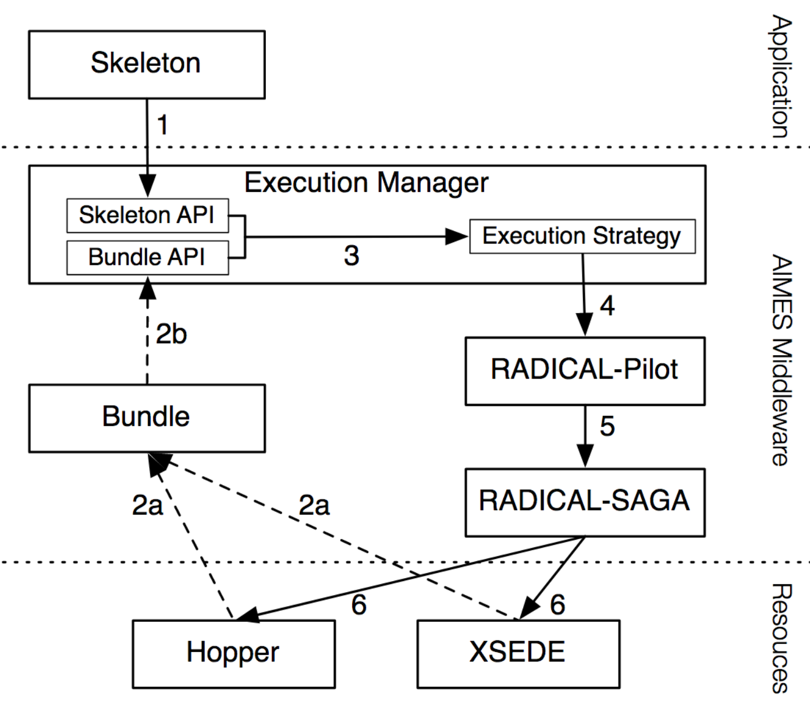

	<figure>
		
		<figcaption>
			<i class="fas fa-award"></i> DOE ASCR, grant numbers: 
			<ul>
				<li>DE-FG02-12ER26115;</li>
				<li>DE-SC0008617;</li>
				<li>DE-SC0008651.</li>
			</ul>
		</figcaption>
	</figure>
	AIMES was a DOE ASCR funded collaborative project among the RADICAL group at Rutgers, University of Minnesota, and the Computation Institute at the University of Chicago. AIMES explored the role of abstractions and integrated middleware to support science at extreme scales. AIMES co-designed middleware from an application and infrastructure perspective, providing abstractions for compute, data and network. These were integrated across multiple levels to provide an interoperable, extensible and scalable middleware stack to support extreme-scale science. AIMES substantially contributed to the design of RADICAL-Pilot, clarifying the properties of the pilot paradigm and its architectural pattern. Further, AIMES laid the foundations for an abstraction-based study of managing the distributed execution of multi-task applications on heterogeneous and dynamic resources.

