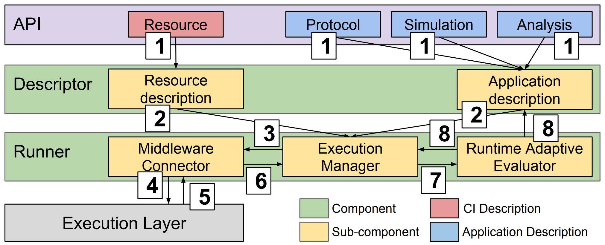

	<figure>
		
		<figcaption>
			<a href="https://github.com/radical-cybertools/htbac">
				<i class="fab fa-github"></i> GitHub
			</a>
			 
			<a href="https://www.nsf.gov/awardsearch/showAward?AWD_ID=1713749">
				<i class="fas fa-award"></i> NSF Award
			</a>
		</figcaption>
	</figure>
	This is a collaborative project that studies a wide range of cancer drugs and candidate ligands. The goal is to support personalized clinical decision-making based on genome sequencing and drug discovery. We use ensemble-based, high-performance computing methods, running automated workflows at unprecedented scales. We developed the <a href="https://github.com/radical-cybertools/htbac"> High-Throughput Binding Affinity Calculator (HTBAC)</a>, integrating of the <a href="https://pubs.acs.org/doi/10.1021/ci8000937">Binding Affinity Calculator (BAC)</a>, developed by the <a href="http://ccs.chem.ucl.ac.uk/"> Centre for Computational Science</a> at UCL, with <a href="https://radical-cybertools.github.io/"> RADICAL-Cybertools</a>, developed by the RADICAL Laboratory at Rutgers University. HTBAC enables rapid, accurate, scalable, reliable and adaptive free energy-based binding affinity calculations, separating the definition of a free energy protocols from its distributed execution. Adaptivity allows users to change the course of execution during runtime, favoring interesting simulations and drug candidates.

