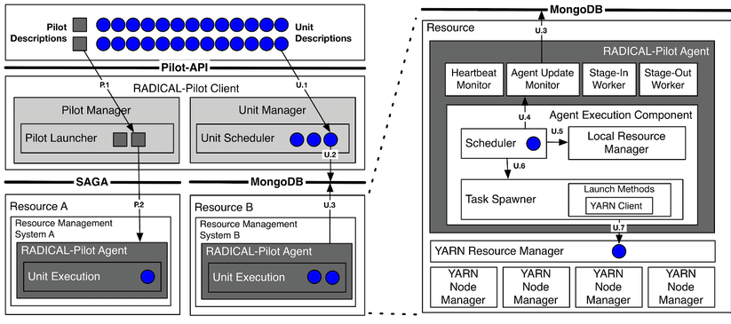

	<figure>
		
		<figcaption>
			<a href="hhttps://github.com/radical-cybertools/midas">
				<i class="fab fa-github"></i> GitHub
			</a>
			 
			<a href="https://www.nsf.gov/awardsearch/showAward?AWD_ID=1443054">
				<i class="fas fa-award"></i> NSF Award
			</a>
		</figcaption>
	</figure>
	Middleware for Data-Intensive Analytics and Science (MIDAS) supports new programming and execution models for data-intensive analysis in a wide range of science and engineering applications. MIDAS provides a scalable runtime system and appropriate resource management abstractions enabling <a href="http://www.spidal.org">SPIDAL</a> libraries. In addition, MIDAS provides the underlying resource management middleware and heterogeneous infrastructure access layer to support streaming-based applications on High Performance Computing resources.

